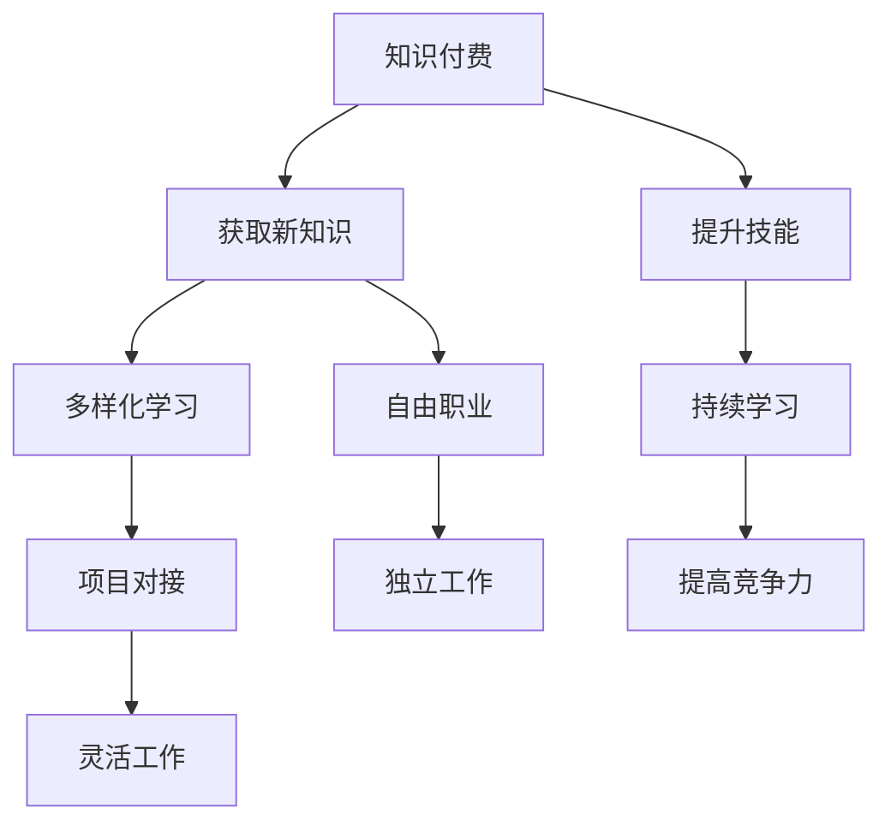

                 

# 知识付费让程序员告别朝九晚五的生活方式

> 关键词：知识付费, 程序员, 自由职业, 技术进步, 持续学习

## 1. 背景介绍

在过去，程序员被认为是一种朝九晚五、工作稳定、生活简单的职业。然而，随着互联网和数字技术的迅猛发展，以及知识付费的兴起，程序员的生活方式正在发生深刻变化。本文将探讨知识付费对程序员的影响，以及如何通过知识付费让程序员告别传统的朝九晚五生活方式。

## 2. 核心概念与联系

### 2.1 核心概念概述

要深入理解知识付费如何影响程序员的生活方式，首先需要明确以下几个核心概念：

- **知识付费**：指消费者为获取特定知识和技能而支付费用的行为。知识付费形式多样，包括在线课程、订阅服务、咨询等。
- **程序员**：指通过编程语言和计算机技术解决实际问题的专业人士。程序员工作具有高技能要求、持续学习需求和灵活工作时间等特点。
- **自由职业**：指个人通过互联网平台接受项目，独立完成工作，不受传统就业形式束缚的工作方式。
- **持续学习**：指个人不断更新知识和技术，以适应快速变化的技术环境。

这些概念之间存在紧密联系，知识付费为程序员提供了获取新知识、提升技能的机会，而自由职业和持续学习则是知识付费带来的直接结果。

### 2.2 核心概念原理和架构的 Mermaid 流程图



这个流程图展示了知识付费对程序员生活方式转变的逻辑关系。通过知识付费，程序员能够获取新知识，提升技能，进入自由职业领域，进行持续学习，获得更多灵活工作机会。

## 3. 核心算法原理 & 具体操作步骤

### 3.1 算法原理概述

知识付费的本质是通过付费获取高质量的知识和技能。对于程序员而言，知识付费不仅能够帮助他们掌握最新技术，还能提供实践机会，促进职业发展。知识付费的算法原理包括以下几个方面：

- **个性化推荐**：通过分析用户的学习行为和偏好，推荐最适合他们的课程和内容。
- **持续学习路径设计**：根据用户的学习进度和反馈，动态调整学习计划，确保学习效果。
- **社区互动**：构建学习社区，促进学员之间的交流和互助，增强学习动力。

### 3.2 算法步骤详解

知识付费平台的核心算法步骤如下：

1. **用户画像构建**：通过用户行为数据、学习记录等构建用户画像，分析其知识水平和兴趣。
2. **课程推荐算法**：利用协同过滤、内容推荐等算法，向用户推荐相关课程和内容。
3. **学习效果评估**：通过在线测试、作业反馈等方式，评估用户的学习效果，调整学习路径。
4. **社区互动优化**：构建知识共享和讨论的社区平台，促进用户之间的互动和学习。

### 3.3 算法优缺点

知识付费算法的优点在于：

- **提高学习效率**：个性化推荐和学习路径设计，使学习更加有针对性和高效性。
- **促进持续学习**：社区互动和反馈机制，保持用户的学习动力和积极性。

其缺点包括：

- **高昂成本**：高质量的知识付费课程价格较高，可能超出部分用户承受范围。
- **信息过载**：课程和内容繁多，用户可能难以选择适合自己的学习资源。

### 3.4 算法应用领域

知识付费算法在多个领域得到了广泛应用，包括但不限于：

- **技术培训**：如编程语言、数据分析、人工智能等课程。
- **职业发展**：如领导力、项目管理、沟通技巧等技能。
- **软技能提升**：如时间管理、决策思维、团队协作等。

## 4. 数学模型和公式 & 详细讲解 & 举例说明

### 4.1 数学模型构建

知识付费平台通常使用以下数学模型进行课程推荐：

- **协同过滤**：利用用户的历史行为数据，通过相似性度量推荐相关课程。
- **基于内容的推荐**：分析课程内容的关键词和主题，推荐相关课程。
- **矩阵分解**：将用户和课程表示为向量，通过矩阵分解计算用户对课程的评分预测。

### 4.2 公式推导过程

以协同过滤算法为例，其基本公式为：

$$
\hat{r}_{ui} = \frac{\sum_{j=1}^N \hat{r}_{uj} \hat{r}_{ij}}{\sqrt{\sum_{j=1}^N \hat{r}_{uj}^2} \sqrt{\sum_{i=1}^N \hat{r}_{ij}^2}}
$$

其中，$r_{ui}$表示用户$u$对课程$i$的预测评分，$N$表示课程总数。

### 4.3 案例分析与讲解

某知识付费平台通过协同过滤算法推荐新用户适合的编程课程。该平台收集了数百万用户的课程评分数据，利用矩阵分解技术，计算用户之间的相似度，进而推荐相关课程。例如，用户A学习了Python基础课程，并在数据分析课程中获得了高分。平台根据用户A的评分和兴趣，推荐用户B也学习Python基础课程，并进一步推荐数据分析进阶课程。

## 5. 项目实践：代码实例和详细解释说明

### 5.1 开发环境搭建

要搭建一个知识付费平台，需要以下开发环境：

- **编程语言**：Python
- **数据库**：MySQL或MongoDB
- **Web框架**：Flask或Django
- **推荐系统框架**：Surprise或Scikit-learn

### 5.2 源代码详细实现

下面是一个简单的知识付费平台课程推荐系统的实现示例：

```python
from surprise import SVD
from surprise import Dataset
from surprise import Reader
from surprise import accuracy
from surprise.model_selection import train_test_split

# 加载数据集
reader = Reader(rating_scale=(1, 5))
data = Dataset.load_from_df(train_df, reader)

# 将数据集分为训练集和测试集
trainset, testset = train_test_split(data, test_size=0.2, random_state=42)

# 构建模型
model = SVD()

# 训练模型
trainset.build_full_trainset()
model.fit(trainset)

# 预测评分
predictions = model.test(testset)

# 评估模型
print("RMSE: ", accuracy.rmse(predictions))
```

### 5.3 代码解读与分析

上述代码实现了基于SVD算法的课程推荐系统。首先，使用Surprise库加载和处理数据集，然后将数据集分为训练集和测试集。接着，构建SVD模型并训练，最后使用测试集评估模型的预测准确度。

## 6. 实际应用场景

### 6.1 技术培训

知识付费在技术培训领域的应用最为广泛。程序员可以通过知识付费平台获取最新的编程语言、框架和技术栈的课程，提升自身的技术水平。例如，在线学习平台的Python、Java、Web开发、人工智能等课程，都是程序员提升技能的重要途径。

### 6.2 职业发展

除了技术培训，知识付费还帮助程序员在职业发展方面取得突破。例如，领导力、项目管理、团队协作等软技能课程，能够提升程序员在职场中的综合能力。知识付费平台通过案例分析、模拟实战等形式，帮助程序员更好地掌握软技能，提高职业竞争力。

### 6.3 自由职业

知识付费还为程序员提供了更多的自由职业机会。程序员可以通过知识付费平台获取项目任务，独立完成工作，获得灵活的工作时间和更高的收入。例如，远程开发、编程外包、技术咨询等自由职业形式，都离不开知识付费平台的支持。

## 7. 工具和资源推荐

### 7.1 学习资源推荐

- **Coursera**：提供大量技术课程，涵盖编程、数据科学、人工智能等领域的知识。
- **Udemy**：提供丰富的技术培训课程，包括Web开发、移动应用开发、云计算等。
- **edX**：提供全球顶级大学和机构的在线课程，涵盖计算机科学、数据科学、软件工程等多个领域。

### 7.2 开发工具推荐

- **GitHub**：全球最大的开源社区，程序员可以通过GitHub获取开源项目和代码，进行学习和实践。
- **GitLab**：提供持续集成(CI)和持续部署(CD)功能，帮助程序员管理代码和部署应用。
- **Visual Studio Code**：流行的代码编辑器，支持多种编程语言和框架。

### 7.3 相关论文推荐

- **《深度学习在推荐系统中的应用》**：介绍了深度学习在推荐系统中的实际应用，包括协同过滤、基于内容的推荐等。
- **《推荐系统的最新进展》**：总结了推荐系统的最新研究进展，包括模型构建、数据处理、用户画像等方面。
- **《知识付费平台的用户行为分析》**：研究了知识付费平台的用户行为，探讨了如何通过数据挖掘和机器学习提高推荐效果。

## 8. 总结：未来发展趋势与挑战

### 8.1 研究成果总结

本文从知识付费的概念出发，探讨了知识付费对程序员生活方式的影响，并通过实际案例和数学模型，分析了知识付费平台的核心算法和技术实现。知识付费为程序员提供了丰富的学习资源和职业发展机会，有助于其摆脱传统的朝九晚五生活方式，实现自由职业和持续学习。

### 8.2 未来发展趋势

未来的知识付费将呈现出以下趋势：

- **个性化推荐**：通过更精准的用户画像和推荐算法，提供更加个性化和高效的学习体验。
- **社区互动**：构建更为活跃的学习社区，促进学员之间的交流和互助。
- **虚拟现实和增强现实**：利用VR/AR技术，提供沉浸式学习体验，增强学习效果。

### 8.3 面临的挑战

尽管知识付费为程序员带来了诸多好处，但也面临着一些挑战：

- **版权问题**：知识付费平台需确保课程版权合法，避免侵权行为。
- **学习效果评估**：如何准确评估学习效果，避免用户在学习过程中产生过大的心理压力。
- **技术更新**：保持课程内容和技术的前沿性，避免用户学习到过时的知识。

### 8.4 研究展望

未来的知识付费研究将聚焦于以下几个方向：

- **自适应学习路径**：根据用户的学习进度和反馈，动态调整学习路径，提供个性化的学习体验。
- **元学习**：利用元学习技术，加速用户对新知识的学习速度和效果。
- **跨平台协同学习**：打破平台限制，实现跨平台的学习和协作。

总之，知识付费为程序员提供了更多学习和发展的机会，有望使其告别传统的朝九晚五生活方式，实现职业自由和持续进步。未来的知识付费平台需要不断创新和优化，才能更好地满足程序员的需求，推动技术进步和产业升级。

## 9. 附录：常见问题与解答

**Q1: 知识付费是否适用于所有程序员？**

A: 知识付费适用于绝大多数程序员，特别是那些希望提升技能和职业发展的程序员。但有些特定领域的程序员，如硬件工程师、网络安全专家等，可能更依赖于实践经验和技术实验，知识付费对其帮助相对较小。

**Q2: 知识付费如何帮助程序员提升技能？**

A: 知识付费通过提供高质量的课程、实战项目和专家指导，帮助程序员掌握最新技术和方法，提升编程能力和项目实践经验。例如，通过学习最新的人工智能、大数据技术，程序员可以更好地适应技术变革，提升职业竞争力。

**Q3: 知识付费是否会影响程序员的收入？**

A: 知识付费对程序员的收入影响主要取决于其选择的学习内容和方式。通过学习提升技能后，程序员可以承担更多高薪职位，从而增加收入。但需要注意的是，知识付费费用较高，需要合理规划学习预算。

**Q4: 知识付费如何帮助程序员进行自由职业？**

A: 知识付费为程序员提供了丰富的项目任务和合作机会，通过知识付费平台，程序员可以获取自由职业项目，独立完成工作，实现灵活工作时间和收入提升。例如，利用知识付费平台的远程开发、编程外包、技术咨询等项目，程序员可以打破时间和空间限制，自由安排工作。

**Q5: 如何选择合适的知识付费平台？**

A: 选择合适的知识付费平台需要考虑其课程质量、平台信誉、用户评价等方面。建议在选择平台时，先试听几节课，了解课程内容和教学质量，再决定是否购买课程。同时，多平台对比，选择性价比高的平台进行学习。

总之，知识付费为程序员提供了丰富的学习资源和职业发展机会，有助于其摆脱传统的朝九晚五生活方式，实现职业自由和持续进步。通过不断学习和实践，程序员可以更好地适应技术变革，提升自身价值，迎接未来的挑战。

