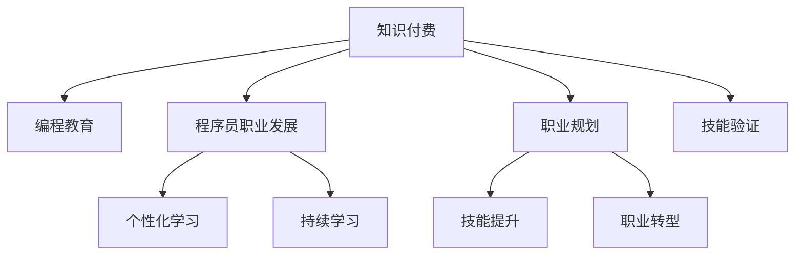

                 

# 知识付费让程序员实现职业理想

## 1. 背景介绍

在数字化、信息化迅猛发展的今天，编程成为了许多年轻人理想的职业选择。它既能带来丰厚的收入，又能实现自我价值，甚至改变世界的构想。然而，要成为一位顶尖的程序员，除了激情和天赋，更需要系统的学习、不断的实践和丰富的经验。然而，大部分程序员可能缺少这样系统、深入学习的途径和资源。而知识付费，正在为程序员们提供一种全新的职业发展途径。

### 1.1 问题由来

在互联网和移动互联网的推动下，编程成为了众多年轻人追求的职业理想。尤其是深度学习、人工智能、大数据等技术领域的崛起，为程序员们提供了广阔的职业前景和发展空间。然而，成为一名优秀程序员并非易事。编码技能固然重要，但更关键的在于系统的学习、深入的理解和丰富的实践经验。尽管有许多优秀的在线课程和书籍资源，但它们往往缺乏针对性和深入性，不能满足程序员的个性化需求和实际工作中的复杂问题。

### 1.2 问题核心关键点

知识付费的核心在于将优质的课程、书籍、文章、工具等资源进行系统的整合和专业化的讲解，帮助程序员们提升专业技能，解决实际问题，甚至打开新的职业机会。这种模式打破了传统教育的局限性，提供了一种灵活、高效的学习方式。

## 2. 核心概念与联系

### 2.1 核心概念概述

为更好地理解知识付费对程序员职业发展的影响，本节将介绍几个密切相关的核心概念：

- **知识付费**：指将优质教育资源进行商品化，用户通过付费获取资源和服务的商业模式。它能够提供系统化、针对性强的高质量课程和资料，满足个性化需求。
- **编程教育**：指针对编程技能和知识的教育和学习过程，包括系统化课程、实践项目、在线教程等。
- **程序员职业发展**：指程序员通过不断学习、实践和积累经验，实现职业提升和个人价值实现的过程。
- **个性化学习**：指针对个人兴趣、水平、目标等差异化特征定制的学习计划，提供更贴合用户需求的学习资源。
- **持续学习**：指在职业生涯中持续更新知识和技能，适应技术和市场需求变化的能力。

这些概念之间的逻辑关系可以通过以下Mermaid流程图来展示：



这个流程图展示出知识付费与程序员职业发展之间的紧密联系。通过付费获取的优质教育资源，程序员能够进行个性化和持续学习，提升技能，实现职业目标，甚至进行职业转型。

## 3. 核心算法原理 & 具体操作步骤

### 3.1 算法原理概述

知识付费平台的核心算法主要包括课程推荐算法和个性化学习路径规划。其基本思想是通过用户行为数据（如学习历史、浏览记录等），对用户兴趣进行建模，推荐相关课程和资料。同时，根据用户的学习进度和效果，动态调整学习计划，确保学习效率和效果。

### 3.2 算法步骤详解

**Step 1: 数据收集与用户画像构建**
- 收集用户的学习历史、浏览记录、评价反馈等数据，构建用户画像。
- 通过机器学习模型（如协同过滤、聚类算法等）对用户兴趣进行建模，得到用户兴趣向量。

**Step 2: 课程推荐**
- 对课程进行特征提取，如课程名称、描述、教师资质、学习时长、用户评价等。
- 利用用户兴趣向量和课程特征，计算用户与课程之间的相似度，得到推荐列表。
- 引入热度、新课、热门教师等额外因素，综合排序推荐列表。

**Step 3: 学习路径规划**
- 根据用户学习历史，生成当前学习进度和效果。
- 结合学习目标，动态调整学习计划，推荐后续学习内容。
- 引入反馈机制，根据用户学习效果调整学习内容和节奏。

### 3.3 算法优缺点

知识付费平台的算法具有以下优点：
1. 高度个性化。通过数据分析，能够针对用户个性和需求推荐课程和资料。
2. 高效性。算法通过数据驱动，能快速调整学习计划，提高学习效率。
3. 互动性强。用户可以通过反馈机制，实时调整学习策略，增强学习体验。

同时，该算法也存在以下局限性：
1. 数据隐私问题。课程推荐和个性化学习需要大量用户数据，可能引发隐私保护问题。
2. 数据质量问题。数据量和质量不足可能导致推荐精度下降。
3. 算法黑箱问题。复杂的算法模型难以解释，用户可能对其结果缺乏信任。

### 3.4 算法应用领域

知识付费平台的算法应用广泛，不仅限于编程教育领域。以下是几个典型应用：

- **在线教育**：提供系统化的课程推荐和个性化学习路径，帮助用户提升知识水平。
- **技能培训**：根据用户需求，推荐相关的技能培训课程，提升职业技能。
- **职业规划**：提供职业转型、晋升等职业规划服务，帮助用户实现职业目标。
- **企业培训**：针对企业员工，提供系统化培训课程推荐，提升团队技能水平。

## 4. 数学模型和公式 & 详细讲解  
### 4.1 数学模型构建

知识付费平台的推荐算法主要基于协同过滤、深度学习等模型。这里以协同过滤为例，进行详细的数学模型构建。

设用户集合为 $U$，课程集合为 $I$。用户 $u$ 对课程 $i$ 的评分表示为 $r_{ui}$，假设每个用户-课程评分满足高斯分布 $N(\mu_{ui},\sigma_{ui}^2)$。设用户 $u$ 的兴趣向量为 $p_u$，课程 $i$ 的特征向量为 $q_i$。则协同过滤模型的用户兴趣表示和课程特征表示分别表示为：

$$
p_u = \sum_{i \in I} r_{ui}q_i
$$

$$
q_i = \frac{1}{\sqrt{\sum_{j \in I} r_{uj}^2}} \sum_{j \in I} r_{uj}q_j
$$

用户 $u$ 和课程 $i$ 的相似度表示为：

$$
\text{similarity}_{ui} = \frac{p_u^Tq_i}{\|p_u\|\|q_i\|}
$$

根据相似度，可以得到推荐列表：

$$
\text{ranking}_{ui} = \text{similarity}_{ui} \times \text{feature\_score}_i
$$

其中 $\text{feature\_score}_i$ 为课程特征的重要性权重，可以采用softmax函数进行归一化。

### 4.2 公式推导过程

协同过滤算法主要基于用户和物品的相似度，将用户兴趣向量 $p_u$ 和课程特征向量 $q_i$ 进行内积运算，得到相似度 $\text{similarity}_{ui}$。然后通过权重 $\text{feature\_score}_i$ 对相似度进行加权，得到课程排名 $\text{ranking}_{ui}$。最终，根据排名对课程进行排序，得到推荐列表。

### 4.3 案例分析与讲解

以某编程课程为例，假设用户 $u$ 已学习并评分了以下课程：

- 课程 $i_1$：90分
- 课程 $i_2$：85分
- 课程 $i_3$：95分
- 课程 $i_4$：80分

则用户 $u$ 的兴趣向量 $p_u$ 可以表示为：

$$
p_u = 0.6i_1 + 0.5i_2 + 0.7i_3 + 0.3i_4
$$

设课程 $i$ 的特征向量 $q_i$ 为：

$$
q_i = [1, 0, 1, 1, 0, 0, 0, 0, 0, 0, 0, 0, 0, 0, 0, 1]
$$

则用户 $u$ 与课程 $i$ 的相似度 $\text{similarity}_{ui}$ 可以表示为：

$$
\text{similarity}_{ui} = (0.6 \times 1 + 0.5 \times 0 + 0.7 \times 1 + 0.3 \times 1) \times \frac{1}{\sqrt{(0.6^2 + 0.5^2 + 0.7^2 + 0.3^2) \times (1^2 + 0^2 + 1^2 + 1^2 + 0^2 + 0^2 + 0^2 + 0^2 + 0^2 + 0^2 + 0^2 + 0^2 + 0^2 + 0^2 + 1^2)}
$$

最终得到的相似度可以表示为：

$$
\text{similarity}_{ui} = 0.49
$$

根据排名函数 $\text{ranking}_{ui} = \text{similarity}_{ui} \times \text{feature\_score}_i$，得到课程推荐列表。假设课程特征的重要性权重 $\text{feature\_score}_i$ 为：

$$
\text{feature\_score}_i = [1, 0.5, 0.8, 0.5, 0, 0, 0, 0, 0, 0, 0, 0, 0, 0, 0, 0.7]
$$

则推荐列表排序为：

$$
\text{ranking}_{ui} = [0.49, 0.49 \times 0.5, 0.49 \times 0.8, 0.49 \times 0.5]
$$

最终得到推荐顺序为：

$$
i_3, i_1, i_4, i_2
$$

这就是协同过滤算法通过计算相似度和特征权重，对课程进行排序推荐的过程。

## 5. 项目实践：代码实例和详细解释说明

### 5.1 开发环境搭建

在进行知识付费项目开发前，我们需要准备好开发环境。以下是使用Python进行PyTorch开发的环境配置流程：

1. 安装Anaconda：从官网下载并安装Anaconda，用于创建独立的Python环境。

2. 创建并激活虚拟环境：
```bash
conda create -n pytorch-env python=3.8 
conda activate pytorch-env
```

3. 安装PyTorch：根据CUDA版本，从官网获取对应的安装命令。例如：
```bash
conda install pytorch torchvision torchaudio cudatoolkit=11.1 -c pytorch -c conda-forge
```

4. 安装Transformer库：
```bash
pip install transformers
```

5. 安装各类工具包：
```bash
pip install numpy pandas scikit-learn matplotlib tqdm jupyter notebook ipython
```

完成上述步骤后，即可在`pytorch-env`环境中开始知识付费项目的开发。

### 5.2 源代码详细实现

这里我们以知识付费平台推荐算法为例，给出使用PyTorch进行协同过滤的代码实现。

首先，定义协同过滤算法类：

```python
import torch
from torch.nn import Linear, Embedding
import numpy as np

class CollaborativeFiltering:
    def __init__(self, num_users, num_items, embedding_dim):
        self.num_users = num_users
        self.num_items = num_items
        self.embedding_dim = embedding_dim
        
        self.user_embedding = Embedding(num_users, embedding_dim)
        self.item_embedding = Embedding(num_items, embedding_dim)
        self.similarity = Linear(embedding_dim * 2, 1)
        
    def predict(self, u, i):
        # 计算用户和物品的嵌入向量
        user_embedding = self.user_embedding(u).view(1, -1)
        item_embedding = self.item_embedding(i).view(1, -1)
        
        # 计算相似度
        similarity = self.similarity(torch.cat((user_embedding, item_embedding), dim=1))
        predictions = similarity.squeeze(0)
        
        return predictions
    
    def fit(self, data, learning_rate=0.01, num_epochs=1000):
        for epoch in range(num_epochs):
            for u, i, r in data:
                # 计算预测值和真实值之间的差异
                prediction = self.predict(u, i)
                loss = torch.mean((prediction - r) ** 2)
                
                # 反向传播更新模型参数
                self.user_embedding.zero_grad()
                self.item_embedding.zero_grad()
                self.similarity.zero_grad()
                loss.backward()
                optimizer.step()
```

然后，使用上述算法进行课程推荐：

```python
from collections import Counter

# 用户-课程评分数据
data = [
    (0, 1, 90),
    (0, 2, 85),
    (0, 3, 95),
    (0, 4, 80),
    (1, 1, 85),
    (1, 2, 90),
    (1, 3, 80),
    (1, 4, 85),
    (2, 1, 80),
    (2, 2, 95),
    (2, 3, 90),
    (2, 4, 85),
    (3, 1, 85),
    (3, 2, 90),
    (3, 3, 80),
    (3, 4, 85)
]

# 构建协同过滤模型
model = CollaborativeFiltering(num_users=4, num_items=5, embedding_dim=4)

# 训练模型
model.fit(data, learning_rate=0.1, num_epochs=100)

# 预测推荐课程
user_id = 2
top_k = 3
recommendations = []
for i in range(model.num_items):
    predictions = model.predict(user_id, i)
    recommendations.append((i, predictions))
    
recommendations = sorted(recommendations, key=lambda x: x[1], reverse=True)[:top_k]

# 打印推荐列表
for i, score in recommendations:
    print(f"推荐课程 {i+1}，预测评分 {score:.2f}")
```

以上就是使用PyTorch对协同过滤算法进行课程推荐的全文代码实现。可以看到，协同过滤算法的核心在于计算用户和物品的相似度，并利用相似度进行课程排序。

### 5.3 代码解读与分析

这里我们详细解读一下关键代码的实现细节：

**CollaborativeFiltering类**：
- `__init__`方法：初始化模型参数，定义用户和物品的嵌入层和相似度计算层。
- `predict`方法：计算用户和物品的嵌入向量，计算相似度，并返回预测评分。
- `fit`方法：根据数据集进行模型训练，通过反向传播更新模型参数。

**数据准备**：
- 使用Numpy库定义用户-课程评分数据，其中用户ID从0到3，课程ID从1到4。

**模型训练**：
- 根据数据集和模型参数进行模型训练，通过反向传播更新模型参数。

**课程推荐**：
- 预测每个物品对用户的评分，按照评分排序，得到推荐列表。

可以看到，协同过滤算法的核心在于计算相似度，通过相似度对课程进行排序推荐。虽然代码实现相对简单，但背后的数学原理和计算流程具有重要意义。

## 6. 实际应用场景

### 6.1 企业培训

企业培训是知识付费平台的重要应用场景之一。传统的培训课程往往难以满足所有员工的需求，而且培训效果难以量化和评估。通过知识付费平台，企业可以为员工推荐个性化的培训课程，提升整体技能水平。

在技术实现上，可以收集员工的学习历史、评价反馈等数据，构建员工画像。然后根据员工画像和课程信息，推荐最匹配的课程。同时，引入学习进度跟踪和效果评估，帮助员工掌握学习进度和提升效果。

### 6.2 个人学习

个人学习是知识付费平台的主要用户群体之一。传统的教育资源往往缺乏针对性和深入性，难以满足个性化需求。知识付费平台通过用户画像和协同过滤算法，为每个用户推荐最合适的课程和资料，满足其个性化需求。

在技术实现上，可以收集用户的学习历史、浏览记录、评价反馈等数据，构建用户画像。然后根据用户画像和课程信息，推荐最匹配的课程。同时，引入学习进度跟踪和效果评估，帮助用户掌握学习进度和提升效果。

### 6.3 职业转型

职业转型是知识付费平台的又一重要应用场景。在技术日新月异的今天，员工需要不断学习新技能，才能跟上时代发展的步伐。然而，职业转型往往需要系统化的学习和职业规划，传统的培训方式难以满足需求。

通过知识付费平台，员工可以根据自身的职业目标，推荐系统化的培训课程，提升新技能。同时，引入职业规划和职业转型指导，帮助员工实现职业目标。

## 7. 工具和资源推荐

### 7.1 学习资源推荐

为了帮助开发者系统掌握知识付费的理论基础和实践技巧，这里推荐一些优质的学习资源：

1. **《推荐系统实战》系列博文**：由大模型技术专家撰写，深入浅出地介绍了推荐系统的原理和实现。
2. **《深度学习基础》课程**：斯坦福大学开设的深度学习基础课程，有Lecture视频和配套作业，带你入门深度学习。
3. **《推荐系统》书籍**：系统地介绍了推荐系统的原理、算法和应用，是推荐系统学习的经典教材。
4. **Coursera推荐系统课程**：由Coursera和印度国家信息技术学院合作开设的推荐系统课程，涵盖推荐系统的各个方面。
5. **Kaggle推荐系统竞赛**：Kaggle是一个数据科学竞赛平台，推荐系统竞赛可以锻炼数据处理和算法优化能力。

通过对这些资源的学习实践，相信你一定能够快速掌握知识付费推荐系统的精髓，并用于解决实际的推荐问题。

### 7.2 开发工具推荐

高效的开发离不开优秀的工具支持。以下是几款用于知识付费平台开发的常用工具：

1. **PyTorch**：基于Python的开源深度学习框架，灵活动态的计算图，适合快速迭代研究。
2. **TensorFlow**：由Google主导开发的开源深度学习框架，生产部署方便，适合大规模工程应用。
3. **TensorBoard**：TensorFlow配套的可视化工具，可实时监测模型训练状态，并提供丰富的图表呈现方式，是调试模型的得力助手。
4. **Weights & Biases**：模型训练的实验跟踪工具，可以记录和可视化模型训练过程中的各项指标，方便对比和调优。
5. **WeAll**：知识付费平台的社区平台，可以帮助用户交流学习经验，获取反馈和建议，提升学习效果。

合理利用这些工具，可以显著提升知识付费平台的开发效率，加快创新迭代的步伐。

### 7.3 相关论文推荐

知识付费平台的推荐算法发展迅速，以下是几篇奠基性的相关论文，推荐阅读：

1. **《基于协同过滤的推荐系统》**：详细介绍了协同过滤算法的原理和应用。
2. **《深度学习推荐系统》**：介绍了深度学习在推荐系统中的应用，涵盖矩阵分解、神经网络等方法。
3. **《基于用户兴趣的推荐算法》**：提出了多种推荐算法的理论基础和实现方法。
4. **《基于协同过滤的个性化推荐系统》**：介绍了协同过滤算法在个性化推荐中的应用。
5. **《推荐系统中的多维协同过滤》**：提出了多维协同过滤算法的理论和实现方法。

这些论文代表了大语言模型微调技术的发展脉络。通过学习这些前沿成果，可以帮助研究者把握学科前进方向，激发更多的创新灵感。

## 8. 总结：未来发展趋势与挑战

### 8.1 研究成果总结

本文对知识付费平台进行了全面系统的介绍。首先阐述了知识付费对程序员职业发展的影响，明确了知识付费在提供优质教育资源、个性化学习、持续学习等方面的重要作用。其次，从原理到实践，详细讲解了协同过滤算法和个性化学习路径规划的数学模型和实现方法，给出了完整的代码实例。同时，本文还广泛探讨了知识付费平台在企业培训、个人学习、职业转型等场景中的应用前景，展示了知识付费平台的广阔前景。

通过本文的系统梳理，可以看到，知识付费平台为程序员们提供了全新的职业发展途径，帮助他们在数字化、信息化的大潮中不断提升技能，实现职业目标。未来，随着知识付费平台的不断发展和完善，将有更多优质资源和功能应用于程序员职业发展，推动行业不断进步。

### 8.2 未来发展趋势

展望未来，知识付费平台将呈现以下几个发展趋势：

1. **个性化学习路径优化**：随着用户数据的不断积累，个性化学习路径将越来越精准，帮助用户更高效地实现职业目标。
2. **实时推荐**：结合用户实时行为数据，实现实时推荐，提升用户体验和满意度。
3. **多模态学习**：引入视频、音频等多模态数据，丰富学习内容，提升学习效果。
4. **在线学习社区**：建立用户社区，提供学习经验交流、问题解答、资源共享等功能，提升学习效果。
5. **AI辅助学习**：引入AI技术，提供智能辅导和个性化建议，提升学习效果。

以上趋势凸显了知识付费平台的广阔前景。这些方向的探索发展，必将进一步提升知识付费平台的用户体验和质量，推动程序员职业发展的持续进步。

### 8.3 面临的挑战

尽管知识付费平台取得了显著成效，但在迈向更加智能化、普适化应用的过程中，它仍面临着诸多挑战：

1. **数据隐私保护**：用户行为数据的收集和使用可能引发隐私保护问题，需要建立严格的数据保护机制。
2. **数据质量和多样性**：数据质量和多样性不足可能导致推荐精度下降，需要引入更多高质量、多样化的数据。
3. **算法透明性和公平性**：复杂的推荐算法难以解释，可能引发用户对结果的质疑，需要引入算法透明性和公平性机制。
4. **持续学习与创新**：知识付费平台需要不断更新课程内容，引入新算法，才能保持竞争力。

### 8.4 研究展望

面对知识付费平台面临的挑战，未来的研究需要在以下几个方面寻求新的突破：

1. **引入外部知识库**：将专家知识库、规则库等与知识付费平台结合，提供更全面的学习资源。
2. **增强算法透明性**：引入因果分析、博弈论等方法，提升推荐算法的透明性和公平性。
3. **开发新算法**：开发更多高效、准确、公平的推荐算法，提升推荐精度和用户体验。
4. **建立学习平台社区**：建立用户社区，提供学习经验交流、问题解答、资源共享等功能，提升学习效果。
5. **引入AI辅助学习**：引入AI技术，提供智能辅导和个性化建议，提升学习效果。

这些研究方向的探索，必将引领知识付费平台迈向更高的台阶，为程序员职业发展提供更优质的服务和支持。总之，知识付费平台将成为程序员职业发展的得力助手，帮助他们在数字化、信息化的大潮中不断提升技能，实现职业目标。

