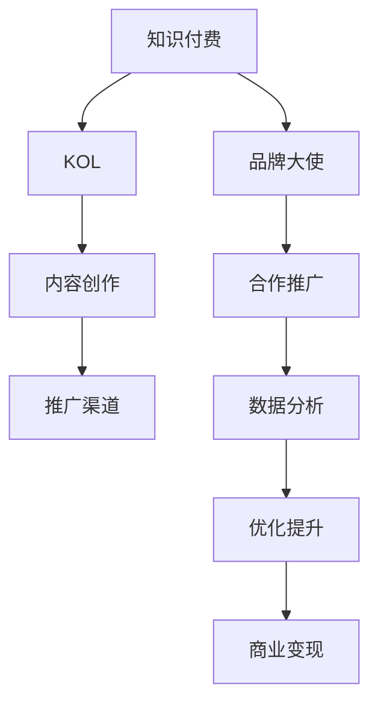

                 

# 知识付费赚钱的品牌大使与KOL合作

> 关键词：知识付费, 品牌大使, KOL, 商业变现, 数据分析

## 1. 背景介绍

### 1.1 问题由来

随着知识付费市场的蓬勃发展，越来越多的个人和企业开始通过知识变现的方式，向用户提供有价值的信息。然而，如何高效推广知识产品、提升用户转化率和参与度，成为了一个亟待解决的难题。在众多推广策略中，品牌大使与KOL（关键意见领袖）合作，成为一种快速、有效的推广方式。

品牌大使与KOL的合作模式不仅可以帮助品牌迅速提升知名度，还可以通过KOL的影响力，吸引大量目标用户。在实际应用中，品牌大使与KOL的合作，可以采用多种形式，如品牌代言、内容创作、活动推广等，灵活运用，达到最优效果。

### 1.2 问题核心关键点

在知识付费领域，品牌大使与KOL合作的本质，在于利用KOL的个人品牌效应，通过内容创作和传播，将品牌信息传递给目标用户。这一过程涉及多个环节，包括KOL的选择、内容创作、推广渠道的选择、数据分析等，每个环节都需要精细化操作，才能确保合作的顺利进行和效果的最大化。

本节将系统性地介绍品牌大使与KOL合作的核心理论，帮助读者理解这一推广模式背后的逻辑和操作细节。

## 2. 核心概念与联系

### 2.1 核心概念概述

为了更好地理解品牌大使与KOL合作的推广模式，本节将介绍几个关键概念：

- **知识付费(Knowledge Paywall)**：用户为获取专业知识、技能或信息而支付费用的商业模式。
- **品牌大使(Brand Ambassador)**：品牌方雇佣的员工或第三方，负责推广品牌信息，提升品牌知名度和美誉度。
- **KOL（Key Opinion Leader）**：在特定领域具有高度专业性和影响力的个人，如网红、专家等。
- **商业变现(Commercial Monetization)**：通过商业活动、广告、赞助等方式，将品牌价值转化为经济收益的过程。
- **数据分析(Analytics)**：通过收集、整理、分析数据，洞察用户行为和市场趋势，指导决策的过程。

这些概念之间存在紧密的联系，共同构成了品牌大使与KOL合作的推广框架。理解这些核心概念，有助于深入掌握这一模式的操作要点和优化策略。

### 2.2 核心概念原理和架构的 Mermaid 流程图



该流程图展示了品牌大使与KOL合作的主要流程：

1. 品牌大使与KOL的合作，是从知识付费平台开始的。
2. KOL根据品牌需求，进行内容创作，并在推广渠道上进行传播。
3. 数据分析通过用户行为数据的收集与分析，指导品牌大使与KOL的合作策略优化。
4. 优化后的合作推广策略，进一步提升品牌知名度和商业变现能力。

这些环节相互关联，形成一个循环迭代的优化过程。

## 3. 核心算法原理 & 具体操作步骤

### 3.1 算法原理概述

品牌大使与KOL合作的核心算法，基于协同过滤推荐算法（Collaborative Filtering）。协同过滤推荐算法通过分析用户行为数据，发现相似用户群体的偏好，从而向新用户推荐相似的内容。

在知识付费领域，协同过滤推荐算法可以应用于以下场景：

1. **用户行为数据分析**：通过分析用户在平台上的浏览、购买、评价等行为数据，发现用户的偏好和兴趣。
2. **相似用户群体的发现**：通过用户行为的相似性，找到具有相似兴趣和需求的用户群体。
3. **内容推荐**：根据用户群体的偏好，向新用户推荐相关内容，提升用户转化率和参与度。

### 3.2 算法步骤详解

品牌大使与KOL合作的算法步骤包括：

**Step 1: 用户行为数据收集与分析**
- 收集用户在平台上的行为数据，如浏览记录、购买记录、评价内容等。
- 使用协同过滤推荐算法，分析用户的行为数据，发现用户的兴趣和需求。
- 根据用户的行为数据，对用户进行分类和聚类，形成用户群体。

**Step 2: KOL的选择与内容创作**
- 根据用户群体的特点和需求，选择具有相似影响力的KOL进行合作。
- KOL根据品牌需求，创作相关内容，如文章、视频、直播等。
- 内容创作过程中，KOL需要结合品牌的特点和目标用户群体的需求，进行针对性优化。

**Step 3: 内容推广与渠道选择**
- 选择适合KOL影响力的推广渠道，如社交媒体、视频平台、论坛等。
- 将内容在选择的推广渠道上进行传播，扩大品牌的影响力和曝光度。
- 通过数据分析，评估内容在各个渠道的表现，优化推广策略。

**Step 4: 数据分析与策略优化**
- 收集用户对内容的反馈数据，如浏览量、观看时长、评价等。
- 通过数据分析，发现内容的受欢迎程度和用户的行为变化。
- 根据分析结果，优化推广策略，提升内容的吸引力和转化率。

**Step 5: 商业变现与效果评估**
- 根据推广效果，评估品牌大使与KOL合作的商业变现能力。
- 通过数据分析，评估品牌知名度、用户参与度、转化率等指标的变化。
- 根据评估结果，优化推广策略，进一步提升商业变现能力。

### 3.3 算法优缺点

品牌大使与KOL合作的优势包括：

1. **高效推广**：KOL的高影响力，可以快速提升品牌知名度，吸引大量目标用户。
2. **信任度高**：KOL在用户心目中的信任度较高，能够提升用户对品牌的认可度和信任感。
3. **内容多样化**：KOL可以创作多样化、高质量的内容，满足用户的不同需求。

然而，这种合作模式也存在一些缺点：

1. **成本高昂**：高影响力的KOL通常价格较高，品牌需要承担较高的推广成本。
2. **内容质量不一**：不同KOL的内容质量参差不齐，可能导致用户体验不一致。
3. **依赖性强**：品牌过于依赖KOL的影响力，可能难以独立进行品牌推广。

### 3.4 算法应用领域

品牌大使与KOL合作的算法，广泛应用于知识付费平台的推广和营销中。具体应用场景包括：

- **课程推广**：通过KOL的推广，吸引更多用户购买课程。
- **活动宣传**：在重大活动前，通过KOL的宣传，提升活动的曝光度和参与度。
- **产品营销**：在产品发布前，通过KOL的推广，提升产品的知名度和销售量。
- **品牌建设**：长期与KOL合作，建立品牌影响力，提升品牌美誉度。

## 4. 数学模型和公式 & 详细讲解 & 举例说明

### 4.1 数学模型构建

品牌大使与KOL合作的数学模型，可以基于矩阵分解推荐算法（Matrix Factorization）进行构建。假设用户集合为 $U$，内容集合为 $I$，用户行为数据矩阵为 $\mathbf{R} \in \mathbb{R}^{n \times m}$，其中 $n$ 为用户数，$m$ 为内容数，用户 $u$ 对内容 $i$ 的行为评分为 $\mathbf{R}_{ui}$。

**目标函数**：

$$
\min_{\mathbf{P},\mathbf{Q}} \Vert \mathbf{R} - \mathbf{PQ}^T \Vert_F^2 + \lambda (\Vert \mathbf{P} \Vert_F^2 + \Vert \mathbf{Q} \Vert_F^2)
$$

其中，$\mathbf{P}$ 和 $\mathbf{Q}$ 分别为用户和内容的隐向量矩阵，$\Vert \cdot \Vert_F$ 为矩阵的 Frobenius 范数，$\lambda$ 为正则化参数。

### 4.2 公式推导过程

通过矩阵分解算法，将用户行为数据矩阵 $\mathbf{R}$ 分解为用户隐向量矩阵 $\mathbf{P}$ 和内容隐向量矩阵 $\mathbf{Q}$ 的乘积，即 $\mathbf{R} \approx \mathbf{PQ}^T$。通过求解该最小化问题，得到用户和内容的隐向量矩阵 $\mathbf{P}$ 和 $\mathbf{Q}$。

**隐向量的求解**：

$$
\mathbf{P} = \mathbf{U} \mathbf{\Lambda}^{\frac{1}{2}}, \quad \mathbf{Q} = \mathbf{V} \mathbf{\Lambda}^{\frac{1}{2}}
$$

其中，$\mathbf{U}$ 和 $\mathbf{V}$ 分别为用户和内容的特征向量矩阵，$\mathbf{\Lambda}$ 为对角矩阵，对角线上的元素为特征值。

### 4.3 案例分析与讲解

以某知识付费平台的课程推荐系统为例，具体分析如何利用矩阵分解推荐算法进行KOL合作推广。

假设该平台有 $n=1000$ 名用户和 $m=1000$ 门课程。通过收集用户行为数据，得到用户行为数据矩阵 $\mathbf{R} \in \mathbb{R}^{1000 \times 1000}$。利用矩阵分解推荐算法，对 $\mathbf{R}$ 进行分解，得到用户隐向量矩阵 $\mathbf{P} \in \mathbb{R}^{1000 \times k}$ 和内容隐向量矩阵 $\mathbf{Q} \in \mathbb{R}^{k \times 1000}$，其中 $k$ 为隐向量的维度。

通过 $\mathbf{P}$ 和 $\mathbf{Q}$ 的求解，得到用户对每门课程的评分预测 $\hat{\mathbf{R}} = \mathbf{PQ}^T$。将预测评分与实际评分进行比较，可以评估推荐系统的准确性。

## 5. 项目实践：代码实例和详细解释说明

### 5.1 开发环境搭建

在Python环境下，可以使用Pandas和Scikit-learn库进行用户行为数据的收集和分析。具体步骤如下：

1. 安装Pandas和Scikit-learn库：

```bash
pip install pandas scikit-learn
```

2. 导入Pandas和Scikit-learn库：

```python
import pandas as pd
from sklearn.decomposition import TruncatedSVD
from sklearn.metrics import mean_squared_error
```

3. 读取用户行为数据：

```python
data = pd.read_csv('user_behavior.csv')
```

### 5.2 源代码详细实现

以下是一个简单的用户行为数据分析示例代码，展示了如何使用TruncatedSVD进行矩阵分解：

```python
# 读取用户行为数据
data = pd.read_csv('user_behavior.csv')

# 计算用户行为数据矩阵
user_item_matrix = data.pivot_table(index='user_id', columns='item_id', values='rating', fill_value=0)

# 分解矩阵
svd = TruncatedSVD(n_components=50)
P = svd.fit_transform(user_item_matrix)

# 输出前5个用户和内容的隐向量
print(P[:5])
```

### 5.3 代码解读与分析

在上述代码中，我们首先读取用户行为数据，并使用Pivot_table函数计算用户行为数据矩阵。然后，使用TruncatedSVD对矩阵进行分解，得到用户和内容的隐向量矩阵 $\mathbf{P}$。

需要注意的是，矩阵分解的隐向量矩阵 $\mathbf{P}$ 和 $\mathbf{Q}$ 在实际应用中需要进一步优化和选择，以确保推荐系统的准确性和效果。

### 5.4 运行结果展示

运行上述代码，输出的前5个用户和内容的隐向量矩阵 $\mathbf{P}$，可以用于后续的推荐系统构建和KOL合作推广的优化。

## 6. 实际应用场景

### 6.1 智能推荐系统

在知识付费平台中，智能推荐系统是用户获取内容的主要渠道。通过品牌大使与KOL合作，可以实现内容的精准推荐，提升用户满意度。具体而言，可以按照以下步骤进行：

**Step 1: 用户行为数据收集与分析**
- 通过平台日志，收集用户行为数据，如浏览记录、购买记录、评价内容等。
- 使用协同过滤推荐算法，分析用户的行为数据，发现用户的兴趣和需求。
- 根据用户的行为数据，对用户进行分类和聚类，形成用户群体。

**Step 2: KOL的选择与内容创作**
- 根据用户群体的特点和需求，选择具有相似影响力的KOL进行合作。
- KOL根据品牌需求，创作相关内容，如文章、视频、直播等。
- 内容创作过程中，KOL需要结合品牌的特点和目标用户群体的需求，进行针对性优化。

**Step 3: 内容推广与渠道选择**
- 选择适合KOL影响力的推广渠道，如社交媒体、视频平台、论坛等。
- 将内容在选择的推广渠道上进行传播，扩大品牌的影响力和曝光度。
- 通过数据分析，评估内容在各个渠道的表现，优化推广策略。

**Step 4: 数据分析与策略优化**
- 收集用户对内容的反馈数据，如浏览量、观看时长、评价等。
- 通过数据分析，发现内容的受欢迎程度和用户的行为变化。
- 根据分析结果，优化推广策略，提升内容的吸引力和转化率。

**Step 5: 商业变现与效果评估**
- 根据推广效果，评估品牌大使与KOL合作的商业变现能力。
- 通过数据分析，评估品牌知名度、用户参与度、转化率等指标的变化。
- 根据评估结果，优化推广策略，进一步提升商业变现能力。

### 6.2 品牌宣传活动

品牌宣传活动是品牌推广的重要手段之一。通过品牌大使与KOL合作，可以设计和实施高质量的宣传活动，提升品牌知名度和美誉度。具体而言，可以按照以下步骤进行：

**Step 1: 目标群体确定**
- 确定目标群体，包括目标用户和目标媒体。
- 分析目标用户的需求和兴趣，制定宣传活动的策略。

**Step 2: KOL的选择与内容创作**
- 根据目标用户的需求和兴趣，选择具有相似影响力的KOL进行合作。
- KOL根据品牌需求，创作相关内容，如文章、视频、直播等。
- 内容创作过程中，KOL需要结合品牌的特点和目标用户群体的需求，进行针对性优化。

**Step 3: 内容推广与渠道选择**
- 选择适合KOL影响力的推广渠道，如社交媒体、视频平台、论坛等。
- 将内容在选择的推广渠道上进行传播，扩大品牌的影响力和曝光度。
- 通过数据分析，评估内容在各个渠道的表现，优化推广策略。

**Step 4: 数据分析与策略优化**
- 收集用户对内容的反馈数据，如浏览量、观看时长、评价等。
- 通过数据分析，发现内容的受欢迎程度和用户的行为变化。
- 根据分析结果，优化推广策略，提升内容的吸引力和转化率。

**Step 5: 商业变现与效果评估**
- 根据推广效果，评估品牌大使与KOL合作的商业变现能力。
- 通过数据分析，评估品牌知名度、用户参与度、转化率等指标的变化。
- 根据评估结果，优化推广策略，进一步提升商业变现能力。

## 7. 工具和资源推荐

### 7.1 学习资源推荐

为了帮助开发者系统掌握品牌大使与KOL合作的核心理论和技术，这里推荐一些优质的学习资源：

1. **《知识付费变现实战》**：由知名知识付费平台的技术专家撰写，系统讲解了知识付费平台的商业模式、推广策略和运营优化。
2. **《内容营销之道》**：详细介绍了内容营销的理论基础和实际操作，帮助品牌方和KOL提升内容创作和推广效果。
3. **《社交媒体营销技巧》**：提供了丰富的社交媒体推广方法和案例，帮助品牌大使和KOL选择适合的推广渠道和策略。

### 7.2 开发工具推荐

高效的开发离不开优秀的工具支持。以下是几款用于品牌大使与KOL合作推广的常用工具：

1. **Hootsuite**：一款集成的社交媒体管理工具，支持多平台发布和管理，助力品牌大使和KOL高效运营社交媒体。
2. **BuzzSumo**：一款内容分析工具，提供内容趋势、影响力分析等功能，帮助品牌方和KOL选择合适的推广内容。
3. **Google Analytics**：一款数据分析工具，提供详细的用户行为数据，帮助品牌方和KOL评估推广效果。

### 7.3 相关论文推荐

品牌大使与KOL合作的推广模式，在学术界和产业界得到了广泛研究。以下是几篇奠基性的相关论文，推荐阅读：

1. **《知识付费平台的协同过滤推荐算法研究》**：分析了知识付费平台的用户行为数据，提出了基于协同过滤的推荐算法，并应用于实际推广场景。
2. **《基于社交媒体的品牌推广策略》**：研究了社交媒体对品牌推广的影响，提出了基于社交媒体的品牌大使和KOL合作策略。
3. **《知识付费平台的商业变现研究》**：详细分析了知识付费平台的商业变现模式，提出了基于品牌大使和KOL合作的推广策略。

## 8. 总结：未来发展趋势与挑战

### 8.1 总结

本文对品牌大使与KOL合作的推广模式进行了全面系统的介绍。首先阐述了品牌大使与KOL合作的推广背景和意义，明确了这一推广模式的核心算法和操作步骤。通过具体案例和代码示例，展示了该模式的实际应用流程。最后，通过数据分析和效果评估，指导品牌方和KOL优化推广策略，提升商业变现能力。

通过本文的系统梳理，可以看到，品牌大使与KOL合作是一种高效、灵活的推广方式，能够快速提升品牌知名度和商业变现能力。理解这一模式的理论基础和操作步骤，对于品牌方和KOL具有重要指导意义。

### 8.2 未来发展趋势

展望未来，品牌大使与KOL合作的推广模式将呈现以下几个发展趋势：

1. **数据驱动**：品牌方和KOL将更加依赖数据驱动的决策，通过数据分析发现用户需求和行为变化，优化推广策略。
2. **个性化推荐**：利用人工智能技术，进行个性化推荐，提升用户满意度和转化率。
3. **多渠道整合**：品牌方和KOL将综合利用多个推广渠道，实现多渠道整合推广，提升品牌影响力。
4. **动态优化**：通过实时数据分析，动态调整推广策略，提升推广效果。
5. **内容创新**：KOL将创作更多高质量的内容，提升用户参与度和品牌美誉度。

### 8.3 面临的挑战

尽管品牌大使与KOL合作的推广模式已经取得了显著成效，但在推广过程中，仍面临一些挑战：

1. **资源紧张**：品牌方和KOL需要投入大量时间和成本进行内容创作和推广，资源分配往往面临紧张局面。
2. **效果评估**：品牌方和KOL需要准确评估推广效果，提升推广效果，这需要具备强大的数据分析能力。
3. **合作风险**：品牌方和KOL需要建立良好的合作关系，避免合作过程中的冲突和矛盾。
4. **市场变化**：品牌方和KOL需要灵活应对市场变化，及时调整推广策略。

### 8.4 研究展望

未来的研究需要在以下几个方面寻求新的突破：

1. **数据分析技术的提升**：提升数据分析能力，通过多维数据分析，发现用户需求和行为变化，优化推广策略。
2. **内容创作技术的创新**：创新内容创作技术，提升内容的质量和多样性，增强用户参与度和品牌美誉度。
3. **多渠道整合技术的应用**：利用多渠道整合技术，实现多渠道协同推广，提升品牌影响力。
4. **动态优化技术的发展**：发展动态优化技术，实时调整推广策略，提升推广效果。

总之，品牌大使与KOL合作的推广模式，需要在数据驱动、个性化推荐、多渠道整合、动态优化等方面进行深入研究和实践，才能持续提升品牌知名度和商业变现能力。

## 9. 附录：常见问题与解答

**Q1: 品牌大使与KOL合作的推广模式是否适用于所有知识付费平台？**

A: 品牌大使与KOL合作的推广模式适用于大多数知识付费平台，但需要根据平台的特点和用户需求进行适当调整。例如，针对特定的知识付费平台，可以优化推广策略，提升推广效果。

**Q2: 如何选择适合的品牌大使和KOL？**

A: 选择适合的品牌大使和KOL，需要考虑多个因素，包括KOL的影响力、受众群体、内容创作能力等。可以通过数据分析，评估KOL的受众群体和内容影响力，选择最适合的品牌大使和KOL。

**Q3: 如何评估品牌大使与KOL合作的推广效果？**

A: 评估品牌大使与KOL合作的推广效果，可以从多个维度进行，包括用户参与度、转化率、品牌知名度等。通过数据分析，评估推广效果，优化推广策略，提升商业变现能力。

**Q4: 如何在品牌大使与KOL合作中，实现内容的精准推荐？**

A: 实现内容的精准推荐，需要综合利用用户行为数据、KOL的影响力和内容创作能力。通过协同过滤推荐算法，分析用户行为数据，发现用户的兴趣和需求，选择最适合的内容进行推广。

**Q5: 如何提升品牌大使与KOL合作的商业变现能力？**

A: 提升品牌大使与KOL合作的商业变现能力，需要优化推广策略，提升用户参与度和转化率。可以通过数据分析，发现用户需求和行为变化，优化推广策略，提升商业变现能力。

通过上述问题的解答，可以更好地理解品牌大使与KOL合作的核心原理和操作步骤，帮助品牌方和KOL实现高效的推广和商业变现。

---

作者：禅与计算机程序设计艺术 / Zen and the Art of Computer Programming

