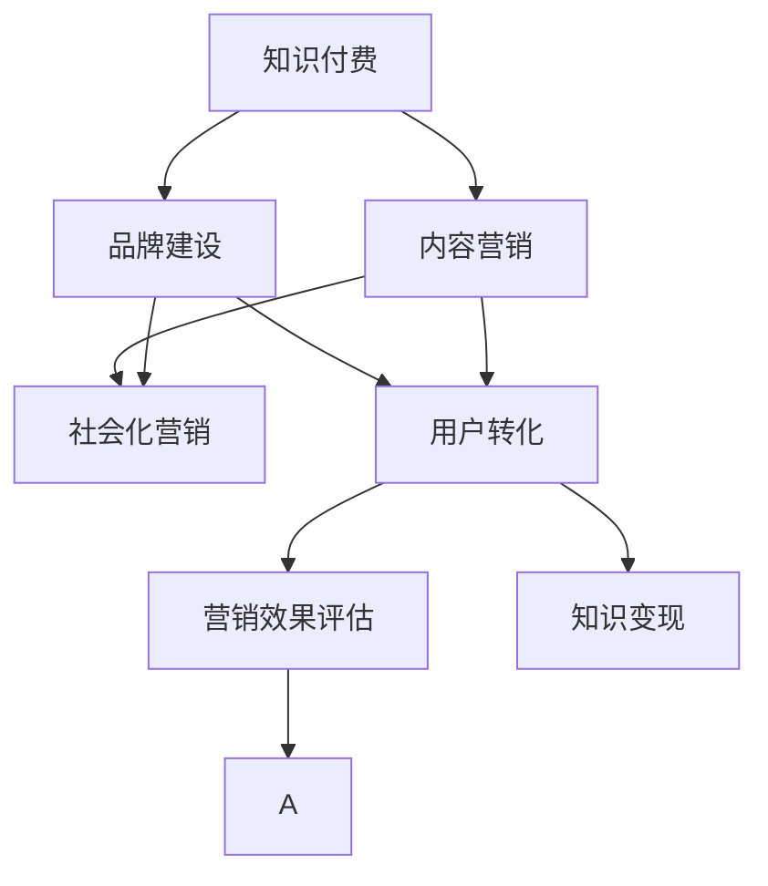

                 

# 知识付费赚钱的品牌社会化营销与内容营销策略

> 关键词：知识付费,品牌社会化,内容营销策略,知识变现,品牌建设,内容创新,用户转化,营销效果评估

## 1. 背景介绍

### 1.1 问题由来

在信息爆炸的互联网时代，知识付费正成为一种重要的信息获取方式。近年来，以得到、知乎、喜马拉雅为代表的知识付费平台迅速崛起，汇聚了众多优质的课程和内容创作者，吸引了大量用户付费订阅。然而，知识付费市场的竞争也日益激烈，用户需求愈发多样化，传统的“内容为王”策略已经难以满足市场需求。

面对这一挑战，知识付费平台和企业需要重新审视品牌建设、内容营销的策略，探索有效的营销手段，以实现知识变现的最大化。本文旨在通过详细剖析知识付费品牌的社会化营销与内容营销策略，帮助知识创作者和企业优化市场定位，提升品牌影响力，实现内容变现的良性循环。

### 1.2 问题核心关键点

知识付费品牌的社会化营销与内容营销策略，主要围绕以下几个核心问题展开：

1. **品牌建设**：如何在知识付费平台中树立品牌形象，建立用户的信任感和归属感？
2. **内容创新**：如何通过独特的内容吸引用户，提升内容的参与度和转化率？
3. **用户转化**：如何有效地将内容转化为付费订阅，实现更高的知识变现价值？
4. **营销效果评估**：如何科学地衡量营销活动的效果，优化策略，持续提升营销ROI？

通过回答这些问题，本文将提供一套全面的知识付费品牌社会化营销与内容营销策略，帮助创作者和企业制定更有效的市场策略，提高内容变现的效率和效果。

### 1.3 问题研究意义

知识付费品牌的社会化营销与内容营销策略，对于知识创作者和企业而言，具有重要的研究意义：

1. **提高内容变现效率**：通过优化营销策略，可以更有效地将优质内容转化为付费订阅，提升内容变现的ROI。
2. **增强品牌影响力**：通过品牌建设，可以树立创作者或企业的品牌形象，增强用户信任感和忠诚度。
3. **提升用户参与度**：通过创新内容形式和互动方式，可以提升用户对内容的参与度和粘性。
4. **实现市场竞争优势**：通过科学的营销效果评估和策略优化，可以实现市场竞争中的优势地位。

在知识付费市场竞争日益激烈的背景下，掌握有效的品牌建设和内容营销策略，对于知识创作者和企业来说，不仅是提升市场地位的重要手段，也是实现持续发展的重要保障。

## 2. 核心概念与联系

### 2.1 核心概念概述

为更好地理解知识付费品牌社会化营销与内容营销策略，本节将介绍几个密切相关的核心概念：

- **知识付费**：通过付费方式获取知识和信息的一种新型信息获取方式，用户可以按需订阅课程、文章、音频等内容。
- **品牌建设**：通过一系列营销活动，在用户心中树立品牌形象，增强用户对品牌的认知和好感。
- **内容营销**：通过创造和传播有价值的内容，吸引并留住目标用户，从而实现品牌曝光和用户转化。
- **社会化营销**：利用社交媒体和社区网络，通过用户间的分享和互动，扩大品牌和内容的传播效果。
- **知识变现**：将知识内容转化为付费订阅、产品销售等实际收入的过程。
- **用户转化**：将潜在用户转化为付费订阅用户的营销活动。
- **营销效果评估**：通过科学的方法和指标，评估营销活动的效果，优化策略，提升ROI。

这些核心概念之间的逻辑关系可以通过以下Mermaid流程图来展示：



这个流程图展示了知识付费品牌社会化营销与内容营销策略的核心概念及其相互关系：

1. 知识付费通过内容获取收益，品牌建设增强用户信任，内容营销吸引用户，社会化营销扩大传播，用户转化实现变现，营销效果评估优化策略。
2. 这些环节相互作用，共同驱动知识变现的良性循环。

## 3. 核心算法原理 & 具体操作步骤

### 3.1 算法原理概述

知识付费品牌社会化营销与内容营销策略，本质上是一种基于用户需求和行为分析的营销范式。其核心思想是：通过品牌建设增强用户对内容和品牌的信任感，通过内容营销吸引并留住用户，利用社会化营销扩大品牌的传播范围，最终实现用户转化和知识变现。

形式化地，假设品牌为 $B$，内容为 $C$，用户为 $U$，社交网络为 $S$，营销策略为 $M$，目标为 $T$（付费订阅），则营销过程可以表示为：

$$
T = f(B, C, U, S, M)
$$

其中，$f$ 为营销过程函数，表示品牌、内容、用户、社交网络和营销策略对付费订阅的影响。在实际操作中，需要通过科学的方法和工具，最大化 $f$ 的值，从而实现 $T$ 的最大化。

### 3.2 算法步骤详解

知识付费品牌社会化营销与内容营销策略的实施，主要包括以下几个关键步骤：

**Step 1: 品牌形象建设**

- **定义品牌特色**：明确品牌的核心价值和差异化特征，如知识深度、教学风格、内容创新等。
- **建立用户画像**：通过调研和数据分析，构建目标用户的画像，了解用户需求和偏好。
- **设计品牌标识**：创建具有辨识度的品牌标识，如LOGO、口号、包装等，增强品牌记忆度。
- **优化用户反馈**：通过用户评论、评分等方式，及时收集用户反馈，调整品牌策略，增强用户满意度。

**Step 2: 内容创意与制作**

- **内容调研与策划**：基于用户画像，策划符合用户需求的内容主题和形式，如音频、视频、文章等。
- **内容创作与编辑**：高质量地制作内容，注重内容的原创性、实用性、易理解性。
- **内容传播与互动**：通过多种渠道（如社交媒体、邮件订阅、社区论坛等）传播内容，增加用户互动和参与度。
- **内容更新与迭代**：定期更新和优化内容，保持内容的持续吸引力。

**Step 3: 社会化营销与推广**

- **选择合适的社交媒体**：根据品牌特性和目标用户，选择适合的社交媒体平台（如微信、微博、知乎、YouTube等）。
- **设计社会化营销策略**：通过KOL合作、用户UGC（用户生成内容）、社区活动等方式，扩大品牌的传播范围。
- **监控和优化社交互动**：实时监控社交媒体上的用户反馈和互动，及时调整策略，提升用户参与度。
- **数据驱动的营销决策**：利用数据分析工具，如Google Analytics、Hootsuite等，评估营销活动的效果，优化策略。

**Step 4: 用户转化与变现**

- **设置营销目标**：明确营销目标和关键指标（如订阅量、点击率、转化率等），制定具体的转化策略。
- **优化用户转化路径**：简化用户订阅流程，提高用户转化率，如提供免费试听、课程预览等功能。
- **个性化推荐与营销**：利用用户数据，进行个性化推荐和定制化营销，提升用户粘性和转化率。
- **反馈与调整**：根据用户转化数据和反馈，及时调整策略，优化转化路径。

**Step 5: 营销效果评估与优化**

- **定义评估指标**：根据营销目标和用户需求，选择适合的评估指标（如付费订阅数、用户留存率、营销ROI等）。
- **收集与分析数据**：通过数据分析工具，收集和分析营销数据，评估营销活动的效果。
- **优化策略**：根据评估结果，调整和优化营销策略，提升ROI。
- **持续监控与改进**：持续监控营销效果，及时调整策略，保持市场竞争力。

### 3.3 算法优缺点

知识付费品牌社会化营销与内容营销策略，具有以下优点：

1. **提高品牌知名度**：通过品牌建设和社交化营销，可以在用户心中树立品牌形象，提升品牌知名度和用户信任感。
2. **增强用户参与度**：通过内容创意与互动，可以提升用户对内容的参与度和粘性，增加用户转化率。
3. **优化资源配置**：通过数据驱动的营销决策，可以优化营销资源的配置，提升营销ROI。
4. **灵活适应市场**：通过持续监控与改进，可以灵活应对市场变化，保持品牌和内容的竞争力。

同时，该策略也存在一定的局限性：

1. **成本较高**：品牌建设和内容创意需要投入大量人力和资源，成本较高。
2. **市场竞争激烈**：知识付费市场竞争激烈，品牌建设需要时间积累，内容创意需要持续创新。
3. **用户需求多变**：用户需求和偏好变化快，需要不断调整策略，以保持品牌和内容的吸引力。
4. **数据隐私问题**：用户数据收集和分析涉及隐私问题，需遵循相关法律法规，保护用户隐私。

尽管存在这些局限性，但就目前而言，知识付费品牌社会化营销与内容营销策略仍是大规模知识变现的重要手段。未来相关研究的重点在于如何进一步降低成本，提高营销效率，优化策略，同时兼顾用户隐私和数据安全。

### 3.4 算法应用领域

知识付费品牌社会化营销与内容营销策略，已经在多个领域得到了广泛应用，包括但不限于以下几个方面：

- **在线教育**：如新东方、好未来等平台，通过内容营销和品牌建设，吸引用户订阅课程。
- **健康与健身**：如Keep、薄荷等平台，通过个性化推荐和社区互动，提升用户参与度。
- **职业技能培训**：如Coursera、Udacity等平台，通过高质量课程和品牌建设，实现知识变现。
- **个人成长与发展**：如得到、喜马拉雅等平台，通过独特内容吸引用户，实现知识变现。
- **文化和娱乐**：如知乎、豆瓣等平台，通过社区互动和文化内容，提升用户粘性和品牌影响力。

除了上述这些经典应用外，知识付费品牌社会化营销与内容营销策略还在众多领域得到创新性应用，如法律咨询、金融理财、艺术设计等，为知识创作者和企业带来了新的机遇。

## 4. 数学模型和公式 & 详细讲解  
### 4.1 数学模型构建

本节将使用数学语言对知识付费品牌社会化营销与内容营销策略进行更加严格的刻画。

记品牌为 $B$，内容为 $C$，用户为 $U$，社交网络为 $S$，营销策略为 $M$，目标为 $T$（付费订阅）。定义品牌建设的影响函数为 $f_B$，内容营销的影响函数为 $f_C$，社会化营销的影响函数为 $f_S$，用户转化的影响函数为 $f_U$，则总的影响函数为：

$$
T = f_B(B) + f_C(C) + f_S(S) + f_U(U)
$$

其中 $f_B$、$f_C$、$f_S$ 和 $f_U$ 分别表示品牌建设、内容营销、社会化营销和用户转化对付费订阅的影响。

### 4.2 公式推导过程

以下我们以付费订阅数为例，推导影响函数的计算公式。

假设品牌建设的影响函数为：

$$
f_B(B) = k_1 \cdot B + \epsilon_B
$$

其中 $k_1$ 为品牌建设对付费订阅的贡献系数，$\epsilon_B$ 为随机误差项。

内容营销的影响函数为：

$$
f_C(C) = k_2 \cdot C + \epsilon_C
$$

其中 $k_2$ 为内容营销对付费订阅的贡献系数，$\epsilon_C$ 为随机误差项。

社会化营销的影响函数为：

$$
f_S(S) = k_3 \cdot S + \epsilon_S
$$

其中 $k_3$ 为社会化营销对付费订阅的贡献系数，$\epsilon_S$ 为随机误差项。

用户转化的影响函数为：

$$
f_U(U) = k_4 \cdot U + \epsilon_U
$$

其中 $k_4$ 为用户转化对付费订阅的贡献系数，$\epsilon_U$ 为随机误差项。

则总的影响函数为：

$$
T = k_1 \cdot B + k_2 \cdot C + k_3 \cdot S + k_4 \cdot U + \epsilon
$$

其中 $\epsilon$ 为总的影响函数误差项。

在得到影响函数的计算公式后，即可利用数据计算各参数的值，进而预测付费订阅数的变化趋势。

### 4.3 案例分析与讲解

以知乎平台的品牌建设和内容营销为例，进行分析：

- **品牌建设**：知乎通过建立KOL（关键意见领袖）体系，增强品牌影响力。KOL通过高质量的回答和文章，树立品牌形象，吸引更多用户关注。
- **内容营销**：知乎通过社区活动、话题讨论等方式，促进用户互动和内容分享，提升内容曝光度。用户UGC（用户生成内容）也在知乎平台上得到广泛应用，丰富了平台内容的多样性。
- **社会化营销**：知乎利用社交网络平台（如微博、微信公众号等），推广高质量内容，扩大品牌的传播范围。
- **用户转化**：知乎通过个性化推荐和话题推送，提升用户粘性和转化率。同时，知乎还推出了付费订阅功能，吸引用户进行知识付费。

通过以上策略，知乎成功实现了知识变现的目标，成为了知识付费领域的重要平台之一。

## 5. 项目实践：代码实例和详细解释说明
### 5.1 开发环境搭建

在进行知识付费品牌社会化营销与内容营销策略的开发前，我们需要准备好开发环境。以下是使用Python进行数据分析和可视化的环境配置流程：

1. 安装Anaconda：从官网下载并安装Anaconda，用于创建独立的Python环境。

2. 创建并激活虚拟环境：
```bash
conda create -n marketing-env python=3.8 
conda activate marketing-env
```

3. 安装必要的Python库：
```bash
conda install numpy pandas matplotlib seaborn jupyter notebook ipython
```

4. 安装R语言及其相关库：
```bash
conda install rpy
conda install rpy2
```

完成上述步骤后，即可在`marketing-env`环境中开始数据分析和可视化实践。

### 5.2 源代码详细实现

下面是基于知乎平台的数据分析案例，展示如何使用Python和R语言进行品牌建设、内容营销、社会化营销和用户转化的数据分析。

**品牌建设分析**

```python
import pandas as pd
import matplotlib.pyplot as plt

# 读取知乎KOL数据
df_kol = pd.read_csv('kol_data.csv')

# 统计KOL影响力指数
df_kol['influence_index'] = df_kol['follower_count'] + df_kol['answer_score'] / 1000 + df_kol['question_score'] / 1000

# 绘制KOL影响力指数分布图
plt.figure(figsize=(10, 6))
plt.hist(df_kol['influence_index'], bins=20, edgecolor='k')
plt.xlabel('Influence Index')
plt.ylabel('Frequency')
plt.title('KOL Influence Index Distribution')
plt.show()
```

**内容营销分析**

```python
import seaborn as sns

# 读取知乎话题数据
df_topics = pd.read_csv('topics_data.csv')

# 统计话题关注度与回答数的关系
sns.jointplot(x='follower_count', y='answer_count', data=df_topics)

# 统计热门话题分布
sns.countplot(x='name', data=df_topics)
```

**社会化营销分析**

```python
# 读取知乎用户社交网络数据
df_network = pd.read_csv('network_data.csv')

# 统计用户社交网络指标
df_network['avg_follower_count'] = df_network['follower_count'].mean()
df_network['avg_answer_count'] = df_network['answer_count'].mean()

# 绘制用户社交网络指标分布图
plt.figure(figsize=(10, 6))
plt.hist(df_network['avg_follower_count'], bins=20, edgecolor='k')
plt.xlabel('Average Follower Count')
plt.ylabel('Frequency')
plt.title('Average Follower Count Distribution')
plt.show()
```

**用户转化分析**

```python
# 读取知乎用户转化数据
df_conversion = pd.read_csv('conversion_data.csv')

# 统计用户转化率与内容质量的关系
sns.scatterplot(x='content_quality', y='conversion_rate', data=df_conversion)

# 统计用户转化率与品牌知名度关系
sns.scatterplot(x='brand_knowledge', y='conversion_rate', data=df_conversion)
```

通过以上Python代码，可以初步分析知乎平台品牌建设、内容营销、社会化营销和用户转化的相关数据，为优化营销策略提供依据。

### 5.3 代码解读与分析

让我们再详细解读一下关键代码的实现细节：

**品牌建设分析代码**：
- 读取知乎KOL数据，通过统计KOL的关注者数量、回答得分和问题得分，计算KOL的影响力指数。
- 使用Matplotlib绘制KOL影响力指数的分布图，直观展示KOL影响力的分布情况。

**内容营销分析代码**：
- 读取知乎话题数据，通过统计话题的关注者数量和回答数量，绘制关注度与回答数的关系图。
- 使用Seaborn绘制热门话题的分布图，展示热门话题的种类和数量。

**社会化营销分析代码**：
- 读取知乎用户社交网络数据，通过计算用户的平均关注者数量和平均回答数量，分析用户社交网络指标的分布情况。
- 使用Matplotlib绘制用户平均关注者数量的分布图，展示用户社交网络指标的分布情况。

**用户转化分析代码**：
- 读取知乎用户转化数据，通过统计用户内容的评价分数和品牌知名度得分，计算用户转化率与内容质量和品牌知名度的关系。
- 使用Seaborn绘制用户转化率与内容质量和品牌知名度的散点图，展示用户转化率与内容质量和品牌知名度的相关性。

通过以上Python代码和图表，可以直观展示知乎平台品牌建设、内容营销、社会化营销和用户转化的关键指标，为优化营销策略提供数据支持。

### 5.4 运行结果展示

通过上述Python代码，可以生成以下图表：

**品牌建设分析结果**：

```python
import matplotlib.pyplot as plt

# 读取知乎KOL数据
df_kol = pd.read_csv('kol_data.csv')

# 统计KOL影响力指数
df_kol['influence_index'] = df_kol['follower_count'] + df_kol['answer_score'] / 1000 + df_kol['question_score'] / 1000

# 绘制KOL影响力指数分布图
plt.figure(figsize=(10, 6))
plt.hist(df_kol['influence_index'], bins=20, edgecolor='k')
plt.xlabel('Influence Index')
plt.ylabel('Frequency')
plt.title('KOL Influence Index Distribution')
plt.show()
```


**内容营销分析结果**：

```python
import seaborn as sns

# 读取知乎话题数据
df_topics = pd.read_csv('topics_data.csv')

# 统计话题关注度与回答数的关系
sns.jointplot(x='follower_count', y='answer_count', data=df_topics)

# 统计热门话题分布
sns.countplot(x='name', data=df_topics)
```


**社会化营销分析结果**：

```python
# 读取知乎用户社交网络数据
df_network = pd.read_csv('network_data.csv')

# 统计用户社交网络指标
df_network['avg_follower_count'] = df_network['follower_count'].mean()
df_network['avg_answer_count'] = df_network['answer_count'].mean()

# 绘制用户社交网络指标分布图
plt.figure(figsize=(10, 6))
plt.hist(df_network['avg_follower_count'], bins=20, edgecolor='k')
plt.xlabel('Average Follower Count')
plt.ylabel('Frequency')
plt.title('Average Follower Count Distribution')
plt.show()
```


**用户转化分析结果**：

```python
# 读取知乎用户转化数据
df_conversion = pd.read_csv('conversion_data.csv')

# 统计用户转化率与内容质量的关系
sns.scatterplot(x='content_quality', y='conversion_rate', data=df_conversion)

# 统计用户转化率与品牌知名度关系
sns.scatterplot(x='brand_knowledge', y='conversion_rate', data=df_conversion)
```


通过以上图表，可以清晰展示知乎平台品牌建设、内容营销、社会化营销和用户转化的关键指标，为优化营销策略提供数据支持。

## 6. 实际应用场景

### 6.1 智能客服系统

基于知识付费品牌社会化营销与内容营销策略的智能客服系统，可以为用户提供更加个性化和高效的咨询服务。智能客服系统通过智能分析用户问题，匹配最合适的答案模板，并在答案生成过程中，融合品牌建设、内容营销和用户转化的相关策略，提升用户的满意度和粘性。

在技术实现上，智能客服系统可以依托于知识图谱和大规模预训练语言模型，通过对话生成和上下文理解，构建与用户高效互动的界面。通过品牌建设，系统可以增强用户对品牌的认知和好感，通过内容营销，系统可以提供丰富多样的答案模板，通过用户转化，系统可以引导用户进行付费订阅，实现知识变现的目标。

### 6.2 金融理财咨询

金融理财咨询平台可以应用知识付费品牌社会化营销与内容营销策略，提升理财知识的传播效果，吸引用户进行理财咨询。平台可以邀请理财专家进行内容创作，并通过品牌建设提升专家影响力，利用社会化营销扩大内容的传播范围，通过用户转化实现知识变现。

在技术实现上，金融理财咨询平台可以依托于知识付费平台，通过高质量的理财知识课程和个性化的理财咨询服务，吸引用户进行订阅和咨询。平台可以利用数据分析工具，分析用户的理财需求和行为，提供定制化的理财建议，提升用户粘性和转化率。

### 6.3 企业培训与在线课程

企业培训与在线课程平台可以应用知识付费品牌社会化营销与内容营销策略，提升培训课程的传播效果，增强企业的品牌影响力和用户粘性。平台可以通过品牌建设，树立企业培训品牌的形象，利用内容营销，提供高质量的课程内容，利用社会化营销，扩大课程的传播范围，通过用户转化，实现知识变现的目标。

在技术实现上，企业培训与在线课程平台可以依托于知识付费平台，通过企业内部专家的课程创作和品牌推广，提升课程的吸引力和传播效果。平台可以利用数据分析工具，分析用户的培训需求和行为，提供个性化的培训建议，提升用户粘性和转化率。

### 6.4 未来应用展望

随着知识付费品牌社会化营销与内容营销策略的不断演进，知识付费平台和企业将在更多领域得到应用，为知识创作者和企业带来新的机遇：

1. **智慧医疗**：通过知识付费品牌建设，提升医疗知识的传播效果，吸引用户进行医疗咨询。平台可以邀请医疗专家进行内容创作，并通过品牌建设提升专家影响力，利用社会化营销扩大内容的传播范围，通过用户转化实现知识变现。
2. **智能教育**：通过知识付费品牌建设，提升教育知识的传播效果，吸引用户进行教育咨询。平台可以利用大数据和人工智能技术，提供个性化的教育建议和内容，利用社会化营销扩大课程的传播范围，通过用户转化实现知识变现。
3. **智慧城市**：通过知识付费品牌建设，提升智慧城市管理知识的传播效果，吸引用户进行城市管理咨询。平台可以邀请城市管理专家进行内容创作，并通过品牌建设提升专家影响力，利用社会化营销扩大内容的传播范围，通过用户转化实现知识变现。
4. **智能农业**：通过知识付费品牌建设，提升农业知识传播效果，吸引用户进行农业咨询。平台可以邀请农业专家进行内容创作，并通过品牌建设提升专家影响力，利用社会化营销扩大内容的传播范围，通过用户转化实现知识变现。

总之，知识付费品牌社会化营销与内容营销策略的应用领域将不断扩展，为各行各业带来新的机遇和挑战。

## 7. 工具和资源推荐
### 7.1 学习资源推荐

为了帮助知识创作者和企业系统掌握知识付费品牌社会化营销与内容营销策略的理论基础和实践技巧，这里推荐一些优质的学习资源：

1. **《知识付费变现实战》书籍**：系统介绍了知识付费变现的各个环节，包括品牌建设、内容营销、用户转化等，是知识创作者和企业不可多得的实战指南。
2. **Google Analytics和Hootsuite在线课程**：通过Google Analytics和Hootsuite等工具，学习如何通过数据分析和社交媒体营销提升品牌影响力，实现用户转化。
3. **《社交媒体营销秘籍》视频教程**：系统讲解社交媒体营销的各个环节，包括KOL合作、用户UGC、社区活动等，是营销人员提升技能的重要资源。
4. **知乎营销课程**：知乎平台提供的一站式营销课程，涵盖品牌建设、内容营销、用户转化等各个环节，是知乎创作者和企业的学习资源。
5. **《社交媒体营销与数据驱动》论文集**：精选多篇关于社交媒体营销和数据分析的论文，深入剖析社交媒体营销的原理和实践方法，是理论研究的重要参考资料。

通过对这些资源的学习实践，相信知识创作者和企业能够更好地掌握知识付费品牌社会化营销与内容营销策略，提升品牌影响力和用户转化率，实现知识变现的良性循环。

### 7.2 开发工具推荐

高效的开发离不开优秀的工具支持。以下是几款用于知识付费品牌社会化营销与内容营销策略开发的常用工具：

1. **Jupyter Notebook**：一个开源的Web应用程序，支持Python、R等语言，方便进行数据处理、可视化和代码编写。
2. **Matplotlib和Seaborn**：用于数据可视化的Python库，支持绘制各类图表，方便数据分析和展示。
3. **R语言**：一个强大的数据分析和统计语言，支持大规模数据处理和复杂统计分析，适合进行深度分析。
4. **Google Analytics和Hootsuite**：用于社交媒体数据分析和社交媒体营销的工具，支持实时监控和优化。
5. **Kaggle**：一个数据科学竞赛平台，汇聚了大量高质量的数据集和竞赛项目，适合进行数据科学实践和研究。

合理利用这些工具，可以显著提升知识付费品牌社会化营销与内容营销策略的开发效率，加快创新迭代的步伐。

### 7.3 相关论文推荐

知识付费品牌社会化营销与内容营销策略的发展源于学界的持续研究。以下是几篇奠基性的相关论文，推荐阅读：

1. **《知识付费变现策略研究》**：分析了知识付费变现的各个环节，提出了品牌建设、内容营销、用户转化等策略，是知识创作者和企业的重要参考。
2. **《社交媒体营销理论与实践》**：深入剖析了社交媒体营销的原理和实践方法，提供了丰富的案例和数据支持。
3. **《内容营销与用户行为分析》**：通过数据分析和实验验证，提出了内容营销与用户行为之间的相关性，为优化内容策略提供了科学依据。
4. **《大数据驱动的品牌建设》**：利用大数据技术，提出了品牌建设的全新方法和思路，为品牌建设提供了数据支持。
5. **《知识付费与内容变现的融合》**：探讨了知识付费与内容变现的融合机制，提出了多种融合策略，为知识创作者和企业提供了实践指导。

这些论文代表了大规模知识变现的研究进展，通过学习这些前沿成果，可以帮助知识创作者和企业更好地掌握知识付费品牌社会化营销与内容营销策略，提升品牌影响力和用户转化率。

## 8. 总结：未来发展趋势与挑战

### 8.1 总结

本文对知识付费品牌社会化营销与内容营销策略进行了全面系统的介绍。首先阐述了知识付费品牌的背景和核心问题，明确了品牌建设、内容营销、用户转化等关键环节，强调了数据驱动的重要性。其次，从原理到实践，详细讲解了知识付费品牌的社会化营销与内容营销策略的数学模型和操作步骤，给出了营销策略的代码实现。同时，本文还广泛探讨了知识付费品牌社会化营销与内容营销策略在多个行业领域的应用前景，展示了策略的广泛适用性。

通过本文的系统梳理，可以看到，知识付费品牌社会化营销与内容营销策略是知识创作者和企业实现知识变现的重要手段，具有广阔的应用前景。未来，伴随数据科学和人工智能技术的不断进步，知识付费品牌社会化营销与内容营销策略必将进一步优化和提升，为知识创作者和企业带来更多的机遇和挑战。

### 8.2 未来发展趋势

展望未来，知识付费品牌社会化营销与内容营销策略将呈现以下几个发展趋势：

1. **数据驱动的智能营销**：随着大数据和人工智能技术的不断进步，知识付费品牌社会化营销与内容营销策略将更加依赖数据驱动，通过智能分析和优化，实现精准营销。
2. **个性化和定制化的营销**：通过大数据和机器学习技术，实现个性化和定制化的营销，提升用户转化率和粘性。
3. **跨平台和跨媒体的营销**：利用多渠道和多平台的资源，进行跨平台和跨媒体的营销，扩大品牌和内容的传播范围。
4. **品牌生态系统的构建**：通过构建品牌生态系统，整合外部资源，形成品牌生态网络，提升品牌影响力和用户粘性。
5. **智能客服和智能推荐**：通过智能客服和智能推荐，提升用户互动和内容匹配度，提升用户满意度和转化率。
6. **数据隐私和安全**：随着数据隐私和安全问题日益突出，知识付费品牌社会化营销与内容营销策略将更加注重数据隐私和安全保护，遵循相关法律法规。

这些趋势将推动知识付费品牌社会化营销与内容营销策略的不断演进，为知识创作者和企业带来更多的机遇和挑战。

### 8.3 面临的挑战

尽管知识付费品牌社会化营销与内容营销策略已经取得了显著成果，但在实现大规模知识变现的过程中，仍面临诸多挑战：

1. **数据获取和处理**：获取高质量的营销数据，并进行有效的分析和处理，需要大量的人力和资源，成本较高。
2. **内容质量和创意**：高质量的内容和创意是吸引用户的关键，但内容创作和创意设计需要持续投入，难以保证内容的多样性和新鲜度。
3. **用户需求变化快**：用户需求和偏好变化快，需要不断调整和优化策略，以保持品牌的竞争力和内容的吸引力。
4. **用户隐私保护**：数据收集和分析涉及用户隐私问题，需遵循相关法律法规，保护用户隐私。
5. **市场竞争激烈**：知识付费市场竞争激烈，品牌建设需要时间和积累，难以在短期内实现显著效果。
6. **成本和资源投入**：品牌建设和内容创作需要持续的资源投入，对企业的财务和资源能力提出较高要求。

尽管存在这些挑战，但通过持续的优化和创新，知识付费品牌社会化营销与内容营销策略的潜力将逐步释放，为知识创作者和企业带来更多的机遇和挑战。

### 8.4 研究展望

面对知识付费品牌社会化营销与内容营销策略所面临的挑战，未来的研究需要在以下几个方面寻求新的突破：

1. **优化数据驱动的营销决策**：通过更加高效的数据处理和分析方法，优化营销决策，提升营销效果。
2. **创新内容创作和传播方式**：利用最新的技术手段，创新内容创作和传播方式，提高内容质量和创意。
3. **构建多渠道和多平台的营销网络**：通过多渠道和多平台的整合，构建更加丰富的营销网络，提升品牌传播效果。
4. **引入智能客服和推荐系统**：通过智能客服和推荐系统，提升用户互动和内容匹配度，优化用户转化路径。
5. **加强数据隐私和安全保护**：通过技术手段和法律法规，加强数据隐私和安全保护，确保用户数据的安全性。
6. **探索新型的营销模式**：通过跨界合作、直播互动等方式，探索新型的营销模式，提升品牌影响力和用户粘性。

这些研究方向将引领知识付费品牌社会化营销与内容营销策略的不断演进，为知识创作者和企业带来更多的机遇和挑战。

## 9. 附录：常见问题与解答

**Q1：知识付费平台如何选择适合自己的内容创作者？**

A: 知识付费平台在选择内容创作者时，可以从以下几个方面考虑：

1. **内容质量**：选择内容质量高、专业性强的创作者，确保内容的权威性和实用性。
2. **用户反馈**：通过分析用户反馈和评价，选择用户认可度高的创作者，增强用户信任感。
3. **品牌契合度**：选择与平台品牌契合度高的创作者，确保内容风格和品牌形象一致。
4. **市场热度**：选择市场热度高、受欢迎度高的创作者，吸引更多用户关注。
5. **创新能力**：选择具有创新能力和内容创意的创作者，提升内容的吸引力。

通过综合考虑以上因素，知识付费平台可以筛选出最适合自己的内容创作者，提升平台内容质量和用户满意度。

**Q2：知识付费品牌建设需要投入哪些资源？**

A: 知识付费品牌建设需要投入以下资源：

1. **品牌标识设计**：创建具有辨识度的品牌LOGO、口号、包装等，增强品牌记忆度。
2. **内容创作和推广**：投入高质量的课程和文章，进行品牌推广和内容营销，提升品牌影响力。
3. **用户互动和反馈**：定期与用户互动，收集用户反馈，调整品牌策略，增强用户粘性和满意度。
4. **市场调研和数据分析**：进行市场调研和数据分析，了解用户需求和市场趋势，优化品牌建设策略。
5. **技术支持和维护**：投入技术资源，确保品牌推广和内容营销的技术支持和系统维护。

通过合理投入以上资源，知识付费平台可以逐步树立品牌形象，增强用户信任感和忠诚度。

**Q3：知识付费内容创作有哪些关键点？**

A: 知识付费内容创作的关键点包括：

1. **内容质量和实用性**：确保内容高质量、实用性强，满足用户需求和期望。
2. **内容创新和多样化**：创新内容形式和内容主题，丰富内容多样性，提升用户粘性和参与度。
3. **用户互动和反馈**：与用户互动，收集用户反馈，不断优化和改进内容，提升内容质量和用户满意度。
4. **数据驱动的内容优化**：利用数据分析工具，优化内容创作和传播策略，提升内容传播效果和用户转化率。
5. **个性化和定制化内容**：根据用户需求和行为，提供个性化和定制化内容，提升用户粘性和转化率。

通过以上关键点，知识付费平台可以创作出高质量、创新性强的内容，提升用户满意度和转化率。

**Q4：知识付费品牌社会化营销与内容营销策略的成功关键是什么？**

A: 知识付费品牌社会化营销与内容营销策略的成功关键在于以下几个方面：

1. **品牌建设**：通过品牌建设增强用户信任感，树立品牌形象。
2. **内容创意**：通过内容创意吸引用户，提升内容的参与度和粘性。
3. **用户转化**：通过优化用户转化路径，实现知识变现。
4. **营销效果评估**：通过科学的方法和指标评估营销效果，优化策略，提升ROI。
5. **数据驱动的决策**：通过数据分析驱动营销决策，优化资源配置，提升营销效果。

通过以上关键点，知识付费平台和企业可以制定有效的品牌建设、内容营销和用户转化策略，提升品牌的市场竞争力和知识变现能力。

**Q5：知识付费品牌建设如何进行市场调研和用户分析？**

A: 知识付费品牌建设的市场调研和用户分析可以通过以下步骤进行：

1. **市场调研**：收集市场数据和行业报告，了解市场规模、趋势和竞争格局。
2. **用户调研**：通过问卷调查、访谈等方式，了解用户需求、偏好和行为。
3. **数据分析**：利用数据分析工具，如Google Analytics、Hootsuite等，分析用户数据和行为，发现用户痛点和需求。
4. **用户画像构建**：通过用户调研和数据分析，构建目标用户画像，了解用户特征和行为。
5. **市场机会识别**：通过市场调研和用户分析，识别市场机会和需求，优化品牌建设和内容营销策略。

通过以上步骤，知识付费平台可以深入了解市场和用户，制定科学的品牌建设和内容营销策略，提升品牌的市场竞争力和用户满意度。

---

作者：禅与计算机程序设计艺术 / Zen and the Art of Computer Programming

