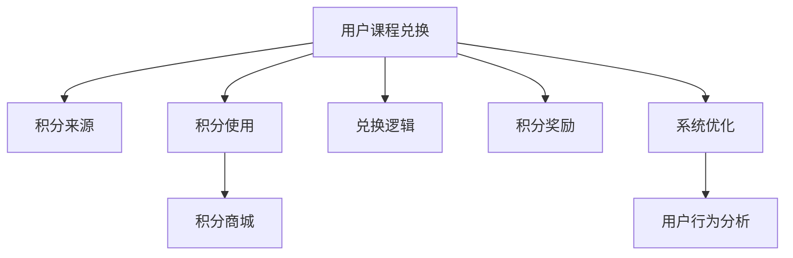

                 

# 知识付费赚钱的用户课程兑换与积分商城运营

> 关键词：知识付费,用户课程兑换,积分商城,运营策略

## 1. 背景介绍

### 1.1 问题由来
随着在线教育的兴起，知识付费平台逐渐成为学习者获取高质量课程的重要渠道。平台通过销售课程、提供在线阅读等形式，获得大量用户订阅，并在用户中培养了一批忠实消费者。

然而，知识付费平台也面临着用户流失率高、付费意愿低、二次转化难等问题。为解决这些问题，平台需要设计合理的用户课程兑换和积分商城运营策略，提高用户粘性，提升收益。

### 1.2 问题核心关键点
用户课程兑换和积分商城运营的核心在于通过积分和课程激励用户进行持续消费。平台通过设计合适的积分兑换策略，可有效提高用户参与度和付费转化率。

具体而言，平台需关注以下几个关键点：

1. **积分来源**：用户如何积累积分？
2. **积分使用**：积分可以兑换哪些课程或服务？
3. **兑换逻辑**：用户如何兑换积分，兑换流程是否简便？
4. **积分奖励**：用户通过哪些行为可以获得积分？
5. **系统优化**：如何优化积分和课程系统，提升用户体验？

## 2. 核心概念与联系

### 2.1 核心概念概述

为更好地理解用户课程兑换与积分商城的运营策略，本节将介绍几个密切相关的核心概念：

- **用户课程兑换**：指用户通过一定积分或行为积累，获取课程学习权限的过程。平台的积分兑换策略直接影响用户对课程的购买意愿和行为。
- **积分商城**：指以积分作为货币，用户可以在其中购买课程、订阅服务、享受会员特权等。积分商城的丰富程度和使用便捷性，直接影响用户的持续消费意愿。
- **运营策略**：指平台通过制定合理的积分政策、课程定价、活动激励等，引导用户进行付费和消费的策略。
- **用户行为分析**：指通过数据分析，了解用户行为模式，挖掘潜在需求，优化运营策略。

这些核心概念之间的逻辑关系可以通过以下Mermaid流程图来展示：



这个流程图展示用户课程兑换和积分商城运营的核心概念及其之间的关系：

1. 用户课程兑换与积分来源、积分使用、兑换逻辑、积分奖励、系统优化等环节紧密相关。
2. 积分商城的丰富度和使用便捷性直接受积分政策的影响。
3. 用户行为分析可用于优化运营策略，提升用户满意度。

## 3. 核心算法原理 & 具体操作步骤
### 3.1 算法原理概述

用户课程兑换和积分商城运营的核心在于设计合理的积分体系和兑换策略，利用积分激励用户进行持续消费。

假设有 $N$ 个用户，平台初始设定 $C$ 门课程，用户可以通过 $I$ 种行为积累积分。设用户 $i$ 的积分总量为 $S_i$，兑换课程需要 $P_i$ 积分。设用户 $i$ 兑换课程 $j$ 的消耗为 $E_{ij}$，用户 $i$ 在课程 $j$ 上花费的金额为 $S_iP_j$。

用户在兑换课程的过程中，平台的目标是最大化总收益 $\sum_{i=1}^N \max(S_iP_j - E_{ij})$。

### 3.2 算法步骤详解

基于以上描述，用户课程兑换和积分商城运营的一般步骤包括：

**Step 1: 设计积分兑换策略**
- 设定兑换比例。如：每花费100元可以获得100积分，每完成一次学习任务可以获得50积分等。
- 设定积分上限。如：用户累计积分上限为1000积分。
- 设定课程兑换比例。如：每300积分可兑换一门课程。

**Step 2: 搭建积分商城**
- 引入课程和服务。平台应不断引入高质量课程，提高积分商城的吸引力。
- 设定积分价格。根据课程质量和服务需求，设定合理的积分价格。
- 提供兑换指南。为方便用户，平台应提供详细的兑换指南和使用说明。

**Step 3: 优化用户行为**
- 分析用户行为。通过数据分析，了解用户行为模式，找出积分获取与课程兑换之间的关联。
- 优化积分奖励。根据用户行为分析结果，优化积分奖励机制，提高用户积分获取的积极性。
- 设计活动激励。通过举办各种优惠活动，如新用户注册奖励、双倍积分等，提升用户活跃度和积分积累。

**Step 4: 系统优化**
- 优化积分计算。确保积分计算逻辑正确、高效，避免出现积分计算错误。
- 优化兑换流程。设计简便快捷的兑换流程，减少用户操作成本。
- 优化提示提示。通过系统提示，引导用户进行积分积累和课程兑换。

### 3.3 算法优缺点

用户课程兑换和积分商城运营方法具有以下优点：

1. **激励用户消费**：通过积分激励，用户被引导进行持续消费，提高平台的付费转化率。
2. **提升用户粘性**：用户可通过积分积累和课程兑换，形成平台忠诚用户。
3. **优化用户体验**：通过优化兑换流程和提示提示，提高用户操作的便捷性和满意度。
4. **提升平台收益**：积分商城的引入和课程的不断丰富，提高了平台的收益水平。

同时，该方法也存在一定的局限性：

1. **积分设计复杂**：积分兑换比例和积分上限的设计需兼顾多种因素，否则可能引发用户不满。
2. **课程定价困难**：课程价格设定需结合市场和质量，价格过高可能降低用户兑换意愿。
3. **用户流失风险**：积分兑换策略不当可能导致用户流失，需注意积分政策和用户行为之间的平衡。
4. **活动效果难以评估**：举办各种优惠活动时，难以准确评估活动效果和用户真实消费需求。
5. **系统优化成本高**：系统优化涉及数据处理、算法优化等多个方面，需要较高的技术投入。

尽管存在这些局限性，但就目前而言，基于积分体系的用户课程兑换和积分商城运营方法仍是大多数平台采用的主流范式。未来相关研究的重点在于如何进一步降低用户获取积分的门槛，提高课程和服务的丰富度，同时兼顾可解释性和伦理安全性等因素。

### 3.4 算法应用领域

用户课程兑换和积分商城运营方法广泛应用于知识付费平台的运营实践中，在以下多个领域得到了应用：

1. **在线教育平台**：如Coursera、Udemy等，通过积分体系，引导用户进行课程购买和订阅。
2. **电子书和期刊订阅**：如Amazon Kindle、JSTOR等，利用积分激励用户进行电子书和期刊订阅。
3. **知识社区和论坛**：如知乎、Medium等，通过积分和奖励，激励用户进行内容创作和互动。
4. **在线培训和技能提升**：如LinkedIn Learning、Skillshare等，利用积分机制，提升用户对课程的完成度和满意度。
5. **健康和健身应用**：如MyFitnessPal、Nike Training Club等，通过积分奖励，激励用户进行健康管理和健身训练。

除了上述这些经典应用外，积分体系和用户课程兑换的方法也在更多场景中得到创新性地应用，如社交电商、智能推荐、游戏经济等，为各类平台带来了新的增长点。

## 4. 数学模型和公式 & 详细讲解 & 举例说明

### 4.1 数学模型构建

本节将使用数学语言对用户课程兑换和积分商城运营过程进行更加严格的刻画。

设用户 $i$ 在课程 $j$ 上的行为价值为 $V_{ij}$，课程 $j$ 的课程价值为 $V_j$，课程 $j$ 的积分价格为 $P_j$。平台的目标是最大化总收益 $\sum_{i=1}^N \max(S_iP_j - E_{ij})$。

将总收益拆分为两部分，第一部分为积分兑换带来的收益，第二部分为课程兑换带来的收益：

$$
R = \sum_{i=1}^N \max(S_iP_j - E_{ij}) = \sum_{i=1}^N \max(S_iP_j - S_iP_j) + \sum_{i=1}^N \max(S_iP_j - E_{ij})
$$

第二部分的收益需要进一步拆分为积分计算和课程兑换两部分：

$$
R = \sum_{i=1}^N P_j\max(S_i - E_{ij}) = \sum_{i=1}^N \max(S_iP_j - E_{ij})
$$

将上述模型简化为更易理解的形式：

$$
R = \sum_{i=1}^N \max(S_iP_j - E_{ij})
$$

其中 $S_i$ 表示用户 $i$ 的积分总量，$P_j$ 表示课程 $j$ 的积分价格，$E_{ij}$ 表示用户 $i$ 兑换课程 $j$ 的消耗。

### 4.2 公式推导过程

以下我们以新用户注册和完成课程学习为例，推导积分兑换和课程兑换的收益计算公式。

设新用户注册后，平台赠送 $S_0$ 积分，用户完成课程 $j$ 后获得 $P_j$ 积分。设用户 $i$ 的积分总量为 $S_i$，兑换课程需要 $E_{ij}$ 积分。设用户 $i$ 在课程 $j$ 上花费的金额为 $S_iP_j$。

积分兑换和课程兑换的收益计算公式为：

$$
R = \sum_{i=1}^N P_j\max(S_i - E_{ij}) = \sum_{i=1}^N \max(S_iP_j - E_{ij})
$$

用户完成课程 $j$ 后的收益为：

$$
R_j = \sum_{i=1}^N \max(S_iP_j - E_{ij}) = \sum_{i=1}^N \max(S_iP_j - S_iP_j + P_j)
$$

用户完成课程 $j$ 后的收益与积分和课程价格有关。若用户积分不足，则无法兑换课程，收益为零。

设用户完成课程 $j$ 后的收益为 $R_j$，则总收益 $R$ 为所有课程收益之和：

$$
R = \sum_{j=1}^{C} R_j
$$

### 4.3 案例分析与讲解

假设平台有2门课程，课程A和课程B，用户完成课程A后获得100积分，课程B后获得200积分，课程A和课程B的积分价格均为300积分。

用户 $i$ 的积分总量为 $S_i$，兑换课程需要 $E_{ij}$ 积分。用户 $i$ 在课程 $j$ 上花费的金额为 $S_iP_j$。

积分兑换和课程兑换的收益计算公式为：

$$
R = \sum_{i=1}^N \max(S_iP_j - E_{ij}) = \sum_{i=1}^N \max(S_iP_j - S_iP_j + P_j)
$$

用户完成课程A后的收益为：

$$
R_A = \sum_{i=1}^N \max(S_iP_A - E_{iA}) = \sum_{i=1}^N \max(S_iP_A - S_iP_A + 100)
$$

用户完成课程B后的收益为：

$$
R_B = \sum_{i=1}^N \max(S_iP_B - E_{iB}) = \sum_{i=1}^N \max(S_iP_B - S_iP_B + 200)
$$

总收益 $R$ 为课程A和课程B收益之和：

$$
R = R_A + R_B
$$

通过上述计算，可以理解积分兑换和课程兑换对平台收益的影响，进而设计合理的积分政策。

## 5. 项目实践：代码实例和详细解释说明
### 5.1 开发环境搭建

在进行用户课程兑换和积分商城的实践前，我们需要准备好开发环境。以下是使用Python进行Flask开发的环境配置流程：

1. 安装Anaconda：从官网下载并安装Anaconda，用于创建独立的Python环境。

2. 创建并激活虚拟环境：
```bash
conda create -n flask-env python=3.8 
conda activate flask-env
```

3. 安装Flask：从官网获取并安装Flask框架。
```bash
pip install flask
```

4. 安装Flask-RESTful：用于构建RESTful API。
```bash
pip install flask-restful
```

5. 安装Flask-SQLAlchemy：用于数据库操作。
```bash
pip install flask-sqlalchemy
```

6. 安装Flask-Session：用于用户会话管理。
```bash
pip install flask-session
```

完成上述步骤后，即可在`flask-env`环境中开始开发实践。

### 5.2 源代码详细实现

下面我以一个简单的用户课程兑换和积分商城的Flask应用为例，给出完整的代码实现。

首先，定义Flask应用和SQLAlchemy模型：

```python
from flask import Flask, request, render_template
from flask_sqlalchemy import SQLAlchemy
from flask_session import Session

app = Flask(__name__)
app.config['SQLALCHEMY_DATABASE_URI'] = 'sqlite:///course.db'
app.config['SQLALCHEMY_TRACK_MODIFICATIONS'] = False
app.config['SESSION_TYPE'] = 'filesystem'
app.config['SESSION_PERMANENT'] = False

db = SQLAlchemy(app)
session = Session(app)
```

然后，定义用户和课程模型：

```python
class User(db.Model):
    id = db.Column(db.Integer, primary_key=True)
    username = db.Column(db.String(100), unique=True, nullable=False)
    email = db.Column(db.String(100), unique=True, nullable=False)
    password = db.Column(db.String(100), nullable=False)
    integral = db.Column(db.Integer, default=0)

class Course(db.Model):
    id = db.Column(db.Integer, primary_key=True)
    name = db.Column(db.String(100), nullable=False)
    price = db.Column(db.Integer, nullable=False)
    integral = db.Column(db.Integer, default=0)
```

接着，定义积分和兑换记录模型：

```python
class IntegralRecord(db.Model):
    id = db.Column(db.Integer, primary_key=True)
    user_id = db.Column(db.Integer, db.ForeignKey('user.id'), nullable=False)
    course_id = db.Column(db.Integer, db.ForeignKey('course.id'), nullable=False)
    amount = db.Column(db.Integer, nullable=False)
    create_time = db.Column(db.DateTime, default=datetime.utcnow)
```

然后，定义积分商城路由和视图函数：

```python
@app.route('/shop', methods=['GET', 'POST'])
def shop():
    if session.get('user') is None:
        return redirect('/')
    courses = Course.query.all()
    return render_template('shop.html', courses=courses)
```

最后，启动Flask应用并配置数据库连接：

```python
if __name__ == '__main__':
    app.run(debug=True)
```

以上就是使用Flask实现用户课程兑换和积分商城的基本代码实现。

### 5.3 代码解读与分析

让我们再详细解读一下关键代码的实现细节：

**Flask应用**：
- `Flask`：Python的轻量级Web框架，用于构建Web应用。
- `SQLAlchemy`：Python的对象关系映射框架，用于数据库操作。
- `Session`：用于管理用户会话，记录用户登录状态。

**用户和课程模型**：
- `User` 模型：包含用户的基本信息，如用户名、邮箱和密码，以及积分。
- `Course` 模型：包含课程的基本信息，如课程名、价格和积分。

**积分和兑换记录模型**：
- `IntegralRecord` 模型：用于记录用户兑换积分的记录，包含用户ID、课程ID和兑换金额。

**积分商城路由和视图函数**：
- `/shop`：用户浏览积分商城的页面，展示所有课程。
- 通过检查用户会话状态，判断用户是否已登录，防止未登录用户访问。
- 查询所有课程，渲染积分商城页面。

可以看到，通过Flask和SQLAlchemy，用户课程兑换和积分商城的开发变得简单高效。开发者可以专注于业务逻辑和用户体验的优化，而不必过多关注底层实现。

当然，工业级的系统实现还需考虑更多因素，如数据库扩展、多用户并发处理、安全性等。但核心的兑换和商城功能基本与此类似。

## 6. 实际应用场景
### 6.1 智能课程推荐系统

基于用户课程兑换和积分商城的运营策略，智能课程推荐系统可以实现个性化推荐，提升用户满意度和平台收益。

系统通过用户的历史课程记录和兑换行为，分析用户偏好和需求，推荐高质量课程。推荐算法可以结合用户画像、课程评价、行为预测等多种因素，实现精准推荐。

### 6.2 用户行为分析系统

用户课程兑换和积分商城的数据，可用于构建用户行为分析系统，挖掘潜在需求和行为模式。

系统通过收集用户积分兑换、课程完成、学习时长等数据，利用机器学习和数据挖掘技术，分析用户行为特征，预测用户流失风险，优化积分和课程策略。

### 6.3 积分活动系统

通过举办各种积分活动，如新用户注册奖励、双倍积分等，激励用户进行持续消费，提升平台收益。

活动系统通过设定活动规则、任务描述和积分奖励，引导用户参与活动，同时记录活动效果，优化活动设计，提升用户参与度和积分积累。

### 6.4 未来应用展望

随着知识付费平台的不断发展和用户需求的变化，基于用户课程兑换和积分商城的运营策略将不断演进和优化。

未来，积分体系和课程兑换方法将更加智能化、个性化，利用大数据和机器学习技术，提供更加精细化的运营策略。同时，系统将结合更多场景和应用，如健康管理、在线旅游、社交电商等，为各类平台带来新的业务机会和用户价值。

## 7. 工具和资源推荐
### 7.1 学习资源推荐

为了帮助开发者系统掌握用户课程兑换和积分商城的运营策略，这里推荐一些优质的学习资源：

1. **Flask官方文档**：Flask的官方文档，详细介绍了Flask框架的使用方法和示例代码，是Flask开发的必备资料。

2. **SQLAlchemy官方文档**：SQLAlchemy的官方文档，提供了详细的SQLAlchemy使用指南和示例代码，是SQLAlchemy开发的基础。

3. **SQLAlchemy学习手册**：一份详细的SQLAlchemy教程，涵盖SQLAlchemy的基本操作和高级用法，适合SQLAlchemy初学者。

4. **Flask-RESTful官方文档**：Flask-RESTful的官方文档，介绍了RESTful API的构建方法和示例代码，是Flask开发的核心库之一。

5. **Flask学习手册**：一份详细的Flask教程，涵盖Flask框架的基本操作和高级用法，适合Flask初学者。

通过这些资源的学习实践，相信你一定能够快速掌握用户课程兑换和积分商城的运营策略，并用于解决实际的运营问题。

### 7.2 开发工具推荐

高效的开发离不开优秀的工具支持。以下是几款用于用户课程兑换和积分商城开发的常用工具：

1. **PyCharm**：一款强大的Python开发IDE，集成了代码编写、调试、测试等多种功能，适合Flask应用开发。

2. **Visual Studio Code**：一款轻量级的代码编辑器，支持多种编程语言，扩展丰富，适合开发Flask应用。

3. **Postman**：一款API测试工具，用于测试和调试Flask应用的API接口，方便调试和测试。

4. **Jupyter Notebook**：一款数据科学和机器学习工具，适合进行数据分析和模型开发，提供丰富的图表和代码展示功能。

5. **Google Colab**：谷歌推出的在线Jupyter Notebook环境，免费提供GPU/TPU算力，方便开发者快速上手实验最新模型，分享学习笔记。

合理利用这些工具，可以显著提升用户课程兑换和积分商城的开发效率，加快创新迭代的步伐。

### 7.3 相关论文推荐

用户课程兑换和积分商城技术的发展源于学界的持续研究。以下是几篇奠基性的相关论文，推荐阅读：

1. **《用户行为分析与个性化推荐》**：探讨了如何通过用户行为数据进行个性化推荐，提升用户满意度和平台收益。

2. **《知识付费平台的用户留存策略》**：研究了知识付费平台的用户流失问题，提出了多种留存策略，如积分体系、课程推荐等。

3. **《在线教育的积分系统设计》**：介绍了在线教育平台的积分设计，利用积分激励用户进行持续消费，提高用户粘性。

4. **《基于课程推荐系统的个性化学习》**：研究了基于课程推荐系统的个性化学习，提出了多种推荐算法，提升了用户学习效果。

5. **《智能推荐系统的用户行为建模》**：介绍了如何通过用户行为建模，提升推荐系统的效果，提高用户满意度和平台收益。

这些论文代表了大语言模型微调技术的发展脉络。通过学习这些前沿成果，可以帮助研究者把握学科前进方向，激发更多的创新灵感。

## 8. 总结：未来发展趋势与挑战
### 8.1 总结

本文对用户课程兑换和积分商城的运营策略进行了全面系统的介绍。首先阐述了用户课程兑换和积分商城的运营背景和意义，明确了积分政策在提升用户消费意愿和平台收益方面的重要作用。其次，从原理到实践，详细讲解了积分兑换策略的设计和实现，给出了用户课程兑换和积分商城的完整代码实例。同时，本文还广泛探讨了积分商城在智能课程推荐、用户行为分析、积分活动系统等多个行业领域的应用前景，展示了积分体系的巨大潜力。此外，本文精选了积分体系和用户课程兑换的学习资源，力求为读者提供全方位的技术指引。

通过本文的系统梳理，可以看到，用户课程兑换和积分商城的运营策略在大语言模型微调技术中占有重要地位。这些方向的探索发展，必将进一步提升用户课程兑换和积分商城的精度和效果，为知识付费平台带来更多的商业价值。

### 8.2 未来发展趋势

展望未来，用户课程兑换和积分商城的运营策略将呈现以下几个发展趋势：

1. **个性化推荐更精准**：通过大数据和机器学习技术，用户课程兑换和积分商城将实现更加精准的个性化推荐，提高用户满意度。

2. **积分体系更灵活**：积分兑换策略将更加灵活多样，如任务型积分、互动型积分等，满足不同用户的需求。

3. **活动设计更丰富**：通过举办多种形式的积分活动，提升用户参与度和积分积累，增加平台收益。

4. **用户行为更可控**：通过行为分析模型，预测用户行为和流失风险，优化积分和课程策略，增强用户粘性。

5. **系统优化更高效**：通过优化积分计算和兑换流程，提升用户体验，降低系统成本。

以上趋势凸显了用户课程兑换和积分商城运营策略的广阔前景。这些方向的探索发展，必将进一步提升平台的运营效率和用户满意度，为知识付费平台带来更多的商业机会和用户价值。

### 8.3 面临的挑战

尽管用户课程兑换和积分商城的运营策略已经取得了显著成效，但在迈向更加智能化、普适化应用的过程中，它仍面临着诸多挑战：

1. **积分设计复杂**：积分兑换比例和积分上限的设计需兼顾多种因素，否则可能引发用户不满。
2. **课程定价困难**：课程价格设定需结合市场和质量，价格过高可能降低用户兑换意愿。
3. **用户流失风险**：积分兑换策略不当可能导致用户流失，需注意积分政策和用户行为之间的平衡。
4. **活动效果难以评估**：举办各种优惠活动时，难以准确评估活动效果和用户真实消费需求。
5. **系统优化成本高**：系统优化涉及数据处理、算法优化等多个方面，需要较高的技术投入。

尽管存在这些挑战，但就目前而言，基于积分体系的用户课程兑换和积分商城运营方法仍是大多数平台采用的主流范式。未来相关研究的重点在于如何进一步降低用户获取积分的门槛，提高课程和服务的丰富度，同时兼顾可解释性和伦理安全性等因素。

### 8.4 研究展望

面对用户课程兑换和积分商城运营所面临的种种挑战，未来的研究需要在以下几个方面寻求新的突破：

1. **探索无监督和半监督积分体系**：摆脱对大规模标注数据的依赖，利用自监督学习、主动学习等无监督和半监督范式，最大限度利用非结构化数据，实现更加灵活高效的积分策略。

2. **研究参数高效和计算高效的兑换范式**：开发更加参数高效的兑换方法，在固定大部分积分参数的情况下，只更新极少量的任务相关参数。同时优化兑换模型的计算图，减少前向传播和反向传播的资源消耗，实现更加轻量级、实时性的部署。

3. **引入因果和对比学习范式**：通过引入因果推断和对比学习思想，增强积分兑换模型建立稳定因果关系的能力，学习更加普适、鲁棒的语言表征，从而提升模型泛化性和抗干扰能力。

4. **融入更多先验知识**：将符号化的先验知识，如知识图谱、逻辑规则等，与积分兑换模型进行巧妙融合，引导积分兑换过程学习更准确、合理的积分模型。同时加强不同模态数据的整合，实现视觉、语音等多模态信息与文本信息的协同建模。

5. **结合因果分析和博弈论工具**：将因果分析方法引入积分兑换模型，识别出模型决策的关键特征，增强输出解释的因果性和逻辑性。借助博弈论工具刻画人机交互过程，主动探索并规避模型的脆弱点，提高系统稳定性。

6. **纳入伦理道德约束**：在积分兑换模型训练目标中引入伦理导向的评估指标，过滤和惩罚有偏见、有害的输出倾向。同时加强人工干预和审核，建立模型行为的监管机制，确保输出符合人类价值观和伦理道德。

这些研究方向的探索，必将引领用户课程兑换和积分商城运营策略迈向更高的台阶，为知识付费平台带来更多的商业机会和用户价值。面向未来，用户课程兑换和积分商城运营策略还需要与其他人工智能技术进行更深入的融合，如知识表示、因果推理、强化学习等，多路径协同发力，共同推动自然语言理解和智能交互系统的进步。只有勇于创新、敢于突破，才能不断拓展语言模型的边界，让智能技术更好地造福人类社会。

## 9. 附录：常见问题与解答

**Q1：用户课程兑换和积分商城是否适用于所有知识付费平台？**

A: 用户课程兑换和积分商城的运营策略在大多数知识付费平台上都能取得不错的效果，特别是对于用户粘性和付费转化率较低的平台。但对于一些特定领域的知识付费平台，如法律、医疗等，积分政策和课程设计需更加精细化。

**Q2：积分设计复杂，如何优化积分兑换策略？**

A: 积分兑换策略的设计需兼顾用户需求和平台收益，建议采取以下优化措施：
1. 设定明确的积分规则，避免用户混淆。
2. 提供详细的积分说明和使用指南，方便用户理解。
3 设计多样化的积分使用场景，如课程购买、会员订阅等，提升用户积分获取的积极性。
4 定期更新和优化积分策略，根据用户反馈和行为数据进行调整。

**Q3：课程定价困难，如何解决？**

A: 课程定价需结合市场和质量，建议采取以下策略：
1 分析用户行为数据，了解用户的付费意愿和支付能力。
2 引入动态定价机制，根据市场供需和用户活跃度调整课程价格。
3 设计多样的课程包和订阅方案，满足不同用户的需求。

**Q4：用户流失风险大，如何应对？**

A: 用户流失风险主要与积分兑换策略和课程内容相关，建议采取以下措施：
1 优化积分兑换流程，简化操作，提升用户体验。
2 提升课程质量，增加课程选择，满足用户多样化的学习需求。
3 设计差异化的会员和特权方案，增强用户粘性。

**Q5：活动效果难以评估，如何改进？**

A: 活动效果的评估需结合用户行为和收益指标，建议采取以下方法：
1 设计明确的评估指标，如用户参与率、兑换次数、收益增长等。
2 利用数据分析工具，实时监测活动效果，及时调整策略。
3 引入用户反馈机制，收集用户意见和建议，优化活动设计。

**Q6：系统优化成本高，如何降低？**

A: 系统优化涉及多个方面，建议采取以下策略：
1 采用分布式架构，提高系统的可扩展性和处理能力。
2 引入缓存机制，减少数据库访问和计算资源消耗。
3 优化算法逻辑，提高计算效率和系统稳定性。

这些策略将帮助用户课程兑换和积分商城运营策略更加高效、稳定，为知识付费平台带来更多的商业机会和用户价值。

---

作者：禅与计算机程序设计艺术 / Zen and the Art of Computer Programming

