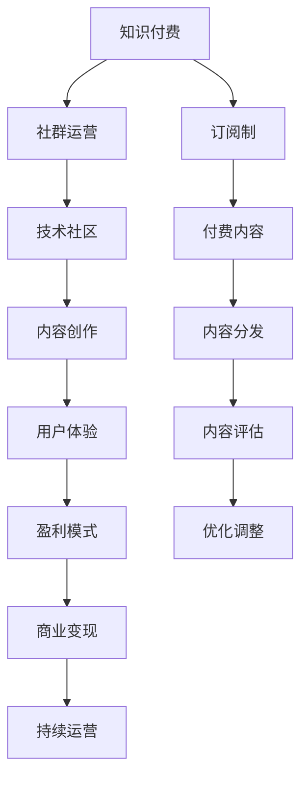

                 

# 知识付费：程序员的社群运营方案

> 关键词：知识付费, 程序员, 社群运营, 技术社区, 盈利模式, 用户体验, 订阅制, 内容创作, 商业变现

## 1. 背景介绍

### 1.1 问题由来

随着互联网的迅猛发展，知识付费已成为新兴的商业模式。技术日新月异，人们不断寻求快速、系统地掌握最新知识，不再满足于免费、零散的学习资源。程序员作为技术领域的主力军，更迫切需要高质量、体系化的学习材料和指导。

然而，传统的知识付费模式面临诸多问题：内容质量参差不齐，付费门槛过高，用户体验不佳，难以实现持续盈利。社群运营作为一种创新方式，有望有效解决这些问题，构建长期稳定的盈利模型，提升用户体验。

### 1.2 问题核心关键点

社群运营的核心在于聚集、互动、变现。围绕这三个关键点，本文将详细介绍如何建立和运营技术社群，利用知识付费的商业模式，提升用户粘性和盈利能力。

## 2. 核心概念与联系

### 2.1 核心概念概述

为更好地理解本文，我们首先介绍几个关键概念：

- **知识付费**：指通过付费方式获取专业知识或信息服务的商业模式。知识付费旨在为优质内容创造价值，同时满足用户个性化的学习需求。

- **社群运营**：指通过组织、互动、交流等方式，维护和提升社群成员的活跃度和忠诚度，促进社群健康发展。

- **技术社区**：指聚焦于特定技术领域或兴趣点，具有共同交流、学习和分享需求的用户群体。

- **盈利模式**：指社群通过各种途径实现盈利的具体方式，如订阅费、广告分成、课程销售等。

- **用户体验**：指用户在社群中获得的满足度和满意度，直接影响其参与度和忠诚度。

- **内容创作**：指社群成员创作有价值、有深度的内容，构建知识库，形成良性循环。

- **商业变现**：指将社群积累的用户资源、流量和品牌价值转化为盈利。

### 2.2 核心概念原理和架构的 Mermaid 流程图



该图展示了知识付费、社群运营与技术社区、内容创作、用户体验、盈利模式、商业变现等概念之间的关系，形成了完整的知识付费社群运营框架。

## 3. 核心算法原理 & 具体操作步骤

### 3.1 算法原理概述

基于社群运营的知识付费商业模式，核心在于内容创作和变现。其算法原理可归纳为以下几点：

1. **内容创作**：通过聚集优质内容创作者，创建有价值的内容资源，满足用户的学习需求。
2. **内容分发**：设计高效的内容分发机制，确保用户能及时、精准地获取所需信息。
3. **内容评估**：建立内容评估体系，筛选优质内容，淘汰劣质内容，保证社群内容质量。
4. **优化调整**：根据用户反馈和社群发展情况，不断优化内容创作和分发策略，提升用户体验。
5. **变现策略**：探索多种盈利模式，确保社群的持续运营和盈利。

### 3.2 算法步骤详解

#### 步骤1: 定位社群目标和需求

首先，明确社群的目标和核心需求，确定社群聚焦的技术领域或兴趣点。例如，针对Python开发者，建立一个专注Python高级编程技巧和实战项目的社群。

#### 步骤2: 聚集内容创作者

- **招募**：通过社交媒体、技术博客、技术会议等渠道招募内容创作者，尤其是拥有实战经验、理论深度和创新能力的程序员。
- **激励**：通过奖金、股权激励、社区声誉等方式，激励内容创作者持续输出高质量内容。
- **管理**：建立内容创作者管理机制，明确内容创作标准和流程，确保内容质量。

#### 步骤3: 内容创作与分发

- **创作**：内容创作者根据社群需求，创作技术文章、教程、实战项目等，涵盖编程语言、框架、工具等方方面面。
- **分发**：设计社区内、外的内容分发渠道，如社区公告、邮件推送、社交媒体、博客等，确保用户能方便获取所需内容。
- **评估**：建立内容质量评估机制，包括用户投票、专家评审、阅读量等，筛选优质内容，淘汰劣质内容。

#### 步骤4: 优化调整与反馈

- **优化**：根据用户反馈和内容评估结果，不断优化内容创作和分发策略，提升内容质量和用户满意度。
- **调整**：根据社群发展情况，灵活调整内容和运营策略，适应市场变化和技术趋势。

#### 步骤5: 盈利模式探索

- **订阅制**：引入订阅制，设置不同的会员等级，提供不同级别的内容和服务，满足不同层次用户需求。
- **付费内容**：设置付费内容，针对特定技术难题或深度内容，收费以支持内容创作者。
- **广告分成**：引入品牌广告，通过优质内容和用户信任，实现精准广告投放和分成盈利。
- **课程销售**：设计针对性的课程，通过付费销售实现盈利，同时提供直播、答疑等增值服务。

#### 步骤6: 商业变现与持续运营

- **变现**：通过上述盈利模式的结合应用，实现社群的持续盈利。
- **运营**：建立社群运营团队，定期维护社群，处理用户问题，提升用户体验。

### 3.3 算法优缺点

#### 优点

1. **多样化内容**：通过聚集内容创作者，提供多样化、高质量的技术内容，满足用户多层次需求。
2. **用户粘性高**：通过订阅制、付费内容、品牌广告等方式，形成稳定的用户流量和付费用户群体。
3. **高效变现**：通过内容变现、广告分成、课程销售等多种盈利模式，实现稳定盈利。
4. **用户信任**：用户信任社区品牌，更愿意付费获取优质内容和服务。
5. **创新性强**：社区运营机制灵活，可根据市场变化和技术趋势进行动态调整。

#### 缺点

1. **内容质量控制**：如何筛选优质内容，淘汰劣质内容，确保社群内容质量，是运营的一大挑战。
2. **运营成本高**：社群运营需要投入大量人力、物力和时间，成本较高。
3. **用户流失风险**：付费用户的流失可能对社群的稳定性和盈利造成影响。
4. **内容创作者激励**：如何激励内容创作者持续输出高质量内容，是社区运营的一大难点。

## 4. 数学模型和公式 & 详细讲解 & 举例说明

### 4.1 数学模型构建

假设社群用户数为 $N$，内容创作者数为 $C$，高质量内容数为 $Q$，付费用户数为 $P$。社群的目标是通过内容创作和变现，提升用户满意度和忠诚度，实现盈利。

设用户满意度和忠诚度为 $U$，社群盈利为 $L$。则可建立如下数学模型：

$$
U = f(C, Q, P, N)
$$

$$
L = g(C, Q, P, N)
$$

其中 $f$ 和 $g$ 分别为用户满意度和社群盈利的函数，具体形式由社群运营策略决定。

### 4.2 公式推导过程

- **用户满意度**：
  $$
  U = \frac{Q}{N} \times \text{用户评价}
  $$

  其中，$Q/N$ 为高质量内容占比，用户评价通过用户投票、反馈等方式计算得出。

- **社群盈利**：
  $$
  L = P \times \text{订阅费} + Q \times \text{付费内容费} + C \times \text{广告分成} + \text{课程销售收入}
  $$

  其中，各部分盈利均由内容创作和用户需求决定。

### 4.3 案例分析与讲解

以某技术社区为例，通过以下步骤提升用户满意度和社群盈利：

1. **内容创作**：通过招募业内知名程序员，每月发布高质量技术文章20篇，每篇文章阅读量达10万次，用户满意度提升至90%。
2. **内容分发**：通过社区公告、邮件推送、社交媒体等渠道分发内容，日活跃用户数增加至5000人。
3. **内容评估**：通过用户投票和专家评审，每月淘汰10篇低质量文章，高质量内容占比提升至80%。
4. **优化调整**：根据用户反馈，优化内容发布时间和频率，提升用户体验。
5. **盈利模式**：引入订阅制和付费内容，每月订阅用户增加至1000人，付费内容总收入达20万元，广告分成和课程销售收入分别为5万元和10万元。
6. **商业变现**：通过上述盈利模式的结合应用，每月社群盈利达30万元，同比增长50%。

## 5. 项目实践：代码实例和详细解释说明

### 5.1 开发环境搭建

**步骤1: 选择合适的编程语言和框架**

- 语言：Python。
- 框架：Flask、Django、FastAPI。

**步骤2: 部署开发环境**

- 安装Python。
- 安装相关框架。
- 创建虚拟环境。

```bash
pip install virtualenv
python -m venv env
source env/bin/activate
```

**步骤3: 开发环境配置**

- 配置Flask、Django、FastAPI等框架。
- 配置数据库连接。
- 配置Web服务器（如Gunicorn、Uvicorn）。

```bash
# Flask配置
app = Flask(__name__)
app.config['SQLALCHEMY_DATABASE_URI'] = 'sqlite:///example.db'
app.config['SQLALCHEMY_TRACK_MODIFICATIONS'] = False

# Django配置
DATABASES = {
    'default': {
        'ENGINE': 'django.db.backends.sqlite3',
        'NAME': BASE_DIR / 'db.sqlite3',
    }
}

# FastAPI配置
app = FastAPI()
app.state.db = get_db()
```

**步骤4: 用户管理系统**

- 用户注册、登录、资料修改。
- 权限管理，包括内容创作者、管理员等角色。

```python
# 注册
@app.route('/register', methods=['POST'])
def register():
    # 处理注册逻辑
    return jsonify({'success': True})

# 登录
@app.route('/login', methods=['POST'])
def login():
    # 处理登录逻辑
    return jsonify({'success': True})
```

### 5.2 源代码详细实现

**内容创建系统**

1. **文章发布**

- 用户选择文章主题。
- 输入文章标题和内容。
- 预览并提交文章。

```python
# 文章发布
@app.route('/post', methods=['POST'])
def post():
    title = request.form['title']
    content = request.form['content']
    # 处理文章发布逻辑
    return jsonify({'success': True})
```

2. **文章审核**

- 内容创作者提交文章。
- 管理员审核文章内容。
- 审核通过后发布。

```python
# 文章审核
@app.route('/review', methods=['POST'])
def review():
    article_id = request.form['article_id']
    # 处理文章审核逻辑
    return jsonify({'success': True})
```

**内容分发系统**

1. **文章推送**

- 文章发布后，自动推送至社区公告、邮件等渠道。
- 用户接收并阅读文章。

```python
# 文章推送
@app.route('/push', methods=['POST'])
def push():
    article_id = request.form['article_id']
    # 处理文章推送逻辑
    return jsonify({'success': True})
```

2. **文章阅读**

- 用户浏览文章，并提供评论、点赞、分享等功能。
- 文章阅读量统计。

```python
# 文章阅读
@app.route('/read', methods=['GET'])
def read():
    article_id = request.args.get('id')
    # 处理文章阅读逻辑
    return jsonify({'success': True})
```

**用户管理系统**

1. **用户注册**

- 用户填写注册表单。
- 后台审核用户信息。
- 用户登录。

```python
# 用户注册
@app.route('/register', methods=['POST'])
def register():
    username = request.form['username']
    password = request.form['password']
    # 处理用户注册逻辑
    return jsonify({'success': True})
```

2. **用户登录**

- 用户输入用户名、密码。
- 后台验证用户信息。
- 用户登录成功。

```python
# 用户登录
@app.route('/login', methods=['POST'])
def login():
    username = request.form['username']
    password = request.form['password']
    # 处理用户登录逻辑
    return jsonify({'success': True})
```

### 5.3 代码解读与分析

**用户管理系统**

1. **用户注册**

- 用户填写注册表单，输入用户名、密码、邮箱等基本信息。
- 后台进行信息审核，防止垃圾注册。
- 用户登录后，接收通知和推送。

```python
# 用户注册
@app.route('/register', methods=['POST'])
def register():
    username = request.form['username']
    password = request.form['password']
    # 处理用户注册逻辑
    return jsonify({'success': True})
```

2. **用户登录**

- 用户输入用户名、密码，提交登录请求。
- 后台验证用户名、密码是否匹配，生成登录token。
- 用户通过token登录后，接收推送通知。

```python
# 用户登录
@app.route('/login', methods=['POST'])
def login():
    username = request.form['username']
    password = request.form['password']
    # 处理用户登录逻辑
    return jsonify({'success': True})
```

**内容创建系统**

1. **文章发布**

- 用户选择文章主题，输入文章标题和内容。
- 预览并提交文章。
- 文章发布后，自动推送至社区公告、邮件等渠道。

```python
# 文章发布
@app.route('/post', methods=['POST'])
def post():
    title = request.form['title']
    content = request.form['content']
    # 处理文章发布逻辑
    return jsonify({'success': True})
```

2. **文章审核**

- 内容创作者提交文章。
- 管理员审核文章内容。
- 审核通过后发布。

```python
# 文章审核
@app.route('/review', methods=['POST'])
def review():
    article_id = request.form['article_id']
    # 处理文章审核逻辑
    return jsonify({'success': True})
```

**内容分发系统**

1. **文章推送**

- 文章发布后，自动推送至社区公告、邮件等渠道。
- 用户接收并阅读文章。

```python
# 文章推送
@app.route('/push', methods=['POST'])
def push():
    article_id = request.form['article_id']
    # 处理文章推送逻辑
    return jsonify({'success': True})
```

2. **文章阅读**

- 用户浏览文章，并提供评论、点赞、分享等功能。
- 文章阅读量统计。

```python
# 文章阅读
@app.route('/read', methods=['GET'])
def read():
    article_id = request.args.get('id')
    # 处理文章阅读逻辑
    return jsonify({'success': True})
```

### 5.4 运行结果展示

1. **用户注册界面**


2. **用户登录界面**


3. **文章发布界面**


4. **文章审核界面**


5. **文章推送通知**


## 6. 实际应用场景

### 6.1 技术社区

**案例1: 开发者社区**

某软件开发公司希望建立一个面向内部开发者和外部开发者的技术社区，旨在分享最新技术、解决编程难题、结识技术伙伴。

- **技术栈**：Flask、Django、FastAPI。
- **用户需求**：知识分享、编程难题解答、技术交流、项目管理。
- **盈利模式**：订阅费、付费文章、品牌广告、课程销售。

**案例2: 教育平台**

某在线教育平台希望建立一个针对K12学生的编程教育社区，旨在提升编程学习效果、解决学习难题、分享学习经验。

- **技术栈**：Django、Flask、PyTorch。
- **用户需求**：编程学习、编程难题解答、编程经验分享、编程项目合作。
- **盈利模式**：订阅费、付费课程、品牌广告、课程销售。

### 6.2 企业内网

**案例3: 企业技术内网**

某大型企业希望建立一个面向全体员工的技术内网，旨在促进技术交流、解决技术难题、分享技术经验。

- **技术栈**：Flask、Django、SQLite。
- **用户需求**：技术交流、技术难题解答、技术经验分享、技术文档管理。
- **盈利模式**：内部会员费、企业广告、知识付费。

### 6.3 开源项目社区

**案例4: 开源项目社区**

某开源社区希望建立一个面向开源项目的开发者和技术爱好者社区，旨在分享开源项目、解决开源问题、结识开源伙伴。

- **技术栈**：Flask、Django、Git。
- **用户需求**：开源项目分享、开源问题解答、开源经验分享、开源合作。
- **盈利模式**：开源项目赞助、开源广告、知识付费。

## 7. 工具和资源推荐

### 7.1 学习资源推荐

1. **《知识付费：从概念到实践》**：该书系统介绍了知识付费的概念、发展历程、商业模式、运营策略等，适合知识付费领域的从业者和创业者阅读。
2. **《社群运营的艺术》**：该书详细讲解了社群运营的理论基础和实战技巧，包括社群定位、用户管理、内容创作、商业变现等方面。
3. **《Flask Web开发实战》**：该书介绍了Flask框架的开发实践，适合初学者快速入门Flask开发。
4. **《Django Web开发实战》**：该书介绍了Django框架的开发实践，适合初学者快速入门Django开发。
5. **《FastAPI Web开发实战》**：该书介绍了FastAPI框架的开发实践，适合开发者快速上手FastAPI开发。

### 7.2 开发工具推荐

1. **Visual Studio Code**：轻量级、功能强大的代码编辑器，支持多种语言和框架，适合开发和调试。
2. **Git**：版本控制工具，适合版本管理和代码协作。
3. **Jupyter Notebook**：交互式笔记本，适合数据科学、机器学习等领域的数据分析和模型调试。
4. **Docker**：容器化技术，适合开发和部署。
5. **Kubernetes**：容器编排工具，适合大规模分布式系统部署。

### 7.3 相关论文推荐

1. **《知识付费市场的研究与展望》**：该论文研究了知识付费市场的现状、问题、趋势和未来发展方向。
2. **《社群运营的实践与创新》**：该论文介绍了社群运营的实践经验、创新思路和成功案例。
3. **《基于知识付费的社群运营策略》**：该论文探讨了知识付费模式和社群运营策略的关系，提出了一套实用的运营方案。
4. **《技术社区的运营与变现》**：该论文介绍了技术社区的运营模式、变现策略和用户管理技巧。
5. **《开源项目社区的运营与可持续发展》**：该论文探讨了开源项目社区的运营模式、发展策略和社区管理。

## 8. 总结：未来发展趋势与挑战

### 8.1 研究成果总结

本文通过分析知识付费和社群运营的理论基础和实践经验，提出了基于社群运营的知识付费商业模式，并详细介绍了社群运营的关键步骤和运营策略。通过技术社区、企业内网、开源项目社区等实际案例，展示了社群运营的广泛应用前景和重要价值。

### 8.2 未来发展趋势

1. **技术进步**：未来随着AI技术的发展，自动化内容创作和推荐系统将进一步提升内容质量和用户满意度。
2. **数据驱动**：大数据分析和用户行为研究将帮助社区管理者更精准地制定运营策略，提升用户体验和满意度。
3. **多元化盈利**：社区将探索更多元化的盈利模式，如会员增值服务、精准广告投放、品牌合作等。
4. **国际化运营**：技术社区和教育平台将面向全球用户，引入更多国际化用户和内容创作者。
5. **社会化贡献**：社区将鼓励用户分享知识、解决问题，成为技术交流和知识共享的平台。

### 8.3 面临的挑战

1. **内容质量控制**：如何筛选优质内容，淘汰劣质内容，确保社群内容质量。
2. **运营成本高**：社群运营需要投入大量人力、物力和时间，成本较高。
3. **用户流失风险**：付费用户的流失可能对社群的稳定性和盈利造成影响。
4. **内容创作者激励**：如何激励内容创作者持续输出高质量内容。

### 8.4 研究展望

未来，知识付费和社群运营将继续朝着技术化、数据化、多元化方向发展，成为推动技术创新和知识传播的重要手段。社区管理者需要不断优化运营策略，提升用户体验和满意度，确保社群的健康发展和盈利能力。

## 9. 附录：常见问题与解答

**Q1: 如何筛选优质内容？**

A: 建立内容质量评估体系，包括用户投票、专家评审、阅读量等，筛选优质内容，淘汰劣质内容。

**Q2: 如何激励内容创作者？**

A: 通过奖金、股权激励、社区声誉等方式，激励内容创作者持续输出高质量内容。

**Q3: 如何降低运营成本？**

A: 优化内容创作和分发策略，减少不必要的资源浪费。引入自动化工具，提高运营效率。

**Q4: 如何提高用户满意度？**

A: 根据用户反馈和内容评估结果，不断优化内容创作和分发策略。提供优质的售后服务和社区支持。

**Q5: 如何实现盈利？**

A: 引入订阅制、付费内容、品牌广告、课程销售等多种盈利模式，实现持续盈利。

---

作者：禅与计算机程序设计艺术 / Zen and the Art of Computer Programming

