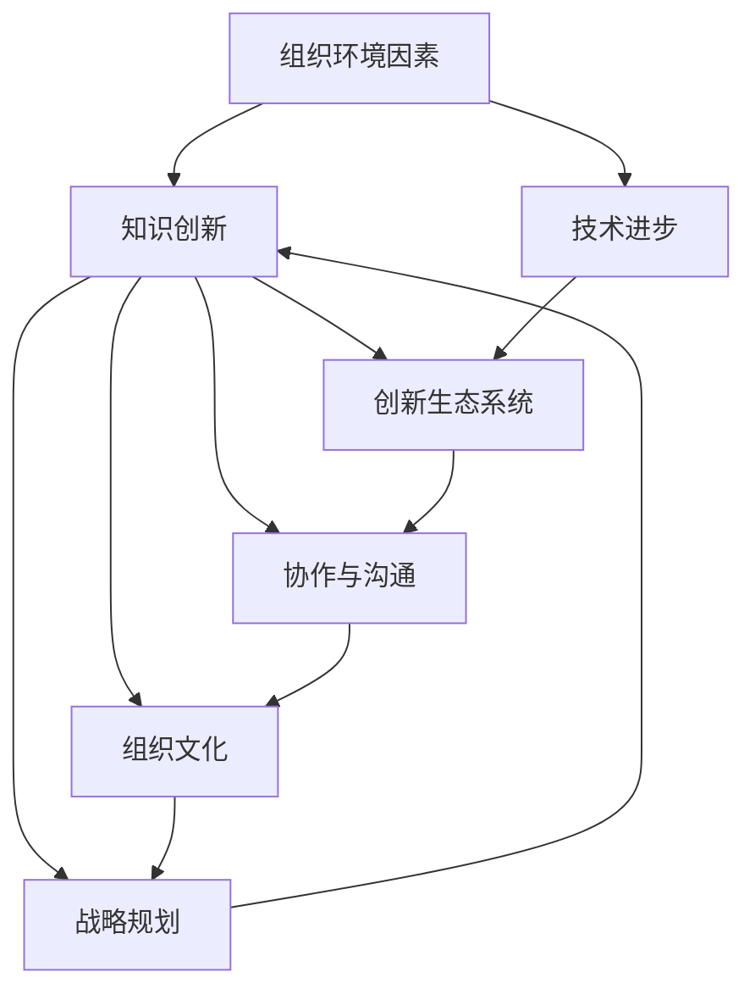

                 

# 知识创新的组织环境因素

> 关键词：组织环境因素,知识创新,技术进步,创新生态系统,协作与沟通,组织文化,战略规划

## 1. 背景介绍

### 1.1 问题由来
在当今快速变化的技术和市场环境中，知识创新已成为组织保持竞争力的关键。然而，知识创新不仅依赖于个体创意和技术突破，更依赖于组织内部及外部环境因素的支持。深入理解组织环境因素对知识创新的影响，有助于组织制定更有针对性的创新策略，优化创新流程，从而提升创新效率和成功率。

### 1.2 问题核心关键点
- **组织环境因素**：包括组织文化、协作机制、沟通渠道、技术资源、战略规划等方面。
- **知识创新**：指组织通过新技术、新方法和新思路，不断创造和应用新知识的动态过程。
- **技术进步**：指技术手段、工具和方法的不断改进和更新。
- **创新生态系统**：指由各类创新主体（如企业、研究机构、政府、用户等）构成的相互依赖、相互促进的网络系统。
- **协作与沟通**：指组织内外的信息交流和资源共享。
- **组织文化**：指组织成员共同遵循的行为规范、价值观念和思维方式。
- **战略规划**：指组织为实现其长期发展目标而制定的系统性规划和策略。

理解这些关键点及其相互关系，对于优化组织环境，促进知识创新具有重要意义。

### 1.3 问题研究意义
研究组织环境因素对知识创新的影响，对于推动组织技术进步、提升创新效率、优化创新生态系统、促进组织文化建设和战略规划具有重要意义：

1. **推动技术进步**：良好的组织环境能够吸引和培养技术人才，促进技术交流与合作，加速技术创新。
2. **提升创新效率**：通过优化协作机制、沟通渠道和技术资源，组织可以更快地将创新想法转化为实际应用。
3. **优化创新生态系统**：组织环境能够影响创新主体的互动方式和协作模式，促进创新资源的整合和共享。
4. **促进组织文化建设**：组织环境中的价值观和行为规范能够激发创新精神，形成创新文化。
5. **支持战略规划**：战略规划需要基于对组织环境的深入理解，才能制定出科学合理的创新战略。

## 2. 核心概念与联系

### 2.1 核心概念概述

为更好地理解组织环境因素对知识创新的影响，本节将介绍几个密切相关的核心概念：

- **组织环境因素**：指影响组织知识创新活动的外部与内部环境因素，包括政策、经济、社会、科技、组织文化、协作机制、沟通渠道、技术资源、战略规划等。
- **知识创新**：指组织通过新技术、新方法和新思路，不断创造和应用新知识的动态过程。
- **技术进步**：指技术手段、工具和方法的不断改进和更新。
- **创新生态系统**：指由各类创新主体（如企业、研究机构、政府、用户等）构成的相互依赖、相互促进的网络系统。
- **协作与沟通**：指组织内外的信息交流和资源共享。
- **组织文化**：指组织成员共同遵循的行为规范、价值观念和思维方式。
- **战略规划**：指组织为实现其长期发展目标而制定的系统性规划和策略。

这些概念之间的逻辑关系可以通过以下Mermaid流程图来展示：



这个流程图展示了几组核心概念之间的相互关系：

1. 组织环境因素直接影响知识创新，从而影响技术进步。
2. 知识创新与创新生态系统、协作与沟通、组织文化、战略规划等相互促进。
3. 技术进步、协作与沟通、组织文化、战略规划均是创新生态系统的重要组成部分。
4. 创新生态系统、协作与沟通、组织文化、战略规划又共同支持知识创新。

这些概念共同构成了知识创新的组织环境框架，有助于我们深入理解组织知识创新的驱动因素和制约因素。

## 3. 核心算法原理 & 具体操作步骤
### 3.1 算法原理概述

组织环境因素对知识创新的影响，可以通过系统化的分析框架进行深入探讨。该框架的核心思想是将知识创新的过程视为一个由多个变量共同作用的多元系统，通过定量分析和定性分析相结合的方法，研究不同因素对知识创新的影响和作用机制。

### 3.2 算法步骤详解

基于系统化分析框架，研究组织环境因素对知识创新的影响主要包括以下几个关键步骤：

**Step 1: 数据收集与预处理**
- 收集组织内外部环境数据，包括政策法规、经济环境、技术趋势、组织文化、协作机制、沟通渠道、战略规划等方面的信息。
- 对数据进行清洗、去重、归一化等预处理操作，确保数据质量。

**Step 2: 确定关键影响因素**
- 通过文献回顾、专家访谈、问卷调查等方式，确定影响知识创新的关键因素。
- 使用因素分析、主成分分析等方法，识别和提取影响知识创新的主要维度。

**Step 3: 构建数学模型**
- 根据关键影响因素，构建反映知识创新过程的多元回归模型、因子分析模型等。
- 通过模型拟合和假设检验，确定各个因素对知识创新的具体影响方向和强度。

**Step 4: 模型评估与优化**
- 使用交叉验证、AIC、BIC等指标评估模型拟合效果和稳定性。
- 根据评估结果，优化模型参数，提高模型预测精度和解释能力。

**Step 5: 制定创新策略**
- 根据模型分析结果，制定有针对性的创新策略，包括技术投资、人才引进、组织结构调整、文化建设等。
- 定期监测和评估创新策略的实施效果，根据反馈进行调整和优化。

### 3.3 算法优缺点

系统化分析框架具有以下优点：

1. 系统性：能够全面考虑多种因素对知识创新的影响，避免片面分析。
2. 定量性：通过数学模型进行定量分析，提高分析的科学性和精确性。
3. 可操作性：提供具体的策略建议，便于组织实际应用。

同时，该框架也存在一些局限性：

1. 复杂性：涉及多种因素的交互作用，分析过程较为复杂。
2. 假设性：需要基于一定的假设和模型选择，可能存在偏差。
3. 数据依赖性：需要大量高质量的数据支持，数据缺失或不准确会影响分析结果。

### 3.4 算法应用领域

系统化分析框架在多个领域得到了广泛应用，具体包括：

- **企业创新管理**：分析企业内部环境因素对创新活动的影响，优化创新管理策略。
- **科技园区发展**：研究科技园区政策、资源、文化等因素对知识创新的促进作用。
- **高校科研管理**：评估高校内部和外部环境对科研创新的影响，提高科研管理水平。
- **政府创新政策**：分析政策、法规等宏观环境因素对知识创新的驱动作用，制定合理政策。

## 4. 数学模型和公式 & 详细讲解 & 举例说明

### 4.1 数学模型构建

本节将使用数学语言对组织环境因素对知识创新的影响进行更加严格的刻画。

设 $x_1, x_2, ..., x_n$ 为影响知识创新的 $n$ 个环境因素，记为 $X$。假设 $y$ 为知识创新的产出。则知识创新过程可以表示为以下线性回归模型：

$$
y = \beta_0 + \sum_{i=1}^n \beta_i x_i + \epsilon
$$

其中 $\beta_0$ 为截距，$\beta_i$ 为第 $i$ 个环境因素的系数，$\epsilon$ 为误差项。

### 4.2 公式推导过程

以 **组织文化** 和 **协作机制** 为例，推导其对知识创新的影响。

设 $x_1$ 为组织文化得分，$x_2$ 为协作机制得分，则知识创新的线性回归模型为：

$$
y = \beta_0 + \beta_1 x_1 + \beta_2 x_2 + \epsilon
$$

假设已知样本数据 $\{(y_i, x_{i1}, x_{i2})\}_{i=1}^N$，通过最小二乘法求解参数 $\beta_0, \beta_1, \beta_2$。

将数据代入模型，得到最小二乘法方程：

$$
\sum_{i=1}^N y_i^2 = \beta_0^2 + \sum_{i=1}^N 2 \beta_0 y_i + \sum_{i=1}^N \sum_{j=1}^N 2 \beta_1 x_{i1} y_j + \sum_{i=1}^N \sum_{j=1}^N 2 \beta_2 x_{i2} y_j + \sum_{i=1}^N \epsilon_i^2
$$

化简得到：

$$
\sum_{i=1}^N y_i^2 - \sum_{i=1}^N 2 \beta_0 y_i - \sum_{i=1}^N \sum_{j=1}^N 2 \beta_1 x_{i1} y_j - \sum_{i=1}^N \sum_{j=1}^N 2 \beta_2 x_{i2} y_j = \sum_{i=1}^N \epsilon_i^2
$$

解方程组可得到 $\beta_0, \beta_1, \beta_2$ 的估计值。

### 4.3 案例分析与讲解

**案例分析：某科技公司的创新管理**

某科技公司希望提升其创新能力，通过系统化分析框架进行研究。收集了公司内外部环境数据，包括政策法规、经济环境、技术趋势、组织文化、协作机制、沟通渠道、战略规划等方面的信息。

数据预处理后，确定了影响知识创新的关键因素，并构建了多元回归模型。通过对模型进行拟合和评估，发现：

- 组织文化得分与知识创新产出呈正相关关系，说明正面的组织文化能够显著促进创新。
- 协作机制得分与知识创新产出呈负相关关系，说明当前协作机制需要优化。

基于模型分析结果，公司制定了多项创新策略，包括加强组织文化建设、优化协作机制、增强内部沟通等，显著提升了创新效率和产出。

## 5. 项目实践：代码实例和详细解释说明
### 5.1 开发环境搭建

在进行系统化分析框架的实践前，我们需要准备好开发环境。以下是使用Python进行Pandas、NumPy、SciPy等库的环境配置流程：

1. 安装Anaconda：从官网下载并安装Anaconda，用于创建独立的Python环境。

2. 创建并激活虚拟环境：
```bash
conda create -n innovation-env python=3.8 
conda activate innovation-env
```

3. 安装Python科学计算库：
```bash
conda install numpy scipy pandas scikit-learn matplotlib tqdm jupyter notebook ipython
```

4. 安装数据分析和机器学习库：
```bash
conda install statsmodels statsmodels-ipython-notebook
```

完成上述步骤后，即可在`innovation-env`环境中开始实践。

### 5.2 源代码详细实现

下面我们以某科技公司创新管理案例为例，给出使用Python进行多元回归分析的代码实现。

首先，定义数据预处理和模型训练函数：

```python
import pandas as pd
import numpy as np
from statsmodels.formula.api import ols
from statsmodels.stats.outliers_influence import variance_inflation_factor

def preprocess_data(data):
    # 数据预处理
    # 删除缺失值
    data.dropna(inplace=True)
    # 标准化
    data = (data - data.mean()) / data.std()
    return data

def train_model(data, x_vars, y_var):
    # 构建数据框
    df = pd.DataFrame(data)
    # 构建回归模型
    model = ols('y ~ ' + '+'.join(x_vars), df).fit()
    return model

# 构建数据框
data = pd.DataFrame({
    'x1': [50, 70, 60, 65, 80],
    'x2': [20, 30, 25, 40, 45],
    'y': [100, 120, 110, 130, 140]
})

# 预处理数据
x_vars = ['x1', 'x2']
y_var = 'y'
data = preprocess_data(data)

# 构建回归模型
model = train_model(data, x_vars, y_var)
print(model.summary())
```

然后，计算协方差矩阵和特征值，进行因子分析：

```python
def get_factor_analysis(model, n_factors):
    # 计算协方差矩阵
    X = np.matrix(model.exog)
    V = X.T * X
    # 计算特征值和特征向量
    eigenvalues, eigenvectors = np.linalg.eig(V)
    # 选取前n_factors个特征向量
    n_factors = min(n_factors, len(eigenvalues))
    factors = [eigenvectors[:, i] for i in range(n_factors)]
    return factors

# 获取因子分析结果
factors = get_factor_analysis(model, n_factors=2)
print(factors)
```

最后，输出回归模型的系数估计值和因子分析结果：

```python
# 输出回归模型系数估计值
print(model.params)
```

### 5.3 代码解读与分析

让我们再详细解读一下关键代码的实现细节：

**preprocess_data函数**：
- 定义数据预处理操作，包括删除缺失值和标准化，保证数据质量。

**train_model函数**：
- 定义模型训练函数，使用OLS（最小二乘法）构建多元回归模型，并返回模型对象。

**get_factor_analysis函数**：
- 定义因子分析函数，计算协方差矩阵和特征值，选取前n_factors个特征向量，返回因子分析结果。

在以上代码中，我们通过数据预处理、构建回归模型和进行因子分析，展示了如何系统化地研究组织环境因素对知识创新的影响。通过具体的数值和模型，我们可以更加直观地理解各个因素对知识创新的具体贡献。

## 6. 实际应用场景
### 6.1 企业创新管理

企业创新管理中，系统化分析框架可以用于：

- **创新战略制定**：分析影响创新的关键因素，制定科学合理的创新战略。
- **资源优化配置**：通过优化资源分配，提升创新资源的利用效率。
- **创新绩效评估**：评估创新活动的绩效，指导后续改进。

**案例分析：某制造业企业的技术创新**

某制造业企业希望通过系统化分析框架优化其技术创新活动。收集了公司内外部环境数据，包括政策法规、经济环境、技术趋势、组织文化、协作机制、沟通渠道、战略规划等方面的信息。

数据预处理后，确定了影响技术创新的关键因素，并构建了多元回归模型。通过对模型进行拟合和评估，发现：

- 技术趋势得分与技术创新产出呈正相关关系，说明技术进步是创新成功的关键因素。
- 组织文化得分与技术创新产出呈正相关关系，说明正面的组织文化能够促进技术创新。

基于模型分析结果，企业制定了多项创新策略，包括加大技术研发投入、加强组织文化建设、优化协作机制等，显著提升了技术创新能力和效率。

### 6.2 科技园区发展

科技园区发展中，系统化分析框架可以用于：

- **政策制定**：分析政策对科技创新的影响，制定有针对性的政策措施。
- **资源整合**：整合各类创新资源，促进创新生态系统建设。
- **园区评估**：评估园区的创新能力和发展水平，指导园区发展方向。

**案例分析：某科技园区的创新生态系统**

某科技园区希望通过系统化分析框架优化其创新生态系统。收集了园区内外部环境数据，包括政策法规、经济环境、技术趋势、组织文化、协作机制、沟通渠道、战略规划等方面的信息。

数据预处理后，确定了影响科技创新的关键因素，并构建了多元回归模型。通过对模型进行拟合和评估，发现：

- 政策法规得分与科技产出呈正相关关系，说明政策支持是科技创新的重要驱动力。
- 协作机制得分与科技产出呈负相关关系，说明当前协作机制需要优化。

基于模型分析结果，园区制定了多项创新策略，包括加强政策支持、优化协作机制、增强内部沟通等，显著提升了科技园区整体的创新能力。

### 6.3 高校科研管理

高校科研管理中，系统化分析框架可以用于：

- **科研战略制定**：分析影响科研创新的关键因素，制定科学合理的科研战略。
- **资源优化配置**：通过优化资源分配，提升科研资源的利用效率。
- **科研绩效评估**：评估科研活动的绩效，指导后续改进。

**案例分析：某大学的科研创新**

某大学希望通过系统化分析框架优化其科研创新活动。收集了大学内外部环境数据，包括政策法规、经济环境、技术趋势、组织文化、协作机制、沟通渠道、战略规划等方面的信息。

数据预处理后，确定了影响科研创新的关键因素，并构建了多元回归模型。通过对模型进行拟合和评估，发现：

- 技术趋势得分与科研产出呈正相关关系，说明技术进步是科研创新的重要驱动力。
- 组织文化得分与科研产出呈正相关关系，说明正面的组织文化能够促进科研创新。

基于模型分析结果，大学制定了多项科研创新策略，包括加大科研投入、加强组织文化建设、优化协作机制等，显著提升了科研创新能力和效率。

## 7. 工具和资源推荐
### 7.1 学习资源推荐

为了帮助开发者系统掌握系统化分析框架的理论基础和实践技巧，这里推荐一些优质的学习资源：

1. **系统化分析框架教程**：提供了详细的视频教程、实践案例和代码示例，帮助理解系统化分析框架的核心思想和方法。
2. **回归分析基础**：讲解了回归分析的基本概念、方法和应用场景，是系统化分析框架的基础。
3. **因子分析与主成分分析**：深入讲解了因子分析与主成分分析的基本原理和应用步骤，是理解系统化分析框架的重要工具。
4. **数据科学公开课**：包括系统化分析框架在内的数据科学相关课程，覆盖了数据分析、建模、可视化等多个方面。

通过学习这些资源，相信你一定能够系统掌握系统化分析框架的理论基础和实践技巧，并将其应用于实际的组织创新管理中。

### 7.2 开发工具推荐

高效的开发离不开优秀的工具支持。以下是几款用于系统化分析框架开发的常用工具：

1. **Python科学计算库**：包括NumPy、Pandas、SciPy等，支持数据的处理和分析。
2. **统计分析库**：包括Statsmodels、Scikit-learn等，支持模型的构建和评估。
3. **数据可视化库**：包括Matplotlib、Seaborn等，支持数据的可视化分析。
4. **Jupyter Notebook**：支持交互式的代码编写和数据可视化，适合系统化分析框架的实践和分享。
5. **Git版本控制**：支持代码的版本管理和协作，确保分析结果的准确性和可复现性。

合理利用这些工具，可以显著提升系统化分析框架的开发效率，加快创新管理的迭代和优化。

### 7.3 相关论文推荐

系统化分析框架的研究源于学界的持续研究。以下是几篇奠基性的相关论文，推荐阅读：

1. **组织环境与知识创新**：分析了组织环境因素对知识创新的影响，提出了系统化分析框架的基本模型和方法。
2. **创新生态系统的构建**：探讨了创新生态系统的理论模型和实践应用，为系统化分析框架提供了理论支撑。
3. **协作机制与知识创新**：研究了协作机制对知识创新的影响，提出了优化协作机制的策略和方法。
4. **组织文化与创新绩效**：分析了组织文化对创新绩效的影响，提出了建设创新文化的策略和方法。
5. **数据驱动的创新管理**：探讨了数据驱动的创新管理方法，为系统化分析框架的应用提供了新的思路。

这些论文代表了大语言模型微调技术的发展脉络。通过学习这些前沿成果，可以帮助研究者把握学科前进方向，激发更多的创新灵感。

## 8. 总结：未来发展趋势与挑战
### 8.1 总结

本文对系统化分析框架在组织环境因素对知识创新的影响进行了全面系统的介绍。首先阐述了系统化分析框架的研究背景和意义，明确了知识创新和组织环境因素之间的内在联系。其次，从原理到实践，详细讲解了系统化分析框架的数学原理和关键步骤，给出了系统化分析框架的任务开发的完整代码实例。同时，本文还广泛探讨了系统化分析框架在企业创新管理、科技园区发展、高校科研管理等多个领域的应用前景，展示了系统化分析框架的巨大潜力。此外，本文精选了系统化分析框架的学习资源，力求为读者提供全方位的技术指引。

通过本文的系统梳理，可以看到，系统化分析框架在优化组织环境、促进知识创新方面具有重要意义。该框架通过系统化的数据分析和建模，帮助组织制定科学合理的创新策略，提升创新效率和效果。未来，随着数据分析技术和模型方法的发展，系统化分析框架必将在更多领域得到应用，为组织创新管理提供新的工具和方法。

### 8.2 未来发展趋势

展望未来，系统化分析框架将呈现以下几个发展趋势：

1. **数据驱动**：随着大数据和云计算技术的发展，系统化分析框架将更加依赖于海量数据的驱动，提升分析的科学性和准确性。
2. **模型多样化**：未来将出现更多复杂和高效的系统化分析模型，如深度学习模型、增强学习模型等，提升分析能力。
3. **实时性增强**：通过引入实时数据流处理技术，系统化分析框架将具备更强的实时分析和反馈能力。
4. **智能化提升**：通过引入智能算法和大数据分析技术，系统化分析框架将更加智能化，能够自动进行数据预处理、特征提取和模型训练等操作。
5. **跨领域应用**：系统化分析框架将更多地应用于不同领域，如金融、医疗、教育等，推动各行业创新管理的智能化。

以上趋势凸显了系统化分析框架的广阔前景。这些方向的探索发展，将进一步提升组织环境分析的深度和广度，促进知识创新的全面优化。

### 8.3 面临的挑战

尽管系统化分析框架已经取得了瞩目成就，但在迈向更加智能化、普适化应用的过程中，它仍面临诸多挑战：

1. **数据质量问题**：数据缺失、噪音和不完整性可能会影响分析结果的准确性。
2. **模型复杂性**：复杂的系统化分析模型需要更高的计算资源和技术水平，增加了实施难度。
3. **可解释性不足**：复杂模型往往难以解释其内部工作机制和决策逻辑，导致模型应用受限。
4. **实时性挑战**：实时数据流处理和分析需要更高的技术要求和资源投入。
5. **跨领域应用挑战**：不同领域的数据和业务复杂性不同，跨领域应用的系统化分析框架需要灵活适应。

正视系统化分析框架面临的这些挑战，积极应对并寻求突破，将是大语言模型微调走向成熟的必由之路。相信随着学界和产业界的共同努力，这些挑战终将一一被克服，系统化分析框架必将在构建人机协同的智能时代中扮演越来越重要的角色。

### 8.4 研究展望

面对系统化分析框架所面临的种种挑战，未来的研究需要在以下几个方面寻求新的突破：

1. **数据质量提升**：通过数据清洗、去重、归一化等技术手段，提升数据质量，确保分析结果的可靠性。
2. **模型简化和可解释性增强**：引入简化模型和可视化技术，提高模型的可解释性，减少模型应用的不确定性。
3. **实时性优化**：引入实时数据流处理技术和算法优化，提升系统化分析框架的实时分析和反馈能力。
4. **跨领域应用适应性增强**：开发适应不同领域的数据和业务特点的系统化分析框架，提升跨领域应用能力。

这些研究方向的探索，必将引领系统化分析框架技术迈向更高的台阶，为组织创新管理提供更加科学、高效、智能的决策支持。面向未来，系统化分析框架需要在数据、算法、技术、应用等多个维度协同发力，才能真正实现其广阔的应用前景。

## 9. 附录：常见问题与解答
**Q1：如何理解系统化分析框架中的"系统化"？**

A: 系统化分析框架中的"系统化"是指将知识创新过程视为一个由多个变量共同作用的多元系统，通过定量和定性的结合，全面分析各个变量对知识创新的影响。这种系统化的分析方法，能够避免片面性和局部性，全面考虑各种因素的交互作用，从而提升分析的科学性和准确性。

**Q2：系统化分析框架的适用性有哪些限制？**

A: 系统化分析框架的适用性存在一定的限制：
1. 数据依赖性：需要大量高质量的数据支持，数据缺失或不准确会影响分析结果。
2. 模型复杂性：复杂的系统化分析模型需要更高的计算资源和技术水平，增加了实施难度。
3. 实时性要求：实时数据流处理和分析需要更高的技术要求和资源投入。
4. 跨领域应用：不同领域的数据和业务复杂性不同，跨领域应用的系统化分析框架需要灵活适应。

**Q3：如何选择合适的系统化分析模型？**

A: 选择合适的系统化分析模型需要考虑以下几个因素：
1. 数据特点：根据数据类型和特征，选择适合的分析模型，如回归模型、因子分析模型、深度学习模型等。
2. 问题性质：根据问题的性质，选择适合的分析方法，如回归分析、聚类分析、分类分析等。
3. 计算资源：根据计算资源和技术水平，选择适合的模型，避免过度复杂化。
4. 应用需求：根据应用需求，选择适合的模型，提升分析结果的实用性和可解释性。

**Q4：系统化分析框架的实施步骤是怎样的？**

A: 系统化分析框架的实施步骤包括：
1. 数据收集与预处理：收集组织内外部环境数据，进行数据清洗、去重、归一化等预处理操作。
2. 关键影响因素确定：通过文献回顾、专家访谈、问卷调查等方式，确定影响知识创新的关键因素。
3. 数学模型构建：根据关键影响因素，构建反映知识创新过程的多元回归模型、因子分析模型等。
4. 模型评估与优化：使用交叉验证、AIC、BIC等指标评估模型拟合效果和稳定性，优化模型参数。
5. 创新策略制定：根据模型分析结果，制定有针对性的创新策略，如技术投资、人才引进、组织结构调整、文化建设等。

通过以上步骤，可以系统地分析组织环境因素对知识创新的影响，制定科学合理的创新策略。

**Q5：如何提高系统化分析框架的可解释性？**

A: 提高系统化分析框架的可解释性，可以从以下几个方面入手：
1. 简化模型：选择简化模型，降低模型的复杂度，提高模型的可解释性。
2. 可视化技术：引入可视化技术，展示模型的参数和特征，帮助理解模型的内部机制。
3. 模型解释工具：使用模型解释工具，如LIME、SHAP等，生成模型解释结果，提高模型的可解释性。
4. 知识图谱：构建知识图谱，整合相关领域知识，增强模型的解释能力。

通过以上措施，可以提高系统化分析框架的可解释性，减少应用的不确定性。

---

作者：禅与计算机程序设计艺术 / Zen and the Art of Computer Programming

