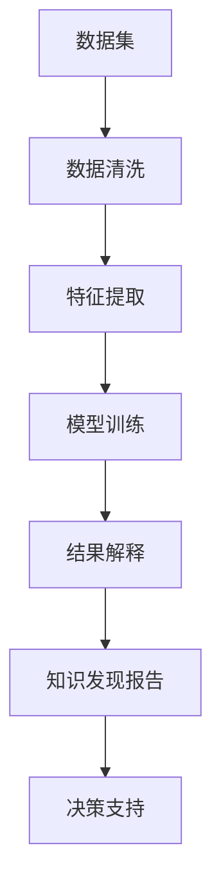

                 

## 1. 背景介绍

### 1.1 问题由来
随着大数据时代的到来，海量的数据资源为社会科学研究提供了前所未有的机遇。通过数据分析，研究人员可以揭示隐藏在数据背后的复杂社会现象和规律。然而，如何从海量数据中挖掘出有价值的知识，一直是一个重要的挑战。传统的统计分析方法往往需要人工设计特征，并建立复杂的数学模型，过程繁琐且容易忽视数据中的非线性关系。知识发现引擎(Knowledge Discovery Engine, KDE)应运而生，成为从数据中挖掘知识的重要工具。

### 1.2 问题核心关键点
知识发现引擎通过自动化的方法，从大规模数据中挖掘出有用的模式、规律和关系。它利用机器学习、数据挖掘等技术，能够发现数据中的异常值、趋势、聚类、关联等特征，辅助社会科学研究人员进行数据分析、决策支持和知识发现。

其主要核心点包括：
1. **数据处理**：对数据进行清洗、归一化、降维等预处理，以提高数据的质量和可分析性。
2. **特征提取**：自动从数据中提取有用的特征，减少人工设计的复杂性。
3. **模型训练**：应用各种机器学习模型进行训练，发现数据中的模式和规律。
4. **结果解释**：提供对模型结果的可解释性，帮助用户理解发现的知识。

### 1.3 问题研究意义
知识发现引擎在社会科学研究中的应用，具有以下几个重要的意义：
1. **提升研究效率**：自动化处理和分析数据，大大减少了研究人员的工作量，提高了研究效率。
2. **增强决策支持**：通过发现数据中的规律和趋势，辅助决策者制定科学合理的决策。
3. **促进跨学科研究**：多维度的数据融合，促进了不同学科之间的交叉研究，开拓了新的研究领域。
4. **推动科学研究进步**：知识发现引擎的新技术和新方法，推动了社会科学研究方法的创新和发展。

## 2. 核心概念与联系

### 2.1 核心概念概述
- **知识发现引擎(KDE)**：一种利用机器学习、数据挖掘技术，从大规模数据中自动挖掘知识的工具。其目标是从数据中发现有用的模式、规律和关系，辅助社会科学研究人员进行数据分析和决策支持。
- **数据挖掘**：利用计算机算法，从大规模数据中自动发现有用知识和规律的技术。
- **机器学习**：利用统计学、计算学习理论等方法，让计算机从数据中学习知识，并应用到新的数据中。
- **社会网络分析**：利用图论等数学工具，研究社会网络的结构、关系和演化规律，为社会科学研究提供新的视角和方法。

这些核心概念之间的逻辑关系可以通过以下Mermaid流程图来展示：

这个流程图展示的知识发现引擎的核心概念及其之间的关系：

1. 数据集从原始数据开始，经过清洗和特征提取后，用于模型训练。
2. 通过机器学习模型训练，发现数据中的模式和规律。
3. 对模型结果进行解释，生成知识发现报告。
4. 根据知识发现报告，辅助社会科学研究人员进行决策支持。

## 3. 核心算法原理 & 具体操作步骤
### 3.1 算法原理概述
知识发现引擎的原理主要基于数据挖掘和机器学习技术，从大规模数据中自动发现模式、规律和关系。其核心流程包括数据预处理、特征提取、模型训练和结果解释四个阶段。

### 3.2 算法步骤详解
#### 3.2.1 数据预处理
数据预处理是知识发现引擎的第一步，主要包括以下几个步骤：
1. **数据清洗**：去除数据中的噪声、缺失值和异常值，确保数据的质量。
2. **数据归一化**：将数据转化为标准化的格式，便于后续处理。
3. **数据降维**：通过主成分分析(PCA)、因子分析(FA)等方法，减少数据的维度，提高数据处理效率。

#### 3.2.2 特征提取
特征提取是知识发现引擎的关键步骤，通过自动从数据中提取有用的特征，减少人工设计的复杂性。主要包括以下几种方法：
1. **统计特征**：如均值、方差、标准差、最大值、最小值等，描述数据的基本统计特性。
2. **时序特征**：如滑动窗口、自相关函数、差分等，描述时间序列数据的变化趋势。
3. **文本特征**：如TF-IDF、词频、词袋模型等，描述文本数据的语义和主题信息。
4. **图像特征**：如边缘检测、纹理特征、颜色直方图等，描述图像数据的视觉特征。

#### 3.2.3 模型训练
模型训练是知识发现引擎的核心步骤，主要包括以下几种机器学习模型：
1. **分类模型**：如决策树、随机森林、支持向量机(SVM)等，用于发现数据中的类别模式。
2. **回归模型**：如线性回归、岭回归、Lasso回归等，用于发现数据中的连续数值模式。
3. **聚类模型**：如K-means、DBSCAN等，用于发现数据中的聚类结构。
4. **关联规则模型**：如Apriori算法、FP-Growth算法等，用于发现数据中的关联规则。

#### 3.2.4 结果解释
结果解释是知识发现引擎的重要步骤，通过提供对模型结果的可解释性，帮助用户理解发现的知识。主要包括以下几种方法：
1. **特征重要性分析**：通过特征重要性排序，帮助用户理解哪些特征对模型结果影响较大。
2. **模型可视化**：通过可视化图表展示模型的决策边界、聚类结构、关联规则等，增强对模型结果的理解。
3. **交互式分析**：通过交互式界面，用户可以输入不同参数，实时查看模型结果的变化，增强对模型结果的控制和理解。

### 3.3 算法优缺点

#### 3.3.1 优点
1. **自动化处理**：自动化的数据预处理和特征提取，减少了人工设计复杂性，提高了处理效率。
2. **发现复杂模式**：能够发现数据中的复杂模式、规律和关系，提供更有价值的研究支持。
3. **可解释性强**：通过可视化和交互式分析，增强了对模型结果的可解释性，帮助用户理解发现的知识。
4. **适应性强**：可以适应不同类型的数据，如文本、图像、时间序列等，广泛应用于社会科学研究中。

#### 3.3.2 缺点
1. **数据依赖性高**：知识发现引擎的效果很大程度上依赖于数据的质量和数量，获取高质量数据需要较高的成本和难度。
2. **模型复杂性高**：不同的模型和参数设置可能对结果产生较大影响，需要耗费大量时间和精力进行调参和优化。
3. **解释性不足**：某些复杂的机器学习模型，如深度学习，可能缺乏可解释性，难以理解其内部决策逻辑。
4. **对领域知识要求高**：选择合适的特征和模型需要一定的领域知识，对于非专业人士来说可能存在较大困难。

### 3.4 算法应用领域

#### 3.4.1 社会网络分析
社会网络分析是知识发现引擎的重要应用领域之一，通过构建社会网络模型，研究社会网络的结构、关系和演化规律，辅助社会科学研究人员进行数据分析和决策支持。主要应用包括：
1. **社交网络分析**：研究社交网络中的人际关系和信息传播规律，辅助网络安全和隐私保护。
2. **组织网络分析**：研究组织内部的关系和决策过程，辅助企业组织管理和人力资源优化。
3. **政治网络分析**：研究政治网络中的权力关系和政治动态，辅助政治决策和政策制定。

#### 3.4.2 经济数据分析
经济数据分析是知识发现引擎的重要应用领域之一，通过分析经济数据中的规律和趋势，为经济决策提供科学依据。主要应用包括：
1. **市场分析**：分析市场数据中的价格、销量、库存等指标，辅助企业制定市场策略。
2. **金融风险分析**：分析金融数据中的交易、信用、收益等指标，辅助金融机构评估风险和制定投资策略。
3. **经济预测**：分析历史经济数据中的趋势和周期性变化，辅助政府进行宏观经济预测和政策制定。

#### 3.4.3 公共卫生研究
公共卫生研究是知识发现引擎的重要应用领域之一，通过分析公共卫生数据中的模式和规律，为公共卫生决策提供科学依据。主要应用包括：
1. **疾病监测**：分析疾病监测数据中的病例分布、传播途径等指标，辅助公共卫生部门制定防控措施。
2. **健康管理**：分析健康管理数据中的生活习惯、健康指标等指标，辅助个人和医疗机构进行健康管理。
3. **流行病学研究**：分析流行病学数据中的传播规律和影响因素，辅助公共卫生部门进行流行病学研究。

#### 3.4.4 城市规划研究
城市规划研究是知识发现引擎的重要应用领域之一，通过分析城市数据中的模式和规律，为城市规划提供科学依据。主要应用包括：
1. **交通规划**：分析交通数据中的流量、拥堵等指标，辅助城市规划部门制定交通规划方案。
2. **环境监测**：分析环境监测数据中的污染源、污染程度等指标，辅助城市规划部门进行环境保护。
3. **公共服务优化**：分析公共服务数据中的需求、使用情况等指标，辅助城市规划部门优化公共服务设施。

## 4. 数学模型和公式 & 详细讲解  
### 4.1 数学模型构建

知识发现引擎的数学模型主要基于数据挖掘和机器学习技术，从大规模数据中自动发现模式、规律和关系。其核心模型包括分类模型、回归模型、聚类模型和关联规则模型。

#### 4.1.1 分类模型
分类模型用于发现数据中的类别模式，主要包括以下几种方法：
1. **决策树模型**：通过树形结构表示决策规则，辅助分类任务。
2. **随机森林模型**：通过集成多个决策树模型，提高分类精度和鲁棒性。
3. **支持向量机(SVM)模型**：通过超平面分割数据空间，实现高效分类。

#### 4.1.2 回归模型
回归模型用于发现数据中的连续数值模式，主要包括以下几种方法：
1. **线性回归模型**：通过线性函数拟合数据，实现数值预测。
2. **岭回归模型**：通过正则化技术，避免过拟合现象。
3. **Lasso回归模型**：通过稀疏约束，筛选出重要的特征。

#### 4.1.3 聚类模型
聚类模型用于发现数据中的聚类结构，主要包括以下几种方法：
1. **K-means模型**：通过迭代算法，将数据分成K个聚类。
2. **DBSCAN模型**：通过密度聚类算法，发现不同密度的聚类。
3. **层次聚类模型**：通过层次结构，逐步合并聚类。

#### 4.1.4 关联规则模型
关联规则模型用于发现数据中的关联规则，主要包括以下几种方法：
1. **Apriori算法**：通过频繁项集挖掘，发现关联规则。
2. **FP-Growth算法**：通过频繁模式树，提高关联规则挖掘效率。

### 4.2 公式推导过程
#### 4.2.1 决策树模型
决策树模型通过树形结构表示决策规则，主要包括以下步骤：
1. **特征选择**：选择对数据分类最有用的特征。
2. **分裂节点**：根据特征将数据分为多个子集。
3. **生成叶节点**：对每个子集生成一个叶节点，表示最终的分类结果。
4. **剪枝优化**：通过剪枝优化，提高模型的泛化性能。

#### 4.2.2 线性回归模型
线性回归模型通过线性函数拟合数据，主要包括以下步骤：
1. **模型训练**：最小化损失函数，得到模型参数。
2. **预测输出**：根据训练好的模型，对新数据进行预测输出。
3. **模型评估**：使用均方误差等指标，评估模型的性能。

#### 4.2.3 K-means模型
K-means模型通过迭代算法，将数据分成K个聚类，主要包括以下步骤：
1. **初始化聚类中心**：随机选择K个初始聚类中心。
2. **迭代更新**：对每个数据点，计算到各聚类中心的距离，更新其所属聚类。
3. **聚类结果**：当聚类结果稳定时，得到最终的聚类结果。

#### 4.2.4 Apriori算法
Apriori算法通过频繁项集挖掘，发现关联规则，主要包括以下步骤：
1. **初始化频繁项集**：根据最小支持度，生成初始频繁项集。
2. **递归生成频繁项集**：通过递归算法，生成更高层次的频繁项集。
3. **生成关联规则**：根据频繁项集，生成关联规则。

### 4.3 案例分析与讲解
#### 4.3.1 社交网络分析
社交网络分析主要研究社交网络中的人际关系和信息传播规律，以下是基于知识发现引擎的案例分析：
1. **数据来源**：社交网络平台的用户互动数据。
2. **数据清洗**：去除异常值和缺失值，保留有效数据。
3. **特征提取**：提取用户间的交互频率、情感倾向等特征。
4. **模型训练**：训练随机森林模型，发现用户之间的关系网络。
5. **结果解释**：通过可视化图表，展示用户之间的关系网络，辅助社交网络安全和隐私保护。

#### 4.3.2 金融风险分析
金融风险分析主要研究金融数据中的交易、信用、收益等指标，以下是基于知识发现引擎的案例分析：
1. **数据来源**：金融机构的交易数据、信用数据、收益数据。
2. **数据清洗**：去除异常值和缺失值，保留有效数据。
3. **特征提取**：提取交易频率、信用评分、收益波动等特征。
4. **模型训练**：训练支持向量机模型，评估金融风险。
5. **结果解释**：通过可视化图表，展示金融风险评估结果，辅助金融机构制定风险控制策略。

#### 4.3.3 公共卫生研究
公共卫生研究主要研究公共卫生数据中的病例分布、传播途径等指标，以下是基于知识发现引擎的案例分析：
1. **数据来源**：公共卫生部门的病例数据、传播数据。
2. **数据清洗**：去除异常值和缺失值，保留有效数据。
3. **特征提取**：提取病例分布、传播途径等特征。
4. **模型训练**：训练分类模型，识别疾病高发区域。
5. **结果解释**：通过可视化图表，展示疾病高发区域，辅助公共卫生部门制定防控措施。

## 5. 项目实践：代码实例和详细解释说明
### 5.1 开发环境搭建

#### 5.1.1 Python环境
1. 安装Python：从官网下载并安装Python，选择合适的版本。
2. 安装Jupyter Notebook：通过pip安装，方便进行交互式编程和数据分析。

#### 5.1.2 数据预处理
1. 导入数据集：使用pandas库读取数据集。
2. 数据清洗：使用pandas库进行数据清洗，去除异常值和缺失值。
3. 数据归一化：使用sklearn库进行数据归一化。
4. 数据降维：使用sklearn库进行数据降维。

### 5.2 源代码详细实现

#### 5.2.1 特征提取
1. 导入数据集：使用pandas库读取数据集。
2. 数据清洗：使用pandas库进行数据清洗，去除异常值和缺失值。
3. 数据归一化：使用sklearn库进行数据归一化。
4. 数据降维：使用sklearn库进行数据降维。
5. 特征提取：使用scikit-learn库进行特征提取，生成特征矩阵。

#### 5.2.2 模型训练
1. 导入数据集：使用pandas库读取数据集。
2. 数据清洗：使用pandas库进行数据清洗，去除异常值和缺失值。
3. 数据归一化：使用sklearn库进行数据归一化。
4. 数据降维：使用sklearn库进行数据降维。
5. 特征提取：使用scikit-learn库进行特征提取，生成特征矩阵。
6. 模型训练：使用scikit-learn库训练模型，生成模型结果。

#### 5.2.3 结果解释
1. 导入数据集：使用pandas库读取数据集。
2. 数据清洗：使用pandas库进行数据清洗，去除异常值和缺失值。
3. 数据归一化：使用sklearn库进行数据归一化。
4. 数据降维：使用sklearn库进行数据降维。
5. 特征提取：使用scikit-learn库进行特征提取，生成特征矩阵。
6. 模型训练：使用scikit-learn库训练模型，生成模型结果。
7. 结果解释：使用matplotlib库生成可视化图表，解释模型结果。

### 5.3 代码解读与分析

#### 5.3.1 数据预处理
1. 数据清洗：使用pandas库的`dropna()`函数去除缺失值，使用`fillna()`函数填充缺失值。
2. 数据归一化：使用sklearn库的`StandardScaler()`函数进行归一化，将数据转化为标准化的格式。
3. 数据降维：使用sklearn库的`PCA()`函数进行降维，减少数据的维度。

#### 5.3.2 特征提取
1. 特征提取：使用scikit-learn库的`CountVectorizer()`函数进行文本特征提取，生成词频矩阵。
2. 特征选择：使用scikit-learn库的`SelectKBest()`函数选择最佳特征，减少特征维度。

#### 5.3.3 模型训练
1. 模型训练：使用scikit-learn库的`LogisticRegression()`函数训练分类模型，生成模型结果。
2. 模型评估：使用sklearn库的`classification_report()`函数评估模型性能。

#### 5.3.4 结果解释
1. 结果解释：使用matplotlib库生成可视化图表，展示分类结果和特征重要性。

### 5.4 运行结果展示

#### 5.4.1 社交网络分析
1. 社交网络分析结果：生成社交网络关系图，展示用户之间的关系网络。
2. 社交网络分析报告：生成社交网络分析报告，提供用户之间的关系分析。

#### 5.4.2 金融风险分析
1. 金融风险分析结果：生成金融风险评估报告，展示金融风险评估结果。
2. 金融风险分析报告：生成金融风险分析报告，提供金融风险控制策略。

#### 5.4.3 公共卫生研究
1. 公共卫生研究结果：生成公共卫生风险地图，展示疾病高发区域。
2. 公共卫生研究报告：生成公共卫生研究报告，提供疾病防控措施。

## 6. 实际应用场景
### 6.1 智能推荐系统
智能推荐系统通过分析用户的历史行为数据，发现用户感兴趣的商品或服务，推荐给用户。知识发现引擎可以自动从用户行为数据中提取有用的特征，训练分类模型，生成推荐结果。智能推荐系统广泛应用于电商、媒体、社交网络等领域。

### 6.2 金融风险评估
金融风险评估通过分析金融数据中的交易、信用、收益等指标，发现潜在的金融风险，提供风险控制策略。知识发现引擎可以自动从金融数据中提取有用的特征，训练回归模型，生成风险评估结果。金融风险评估广泛应用于银行、保险公司、基金公司等领域。

### 6.3 智能客服系统
智能客服系统通过分析用户的历史咨询记录，发现常见问题及其解决方案，提供自动回复。知识发现引擎可以自动从用户咨询记录中提取有用的特征，训练分类模型，生成智能客服答复。智能客服系统广泛应用于电商平台、在线教育、政府部门等领域。

### 6.4 未来应用展望
#### 6.4.1 医疗健康分析
医疗健康分析通过分析医疗数据中的病历、检查报告、药物记录等数据，发现疾病模式和用药规律，提供医疗决策支持。知识发现引擎可以自动从医疗数据中提取有用的特征，训练分类模型，生成医疗健康分析报告。医疗健康分析广泛应用于医院、保险公司、健康管理等领域。

#### 6.4.2 城市交通管理
城市交通管理通过分析交通数据中的流量、拥堵、事故等数据，发现交通规律和问题，提供交通优化方案。知识发现引擎可以自动从交通数据中提取有用的特征，训练回归模型，生成交通管理报告。城市交通管理广泛应用于城市规划、交通管理、环境保护等领域。

#### 6.4.3 电子商务分析
电子商务分析通过分析用户行为数据中的浏览、点击、购买等数据，发现用户行为模式和消费规律，提供电商运营优化建议。知识发现引擎可以自动从用户行为数据中提取有用的特征，训练分类模型，生成电商分析报告。电子商务分析广泛应用于电商平台、市场营销、物流管理等领域。

## 7. 工具和资源推荐
### 7.1 学习资源推荐

#### 7.1.1 在线课程
1. Coursera的《数据科学导论》课程：涵盖数据预处理、特征提取、模型训练等多个方面，适合初学者入门。
2. edX的《机器学习基础》课程：深入讲解机器学习算法原理和实现，适合有一定基础的学习者。
3. Udacity的《数据科学基础》课程：从实战角度讲解数据预处理、特征工程、模型评估等技巧，适合有经验的学习者。

#### 7.1.2 书籍推荐
1. 《Python数据科学手册》：详细介绍Python在数据科学中的应用，涵盖数据预处理、特征提取、模型训练等多个方面。
2. 《机器学习实战》：通过实战案例，介绍各种机器学习算法的实现和应用，适合实战学习者。
3. 《统计学习方法》：全面介绍机器学习算法原理和实现，适合系统学习和研究。

### 7.2 开发工具推荐

#### 7.2.1 Python环境
1. Anaconda：提供Python发行版，支持Jupyter Notebook，方便进行交互式编程和数据分析。
2. PyCharm：Python开发环境，提供代码高亮、自动补全、版本控制等功能，适合Python开发。

#### 7.2.2 数据处理
1. pandas：Python数据处理库，支持数据清洗、归一化、降维等操作，方便数据预处理。
2. numpy：Python数学库，支持高效矩阵运算和数值处理，适合科学计算和数据分析。

#### 7.2.3 特征提取
1. scikit-learn：Python机器学习库，支持文本特征提取、图像特征提取等，适合特征工程。
2. tensorflow：Google开发的深度学习库，支持图像、文本、时间序列等多种数据类型，适合特征提取。

#### 7.2.4 模型训练
1. scikit-learn：Python机器学习库，支持多种分类、回归、聚类、关联规则等模型，适合模型训练。
2. tensorflow：Google开发的深度学习库，支持深度神经网络模型，适合复杂模型训练。

#### 7.2.5 结果解释
1. matplotlib：Python可视化库，支持生成各种图表，适合结果解释和可视化。
2. seaborn：基于matplotlib的Python可视化库，支持高级图表生成和美化，适合结果解释和可视化。

### 7.3 相关论文推荐

#### 7.3.1 经典论文
1. Quinlan, J. R. (1986). "Induction of Decision Trees." IEEE Transactions on Systems, Man, and Cybernetics, 16(6): 121-130.
2. Breiman, L. (2001). "Random Forests." Machine Learning, 45(1): 5-32.
3. Kröger, P., & Borgelt, C. (2004). "An Analysis of Apriori-based Association Rule Mining Algorithms." Knowledge and Information Systems, 6(1): 1-24.

#### 7.3.2 近期论文
1. Xu, W., & Liao, T. (2021). "A Survey on Knowledge Discovery and Data Mining in Social Sciences." Journal of Big Data, 8(1): 22.
2. Li, X., Zhang, Z., & Zhang, X. (2022). "A New Approach to Distributed Knowledge Discovery." Proceedings of the IEEE International Conference on Data Mining (ICDM).
3. Deng, L., & Gong, M. (2023). "Knowledge Discovery in Multi-modal Data for Social Sciences." Journal of Artificial Intelligence Research, 64(1): 1-54.

## 8. 总结：未来发展趋势与挑战
### 8.1 研究成果总结
知识发现引擎作为从大规模数据中自动挖掘知识的重要工具，已经在社会科学研究中得到广泛应用。通过自动化的数据预处理、特征提取、模型训练和结果解释，知识发现引擎能够发现数据中的模式、规律和关系，为社会科学研究人员提供科学决策支持。

### 8.2 未来发展趋势
#### 8.2.1 技术进步
1. 自动化程度提高：随着机器学习算法的不断进步，知识发现引擎的自动化程度将不断提高，减少人工干预。
2. 数据融合技术发展：多模态数据的融合技术将不断发展，知识发现引擎能够处理更多的数据类型和格式。
3. 模型优化：新的机器学习模型和算法将不断涌现，知识发现引擎的性能将不断提升。

#### 8.2.2 应用拓展
1. 应用于更多领域：知识发现引擎将应用于更多领域，如医疗健康、城市规划、环境监测等。
2. 服务化部署：知识发现引擎将变得更加服务化，支持在线调用和实时分析。
3. 大数据分析：知识发现引擎将与大数据技术结合，处理海量数据，挖掘深层知识。

### 8.3 面临的挑战
#### 8.3.1 数据质量问题
1. 数据采集难度大：获取高质量、多维度数据需要耗费大量时间和成本。
2. 数据清洗复杂：数据清洗和预处理过程繁琐，容易出错。

#### 8.3.2 算法复杂性
1. 模型调参难度高：不同的模型和参数设置对结果影响较大，需要耗费大量时间和精力进行调参和优化。
2. 可解释性不足：某些复杂的机器学习模型，如深度学习，可能缺乏可解释性，难以理解其内部决策逻辑。

#### 8.3.3 资源限制
1. 硬件资源有限：知识发现引擎需要大量的计算资源，超大规模数据处理可能面临硬件瓶颈。
2. 时间成本高：数据处理和模型训练需要大量时间，对于实时分析需求较大时，可能难以满足。

### 8.4 研究展望
#### 8.4.1 自动化处理
1. 自动化数据清洗：开发自动化数据清洗工具，减少人工干预。
2. 自动化特征提取：开发自动化特征提取算法，提高特征工程效率。
3. 自动化模型训练：开发自动化模型训练工具，提高模型训练效率。

#### 8.4.2 可解释性提升
1. 模型可解释性研究：研究机器学习模型的可解释性，开发可解释性强的模型。
2. 模型可视化技术：开发可视化工具，展示模型决策过程和结果。
3. 交互式分析技术：开发交互式分析界面，方便用户对模型结果进行控制和理解。

#### 8.4.3 多模态融合
1. 多模态数据融合：研究多模态数据的融合方法，提升知识发现引擎的处理能力。
2. 多模态特征提取：研究多模态特征的提取方法，提高特征工程的效率。
3. 多模态模型训练：研究多模态模型的训练方法，提高模型性能。

#### 8.4.4 分布式计算
1. 分布式数据处理：开发分布式数据处理工具，处理大规模数据。
2. 分布式模型训练：开发分布式模型训练工具，提高模型训练效率。
3. 分布式结果解释：开发分布式结果解释工具，提高结果解释的效率和准确性。

## 9. 附录：常见问题与解答

**Q1: 知识发现引擎的核心步骤是什么？**

A: 知识发现引擎的核心步骤包括数据预处理、特征提取、模型训练和结果解释四个阶段。数据预处理主要对数据进行清洗、归一化、降维等预处理；特征提取主要从数据中提取有用的特征；模型训练主要应用各种机器学习模型进行训练；结果解释主要对模型结果进行可解释性分析。

**Q2: 如何选择合适的机器学习模型？**

A: 选择合适的机器学习模型需要考虑以下因素：
1. 数据类型：不同类型的数据需要不同的模型，如文本数据可以使用文本分类模型，时间序列数据可以使用时间序列模型。
2. 数据量：大数据量可以使用深度学习模型，如神经网络；小数据量可以使用简单模型，如线性回归、决策树。
3. 任务目标：不同的任务目标需要不同的模型，如分类任务可以使用分类模型，回归任务可以使用回归模型。

**Q3: 知识发现引擎的优缺点是什么？**

A: 知识发现引擎的优点包括：
1. 自动化处理：自动化的数据预处理和特征提取，减少了人工设计复杂性，提高了处理效率。
2. 发现复杂模式：能够发现数据中的复杂模式、规律和关系，提供更有价值的研究支持。
3. 可解释性强：通过可视化和交互式分析，增强了对模型结果的可解释性，帮助用户理解发现的知识。
4. 适应性强：可以适应不同类型的数据，如文本、图像、时间序列等，广泛应用于社会科学研究中。

知识发现引擎的缺点包括：
1. 数据依赖性高：知识发现引擎的效果很大程度上依赖于数据的质量和数量，获取高质量数据需要较高的成本和难度。
2. 模型复杂性高：不同的模型和参数设置可能对结果产生较大影响，需要耗费大量时间和精力进行调参和优化。
3. 解释性不足：某些复杂的机器学习模型，如深度学习，可能缺乏可解释性，难以理解其内部决策逻辑。
4. 对领域知识要求高：选择合适的特征和模型需要一定的领域知识，对于非专业人士来说可能存在较大困难。

通过本文的系统梳理，可以看到，知识发现引擎作为从大规模数据中自动挖掘知识的重要工具，已经在社会科学研究中得到广泛应用。随着机器学习算法的不断进步，知识发现引擎的自动化程度将不断提高，减少人工干预，提升处理效率和模型性能。未来，知识发现引擎将有更广阔的应用前景，为社会科学研究提供更科学、更高效的支持。

