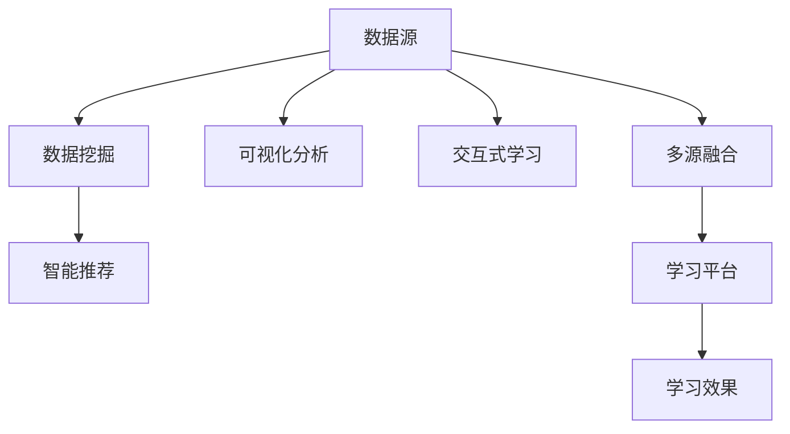

                 

# 知识发现引擎如何帮助程序员快速学习

## 1. 背景介绍

### 1.1 问题由来
在现代软件开发中，程序员面临着快速迭代、持续学习、多工具协同的巨大挑战。如何高效地从海量知识库中提取有价值的信息，快速掌握新技术，并在实际工作中加以应用，成为了制约程序员成长的关键问题。知识发现引擎(Knowledge Discovery Engine, KDE)技术的出现，为程序员提供了智能化、自动化的知识发现和利用手段，显著提升了学习和工作效率。

### 1.2 问题核心关键点
知识发现引擎的核心在于利用数据挖掘、机器学习等技术，从知识库、文档、代码库等数据源中自动发现和提炼有用的信息，辅助程序员快速学习新技术，掌握新技能。其关键点包括：
1. 自动化数据挖掘：自动从大规模数据源中提取有价值的信息，无需手动筛选。
2. 智能推荐：根据程序员的学习背景和需求，推荐最相关的知识和技能。
3. 可视化分析：通过图表、仪表盘等形式，直观展示知识结构和学习路径。
4. 交互式学习：提供互动式的学习工具，如代码示例、在线练习、社区交流等。
5. 多源融合：整合代码库、文档、知识库等多渠道信息，提供一站式学习平台。

## 2. 核心概念与联系

### 2.1 核心概念概述

为更好地理解知识发现引擎的工作原理和应用方法，本节将介绍几个关键概念：

- 知识发现(Knowledge Discovery, KD)：从大规模数据源中，自动发现有用信息和知识的过程。
- 数据挖掘(Data Mining)：利用统计学、机器学习等技术，从数据中提取有价值的信息和规律。
- 智能推荐系统(Intelligent Recommendation System)：根据用户行为和偏好，智能推荐相关内容。
- 可视化分析(Visualization Analysis)：将数据通过图表、仪表盘等形式展示，便于用户理解和决策。
- 交互式学习(Interactive Learning)：通过互动式的学习工具，增强学习效果。
- 多源融合(Multi-Source Integration)：将不同数据源的信息整合，提供一站式学习平台。

这些概念共同构成了知识发现引擎的核心框架，使其能够高效地从海量数据中提炼有用信息，辅助程序员快速掌握新技能。

### 2.2 核心概念原理和架构的 Mermaid 流程图



这个流程图展示了知识发现引擎的主要工作流程：

1. 从数据源获取数据。
2. 利用数据挖掘技术，自动发现有用信息。
3. 基于智能推荐系统，推荐相关知识和技能。
4. 通过可视化分析，直观展示知识结构。
5. 提供交互式学习工具，增强学习效果。
6. 集成多源数据，提供一站式学习平台。
7. 最终提升学习效果和用户体验。

## 3. 核心算法原理 & 具体操作步骤

### 3.1 算法原理概述

知识发现引擎的核心算法主要基于数据挖掘和机器学习技术，利用大规模数据源，自动发现和提炼有用信息。其核心思想是：从知识库、文档、代码库等数据源中，自动提取与程序员学习需求相关的信息，并根据其学习行为和偏好，智能推荐最相关的知识和技能。

知识发现引擎的工作流程可以概括为以下几个步骤：

1. **数据采集与预处理**：从知识库、文档、代码库等数据源中，自动采集相关数据，并进行预处理，如去重、分词、标注等。
2. **特征提取与选择**：从处理后的数据中，提取有用的特征，并进行特征选择，去除冗余信息。
3. **模型训练与评估**：利用机器学习模型，如分类、聚类、关联规则等，对提取的特征进行训练，并评估模型的性能。
4. **知识推荐与可视化**：根据程序员的学习行为和偏好，智能推荐相关知识和技能，并通过图表、仪表盘等形式进行可视化展示。

### 3.2 算法步骤详解

以下将详细介绍知识发现引擎的核心算法步骤：

**Step 1: 数据采集与预处理**

- **数据源**：选择知识库、文档、代码库等数据源，自动采集与程序员学习需求相关的数据。
- **数据清洗**：对采集到的数据进行去重、分词、标注等预处理，确保数据质量。
- **数据格式转换**：将不同格式的数据转换为统一的格式，便于后续处理。

**Step 2: 特征提取与选择**

- **特征提取**：利用自然语言处理技术，如TF-IDF、Word2Vec等，从文本数据中提取有用的特征。
- **特征选择**：通过统计、过滤、选择等技术，去除冗余和无关特征，保留对程序员学习最有帮助的特征。

**Step 3: 模型训练与评估**

- **模型选择**：根据任务需求，选择合适的机器学习模型，如分类模型、聚类模型、关联规则模型等。
- **训练与优化**：使用训练数据对模型进行训练，并根据验证数据进行优化，确保模型的泛化性能。
- **模型评估**：使用测试数据对模型进行评估，评估指标包括准确率、召回率、F1-score等。

**Step 4: 知识推荐与可视化**

- **知识推荐**：根据程序员的学习行为和偏好，智能推荐相关知识和技能，如代码示例、在线练习、社区交流等。
- **可视化展示**：将推荐的知识通过图表、仪表盘等形式进行可视化展示，直观展示知识结构和学习路径。

### 3.3 算法优缺点

知识发现引擎具有以下优点：

1. **高效自动化**：自动化数据挖掘和特征选择，大大降低了人工筛选的工作量。
2. **智能推荐**：根据用户行为和偏好，智能推荐相关内容，提高学习效率。
3. **可视化分析**：通过图表、仪表盘等形式展示知识结构和学习路径，便于用户理解和决策。
4. **交互式学习**：提供互动式的学习工具，增强学习效果。
5. **多源融合**：整合代码库、文档、知识库等多渠道信息，提供一站式学习平台。

同时，该方法也存在一定的局限性：

1. **数据质量依赖**：知识发现的效果很大程度上取决于数据源的质量和完整性，高质量数据源的获取成本较高。
2. **模型泛化能力有限**：模型的性能很大程度上取决于训练数据的代表性，对于小规模数据集或特定领域的任务，可能存在泛化性能不足的问题。
3. **推荐算法复杂**：智能推荐算法复杂，需要大量的计算资源和时间成本。
4. **隐私和安全问题**：从代码库等数据源中获取数据，可能涉及隐私和安全问题，需注意数据保护。

尽管存在这些局限性，但知识发现引擎在辅助程序员学习方面的巨大潜力已经得到了验证，其高效、智能、可视化的特点，使其成为程序员学习工具的重要发展方向。

### 3.4 算法应用领域

知识发现引擎技术广泛应用于各种软件开发和学习场景，具体包括：

- **代码学习**：从代码库中提取有用信息，推荐相关代码示例和最佳实践。
- **文档学习**：从技术文档、API文档、开发者手册中提取关键信息，帮助程序员快速理解新技术。
- **社区学习**：从开源社区、技术论坛、博客等平台中提取有价值的信息，提供互动式学习和社区交流。
- **项目管理**：从项目管理工具中提取项目信息，推荐相关技术栈、工具和实践。
- **知识图谱**：从知识图谱中提取实体关系和属性信息，提供结构化的知识学习路径。

除了上述这些场景外，知识发现引擎还被创新性地应用于更多领域，如科研学习、教育培训、业务分析等，为不同行业带来新的学习方式和业务价值。

## 4. 数学模型和公式 & 详细讲解 & 举例说明

### 4.1 数学模型构建

知识发现引擎的核心算法涉及数据挖掘、机器学习等技术，利用数学模型对数据进行分析和处理。以下是几个常用的数学模型：

- **TF-IDF（Term Frequency-Inverse Document Frequency）**：用于文本特征提取，衡量单词在文档中的重要性。
- **Word2Vec**：用于词向量表示，将单词映射到高维空间中的向量。
- **分类模型（如Logistic Regression、SVM等）**：用于将数据分类，判断其所属类别。
- **聚类模型（如K-means、DBSCAN等）**：用于将数据聚类，发现数据中的分组结构。
- **关联规则模型（如Apriori算法）**：用于发现数据中的关联关系，如购物篮分析。

### 4.2 公式推导过程

以TF-IDF模型为例，以下是其基本公式和推导过程：

**基本公式**：

$$
TF(t,d) = \frac{\text{单词 } t \text{ 在文档 } d \text{ 中出现的次数}}{\text{文档 } d \text{ 的总词数}}
$$

$$
IDF(t) = \log \left( \frac{\text{语料库总数}}{\text{包含单词 } t \text{ 的文档数}} \right)
$$

**推导过程**：

1. **TF（Term Frequency）**：衡量单词在文档中的重要性，计算公式为单词在文档中出现的次数除以文档的总词数。
2. **IDF（Inverse Document Frequency）**：衡量单词在语料库中的普遍性，计算公式为语料库总数除以包含单词的文档数。
3. **TF-IDF**：将TF和IDF结合，计算单词在文档中的权重，公式为TF与IDF的乘积。

通过TF-IDF模型，可以将文本数据转换为向量形式，便于机器学习模型处理和分析。

### 4.3 案例分析与讲解

假设某程序员正在学习新技术，需要找到相关的代码示例和文档。知识发现引擎可以通过以下步骤进行分析和推荐：

1. **数据采集**：从代码库、技术文档等数据源中，自动采集与新技术相关的数据。
2. **特征提取**：使用TF-IDF模型，从文本数据中提取有用的特征。
3. **模型训练**：使用分类模型，将文档分类为代码示例、API文档、开发者手册等不同类型。
4. **知识推荐**：根据程序员的学习背景和需求，智能推荐最相关的代码示例和文档。
5. **可视化展示**：将推荐的结果通过图表、仪表盘等形式进行可视化展示，直观展示学习路径和进度。

## 5. 项目实践：代码实例和详细解释说明

### 5.1 开发环境搭建

在进行知识发现引擎实践前，我们需要准备好开发环境。以下是使用Python进行Apache Spark开发的环境配置流程：

1. 安装Apache Spark：从官网下载并安装Apache Spark，根据操作系统选择不同的安装包。
2. 安装PySpark：从官网下载并安装PySpark，确保与Apache Spark版本兼容。
3. 安装Python开发环境：如Anaconda、Virtualenv等，确保Python版本与Spark版本兼容。
4. 安装相关库：如pandas、numpy、scikit-learn等，使用pip安装。

完成上述步骤后，即可在PySpark环境中开始知识发现引擎的开发。

### 5.2 源代码详细实现

我们以TF-IDF模型为例，给出使用PySpark进行文本特征提取的代码实现：

```python
from pyspark.sql import SparkSession
from pyspark.ml.feature import TFIDVectorizer
from pyspark.sql.functions import col

# 创建SparkSession
spark = SparkSession.builder.appName('TF-IDF Model').getOrCreate()

# 加载文本数据
data = spark.read.text('path/to/text/data')

# 分词处理
data = data.select(col('value').cast('string').explode().alias('word'))

# 计算TF-IDF值
tfidf = TFIDVectorizer(inputCol='word', outputCol='tfidf', minDF=1.0).fit(data)
data_with_tfidf = tfidf.transform(data)

# 输出TF-IDF结果
data_with_tfidf.show()
```

### 5.3 代码解读与分析

让我们再详细解读一下关键代码的实现细节：

**SparkSession创建**：
- `spark = SparkSession.builder.appName('TF-IDF Model').getOrCreate()`
  创建SparkSession，并指定应用名称。

**文本数据加载**：
- `data = spark.read.text('path/to/text/data')`
  从指定路径加载文本数据。

**分词处理**：
- `data = data.select(col('value').cast('string').explode().alias('word'))`
  将文本数据分词，并转换成新的列`word`。

**TF-IDF计算**：
- `tfidf = TFIDVectorizer(inputCol='word', outputCol='tfidf', minDF=1.0).fit(data)`
  使用TFIDVectorizer进行TF-IDF计算，`inputCol`指定分词后的文本列，`outputCol`指定输出列，`minDF`指定最小文档频率。

**TF-IDF转换**：
- `data_with_tfidf = tfidf.transform(data)`
  将原始数据和计算结果结合，生成新的数据集`data_with_tfidf`。

**结果展示**：
- `data_with_tfidf.show()`
  展示计算后的TF-IDF结果。

可以看到，使用PySpark进行文本特征提取非常简洁高效。通过TF-IDF模型，我们可以将文本数据转换为向量形式，便于后续处理和分析。

## 6. 实际应用场景

### 6.1 智能代码学习平台

知识发现引擎在智能代码学习平台中的应用，极大地提升了程序员的学习效率和效果。通过从代码库中自动提取有用信息，智能推荐相关的代码示例和最佳实践，程序员可以更快地掌握新技术，避免重复劳动。

智能代码学习平台一般包括以下几个关键组件：

- **代码示例推荐**：从代码库中自动提取与当前学习主题相关的代码示例，提供互动式的代码练习和调试环境。
- **最佳实践分析**：利用数据挖掘技术，从代码库中自动提取最佳实践和常见错误，生成学习指南。
- **社区交流集成**：与开源社区、技术论坛等平台集成，提供互动式的社区交流和学习资源。
- **学习进度追踪**：通过知识发现引擎，自动跟踪程序员的学习进度和成果，提供个性化的学习路径和建议。

### 6.2 智能文档推荐系统

知识发现引擎在智能文档推荐系统中的应用，能够显著提升程序员查阅文档的效率和准确性。通过从技术文档、API文档、开发者手册等数据源中自动提取有用信息，智能推荐与当前学习需求相关的文档，避免程序员在文档海洋中迷失方向。

智能文档推荐系统一般包括以下几个关键组件：

- **文档自动摘要**：利用自然语言处理技术，从文档自动生成简明摘要，便于程序员快速浏览。
- **文档相关性计算**：使用分类模型或聚类模型，计算文档与当前学习需求的相关性，智能推荐相关文档。
- **文档标签和分类**：为文档添加标签和分类，方便程序员查找和分类管理文档。
- **文档版本管理**：根据文档的更新频率和版本信息，推荐最新的文档版本，避免使用过时的信息。

### 6.3 多源数据融合学习平台

知识发现引擎在多源数据融合学习平台中的应用，能够整合不同数据源的信息，提供一站式的学习平台。通过整合代码库、文档、知识图谱等多渠道信息，知识发现引擎能够提供更加全面和准确的学习资源，帮助程序员从多角度理解和学习新技术。

多源数据融合学习平台一般包括以下几个关键组件：

- **代码库集成**：从代码库中提取有用信息，推荐相关的代码示例和最佳实践。
- **文档集成**：从技术文档、API文档、开发者手册等数据源中提取有用信息，提供互动式的学习资源。
- **知识图谱集成**：从知识图谱中提取实体关系和属性信息，提供结构化的学习路径和推荐。
- **在线练习平台**：提供互动式的在线练习工具，帮助程序员巩固学习成果。
- **社区交流平台**：与开源社区、技术论坛等平台集成，提供互动式的社区交流和学习资源。

## 7. 工具和资源推荐

### 7.1 学习资源推荐

为了帮助开发者系统掌握知识发现引擎的理论基础和实践技巧，这里推荐一些优质的学习资源：

1. 《Apache Spark实战》系列博文：由Spark技术专家撰写，深入浅出地介绍了Spark的核心概念和编程技巧。
2. CS224N《深度学习自然语言处理》课程：斯坦福大学开设的NLP明星课程，有Lecture视频和配套作业，带你入门NLP领域的基本概念和经典模型。
3. 《大数据机器学习与Apache Spark》书籍：详细介绍了使用Spark进行数据处理和机器学习的实践方法。
4. Kaggle竞赛平台：提供大量数据集和竞赛任务，帮助开发者实战练习。
5. PySpark官方文档：Spark的Python API官方文档，提供了丰富的API参考和示例代码。

通过对这些资源的学习实践，相信你一定能够快速掌握知识发现引擎的精髓，并用于解决实际的NLP问题。

### 7.2 开发工具推荐

高效的开发离不开优秀的工具支持。以下是几款用于知识发现引擎开发的常用工具：

1. Apache Spark：用于大规模数据处理和分析，提供了丰富的API和组件，适合构建知识发现引擎应用。
2. PySpark：Spark的Python API，提供了更加简洁的编程接口和可视化工具，适合数据分析和机器学习任务。
3. Jupyter Notebook：用于交互式编程和数据探索，支持代码块、数据可视化、代码重用等功能。
4. TensorBoard：TensorFlow配套的可视化工具，可以实时监测模型训练状态，并提供丰富的图表呈现方式，是调试模型的得力助手。
5. Weights & Biases：模型训练的实验跟踪工具，可以记录和可视化模型训练过程中的各项指标，方便对比和调优。

合理利用这些工具，可以显著提升知识发现引擎的开发效率，加快创新迭代的步伐。

### 7.3 相关论文推荐

知识发现引擎技术的发展源于学界的持续研究。以下是几篇奠基性的相关论文，推荐阅读：

1. Pattern Discovery in Large Databases（Vladimir J. Mikheev, 1984）：介绍了大数据模式发现的基本方法和技术。
2. Machine Learning: Trends, Strategies, and Resources（Tom Mitchell, 1997）：系统总结了机器学习的发展历程和趋势。
3. Information Retrieval（Christopher D. Manning, 2008）：介绍了信息检索和知识发现的基本概念和算法。
4. Knowledge Discovery and Data Mining（Jerry K. Lawson, 2012）：系统总结了知识发现和数据挖掘的最新研究成果和技术。
5. Deep Learning with Spark（Yogesh Dubey, 2018）：介绍了在大数据环境下，使用Spark进行深度学习的实践方法。

这些论文代表了大数据知识和发现技术的发展脉络。通过学习这些前沿成果，可以帮助研究者把握学科前进方向，激发更多的创新灵感。

## 8. 总结：未来发展趋势与挑战

### 8.1 总结

本文对知识发现引擎的原理和应用进行了全面系统的介绍。首先阐述了知识发现引擎在程序员学习和开发中的重要作用，明确了其自动化数据挖掘、智能推荐、可视化分析、交互式学习、多源融合等核心功能。其次，从原理到实践，详细讲解了知识发现引擎的核心算法步骤和数学模型，给出了知识发现引擎的代码实现示例。同时，本文还广泛探讨了知识发现引擎在智能代码学习平台、智能文档推荐系统、多源数据融合学习平台等多个场景的应用前景，展示了知识发现引擎的巨大潜力。此外，本文精选了知识发现引擎的相关学习资源、开发工具和研究论文，力求为读者提供全方位的技术指引。

通过本文的系统梳理，可以看到，知识发现引擎在帮助程序员快速学习方面的巨大潜力，其高效、智能、可视化的特点，使其成为程序员学习工具的重要发展方向。未来，伴随知识发现引擎技术的不断发展，相信程序员的学习和工作效率将得到显著提升，人工智能技术的普及和应用也将进入新的阶段。

### 8.2 未来发展趋势

展望未来，知识发现引擎技术将呈现以下几个发展趋势：

1. **自动化水平提升**：自动化数据挖掘和特征选择技术将进一步发展，降低人工筛选的工作量，提高知识发现的效率。
2. **智能推荐算法优化**：推荐算法将更加智能和精准，根据用户行为和偏好，提供更加个性化的学习资源和推荐。
3. **可视化分析深化**：可视化工具将更加丰富和智能，通过图表、仪表盘等形式，直观展示知识结构和学习路径，增强用户体验。
4. **多模态数据融合**：知识发现引擎将整合不同模态的数据，如图像、语音、文本等，提供更加全面和准确的学习资源。
5. **知识图谱的深度应用**：知识图谱将与知识发现引擎深度融合，提供结构化的知识学习路径和推荐，增强知识发现的效果。
6. **交互式学习工具扩展**：通过增强现实(AR)、虚拟现实(VR)等技术，提供沉浸式的学习体验，增强学习效果。

以上趋势凸显了知识发现引擎技术的广阔前景。这些方向的探索发展，必将进一步提升程序员的学习效率和效果，为人工智能技术的发展提供新的动力。

### 8.3 面临的挑战

尽管知识发现引擎技术已经取得了显著进展，但在迈向更加智能化、普适化应用的过程中，仍面临诸多挑战：

1. **数据质量瓶颈**：知识发现的效果很大程度上取决于数据源的质量和完整性，高质量数据源的获取成本较高。如何获取和处理大规模高质量数据，仍是一个重要挑战。
2. **推荐算法复杂**：智能推荐算法复杂，需要大量的计算资源和时间成本，如何提高推荐算法的效率和准确性，是一个重要问题。
3. **隐私和安全问题**：从代码库等数据源中获取数据，可能涉及隐私和安全问题，如何保护用户数据，确保数据安全，是一个重要课题。
4. **知识泛化能力不足**：知识发现引擎面对特定领域的任务时，泛化性能可能不足，如何提高知识发现引擎的通用性和泛化能力，是一个重要研究方向。
5. **多源数据融合难度大**：不同数据源的数据格式和结构差异较大，如何高效整合多源数据，提供一个一致的数据处理框架，是一个重要问题。

尽管存在这些挑战，但知识发现引擎在辅助程序员学习方面的巨大潜力已经得到了验证，其高效、智能、可视化的特点，使其成为程序员学习工具的重要发展方向。

### 8.4 研究展望

面对知识发现引擎面临的种种挑战，未来的研究需要在以下几个方面寻求新的突破：

1. **数据采集与预处理技术**：开发更加自动化和高效的数据采集与预处理技术，降低人工干预的工作量，提高数据质量。
2. **推荐算法优化**：开发更加智能和高效的推荐算法，提高推荐算法的效率和准确性，降低计算成本。
3. **隐私和安全保护**：开发隐私和安全保护技术，确保用户数据和隐私安全。
4. **多源数据融合技术**：开发多源数据融合技术，提供一个一致的数据处理框架，高效整合不同数据源的信息。
5. **通用知识发现技术**：开发通用知识发现技术，提高知识发现引擎的泛化能力和应用范围，适应更多领域的知识发现需求。

这些研究方向的探索，必将引领知识发现引擎技术迈向更高的台阶，为程序员学习和发展提供更强大的技术支持。面向未来，知识发现引擎技术还需要与其他人工智能技术进行更深入的融合，如知识图谱、自然语言处理等，多路径协同发力，共同推动自然语言理解和智能交互系统的进步。只有勇于创新、敢于突破，才能不断拓展知识发现引擎的边界，让智能技术更好地造福人类社会。

## 9. 附录：常见问题与解答

**Q1：知识发现引擎是否适用于所有领域？**

A: 知识发现引擎技术可以应用于绝大多数领域，但其效果取决于数据源的质量和代表性。对于特定领域的知识发现，需要相应领域的数据源和专家知识，才能获得理想的效果。

**Q2：知识发现引擎如何处理无结构化数据？**

A: 知识发现引擎可以处理多种数据源，包括文本、图像、语音等无结构化数据。通过自然语言处理、图像识别等技术，将无结构化数据转换为结构化数据，再利用机器学习模型进行分析和处理。

**Q3：知识发现引擎的推荐算法有哪些？**

A: 知识发现引擎的推荐算法包括基于协同过滤、基于内容的推荐、基于矩阵分解的推荐等。这些算法可以根据用户的行为和偏好，智能推荐相关知识和技能，提高学习效率。

**Q4：知识发现引擎是否能够解决所有的学习问题？**

A: 知识发现引擎能够解决很多学习问题，但并不是万能的。对于复杂的问题，需要结合专家知识、人工干预等方式进行解决。

**Q5：知识发现引擎如何保护用户隐私？**

A: 知识发现引擎可以通过数据脱敏、差分隐私等技术保护用户隐私，确保用户数据的安全和匿名性。

这些常见问题的解答，可以帮助读者更好地理解知识发现引擎的原理和应用，为学习和实践提供有力的支持。

---

作者：禅与计算机程序设计艺术 / Zen and the Art of Computer Programming

