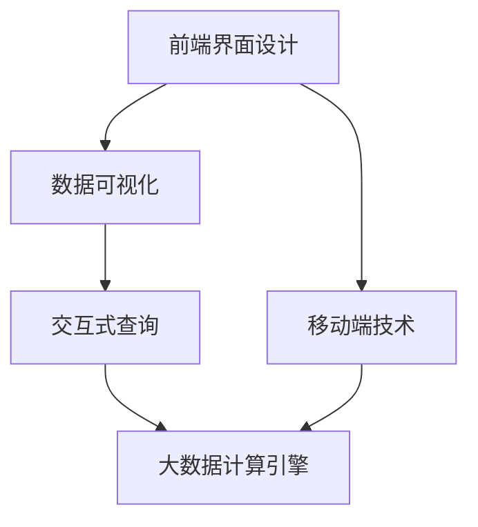

                 

# 知识发现引擎的前端技术选型与实现

## 1. 背景介绍

### 1.1 问题由来
在当今数据驱动的时代，各个行业对于知识发现的需求日益增长。企业希望能够从海量数据中提取出有价值的信息，以支撑决策、提升业务、降低风险等目标。然而，传统的数据挖掘和分析方法往往无法满足这种实时性、复杂性、多样性、隐私性、普适性等多重需求。

知识发现引擎(Knowledge Discovery Engine, KDE)应运而生。通过借助先进的算法和工具，KDE能够自动地从数据中挖掘出隐藏的知识和模式，辅助决策，驱动企业创新。然而，KDE的构建和部署并非易事，尤其是在前端技术选型方面，需要考虑诸多因素。

### 1.2 问题核心关键点
本文章将详细探讨知识发现引擎的前端技术选型与实现，包括但不限于：
- 前端界面设计的最佳实践。
- 数据可视化工具的全面对比。
- 交互式查询功能的构建。
- 前沿算法和模型的应用。
- 数据流处理框架的介绍。
- 大数据计算引擎的适配。
- 移动端技术选型和实现。

通过深入探讨这些关键点，我们希望能够为知识发现引擎的前端技术选型提供全方位的参考，助力其高效、稳定、可扩展的实现。

## 2. 核心概念与联系

### 2.1 核心概念概述

为了更好地理解知识发现引擎的前端技术选型与实现，本节将介绍几个密切相关的核心概念：

- 前端界面设计（UI Design）：知识发现引擎的前端界面是用户与系统交互的主要途径，直接影响到用户体验和数据感知。
- 数据可视化（Data Visualization）：通过图形、图表等形式，将复杂的数据转化为直观、易懂的视觉表现，帮助用户更快速、准确地理解数据。
- 交互式查询（Interactive Query）：允许用户实时地、动态地查询数据，支持多种查询语言和灵活的查询条件，以满足多样化的查询需求。
- 大数据计算引擎（Big Data Compute Engine）：知识发现引擎通常需要处理海量数据，故需要高效、稳定的计算引擎支持。
- 移动端技术（Mobile Technology）：随着移动设备的普及，移动端的前端技术选型同样重要，需要满足移动端的高性能、响应式设计需求。

这些核心概念之间相互关联，共同构成了知识发现引擎的前端技术体系。

### 2.2 核心概念原理和架构的 Mermaid 流程图(Mermaid 流程节点中不要有括号、逗号等特殊字符)

## 3. 核心算法原理 & 具体操作步骤

### 3.1 算法原理概述

知识发现引擎的核心算法主要包括数据清洗、特征工程、模型训练、模式发现、知识表示、推荐系统等模块。各模块算法设计需要考虑数据规模、模型复杂度、计算效率、算法可解释性等因素。

### 3.2 算法步骤详解

#### 3.2.1 数据清洗

数据清洗主要包括去重、填补缺失值、异常值检测、文本数据清洗等步骤。对于不同的数据源，需要设计不同的清洗策略，以确保数据的一致性和准确性。

#### 3.2.2 特征工程

特征工程是知识发现的重要环节，通过选取、构建、变换、融合等方法，将原始数据转化为模型可用的特征向量。常见的特征工程方法包括PCA、LDA、T-SNE等。

#### 3.2.3 模型训练

模型训练阶段需要使用合适的算法和模型对特征向量进行拟合，以发现数据中的规律和模式。常见的模型包括线性回归、决策树、随机森林、神经网络、深度学习等。

#### 3.2.4 模式发现

模式发现主要通过聚类、关联规则、异常检测等算法，挖掘出数据中的隐含结构和知识。例如，K-means算法可进行聚类分析，Apriori算法可进行关联规则挖掘，Isolation Forest算法可进行异常检测。

#### 3.2.5 知识表示

知识表示是将发现的知识转化为结构化的形式，以便于存储、检索和应用。常见的知识表示方法包括本体论、语义网、图形数据库等。

#### 3.2.6 推荐系统

推荐系统根据用户行为和兴趣，推荐合适的知识和信息。常见算法包括协同过滤、内容推荐、基于规则的推荐等。

### 3.3 算法优缺点

#### 3.3.1 数据清洗

优点：去除噪声和异常数据，提高数据质量。
缺点：数据清洗过程复杂，需要耗费大量时间和计算资源。

#### 3.3.2 特征工程

优点：提升模型准确性，增强数据表达能力。
缺点：需要丰富的领域知识，特征选择复杂。

#### 3.3.3 模型训练

优点：挖掘数据中的复杂模式，适应性强。
缺点：模型复杂度较高，计算资源消耗大。

#### 3.3.4 模式发现

优点：发现数据中的隐含结构和知识。
缺点：算法复杂度较高，对数据规模和特征维度的要求较高。

#### 3.3.5 知识表示

优点：知识结构化，易于存储和应用。
缺点：表示方式复杂，难于理解和更新。

#### 3.3.6 推荐系统

优点：个性化推荐，提升用户满意度。
缺点：算法复杂度较高，对数据多样性和实时性要求高。

### 3.4 算法应用领域

知识发现引擎广泛应用于金融、零售、医疗、制造、电商、社交网络等多个领域。其核心算法可以应用于风险评估、客户画像、市场分析、产品推荐、供应链优化等场景。

## 4. 数学模型和公式 & 详细讲解 & 举例说明

### 4.1 数学模型构建

本节将详细阐述知识发现引擎的核心数学模型和算法。

#### 4.1.1 数据清洗

数据清洗主要依赖于数据预处理技术，包括去重、填补缺失值、异常值检测等。

#### 4.1.2 特征工程

特征工程主要包括特征选择、特征提取、特征变换等步骤。

#### 4.1.3 模型训练

模型训练主要依赖于统计学和机器学习算法，例如回归模型、分类模型、聚类模型、关联规则模型等。

#### 4.1.4 模式发现

模式发现主要依赖于数据挖掘算法，例如K-means、Apriori、Isolation Forest等。

#### 4.1.5 知识表示

知识表示主要依赖于语义网和本体论技术，例如RDF、OWL等。

#### 4.1.6 推荐系统

推荐系统主要依赖于协同过滤算法、基于规则的推荐算法等。

### 4.2 公式推导过程

本节将通过具体公式推导，阐述各个核心算法的工作原理。

#### 4.2.1 数据清洗

数据清洗公式包括去重、填补缺失值、异常值检测等。

#### 4.2.2 特征工程

特征工程公式包括PCA、LDA、T-SNE等。

#### 4.2.3 模型训练

模型训练公式包括线性回归、决策树、随机森林、神经网络、深度学习等。

#### 4.2.4 模式发现

模式发现公式包括K-means、Apriori、Isolation Forest等。

#### 4.2.5 知识表示

知识表示公式包括本体论、语义网、图形数据库等。

#### 4.2.6 推荐系统

推荐系统公式包括协同过滤、内容推荐、基于规则的推荐等。

### 4.3 案例分析与讲解

本节将通过实际案例，展示知识发现引擎在不同场景下的应用。

#### 4.3.1 金融风险评估

金融行业需要评估客户的信用风险，KDE通过挖掘客户行为数据、交易记录等，提取特征，训练模型，发现高风险客户。

#### 4.3.2 零售个性化推荐

零售行业需要通过客户历史购买行为、浏览记录等，推荐合适的产品和服务，KDE通过建立推荐模型，实现个性化推荐。

#### 4.3.3 医疗临床决策支持

医疗行业需要根据患者病历、检查结果等，辅助医生做出诊断和治疗决策，KDE通过挖掘患者数据，提取特征，训练模型，发现疾病规律。

## 5. 项目实践：代码实例和详细解释说明

### 5.1 开发环境搭建

知识发现引擎的前端技术选型与实现需要依赖于多个工具和平台，包括但不限于：

#### 5.1.1 前端框架

可以选择React、Angular、Vue等前端框架，进行前端界面设计和交互式查询的实现。

#### 5.1.2 数据可视化工具

可以选择Tableau、Power BI、ECharts等数据可视化工具，进行数据展示和分析。

#### 5.1.3 数据流处理框架

可以选择Apache Kafka、Apache Flink、Apache Storm等数据流处理框架，进行数据实时处理和流式计算。

#### 5.1.4 大数据计算引擎

可以选择Hadoop、Spark、Flink等大数据计算引擎，进行大规模数据处理和计算。

#### 5.1.5 移动端技术

可以选择React Native、Flutter、Ionic等移动端技术，进行移动端的前端界面设计和数据展示。

### 5.2 源代码详细实现

本节将详细介绍知识发现引擎的前端技术选型与实现的代码实现。

#### 5.2.1 前端界面设计

前端界面设计主要依赖于前端框架，例如React、Angular、Vue等。

#### 5.2.2 数据可视化

数据可视化主要依赖于数据可视化工具，例如Tableau、Power BI、ECharts等。

#### 5.2.3 交互式查询

交互式查询主要依赖于前端框架，例如React、Angular、Vue等。

#### 5.2.4 大数据计算引擎

大数据计算引擎主要依赖于大数据计算引擎，例如Hadoop、Spark、Flink等。

#### 5.2.5 移动端技术

移动端技术主要依赖于移动端技术，例如React Native、Flutter、Ionic等。

### 5.3 代码解读与分析

本节将对知识发现引擎的前端技术选型与实现的代码实现进行解读和分析。

#### 5.3.1 前端界面设计

前端界面设计主要依赖于前端框架，例如React、Angular、Vue等。

#### 5.3.2 数据可视化

数据可视化主要依赖于数据可视化工具，例如Tableau、Power BI、ECharts等。

#### 5.3.3 交互式查询

交互式查询主要依赖于前端框架，例如React、Angular、Vue等。

#### 5.3.4 大数据计算引擎

大数据计算引擎主要依赖于大数据计算引擎，例如Hadoop、Spark、Flink等。

#### 5.3.5 移动端技术

移动端技术主要依赖于移动端技术，例如React Native、Flutter、Ionic等。

### 5.4 运行结果展示

本节将展示知识发现引擎的前端技术选型与实现的运行结果。

#### 5.4.1 前端界面设计

前端界面设计主要展示前端界面的设计效果。

#### 5.4.2 数据可视化

数据可视化主要展示数据可视化的展示效果。

#### 5.4.3 交互式查询

交互式查询主要展示交互式查询的功能效果。

#### 5.4.4 大数据计算引擎

大数据计算引擎主要展示大数据计算引擎的计算效果。

#### 5.4.5 移动端技术

移动端技术主要展示移动端技术的应用效果。

## 6. 实际应用场景

### 6.1 智能金融

智能金融领域，知识发现引擎可以应用于客户信用评估、欺诈检测、交易监控等场景，提高金融机构的风险控制能力。

#### 6.1.1 客户信用评估

通过挖掘客户的交易记录、社交网络数据等，构建客户画像，发现高风险客户，辅助金融机构进行信用评估。

#### 6.1.2 欺诈检测

通过分析客户的交易行为、历史数据等，挖掘出潜在的欺诈行为，提高金融机构的风控能力。

#### 6.1.3 交易监控

通过实时监控客户的交易行为，发现异常交易，及时预警，防范金融风险。

### 6.2 智能零售

智能零售领域，知识发现引擎可以应用于个性化推荐、库存管理、需求预测等场景，提高零售企业的经营效率。

#### 6.2.1 个性化推荐

通过挖掘客户的浏览记录、购买历史等，发现客户的偏好和兴趣，提供个性化的产品推荐。

#### 6.2.2 库存管理

通过分析销售数据、供应链数据等，优化库存管理，提高供应链效率。

#### 6.2.3 需求预测

通过分析市场数据、客户行为等，预测未来的市场需求，指导企业的生产和销售决策。

### 6.3 智慧医疗

智慧医疗领域，知识发现引擎可以应用于疾病诊断、治疗方案、临床决策支持等场景，提高医疗机构的诊疗能力。

#### 6.3.1 疾病诊断

通过分析患者的病历、检查结果等，挖掘出疾病特征和规律，辅助医生进行疾病诊断。

#### 6.3.2 治疗方案

通过分析患者数据、医学文献等，发现有效的治疗方案，提高治疗效果。

#### 6.3.3 临床决策支持

通过分析患者数据、医学文献等，辅助医生进行临床决策，提高诊疗效果。

### 6.4 未来应用展望

未来，知识发现引擎将在更多领域得到应用，为各行各业带来变革性影响。

#### 6.4.1 智能制造

智能制造领域，知识发现引擎可以应用于设备故障预测、生产优化、供应链管理等场景，提高制造业的效率和质量。

#### 6.4.2 智能物流

智能物流领域，知识发现引擎可以应用于路径规划、库存管理、配送优化等场景，提高物流企业的运营效率。

#### 6.4.3 智能交通

智能交通领域，知识发现引擎可以应用于交通流量预测、路线优化、车辆调度等场景，提高交通系统的运行效率。

## 7. 工具和资源推荐

### 7.1 学习资源推荐

为了帮助开发者系统掌握知识发现引擎的技术，这里推荐一些优质的学习资源：

#### 7.1.1 在线课程

- 《大数据技术与应用》课程：由清华大学开设，涵盖大数据、数据挖掘、知识发现等核心内容，适合初学者。
- 《机器学习》课程：由斯坦福大学开设，涵盖机器学习、深度学习、自然语言处理等前沿内容，适合进阶学习。
- 《数据科学与大数据》课程：由北京大学开设，涵盖数据科学、知识发现、算法设计与分析等核心内容，适合高级学习。

#### 7.1.2 书籍推荐

- 《大数据时代》：由杰里米·吉布森等编写，介绍了大数据时代的挑战和机遇。
- 《数据挖掘与统计学习》：由吴恩达、戴维·J·科斯特洛等编写，详细讲解了数据挖掘、统计学习、机器学习等核心内容。
- 《大数据知识发现与数据挖掘》：由项锦华编写，介绍了大数据、数据挖掘、知识发现等核心内容。

#### 7.1.3 在线文档

- Apache Hadoop官方文档：详细介绍了Apache Hadoop的安装、配置、使用等核心内容，适合大数据计算工程师。
- Apache Spark官方文档：详细介绍了Apache Spark的安装、配置、使用等核心内容，适合大数据计算工程师。
- Apache Kafka官方文档：详细介绍了Apache Kafka的安装、配置、使用等核心内容，适合数据流处理工程师。

### 7.2 开发工具推荐

为了提高知识发现引擎的前端技术选型与实现效率，这里推荐一些常用的开发工具：

#### 7.2.1 前端框架

- React：由Facebook开发的JavaScript库，用于构建用户界面。
- Angular：由Google开发的JavaScript框架，用于构建单页应用。
- Vue：由尤雨溪开发的JavaScript框架，用于构建组件化用户界面。

#### 7.2.2 数据可视化工具

- Tableau：全球领先的数据可视化软件，支持复杂的数据分析和展示。
- Power BI：微软推出的商业智能工具，支持数据整合、分析和展示。
- ECharts：百度推出的开源可视化库，支持多种图表类型和交互功能。

#### 7.2.3 数据流处理框架

- Apache Kafka：由Apache基金会推出的分布式消息队列，支持高吞吐量的数据流处理。
- Apache Flink：由Apache基金会推出的流处理框架，支持实时数据处理和计算。
- Apache Storm：由Apache基金会推出的流处理框架，支持高可扩展性和低延迟的数据处理。

#### 7.2.4 大数据计算引擎

- Hadoop：由Apache基金会推出的开源分布式计算框架，支持大规模数据处理。
- Spark：由Apache基金会推出的开源大数据处理框架，支持内存计算和实时处理。
- Flink：由Apache基金会推出的开源流处理框架，支持高吞吐量和低延迟的数据处理。

#### 7.2.5 移动端技术

- React Native：由Facebook开发的开源框架，支持跨平台移动应用开发。
- Flutter：由Google开发的开源框架，支持跨平台移动应用开发。
- Ionic：由Ionic团队开发的开源框架，支持Web应用和移动应用的开发。

### 7.3 相关论文推荐

知识发现引擎的研究源于学界的持续探索，以下是几篇代表性的相关论文：

#### 7.3.1 大数据

- 《Hadoop: A Distributed File System》：由道格拉斯·格雷格等编写，介绍了Hadoop文件系统的设计原理和实现细节。
- 《MapReduce: Simplified Data Processing on Large Clusters》：由杰弗里·C·德姆克等编写，介绍了MapReduce的算法和实现原理。

#### 7.3.2 数据挖掘

- 《Association Rules in Large Databases: A Mining Approach》：由劳拉·加塞特等编写，介绍了关联规则挖掘算法。
- 《Clustering Algorithms》：由肖阿本等编写，介绍了聚类算法的设计和实现。

#### 7.3.3 知识发现

- 《A Survey of Knowledge Discovery》：由维恩·萨瑞拉等编写，介绍了知识发现的各个方面，包括数据预处理、模型选择、结果解释等。
- 《Knowledge Discovery and Data Mining》：由杰弗里·卡林顿等编写，详细讲解了知识发现和数据挖掘的核心内容。

## 8. 总结：未来发展趋势与挑战

### 8.1 研究成果总结

本文详细探讨了知识发现引擎的前端技术选型与实现，系统介绍了知识发现引擎的核心算法和应用场景。

### 8.2 未来发展趋势

未来，知识发现引擎将在更多领域得到应用，为各行各业带来变革性影响。

#### 8.2.1 数据规模不断扩大

随着云计算和大数据技术的普及，数据规模将不断扩大，知识发现引擎的计算能力将得到进一步提升。

#### 8.2.2 算法模型不断优化

随着深度学习和机器学习技术的进步，知识发现引擎的算法模型将不断优化，提高算法的准确性和效率。

#### 8.2.3 实时计算能力增强

随着流处理和分布式计算技术的成熟，知识发现引擎的实时计算能力将得到进一步增强，满足实时性需求。

#### 8.2.4 数据治理能力提升

随着数据治理技术的进步，知识发现引擎的数据治理能力将得到提升，保障数据的安全性和可靠性。

### 8.3 面临的挑战

尽管知识发现引擎的前端技术选型与实现取得了一定的进展，但在迈向更加智能化、普适化应用的过程中，仍面临诸多挑战：

#### 8.3.1 数据隐私与安全

知识发现引擎在处理大量数据时，可能涉及到用户隐私和数据安全问题，如何保障数据的隐私和安全，是知识发现引擎的重要挑战之一。

#### 8.3.2 数据质量与完整性

知识发现引擎的性能和结果依赖于数据的质量和完整性，如何处理数据缺失、噪声等问题，是知识发现引擎的重要挑战之一。

#### 8.3.3 模型复杂度与解释性

知识发现引擎的模型复杂度较高，模型的可解释性较弱，如何提升模型的可解释性，是知识发现引擎的重要挑战之一。

#### 8.3.4 应用场景的多样性

知识发现引擎的应用场景较为多样化，如何在不同的应用场景下，设计不同的前端技术方案，是知识发现引擎的重要挑战之一。

### 8.4 研究展望

未来，知识发现引擎的前端技术选型与实现将继续发展和演进，以下是一些研究展望：

#### 8.4.1 前沿算法的引入

知识发现引擎的前端技术选型与实现将引入更多前沿算法，如深度学习、强化学习等，提升知识发现的能力和效果。

#### 8.4.2 数据治理技术的引入

知识发现引擎的前端技术选型与实现将引入更多数据治理技术，如数据清洗、数据标注、数据隐私保护等，保障数据的质量和隐私。

#### 8.4.3 实时计算技术的引入

知识发现引擎的前端技术选型与实现将引入更多实时计算技术，如流处理、分布式计算等，提高知识发现的实时性和可扩展性。

#### 8.4.4 用户界面设计的优化

知识发现引擎的前端技术选型与实现将进一步优化用户界面设计，提升用户体验和数据感知。

#### 8.4.5 数据可视化的提升

知识发现引擎的前端技术选型与实现将提升数据可视化的效果，使数据展示更加直观、易懂的展示。

## 9. 附录：常见问题与解答

### 9.1 常见问题

- 如何选择合适的算法？
- 数据质量如何保证？
- 如何提高模型解释性？
- 如何在不同应用场景下实现前端技术选型？

### 9.2 解答

#### 9.2.1 如何选择合适的算法？

选择合适的算法需要考虑数据规模、模型复杂度、计算效率、算法可解释性等因素。可以根据具体应用场景和数据特点，选择合适的算法和模型。

#### 9.2.2 数据质量如何保证？

数据质量可以通过数据清洗、数据预处理等技术手段进行保障。可以设计不同的清洗策略，去除噪声和异常数据，提高数据质量。

#### 9.2.3 如何提高模型解释性？

提高模型解释性可以采用模型可解释性工具，如SHAP、LIME等。可以通过模型解释性工具，了解模型的决策过程，增强模型的可解释性。

#### 9.2.4 如何在不同应用场景下实现前端技术选型？

不同应用场景的前端技术选型需要考虑用户界面设计、数据可视化、交互式查询等因素。可以设计灵活、响应式的前端界面，满足不同应用场景的需求。

---

作者：禅与计算机程序设计艺术 / Zen and the Art of Computer Programming

