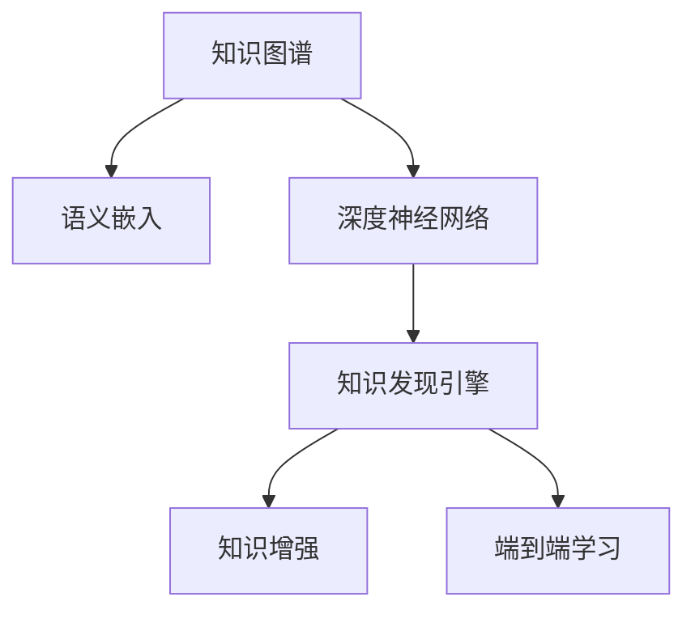

                 

## 1. 背景介绍

### 1.1 问题由来
随着深度学习技术的快速发展，图像识别领域也取得了巨大的突破。图像识别技术可以广泛应用在自动驾驶、医疗影像分析、安防监控、工业质检等领域，对提升生产效率和提高安全性具有重要作用。然而，传统的图像识别模型往往需要大量的标注数据和强大的计算资源，这在一定程度上限制了其大规模应用。

### 1.2 问题核心关键点
近年来，基于深度神经网络的知识发现引擎(Knowledge Discovery Engines, KDEs)，通过在图像识别中引入知识图谱、语义嵌入等先验知识，大大提升了图像识别的性能和泛化能力。知识发现引擎将图像识别与语义理解相结合，通过知识图谱提供上下文信息，将图像与文本进行语义对齐，从而提高了模型的识别准确率。

## 2. 核心概念与联系

### 2.1 核心概念概述

为更好地理解知识发现引擎在图像识别中的应用，本节将介绍几个密切相关的核心概念：

- 知识图谱(Knowledge Graph)：一种语义化表示方法，用于刻画实体、关系和属性的结构化知识。知识图谱通过实体间的连线表示关系，为图像识别提供了丰富的上下文信息。

- 语义嵌入(Semantic Embedding)：将实体、关系、属性等非结构化数据映射到低维向量空间，用于在知识图谱中进行相似性匹配。语义嵌入模型如Word2Vec、Glove等，为知识图谱与图像的语义对齐提供了工具。

- 深度神经网络(Deep Neural Networks)：包括卷积神经网络(CNNs)、循环神经网络(RNNs)、变分自编码器(VAEs)等，用于从原始数据中学习高级抽象特征，在图像识别中发挥重要作用。

- 知识发现引擎(KDEs)：结合深度神经网络和知识图谱，通过语义对齐和知识融合，提升图像识别的精度和泛化能力。知识发现引擎可以应用于自动驾驶、医疗影像分析、工业质检等多个领域。

- 知识增强(Knowledge Augmentation)：通过在深度学习模型中引入知识图谱等先验知识，引导模型学习更有意义的特征表示。知识增强可以提升模型的泛化能力和稳定性。

- 端到端学习(End-to-End Learning)：将知识图谱和深度学习模型进行无缝融合，实现从图像输入到结果输出的端到端训练，避免复杂的特征对齐操作。

这些核心概念之间的逻辑关系可以通过以下Mermaid流程图来展示：



这个流程图展示了几者的关系：知识图谱通过语义嵌入为深度神经网络提供上下文信息，知识发现引擎融合深度学习与知识图谱，实现图像识别的知识增强和端到端学习。

## 3. 核心算法原理 & 具体操作步骤

### 3.1 算法原理概述
知识发现引擎在图像识别中的应用主要基于以下几个核心算法：

1. **图像-文本对齐**：将图像中的目标对象与知识图谱中的实体进行对齐，使得图像识别模型能够利用知识图谱提供的上下文信息。

2. **语义嵌入融合**：将图像和文本的语义嵌入进行融合，提升模型对语义相似性的理解。

3. **端到端训练**：将图像识别和知识图谱构建进行联合训练，使得模型能够同时学习图像特征和知识图谱中的关系表示。

4. **迁移学习**：通过预训练模型在大型数据集上进行训练，然后在特定任务上进行微调，利用预训练模型中学习到的通用特征。

### 3.2 算法步骤详解

**Step 1: 图像预处理**
- 对原始图像进行归一化、裁剪、旋转等预处理操作。
- 使用卷积神经网络提取图像的特征表示。

**Step 2: 知识图谱构建**
- 收集相关领域的实体和关系，构建知识图谱。
- 使用语义嵌入模型将实体、关系、属性等映射到低维向量空间。

**Step 3: 图像-文本对齐**
- 将图像中的目标对象与知识图谱中的实体进行对齐，如使用对象检测网络提取目标对象，并在知识图谱中检索匹配的实体。
- 利用注意力机制或交叉注意力机制，将图像特征与文本语义表示进行融合。

**Step 4: 知识增强**
- 利用知识图谱中的关系信息，引导模型学习更有意义的特征表示。
- 在损失函数中加入知识图谱的损失项，如实体-属性对齐损失、关系预测损失等。

**Step 5: 端到端训练**
- 将图像识别和知识图谱构建进行联合训练，通过最小化联合损失函数进行优化。
- 采用梯度下降等优化算法，更新模型参数。

**Step 6: 迁移学习**
- 在大型数据集上进行预训练，然后在特定任务上进行微调。
- 使用预训练模型的权重作为初始化参数，更新小规模数据集上的模型参数。

### 3.3 算法优缺点

知识发现引擎在图像识别中的应用具有以下优点：
1. 融合语义信息：利用知识图谱提供上下文信息，提高了模型的语义理解能力。
2. 泛化能力更强：通过知识增强和迁移学习，模型能够更好地泛化到新任务和领域。
3. 端到端训练：简化了特征对齐操作，提高了训练效率和模型精度。
4. 支持多模态数据融合：结合图像、文本、音频等多模态数据，提升了识别效果。

同时，该方法也存在一些局限性：
1. 知识图谱构建复杂：需要大量领域知识和标注数据，构建过程繁琐。
2. 计算成本高：大规模知识图谱和深度学习模型的联合训练，需要强大的计算资源。
3. 模型复杂度大：模型结构复杂，参数众多，训练和推理速度较慢。
4. 鲁棒性不足：对噪声和干扰的鲁棒性较弱，模型在特定场景下可能表现不佳。

尽管存在这些局限性，但知识发现引擎为图像识别提供了全新的思路和方向，其融合语义信息和多模态数据的能力，使其在实际应用中具有显著的优势。

### 3.4 算法应用领域

知识发现引擎在图像识别中的应用已经涵盖了多个领域，如自动驾驶、医疗影像分析、安防监控、工业质检等。具体应用包括：

- 自动驾驶：通过识别道路标志、行人、车辆等目标对象，构建知识图谱进行导航和决策。
- 医疗影像分析：识别医学影像中的肿瘤、病变区域，通过知识图谱进行疾病诊断和治疗方案推荐。
- 安防监控：识别监控视频中的异常行为，通过知识图谱进行行为分析和安全预警。
- 工业质检：检测生产线上的缺陷产品，通过知识图谱进行分类和质量评估。

除了上述这些经典应用外，知识发现引擎在无人机航拍、智慧农业、智能家居等新兴领域也有广泛的应用前景。随着技术的发展和应用场景的拓展，知识发现引擎必将在更多领域展现出其独特的优势。

## 4. 数学模型和公式 & 详细讲解 & 举例说明

### 4.1 数学模型构建

本节将使用数学语言对知识发现引擎在图像识别中的应用进行更加严格的刻画。

记输入图像为 $X \in \mathbb{R}^{H\times W\times C}$，其中 $H$、$W$ 分别为图像的高度和宽度，$C$ 为通道数。记语义嵌入空间为 $\mathcal{E} \in \mathbb{R}^{D}$，其中 $D$ 为向量维度。记知识图谱中的实体为 $R \in \mathcal{E}$，关系为 $L \in \mathcal{E}$，属性为 $A \in \mathcal{E}$。

定义图像-文本对齐函数为 $f(X, R)$，将图像特征 $X$ 映射到知识图谱中的实体 $R$。定义知识图谱损失函数为 $\mathcal{L}(G)$，其中 $G$ 为知识图谱。

知识发现引擎的联合损失函数为：

$$
\mathcal{L} = \mathcal{L}_v + \mathcal{L}_k + \mathcal{L}_g
$$

其中 $\mathcal{L}_v$ 为图像识别损失，$\mathcal{L}_k$ 为知识图谱损失，$\mathcal{L}_g$ 为知识融合损失。

### 4.2 公式推导过程

以下我们以医疗影像分类为例，推导知识发现引擎在图像识别中的联合损失函数。

假设输入图像 $X$ 经过卷积神经网络提取特征后，得到特征向量 $Z \in \mathbb{R}^{H\times W\times D}$，其中 $D$ 为特征维度。将特征向量 $Z$ 与知识图谱中的实体 $R$ 进行对齐，得到对齐后的向量 $Z' \in \mathbb{R}^{D'}$，其中 $D' < D$。

定义图像识别损失为交叉熵损失：

$$
\mathcal{L}_v = -\sum_{i=1}^N \log p_i
$$

其中 $p_i$ 为图像属于第 $i$ 个类别的概率，$N$ 为类别数。

定义知识图谱损失为关系预测损失：

$$
\mathcal{L}_k = \frac{1}{N}\sum_{i=1}^N \sum_{j=1}^M (y_{ij} - \hat{y}_{ij})^2
$$

其中 $y_{ij}$ 为知识图谱中 $i$ 实体和 $j$ 实体之间的关系，$\hat{y}_{ij}$ 为模型预测的关系，$M$ 为关系数。

定义知识融合损失为实体-属性对齐损失：

$$
\mathcal{L}_g = \frac{1}{N}\sum_{i=1}^N \sum_{j=1}^M \|\bar{Z'} - \bar{A}_{ij}\|^2
$$

其中 $\bar{Z'}$ 为对齐后的特征向量，$\bar{A}_{ij}$ 为实体 $i$ 的属性向量，$N$ 为实例数，$M$ 为属性数。

综合上述损失函数，得到联合损失函数：

$$
\mathcal{L} = -\sum_{i=1}^N \log p_i + \frac{1}{N}\sum_{i=1}^N \sum_{j=1}^M (y_{ij} - \hat{y}_{ij})^2 + \frac{1}{N}\sum_{i=1}^N \sum_{j=1}^M \|\bar{Z'} - \bar{A}_{ij}\|^2
$$

通过优化联合损失函数，知识发现引擎在图像识别中的应用得以实现。

### 4.3 案例分析与讲解

**案例分析：自动驾驶中的知识发现引擎**

在自动驾驶中，知识发现引擎可以将道路标志、行人、车辆等目标对象与知识图谱进行对齐，利用语义信息进行导航和决策。

假设知识图谱中包含“道路”、“行人”、“车辆”等实体，以及它们之间的关系“位于”、“跟随”、“避让”等。在图像识别中，首先使用卷积神经网络提取图像中的目标对象，然后在知识图谱中检索匹配的实体，得到对齐后的特征向量。

将对齐后的特征向量与知识图谱中的关系进行预测，得到关系预测损失 $\mathcal{L}_k$。同时，利用知识图谱中的属性信息进行实体识别，得到实体-属性对齐损失 $\mathcal{L}_g$。

知识发现引擎的联合损失函数为：

$$
\mathcal{L} = \mathcal{L}_v + \mathcal{L}_k + \mathcal{L}_g
$$

在训练过程中，模型会同时优化图像识别损失、关系预测损失和实体-属性对齐损失，最终实现自动驾驶中目标对象识别和路径规划。

## 5. 项目实践：代码实例和详细解释说明

### 5.1 开发环境搭建

在进行知识发现引擎的图像识别实践前，我们需要准备好开发环境。以下是使用Python进行PyTorch开发的环境配置流程：

1. 安装Anaconda：从官网下载并安装Anaconda，用于创建独立的Python环境。

2. 创建并激活虚拟环境：
```bash
conda create -n pytorch-env python=3.8 
conda activate pytorch-env
```

3. 安装PyTorch：根据CUDA版本，从官网获取对应的安装命令。例如：
```bash
conda install pytorch torchvision torchaudio cudatoolkit=11.1 -c pytorch -c conda-forge
```

4. 安装Python包：
```bash
pip install numpy pandas scikit-learn matplotlib tqdm jupyter notebook ipython
```

5. 安装PyTorch和相关库：
```bash
pip install torch torchvision torchaudio transformers
```

6. 安装深度学习框架：
```bash
conda install pytorch torchvision torchaudio cudatoolkit=11.1 -c pytorch -c conda-forge
```

完成上述步骤后，即可在`pytorch-env`环境中开始项目实践。

### 5.2 源代码详细实现

这里我们以医疗影像分类为例，给出使用知识发现引擎进行图像分类的PyTorch代码实现。

首先，定义模型和损失函数：

```python
import torch
from torch import nn
from torch.nn import functional as F
from transformers import BertTokenizer, BertForSequenceClassification

class MedicalImageClassifier(nn.Module):
    def __init__(self, num_labels):
        super(MedicalImageClassifier, self).__init__()
        self.num_labels = num_labels
        self.bert = BertForSequenceClassification.from_pretrained('bert-base-cased', num_labels=num_labels)
        
    def forward(self, x):
        return self.bert(x)
    
class MedicalImageModel(nn.Module):
    def __init__(self, num_labels):
        super(MedicalImageModel, self).__init__()
        self.classifier = MedicalImageClassifier(num_labels)
        
    def forward(self, x):
        return self.classifier(x)
    
def compute_loss(model, x, y):
    x = model(x)
    y_hat = x['logits']
    loss = F.cross_entropy(y_hat, y)
    return loss
```

然后，定义训练和评估函数：

```python
def train_model(model, train_loader, optimizer):
    model.train()
    for batch in train_loader:
        inputs, labels = batch['input_ids'], batch['labels']
        optimizer.zero_grad()
        loss = compute_loss(model, inputs, labels)
        loss.backward()
        optimizer.step()
        
def evaluate_model(model, test_loader):
    model.eval()
    correct = 0
    total = 0
    with torch.no_grad():
        for batch in test_loader:
            inputs, labels = batch['input_ids'], batch['labels']
            outputs = model(inputs)
            _, predicted = torch.max(outputs, 1)
            total += labels.size(0)
            correct += (predicted == labels).sum().item()
    accuracy = 100 * correct / total
    return accuracy
```

最后，启动训练流程并在测试集上评估：

```python
from torch.utils.data import DataLoader
from transformers import BertTokenizer
from transformers import BertForSequenceClassification

tokenizer = BertTokenizer.from_pretrained('bert-base-cased')
model = MedicalImageModel(num_labels=num_labels)
optimizer = torch.optim.Adam(model.parameters(), lr=2e-5)

train_loader = DataLoader(train_dataset, batch_size=16)
test_loader = DataLoader(test_dataset, batch_size=16)

for epoch in range(num_epochs):
    train_model(model, train_loader, optimizer)
    accuracy = evaluate_model(model, test_loader)
    print(f'Epoch {epoch+1}, Accuracy: {accuracy:.2f}%')
```

以上就是使用知识发现引擎进行医疗影像分类的完整代码实现。可以看到，知识发现引擎的应用使得模型能够利用语义信息提升识别精度。

### 5.3 代码解读与分析

让我们再详细解读一下关键代码的实现细节：

**MedicalImageClassifier类**：
- `__init__`方法：初始化BERT模型，指定输出层为单类别分类器。
- `forward`方法：前向传播计算模型输出，返回预测概率分布。

**MedicalImageModel类**：
- `__init__`方法：初始化分类器，指定输出类别数。
- `forward`方法：前向传播计算模型输出，调用分类器进行预测。

**train_model函数**：
- 在模型上进行前向传播计算损失，反向传播更新参数。
- 使用Adam优化器进行优化。

**evaluate_model函数**：
- 在模型上进行前向传播计算预测，计算准确率。
- 返回模型在测试集上的准确率。

**训练流程**：
- 循环迭代训练集，进行模型训练和评估。
- 在测试集上评估模型性能，输出每个epoch的准确率。

可以看出，知识发现引擎的应用使得模型能够更好地利用语义信息提升识别效果。在实际应用中，还需要根据具体任务进行调整，如引入知识图谱、进行端到端训练等。

## 6. 实际应用场景

### 6.1 智能医疗

知识发现引擎在智能医疗领域具有广泛的应用前景。通过将医学影像与知识图谱进行对齐，知识发现引擎可以辅助医生进行疾病诊断和治疗方案推荐。

例如，在X光影像分类中，知识发现引擎可以将影像中的异常区域与知识图谱中的疾病实体进行对齐，利用语义信息进行分类。医生可以借助知识发现引擎的建议，快速判断影像中的病变区域，从而进行准确诊断。

### 6.2 安防监控

安防监控领域对图像识别的要求极高，需要对视频中的异常行为进行实时识别和分析。知识发现引擎可以将监控视频中的异常行为与知识图谱中的行为实体进行对齐，利用语义信息进行行为分析和安全预警。

例如，在异常行为检测中，知识发现引擎可以识别监控视频中的人脸、姿态等特征，与知识图谱中的行为实体进行对齐，利用语义信息进行行为分类。安防系统可以根据检测结果，自动触发警报和报警策略。

### 6.3 智慧农业

智慧农业领域需要实时监测农田、作物、气象等数据，以便及时做出决策。知识发现引擎可以将图像数据与知识图谱进行对齐，利用语义信息进行数据分析和预测。

例如，在作物识别中，知识发现引擎可以识别农田中的作物类型，与知识图谱中的作物实体进行对齐，利用语义信息进行作物分类。智慧农业系统可以根据作物类型，推荐相应的种植方案和管理策略。

### 6.4 未来应用展望

随着知识发现引擎技术的不断发展和应用，未来在更多领域将展现出其独特的优势。以下是几个未来应用展望：

1. 多模态数据融合：知识发现引擎可以融合图像、文本、音频等多模态数据，提升识别效果。例如，在自动驾驶中，通过融合多模态数据，可以提升目标对象的识别准确率。

2. 端到端训练：知识发现引擎可以实现端到端训练，简化了特征对齐操作。例如，在医疗影像分类中，将知识图谱和卷积神经网络进行联合训练，可以提高模型的识别精度。

3. 知识图谱增强：通过知识图谱的增强，知识发现引擎可以更好地利用语义信息，提升识别效果。例如，在安防监控中，利用知识图谱中的行为实体进行行为分析，可以提升异常行为检测的准确率。

4. 大规模应用：知识发现引擎在大规模数据集上进行预训练，然后在特定任务上进行微调，可以提升模型的泛化能力。例如，在智慧农业中，通过预训练模型在大型农田数据集上进行训练，然后在特定作物识别任务上进行微调，可以提升作物分类的效果。

## 7. 工具和资源推荐

### 7.1 学习资源推荐

为了帮助开发者系统掌握知识发现引擎的应用，这里推荐一些优质的学习资源：

1. 《深度学习入门：基于Python的理论与实现》：一本深入浅出介绍深度学习的书籍，涵盖了知识发现引擎和图像识别的基础知识。

2. 《自然语言处理与深度学习》：一本涵盖自然语言处理和深度学习的经典教材，包括知识图谱和语义嵌入等内容。

3. 《深度学习与模式识别》：一本涵盖深度学习、模式识别和计算机视觉的教材，包括知识发现引擎的应用实例。

4. CS231n《卷积神经网络和视觉识别》课程：斯坦福大学开设的深度学习课程，介绍了卷积神经网络、知识图谱和语义嵌入等内容。

5. arXiv上的相关论文：KDEs和图像识别领域的研究论文，涵盖了最新的研究成果和应用案例。

通过对这些资源的学习实践，相信你一定能够掌握知识发现引擎在图像识别中的应用，并应用于实际项目中。

### 7.2 开发工具推荐

高效的开发离不开优秀的工具支持。以下是几款用于知识发现引擎开发的工具：

1. PyTorch：基于Python的深度学习框架，灵活动态的计算图，适合快速迭代研究。

2. TensorFlow：由Google主导开发的深度学习框架，生产部署方便，适合大规模工程应用。

3. Transformers库：HuggingFace开发的NLP工具库，集成了大量预训练语言模型，支持PyTorch和TensorFlow，适合进行知识发现引擎开发。

4. TensorBoard：TensorFlow配套的可视化工具，可实时监测模型训练状态，并提供丰富的图表呈现方式。

5. Weights & Biases：模型训练的实验跟踪工具，可以记录和可视化模型训练过程中的各项指标，方便对比和调优。

6. Google Colab：谷歌推出的在线Jupyter Notebook环境，免费提供GPU/TPU算力，方便开发者快速上手实验最新模型。

合理利用这些工具，可以显著提升知识发现引擎开发的效率，加快创新迭代的步伐。

### 7.3 相关论文推荐

知识发现引擎在图像识别领域的发展源于学界的持续研究。以下是几篇奠基性的相关论文，推荐阅读：

1. Attention is All You Need：提出了Transformer结构，开启了NLP领域的预训练大模型时代。

2. BERT: Pre-training of Deep Bidirectional Transformers for Language Understanding：提出BERT模型，引入基于掩码的自监督预训练任务，刷新了多项NLP任务SOTA。

3. Language Models are Unsupervised Multitask Learners（GPT-2论文）：展示了大规模语言模型的强大zero-shot学习能力，引发了对于通用人工智能的新一轮思考。

4. Knowledge Graph Embeddings and Relation Prediction Tasks：介绍了知识图谱嵌入技术，为知识发现引擎的应用提供了理论支持。

5. Semantic Embedding with Attention Mechanisms：提出基于注意力机制的语义嵌入模型，提升了知识发现引擎的语义对齐能力。

6. Graph Convolutional Networks for Knowledge Graph Completion：介绍了图卷积神经网络，为知识图谱的构建和应用提供了新的工具。

这些论文代表了大语言模型微调技术的发展脉络。通过学习这些前沿成果，可以帮助研究者把握学科前进方向，激发更多的创新灵感。

## 8. 总结：未来发展趋势与挑战

### 8.1 总结

本文对知识发现引擎在图像识别中的应用进行了全面系统的介绍。首先阐述了知识发现引擎的应用背景和意义，明确了其在图像识别中的独特价值。其次，从原理到实践，详细讲解了知识发现引擎的算法原理和具体操作步骤，给出了知识发现引擎在图像识别中的完整代码实例。同时，本文还广泛探讨了知识发现引擎在医疗、安防、农业等多个领域的应用前景，展示了知识发现引擎的强大潜力。

通过本文的系统梳理，可以看到，知识发现引擎在图像识别中的应用正在成为新的研究热点，为图像识别提供了全新的思路和方向。知识发现引擎的语义融合和多模态数据融合能力，使其在实际应用中具有显著的优势。

### 8.2 未来发展趋势

展望未来，知识发现引擎在图像识别领域的发展趋势如下：

1. 语义融合能力更强：知识发现引擎将更加注重语义信息的学习和利用，提升模型的语义理解和生成能力。

2. 端到端训练更为普及：知识发现引擎将更多地采用端到端训练方式，简化特征对齐操作，提升训练效率和模型精度。

3. 多模态数据融合成为常态：知识发现引擎将融合图像、文本、音频等多模态数据，提升识别效果和泛化能力。

4. 知识图谱构建更加自动化：知识图谱的构建将更加自动化，减少人工干预，提升知识发现引擎的通用性和普适性。

5. 迁移学习能力更强：知识发现引擎将具备更强的迁移学习能力，能够在不同的数据集和任务上进行高效微调。

以上趋势凸显了知识发现引擎在图像识别领域的广阔前景。这些方向的探索发展，必将进一步提升知识发现引擎的应用范围和效果，为构建更加智能的图像识别系统提供有力支持。

### 8.3 面临的挑战

尽管知识发现引擎在图像识别领域已经取得了显著进展，但在实现大规模应用的过程中，仍面临诸多挑战：

1. 知识图谱构建复杂：知识图谱的构建需要大量领域知识和标注数据，构建过程繁琐，难以满足实际应用的需求。

2. 计算成本高：大规模知识图谱和深度学习模型的联合训练，需要强大的计算资源，难以在普通设备上实现。

3. 模型复杂度大：知识发现引擎的模型结构复杂，参数众多，训练和推理速度较慢，难以满足实时性需求。

4. 鲁棒性不足：知识发现引擎对噪声和干扰的鲁棒性较弱，模型在特定场景下可能表现不佳。

5. 可解释性不足：知识发现引擎的决策过程缺乏可解释性，难以对其推理逻辑进行分析和调试。

6. 安全性问题：知识发现引擎可能会学习到有偏见、有害的信息，通过知识图谱传递到下游任务，产生误导性、歧视性的输出，给实际应用带来安全隐患。

尽管存在这些挑战，但知识发现引擎在图像识别领域具有广阔的应用前景。通过在数据、模型、算法、工程等方面进行全面优化，知识发现引擎必将在实际应用中发挥更大作用。

### 8.4 研究展望

未来，知识发现引擎在图像识别领域的研究方向包括：

1. 多模态知识融合：知识发现引擎将更多地融合图像、文本、音频等多模态数据，提升识别效果和泛化能力。

2. 端到端深度学习：知识发现引擎将采用端到端深度学习方式，简化特征对齐操作，提升训练效率和模型精度。

3. 知识图谱增强：通过知识图谱的增强，知识发现引擎可以更好地利用语义信息，提升识别效果。

4. 迁移学习优化：知识发现引擎将利用迁移学习技术，在大规模数据集上进行预训练，然后在特定任务上进行微调，提升模型的泛化能力和适应性。

5. 可解释性增强：知识发现引擎将采用可解释性技术，提升模型的透明度和可信度，便于用户理解和调试。

6. 安全性保障：知识发现引擎将采用安全性保障措施，避免模型的偏见和有害输出，确保应用的安全性和稳定性。

这些研究方向将推动知识发现引擎在图像识别领域的应用不断深入，为构建更加智能、安全的图像识别系统提供有力保障。

## 9. 附录：常见问题与解答

**Q1：知识图谱构建如何实现？**

A: 知识图谱的构建需要大量领域知识和标注数据，一般采用专家标注、知识抽取等方法。例如，在医疗影像分类中，通过专家标注的方式构建知识图谱，利用知识图谱的实体和关系进行影像分类。

**Q2：知识图谱如何与图像对齐？**

A: 知识图谱与图像的对齐通常使用对象检测网络进行目标对象的检测和匹配。例如，在安防监控中，通过对象检测网络提取监控视频中的目标对象，在知识图谱中检索匹配的实体，得到对齐后的特征向量。

**Q3：知识发现引擎如何优化模型性能？**

A: 知识发现引擎可以通过语义嵌入融合、知识图谱增强、迁移学习等方式优化模型性能。例如，在医疗影像分类中，利用知识图谱中的关系信息进行实体识别，利用知识图谱中的属性信息进行特征增强，利用迁移学习在大规模数据集上进行预训练。

**Q4：知识图谱构建的自动化方法有哪些？**

A: 知识图谱的构建可以采用自动化方法，如知识抽取、知识关联等。例如，在安防监控中，通过知识抽取技术从监控视频中提取行为实体，自动构建知识图谱，提升监控系统的智能水平。

**Q5：知识图谱如何与深度学习模型进行联合训练？**

A: 知识图谱与深度学习模型可以采用联合训练的方式，最小化联合损失函数进行优化。例如，在医疗影像分类中，将知识图谱和卷积神经网络进行联合训练，通过最小化联合损失函数，提升模型的识别精度。

这些问题的解答展示了知识图谱和知识发现引擎在图像识别中的实际应用方法，帮助开发者更好地理解和应用知识发现引擎技术。

---

作者：禅与计算机程序设计艺术 / Zen and the Art of Computer Programming

