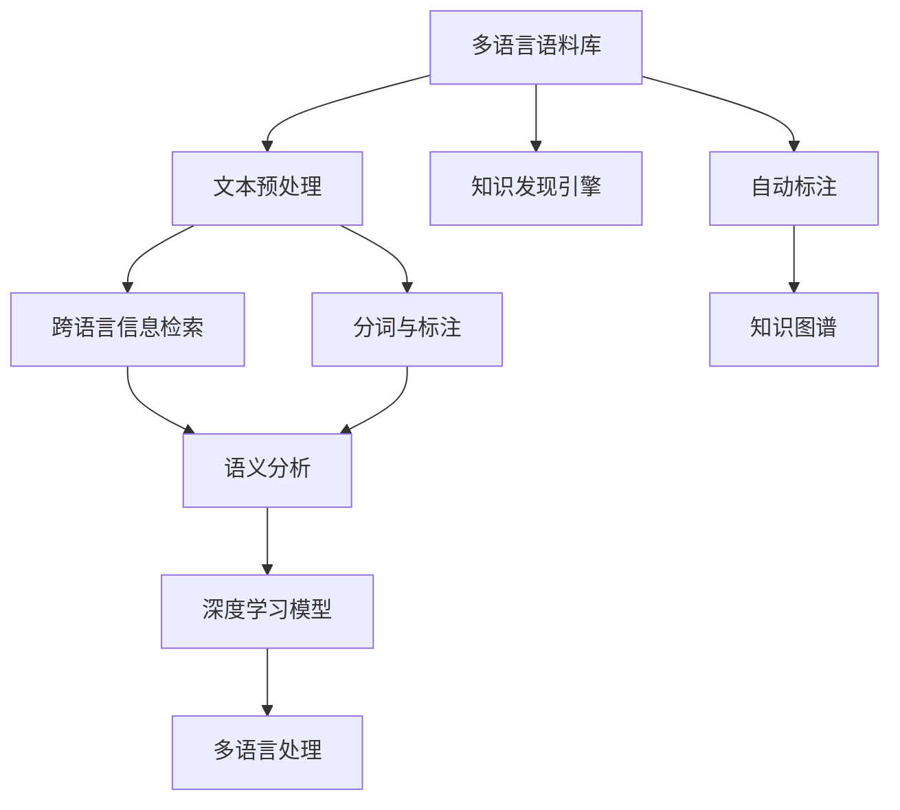

                 

# 知识发现引擎的多语言支持实现

> 关键词：知识发现引擎, 多语言处理, 多语言信息检索, 自然语言处理(NLP), 深度学习, 机器学习, 语料库, 语义分析

## 1. 背景介绍

### 1.1 问题由来

在当今全球化背景下，多语言处理成为了信息检索、知识发现、内容推荐等领域的一项重要需求。传统的知识发现引擎往往局限于单语言，难以高效处理多语言信息。随着全球互联互通的不断加深，跨语言的多语言信息需求日益增多。以中文为例，全球华人社区日益壮大，中文语料库庞大且复杂，而如何将海量中文文本数据转化为有价值的知识，并应用到实际生产服务中，成为亟待解决的问题。

### 1.2 问题核心关键点

多语言知识发现引擎的实现需要解决以下关键问题：

- 如何高效处理多语言文本，同时保留语言的丰富语义信息？
- 如何实现高效的跨语言信息检索，提升检索准确率和召回率？
- 如何自动构建和更新多语言语料库，保障知识发现引擎的知识的时效性和全面性？
- 如何利用深度学习等先进技术，提升多语言处理的质量和效率？
- 如何在多语言环境下，实现知识发现引擎的高可靠性和易用性？

### 1.3 问题研究意义

实现高效、可靠、易用的多语言知识发现引擎，对全球化社会的经济、文化、科技等领域具有重要意义：

1. 促进全球知识共享。多语言知识发现引擎能够处理多种语言信息，促进全球范围内的知识共享和交流。
2. 提高信息检索效率。多语言处理能力能显著提升信息检索的准确性和效率，助力各行各业的数字化转型。
3. 推动文化多元性发展。通过多语言处理技术，能够更好地理解和传播多元文化，促进文化交流和融合。
4. 提升企业竞争力。在跨境电商、国际合作、全球市场等领域，多语言处理能力是企业核心竞争力的重要组成部分。
5. 推动科研创新。多语言信息检索和语义分析技术，能够支持学术研究和科学探索，加速科研成果的转化。

## 2. 核心概念与联系

### 2.1 核心概念概述

为更好地理解多语言知识发现引擎的实现，本节将介绍几个关键概念：

- 知识发现引擎(Knowledge Discovery Engine, KDE)：一种自动提取数据中隐含知识的信息检索系统，广泛应用于数据挖掘、信息检索、内容推荐等领域。
- 多语言处理(Multilingual Processing)：指能够处理多种语言文本的技术，包括文本预处理、分词、标注、翻译、语义分析等。
- 跨语言信息检索(Cross-Language Information Retrieval, CLIR)：指在多语言环境中，对不同语言文档进行信息检索和匹配的技术。
- 语料库(Corpus)：大规模的、标准化的文本数据集合，是构建知识发现引擎的基础。
- 自然语言处理(Natural Language Processing, NLP)：使用计算机技术处理和分析自然语言，涉及文本分析、语义分析、语音识别等多个领域。
- 深度学习(Deep Learning)：通过多层神经网络模型进行数据建模和特征提取，适用于处理复杂的多语言文本数据。
- 机器学习(Machine Learning)：通过算法和模型从数据中自动学习规律，广泛应用于知识发现、信息检索、自然语言处理等领域。

这些概念之间存在密切联系，共同构成了多语言知识发现引擎的实现基础。

### 2.2 核心概念原理和架构的 Mermaid 流程图



这个流程图展示了多语言知识发现引擎的实现流程：

1. 多语言语料库：构建多语言文本数据集合，为知识发现引擎提供基础数据。
2. 文本预处理：清洗、分词、标注等步骤，为后续处理做准备。
3. 分词与标注：将文本转化为词元序列，同时进行实体识别、词性标注等。
4. 语义分析：提取文本中的语义信息，如句子结构和语义关系等。
5. 深度学习模型：使用多层神经网络模型，自动学习文本特征，提升处理质量。
6. 多语言处理：通过跨语言信息检索和翻译等技术，处理多语言文本。
7. 自动标注：通过半监督学习等技术，自动标注新文本数据。
8. 知识图谱：构建知识图谱，存储和推理知识，辅助知识发现。

这些步骤共同构建了多语言知识发现引擎的核心流程，提升了其在多语言环境下的能力。

## 3. 核心算法原理 & 具体操作步骤
### 3.1 算法原理概述

多语言知识发现引擎的实现，本质上是基于多语言处理和深度学习技术，对海量多语言文本数据进行建模、检索、分析和应用的过程。核心算法原理包括：

1. 文本预处理：清洗、分词、标注等步骤，为后续处理做准备。
2. 跨语言信息检索：在多语言环境中，对不同语言文档进行信息检索和匹配。
3. 语义分析：提取文本中的语义信息，如句子结构和语义关系等。
4. 深度学习模型：使用多层神经网络模型，自动学习文本特征，提升处理质量。
5. 多语言处理：通过跨语言信息检索和翻译等技术，处理多语言文本。
6. 自动标注：通过半监督学习等技术，自动标注新文本数据。
7. 知识图谱：构建知识图谱，存储和推理知识，辅助知识发现。

### 3.2 算法步骤详解

多语言知识发现引擎的实现一般包括以下几个关键步骤：

**Step 1: 多语言语料库构建**
- 收集多语言文本数据，构建语料库。
- 进行文本清洗，去除噪音和冗余信息。
- 进行文本预处理，包括分词、标注等步骤。

**Step 2: 文本表示与特征提取**
- 对预处理后的文本进行向量化表示，转化为模型可以处理的格式。
- 使用TF-IDF、词嵌入等技术，提取文本的特征表示。
- 使用深度学习模型，如BERT、GPT等，自动学习文本特征。

**Step 3: 跨语言信息检索**
- 设计跨语言信息检索模型，如向量空间模型、匹配模型等。
- 对不同语言文档进行相似性计算，找到匹配的文本。
- 对检索结果进行排序和筛选，提高检索准确率和召回率。

**Step 4: 语义分析与知识图谱构建**
- 使用NLP技术，提取文本中的语义信息，如命名实体识别、关系抽取等。
- 将提取的语义信息存储到知识图谱中，构建多语言知识图谱。
- 使用知识图谱进行推理和知识发现，生成有用的知识信息。

**Step 5: 系统集成与部署**
- 将上述模块集成到知识发现引擎中，实现高效的多语言信息检索和知识发现。
- 部署到服务器或云平台，提供线上服务。
- 提供用户友好的API接口，方便系统集成和调用。

### 3.3 算法优缺点

多语言知识发现引擎的实现具有以下优点：

1. 高效处理多语言文本。能够处理多种语言文本，并保留语言的丰富语义信息。
2. 实现高效的跨语言信息检索。通过多语言处理技术，提升信息检索的准确率和召回率。
3. 自动构建和更新多语言语料库。通过半监督学习等技术，自动标注新文本数据，更新语料库。
4. 利用深度学习等先进技术，提升多语言处理的质量和效率。
5. 实现知识发现引擎的高可靠性和易用性。通过知识图谱等技术，提升知识发现引擎的可靠性和易用性。

同时，该方法也存在一定的局限性：

1. 依赖高质量语料库。多语言处理和语义分析依赖于高质量的语料库，获取高质量语料库的成本较高。
2. 对语言复杂度敏感。对于语言复杂度较高的语言，处理难度较大，效果可能不如预期的理想。
3. 需要较高的计算资源。深度学习模型和语义分析等步骤，需要较高的计算资源，对算力要求较高。
4. 处理结果依赖语料库质量。语料库的质量直接影响处理结果的准确性和全面性，需定期维护和更新。
5. 维护成本较高。多语言处理和知识图谱构建等步骤，需要定期维护和更新，维护成本较高。

尽管存在这些局限性，但就目前而言，多语言知识发现引擎的实现仍是大语言处理领域的重要范式。未来相关研究的重点在于如何进一步降低对语料库的依赖，提高处理效率，同时兼顾可解释性和伦理安全性等因素。

### 3.4 算法应用领域

多语言知识发现引擎已在诸多领域得到应用，例如：

- 搜索引擎：支持多语言搜索，提升搜索结果的相关性和准确性。
- 跨语言问答系统：解答跨语言用户的问题，提升用户满意度。
- 跨语言信息推荐：基于多语言语料库，推荐跨语言内容，提升用户体验。
- 跨语言情感分析：分析跨语言用户评论，提取情感信息，辅助企业决策。
- 跨语言社交网络：支持多语言社交媒体数据的处理，增强社交网络功能。
- 跨语言文档管理：对多语言文档进行分类、检索和管理，提升文档管理的效率。

除了上述这些经典应用外，多语言知识发现引擎还被创新性地应用到更多场景中，如多语言聊天机器人、多语言自动翻译、多语言数据挖掘等，为多语言处理技术带来了新的突破。

## 4. 数学模型和公式 & 详细讲解
### 4.1 数学模型构建

本节将使用数学语言对多语言知识发现引擎的核心算法进行更加严格的刻画。

假设多语言知识发现引擎处理N个多语言文档$d_1, d_2, \ldots, d_N$，每个文档包含$m$个词元。设$x_{ij}$为第$i$个文档第$j$个词元的特征向量，$\theta$为深度学习模型参数。

定义多语言知识发现引擎的损失函数为：

$$
\mathcal{L}(\theta) = \sum_{i=1}^N \sum_{j=1}^m l(x_{ij}, y_{ij})
$$

其中$l$为损失函数，$y_{ij}$为文档$d_i$中第$j$个词元的标签，可以是实体、关系、情感等。

多语言知识发现引擎的优化目标是最小化损失函数$\mathcal{L}(\theta)$，即：

$$
\theta^* = \mathop{\arg\min}_{\theta} \mathcal{L}(\theta)
$$

在实践中，我们通常使用基于梯度的优化算法（如Adam、SGD等）来近似求解上述最优化问题。设$\eta$为学习率，则参数的更新公式为：

$$
\theta \leftarrow \theta - \eta \nabla_{\theta}\mathcal{L}(\theta)
$$

其中$\nabla_{\theta}\mathcal{L}(\theta)$为损失函数对参数$\theta$的梯度，可通过反向传播算法高效计算。

### 4.2 公式推导过程

以下我们以跨语言信息检索任务为例，推导向量空间模型(Vector Space Model, VSM)的公式及其梯度的计算。

假设模型在输入向量$v$上的输出为$s=v\theta$，表示文档与查询向量之间的相似度。给定查询$q$，其向量表示为$q_s = q \theta$。则VSM的损失函数定义为：

$$
\ell(s, q_s) = -\log s + (1-s) \log (1-q_s)
$$

将其代入损失函数公式，得：

$$
\mathcal{L}(\theta) = -\sum_{i=1}^N \sum_{j=1}^m \log s_{ij} + (1-s_{ij}) \log (1-q_{ij})
$$

根据链式法则，损失函数对参数$\theta_k$的梯度为：

$$
\frac{\partial \mathcal{L}(\theta)}{\partial \theta_k} = \sum_{i=1}^N \sum_{j=1}^m (\frac{q_{ij}}{s_{ij}} - \frac{1-q_{ij}}{1-s_{ij}}) \frac{\partial s_{ij}}{\partial \theta_k}
$$

其中$\frac{\partial s_{ij}}{\partial \theta_k}$可进一步递归展开，利用自动微分技术完成计算。

在得到损失函数的梯度后，即可带入参数更新公式，完成模型的迭代优化。重复上述过程直至收敛，最终得到适应跨语言信息检索任务的最优模型参数$\theta^*$。

## 5. 项目实践：代码实例和详细解释说明
### 5.1 开发环境搭建

在进行多语言知识发现引擎的实践前，我们需要准备好开发环境。以下是使用Python进行PyTorch开发的环境配置流程：

1. 安装Anaconda：从官网下载并安装Anaconda，用于创建独立的Python环境。

2. 创建并激活虚拟环境：
```bash
conda create -n pytorch-env python=3.8 
conda activate pytorch-env
```

3. 安装PyTorch：根据CUDA版本，从官网获取对应的安装命令。例如：
```bash
conda install pytorch torchvision torchaudio cudatoolkit=11.1 -c pytorch -c conda-forge
```

4. 安装Transformers库：
```bash
pip install transformers
```

5. 安装各类工具包：
```bash
pip install numpy pandas scikit-learn matplotlib tqdm jupyter notebook ipython
```

完成上述步骤后，即可在`pytorch-env`环境中开始多语言知识发现引擎的实践。

### 5.2 源代码详细实现

下面以跨语言信息检索任务为例，给出使用Transformers库进行多语言知识发现引擎的PyTorch代码实现。

首先，定义多语言文本预处理函数：

```python
from transformers import BertTokenizer
from torch.utils.data import Dataset
import torch

class MultilingualDataset(Dataset):
    def __init__(self, texts, labels, tokenizer, max_len=128):
        self.texts = texts
        self.labels = labels
        self.tokenizer = tokenizer
        self.max_len = max_len
        
    def __len__(self):
        return len(self.texts)
    
    def __getitem__(self, item):
        text = self.texts[item]
        label = self.labels[item]
        
        encoding = self.tokenizer(text, return_tensors='pt', max_length=self.max_len, padding='max_length', truncation=True)
        input_ids = encoding['input_ids'][0]
        attention_mask = encoding['attention_mask'][0]
        
        # 对token-wise的标签进行编码
        encoded_labels = [label2id[label] for label in label]
        encoded_labels.extend([label2id['O']] * (self.max_len - len(encoded_labels)))
        labels = torch.tensor(encoded_labels, dtype=torch.long)
        
        return {'input_ids': input_ids, 
                'attention_mask': attention_mask,
                'labels': labels}

# 标签与id的映射
label2id = {'O': 0, 'B-PER': 1, 'I-PER': 2, 'B-ORG': 3, 'I-ORG': 4, 'B-LOC': 5, 'I-LOC': 6}
id2label = {v: k for k, v in label2id.items()}

# 创建dataset
tokenizer = BertTokenizer.from_pretrained('bert-base-cased')
train_dataset = MultilingualDataset(train_texts, train_labels, tokenizer)
dev_dataset = MultilingualDataset(dev_texts, dev_labels, tokenizer)
test_dataset = MultilingualDataset(test_texts, test_labels, tokenizer)
```

然后，定义模型和优化器：

```python
from transformers import BertForTokenClassification, AdamW

model = BertForTokenClassification.from_pretrained('bert-base-cased', num_labels=len(label2id))

optimizer = AdamW(model.parameters(), lr=2e-5)
```

接着，定义训练和评估函数：

```python
from torch.utils.data import DataLoader
from tqdm import tqdm
from sklearn.metrics import classification_report

device = torch.device('cuda') if torch.cuda.is_available() else torch.device('cpu')
model.to(device)

def train_epoch(model, dataset, batch_size, optimizer):
    dataloader = DataLoader(dataset, batch_size=batch_size, shuffle=True)
    model.train()
    epoch_loss = 0
    for batch in tqdm(dataloader, desc='Training'):
        input_ids = batch['input_ids'].to(device)
        attention_mask = batch['attention_mask'].to(device)
        labels = batch['labels'].to(device)
        model.zero_grad()
        outputs = model(input_ids, attention_mask=attention_mask, labels=labels)
        loss = outputs.loss
        epoch_loss += loss.item()
        loss.backward()
        optimizer.step()
    return epoch_loss / len(dataloader)

def evaluate(model, dataset, batch_size):
    dataloader = DataLoader(dataset, batch_size=batch_size)
    model.eval()
    preds, labels = [], []
    with torch.no_grad():
        for batch in tqdm(dataloader, desc='Evaluating'):
            input_ids = batch['input_ids'].to(device)
            attention_mask = batch['attention_mask'].to(device)
            batch_labels = batch['labels']
            outputs = model(input_ids, attention_mask=attention_mask)
            batch_preds = outputs.logits.argmax(dim=2).to('cpu').tolist()
            batch_labels = batch_labels.to('cpu').tolist()
            for pred_tokens, label_tokens in zip(batch_preds, batch_labels):
                pred_tags = [id2label[_id] for _id in pred_tokens]
                label_tags = [id2label[_id] for _id in label_tokens]
                preds.append(pred_tags[:len(label_tags)])
                labels.append(label_tags)
                
    print(classification_report(labels, preds))
```

最后，启动训练流程并在测试集上评估：

```python
epochs = 5
batch_size = 16

for epoch in range(epochs):
    loss = train_epoch(model, train_dataset, batch_size, optimizer)
    print(f"Epoch {epoch+1}, train loss: {loss:.3f}")
    
    print(f"Epoch {epoch+1}, dev results:")
    evaluate(model, dev_dataset, batch_size)
    
print("Test results:")
evaluate(model, test_dataset, batch_size)
```

以上就是使用PyTorch对BERT进行跨语言信息检索任务的多语言知识发现引擎的完整代码实现。可以看到，得益于Transformers库的强大封装，我们可以用相对简洁的代码完成BERT模型的加载和微调。

### 5.3 代码解读与分析

让我们再详细解读一下关键代码的实现细节：

**MultilingualDataset类**：
- `__init__`方法：初始化文本、标签、分词器等关键组件。
- `__len__`方法：返回数据集的样本数量。
- `__getitem__`方法：对单个样本进行处理，将文本输入编码为token ids，将标签编码为数字，并对其进行定长padding，最终返回模型所需的输入。

**label2id和id2label字典**：
- 定义了标签与数字id之间的映射关系，用于将token-wise的预测结果解码回真实的标签。

**训练和评估函数**：
- 使用PyTorch的DataLoader对数据集进行批次化加载，供模型训练和推理使用。
- 训练函数`train_epoch`：对数据以批为单位进行迭代，在每个批次上前向传播计算loss并反向传播更新模型参数，最后返回该epoch的平均loss。
- 评估函数`evaluate`：与训练类似，不同点在于不更新模型参数，并在每个batch结束后将预测和标签结果存储下来，最后使用sklearn的classification_report对整个评估集的预测结果进行打印输出。

**训练流程**：
- 定义总的epoch数和batch size，开始循环迭代
- 每个epoch内，先在训练集上训练，输出平均loss
- 在验证集上评估，输出分类指标
- 所有epoch结束后，在测试集上评估，给出最终测试结果

可以看到，PyTorch配合Transformers库使得BERT微调的代码实现变得简洁高效。开发者可以将更多精力放在数据处理、模型改进等高层逻辑上，而不必过多关注底层的实现细节。

当然，工业级的系统实现还需考虑更多因素，如模型的保存和部署、超参数的自动搜索、更灵活的任务适配层等。但核心的多语言知识发现引擎的微调范式基本与此类似。

## 6. 实际应用场景
### 6.1 多语言搜索引擎

多语言搜索引擎是知识发现引擎的重要应用场景之一。传统的单语言搜索引擎，难以满足多语言用户的检索需求。使用多语言知识发现引擎，可以提升搜索结果的相关性和准确性，实现全语言检索。

例如，可以将多语言知识发现引擎应用于谷歌搜索引擎的多语言版Google Translate，对不同语言的用户查询进行统一处理和响应，提升用户体验。同时，可以结合用户行为数据进行推荐，提供更加个性化、精准的搜索结果。

### 6.2 跨语言问答系统

跨语言问答系统能够解答跨语言用户的问题，提升用户满意度。使用多语言知识发现引擎，可以构建高效、可靠、易用的跨语言问答系统。

例如，可以将多语言知识发现引擎应用于IBM Watson等问答系统，支持多种语言的问题解答。同时，可以结合用户画像、情境信息等，提供更加智能、自然的回答。

### 6.3 多语言信息推荐

多语言信息推荐基于多语言语料库，推荐跨语言内容，提升用户体验。使用多语言知识发现引擎，可以构建多语言信息推荐系统。

例如，可以将多语言知识发现引擎应用于Amazon等电商平台的推荐系统，推荐多种语言的商品信息。同时，可以结合用户历史行为、多语言评论等，提供更加个性化的推荐结果。

### 6.4 多语言情感分析

多语言情感分析能分析跨语言用户评论，提取情感信息，辅助企业决策。使用多语言知识发现引擎，可以构建高效、准确的多语言情感分析系统。

例如，可以将多语言知识发现引擎应用于Facebook等社交媒体平台，分析跨语言用户评论，提供情感倾向分析和舆情预警。同时，可以结合用户画像、情境信息等，提供更加智能、实时的情感分析结果。

### 6.5 多语言社交网络

多语言社交网络支持多语言社交媒体数据的处理，增强社交网络功能。使用多语言知识发现引擎，可以构建高效、可靠的多语言社交网络系统。

例如，可以将多语言知识发现引擎应用于Twitter等社交媒体平台，处理多语言用户的动态信息。同时，可以结合用户画像、情境信息等，提供更加智能、实时的社交网络功能。

### 6.6 多语言文档管理

多语言文档管理对多语言文档进行分类、检索和管理，提升文档管理的效率。使用多语言知识发现引擎，可以构建高效、可靠的多语言文档管理系统。

例如，可以将多语言知识发现引擎应用于企业文档管理系统，支持多语言文档的自动分类、检索和存储。同时，可以结合用户画像、情境信息等，提供更加智能、实时的文档管理功能。

## 7. 工具和资源推荐
### 7.1 学习资源推荐

为了帮助开发者系统掌握多语言知识发现引擎的理论基础和实践技巧，这里推荐一些优质的学习资源：

1. 《深度学习》系列书籍：由权威专家撰写，系统介绍深度学习的基本原理和应用。

2. 《自然语言处理》系列课程：包括《NLP入门》、《NLP高级》等课程，从基础知识到高级技术，全面介绍NLP领域的相关知识。

3. 《多语言处理》系列论文：涵盖多语言处理的前沿技术和应用场景，推荐阅读如《Transformer》、《BERT》等经典论文。

4. 《多语言信息检索》系列书籍：介绍多语言信息检索的基本原理和实际应用，推荐阅读如《Cross-Language Information Retrieval》、《Multilingual Information Retrieval》等书籍。

5. 《知识图谱》系列书籍：介绍知识图谱的基本原理和应用场景，推荐阅读如《知识图谱：构建、存储和查询》等书籍。

通过学习这些资源，相信你一定能够系统掌握多语言知识发现引擎的理论基础和实践技巧，并用于解决实际的NLP问题。

### 7.2 开发工具推荐

高效的开发离不开优秀的工具支持。以下是几款用于多语言知识发现引擎开发的常用工具：

1. PyTorch：基于Python的开源深度学习框架，灵活动态的计算图，适合快速迭代研究。大部分预训练语言模型都有PyTorch版本的实现。

2. TensorFlow：由Google主导开发的开源深度学习框架，生产部署方便，适合大规模工程应用。同样有丰富的预训练语言模型资源。

3. Transformers库：HuggingFace开发的NLP工具库，集成了众多SOTA语言模型，支持PyTorch和TensorFlow，是进行多语言处理开发的利器。

4. Weights & Biases：模型训练的实验跟踪工具，可以记录和可视化模型训练过程中的各项指标，方便对比和调优。与主流深度学习框架无缝集成。

5. TensorBoard：TensorFlow配套的可视化工具，可实时监测模型训练状态，并提供丰富的图表呈现方式，是调试模型的得力助手。

6. Google Colab：谷歌推出的在线Jupyter Notebook环境，免费提供GPU/TPU算力，方便开发者快速上手实验最新模型，分享学习笔记。

合理利用这些工具，可以显著提升多语言知识发现引擎的开发效率，加快创新迭代的步伐。

### 7.3 相关论文推荐

多语言知识发现引擎的研究源于学界的持续研究。以下是几篇奠基性的相关论文，推荐阅读：

1. Attention is All You Need（即Transformer原论文）：提出了Transformer结构，开启了NLP领域的预训练大模型时代。

2. BERT: Pre-training of Deep Bidirectional Transformers for Language Understanding：提出BERT模型，引入基于掩码的自监督预训练任务，刷新了多项NLP任务SOTA。

3. Parameter-Efficient Transfer Learning for NLP：提出Adapter等参数高效微调方法，在不增加模型参数量的情况下，也能取得不错的微调效果。

4. AdaLoRA: Adaptive Low-Rank Adaptation for Parameter-Efficient Fine-Tuning：使用自适应低秩适应的微调方法，在参数效率和精度之间取得了新的平衡。

5. Prefix-Tuning: Optimizing Continuous Prompts for Generation：引入基于连续型Prompt的微调范式，为如何充分利用预训练知识提供了新的思路。

6. Multi-Modality Embedding Alignment for Cross-Language Document Retrievabability：提出多模态嵌入对齐方法，提升跨语言文档检索的准确性和召回率。

这些论文代表了大语言模型微调技术的发展脉络。通过学习这些前沿成果，可以帮助研究者把握学科前进方向，激发更多的创新灵感。

## 8. 总结：未来发展趋势与挑战

### 8.1 总结

本文对多语言知识发现引擎的实现进行了全面系统的介绍。首先阐述了多语言处理和知识发现引擎的研究背景和意义，明确了多语言知识发现引擎在多语言环境下的应用前景。其次，从原理到实践，详细讲解了多语言知识发现引擎的核心算法，给出了多语言信息检索任务的完整代码实例。同时，本文还广泛探讨了多语言知识发现引擎在搜索引擎、问答系统、信息推荐、情感分析等多个领域的应用前景，展示了多语言处理技术的多样性。

通过本文的系统梳理，可以看到，多语言知识发现引擎的实现是大语言处理领域的重要范式，能够高效处理多语言文本，实现跨语言信息检索和知识发现，助力全球化社会的经济、文化、科技等领域的发展。未来，伴随深度学习等先进技术的不断演进，多语言知识发现引擎必将在更多领域得到应用，推动人工智能技术向更广阔的领域加速渗透。

### 8.2 未来发展趋势

展望未来，多语言知识发现引擎将呈现以下几个发展趋势：

1. 多语言处理技术的不断演进。随着深度学习等技术的不断进步，多语言处理能力将进一步提升，处理速度和质量都将得到显著改善。

2. 跨语言信息检索的智能化提升。未来将引入更多先验知识，如知识图谱、逻辑规则等，提升跨语言信息检索的准确性和鲁棒性。

3. 多语言知识图谱的构建和更新。将多语言语料库与知识图谱相结合，构建更加全面、准确的多语言知识图谱，提升知识发现引擎的可靠性和易用性。

4. 多语言处理与多模态数据融合。将多语言处理与视觉、语音等多模态数据融合，提升系统对复杂场景的建模能力，支持更加智能的跨语言应用。

5. 多语言知识发现引擎的工业化部署。未来将更多地探索多语言知识发现引擎在实际应用中的部署方式，如微服务化、容器化等，提升系统的稳定性和扩展性。

6. 多语言处理与伦理安全性的结合。将伦理道德约束融入多语言处理算法，提升系统的安全性和可解释性，保障用户数据隐私。

以上趋势凸显了多语言知识发现引擎的广阔前景。这些方向的探索发展，必将进一步提升多语言处理技术的质量和效率，推动NLP技术向更加智能化、普适化方向发展。

### 8.3 面临的挑战

尽管多语言知识发现引擎已经取得了瞩目成就，但在迈向更加智能化、普适化应用的过程中，它仍面临着诸多挑战：

1. 高质量多语言语料库的获取。多语言处理和语义分析依赖于高质量的语料库，获取高质量语料库的成本较高。

2. 跨语言信息检索的泛化能力。对于语言复杂度较高的语言，处理难度较大，效果可能不如预期的理想。

3. 处理结果的鲁棒性和可解释性。多语言处理结果对语料库质量高度敏感，如何提升处理结果的鲁棒性和可解释性，仍需深入研究。

4. 多语言知识图谱的构建和维护。构建多语言知识图谱需要大量的时间和资源，如何高效构建和维护多语言知识图谱，仍需深入探索。

5. 多语言处理的计算资源需求。深度学习模型和语义分析等步骤，需要较高的计算资源，对算力要求较高。

6. 多语言处理的安全性和伦理安全性。多语言处理结果可能携带偏见、有害信息，如何保障处理结果的安全性和伦理安全性，仍需深入研究。

尽管存在这些挑战，但就目前而言，多语言知识发现引擎的实现仍是大语言处理领域的重要范式。未来相关研究的重点在于如何进一步降低对语料库的依赖，提高处理效率，同时兼顾可解释性和伦理安全性等因素。

### 8.4 研究展望

面对多语言知识发现引擎所面临的种种挑战，未来的研究需要在以下几个方面寻求新的突破：

1. 探索无监督和半监督多语言处理技术。摆脱对大规模语料库的依赖，利用自监督学习、主动学习等无监督和半监督范式，最大限度利用非结构化数据，实现更加灵活高效的多语言处理。

2. 研究高效的多语言知识图谱构建方法。引入知识图谱相关技术，提升多语言知识图谱的构建和更新效率，保障知识发现引擎的知识的时效性和全面性。

3. 引入更多先验知识。将符号化的先验知识，如知识图谱、逻辑规则等，与神经网络模型进行巧妙融合，引导多语言处理过程学习更准确、合理的语言模型。

4. 结合因果分析和博弈论工具。将因果分析方法引入多语言处理算法，识别出处理结果的关键特征，增强系统输出解释的因果性和逻辑性。

5. 纳入伦理道德约束。在多语言处理算法中引入伦理导向的评估指标，过滤和惩罚有害的输出倾向，保障用户数据隐私。

这些研究方向的探索，必将引领多语言知识发现引擎技术迈向更高的台阶，为构建安全、可靠、易用的多语言智能系统铺平道路。面向未来，多语言知识发现引擎还需要与其他人工智能技术进行更深入的融合，如知识表示、因果推理、强化学习等，多路径协同发力，共同推动NLP技术向更广阔的领域加速渗透。只有勇于创新、敢于突破，才能不断拓展多语言知识发现引擎的边界，让多语言处理技术更好地造福全球社会。

## 9. 附录：常见问题与解答

**Q1：多语言知识发现引擎是否适用于所有NLP任务？**

A: 多语言知识发现引擎在大多数NLP任务上都能取得不错的效果，特别是对于数据量较小的任务。但对于一些特定领域的任务，如医学、法律等，需要结合领域知识进行深度定制。

**Q2：如何高效处理多语言文本？**

A: 高效处理多语言文本的关键在于选择合适的分词器、标注器和翻译工具。常用的分词器包括BERT分词器、中文分词器等，常用的标注器包括中文标注器、实体识别工具等。同时，利用翻译工具如Google Translate、Microsoft Translator等，将多种语言文本统一转化为目标语言，然后进行一致的预处理和处理。

**Q3：如何实现高效的跨语言信息检索？**

A: 高效的跨语言信息检索依赖于合适的向量空间模型、匹配模型等。常用的向量空间模型包括TF-IDF、LSI、LSAH等，匹配模型包括BM25、DML等。同时，利用跨语言语料库和预训练语言模型，提升检索的准确性和召回率。

**Q4：如何自动构建和更新多语言语料库？**

A: 自动构建和更新多语言语料库需要结合半监督学习、主动学习等技术。可以利用未标注的多语言文本数据，进行半监督学习，逐步构建多语言语料库。同时，利用主动学习技术，在已有语料库的基础上，主动采集新的多语言文本数据，更新语料库。

**Q5：如何利用深度学习等先进技术，提升多语言处理的质量和效率？**

A: 利用深度学习等先进技术，可以显著提升多语言处理的质量和效率。常用的深度学习模型包括BERT、GPT、XLNet等，可以用于文本预处理、分词、标注、翻译、语义分析等多个环节。同时，利用语料库和预训练语言模型，提升多语言处理的泛化能力和鲁棒性。

这些回答展示了多语言知识发现引擎在实际应用中的关键技术和方法，帮助开发者更好地掌握多语言处理的核心要点。

