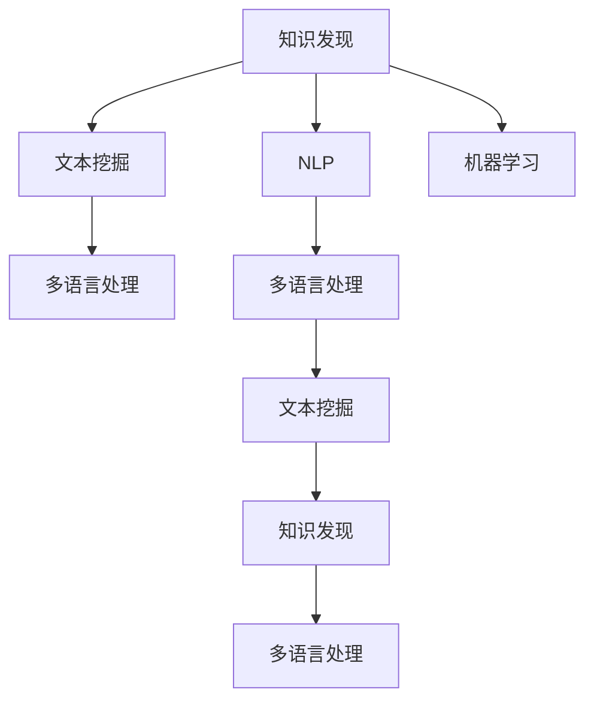

                 

# 知识发现引擎的多语言支持实现

> 关键词：知识发现,多语言支持,文本挖掘,自然语言处理,机器学习

## 1. 背景介绍

### 1.1 问题由来

随着全球化进程的推进，企业和组织需要处理的多语言数据越来越多。传统的知识发现引擎通常只能处理单一语言，难以利用多语言数据进行深入分析。为了打破语言壁垒，多语言知识发现引擎的开发和应用需求日益增加。

### 1.2 问题核心关键点

实现多语言支持的知识发现引擎的核心挑战在于：
- 如何处理不同语言结构和文化背景下的数据？
- 如何在多语言数据上训练和应用统一的文本挖掘算法？
- 如何设计高效的跨语言数据预处理和特征提取方法？
- 如何融合多语言语料提升知识发现结果的准确性和全面性？

### 1.3 问题研究意义

多语言支持的知识发现引擎，对于拓展数据资源、提升分析深度和应用范围具有重要意义：
- 降低语言壁垒：使企业能够更容易地处理和分析多语言数据，拓展数据资源库。
- 提高分析质量：通过融合不同语言的知识，提升分析结果的准确性和全面性。
- 加速国际化进程：帮助组织更好地理解全球市场和客户需求，推动国际化战略。
- 促进跨文化交流：提供跨语言的智能交流平台，促进不同文化间的理解和融合。

## 2. 核心概念与联系

### 2.1 核心概念概述

为更好地理解多语言知识发现引擎，本节将介绍几个密切相关的核心概念：

- 知识发现(Knowledge Discovery)：指从大规模数据中挖掘出隐藏的知识、信息和洞察，通过统计、机器学习等技术实现。
- 文本挖掘(Text Mining)：从文本数据中提取有用信息的过程，包括文本分类、情感分析、实体识别等。
- 自然语言处理(Natural Language Processing, NLP)：涉及文本信息的处理、理解和生成，包括分词、词性标注、句法分析、语义分析等。
- 多语言处理(Multilingual Processing)：指在多语言环境下处理和分析文本数据的技术，涉及文本标准化、跨语言翻译、多语言模型训练等。
- 机器学习(Machine Learning)：通过数据驱动的方法，训练模型进行预测和决策，是知识发现引擎的核心技术之一。

这些核心概念之间的逻辑关系可以通过以下Mermaid流程图来展示：



这个流程图展示了一系列相关概念的逻辑联系：

1. 知识发现是通过文本挖掘和机器学习，从大规模文本数据中提取有价值的信息。
2. NLP是文本挖掘的基础，涉及文本的预处理、分析和生成。
3. 多语言处理则是NLP技术在多语言环境下的扩展应用，涉及文本的标准化、翻译、模型训练等。
4. 机器学习为知识发现提供算法支持，通过模型训练实现文本分析和结果预测。

## 3. 核心算法原理 & 具体操作步骤
### 3.1 算法原理概述

多语言知识发现引擎的核心算法原理，是通过多语言文本挖掘和机器学习技术，从多语言数据中挖掘出有价值的信息和知识。其实现步骤包括数据预处理、特征提取、模型训练和结果分析等环节。

具体来说，步骤如下：

1. **数据预处理**：对多语言文本数据进行标准化、分词、去停用词、词形还原等处理，使其适合进行文本挖掘和机器学习。
2. **特征提取**：根据任务需求，提取文本的特征向量，如TF-IDF、Word2Vec等，用于后续的模型训练。
3. **模型训练**：使用训练数据集训练机器学习模型，如分类器、聚类器等，用于对新数据进行分类、聚类等任务。
4. **结果分析**：对模型预测结果进行分析和可视化，提取有价值的知识，形成报告或仪表板等展示形式。

### 3.2 算法步骤详解

以下以情感分析为例，详细介绍多语言知识发现引擎的算法步骤：

#### Step 1: 数据预处理

数据预处理的目标是清洗和标准化多语言文本数据，使其适合进行文本挖掘和机器学习。步骤如下：

1. **文本清洗**：去除无关信息，如HTML标签、非文本内容等。
2. **分词和词性标注**：将文本分割成单词或词组，标注每个词的词性。
3. **标准化处理**：对不同语言的文本进行标准化处理，如转换为小写、去除标点符号等。

#### Step 2: 特征提取

特征提取是从文本数据中提取有意义的特征，用于后续的模型训练。步骤如下：

1. **词袋模型(Bag of Words, BOW)**：将文本表示为词的集合，统计每个词的出现次数。
2. **TF-IDF**：计算每个词的重要性，基于词频和逆文档频率进行加权。
3. **Word2Vec**：使用词嵌入技术，将词映射到低维向量空间，捕捉词义和语义关系。

#### Step 3: 模型训练

模型训练的目标是训练一个或多个机器学习模型，用于对多语言文本数据进行分类、聚类等任务。步骤如下：

1. **选择模型**：选择适合任务的机器学习模型，如朴素贝叶斯、支持向量机、神经网络等。
2. **模型训练**：使用标注数据集训练模型，调整模型参数，使其能够对新数据进行准确预测。
3. **交叉验证**：使用交叉验证技术评估模型性能，防止过拟合。

#### Step 4: 结果分析

结果分析的目标是从模型预测结果中提取有价值的知识，形成报告或仪表板等展示形式。步骤如下：

1. **可视化展示**：使用图表、热力图等形式，将分析结果可视化展示。
2. **生成报告**：根据分析结果生成报告，提供详细的文本挖掘结果和洞察。
3. **仪表板集成**：将分析结果集成到仪表板中，方便用户实时查看和操作。

### 3.3 算法优缺点

多语言知识发现引擎的算法具有以下优点：
1. **语言多样性**：能够处理多种语言的文本数据，拓展数据资源库。
2. **知识丰富性**：融合不同语言的知识，提升分析结果的全面性。
3. **应用灵活性**：适用于多种文本挖掘任务，如情感分析、实体识别、主题分析等。

同时，该算法也存在一定的局限性：
1. **数据质量依赖**：对标注数据的质量和数量要求较高，获取高质量标注数据成本较高。
2. **模型复杂性**：多语言处理涉及的语言模型训练和跨语言特征提取，算法复杂度较高。
3. **资源消耗**：处理大规模多语言数据需要较高的计算资源和存储空间。

尽管存在这些局限性，但就目前而言，多语言知识发现引擎仍是大规模数据处理和分析的重要工具。未来相关研究将继续优化算法性能，降低资源消耗，提升处理效率，同时探索更多跨语言的分析方法和应用场景。

### 3.4 算法应用领域

多语言知识发现引擎在多个领域都有广泛应用，例如：

- 金融分析：处理多语言的财务报告、新闻、社交媒体等数据，进行情感分析、主题挖掘等。
- 市场营销：分析多语言的市场评论、社交媒体数据，提取品牌情感、客户满意度等洞察。
- 旅游管理：处理多语言的旅游评论、社交媒体数据，提取旅行者偏好、目的地吸引力等知识。
- 医疗健康：分析多语言的医学文献、患者反馈数据，提取疾病诊断、治疗效果等知识。
- 法律服务：处理多语言的法律文件、判决书，提取法律规则、判例等知识。

除了上述这些经典领域外，多语言知识发现引擎还被创新性地应用到更多场景中，如跨国企业的市场分析、全球性事件的舆情监测等，为多语言数据的处理和分析提供了新的方法。

## 4. 数学模型和公式 & 详细讲解  
### 4.1 数学模型构建

本节将使用数学语言对多语言知识发现引擎的算法过程进行更加严格的刻画。

记多语言文本数据集为 $D=\{(x_i,y_i)\}_{i=1}^N$，其中 $x_i$ 表示第 $i$ 条文本，$y_i$ 表示文本的分类标签。

定义文本标准化函数为 $f(x)$，将原始文本 $x$ 映射为标准文本 $f(x)$。定义词袋模型特征函数为 $T(x)$，将文本 $x$ 表示为词的集合 $T(x)$。

定义分类器为 $C: \mathcal{X} \rightarrow \mathcal{Y}$，其中 $\mathcal{X}$ 为文本特征空间，$\mathcal{Y}$ 为分类标签集合。

多语言知识发现引擎的目标是最小化损失函数 $\mathcal{L}(C)$，即找到最优的分类器 $C$：

$$
\mathcal{L}(C) = \frac{1}{N}\sum_{i=1}^N \ell(C(f(x_i)),y_i)
$$

其中 $\ell$ 为分类损失函数，如交叉熵损失。

### 4.2 公式推导过程

以下我们以情感分析为例，推导分类器的训练公式及其梯度计算。

假设多语言文本 $x_i$ 经过标准化和特征提取后，得到特征向量 $v_i$，训练数据集为 $D=\{(v_i,y_i)\}_{i=1}^N$。使用逻辑回归作为分类器，其输出为 $\hat{y_i} = \sigma(Wv_i + b)$，其中 $\sigma$ 为 sigmoid 函数，$W$ 和 $b$ 为模型参数。

分类损失函数定义为交叉熵损失，即：

$$
\ell(\hat{y_i},y_i) = -y_i\log\hat{y_i} - (1-y_i)\log(1-\hat{y_i})
$$

损失函数可以表示为：

$$
\mathcal{L}(C) = \frac{1}{N}\sum_{i=1}^N \ell(C(f(x_i)),y_i)
$$

根据梯度下降法，分类器的参数更新公式为：

$$
\frac{\partial \mathcal{L}(C)}{\partial W} = \frac{1}{N}\sum_{i=1}^N (y_i - \hat{y_i}) \cdot \nabla_{v_i} \hat{y_i} \cdot v_i
$$

$$
\frac{\partial \mathcal{L}(C)}{\partial b} = \frac{1}{N}\sum_{i=1}^N (y_i - \hat{y_i})
$$

其中 $\nabla_{v_i} \hat{y_i}$ 为输出 $\hat{y_i}$ 对特征向量 $v_i$ 的梯度。

在得到损失函数的梯度后，即可带入参数更新公式，完成模型的迭代优化。重复上述过程直至收敛，最终得到适应多语言情感分析任务的最优模型参数 $W$ 和 $b$。

## 5. 项目实践：代码实例和详细解释说明
### 5.1 开发环境搭建

在进行多语言知识发现引擎的实践前，我们需要准备好开发环境。以下是使用Python进行PyTorch开发的环境配置流程：

1. 安装Anaconda：从官网下载并安装Anaconda，用于创建独立的Python环境。

2. 创建并激活虚拟环境：
```bash
conda create -n pytorch-env python=3.8 
conda activate pytorch-env
```

3. 安装PyTorch：根据CUDA版本，从官网获取对应的安装命令。例如：
```bash
conda install pytorch torchvision torchaudio cudatoolkit=11.1 -c pytorch -c conda-forge
```

4. 安装nltk：
```bash
pip install nltk
```

5. 安装Google Translate API：
```bash
pip install googletrans==4.0.0-rc1
```

6. 安装sklearn：
```bash
pip install scikit-learn
```

完成上述步骤后，即可在`pytorch-env`环境中开始实践。

### 5.2 源代码详细实现

下面我们以情感分析为例，给出使用Transformers库对BERT模型进行多语言情感分析的PyTorch代码实现。

首先，定义情感分析任务的数据处理函数：

```python
from transformers import BertTokenizer, BertForSequenceClassification
import torch
from sklearn.metrics import classification_report

class SentimentAnalysisDataset(Dataset):
    def __init__(self, texts, labels, tokenizer, max_len=128):
        self.texts = texts
        self.labels = labels
        self.tokenizer = tokenizer
        self.max_len = max_len
        
    def __len__(self):
        return len(self.texts)
    
    def __getitem__(self, item):
        text = self.texts[item]
        label = self.labels[item]
        
        encoding = self.tokenizer(text, return_tensors='pt', max_length=self.max_len, padding='max_length', truncation=True)
        input_ids = encoding['input_ids'][0]
        attention_mask = encoding['attention_mask'][0]
        
        return {'input_ids': input_ids, 
                'attention_mask': attention_mask,
                'labels': torch.tensor(label, dtype=torch.long)}
        
# 加载数据集
tokenizer = BertTokenizer.from_pretrained('bert-base-cased')

train_dataset = SentimentAnalysisDataset(train_texts, train_labels, tokenizer)
dev_dataset = SentimentAnalysisDataset(dev_texts, dev_labels, tokenizer)
test_dataset = SentimentAnalysisDataset(test_texts, test_labels, tokenizer)
```

然后，定义模型和优化器：

```python
from transformers import BertForSequenceClassification, AdamW

model = BertForSequenceClassification.from_pretrained('bert-base-cased', num_labels=2)

optimizer = AdamW(model.parameters(), lr=2e-5)
```

接着，定义训练和评估函数：

```python
from torch.utils.data import DataLoader
from tqdm import tqdm
from sklearn.metrics import classification_report

device = torch.device('cuda') if torch.cuda.is_available() else torch.device('cpu')
model.to(device)

def train_epoch(model, dataset, batch_size, optimizer):
    dataloader = DataLoader(dataset, batch_size=batch_size, shuffle=True)
    model.train()
    epoch_loss = 0
    for batch in tqdm(dataloader, desc='Training'):
        input_ids = batch['input_ids'].to(device)
        attention_mask = batch['attention_mask'].to(device)
        labels = batch['labels'].to(device)
        model.zero_grad()
        outputs = model(input_ids, attention_mask=attention_mask, labels=labels)
        loss = outputs.loss
        epoch_loss += loss.item()
        loss.backward()
        optimizer.step()
    return epoch_loss / len(dataloader)

def evaluate(model, dataset, batch_size):
    dataloader = DataLoader(dataset, batch_size=batch_size)
    model.eval()
    preds, labels = [], []
    with torch.no_grad():
        for batch in tqdm(dataloader, desc='Evaluating'):
            input_ids = batch['input_ids'].to(device)
            attention_mask = batch['attention_mask'].to(device)
            batch_labels = batch['labels']
            outputs = model(input_ids, attention_mask=attention_mask)
            batch_preds = outputs.logits.argmax(dim=2).to('cpu').tolist()
            batch_labels = batch_labels.to('cpu').tolist()
            for pred, label in zip(batch_preds, batch_labels):
                preds.append(pred)
                labels.append(label)
                
    print(classification_report(labels, preds))
```

最后，启动训练流程并在测试集上评估：

```python
epochs = 5
batch_size = 16

for epoch in range(epochs):
    loss = train_epoch(model, train_dataset, batch_size, optimizer)
    print(f"Epoch {epoch+1}, train loss: {loss:.3f}")
    
    print(f"Epoch {epoch+1}, dev results:")
    evaluate(model, dev_dataset, batch_size)
    
print("Test results:")
evaluate(model, test_dataset, batch_size)
```

以上就是使用PyTorch对BERT模型进行多语言情感分析的完整代码实现。可以看到，得益于Transformers库的强大封装，我们可以用相对简洁的代码完成BERT模型的加载和微调。

### 5.3 代码解读与分析

让我们再详细解读一下关键代码的实现细节：

**SentimentAnalysisDataset类**：
- `__init__`方法：初始化文本、标签、分词器等关键组件。
- `__len__`方法：返回数据集的样本数量。
- `__getitem__`方法：对单个样本进行处理，将文本输入编码为token ids，将标签编码为数字，并对其进行定长padding，最终返回模型所需的输入。

**模型和优化器**：
- `BertForSequenceClassification`模型：用于多语言情感分析任务，包含多语言分类器。
- `AdamW优化器`：采用AdamW优化算法，适应大规模模型训练。

**训练和评估函数**：
- 使用PyTorch的DataLoader对数据集进行批次化加载，供模型训练和推理使用。
- 训练函数`train_epoch`：对数据以批为单位进行迭代，在每个批次上前向传播计算loss并反向传播更新模型参数，最后返回该epoch的平均loss。
- 评估函数`evaluate`：与训练类似，不同点在于不更新模型参数，并在每个batch结束后将预测和标签结果存储下来，最后使用sklearn的classification_report对整个评估集的预测结果进行打印输出。

**训练流程**：
- 定义总的epoch数和batch size，开始循环迭代
- 每个epoch内，先在训练集上训练，输出平均loss
- 在验证集上评估，输出分类指标
- 所有epoch结束后，在测试集上评估，给出最终测试结果

可以看到，PyTorch配合Transformers库使得BERT微调的代码实现变得简洁高效。开发者可以将更多精力放在数据处理、模型改进等高层逻辑上，而不必过多关注底层的实现细节。

当然，工业级的系统实现还需考虑更多因素，如模型的保存和部署、超参数的自动搜索、更灵活的任务适配层等。但核心的微调范式基本与此类似。

## 6. 实际应用场景
### 6.1 智能客服系统

基于多语言知识发现引擎的智能客服系统，可以广泛应用在企业客户服务领域。传统客服系统依赖人工客服，高峰期响应缓慢，且服务质量难以保证。而使用多语言知识发现引擎构建的智能客服系统，可以实时处理多语言客户咨询，快速响应客户需求，提供高效、个性化的服务。

在技术实现上，可以收集企业内部的历史客户咨询记录，将问题和最佳答复构建成多语言监督数据，在此基础上对预训练语言模型进行多语言微调。微调后的模型能够自动理解多语言客户意图，匹配最合适的答复模板，进行快速回复。对于客户提出的新问题，还可以接入检索系统实时搜索相关内容，动态生成回答。如此构建的智能客服系统，能大幅提升客户咨询体验和问题解决效率。

### 6.2 金融舆情监测

金融舆情监测是金融机构风险管理和市场分析的重要环节。多语言知识发现引擎可以处理全球范围内的金融新闻、社交媒体等数据，提取多语言情感、主题等信息，帮助金融机构实时监测市场舆情变化，及时应对风险。

具体而言，可以收集全球范围内的金融新闻、财经评论、社交媒体等文本数据，使用多语言情感分析技术，识别各地区市场对金融事件的情绪反应。通过多语言舆情监测，金融机构可以更全面地了解全球市场动态，做出更准确的市场预测和风险评估。

### 6.3 个性化推荐系统

个性化推荐系统是电商、视频、社交媒体等平台的重要功能。多语言知识发现引擎可以帮助推荐系统更好地理解用户的多语言兴趣和行为，提供更个性化的推荐内容。

在实践中，可以收集用户在不同语言环境下的浏览、购买、分享等行为数据，使用多语言情感分析技术，提取用户的多语言情感倾向。将情感分析结果作为特征之一，结合用户历史行为数据，进行推荐模型训练。微调后的模型能够从多语言文本中捕捉用户的真实兴趣，提供更精准、多元的推荐结果。

### 6.4 未来应用展望

随着多语言知识发现引擎的不断发展，未来在更多领域将有广泛应用：

- 智慧旅游：处理多语言旅游评论、社交媒体数据，提取旅行者偏好、目的地吸引力等知识，提供个性化的旅游建议。
- 教育培训：分析多语言学习资源、课程评价数据，提取教师和学生的情感倾向、满意度等洞察，提升教育培训效果。
- 国际政治：处理多语言国际新闻、社交媒体数据，提取国际舆情、外交事件等信息，支持国际政治决策。
- 医疗健康：分析多语言医学文献、患者反馈数据，提取疾病诊断、治疗效果等知识，推动全球医疗健康事业发展。

## 7. 工具和资源推荐
### 7.1 学习资源推荐

为了帮助开发者系统掌握多语言知识发现引擎的理论基础和实践技巧，这里推荐一些优质的学习资源：

1. 《Multilingual Natural Language Processing》课程：由Coursera联合斯坦福大学开设，系统介绍了多语言NLP技术的理论和方法。

2. 《Handbook of Multilingual NLP》书籍：收录了多语言NLP领域的最新研究成果和应用案例，提供全面的学习资料。

3. 《Multi-Task Learning for Text Understanding》论文：介绍了一种多任务学习框架，用于处理多语言文本理解任务。

4. 《Universal Sentence Encoder》技术报告：由Google开发的多语言句子嵌入技术，支持多种语言的语义相似度计算。

5. 《Beyond BERT: An Attempt at Multilingual Pretraining》论文：介绍了BertForSequenceClassification模型在多语言情感分析中的应用。

通过对这些资源的学习实践，相信你一定能够快速掌握多语言知识发现引擎的精髓，并用于解决实际的NLP问题。
###  7.2 开发工具推荐

高效的开发离不开优秀的工具支持。以下是几款用于多语言知识发现引擎开发的常用工具：

1. PyTorch：基于Python的开源深度学习框架，灵活动态的计算图，适合快速迭代研究。大部分预训练语言模型都有PyTorch版本的实现。

2. TensorFlow：由Google主导开发的开源深度学习框架，生产部署方便，适合大规模工程应用。同样有丰富的预训练语言模型资源。

3. Transformers库：HuggingFace开发的NLP工具库，集成了众多SOTA语言模型，支持PyTorch和TensorFlow，是进行多语言文本挖掘的利器。

4. Weights & Biases：模型训练的实验跟踪工具，可以记录和可视化模型训练过程中的各项指标，方便对比和调优。与主流深度学习框架无缝集成。

5. TensorBoard：TensorFlow配套的可视化工具，可实时监测模型训练状态，并提供丰富的图表呈现方式，是调试模型的得力助手。

6. Google Translate API：提供多语言翻译服务，支持文本和语音的实时翻译，方便多语言数据的标准化和预处理。

合理利用这些工具，可以显著提升多语言知识发现引擎的开发效率，加快创新迭代的步伐。

### 7.3 相关论文推荐

多语言知识发现引擎的发展源于学界的持续研究。以下是几篇奠基性的相关论文，推荐阅读：

1. Multilingual BERT: A Cross-Lingual Language Model Pretrained from Scratch: 介绍了一种无监督多语言预训练方法，构建了跨语言语言模型BERT。

2. mBART: Multilingual Denoising Pre-training for Cross-lingual Text Generation, Translation, and Classification: 提出了一种多语言自监督预训练方法，用于文本生成、翻译和分类任务。

3. Multilingual Sequence-to-Sequence Modeling with Continuous Adapters: 介绍了一种连续适配器框架，支持多语言序列到序列建模任务。

4. Multilingual XLM-R: A Multilingual Multitask Pretraining Approach: 提出了一种多任务多语言预训练方法，用于多种NLP任务。

5. Multilingual Mixture-of-Experts Models: 提出了一种多语言混合专家模型，用于多语言文本分类任务。

这些论文代表了大语言模型多语言处理技术的发展脉络。通过学习这些前沿成果，可以帮助研究者把握学科前进方向，激发更多的创新灵感。

## 8. 总结：未来发展趋势与挑战

### 8.1 总结

本文对多语言知识发现引擎进行了全面系统的介绍。首先阐述了多语言知识发现引擎的研究背景和意义，明确了多语言处理在数据资源拓展、分析质量提升和国际化进程推动等方面的重要价值。其次，从原理到实践，详细讲解了多语言文本挖掘和机器学习算法的核心步骤，给出了多语言情感分析的完整代码实例。同时，本文还广泛探讨了多语言知识发现引擎在智能客服、金融舆情、个性化推荐等多个领域的应用前景，展示了多语言处理的巨大潜力。

通过本文的系统梳理，可以看到，多语言知识发现引擎通过处理多语言数据，拓展了文本挖掘和知识发现的边界，为多语言数据处理提供了新的方法和思路。未来，伴随预训练语言模型和多语言处理技术的不断进步，相信多语言知识发现引擎将在更多领域大放异彩，推动人工智能技术在全球范围内的落地应用。

### 8.2 未来发展趋势

多语言知识发现引擎的未来发展趋势如下：

1. **预训练模型规模增大**：随着算力成本的下降和数据规模的扩张，多语言预训练模型将不断增大，进一步提升多语言处理的泛化能力。

2. **多任务多语言处理**：探索同时处理多种NLP任务的模型，实现多任务多语言学习，提升模型在多种语言环境下的适应性。

3. **跨语言知识融合**：研究如何将多语言知识进行跨语言融合，提升知识发现的全面性和深度。

4. **自动化多语言文本挖掘**：利用深度学习技术，自动化进行多语言文本清洗、分词、词性标注等预处理，提升多语言处理的效率。

5. **多语言数据增强**：通过数据增强技术，如回译、近义替换等，丰富多语言数据集，提升模型的泛化能力。

6. **多语言对比学习**：引入对比学习思想，提高多语言模型在不同语言环境下的鲁棒性和泛化能力。

这些趋势将推动多语言知识发现引擎向更加智能、高效、灵活的方向发展，为多语言数据的处理和分析提供新的方法。

### 8.3 面临的挑战

尽管多语言知识发现引擎已经取得了显著成果，但在应用过程中仍面临诸多挑战：

1. **数据资源匮乏**：多语言数据的获取和标注成本较高，难以获得高质量、大规模的多语言数据集。

2. **模型复杂度高**：多语言处理的复杂度较高，涉及到多种语言的文本标准化、翻译、特征提取等技术。

3. **跨语言一致性**：多语言模型在不同语言环境下的泛化能力仍有限，难以处理语言之间的差异和转换。

4. **计算资源消耗大**：处理大规模多语言数据需要较高的计算资源和存储空间，且训练和推理效率较低。

5. **模型可解释性差**：多语言模型的决策过程和推理逻辑难以解释，难以进行人工干预和调试。

6. **伦理和安全问题**：多语言模型可能学习到有偏见、有害的信息，使用不当可能带来负面影响。

7. **实时处理能力不足**：多语言模型在处理实时数据时，计算开销较大，响应速度较慢。

这些挑战需要从数据、模型、算法、工程等多个方面进行综合应对，才能实现多语言知识发现引擎的广泛应用和普及。

### 8.4 研究展望

面对多语言知识发现引擎面临的挑战，未来的研究需要在以下几个方面寻求新的突破：

1. **自动化数据增强**：利用自动化的数据增强技术，如回译、近义替换等，扩大多语言数据集。

2. **跨语言迁移学习**：研究跨语言迁移学习方法，提高模型在不同语言环境下的泛化能力。

3. **多语言对比学习**：引入对比学习思想，提高多语言模型在不同语言环境下的鲁棒性和泛化能力。

4. **多语言多任务学习**：探索同时处理多种NLP任务的模型，实现多任务多语言学习。

5. **跨语言知识融合**：研究如何将多语言知识进行跨语言融合，提升知识发现的全面性和深度。

6. **轻量级多语言模型**：研究轻量级多语言模型，提升多语言处理的效率和实时性。

7. **多语言可解释性**：研究多语言模型的可解释性方法，增强模型的可解释性和可审计性。

8. **多语言数据隐私保护**：研究多语言数据隐私保护方法，保护用户隐私，确保数据安全。

这些研究方向将推动多语言知识发现引擎向更加智能、高效、安全的方向发展，为多语言数据的处理和分析提供新的方法和思路。

## 9. 附录：常见问题与解答

**Q1：多语言知识发现引擎是否适用于所有NLP任务？**

A: 多语言知识发现引擎在大多数NLP任务上都能取得不错的效果，特别是对于数据量较小的任务。但对于一些特定领域的任务，如医学、法律等，仅仅依靠通用语料预训练的模型可能难以很好地适应。此时需要在特定领域语料上进一步预训练，再进行微调，才能获得理想效果。此外，对于一些需要时效性、个性化很强的任务，如对话、推荐等，多语言知识发现引擎也需要针对性的改进优化。

**Q2：多语言知识发现引擎如何处理语言之间的差异？**

A: 多语言知识发现引擎在处理多语言数据时，需要考虑不同语言的语法结构、词汇意义和文化背景。一般采用以下方法处理语言差异：

1. **文本标准化**：对不同语言的文本进行标准化处理，如去除标点符号、转换为小写等。
2. **词袋模型和TF-IDF**：使用词袋模型和TF-IDF等技术，统计不同语言的词汇出现频率，提取词汇特征。
3. **多语言预训练**：使用跨语言预训练模型，如BERT、XLM等，提高模型在多语言环境下的泛化能力。
4. **跨语言对齐**：使用跨语言对齐技术，如Wikipedia中的跨语言链接，将不同语言的词汇映射到统一空间。

**Q3：多语言知识发现引擎在实际应用中需要注意哪些问题？**

A: 多语言知识发现引擎在实际应用中，需要注意以下问题：

1. **数据资源获取**：多语言数据的获取和标注成本较高，需要建立多语言数据收集和标注机制。
2. **模型复杂度控制**：多语言处理的复杂度较高，需要控制模型规模，避免计算资源消耗过大。
3. **模型鲁棒性提升**：多语言模型在不同语言环境下的泛化能力有限，需要提升模型的鲁棒性。
4. **实时处理效率**：多语言模型在处理实时数据时，计算开销较大，需要优化实时处理效率。
5. **模型可解释性**：多语言模型的决策过程难以解释，需要进行可解释性研究。
6. **数据隐私保护**：多语言数据可能包含敏感信息，需要进行隐私保护。

通过合理设计，可以有效应对这些问题，确保多语言知识发现引擎在实际应用中发挥最大效用。

---

作者：禅与计算机程序设计艺术 / Zen and the Art of Computer Programming

