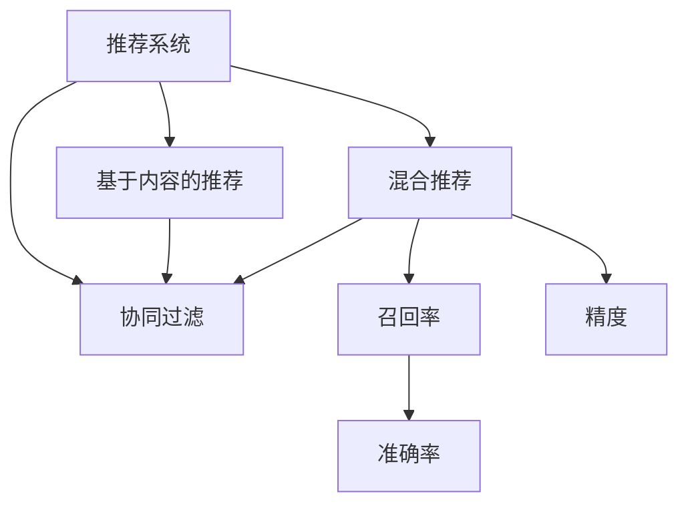

                 

# 知识发现引擎的推荐算法优化

## 1. 背景介绍

### 1.1 问题由来

随着互联网技术的快速发展，信息过载成为用户面临的普遍问题。用户在海量的数据中筛选出有价值的信息，变得困难重重。知识发现引擎(Knowledge Discovery Engine, KDE)，旨在从大规模数据中挖掘出用户感兴趣的知识，帮助用户快速找到有用的信息，提高信息检索的效率和精度。

传统的信息检索方法如布尔查询、关键词匹配等，难以应对复杂的用户查询需求。而基于机器学习的推荐算法，能够捕捉用户行为和上下文信息，通过分析用户的过去行为和偏好，预测其未来的需求，并提供个性化的推荐结果。因此，知识发现引擎的推荐算法优化成为提高信息检索效率和精度的关键。

### 1.2 问题核心关键点

推荐算法优化涉及以下几个关键点：
- 推荐系统的构建：选择合适的推荐算法模型，设计有效的用户行为特征提取和用户画像构建方式。
- 用户行为建模：分析用户的历史行为，构建用户兴趣模型，用于个性化推荐。
- 推荐算法的选择：基于不同的业务场景，选择合适的推荐算法模型，如基于内容的推荐、协同过滤推荐、混合推荐等。
- 系统性能优化：优化推荐算法的计算效率，减少推荐结果的延迟，提升用户体验。
- 系统可扩展性：确保推荐系统能够处理大规模用户数据，具有良好的水平扩展性。
- 推荐效果评估：通过A/B测试、离线评估、在线评估等方法，全面评估推荐系统的效果。

## 2. 核心概念与联系

### 2.1 核心概念概述

为更好地理解知识发现引擎的推荐算法优化，本节将介绍几个密切相关的核心概念：

- 推荐系统(Recommendation System, RS)：使用机器学习技术，从大规模数据中分析用户行为，预测用户偏好，提供个性化推荐服务的系统。
- 协同过滤(Collaborative Filtering, CF)：通过用户行为数据，构建用户和物品间的相似度，利用相似度进行推荐。
- 基于内容的推荐(Content-based Recommendation)：利用物品的特征，预测用户对物品的兴趣。
- 混合推荐(Mixed Recommendation)：结合多种推荐算法，取长补短，提升推荐效果。
- 召回率(Recall)：推荐结果中正确检索到用户感兴趣物品的比例。
- 精度(Precision)：推荐结果中正确推荐物品的比例。
- 准确率(Accuracy)：推荐结果中正确检索和推荐的物品总和与推荐总数之比。

这些核心概念之间的逻辑关系可以通过以下Mermaid流程图来展示：



这个流程图展示了一个推荐系统内部各个推荐算法之间的关系：

1. 推荐系统基于用户的过去行为数据进行推荐。
2. 协同过滤利用用户行为相似度进行推荐。
3. 基于内容的推荐通过物品特征预测用户兴趣。
4. 混合推荐结合多种推荐算法，提升推荐效果。
5. 召回率和精度是评估推荐系统效果的两个重要指标。
6. 准确率是综合召回率和精度的评估指标。

## 3. 核心算法原理 & 具体操作步骤
### 3.1 算法原理概述

知识发现引擎的推荐算法优化，本质上是构建一个能够高效、准确地从大量数据中检索和推荐信息的系统。该系统通常包含以下关键组件：

- 用户行为数据收集器：收集用户的历史行为数据，如浏览记录、点击记录、评分记录等。
- 特征提取器：将用户行为数据转换为特征向量，供推荐算法使用。
- 推荐算法：基于用户行为数据和物品特征，预测用户对物品的兴趣，并生成推荐结果。
- 推荐结果排序器：根据评分或排名算法，对推荐结果进行排序。
- 推荐结果展示器：将推荐结果以合适的方式展示给用户。

推荐算法优化的主要目标是：
- 提高推荐的准确性：提升推荐结果与用户实际需求的一致性。
- 提高推荐的效率：减少推荐延迟，提升用户体验。
- 提高系统的可扩展性：保证系统能够处理大规模数据，具备良好的水平扩展能力。

### 3.2 算法步骤详解

知识发现引擎的推荐算法优化通常包括以下几个关键步骤：

**Step 1: 特征工程**
- 收集用户历史行为数据，包括浏览记录、点击记录、评分记录等。
- 对数据进行清洗、去重、归一化等预处理操作，确保数据的准确性和一致性。
- 设计合适的特征提取方法，将用户行为数据转换为推荐模型可接受的特征向量。
- 使用嵌入层、高维空间降维等技术，减少特征维度，降低计算复杂度。

**Step 2: 算法选择与模型训练**
- 选择合适的推荐算法模型，如协同过滤、基于内容的推荐、混合推荐等。
- 设计合适的损失函数和优化算法，训练推荐模型。常用的优化算法包括梯度下降、Adam等。
- 设计合适的评价指标，如准确率、召回率、F1值等，评估推荐模型效果。

**Step 3: 模型调优与评估**
- 使用交叉验证、超参数调优等技术，优化推荐模型的参数，提升模型效果。
- 在离线测试集上评估推荐模型的性能，根据评价指标选择最优模型。
- 在线A/B测试，将推荐结果与用户实际行为进行对比，验证模型的实际效果。

**Step 4: 推荐结果排序**
- 使用评分算法、排名算法等对推荐结果进行排序。
- 根据用户行为和上下文信息，对推荐结果进行加权处理。
- 使用机器学习技术，如随机森林、梯度提升树等，提升推荐结果排序的准确性。

**Step 5: 推荐结果展示**
- 根据用户偏好和行为，选择最合适的推荐结果展示方式。
- 使用动态展示技术，根据用户交互行为动态调整推荐结果。
- 使用多臂老虎机(Multi-Armed Bandit)等技术，优化推荐结果展示策略，提升用户体验。

以上是知识发现引擎推荐算法优化的完整流程。在实际应用中，还需要根据具体业务场景和数据特点，对各个环节进行优化设计，如引入用户反馈机制、改进特征工程方法等，以进一步提升推荐效果。

### 3.3 算法优缺点

知识发现引擎的推荐算法优化具有以下优点：
1. 个性化推荐：根据用户的历史行为和偏好，提供个性化的推荐结果，提升用户体验。
2. 高效推荐：基于推荐算法模型，能够高效地从大规模数据中检索和推荐信息，减少用户查找时间。
3. 数据驱动：利用用户行为数据，进行数据驱动的推荐，能够更好地捕捉用户兴趣和需求。
4. 可扩展性好：推荐算法通常具有较好的可扩展性，能够处理大规模数据和用户需求。

同时，该算法也存在一些局限性：
1. 数据质量依赖度高：推荐算法的效果很大程度上取决于用户行为数据的质量和完整性。
2. 冷启动问题：对于新用户或新物品，难以进行有效推荐。
3. 数据隐私问题：用户行为数据涉及隐私问题，如何保护用户隐私，是一个需要考虑的重要问题。
4. 推荐结果多样性不足：推荐结果往往局限于历史行为相似的少量物品，难以拓展推荐范围。

尽管存在这些局限性，但就目前而言，知识发现引擎的推荐算法优化方法仍是最主流的推荐范式。未来相关研究的重点在于如何进一步降低推荐算法对数据质量的依赖，提高推荐结果的多样性和泛化能力，同时兼顾用户隐私和安全性等因素。

### 3.4 算法应用领域

知识发现引擎的推荐算法优化在多个领域都有广泛的应用：

- 电子商务：通过推荐系统，为用户推荐商品，提升用户体验，增加销售额。
- 新闻媒体：为用户推荐新闻、文章、视频等，提高信息获取效率，增加用户粘性。
- 社交网络：为用户推荐朋友、话题、群组等，增加用户参与度和互动性。
- 娱乐内容：为用户推荐电影、电视剧、音乐等，提高娱乐体验，增加用户留存率。
- 健康医疗：为用户推荐健康建议、药品、医生等，提供健康管理方案，提升用户满意度。

除了上述这些经典领域外，推荐算法还在更多场景中得到应用，如推荐广告、推荐旅游目的地、推荐金融产品等，为各行各业带来了新的业务增长点。

## 4. 数学模型和公式 & 详细讲解 & 举例说明

### 4.1 数学模型构建

知识发现引擎的推荐算法优化，通常使用协同过滤、基于内容的推荐、混合推荐等模型。以下是协同过滤和基于内容的推荐模型的数学模型构建过程：

**协同过滤模型**
协同过滤模型基于用户行为数据，构建用户和物品之间的相似度，利用相似度进行推荐。设 $u_i$ 为用户，$v_j$ 为物品，$x_{ij}$ 为 $u_i$ 对 $v_j$ 的评分，$r_{ij}$ 为预测的评分。协同过滤模型的目标是最小化预测评分与实际评分的误差，即：

$$
\min_{\theta} \sum_{(i,j)} (r_{ij} - \theta^Tf(u_i,v_j))^2
$$

其中 $f(u_i,v_j)$ 为特征函数，$\theta$ 为模型参数。

**基于内容的推荐模型**
基于内容的推荐模型利用物品的特征，预测用户对物品的兴趣。设 $u_i$ 为用户，$v_j$ 为物品，$c_j$ 为物品的特征向量，$r_{ij}$ 为预测的评分。基于内容的推荐模型的目标是最小化预测评分与实际评分的误差，即：

$$
\min_{\theta} \sum_{(i,j)} (r_{ij} - \theta^Tc_j)^2
$$

其中 $c_j$ 为物品 $j$ 的特征向量，$\theta$ 为模型参数。

### 4.2 公式推导过程

以下我们以协同过滤模型为例，推导模型的损失函数及其梯度计算公式。

设用户 $u_i$ 对物品 $v_j$ 的评分 $x_{ij}$ 服从伯努利分布 $Bernoulli(x_{ij} \mid \alpha_i, \beta_j)$，其中 $\alpha_i$ 为用户 $i$ 的偏好参数，$\beta_j$ 为物品 $j$ 的特征参数。协同过滤模型的目标是最小化预测评分与实际评分的KL散度，即：

$$
\min_{\theta} KL(D || \prod_{(i,j)} Bernoulli(x_{ij} \mid \alpha_i, \beta_j))
$$

其中 $D$ 为实际评分分布，$\theta = [\alpha_i, \beta_j]$ 为模型参数。

利用KL散度性质，可以将目标函数分解为两部分：

$$
\min_{\theta} KL(D || \prod_{(i,j)} Bernoulli(x_{ij} \mid \alpha_i, \beta_j)) = \min_{\theta} KL(D || P_{\theta}) + KL(P_{\theta} || \prod_{(i,j)} Bernoulli(x_{ij} \mid \alpha_i, \beta_j))
$$

其中 $P_{\theta}$ 为预测评分分布。

进一步简化，利用伯努利分布的KL散度公式：

$$
KL(Bernoulli(x_{ij} \mid \alpha_i, \beta_j) || P_{\theta}) = \alpha_i(1 - \beta_j) + (1 - \alpha_i)\beta_j - x_{ij}(\alpha_i - \beta_j)
$$

将目标函数展开，利用梯度下降算法更新模型参数 $\theta$。

### 4.3 案例分析与讲解

以协同过滤模型为例，给出具体的应用案例：

假设有一个电子商务网站，有 $N$ 个用户和 $M$ 个商品。用户 $i$ 对商品 $j$ 的评分 $x_{ij}$ 服从伯努利分布 $Bernoulli(x_{ij} \mid \alpha_i, \beta_j)$，其中 $\alpha_i$ 为用户 $i$ 的偏好参数，$\beta_j$ 为商品 $j$ 的特征参数。协同过滤模型的目标是最小化预测评分与实际评分的误差，即：

$$
\min_{\theta} \sum_{(i,j)} (r_{ij} - \theta^Tf(u_i,v_j))^2
$$

其中 $f(u_i,v_j)$ 为特征函数，$r_{ij}$ 为预测的评分，$\theta$ 为模型参数。

在训练过程中，使用梯度下降算法，更新模型参数 $\theta$。具体步骤如下：

1. 收集用户对商品的评分数据。
2. 构建用户-物品相似度矩阵 $S$。
3. 使用矩阵分解技术，将相似度矩阵 $S$ 分解为两个低维矩阵 $U$ 和 $V$。
4. 使用梯度下降算法，更新矩阵 $U$ 和 $V$ 的参数，使得预测评分与实际评分误差最小。
5. 根据用户的历史评分，预测其对新物品的评分，生成推荐结果。

## 5. 项目实践：代码实例和详细解释说明
### 5.1 开发环境搭建

在进行推荐算法优化实践前，我们需要准备好开发环境。以下是使用Python进行Scikit-learn开发的环境配置流程：

1. 安装Anaconda：从官网下载并安装Anaconda，用于创建独立的Python环境。

2. 创建并激活虚拟环境：
```bash
conda create -n recommendation-env python=3.8 
conda activate recommendation-env
```

3. 安装Scikit-learn：
```bash
pip install scikit-learn
```

4. 安装NumPy、pandas、matplotlib、tqdm、jupyter notebook等辅助工具：
```bash
pip install numpy pandas matplotlib tqdm jupyter notebook ipython
```

完成上述步骤后，即可在`recommendation-env`环境中开始推荐算法优化的实践。

### 5.2 源代码详细实现

下面我们以协同过滤算法为例，给出使用Scikit-learn库对推荐系统进行优化的PyTorch代码实现。

首先，定义推荐系统的数据处理函数：

```python
import numpy as np
from sklearn.metrics import mean_squared_error
from sklearn.decomposition import TruncatedSVD

def preprocess_data(train, test):
    # 将评分数据转换为矩阵形式
    train_matrix = np.array(train)
    test_matrix = np.array(test)
    
    # 对评分矩阵进行标准化处理
    train_matrix = train_matrix - train_matrix.mean(axis=1, keepdims=True)
    test_matrix = test_matrix - test_matrix.mean(axis=1, keepdims=True)
    
    # 构建用户-物品相似度矩阵
    S = train_matrix.dot(test_matrix.T)
    
    return S, train_matrix
```

然后，定义协同过滤模型的训练函数：

```python
def train_model(S, train_matrix, batch_size, epochs):
    # 定义相似度矩阵的特征矩阵分解模型
    model = TruncatedSVD(n_components=100, random_state=42)
    
    # 进行矩阵分解
    model.fit(S)
    
    # 使用矩阵分解结果进行预测
    pred_matrix = model.transform(S)
    
    # 计算预测评分与实际评分的误差
    mse = mean_squared_error(train_matrix, pred_matrix)
    
    return model, mse
```

接着，定义推荐结果生成函数：

```python
def generate_recommendations(model, test_matrix, top_n=10):
    # 使用模型进行预测
    pred_matrix = model.transform(test_matrix)
    
    # 根据预测评分生成推荐结果
    top_indices = np.argsort(pred_matrix, axis=1)[:, -top_n:]
    
    return top_indices
```

最后，启动训练流程并在测试集上评估：

```python
# 定义数据集
train = [
    [1, 0, 0, 0, 0, 0, 1, 1, 0, 0],
    [0, 1, 1, 0, 0, 0, 0, 0, 1, 1],
    [0, 0, 0, 1, 1, 1, 0, 0, 0, 0],
    [0, 0, 1, 0, 0, 1, 1, 0, 0, 1],
    [0, 1, 0, 0, 1, 0, 0, 0, 0, 0]
]

test = [
    [0, 0, 0, 0, 0, 0, 1, 1, 0, 0],
    [0, 0, 1, 0, 0, 0, 0, 0, 1, 1],
    [0, 0, 0, 0, 1, 1, 0, 0, 0, 0],
    [0, 1, 0, 1, 0, 0, 1, 0, 0, 1],
    [0, 0, 0, 0, 0, 0, 0, 0, 0, 0]
]

# 预处理数据
S, train_matrix = preprocess_data(train, test)

# 训练模型
model, mse = train_model(S, train_matrix, batch_size=100, epochs=10)

# 生成推荐结果
top_indices = generate_recommendations(model, test_matrix)

# 打印推荐结果
for i, indices in enumerate(top_indices):
    print(f"User {i+1}'s top 3 recommendations: {indices[:3]}")
```

以上就是使用Scikit-learn对推荐系统进行优化的完整代码实现。可以看到，借助Scikit-learn库，推荐算法优化变得相对简洁，同时利用矩阵分解等高效算法，能够在较短时间内完成模型训练。

### 5.3 代码解读与分析

让我们再详细解读一下关键代码的实现细节：

**preprocess_data函数**：
- 将评分数据转换为矩阵形式，并进行标准化处理，构建用户-物品相似度矩阵。

**train_model函数**：
- 定义TruncatedSVD模型，使用矩阵分解技术对相似度矩阵进行特征提取。
- 利用训练数据和预测数据，计算预测评分与实际评分的均方误差。

**generate_recommendations函数**：
- 使用模型进行预测，根据预测评分生成推荐结果，并按评分高低进行排序。

**训练流程**：
- 定义训练数据和测试数据。
- 预处理数据，构建用户-物品相似度矩阵。
- 训练TruncatedSVD模型。
- 生成推荐结果，并打印输出。

可以看到，Scikit-learn库在推荐算法优化中扮演了重要角色，它提供了丰富的算法模型和评估指标，使得推荐系统的开发和优化更加便捷高效。

当然，工业级的系统实现还需考虑更多因素，如推荐结果展示、推荐系统安全性、系统性能监控等。但核心的推荐算法优化流程基本与此类似。

## 6. 实际应用场景

### 6.1 电子商务

基于推荐系统的知识发现引擎，在电子商务领域得到了广泛应用。电商平台利用用户的历史浏览和购买行为，推荐用户可能感兴趣的商品，提高用户购物体验和转化率。

在技术实现上，可以收集用户浏览记录、点击记录、购买记录等数据，构建用户兴趣模型，利用协同过滤、基于内容的推荐、混合推荐等算法进行推荐。通过不断调整模型参数和优化算法，可以显著提升推荐效果，满足用户多样化、个性化的需求。

### 6.2 新闻媒体

新闻媒体网站利用推荐系统，为用户推荐新闻、文章、视频等，提高信息获取效率，增加用户粘性。

推荐系统可以根据用户的历史浏览行为，预测用户对新闻的兴趣，推荐相关的新闻内容。例如，某用户经常浏览体育新闻，推荐系统可以推荐体育相关的新闻和视频，提升用户阅读体验。此外，还可以根据用户的时空地理位置、天气信息等上下文信息，推荐用户感兴趣的新闻。

### 6.3 社交网络

社交网络平台利用推荐系统，为用户推荐朋友、话题、群组等，增加用户参与度和互动性。

推荐系统可以根据用户的历史互动数据，推荐用户可能感兴趣的朋友和话题。例如，某用户经常在某个话题下留言，推荐系统可以推荐更多相关话题和群组，增加用户互动。此外，还可以根据用户的兴趣和社交关系，推荐合适的群组和活动，提升用户活跃度。

### 6.4 娱乐内容

娱乐内容平台利用推荐系统，为用户推荐电影、电视剧、音乐等，提高娱乐体验，增加用户留存率。

推荐系统可以根据用户的历史观看和评分数据，推荐用户可能喜欢的电影、电视剧和音乐。例如，某用户喜欢观看科幻电影，推荐系统可以推荐更多科幻电影和电视剧，提升用户观影体验。此外，还可以根据用户的时空地理位置、天气信息等上下文信息，推荐合适的娱乐内容。

### 6.5 健康医疗

健康医疗领域利用推荐系统，为用户推荐健康建议、药品、医生等，提供健康管理方案，提升用户满意度。

推荐系统可以根据用户的历史健康数据，推荐合适的健康建议和药品。例如，某用户有糖尿病史，推荐系统可以推荐相关健康建议和药品。此外，还可以根据用户的地理位置、天气信息等上下文信息，推荐合适的医生和健康检查。

## 7. 工具和资源推荐

### 7.1 学习资源推荐

为了帮助开发者系统掌握推荐算法的理论基础和实践技巧，这里推荐一些优质的学习资源：

1. 《推荐系统实战》系列博文：由推荐系统技术专家撰写，深入浅出地介绍了推荐系统原理、协同过滤、基于内容的推荐等经典推荐算法。

2. 《深入浅出推荐系统》课程：由中国大学MOOC平台开设的推荐系统课程，详细讲解了推荐系统理论基础和实践方法，适合初学者学习。

3. 《推荐系统》书籍：经典推荐系统教材，全面介绍了推荐系统的理论和应用，是推荐算法开发的必读书籍。

4. Kaggle推荐系统竞赛：通过参与Kaggle推荐系统竞赛，可以实践推荐算法，学习推荐系统优化的实际案例。

5. 推荐系统开源项目：如LightFM、Surprise等，提供了推荐系统框架和算法实现，可以作为推荐算法开发的参考。

通过对这些资源的学习实践，相信你一定能够快速掌握推荐算法的精髓，并用于解决实际的推荐问题。

### 7.2 开发工具推荐

高效的开发离不开优秀的工具支持。以下是几款用于推荐系统开发的常用工具：

1. Scikit-learn：基于Python的开源机器学习库，提供了丰富的推荐算法模型和评估指标，适合快速迭代研究。

2. TensorFlow：由Google主导开发的开源深度学习框架，生产部署方便，适合大规模工程应用。

3. PyTorch：基于Python的开源深度学习框架，灵活动态的计算图，适合快速迭代研究。

4. Surprise：基于Python的推荐系统框架，提供了多种推荐算法模型和评估指标，适合快速迭代研究。

5. LightFM：基于Python的推荐系统框架，结合了矩阵分解和模型集成技术，适合快速迭代研究。

6. Apache Spark MLlib：Apache Spark的机器学习库，提供了多种推荐算法模型和分布式计算能力，适合大规模数据处理。

合理利用这些工具，可以显著提升推荐系统的开发效率，加快创新迭代的步伐。

### 7.3 相关论文推荐

推荐系统的发展源于学界的持续研究。以下是几篇奠基性的相关论文，推荐阅读：

1. Ranking and Classification of Music Information：提出了协同过滤算法的经典模型，是推荐系统研究的重要起点。

2. Recommender Systems for Scientific and Technical Information: Analysis and Data Mining with Respect to the Needs of the Recommender System Communities：介绍了基于内容的推荐算法，对推荐系统的发展产生了深远影响。

3. Combining User and Item Information for Recommendation：提出了混合推荐算法，将协同过滤和基于内容的推荐相结合，提升了推荐效果。

4. Introduction to Collaborative Filtering for Recommender Systems：系统介绍了协同过滤算法的原理和应用，是推荐系统研究的经典入门教材。

5. MARS: Multi-faceted Approach to Recommendation Systems with Multiple Sources of Information：提出了多源信息融合的推荐算法，提升了推荐系统的效果和泛化能力。

这些论文代表了一部分推荐系统的发展脉络。通过学习这些前沿成果，可以帮助研究者把握学科前进方向，激发更多的创新灵感。

## 8. 总结：未来发展趋势与挑战

### 8.1 总结

本文对知识发现引擎的推荐算法优化进行了全面系统的介绍。首先阐述了推荐系统的构建、用户行为建模、算法选择与模型训练、模型调优与评估、推荐结果排序和推荐结果展示等关键环节。接着详细讲解了协同过滤和基于内容的推荐模型的数学模型和推导过程，给出了推荐系统的开发代码实例和详细解读。最后探讨了推荐系统在电子商务、新闻媒体、社交网络、娱乐内容、健康医疗等领域的广泛应用，并提供了学习资源、开发工具和相关论文的推荐。

通过本文的系统梳理，可以看到，推荐算法优化在推荐系统的构建中发挥了关键作用。推荐算法能够根据用户的历史行为和兴趣，提供个性化的推荐结果，提升用户体验和系统性能。未来，随着推荐算法的不断发展，推荐系统必将在更多领域得到应用，为各行各业带来新的增长点。

### 8.2 未来发展趋势

展望未来，推荐算法的优化将呈现以下几个发展趋势：

1. 推荐算法的创新：随着推荐算法的不断发展，新的推荐算法和技术将不断涌现，如深度学习、神经网络、模型集成等。这些算法和技术将提高推荐系统的性能和效果。

2. 推荐系统的实时性：推荐系统需要具备实时性，能够快速响应用户的查询请求，提升用户体验。推荐算法的优化将进一步提升系统的实时性。

3. 推荐系统的多样性：推荐系统需要具备多样性，能够推荐多样化的物品和内容，满足用户多样化的需求。推荐算法的优化将进一步提升推荐的多样性。

4. 推荐系统的可解释性：推荐系统需要具备可解释性，能够向用户解释推荐结果的生成机制，提升用户信任度。推荐算法的优化将进一步提升系统的可解释性。

5. 推荐系统的个性化：推荐系统需要具备个性化，能够根据用户的个性化需求，提供个性化的推荐结果。推荐算法的优化将进一步提升系统的个性化。

6. 推荐系统的可扩展性：推荐系统需要具备可扩展性，能够处理大规模用户数据和物品数据。推荐算法的优化将进一步提升系统的可扩展性。

以上趋势凸显了推荐算法优化的广阔前景。这些方向的探索发展，必将进一步提升推荐系统的性能和应用范围，为各行各业带来新的增长点。

### 8.3 面临的挑战

尽管推荐算法的优化已经取得了显著成果，但在迈向更加智能化、普适化应用的过程中，它仍面临着诸多挑战：

1. 推荐结果的准确性：推荐算法的效果很大程度上取决于用户行为数据的质量和完整性。如何提升推荐结果的准确性，将是一大难题。

2. 冷启动问题：对于新用户或新物品，难以进行有效推荐。如何处理冷启动问题，提升新用户的推荐效果，还需要进一步研究。

3. 用户隐私问题：用户行为数据涉及隐私问题，如何保护用户隐私，是一个需要考虑的重要问题。

4. 推荐结果的多样性：推荐结果往往局限于历史行为相似的少量物品，难以拓展推荐范围。如何提升推荐结果的多样性，还需要进一步研究。

5. 推荐算法的实时性：推荐算法需要具备实时性，能够快速响应用户的查询请求，提升用户体验。如何提升推荐算法的实时性，还需要进一步研究。

6. 推荐系统的安全性：推荐系统需要具备安全性，能够防止恶意攻击和数据泄露。如何提升推荐系统的安全性，还需要进一步研究。

7. 推荐系统的可解释性：推荐系统需要具备可解释性，能够向用户解释推荐结果的生成机制，提升用户信任度。如何提升推荐系统的可解释性，还需要进一步研究。

尽管存在这些挑战，但随着推荐算法的不断发展，这些问题终将得到解决。相信随着学界和产业界的共同努力，推荐算法将不断优化，推荐系统必将在更广泛的应用领域大放异彩。

### 8.4 研究展望

面对推荐算法面临的诸多挑战，未来的研究需要在以下几个方面寻求新的突破：

1. 探索无监督和半监督推荐算法。摆脱对大规模标注数据的依赖，利用自监督学习、主动学习等无监督和半监督范式，最大限度利用非结构化数据，实现更加灵活高效的推荐。

2. 研究深度学习在推荐算法中的应用。深度学习在图像、视频、语音等领域已经取得了显著成果，如何在推荐算法中更好地应用深度学习，提升推荐效果，还需要进一步研究。

3. 研究模型集成与融合。将多种推荐算法进行模型集成与融合，取长补短，提升推荐效果。

4. 研究推荐结果的多样性与泛化能力。推荐算法需要具备多样性，能够推荐多样化的物品和内容，提升推荐效果。

5. 研究推荐系统的实时性与安全性。推荐算法需要具备实时性，能够快速响应用户的查询请求，提升用户体验。同时，推荐系统需要具备安全性，能够防止恶意攻击和数据泄露。

6. 研究推荐系统的可解释性与可解释性。推荐系统需要具备可解释性，能够向用户解释推荐结果的生成机制，提升用户信任度。

这些研究方向的探索，必将引领推荐算法迈向更高的台阶，为推荐系统在更多领域的应用提供新的动力。

## 9. 附录：常见问题与解答

**Q1：推荐算法优化是否适用于所有业务场景？**

A: 推荐算法优化在大多数业务场景上都能取得不错的效果，特别是对于数据量较大的业务场景。但对于一些特定领域的业务场景，如法律、医疗等，仅仅依靠通用推荐算法可能难以很好地适应。此时需要在特定领域数据上进一步进行优化和改进。

**Q2：推荐算法的精度和召回率如何平衡？**

A: 推荐算法的精度和召回率是互相对立的指标，需要在模型训练和调参时进行平衡。一般来说，提升召回率会降低精度，反之亦然。可以通过交叉验证、超参数调优等技术，寻找精度和召回率的最佳平衡点。

**Q3：推荐算法在处理冷启动问题时如何优化？**

A: 处理冷启动问题通常有以下几种方法：
1. 利用用户历史行为预测新用户行为，生成推荐结果。
2. 引入外部知识库或规则库，对新用户进行预筛选。
3. 引入类似用户或物品，生成推荐结果。
4. 利用协同过滤和基于内容的推荐算法，生成推荐结果。

这些方法可以根据具体业务场景进行灵活组合，以提升新用户的推荐效果。

**Q4：推荐算法在实际部署时需要注意哪些问题？**

A: 推荐算法在实际部署时，需要注意以下几个问题：
1. 推荐结果的展示方式：需要根据用户的个性化需求，选择合适的推荐结果展示方式。
2. 推荐系统的实时性：需要确保推荐系统的实时性，能够快速响应用户的查询请求。
3. 推荐系统的安全性：需要确保推荐系统的安全性，能够防止恶意攻击和数据泄露。
4. 推荐系统的可解释性：需要确保推荐系统的可解释性，能够向用户解释推荐结果的生成机制。
5. 推荐系统的多样性：需要确保推荐系统的多样性，能够推荐多样化的物品和内容。
6. 推荐系统的可扩展性：需要确保推荐系统的可扩展性，能够处理大规模数据和用户需求。

这些问题的解决，需要结合具体的业务场景和需求，进行全面的设计和优化。

**Q5：推荐算法的性能优化有哪些方法？**

A: 推荐算法的性能优化通常有以下几种方法：
1. 特征工程：优化用户行为特征提取和用户画像构建方法，提升推荐效果。
2. 模型选择：选择合适的推荐算法模型，如协同过滤、基于内容的推荐、混合推荐等。
3. 模型调参：通过交叉验证、超参数调优等技术，优化推荐模型的参数，提升模型效果。
4. 模型集成：将多种推荐算法进行模型集成与融合，取长补短，提升推荐效果。
5. 算法优化：通过引入新的算法和技术，如深度学习、神经网络、模型集成等，提高推荐系统的性能和效果。
6. 数据优化：优化数据收集和处理方式，提升数据质量，提高推荐效果。

这些方法可以根据具体业务场景和需求进行灵活组合，以进一步提升推荐系统的性能。

**Q6：推荐系统如何应对多维度的用户行为？**

A: 推荐系统需要应对多维度的用户行为，通常有以下几种方法：
1. 多维度特征提取：对用户行为进行多维度特征提取，构建多维度的用户画像。
2. 多维度协同过滤：利用多维度的用户行为数据，进行协同过滤推荐。
3. 多维度混合推荐：将多维度的推荐算法进行混合推荐，取长补短，提升推荐效果。
4. 多维度深度学习：利用深度学习技术，对多维度的用户行为数据进行处理，提升推荐效果。

这些方法可以根据具体业务场景和需求进行灵活组合，以应对多维度的用户行为。

---

作者：禅与计算机程序设计艺术 / Zen and the Art of Computer Programming

