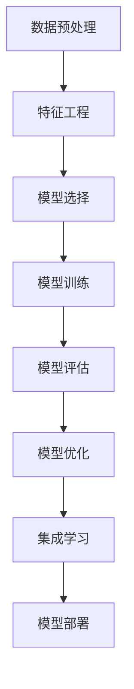

                 

# 知识发现引擎的机器学习算法优化

> 关键词：知识发现引擎,机器学习算法,优化,特征工程,模型选择,集成学习

## 1. 背景介绍

### 1.1 问题由来

在当今数据驱动的时代，企业和组织需要从海量数据中快速高效地获取有价值的信息，以支持决策制定、产品优化、市场分析等关键任务。知识发现引擎(Knowledge Discovery Engine, KDE)是一种自动化从数据中提取知识的技术，它通过数据分析和机器学习算法，帮助用户识别模式、发现关联，并提炼有价值的见解。

然而，知识发现引擎的性能高度依赖于其核心算法的设计和优化。如何选择合适的算法、优化算法参数、集成多种算法，以在保持高精度的同时，提高算法的速度和效率，是知识发现引擎研究的重要问题。近年来，随着机器学习技术的快速发展，优化算法已成为知识发现引擎的关键组成部分。本文将深入探讨机器学习算法在知识发现引擎中的应用，并提出一些优化策略。

### 1.2 问题核心关键点

知识发现引擎的核心在于利用机器学习算法自动从数据中提取有价值的信息。它通常包括以下几个关键步骤：

- 数据预处理：包括数据清洗、缺失值处理、特征工程等步骤，确保数据质量。
- 特征选择：根据任务需求，从原始数据中提取有用的特征。
- 模型选择与训练：选择合适的机器学习模型，并通过训练学习模型参数。
- 模型评估与优化：评估模型性能，并通过调参和集成学习等方法提升模型效果。

本文将重点讨论特征选择、模型选择、集成学习等关键算法的优化策略，以期对知识发现引擎的机器学习算法优化提供更全面的指导。

### 1.3 问题研究意义

机器学习算法优化对于提升知识发现引擎的性能，提高数据分析效率，具有重要意义：

1. 提高数据利用率：通过算法优化，能够更有效地利用数据，减少数据冗余和噪音，提高信息的准确性和可靠性。
2. 加速模型训练：优化算法能够显著缩短模型训练时间，提升数据分析的实时性。
3. 增强模型泛化能力：通过优化，模型能够更好地适应新数据和新任务，提高模型的泛化能力。
4. 降低模型复杂度：通过算法优化，减少模型复杂度，降低计算资源消耗，使知识发现引擎更加高效可扩展。
5. 促进应用落地：算法优化使得知识发现引擎在实际应用中更加灵活和易于部署，推动其广泛应用。

## 2. 核心概念与联系

### 2.1 核心概念概述

为更好地理解知识发现引擎的机器学习算法优化，本节将介绍几个密切相关的核心概念：

- 特征工程(Feature Engineering)：指通过选择、变换、组合等方式，从原始数据中提取、构造新的特征，以提高模型性能。
- 模型选择(Model Selection)：在已知数据和任务需求的基础上，选择最适合的机器学习模型。
- 集成学习(Ensemble Learning)：将多个模型组合起来，通过投票、加权平均等方式集成预测结果，提升模型性能。
- 过拟合与欠拟合(Overfitting & Underfitting)：指模型在训练集上表现优秀，但在测试集上表现不佳的现象。
- 交叉验证(Cross-Validation)：通过划分训练集和验证集，交叉验证模型性能，选择最佳模型。
- 参数优化(Parameter Optimization)：通过调整模型参数，优化模型性能，如学习率、正则化系数等。

这些核心概念之间的逻辑关系可以通过以下Mermaid流程图来展示：



这个流程图展示出知识发现引擎的机器学习算法流程：

1. 首先，对原始数据进行预处理和特征工程。
2. 然后，选择合适的模型，并对模型进行训练。
3. 训练后的模型在验证集上评估性能，根据评估结果进行参数优化。
4. 对优化后的模型进行集成学习，提升整体性能。
5. 最后，将模型部署到实际应用中。

## 3. 核心算法原理 & 具体操作步骤
### 3.1 算法原理概述

知识发现引擎的机器学习算法优化，涉及特征工程、模型选择、集成学习等多个环节。其核心思想是通过合理设计算法流程和参数，提升数据处理效率和模型性能。

### 3.2 算法步骤详解

基于机器学习算法优化的知识发现引擎，通常包括以下关键步骤：

**Step 1: 数据预处理**
- 清洗数据：处理缺失值、异常值等。
- 数据转换：标准化、归一化、PCA等。
- 特征选择：通过特征重要性评估、相关性分析等方法，选择最优特征。

**Step 2: 特征工程**
- 特征构建：生成新的特征，如多项式特征、指数特征等。
- 特征变换：将原始特征进行变换，如对数变换、极差变换等。
- 特征组合：通过组合现有特征，生成新的复合特征。

**Step 3: 模型选择**
- 选择基础模型：如线性回归、决策树、随机森林等。
- 选择算法：如梯度下降、遗传算法、贝叶斯优化等。
- 选择超参数：如学习率、正则化系数、迭代次数等。

**Step 4: 模型训练**
- 划分数据集：将数据集划分为训练集、验证集和测试集。
- 模型训练：使用训练集对模型进行训练，学习模型参数。
- 模型评估：使用验证集对模型进行评估，选择最佳模型。

**Step 5: 模型优化**
- 参数优化：使用网格搜索、随机搜索等方法，调整模型参数。
- 集成学习：通过投票、加权平均等方式，集成多个模型的预测结果。
- 正则化：使用L1正则、L2正则等方法，防止过拟合。

**Step 6: 模型部署**
- 模型保存：保存优化后的模型，便于后续使用。
- 模型应用：将模型应用于实际数据处理任务中。

以上是知识发现引擎的机器学习算法优化的一般流程。在实际应用中，还需要针对具体任务的特点，对算法流程的各个环节进行优化设计，如改进数据预处理流程，引入更多的特征工程技术，搜索最优的超参数组合等，以进一步提升模型性能。

### 3.3 算法优缺点

基于机器学习算法优化的知识发现引擎，具有以下优点：
1. 高效处理大规模数据：通过优化算法，能够快速处理大量数据，缩短分析时间。
2. 提升模型性能：通过参数优化和集成学习等方法，显著提升模型的预测精度和泛化能力。
3. 灵活适应多种任务：选择不同的特征工程方法和模型算法，适应各种类型的数据和任务。
4. 降低计算成本：通过优化算法，减少计算资源消耗，提高数据处理效率。

同时，该方法也存在一定的局限性：
1. 对数据质量要求高：特征工程和模型优化对数据质量的要求较高，数据噪音和缺失值会影响算法效果。
2. 模型复杂度高：优化过程中可能会引入复杂算法，增加模型复杂度。
3. 过拟合风险高：优化过程中，参数选择不当可能导致过拟合现象。
4. 模型解释性差：某些优化算法如深度学习模型，其决策过程难以解释。
5. 对算法选择敏感：算法选择不当，可能导致模型性能不佳。

尽管存在这些局限性，但就目前而言，基于机器学习算法优化的知识发现引擎，仍是数据处理和决策支持的重要手段。未来相关研究的重点在于如何进一步降低算法对数据和参数的依赖，提高模型的稳定性和可解释性，同时兼顾计算资源消耗和算法复杂度。

### 3.4 算法应用领域

基于机器学习算法优化的知识发现引擎，在多个领域得到了广泛的应用：

- 金融风险管理：通过分析客户数据，识别潜在的风险因素，预测违约概率，提升风险控制能力。
- 医疗健康分析：从患者数据中提取特征，发现疾病的关联因素，辅助临床决策。
- 市场营销分析：通过客户行为数据，识别用户需求和购买意愿，优化营销策略。
- 供应链优化：分析供应链数据，发现瓶颈和优化机会，提高供应链效率。
- 自然语言处理：从文本数据中提取特征，进行情感分析、主题分类等任务，提升信息处理效率。

除了上述这些经典应用外，基于知识发现引擎的机器学习算法优化，还在智能制造、环境保护、城市管理等众多领域，展示了巨大的潜力。随着机器学习技术的不断进步，知识发现引擎必将在更广泛的领域发挥其独特价值，推动数据驱动的决策支持系统的发展。

## 4. 数学模型和公式 & 详细讲解  
### 4.1 数学模型构建

本节将使用数学语言对知识发现引擎的机器学习算法优化过程进行更加严格的刻画。

记数据集为 $D=\{(x_i, y_i)\}_{i=1}^N$，其中 $x_i$ 为特征向量，$y_i$ 为标签。定义一个基础模型 $M$ 和一个评估指标 $\mathcal{L}$，表示模型在训练集上的平均损失函数：

$$
\mathcal{L}(M) = \frac{1}{N}\sum_{i=1}^N \ell(M(x_i), y_i)
$$

其中 $\ell$ 为损失函数，如均方误差、交叉熵等。

通过特征工程，将原始特征 $x_i$ 转换为新的特征 $x'_i$，特征工程的效果可以通过特征选择方法进行评估。假设特征选择后的特征数量为 $d'$，则优化后的模型 $M'$ 为：

$$
M' = M \circ F
$$

其中 $F$ 为特征选择后的特征映射函数。

通过模型选择和训练，选择最适合的模型 $M'$ 和超参数 $\theta$，进行模型训练，得到训练后的模型参数 $\hat{\theta}$。训练过程的优化目标为：

$$
\hat{\theta} = \mathop{\arg\min}_{\theta} \mathcal{L}(M'_{\theta})
$$

模型训练完成后，通过交叉验证等方法评估模型性能，选择最优的模型参数 $\hat{\theta}$。

### 4.2 公式推导过程

以线性回归模型为例，推导其优化过程。假设线性回归模型的形式为 $y = \beta_0 + \beta_1 x_1 + \beta_2 x_2 + \cdots + \beta_n x_n$。在训练集 $D$ 上，最小化均方误差损失函数：

$$
\mathcal{L}(\beta) = \frac{1}{N} \sum_{i=1}^N (y_i - (\beta_0 + \beta_1 x_{i1} + \beta_2 x_{i2} + \cdots + \beta_n x_{in}))^2
$$

对 $\beta$ 求导，并令导数为0，得到参数更新公式：

$$
\beta_j = \frac{1}{N}\sum_{i=1}^N (x_{ij} - \bar{x}_j)(y_i - \bar{y})
$$

其中 $\bar{x}_j$ 和 $\bar{y}$ 分别为 $x_j$ 和 $y$ 的均值。

在得到参数更新公式后，即可带入训练数据，迭代更新模型参数，直到收敛。通过交叉验证等方法评估模型性能，选择最优的模型参数，完成知识发现引擎的机器学习算法优化。

## 5. 项目实践：代码实例和详细解释说明
### 5.1 开发环境搭建

在进行机器学习算法优化实践前，我们需要准备好开发环境。以下是使用Python进行Scikit-learn开发的环境配置流程：

1. 安装Anaconda：从官网下载并安装Anaconda，用于创建独立的Python环境。

2. 创建并激活虚拟环境：
```bash
conda create -n sklearn-env python=3.8 
conda activate sklearn-env
```

3. 安装Scikit-learn：
```bash
pip install scikit-learn
```

4. 安装numpy、pandas、matplotlib等库：
```bash
pip install numpy pandas matplotlib seaborn
```

5. 安装Hyperopt：
```bash
pip install hyperopt
```

完成上述步骤后，即可在`sklearn-env`环境中开始机器学习算法优化实践。

### 5.2 源代码详细实现

这里我们以线性回归模型为例，给出使用Scikit-learn进行特征选择和模型优化的代码实现。

首先，定义特征选择函数：

```python
from sklearn.feature_selection import SelectKBest, f_regression

def feature_selection(X, y, k=10):
    # 选择相关性最高的k个特征
    selector = SelectKBest(f_regression, k)
    X_new = selector.fit_transform(X, y)
    return X_new, selector
```

然后，定义模型优化函数：

```python
from sklearn.linear_model import LinearRegression
from sklearn.model_selection import cross_val_score, GridSearchCV
from sklearn.metrics import r2_score

def model_optimization(X, y, scoring='r2'):
    # 定义基础模型
    model = LinearRegression()
    
    # 网格搜索参数
    param_grid = {'fit_intercept': [True, False],
                 'normalize': [True, False],
                 'copy_X': [True, False]}
    
    # 网格搜索
    grid_search = GridSearchCV(model, param_grid, cv=5, scoring=scoring)
    grid_search.fit(X, y)
    
    # 评估模型性能
    scores = cross_val_score(grid_search.best_estimator_, X, y, cv=5, scoring=scoring)
    r2 = r2_score(y, grid_search.predict(X))
    
    return grid_search.best_params_, scores.mean(), r2
```

接着，使用上述函数进行特征选择和模型优化：

```python
# 导入数据集
from sklearn.datasets import load_boston
from sklearn.model_selection import train_test_split

boston = load_boston()
X = boston.data
y = boston.target
X_train, X_test, y_train, y_test = train_test_split(X, y, test_size=0.2, random_state=42)

# 特征选择
X_train_new, selector = feature_selection(X_train, y_train)

# 模型优化
best_params, avg_score, r2 = model_optimization(X_train_new, y_train)

# 输出结果
print(f"最佳参数：{best_params}")
print(f"交叉验证均方误差：{avg_score:.3f}")
print(f"R^2 分数：{r2:.3f}")
```

以上就是使用Scikit-learn进行特征选择和模型优化的完整代码实现。可以看到，通过Scikit-learn的强大封装，我们可以用相对简洁的代码完成线性回归模型的优化。

### 5.3 代码解读与分析

让我们再详细解读一下关键代码的实现细节：

**feature_selection函数**：
- 使用`SelectKBest`函数选择与目标变量 $y$ 相关性最高的 $k$ 个特征，并通过`f_regression`函数计算特征与目标变量的相关系数。
- `fit_transform`方法对训练集进行特征选择，返回选择后的特征和特征选择器。

**model_optimization函数**：
- 定义线性回归模型。
- 使用`GridSearchCV`进行网格搜索，搜索最优的模型参数。
- 通过交叉验证评估模型性能，计算均方误差，并返回最佳参数和均方误差。

**主程序**：
- 导入Boston房价数据集。
- 将数据集划分为训练集和测试集。
- 对训练集进行特征选择。
- 使用`model_optimization`函数进行模型优化，得到最佳参数、均方误差和R^2分数。
- 输出优化结果。

可以看到，Scikit-learn库提供了丰富的机器学习算法和优化工具，使得机器学习算法优化实践变得相对容易。开发者可以根据具体任务需求，调用相应的函数和工具，快速完成模型优化。

当然，工业级的系统实现还需考虑更多因素，如模型保存和部署、超参数自动搜索、更灵活的任务适配层等。但核心的优化流程基本与此类似。

## 6. 实际应用场景
### 6.1 金融风险管理

基于知识发现引擎的机器学习算法优化，在金融风险管理领域得到了广泛应用。通过分析客户的信用记录、交易行为等数据，知识发现引擎可以识别潜在的风险因素，预测客户的违约概率，从而帮助银行和金融机构进行风险控制。

在具体应用中，可以使用随机森林、梯度提升树等算法，结合特征选择和模型优化技术，构建高精度的信用评分模型。通过不断更新模型，及时反映客户行为的变化，帮助银行进行贷款审批和风险预警。

### 6.2 医疗健康分析

医疗健康分析是知识发现引擎在医疗领域的重要应用之一。通过分析患者的历史病历、实验室检查等数据，知识发现引擎可以发现疾病的关联因素，预测疾病的发展趋势，辅助医生的诊断和治疗决策。

在具体应用中，可以使用支持向量机(SVM)、神经网络等算法，结合特征选择和模型优化技术，构建高精度的疾病预测模型。通过分析新患者的数据，及时发现潜在风险，提供个性化的治疗建议。

### 6.3 市场营销分析

市场营销分析是知识发现引擎在商业领域的重要应用之一。通过分析客户的行为数据，如浏览记录、购买历史等，知识发现引擎可以识别客户的兴趣和需求，优化营销策略，提升销售额。

在具体应用中，可以使用逻辑回归、决策树等算法，结合特征选择和模型优化技术，构建高精度的客户画像模型。通过分析客户的最新行为数据，实时调整营销策略，提升转化率和客户满意度。

### 6.4 未来应用展望

随着机器学习技术的不断进步，基于知识发现引擎的机器学习算法优化，将在更多领域得到应用，为各行各业带来变革性影响。

在智慧医疗领域，基于知识发现引擎的机器学习算法优化，可以进一步提升疾病预测和诊断的准确性，辅助医生进行精准治疗，加速新药研发进程。

在智能制造领域，知识发现引擎可以分析生产数据，发现生产瓶颈和优化机会，提高生产效率和产品质量。

在城市管理领域，知识发现引擎可以分析交通数据、环境数据等，优化城市资源配置，提升城市运行效率。

此外，在教育、农业、环境保护等众多领域，基于知识发现引擎的机器学习算法优化，也将展示出巨大的潜力。相信随着技术的不断创新和应用，知识发现引擎必将在更广泛的领域发挥其独特价值，推动数据驱动的决策支持系统的发展。

## 7. 工具和资源推荐
### 7.1 学习资源推荐

为了帮助开发者系统掌握知识发现引擎的机器学习算法优化，这里推荐一些优质的学习资源：

1. 《Python机器学习》书籍：通过详细的实例和代码，系统介绍了机器学习算法的理论基础和实践技巧。

2. 《统计学习方法》书籍：介绍了机器学习算法的基本原理和应用，适合深入理解算法理论。

3. Kaggle在线平台：提供了丰富的数据集和竞赛任务，可以实践和验证机器学习算法的性能。

4. Scikit-learn官方文档：详细介绍了Scikit-learn库的使用方法和机器学习算法的优化技巧。

5. Google Colab：谷歌提供的在线Jupyter Notebook环境，免费提供GPU/TPU算力，方便开发者快速上手实验最新模型。

通过学习这些资源，相信你一定能够快速掌握知识发现引擎的机器学习算法优化技巧，并用于解决实际的数据分析问题。

### 7.2 开发工具推荐

高效的开发离不开优秀的工具支持。以下是几款用于知识发现引擎开发的常用工具：

1. Scikit-learn：基于Python的机器学习库，封装了大量常用的机器学习算法，并提供了丰富的优化工具。

2. TensorFlow：由Google主导开发的深度学习框架，支持复杂的深度神经网络模型，适合大规模工程应用。

3. PyTorch：由Facebook开发的深度学习框架，灵活性高，适合快速迭代研究。

4. XGBoost：快速高效的梯度提升树算法，在数据集较大时表现优异。

5. LightGBM：优化了梯度提升树算法的内存占用和运行速度，适合大规模数据集。

6. H2O.ai：一站式机器学习平台，支持多种机器学习算法和优化方法。

合理利用这些工具，可以显著提升知识发现引擎的开发效率，加快模型优化的步伐。

### 7.3 相关论文推荐

知识发现引擎和机器学习算法优化领域的研究成果丰硕，以下是几篇代表性的论文，推荐阅读：

1. "Feature Engineering for Predictive Modeling: A Tutorial"（Pothos, Geladi, Gentleman）：详细介绍了特征工程的方法和技巧，是入门特征工程的不二选择。

2. "Hyperparameter Optimization in Machine Learning: A Comparative Study"（Bergstra, Bengio, Gérard-Gaudin）：对比了多种超参数优化方法，并给出了优化的基准。

3. "Ensemble Methods: The State of the Art"（Breiman）：综述了集成学习的多种方法，适合理解集成学习的思想和应用。

4. "A Framework for Predictive Modeling"（Hastie, Tibshirani, Friedman）：系统介绍了预测建模的方法和流程，适合理解整体建模流程。

5. "Towards a Rational Choice of Machine Learning Algorithm"（Breiman）：探讨了选择合适的机器学习算法的策略，适合理解算法选择的重要性。

这些论文代表了知识发现引擎和机器学习算法优化领域的研究进展，通过学习这些前沿成果，可以帮助研究者把握学科前进方向，激发更多的创新灵感。

## 8. 总结：未来发展趋势与挑战

### 8.1 总结

本文对知识发现引擎的机器学习算法优化方法进行了全面系统的介绍。首先阐述了机器学习算法优化的研究背景和意义，明确了算法优化在提升数据分析效率和模型性能方面的独特价值。其次，从原理到实践，详细讲解了特征选择、模型选择、集成学习等关键算法的优化策略，给出了知识发现引擎的机器学习算法优化的一般流程。同时，本文还广泛探讨了算法优化在金融风险管理、医疗健康分析、市场营销分析等多个行业领域的应用前景，展示了算法优化的巨大潜力。

通过本文的系统梳理，可以看到，基于机器学习算法优化的知识发现引擎，正在成为数据分析和决策支持的重要手段。它通过合理选择算法和优化参数，显著提升了模型性能和数据分析效率，推动了大数据技术在各个领域的应用。未来，伴随机器学习技术的不断进步，知识发现引擎必将在更广泛的领域发挥其独特价值，推动数据驱动的决策支持系统的发展。

### 8.2 未来发展趋势

展望未来，知识发现引擎的机器学习算法优化将呈现以下几个发展趋势：

1. 自动化特征选择：通过引入自动特征生成技术，如自动编码器、神经网络等，自动化特征工程过程，提高特征选择效率。

2. 混合算法优化：结合多种机器学习算法，通过集成学习和元学习等方法，提升模型性能。

3. 自适应学习率优化：通过自适应学习率方法，如AdaGrad、Adam等，动态调整学习率，加速模型收敛。

4. 分布式优化：利用分布式计算框架，如Spark、Hadoop等，优化大规模数据集的机器学习算法，提高计算效率。

5. 自监督学习优化：利用自监督学习方法，如生成对抗网络、自编码器等，在缺乏标注数据的情况下，进行有效的机器学习算法优化。

6. 可解释性增强：引入可解释性方法，如LIME、SHAP等，增强机器学习算法的可解释性和可理解性。

这些趋势凸显了知识发现引擎的机器学习算法优化的广阔前景。这些方向的探索发展，必将进一步提升数据分析的效率和模型性能，推动大数据技术在各个领域的落地应用。

### 8.3 面临的挑战

尽管知识发现引擎的机器学习算法优化已经取得了显著成果，但在迈向更加智能化、普适化应用的过程中，它仍面临着诸多挑战：

1. 数据质量问题：数据质量的差异对特征工程和模型优化结果影响较大，如何保证数据质量成为关键问题。

2. 算法选择困难：不同的数据和任务需要不同的算法，如何选择合适的算法，仍是一个复杂问题。

3. 计算资源消耗高：大规模数据集和复杂模型的优化，对计算资源的需求较高，需要高效的计算平台支持。

4. 模型复杂度高：复杂的模型往往难以解释和理解，如何平衡模型复杂度和可解释性，是一个重要问题。

5. 过拟合风险高：优化过程中，参数选择不当可能导致过拟合现象，需要更多的正则化技术。

6. 实时性要求高：在一些实时性要求高的场景，如金融交易、医疗诊断等，如何保证模型实时响应是一个挑战。

尽管存在这些挑战，但通过不断创新和优化，知识发现引擎的机器学习算法优化必将在未来得到更大的突破。相信随着技术的不断进步，这些问题都将逐步得到解决，知识发现引擎必将在数据驱动的决策支持系统中发挥更大的作用。

### 8.4 研究展望

面对知识发现引擎的机器学习算法优化所面临的种种挑战，未来的研究需要在以下几个方面寻求新的突破：

1. 自动化特征选择技术：引入更多的自动化特征选择算法，减少手动特征工程的复杂度，提高特征选择的效率和准确性。

2. 自适应学习率优化方法：研究更高效的自适应学习率算法，动态调整学习率，加速模型收敛。

3. 分布式优化框架：利用分布式计算框架，优化大规模数据集的机器学习算法，提高计算效率。

4. 自监督学习优化方法：研究更有效的自监督学习方法，利用无标注数据进行有效的模型优化。

5. 可解释性增强方法：引入更多的可解释性方法，增强机器学习算法的可解释性和可理解性。

6. 模型压缩与加速：研究更高效的模型压缩和加速方法，提高模型的实时响应能力。

这些研究方向的探索，必将引领知识发现引擎的机器学习算法优化技术迈向更高的台阶，为数据驱动的决策支持系统带来更大的突破。面向未来，知识发现引擎的机器学习算法优化技术需要与其他人工智能技术进行更深入的融合，如知识图谱、自然语言处理等，多路径协同发力，共同推动人工智能技术的发展。

## 9. 附录：常见问题与解答

**Q1：什么是特征工程？**

A: 特征工程是指通过对原始数据进行预处理、转换、组合等操作，生成新的特征，以提高模型性能。特征工程的好坏直接影响模型的预测能力，是知识发现引擎中关键的一环。

**Q2：如何选择合适的机器学习算法？**

A: 选择合适的机器学习算法需要考虑多方面因素，如数据类型、任务需求、模型复杂度等。一般可以按照以下步骤进行选择：

1. 理解数据类型：数据是连续型、离散型、分类型还是标签型。
2. 确定任务需求：是分类、回归还是排序任务。
3. 比较算法性能：通过交叉验证等方法，比较不同算法的性能。
4. 考虑模型复杂度：简单模型易于解释和维护，复杂模型可能提升性能但增加复杂度。

**Q3：特征选择的方法有哪些？**

A: 常见的特征选择方法包括：

1. 相关性分析：通过计算特征与目标变量的相关性，选择与目标变量相关性高的特征。
2. 方差分析：通过计算特征的方差，选择方差大的特征。
3. 卡方检验：通过计算特征与目标变量的卡方值，选择相关性高的特征。
4. 互信息：通过计算特征与目标变量的互信息，选择相关性高的特征。

**Q4：如何进行参数优化？**

A: 参数优化通常包括网格搜索、随机搜索、贝叶斯优化等方法。具体步骤如下：

1. 定义搜索空间：确定需要优化的参数及其取值范围。
2. 生成搜索序列：通过随机、网格、贝叶斯等方式生成搜索序列。
3. 评估模型性能：在每个参数组合上训练模型，计算模型性能指标。
4. 选择最优参数：通过交叉验证等方法，选择性能最优的参数组合。

**Q5：如何处理过拟合问题？**

A: 过拟合问题可以通过以下方法解决：

1. 数据增强：通过数据增强技术，扩充训练集，减少模型过拟合。
2. 正则化：通过L1正则、L2正则等方法，防止模型过拟合。
3. 交叉验证：通过交叉验证，评估模型在验证集上的性能，防止过拟合。
4. 集成学习：通过集成多个模型，减少模型过拟合。

---

作者：禅与计算机程序设计艺术 / Zen and the Art of Computer Programming

