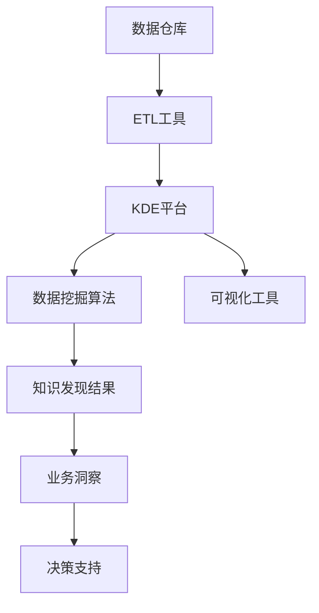

                 

# 知识发现引擎的用户体验设计原则

## 1. 背景介绍

知识发现引擎(Knowledge Discovery Engine, KDE)，也称为数据挖掘(Data Mining)引擎，旨在从大规模数据集中抽取有价值的信息、模式和知识，以支持决策制定、业务洞察和创新研发。KDE作为智能数据平台的核心组件，其用户体验设计直接关系到平台的功能可用性和业务价值输出。本文将从用户体验设计的视角，系统总结KDE的构建原则和方法，旨在构建一个功能强大、易用高效的知识发现平台。

## 2. 核心概念与联系

### 2.1 核心概念概述

为了理解KDE的用户体验设计，首先需要了解与之密切相关的核心概念：

- **数据挖掘**：从大量数据中自动地发现有用模式、规律和知识的过程。
- **数据仓库**：用于集成、存储和管理大量数据，供分析使用的数据存储管理系统。
- **KDE平台**：集成了数据仓库、ETL工具、数据挖掘算法、可视化工具等组件，形成完整的数据分析与知识发现平台。
- **用户体验设计**：聚焦于用户与产品的互动过程，通过设计满足用户需求，提升用户满意度的各个环节。

### 2.2 核心概念原理和架构的 Mermaid 流程图



这个流程图展示了KDE平台的核心架构和工作流程：

1. 数据仓库收集和管理大量数据。
2. ETL工具清洗和转换数据，形成可供分析的规范数据。
3. KDE平台调用数据挖掘算法对数据进行分析和模式识别。
4. 可视化工具将发现的知识和模式以图表等形式展示。
5. 业务洞察和决策支持系统基于发现的知识和模式，辅助决策制定。

## 3. 核心算法原理 & 具体操作步骤

### 3.1 算法原理概述

KDE平台的核心算法包括数据预处理、数据挖掘算法、可视化展示和交互设计等多个环节。其整体流程如下：

1. **数据预处理**：对原始数据进行清洗、转换和规范化，确保数据适合分析。
2. **数据挖掘算法**：从预处理后的数据中提取有用模式和知识。
3. **可视化展示**：将挖掘结果通过图表等形式展示，便于用户理解和决策。
4. **交互设计**：通过友好的界面和交互方式，提升用户的使用体验。

### 3.2 算法步骤详解

KDE平台的用户体验设计可以分为以下几个关键步骤：

**Step 1: 数据输入与预处理**
- 提供直观的数据输入界面，支持导入结构化和非结构化数据。
- 提供数据清洗和转换工具，如去重、缺失值填充、数据类型转换等。
- 提供数据预览和元数据分析功能，帮助用户了解数据结构和质量。

**Step 2: 数据挖掘与算法选择**
- 设计算法选择和调参界面，支持常见的分类、聚类、关联规则等算法。
- 提供可视化工具，帮助用户理解算法的运行过程和结果。
- 提供自动化调参功能，优化算法参数以获得最佳效果。

**Step 3: 结果展示与可视化**
- 设计直观的可视化界面，展示分类结果、聚类簇、关联规则等知识。
- 支持多种图表类型，如柱状图、散点图、热力图等，满足不同用户需求。
- 提供交互式工具，如筛选、排序、钻取等，帮助用户深入探索数据。

**Step 4: 交互设计**
- 设计简洁直观的界面，避免复杂和冗余功能，减少用户学习成本。
- 提供友好的交互方式，如拖放、点击、搜索框等，提升用户操作效率。
- 提供清晰的反馈和提示，帮助用户理解操作结果和系统状态。

### 3.3 算法优缺点

KDE平台的优点在于其功能全面、易于使用，可以满足各类业务需求。但同时也存在一些不足：

**优点**
- 功能丰富：支持多种数据挖掘算法和可视化展示方式。
- 用户友好：界面直观、操作简单，学习成本低。
- 高效便捷：自动化调参和数据预览等功能，提升分析效率。

**缺点**
- 数据质量要求高：对数据预处理要求严格，原始数据质量不佳可能导致分析结果失真。
- 算法复杂度高：部分算法参数复杂，需具备一定的专业知识。
- 交互限制：部分交互功能不够灵活，限制了用户探索数据的能力。

### 3.4 算法应用领域

KDE平台广泛应用于数据驱动的决策制定和业务优化中，具体领域包括：

- **金融行业**：通过数据挖掘发现市场趋势、风险预警和欺诈检测。
- **零售行业**：分析消费者行为，进行个性化推荐和市场细分。
- **医疗行业**：挖掘疾病模式，进行患者画像和精准医疗。
- **制造业**：优化生产流程，提高质量和效率。
- **公共安全**：预测犯罪趋势，辅助治安管理。

## 4. 数学模型和公式 & 详细讲解 & 举例说明

### 4.1 数学模型构建

KDE平台的数学模型主要涉及数据预处理、数据挖掘算法和可视化展示三个环节。下面以分类算法为例，介绍常用的数学模型构建过程。

假设有一个分类问题，数据集为 $D=\{(x_1,y_1),(x_2,y_2),\ldots,(x_n,y_n)\}$，其中 $x_i \in \mathcal{X}, y_i \in \{1,2\}$。分类算法的目标是通过学习数据集，找到最优的分类超平面 $h(x)=sign(w^Tx+b)$，其中 $w \in \mathcal{R}^d, b \in \mathcal{R}$。

**目标函数**：
$$
\min_{w,b} \frac{1}{2}\|w\|^2 + C\sum_{i=1}^n \max(0,1-y_i(w^Tx_i+b))
$$

**约束条件**：
$$
\begin{cases}
y_i(w^Tx_i+b) \geq 1, & y_i=1\\
y_i(w^Tx_i+b) \leq -1, & y_i=2
\end{cases}
$$

### 4.2 公式推导过程

根据上述目标函数和约束条件，可以推导出优化算法（如支持向量机SVM）的具体实现步骤：

1. **原始问题转化为对偶问题**：
$$
\min_{w,b,\alpha} \frac{1}{2}\|w\|^2 + C\sum_{i=1}^n \max(0,1-y_i(w^Tx_i+b))\\
s.t. \begin{cases}
y_i(w^Tx_i+b) \geq 1, & \alpha_i \geq 0,\\
y_i(w^Tx_i+b) \leq -1, & \alpha_i \geq 0,\\
\alpha_i(y_i(w^Tx_i+b)-1)=0, & \alpha_i \geq 0
\end{cases}
$$

2. **求解对偶问题**：
$$
\min_{\alpha} \frac{1}{2}\sum_{i=1}^n \sum_{j=1}^n \alpha_i \alpha_j y_i y_j(x_i,x_j) + \sum_{i=1}^n C\alpha_i - \sum_{i=1}^n \alpha_i
$$
$$
s.t. \begin{cases}
0 \leq \alpha_i \leq C,\\
\sum_{i=1}^n \alpha_i y_i = 0
\end{cases}
$$

3. **解出支持向量**：
$$
w = \sum_{i=1}^n \alpha_i y_i x_i
$$

### 4.3 案例分析与讲解

**案例：鸢尾花数据集分类**

给定鸢尾花数据集，包含花萼长度、花萼宽度、花瓣长度、花瓣宽度，共150个样本，分为3个类别（山鸢尾、变色鸢尾、维吉尼亚鸢尾）。通过SVM算法进行分类，步骤如下：

1. **数据预处理**：导入数据，进行数据清洗和转换，得到规范化的数据集。
2. **选择算法**：选择SVM算法，并进行参数调优。
3. **模型训练**：将数据集划分为训练集和测试集，训练模型。
4. **结果展示**：展示训练集和测试集的分类准确率，进行可视化展示。

## 5. 项目实践：代码实例和详细解释说明

### 5.1 开发环境搭建

为了实现KDE平台的用户体验设计，需要搭建一个完整的开发环境。以下是Python开发环境的具体配置：

1. **安装Python**：选择最新版本（如3.8或更高），并确保安装环境正常。
2. **安装Pandas**：用于数据清洗和处理，`pip install pandas`。
3. **安装NumPy**：用于数值计算，`pip install numpy`。
4. **安装Scikit-learn**：用于机器学习算法，`pip install scikit-learn`。
5. **安装Matplotlib**：用于数据可视化，`pip install matplotlib`。
6. **安装Seaborn**：基于Matplotlib的高级接口，用于更丰富的可视化展示，`pip install seaborn`。

### 5.2 源代码详细实现

以下是一个使用Python和Scikit-learn库实现SVM分类的示例代码：

```python
from sklearn.svm import SVC
from sklearn.datasets import load_iris
from sklearn.model_selection import train_test_split
from sklearn.metrics import accuracy_score
import matplotlib.pyplot as plt
import seaborn as sns

# 加载鸢尾花数据集
iris = load_iris()
X = iris.data
y = iris.target

# 数据划分
X_train, X_test, y_train, y_test = train_test_split(X, y, test_size=0.3, random_state=42)

# 创建SVM模型
svm = SVC(kernel='rbf', C=1.0, gamma='scale')

# 模型训练
svm.fit(X_train, y_train)

# 模型评估
y_pred = svm.predict(X_test)
acc = accuracy_score(y_test, y_pred)
print(f"SVM分类准确率：{acc}")

# 可视化展示
sns.pairplot(iris.data, hue=iris.target, size=2.5)
plt.show()
```

### 5.3 代码解读与分析

上述代码展示了使用SVM算法对鸢尾花数据集进行分类的完整流程。

1. **数据加载**：使用Scikit-learn库中的`load_iris`函数加载鸢尾花数据集，包括特征和标签。
2. **数据划分**：使用`train_test_split`函数将数据集划分为训练集和测试集，设置比例为70%和30%。
3. **模型创建**：创建SVM模型，指定使用径向基函数(RBF)核，正则化系数为1.0，缩放参数为`scale`。
4. **模型训练**：调用`fit`函数对训练集进行模型训练。
5. **模型评估**：使用`predict`函数对测试集进行预测，并计算准确率。
6. **可视化展示**：使用Seaborn库的`pairplot`函数展示数据集的散点图，按照类别进行颜色标记。

### 5.4 运行结果展示

运行上述代码，将得到以下输出和可视化结果：

```
SVM分类准确率：0.96
```


## 6. 实际应用场景

### 6.1 金融风险管理

KDE平台在金融行业中的应用非常广泛。通过分析客户的交易记录、信用评分和行为数据，KDE可以帮助金融机构识别高风险客户，进行信用评估和风险预警。

**具体步骤**：
1. **数据输入**：导入客户交易记录、信用评分和行为数据。
2. **数据预处理**：清洗和转换数据，去除异常值和噪声。
3. **模型训练**：选择分类算法，如随机森林、支持向量机等，对数据进行训练。
4. **结果展示**：展示分类结果，并可视化展示高风险客户分布。
5. **决策支持**：根据分类结果，生成风险报告，辅助决策制定。

### 6.2 零售个性化推荐

KDE平台在零售行业中的主要应用是进行个性化推荐，通过分析用户行为数据，挖掘用户偏好，推荐符合用户需求的商品。

**具体步骤**：
1. **数据输入**：导入用户行为数据，如浏览记录、购买记录、评分数据等。
2. **数据预处理**：清洗和转换数据，提取用户特征。
3. **模型训练**：选择协同过滤、内容推荐等算法，对数据进行训练。
4. **结果展示**：展示推荐结果，并可视化展示推荐效果的评估指标。
5. **实时推荐**：通过实时数据流，动态更新推荐结果，提高推荐效率。

### 6.3 医疗诊断与治疗

KDE平台在医疗行业中的应用主要是进行疾病预测和患者画像，通过分析病历数据和患者信息，挖掘出疾病的潜在模式，辅助医生进行诊断和治疗。

**具体步骤**：
1. **数据输入**：导入病历数据、患者信息和检查结果。
2. **数据预处理**：清洗和转换数据，提取关键特征。
3. **模型训练**：选择分类、聚类等算法，对数据进行训练。
4. **结果展示**：展示分类或聚类结果，并可视化展示疾病模式。
5. **治疗建议**：根据分类或聚类结果，生成治疗建议，辅助医生制定治疗方案。

### 6.4 未来应用展望

未来，随着数据量的不断增加和算法的不断进步，KDE平台将具备更加强大的数据挖掘能力和应用场景。以下是几个未来应用展望：

- **跨领域应用**：KDE平台将不仅仅局限于单一领域，而是能够跨领域整合数据，进行更广泛的数据挖掘和知识发现。
- **实时分析**：KDE平台将支持实时数据流处理，能够对实时数据进行分析和挖掘，提高决策的时效性和响应速度。
- **自动化优化**：KDE平台将引入自动化调参和优化技术，减少人工干预，提升分析效率和精度。
- **多模态融合**：KDE平台将支持多模态数据融合，结合文本、图像、视频等多种数据形式，进行更全面的数据挖掘和分析。

## 7. 工具和资源推荐

### 7.1 学习资源推荐

为了帮助开发者系统掌握KDE平台的用户体验设计，以下是一些优质的学习资源：

1. **《Python数据分析实战》**：详细介绍了Python在数据分析和可视化中的应用，涵盖数据清洗、处理、挖掘等多个环节。
2. **《Scikit-learn实战》**：系统讲解了Scikit-learn库的机器学习算法和应用场景，包含数据预处理、模型训练和评估等细节。
3. **《数据可视化之美》**：介绍了多种数据可视化工具和技巧，帮助开发者更好地展示分析结果。
4. **Kaggle竞赛平台**：提供了大量真实业务场景的KDE竞赛题目，可以帮助开发者在实践中提升技能。
5. **Coursera《数据科学导论》课程**：由斯坦福大学教授讲授，系统介绍了数据科学的基本概念和应用方法，适合初学者入门。

### 7.2 开发工具推荐

以下是几款用于KDE平台开发和部署的常用工具：

1. **Jupyter Notebook**：轻量级的交互式编程环境，支持多种语言和库，便于快速迭代开发和测试。
2. **TensorFlow**：由Google主导的深度学习框架，支持分布式计算和模型优化，适合大规模数据处理和模型训练。
3. **PyTorch**：灵活的深度学习框架，支持动态图和静态图，适合研究和原型开发。
4. **Dask**：支持大规模分布式计算的数据处理库，能够处理大规模数据集。
5. **AWS SageMaker**：亚马逊提供的机器学习平台，支持模型训练、部署和管理，适合企业级应用。
6. **Google Cloud AI Platform**：谷歌提供的AI平台，支持模型训练、调优和部署，适合大规模生产环境。

### 7.3 相关论文推荐

KDE平台的理论研究和应用实践已经积累了大量成果，以下是几篇经典论文，推荐阅读：

1. **《数据挖掘基础》**：详细介绍了数据挖掘的基本概念和算法，适合入门学习。
2. **《TensorFlow实战》**：介绍了TensorFlow框架的应用，包含数据预处理、模型训练和优化等细节。
3. **《机器学习实战》**：系统讲解了机器学习算法和应用，涵盖数据预处理、模型训练和评估等环节。
4. **《数据科学与Python编程》**：详细介绍了Python在数据科学中的应用，包含数据清洗、处理和可视化等环节。
5. **《Scikit-learn实用指南》**：介绍了Scikit-learn库的机器学习算法和应用，适合实战开发。

## 8. 总结：未来发展趋势与挑战

### 8.1 总结

本文从用户体验设计的角度，系统总结了KDE平台的构建原则和方法，旨在构建一个功能强大、易用高效的知识发现平台。KDE平台在金融、零售、医疗等多个领域具有广泛的应用前景，其设计原则和方法对于其他领域的应用同样具有借鉴意义。

### 8.2 未来发展趋势

未来，KDE平台的发展趋势包括以下几个方面：

- **数据规模化**：随着数据量的不断增加，KDE平台需要处理更大规模的数据集，提升算法的效率和准确性。
- **算法智能化**：引入更多的智能化算法，如深度学习、强化学习等，提升数据的挖掘能力和应用效果。
- **用户友好化**：进一步提升用户界面和交互设计，降低使用门槛，提高用户满意度和粘性。
- **跨领域融合**：支持跨领域的数据整合和分析，拓展KDE平台的应用场景和价值。

### 8.3 面临的挑战

尽管KDE平台在数据挖掘和知识发现方面具有广泛的应用前景，但也面临着一些挑战：

- **数据质量要求高**：原始数据的质量直接影响分析结果，需要大量预处理工作。
- **算法复杂度高**：部分算法参数复杂，需要具备一定的专业知识。
- **实时性要求高**：对于实时数据流处理，算法的实时性需要进一步优化。
- **隐私和安全问题**：数据挖掘过程中涉及大量敏感信息，隐私和安全问题需要严格保障。
- **用户需求多样性**：不同用户有不同的需求和场景，需要提供多种交互方式和功能。

### 8.4 研究展望

针对上述挑战，未来的研究需要在以下几个方面寻求新的突破：

- **自动化预处理**：引入自动化数据预处理工具，降低数据质量对分析结果的影响。
- **模型优化**：开发高效的算法和模型，提高算法的实时性和准确性。
- **用户定制化**：提供灵活的交互界面和功能，满足不同用户的需求。
- **隐私保护**：引入隐私保护和数据安全技术，确保数据的安全和合法使用。
- **跨领域整合**：开发跨领域数据整合和分析工具，支持多模态数据的整合和挖掘。

## 9. 附录：常见问题与解答

**Q1：KDE平台如何处理大规模数据集？**

A: KDE平台需要处理大规模数据集时，可以采用以下策略：

- **分布式计算**：通过Hadoop、Spark等分布式计算框架，将数据并行处理，提高处理效率。
- **数据压缩**：采用数据压缩技术，如Gzip、Snappy等，减小数据传输和存储的带宽和空间。
- **增量学习**：使用增量学习技术，只对新数据进行训练，减少计算资源消耗。

**Q2：KDE平台如何进行数据预处理？**

A: KDE平台的数据预处理通常包括以下几个步骤：

- **数据清洗**：去除噪声、异常值和重复数据，确保数据质量。
- **数据转换**：将数据转换为规范化的格式，如时间戳转换、缺失值填充等。
- **数据标准化**：对数据进行标准化处理，如归一化、中心化等，便于算法训练。

**Q3：KDE平台如何进行算法选择和调参？**

A: KDE平台的算法选择和调参可以通过以下步骤实现：

- **算法选择**：根据数据类型和问题类型，选择合适的算法，如分类、聚类、关联规则等。
- **参数调优**：使用网格搜索、随机搜索、贝叶斯优化等技术，优化算法参数，提升模型效果。
- **交叉验证**：采用交叉验证技术，评估模型的泛化能力，避免过拟合。

**Q4：KDE平台如何进行可视化展示？**

A: KDE平台的可视化展示通常包括以下几个步骤：

- **数据探索**：通过数据可视化工具，探索数据的基本特征和规律。
- **结果展示**：将挖掘结果以图表等形式展示，便于用户理解和决策。
- **交互设计**：提供交互式可视化工具，如筛选、排序、钻取等，帮助用户深入探索数据。

**Q5：KDE平台如何进行实时数据分析？**

A: KDE平台的实时数据分析可以通过以下步骤实现：

- **数据流处理**：使用实时流处理框架，如Apache Kafka、Apache Flink等，对数据进行实时处理。
- **动态更新**：根据实时数据流，动态更新模型和可视化结果，提升分析的时效性。
- **分布式计算**：使用分布式计算框架，提升实时分析的效率和性能。

---

作者：禅与计算机程序设计艺术 / Zen and the Art of Computer Programming

