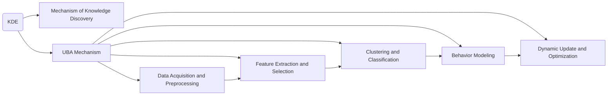

                 

# 知识发现引擎的用户行为分析

> 关键词：知识发现引擎, 用户行为分析, 机器学习, 数据挖掘, 聚类算法, 推荐系统, 客户细分

## 1. 背景介绍

### 1.1 问题由来
在当今数字化时代，知识发现引擎（Knowledge Discovery Engine, KDE）已成为各大企业信息化建设中的核心工具。无论是银行、电商、医疗、教育还是政府机构，都依靠数据驱动，通过数据洞察，促进业务决策、优化流程、提升客户体验等。然而，随着数据量的急剧增长和业务场景的不断复杂化，传统的知识发现方法逐渐显得力不从心。

首先，数据量和维度的爆炸式增长，使得传统的统计分析方法无法应对。其次，用户的个性化需求日益增加，对知识发现引擎提出了更高的要求，需要它能够进行精准的用户行为分析，个性化推荐，并提供深入的洞察，支持客户细分和业务决策。

知识发现引擎的用户行为分析（User Behavior Analysis, UBA）正是应对这一需求的解决方案。UBA通过对用户行为数据的深入挖掘，揭示用户需求、偏好和行为模式，为业务提供智能决策支持，是实现数据驱动、业务智能的关键技术之一。

### 1.2 问题核心关键点
知识发现引擎的用户行为分析主要涉及以下几个关键点：

1. **数据采集与预处理**：收集用户行为数据，并进行清洗、归一化等预处理，确保数据质量和可用性。
2. **特征提取与选择**：从原始数据中提取有意义的特征，选择对用户行为分析有重要影响的特征。
3. **聚类与分类**：利用聚类算法或分类算法，对用户进行分组或分类，揭示不同用户群体的行为特征。
4. **行为建模**：构建用户行为模型，预测用户未来的行为趋势，提供个性化推荐和业务优化建议。
5. **动态更新与优化**：根据新数据不断更新用户行为模型，优化模型性能，确保分析结果的实时性和准确性。

这些关键点共同构成了一个完整的用户行为分析框架，旨在通过数据驱动的方式，深入理解用户行为，优化业务决策。

### 1.3 问题研究意义
知识发现引擎的用户行为分析对于企业信息化建设具有重要的现实意义：

1. **提升用户体验**：通过分析用户行为，定制个性化的推荐内容，提高用户满意度，增加用户黏性。
2. **优化业务流程**：揭示用户行为模式，发现业务瓶颈和改进点，优化流程效率，降低运营成本。
3. **促进业务决策**：提供深入的数据洞察，辅助管理层制定精准的业务策略，提升决策效果。
4. **增强竞争力**：基于用户行为分析，提升产品和服务质量，增强市场竞争力。
5. **数据安全与隐私保护**：在分析过程中，严格遵守数据隐私和保护法规，确保用户数据安全。

## 2. 核心概念与联系

### 2.1 核心概念概述

为更好地理解知识发现引擎的用户行为分析，本节将介绍几个关键概念：

- **知识发现引擎(KDE)**：一种利用机器学习、数据挖掘等技术，从大规模数据中自动发现模式、规则和知识的工具。KDE广泛应用于市场分析、客户细分、客户关系管理等领域。

- **用户行为分析(UBA)**：通过对用户行为数据的分析，揭示用户需求、偏好和行为模式，为业务决策提供智能支持。UBA是实现数据驱动、业务智能的关键技术。

- **机器学习**：一种通过数据驱动，自动学习和改进算法模型的方法。机器学习是实现用户行为分析的重要手段。

- **数据挖掘**：从大规模数据集中挖掘出有价值的模式和规律。数据挖掘技术在用户行为分析中具有广泛应用。

- **聚类算法**：一种无监督学习方法，将相似的数据点分为同一类，揭示数据中的自然分组。聚类算法是用户行为分析的重要工具。

- **分类算法**：一种监督学习方法，将数据点分为预设的类别，用于分类和预测。分类算法在用户行为分析中用于识别用户群体和行为模式。

- **推荐系统**：利用用户行为数据，提供个性化推荐内容的系统。推荐系统是用户行为分析的重要应用。

- **客户细分**：将用户分为不同的群体，便于针对不同群体制定个性化策略。客户细分是用户行为分析的关键应用之一。

这些概念之间存在密切联系，共同构成了知识发现引擎的用户行为分析框架。通过理解这些概念，我们可以更好地把握用户行为分析的原理和应用。

### 2.2 核心概念原理和架构的 Mermaid 流程图



这个流程图展示了知识发现引擎的用户行为分析的总体框架，从数据采集与预处理开始，经过特征提取与选择、聚类与分类、行为建模，最后进行动态更新与优化。这些环节相互联系，形成一个闭环，确保分析结果的准确性和实时性。

## 3. 核心算法原理 & 具体操作步骤

### 3.1 算法原理概述

知识发现引擎的用户行为分析主要基于机器学习和数据挖掘技术，通过以下几个步骤实现：

1. **数据采集与预处理**：收集用户行为数据，进行清洗、归一化等预处理，确保数据质量和可用性。
2. **特征提取与选择**：从原始数据中提取有意义的特征，选择对用户行为分析有重要影响的特征。
3. **聚类与分类**：利用聚类算法或分类算法，对用户进行分组或分类，揭示不同用户群体的行为特征。
4. **行为建模**：构建用户行为模型，预测用户未来的行为趋势，提供个性化推荐和业务优化建议。
5. **动态更新与优化**：根据新数据不断更新用户行为模型，优化模型性能，确保分析结果的实时性和准确性。

### 3.2 算法步骤详解

#### 步骤1：数据采集与预处理

**数据采集**：

用户行为数据通常包括点击记录、浏览记录、购买记录、评价记录等。数据源可以是电商平台、社交媒体、搜索引擎、金融系统等。数据采集的方式可以是API接口、日志文件、爬虫等。

**数据预处理**：

1. **数据清洗**：去除噪音数据、缺失值和异常值。
2. **数据归一化**：对数据进行标准化处理，使其在相同的尺度上。
3. **特征提取**：从原始数据中提取有意义的特征，如点击次数、浏览时长、购买金额等。
4. **特征选择**：选择对用户行为分析有重要影响的特征，去除冗余和无关特征。

#### 步骤2：特征提取与选择

**特征提取**：

- **数值型特征**：如浏览时间、点击次数、购买金额等。
- **离散型特征**：如用户ID、商品ID、地区ID等。
- **文本型特征**：如商品描述、用户评价等。

**特征选择**：

1. **信息增益**：选择信息增益高的特征，去除信息增益低的特征。
2. **卡方检验**：选择与目标变量（如购买行为）相关的特征。
3. **主成分分析**：通过降维技术，选择对目标变量影响较大的特征。

#### 步骤3：聚类与分类

**聚类算法**：

- **K-means算法**：基于距离测量的聚类算法，适用于数据分布比较均匀的情况。
- **层次聚类算法**：通过层次合并，构建聚类树，适用于数据分布比较复杂的情况。
- **DBSCAN算法**：基于密度的聚类算法，适用于发现任意形状的簇。

**分类算法**：

- **决策树**：通过树形结构进行决策，易于理解和解释。
- **随机森林**：基于决策树的集成算法，具有较高的准确性和鲁棒性。
- **支持向量机**：通过在高维空间中分割数据点，实现分类。
- **神经网络**：利用多层神经网络进行分类，适用于复杂的非线性分类问题。

#### 步骤4：行为建模

**行为模型构建**：

- **时间序列模型**：如ARIMA模型、LSTM模型等，适用于预测用户行为随时间变化的趋势。
- **关联规则模型**：如Apriori算法、FP-growth算法等，适用于发现用户行为之间的关联关系。
- **协同过滤模型**：如基于用户的协同过滤、基于项目的协同过滤等，适用于推荐系统。
- **混合模型**：通过多种模型的组合，实现更精准的行为预测和推荐。

**行为模型评估**：

- **交叉验证**：将数据分为训练集和测试集，进行模型评估。
- **准确率、召回率、F1值**：用于评估分类模型的性能。
- **均方误差、均方根误差**：用于评估回归模型的性能。
- **AUC、ROC曲线**：用于评估排序模型的性能。

#### 步骤5：动态更新与优化

**动态更新**：

1. **增量学习**：在已有模型基础上，利用新数据不断更新模型参数，减少重新训练的成本。
2. **在线学习**：实时更新模型参数，处理新数据。
3. **迁移学习**：利用已有的模型知识，在新任务上进行微调，提高模型泛化能力。

**优化策略**：

1. **超参数调优**：通过网格搜索、贝叶斯优化等方法，寻找最优的超参数组合。
2. **模型融合**：通过集成多个模型的预测结果，提高模型的准确性和鲁棒性。
3. **模型剪枝**：去除冗余和低效的特征和参数，提高模型的运行效率。
4. **分布式训练**：利用多台机器并行训练，提高训练速度。

### 3.3 算法优缺点

**优点**：

1. **自动化程度高**：自动从数据中挖掘出有价值的模式和规律，减少人工干预。
2. **可扩展性强**：能够处理大规模数据集，支持实时数据分析和预测。
3. **灵活性高**：适用于多种业务场景，如客户细分、推荐系统、市场分析等。

**缺点**：

1. **数据质量要求高**：数据采集和预处理需要耗费大量时间和精力，数据质量直接影响分析结果。
2. **模型复杂度高**：构建和优化复杂的模型需要较高的技术门槛。
3. **隐私保护难度大**：在分析过程中，需要严格遵守数据隐私和保护法规，确保用户数据安全。

### 3.4 算法应用领域

知识发现引擎的用户行为分析在多个领域有广泛应用，如：

- **电商**：分析用户购买行为，进行个性化推荐和营销策略优化。
- **金融**：分析用户交易行为，进行风险评估和欺诈检测。
- **医疗**：分析患者诊疗行为，进行疾病预测和个性化治疗方案设计。
- **教育**：分析学生学习行为，进行个性化教学和课程推荐。
- **社交**：分析用户社交行为，进行内容推荐和社区管理。

以上领域只是知识发现引擎用户行为分析的一部分应用场景，随着技术的不断发展，将在更多领域得到应用。

## 4. 数学模型和公式 & 详细讲解  
### 4.1 数学模型构建

**用户行为分析的数学模型**：

用户行为分析的数学模型通常包括特征提取、聚类和分类等多个子模型。以下以聚类和分类模型为例进行详细讲解。

#### 聚类模型

假设用户行为数据集为 $D = \{ (x_i, y_i) \}_{i=1}^n$，其中 $x_i$ 为特征向量， $y_i$ 为标签。聚类的目标是将数据集 $D$ 分为 $k$ 个簇，使得簇内数据相似度高，簇间数据差异大。

K-means算法的数学模型如下：

$$
\min_{C, \mu} \sum_{i=1}^n \min_{c_i \in [1, k]} || x_i - \mu_{c_i} ||^2
$$

其中，$C = \{ c_i \}_{i=1}^n$ 为每个数据点的簇编号，$\mu_{c_i}$ 为簇 $c_i$ 的质心，$|| \cdot ||$ 为欧几里得距离。

#### 分类模型

假设用户行为数据集为 $D = \{ (x_i, y_i) \}_{i=1}^n$，其中 $x_i$ 为特征向量，$y_i$ 为标签。分类的目标是将数据集 $D$ 分为两个类别，即 $y_i \in \{0, 1\}$。

逻辑回归模型的数学模型如下：

$$
\min_{w, b} -\frac{1}{n} \sum_{i=1}^n y_i \log \sigma(\langle w, x_i \rangle + b) + (1-y_i) \log (1-\sigma(\langle w, x_i \rangle + b))
$$

其中，$w$ 为权重向量，$b$ 为偏置项，$\sigma(\cdot)$ 为 sigmoid 函数，$\langle \cdot, \cdot \rangle$ 为内积运算。

### 4.2 公式推导过程

**聚类模型公式推导**：

K-means算法的公式推导过程如下：

1. **初始化**：随机选择 $k$ 个初始质心 $\mu_{c_i}$。
2. **簇分配**：对每个数据点 $x_i$，计算其到每个质心 $\mu_{c_i}$ 的距离，将其分配到最近的簇 $c_i$。
3. **更新质心**：对每个簇 $c_i$，计算其中所有数据点的平均值，更新质心 $\mu_{c_i}$。
4. **重复迭代**：重复步骤 2 和步骤 3，直到质心不再变化或达到预设的迭代次数。

**分类模型公式推导**：

逻辑回归模型的公式推导过程如下：

1. **损失函数**：定义逻辑回归的损失函数为：
$$
L(w, b) = -\frac{1}{n} \sum_{i=1}^n y_i \log \sigma(\langle w, x_i \rangle + b) + (1-y_i) \log (1-\sigma(\langle w, x_i \rangle + b))
$$
2. **梯度下降**：计算损失函数 $L(w, b)$ 对权重 $w$ 和偏置 $b$ 的梯度，进行梯度下降：
$$
\frac{\partial L(w, b)}{\partial w} = -\frac{1}{n} \sum_{i=1}^n (y_i - \sigma(\langle w, x_i \rangle + b)) x_i
$$
$$
\frac{\partial L(w, b)}{\partial b} = -\frac{1}{n} \sum_{i=1}^n (y_i - \sigma(\langle w, x_i \rangle + b))
$$

### 4.3 案例分析与讲解

**电商推荐系统**：

电商推荐系统是一个典型的用户行为分析应用场景。电商平台通过分析用户的历史浏览、购买和评价数据，为用户推荐可能感兴趣的商品。

推荐系统的核心算法包括协同过滤、基于内容的推荐、混合推荐等。协同过滤算法利用用户-商品评分矩阵，发现相似用户或相似商品，为用户推荐相关商品。基于内容的推荐算法利用商品属性，对相似用户推荐相关商品。混合推荐算法将多种推荐算法结合，提升推荐效果。

推荐系统的评价指标包括准确率、召回率、F1值、覆盖率等。通过优化推荐算法和模型，可以提高推荐效果，提升用户体验。

**金融欺诈检测**：

金融欺诈检测是一个典型的分类任务。银行和金融机构利用用户的交易记录和行为数据，检测和预防欺诈行为。

在欺诈检测中，利用分类算法如逻辑回归、决策树、随机森林等，构建欺诈检测模型。模型输入包括交易金额、交易时间、交易地点、交易频率等特征。模型输出为二分类结果，即交易是否为欺诈。

通过优化模型和特征，提高欺诈检测的准确率，减少误报和漏报，提升金融系统的安全性和稳定性。

## 5. 项目实践：代码实例和详细解释说明

### 5.1 开发环境搭建

用户行为分析项目的开发环境搭建主要涉及以下几个步骤：

1. **安装Python环境**：使用Anaconda创建Python环境，安装所需的Python库。
2. **安装相关库**：安装Pandas、NumPy、Scikit-learn、TensorFlow等库。
3. **设置数据路径**：配置数据存储路径，方便数据读取。
4. **配置服务器**：配置服务器环境，用于存储和处理大规模数据。

以下是一个简单的Python环境搭建示例：

```bash
conda create -n ubuntu-env python=3.7
conda activate ubuntu-env
pip install pandas numpy scikit-learn tensorflow
```

### 5.2 源代码详细实现

以下是一个简单的用户行为分析项目的代码实现，包括数据采集、特征提取、聚类和分类：

```python
import pandas as pd
from sklearn.cluster import KMeans
from sklearn.ensemble import RandomForestClassifier
from sklearn.metrics import accuracy_score

# 数据采集
data = pd.read_csv('user_behavior.csv')

# 特征提取
data = data.drop(['user_id', 'time'], axis=1)
data['feature1'] = data['click_times'] / data['total_times']
data['feature2'] = data['purchase_amount'] / data['total_amount']
data['feature3'] = data['spend_ratio'] / data['total_spend']

# 聚类
kmeans = KMeans(n_clusters=3)
kmeans.fit(data[['feature1', 'feature2', 'feature3']])
data['cluster'] = kmeans.predict(data[['feature1', 'feature2', 'feature3']])

# 分类
clf = RandomForestClassifier()
clf.fit(data[['feature1', 'feature2', 'feature3']], data['label'])
predictions = clf.predict(data[['feature1', 'feature2', 'feature3']])

# 评估
accuracy = accuracy_score(data['label'], predictions)
print('Accuracy:', accuracy)
```

### 5.3 代码解读与分析

**数据采集**：

使用Pandas库读取用户行为数据，包括用户ID、时间、点击次数、浏览时间、购买金额等。

**特征提取**：

对原始数据进行归一化和特征提取，计算点击次数、购买金额、消费比例等特征，用于聚类和分类。

**聚类**：

使用K-means算法对用户进行聚类，将用户分为3个簇。

**分类**：

使用随机森林算法对用户进行分类，预测用户的购买行为。

**评估**：

计算分类模型的准确率，评估模型性能。

## 6. 实际应用场景

### 6.1 智能推荐系统

智能推荐系统是用户行为分析的重要应用场景。通过分析用户的历史行为数据，推荐系统可以为用户推荐可能感兴趣的商品、内容、服务等。推荐系统的核心算法包括协同过滤、基于内容的推荐、混合推荐等。推荐系统的成功关键在于用户行为数据的精准分析和模型性能的优化。

**电商推荐系统**：

电商平台通过分析用户的历史浏览、购买和评价数据，为用户推荐可能感兴趣的商品。推荐系统的核心算法包括协同过滤、基于内容的推荐、混合推荐等。协同过滤算法利用用户-商品评分矩阵，发现相似用户或相似商品，为用户推荐相关商品。基于内容的推荐算法利用商品属性，对相似用户推荐相关商品。混合推荐算法将多种推荐算法结合，提升推荐效果。

**内容推荐系统**：

内容推荐系统利用用户的历史浏览、点赞、评论等行为数据，为用户推荐可能感兴趣的文章、视频、音乐等内容。系统通过分析用户的阅读偏好、兴趣标签，为用户推荐相关内容。

**服务推荐系统**：

服务推荐系统利用用户的地理位置、时间、天气等数据，为用户推荐可能感兴趣的服务，如旅游、餐饮、酒店等。系统通过分析用户的出行偏好、消费习惯，为用户推荐相关服务。

### 6.2 金融欺诈检测

金融欺诈检测是用户行为分析在金融领域的重要应用。银行和金融机构利用用户的交易记录和行为数据，检测和预防欺诈行为。

在欺诈检测中，利用分类算法如逻辑回归、决策树、随机森林等，构建欺诈检测模型。模型输入包括交易金额、交易时间、交易地点、交易频率等特征。模型输出为二分类结果，即交易是否为欺诈。

通过优化模型和特征，提高欺诈检测的准确率，减少误报和漏报，提升金融系统的安全性和稳定性。

### 6.3 医疗健康监测

医疗健康监测是用户行为分析在医疗领域的重要应用。医疗机构利用用户的健康数据，进行疾病预测、个性化治疗方案设计等。

在健康监测中，利用聚类算法和分类算法，分析用户的健康行为和数据，发现异常行为和疾病风险。系统通过分析用户的运动、饮食、睡眠等数据，预测用户的健康状况，提供个性化治疗方案和健康建议。

### 6.4 教育学习辅助

教育学习辅助是用户行为分析在教育领域的重要应用。教育机构利用学生的学习数据，进行个性化教学和课程推荐。

在学习辅助中，利用聚类算法和分类算法，分析学生的学习行为和数据，发现学习问题和行为模式。系统通过分析学生的作业、测试、学习时长等数据，推荐相关课程和学习资源，提供个性化的学习建议。

## 7. 工具和资源推荐

### 7.1 学习资源推荐

为了帮助开发者系统掌握用户行为分析的理论基础和实践技巧，这里推荐一些优质的学习资源：

1. **《机器学习》课程**：斯坦福大学李飞飞教授的《机器学习》课程，涵盖机器学习的基础知识和经典算法，适合初学者。
2. **《Python数据科学手册》**：Python数据科学领域的经典书籍，涵盖Pandas、NumPy、Scikit-learn等库的使用，适合进阶学习。
3. **《数据挖掘导论》**：介绍数据挖掘基础理论和算法，涵盖聚类、分类、关联规则等方法，适合深入学习。
4. **《推荐系统实践》**：介绍推荐系统理论和算法，涵盖协同过滤、基于内容的推荐等方法，适合实践应用。
5. **Kaggle竞赛**：Kaggle是一个数据科学竞赛平台，提供大量的数据集和竞赛题目，适合实践应用和经验积累。

通过对这些资源的学习实践，相信你一定能够快速掌握用户行为分析的精髓，并用于解决实际的NLP问题。

### 7.2 开发工具推荐

高效的开发离不开优秀的工具支持。以下是几款用于用户行为分析开发的常用工具：

1. **Python**：Python是一种通用的编程语言，适合数据处理和分析，拥有丰富的数据科学和机器学习库。
2. **Jupyter Notebook**：Jupyter Notebook是一个交互式的编程环境，支持Python、R等多种编程语言，适合数据科学和机器学习研究。
3. **TensorFlow**：TensorFlow是一个开源的机器学习框架，支持分布式计算和深度学习模型构建，适合大规模数据处理。
4. **Scikit-learn**：Scikit-learn是一个开源的机器学习库，提供多种机器学习算法和工具，适合快速原型设计和模型评估。
5. **KMeans**：KMeans是Python的聚类算法库，支持多种聚类算法和参数调整。
6. **TensorBoard**：TensorBoard是TensorFlow的可视化工具，支持模型的训练、评估和部署。

合理利用这些工具，可以显著提升用户行为分析的开发效率，加快创新迭代的步伐。

### 7.3 相关论文推荐

用户行为分析领域的研究日益活跃，以下是几篇经典论文，推荐阅读：

1. **《Clustering of High Dimensional Data: A Review on the k-Means Algorithm》**：介绍K-means算法的基本原理和优缺点，适合入门学习。
2. **《Feature Engineering for Financial Fraud Detection》**：介绍金融欺诈检测的特征提取和模型构建方法，适合金融领域应用。
3. **《Customer Segmentation in Marketing》**：介绍客户分段的理论和方法，适合市场营销领域应用。
4. **《Personalized Recommendation Systems》**：介绍推荐系统的基础理论和算法，适合推荐系统开发。
5. **《Data Mining and Statistical Learning》**：介绍数据挖掘和机器学习的理论和方法，适合深入学习。

这些论文代表了大数据领域用户行为分析的研究方向，通过学习这些前沿成果，可以帮助研究者把握学科前进方向，激发更多的创新灵感。

## 8. 总结：未来发展趋势与挑战

### 8.1 研究成果总结

本文对知识发现引擎的用户行为分析进行了全面系统的介绍。首先阐述了用户行为分析的背景和意义，明确了其应用价值。其次，从原理到实践，详细讲解了用户行为分析的数学模型和操作步骤，给出了详细的代码实例。最后，介绍了用户行为分析在多个领域的应用场景，以及未来的发展趋势和挑战。

通过本文的系统梳理，可以看到，用户行为分析已经成为企业信息化建设中的核心技术之一，通过深入分析用户行为，能够提升用户体验、优化业务流程、支持决策制定，具有重要的现实意义。

### 8.2 未来发展趋势

用户行为分析的未来发展趋势主要包括以下几个方面：

1. **自动化程度提升**：自动化用户行为分析技术将逐渐成熟，减少人工干预，提高分析效率。
2. **数据融合与集成**：利用多种数据源进行融合与集成，提供更全面、准确的用户行为分析。
3. **多模态分析**：引入图像、音频等多模态数据，进行更全面、深入的用户行为分析。
4. **实时性增强**：通过流式计算和大数据技术，实现实时用户行为分析，提供即时的业务决策支持。
5. **隐私保护与安全性**：严格遵守数据隐私和保护法规，确保用户数据安全。

### 8.3 面临的挑战

用户行为分析在技术应用中也面临着诸多挑战：

1. **数据质量问题**：用户行为数据的采集和预处理需要耗费大量时间和精力，数据质量直接影响分析结果。
2. **模型复杂度问题**：构建和优化复杂的用户行为模型需要较高的技术门槛。
3. **隐私保护问题**：在分析过程中，需要严格遵守数据隐私和保护法规，确保用户数据安全。

### 8.4 研究展望

未来的研究需要在以下几个方面寻求新的突破：

1. **数据增强技术**：利用数据增强技术，提升用户行为数据的可用性和多样性。
2. **模型压缩技术**：通过模型压缩技术，减少模型规模和计算量，提升推理速度。
3. **多模态融合技术**：利用多模态融合技术，提升用户行为分析的准确性和鲁棒性。
4. **实时分析技术**：利用实时分析技术，实现用户行为分析的实时性。
5. **隐私保护技术**：利用隐私保护技术，确保用户数据的隐私和安全。

这些研究方向的探索，必将引领用户行为分析技术迈向更高的台阶，为构建安全、可靠、可解释、可控的智能系统铺平道路。面向未来，用户行为分析技术还需要与其他人工智能技术进行更深入的融合，如知识表示、因果推理、强化学习等，多路径协同发力，共同推动自然语言理解和智能交互系统的进步。只有勇于创新、敢于突破，才能不断拓展用户行为分析的边界，让智能技术更好地造福人类社会。

## 9. 附录：常见问题与解答

**Q1：用户行为分析中，如何处理数据质量问题？**

A: 数据质量问题在用户行为分析中是一个重要挑战。主要可以从以下几个方面进行处理：

1. **数据清洗**：去除噪音数据、缺失值和异常值。
2. **数据归一化**：对数据进行标准化处理，使其在相同的尺度上。
3. **数据增强**：利用数据增强技术，提高数据的多样性和可用性。
4. **异常检测**：使用异常检测技术，发现和处理异常数据。

**Q2：用户行为分析中，如何选择特征？**

A: 特征选择是用户行为分析中的重要环节，主要可以从以下几个方面进行选择：

1. **领域知识**：利用领域知识选择有意义的特征。
2. **信息增益**：选择信息增益高的特征，去除信息增益低的特征。
3. **卡方检验**：选择与目标变量相关的特征。
4. **主成分分析**：通过降维技术，选择对目标变量影响较大的特征。

**Q3：用户行为分析中，如何构建聚类模型？**

A: 聚类模型是用户行为分析中的重要工具，主要可以从以下几个方面进行构建：

1. **选择合适的聚类算法**：如K-means、层次聚类、DBSCAN等。
2. **设置聚类参数**：如聚类数目、迭代次数等。
3. **评估聚类效果**：如使用轮廓系数、Calinski-Harabasz指数等评估聚类效果。
4. **优化聚类模型**：通过多次迭代和优化，提高聚类效果。

**Q4：用户行为分析中，如何选择分类算法？**

A: 分类算法是用户行为分析中的重要工具，主要可以从以下几个方面进行选择：

1. **选择合适的分类算法**：如逻辑回归、决策树、随机森林等。
2. **设置分类参数**：如学习率、迭代次数等。
3. **评估分类效果**：如使用准确率、召回率、F1值等评估分类效果。
4. **优化分类模型**：通过多次迭代和优化，提高分类效果。

**Q5：用户行为分析中，如何构建推荐系统？**

A: 推荐系统是用户行为分析的重要应用，主要可以从以下几个方面进行构建：

1. **选择合适的推荐算法**：如协同过滤、基于内容的推荐、混合推荐等。
2. **设置推荐参数**：如推荐数目、相似度阈值等。
3. **评估推荐效果**：如使用准确率、召回率、F1值等评估推荐效果。
4. **优化推荐模型**：通过多次迭代和优化，提高推荐效果。

**Q6：用户行为分析中，如何保护用户隐私？**

A: 用户隐私保护是用户行为分析中的重要考虑因素，主要可以从以下几个方面进行保护：

1. **匿名化处理**：对用户数据进行匿名化处理，去除敏感信息。
2. **数据加密**：对用户数据进行加密处理，防止数据泄露。
3. **访问控制**：严格控制用户数据访问权限，确保数据安全。
4. **隐私政策**：制定隐私政策，确保用户知情权和选择权。

**Q7：用户行为分析中，如何提升模型的实时性？**

A: 提升模型的实时性是用户行为分析中的重要目标，主要可以从以下几个方面进行提升：

1. **实时数据处理**：利用实时数据处理技术，如流式计算、增量学习等。
2. **分布式计算**：利用分布式计算技术，提高数据处理和模型训练速度。
3. **模型压缩**：通过模型压缩技术，减少模型规模和计算量，提升推理速度。
4. **缓存技术**：利用缓存技术，减少数据读取和处理时间。

---

作者：禅与计算机程序设计艺术 / Zen and the Art of Computer Programming

