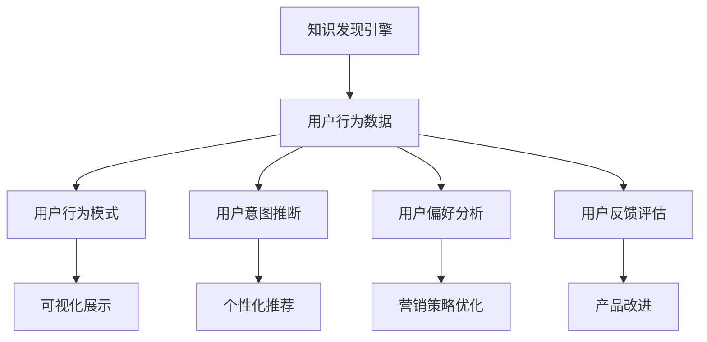

                 

# 知识发现引擎的用户行为分析

## 1. 背景介绍

### 1.1 问题由来

随着大数据时代的到来，企业需要从海量数据中提取出有价值的信息和知识，从而驱动业务决策和创新。知识发现（Knowledge Discovery in Databases，简称KDD）引擎正是为了满足这一需求而诞生的数据挖掘工具，能够从结构化和半结构化数据中自动提取知识，并提供可视化的结果，辅助用户进行科学决策。

知识发现引擎的核心价值在于，它能够自动化地分析数据，识别出数据中的模式、趋势和关联，从而为决策提供可靠的依据。然而，即便拥有先进的数据挖掘算法，用户行为分析和理解仍然是KDD过程中的重要一环。用户行为分析能够帮助企业更好地理解用户需求，优化产品和服务，提升用户体验，驱动业务增长。

### 1.2 问题核心关键点

知识发现引擎中的用户行为分析，是指通过分析用户与系统交互的日志数据，识别用户的行为模式、偏好、意图和反馈，以辅助进行个性化推荐、用户细分、营销策略优化等业务决策。

具体而言，用户行为分析的核心点包括：
- 用户行为模式识别：分析用户的行为序列，识别出典型的用户行为模式。
- 用户意图推断：根据用户的交互行为，推断其使用意图和需求。
- 用户偏好分析：识别用户对不同产品、服务、内容的偏好和兴趣。
- 用户反馈评估：收集用户的反馈和评价，评估产品和服务的质量。

这些核心点相互交织，共同构成了一个完整的用户行为分析系统。通过用户行为分析，知识发现引擎能够更好地理解用户需求，提供个性化的服务，优化业务流程，从而实现业务目标。

### 1.3 问题研究意义

用户行为分析在知识发现引擎中的应用，具有重要的理论和实践意义：

1. **提高决策效率**：通过自动化分析用户行为数据，快速识别关键模式和趋势，辅助决策者快速做出有效决策。
2. **增强用户体验**：深入理解用户需求和偏好，提供个性化推荐和服务，提升用户满意度和忠诚度。
3. **优化业务流程**：通过分析用户行为数据，优化产品设计、营销策略和客户服务，提升业务效率和竞争力。
4. **驱动创新发展**：挖掘用户行为中的新趋势和机会，引导企业创新，推动业务增长。

因此，深入研究用户行为分析方法，对于构建高效、智能的知识发现引擎，驱动企业业务创新和转型，具有重要的战略意义。

## 2. 核心概念与联系

### 2.1 核心概念概述

为了更好地理解用户行为分析的原理和架构，本节将介绍几个关键的概念：

- **知识发现引擎（KDD Engine）**：一种自动化的数据挖掘工具，能够从结构化和半结构化数据中提取有价值的知识和信息，并提供可视化的结果。
- **用户行为数据（User Behavior Data）**：用户在系统中与产品、服务交互的数据，包括点击、浏览、购买、反馈等行为记录。
- **用户行为模式（User Behavior Pattern）**：用户行为数据的统计规律，能够反映出用户的行为特征和趋势。
- **用户意图推断（User Intent Inference）**：根据用户的行为数据，推断用户的使用意图和需求。
- **用户偏好分析（User Preference Analysis）**：识别用户对不同产品、服务、内容的偏好和兴趣。
- **用户反馈评估（User Feedback Evaluation）**：收集和分析用户对产品、服务的反馈，评估其质量和改进方向。

这些概念之间的联系，可以通过以下Mermaid流程图来展示：



这个流程图展示了用户行为数据如何通过知识发现引擎中的各个模块，转化为对用户行为模式、用户意图、用户偏好和用户反馈的深入分析，并最终支持业务决策和创新。

## 3. 核心算法原理 & 具体操作步骤

### 3.1 算法原理概述

用户行为分析的核心算法，基于数据挖掘和机器学习技术，能够从用户行为数据中提取有用的模式、趋势和关联，辅助进行用户行为识别、意图推断、偏好分析等。

常用的算法包括：
- 聚类算法：用于识别用户行为模式和群体特征。
- 分类算法：用于推断用户意图和行为类别。
- 关联规则算法：用于分析用户行为中的关联关系和潜在价值。
- 回归分析算法：用于预测用户行为趋势和效果评估。

这些算法通常需要结合业务场景和数据特点进行灵活应用。例如，聚类算法可以用于用户细分和市场定位，分类算法可以用于用户意图预测和个性化推荐，回归分析可以用于用户行为趋势预测和效果评估。

### 3.2 算法步骤详解

用户行为分析的算法步骤主要包括以下几个关键环节：

1. **数据预处理**：清洗、筛选和转换用户行为数据，使其符合算法要求。包括数据去噪、缺失值处理、特征工程等。
2. **特征提取**：从用户行为数据中提取有用的特征，如点击次数、停留时间、浏览路径、购买金额等。
3. **模型训练**：选择合适的算法，如聚类、分类、关联规则等，在训练数据上训练模型。
4. **模型评估**：使用验证数据对训练好的模型进行评估，优化模型参数。
5. **结果分析**：对模型的输出结果进行分析和解读，提取关键模式和趋势。
6. **业务应用**：将分析结果转化为实际的业务策略和决策，如个性化推荐、用户细分、营销策略优化等。

### 3.3 算法优缺点

用户行为分析算法具有以下优点：
- **自动化**：自动化地从用户行为数据中提取有用的信息，减少人工干预。
- **精准性**：能够基于历史数据和算法模型，精准地推断用户意图和行为趋势。
- **实时性**：可以实时分析用户行为数据，快速响应用户需求和市场变化。

然而，用户行为分析算法也存在一些缺点：
- **数据依赖性**：算法的效果高度依赖于数据的完整性和质量，数据的偏差会导致算法结果的偏差。
- **复杂性**：不同算法需要不同的模型和参数，设计复杂的模型需要较长的训练和调优过程。
- **解释性不足**：一些复杂算法的决策过程难以解释，缺乏透明性和可解释性。

### 3.4 算法应用领域

用户行为分析算法广泛应用于知识发现引擎中的各个模块，例如：

- **个性化推荐**：通过分析用户行为数据，推断用户偏好和需求，提供个性化的商品、内容或服务推荐。
- **用户细分**：根据用户的行为模式和偏好，将用户分成不同的细分市场，进行针对性的营销和运营。
- **营销策略优化**：通过分析用户行为数据，优化营销渠道、活动和广告策略，提高营销效果。
- **客户服务优化**：通过分析用户反馈和行为数据，优化客户服务和支持策略，提升用户满意度。
- **风险管理**：通过分析用户行为数据，识别异常行为和潜在风险，进行风险预警和控制。

以上应用领域展示了用户行为分析算法的广泛适用性，在提升业务效率和效果方面具有重要价值。

## 4. 数学模型和公式 & 详细讲解 & 举例说明

### 4.1 数学模型构建

用户行为分析的数学模型构建，通常基于数据挖掘和机器学习技术，包括聚类、分类、关联规则等算法。这里以聚类算法为例，说明数学模型的构建过程。

假设用户行为数据集为 $D=\{x_i\}_{i=1}^N$，其中 $x_i$ 表示用户行为序列，如点击、浏览、购买等行为。聚类算法的目标是将数据集分成 $K$ 个类别，每个类别内包含相似的行为序列。

设聚类算法模型为 $M$，将 $D$ 映射到 $C=\{c_k\}_{k=1}^K$，其中 $c_k$ 表示第 $k$ 个聚类，包含一组相似的行为序列。

### 4.2 公式推导过程

常用的聚类算法有K-Means、层次聚类等。这里以K-Means算法为例，说明其数学公式的推导过程。

K-Means算法的目标是最小化聚类中心和数据点之间的距离平方和：

$$
J = \sum_{i=1}^N \min_k \| x_i - \mu_k \|^2
$$

其中 $\mu_k$ 表示第 $k$ 个聚类的中心点，$\| \cdot \|$ 表示欧式距离。

K-Means算法通过迭代更新聚类中心点 $\mu_k$ 来最小化目标函数 $J$。具体步骤如下：
1. 随机初始化 $K$ 个聚类中心点 $\mu_k$。
2. 对每个数据点 $x_i$，计算其与 $K$ 个聚类中心的距离，分配到距离最近的聚类 $c_i$。
3. 更新每个聚类的中心点 $\mu_k$ 为该聚类内所有数据点的均值。
4. 重复步骤2和3，直到聚类中心不再变化或达到预设迭代次数。

### 4.3 案例分析与讲解

以电商平台的用户行为数据为例，说明K-Means聚类算法在用户细分中的应用。

假设某电商平台收集了用户在不同商品类别下的点击、浏览和购买行为数据，记为 $D=\{x_i\}_{i=1}^N$，其中 $x_i$ 表示用户 $i$ 在不同商品类别下的行为序列。

应用K-Means算法对用户进行细分，假设分为两类：
- 第一类用户偏好消费家居用品，如沙发、灯具等。
- 第二类用户偏好消费服装和配饰，如衣服、鞋子等。

通过聚类分析，可以发现两类用户的行为模式和偏好存在显著差异，从而进行针对性的营销和运营策略。例如，对第一类用户推送家居用品的促销活动，对第二类用户推送服装配饰的优惠信息。

## 5. 项目实践：代码实例和详细解释说明

### 5.1 开发环境搭建

在进行用户行为分析的代码实现前，我们需要准备好开发环境。以下是使用Python进行K-Means聚类分析的环境配置流程：

1. 安装Anaconda：从官网下载并安装Anaconda，用于创建独立的Python环境。

2. 创建并激活虚拟环境：
```bash
conda create -n kmeans-env python=3.8 
conda activate kmeans-env
```

3. 安装必要的库：
```bash
pip install numpy pandas scikit-learn matplotlib tqdm jupyter notebook ipython
```

完成上述步骤后，即可在`kmeans-env`环境中开始代码实现。

### 5.2 源代码详细实现

这里以K-Means聚类算法为例，给出用户行为分析的PyTorch代码实现。

```python
import numpy as np
import pandas as pd
from sklearn.cluster import KMeans
from sklearn.preprocessing import StandardScaler
import matplotlib.pyplot as plt

# 假设数据集为csv文件，包含用户在不同商品类别下的行为数据
data = pd.read_csv('user_behavior_data.csv', index_col=0)

# 标准化数据
scaler = StandardScaler()
data_scaled = scaler.fit_transform(data)

# 应用K-Means聚类算法进行用户细分
kmeans = KMeans(n_clusters=2, random_state=0)
kmeans.fit(data_scaled)
labels = kmeans.predict(data_scaled)

# 可视化聚类结果
plt.figure(figsize=(8, 6))
plt.scatter(data_scaled[:, 0], data_scaled[:, 1], c=labels, s=50, cmap='viridis')
plt.title('User Behavior Clustering')
plt.xlabel('Click Count')
plt.ylabel('Browsing Time')
plt.show()
```

这段代码首先读取用户行为数据，对其进行标准化处理，然后应用K-Means聚类算法进行用户细分。最后，通过散点图可视化聚类结果，展示用户的行为模式和偏好。

### 5.3 代码解读与分析

这段代码实现了K-Means聚类算法的核心步骤：
1. **数据准备**：读取用户行为数据，并进行标准化处理，使其满足聚类算法的输入要求。
2. **模型训练**：应用K-Means算法对数据进行聚类，得到用户的细分结果。
3. **结果展示**：通过散点图展示聚类结果，直观地理解用户的行为模式和偏好。

值得注意的是，实际应用中，数据预处理和特征工程是非常重要的一步。不同业务场景和数据类型，需要不同的预处理和特征工程方法。在代码实现时，需要根据具体情况进行调整。

## 6. 实际应用场景

### 6.1 电子商务平台

电子商务平台通过分析用户行为数据，可以识别出不同用户群体的需求和偏好，进行针对性的商品推荐和营销活动。例如，某电商平台收集了用户的点击、浏览、购买等行为数据，通过K-Means聚类算法将其分为两类用户群体：
- 第一类用户偏好购买家居用品，如沙发、灯具等。
- 第二类用户偏好购买服装和配饰，如衣服、鞋子等。

根据用户细分结果，电商平台可以为第一类用户推送家居用品的促销活动，为第二类用户推送服装配饰的优惠信息，提升用户满意度和购买转化率。

### 6.2 金融服务行业

金融服务行业需要实时分析用户的交易行为和偏好，进行风险控制和个性化推荐。例如，某金融服务公司收集了用户在不同金融产品下的交易数据，通过K-Means聚类算法将其分为两类用户群体：
- 第一类用户偏好稳健型金融产品，如定期存款、债券等。
- 第二类用户偏好高风险高收益的金融产品，如股票、基金等。

根据用户细分结果，金融服务公司可以为第一类用户推荐稳健型的金融产品，为第二类用户推荐高风险高收益的金融产品，同时进行风险评估和预警，确保用户的资产安全。

### 6.3 社交媒体平台

社交媒体平台通过分析用户的互动行为，可以进行用户兴趣和情感分析，提供个性化内容和广告。例如，某社交媒体平台收集了用户在不同内容下的点赞、评论、分享等互动数据，通过K-Means聚类算法将其分为两类用户群体：
- 第一类用户偏好积极向上的内容，如正能量文章、励志视频等。
- 第二类用户偏好具有争议性和深度讨论的内容，如热点话题、社会事件等。

根据用户细分结果，社交媒体平台可以为第一类用户推荐积极向上的内容，为第二类用户推荐具有深度讨论的内容，同时进行情感分析和舆情监控，确保平台的健康生态。

### 6.4 未来应用展望

随着用户行为分析技术的不断进步，未来将在更多领域得到应用，为各行各业带来变革性影响。

在智慧城市治理中，通过分析用户行为数据，可以优化城市资源配置和管理，提高公共服务的效率和质量。

在医疗健康领域，通过分析用户的行为数据，可以识别出疾病风险因素，进行个性化健康管理和疾病预警。

在教育培训领域，通过分析用户的学习行为数据，可以提供个性化的学习建议和资源推荐，提升学习效果和满意度。

总之，用户行为分析技术将在更多领域得到广泛应用，为各行各业带来新的机遇和挑战，推动社会经济的全面进步。

## 7. 工具和资源推荐

### 7.1 学习资源推荐

为了帮助开发者系统掌握用户行为分析的理论基础和实践技巧，这里推荐一些优质的学习资源：

1. 《数据挖掘：概念与技术》书籍：全面介绍数据挖掘的基本概念、算法和技术，适合初学者入门。

2. 《Python数据科学手册》书籍：详细讲解Python在数据科学和机器学习中的应用，包含丰富的代码示例。

3. 《用户行为分析：方法与实践》课程：由知名大学和研究机构开设的在线课程，讲解用户行为分析的理论与实践。

4. Kaggle平台：数据科学和机器学习竞赛平台，提供大量的数据集和案例，适合实战练习。

5. Weights & Biases：模型训练的实验跟踪工具，记录和可视化模型训练过程中的各项指标，方便调试和优化。

通过对这些资源的学习实践，相信你一定能够快速掌握用户行为分析的精髓，并用于解决实际的业务问题。

### 7.2 开发工具推荐

高效的开发离不开优秀的工具支持。以下是几款用于用户行为分析开发的常用工具：

1. Python：通用的编程语言，灵活性和扩展性强，适合数据分析和机器学习任务。

2. R语言：专门用于数据分析和统计计算的语言，适合数据挖掘和可视化任务。

3. Spark：分布式计算框架，适合处理大规模数据集，支持各种机器学习算法。

4. Jupyter Notebook：交互式编程环境，支持Python、R等多种语言，适合数据探索和分析任务。

5. Tableau：数据可视化工具，支持多种数据源，适合数据探索和可视化任务。

合理利用这些工具，可以显著提升用户行为分析的开发效率，加快创新迭代的步伐。

### 7.3 相关论文推荐

用户行为分析技术的发展源于学界的持续研究。以下是几篇奠基性的相关论文，推荐阅读：

1. "K-Means: A New Method for Clustering"（K-Means算法的原论文）：提出了K-Means聚类算法，开创了基于距离的聚类方法。

2. "The Analysis of Social Networks with PageRank"：提出PageRank算法，用于分析社交网络中的节点关系和影响力。

3. "Text Mining and Statistical Learning: Concepts, Methods, and Tools"（文本挖掘和统计学习）：全面介绍文本挖掘和统计学习的方法和技术。

4. "Analyzing Social Media Behavior with Natural Language Processing"：通过自然语言处理技术，分析社交媒体平台上的用户行为。

5. "User Modeling for Smart Applications: A Survey"：综述用户建模方法，为智能应用提供数据支持和决策依据。

这些论文代表了大数据和机器学习技术的发展脉络。通过学习这些前沿成果，可以帮助研究者把握学科前进方向，激发更多的创新灵感。

## 8. 总结：未来发展趋势与挑战

### 8.1 总结

本文对用户行为分析方法进行了全面系统的介绍。首先阐述了用户行为分析在知识发现引擎中的应用背景和意义，明确了用户行为分析在提升决策效率、增强用户体验、优化业务流程等方面的重要作用。其次，从原理到实践，详细讲解了用户行为分析的数学模型和算法步骤，给出了用户行为分析的完整代码实现。同时，本文还广泛探讨了用户行为分析在电子商务、金融服务、社交媒体等多个行业领域的应用前景，展示了用户行为分析技术的广泛适用性。最后，本文精选了用户行为分析技术的各类学习资源，力求为读者提供全方位的技术指引。

通过本文的系统梳理，可以看到，用户行为分析技术在构建高效、智能的知识发现引擎，驱动企业业务创新和转型，具有重要的战略意义。未来的研究需要在模型复杂性、实时性、可解释性等方面进行优化和改进，以应对不断变化的市场需求和技术挑战。

### 8.2 未来发展趋势

展望未来，用户行为分析技术将呈现以下几个发展趋势：

1. **实时性增强**：通过实时数据流处理技术，如Spark Streaming、Apache Flink等，实现用户行为数据的实时分析，提高决策效率。
2. **多模态融合**：结合用户的行为数据、情感数据、生理数据等多种模态信息，进行综合分析和建模，提升用户行为分析的全面性和精准性。
3. **深度学习应用**：引入深度学习算法，如神经网络、卷积神经网络等，进行更复杂的用户行为模式识别和意图推断。
4. **解释性和透明性提升**：通过可解释性模型和算法，增强用户行为分析的透明度和可信度，为用户提供更有意义的分析结果。
5. **用户隐私保护**：在设计用户行为分析模型时，充分考虑用户隐私和数据安全问题，确保用户数据的使用符合法律法规和伦理标准。

以上趋势凸显了用户行为分析技术的广阔前景。这些方向的探索发展，必将进一步提升用户行为分析的精度和效果，为构建高效、智能的知识发现引擎提供坚实的技术支持。

### 8.3 面临的挑战

尽管用户行为分析技术已经取得了瞩目成就，但在迈向更加智能化、普适化应用的过程中，它仍面临着诸多挑战：

1. **数据质量问题**：用户行为数据的准确性和完整性直接影响分析结果的可靠性，数据的缺失和噪声会导致分析结果的偏差。
2. **算法复杂性**：用户行为分析算法涉及多种技术和方法，模型设计复杂，需要大量的数据和计算资源。
3. **实时性要求**：用户在实际应用中对数据处理速度有较高要求，如何在保证准确性的同时实现实时处理，是未来的挑战。
4. **用户隐私保护**：用户在行为分析过程中可能会涉及敏感信息，如何在保护用户隐私的同时，进行有效的数据挖掘，是一大难题。
5. **多模态数据融合**：不同模态的数据具有不同的结构和特点，如何有效地融合和分析多种模态数据，提升综合分析的准确性，是未来的研究重点。

这些挑战需要从技术、伦理、法律等多个方面进行综合应对，才能实现用户行为分析技术的全面落地和应用。

### 8.4 研究展望

面对用户行为分析面临的挑战，未来的研究需要在以下几个方面寻求新的突破：

1. **数据增强技术**：开发数据增强方法，通过数据扩充和合成，提高用户行为数据的完整性和多样性。
2. **模型融合技术**：结合多种算法和技术，构建混合模型，提升用户行为分析的准确性和鲁棒性。
3. **实时处理技术**：探索高效的实时处理算法和技术，实现用户行为数据的实时分析和处理。
4. **可解释性模型**：开发可解释性强的模型和算法，增强用户行为分析的透明度和可信度。
5. **隐私保护技术**：研究用户隐私保护技术，设计隐私友好的用户行为分析方案，确保用户数据的安全性和合法性。

这些研究方向的探索，必将引领用户行为分析技术迈向更高的台阶，为构建高效、智能的知识发现引擎提供坚实的技术保障。

## 9. 附录：常见问题与解答

**Q1: 用户行为分析的目的是什么？**

A: 用户行为分析的目的是通过分析用户与系统交互的日志数据，识别用户的行为模式、偏好、意图和反馈，以辅助进行个性化推荐、用户细分、营销策略优化等业务决策。具体而言，可以识别用户的行为模式，推断用户的使用意图和需求，识别用户对不同产品、服务、内容的偏好和兴趣，收集用户的反馈和评价，评估产品和服务的质量。

**Q2: 用户行为分析的算法有哪些？**

A: 用户行为分析的算法包括聚类算法、分类算法、关联规则算法、回归分析算法等。其中，聚类算法用于识别用户行为模式和群体特征，分类算法用于推断用户意图和行为类别，关联规则算法用于分析用户行为中的关联关系和潜在价值，回归分析算法用于预测用户行为趋势和效果评估。

**Q3: 用户行为分析的数据来源有哪些？**

A: 用户行为分析的数据来源包括用户点击、浏览、购买、反馈等行为记录，以及用户的基本信息、社交网络数据等。这些数据可以来源于企业的自有系统，如电商平台、社交媒体平台、金融服务系统等，也可以通过爬虫技术获取。

**Q4: 用户行为分析在实际应用中需要注意哪些问题？**

A: 在实际应用中，用户行为分析需要注意以下问题：
1. 数据质量问题：确保用户行为数据的准确性和完整性，避免数据缺失和噪声。
2. 算法复杂性：选择合适的算法和模型，避免过拟合和欠拟合。
3. 实时性要求：确保用户行为分析能够实时响应，提高决策效率。
4. 用户隐私保护：在设计用户行为分析模型时，充分考虑用户隐私和数据安全问题，确保用户数据的使用符合法律法规和伦理标准。
5. 多模态数据融合：不同模态的数据具有不同的结构和特点，需要有效的融合和分析多种模态数据，提升综合分析的准确性。

这些问题的应对措施需要在数据、算法、伦理、法律等多个方面进行综合考虑，以实现用户行为分析的全面落地和应用。

**Q5: 用户行为分析的输出结果有哪些？**

A: 用户行为分析的输出结果包括用户行为模式、用户意图、用户偏好、用户反馈等。具体而言，可以识别出不同用户群体的需求和偏好，进行针对性的商品推荐和营销活动；可以分析用户的交易行为和偏好，进行风险控制和个性化推荐；可以分析用户的互动行为，进行用户兴趣和情感分析，提供个性化内容和广告。

这些输出结果能够帮助企业更好地理解用户需求，优化产品和服务，提升用户体验，驱动业务增长。

