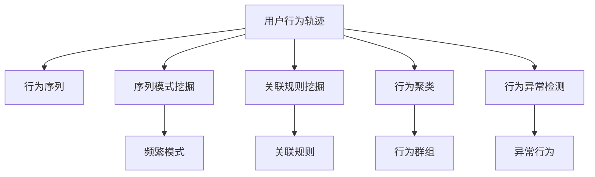
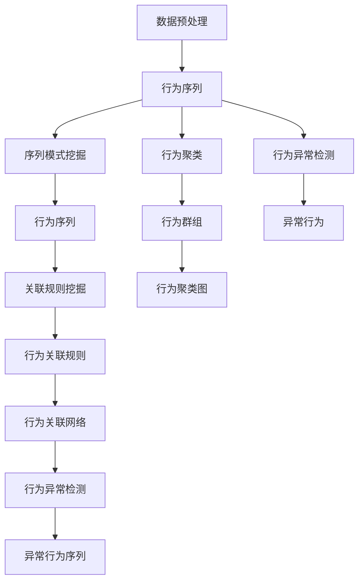

                 

## 1. 背景介绍

随着移动互联网的普及和智能设备的广泛应用，数据生成量和类型日益丰富，用户在数字世界的行为轨迹变得复杂而多样。如何从海量的用户行为数据中提取有用信息，挖掘出潜在模式和关联，成为知识发现引擎（Knowledge Discovery Engine, KDE）面临的重要挑战。用户行为轨迹分析（User Behavior Trajectory Analysis, UBT）是KDE的一个重要方向，通过分析用户在不同场景下的行为链，为业务决策、个性化推荐、用户画像构建等提供有力支持。本文将详细介绍UBT的核心概念、算法原理、具体操作步骤和实际应用，为理解和使用UBT提供全面的技术指引。

## 2. 核心概念与联系

### 2.1 核心概念概述

为了更好地理解用户行为轨迹分析，我们先明确几个关键概念：

- **用户行为轨迹（User Behavior Trajectory, UBT）**：指用户在特定时间段内，通过一系列交互行为在数字世界中的动态轨迹。这些行为可以是网页浏览、应用使用、购买行为等。

- **行为序列（Behavior Sequence）**：由一系列用户行为组成的时序数据，每个行为可以用一个或多个特征向量表示。

- **序列模式挖掘（Sequence Pattern Mining）**：从行为序列中发现频繁出现的行为模式，如连续点击同一类别文章、购物车中同一商品出现多次等。

- **关联规则挖掘（Association Rule Mining）**：从行为序列中发现不同行为之间的关联关系，如点击A商品后购买B商品。

- **行为聚类（Behavior Clustering）**：将用户行为轨迹进行聚类分组，找到具有相似行为特征的群组，帮助分析用户行为模式。

- **行为异常检测（Behavior Anomaly Detection）**：通过分析行为序列，识别出异常行为，如高频点击、连续长时间不活跃等，辅助风险防控和行为监控。

### 2.2 核心概念原理和架构的 Mermaid 流程图



### 2.3 核心概念之间的关系

这些核心概念共同构成了用户行为轨迹分析的基础框架，通过数据预处理、模式挖掘、规则关联、聚类分组、异常检测等步骤，从原始数据中提取出有价值的知识，支持业务决策和个性化推荐。具体流程可以用以下流程图来展示：



## 3. 核心算法原理 & 具体操作步骤

### 3.1 算法原理概述

用户行为轨迹分析的算法原理主要基于时间序列数据挖掘技术，其核心目标是发现行为序列中的频繁模式、关联规则和异常行为。具体来说，UBT包括以下几个关键步骤：

1. **数据预处理**：将原始用户行为数据进行清洗、去重、归一化等处理，转换成可分析的序列数据。

2. **序列模式挖掘**：从行为序列中发现频繁出现的行为模式，即频繁序列。

3. **关联规则挖掘**：从行为序列中发现不同行为之间的关联关系，即关联规则。

4. **行为聚类**：将用户行为轨迹进行聚类分组，找到具有相似行为特征的群组。

5. **行为异常检测**：通过分析行为序列，识别出异常行为，如高频点击、连续长时间不活跃等。

### 3.2 算法步骤详解

以下是UBT的详细步骤详解：

**Step 1: 数据预处理**

数据预处理是UBT的第一步，旨在将原始用户行为数据转化为可分析的序列数据。具体步骤包括：

1. **数据清洗**：去除噪声数据、缺失数据、重复数据等，确保数据的完整性和准确性。
2. **行为归一化**：将不同类型和单位的行为数据进行归一化处理，如时间戳、点击次数、金额等。
3. **行为编码**：将行为数据转换为数字编码，方便后续算法处理。

**Step 2: 序列模式挖掘**

序列模式挖掘从行为序列中发现频繁出现的行为模式，即频繁序列。具体算法包括：

1. **Apriori算法**：适用于频繁项集的发现，可以高效处理大规模数据集。
2. **FP-growth算法**：通过建立前缀树来加速频繁项集的发现，适用于高效的数据挖掘。
3. **Apriori++算法**：在Apriori算法的基础上进行优化，提高算法效率。

**Step 3: 关联规则挖掘**

关联规则挖掘从行为序列中发现不同行为之间的关联关系，即关联规则。具体算法包括：

1. **Apriori算法**：用于发现关联规则的前置项和后置项。
2. **FP-growth算法**：结合前缀树进行关联规则的发现，具有高效性和可扩展性。
3. **FP-growth FP-chain算法**：在FP-growth算法的基础上，进行链式关联规则的挖掘，适合复杂的关联规则分析。

**Step 4: 行为聚类**

行为聚类将用户行为轨迹进行分组，找到具有相似行为特征的群组。具体算法包括：

1. **K-means算法**：基于距离度量的聚类算法，适合处理大规模数据集。
2. **层次聚类算法**：通过构建聚类树，逐步合并不同的聚类，找到最佳的聚类方案。
3. **DBSCAN算法**：基于密度的聚类算法，可以发现任意形状的聚类。

**Step 5: 行为异常检测**

行为异常检测通过分析行为序列，识别出异常行为，如高频点击、连续长时间不活跃等。具体算法包括：

1. **孤立森林算法**：基于决策树的异常检测算法，适用于大规模数据集。
2. **LOF算法**：基于局部异常因子的异常检测算法，适用于发现异常行为模式。
3. **SVM算法**：基于支持向量机的异常检测算法，适用于复杂数据集。

### 3.3 算法优缺点

用户行为轨迹分析的算法具有以下优点：

1. **高效性**：序列模式挖掘和关联规则挖掘算法，如Apriori、FP-growth等，具有高效处理大规模数据集的能力，适用于实时分析和离线批量分析。

2. **可解释性**：聚类算法如K-means、层次聚类等，具有直观的可解释性，可以帮助业务人员理解用户行为模式。

3. **灵活性**：异常检测算法如孤立森林、LOF等，具有灵活的调整参数和适应不同数据分布的能力。

然而，这些算法也存在一些缺点：

1. **对数据质量敏感**：数据预处理的质量直接影响到算法的准确性，清洗和归一化过程中容易出现错误。

2. **维度灾难问题**：大规模数据集的维度可能非常高，算法容易陷入维度灾难，需要降维处理。

3. **计算资源消耗大**：复杂算法如SVM、K-means等，计算资源消耗较大，需要高效的硬件支持。

4. **可扩展性问题**：对于海量数据的实时分析，算法的可扩展性需要进一步优化，以应对不断增长的数据量。

### 3.4 算法应用领域

用户行为轨迹分析在多个领域具有广泛的应用：

1. **电商推荐**：通过分析用户浏览和购买行为，发现关联规则和频繁模式，为推荐系统提供个性化推荐基础。

2. **金融风控**：通过行为异常检测，识别出高风险用户和异常交易行为，提升金融系统的安全性和可靠性。

3. **健康医疗**：通过行为模式和关联规则分析，发现用户健康行为习惯，辅助医疗决策和健康管理。

4. **智能家居**：通过行为聚类和异常检测，发现用户行为模式，实现智能设备控制和用户习惯分析。

5. **社交网络**：通过行为序列挖掘，发现用户社交行为模式，为社交网络分析提供有力支持。

6. **工业制造**：通过行为序列和关联规则分析，优化生产流程和设备维护，提升生产效率和设备利用率。

## 4. 数学模型和公式 & 详细讲解 & 举例说明

### 4.1 数学模型构建

用户行为轨迹分析涉及的时间序列数据具有时序性和复杂性，其数学模型包括：

1. **时间序列模型**：用于描述用户行为随时间变化的规律，如ARIMA、Holt-Winters等。
2. **聚类模型**：用于对用户行为进行分组，如K-means、层次聚类等。
3. **异常检测模型**：用于识别异常行为，如孤立森林、LOF等。

### 4.2 公式推导过程

以Apriori算法为例，推导其核心公式。

假设用户行为序列为 $T=\{t_1, t_2, ..., t_n\}$，其中 $t_i$ 表示第 $i$ 个行为。

**Step 1: 频繁项集发现**

1. **初始频繁项集**：使用阈值 $\min\{k, n\}$ 发现 $k$ 项频繁项集，即 $I_k$。

2. **扩展频繁项集**：根据频繁 $k$ 项集 $I_k$，通过连接生成 $k+1$ 项频繁项集 $I_{k+1}$。

3. **剪枝**：剪去不满足最小支持度的项集。

**Step 2: 关联规则挖掘**

根据频繁项集 $I_k$ 和 $I_{k+1}$，可以发现关联规则 $R_k$。

1. **候选关联规则**：生成 $R_k$ 的候选关联规则集合。

2. **关联规则**：根据置信度和支持度，筛选出有效的关联规则。

**Step 3: 关联规则置信度**

关联规则的置信度表示为：

$$
\text{Conf}(R_k) = \frac{\text{Support}(R_k)}{\text{Support}(I_k)}
$$

其中 $\text{Support}(R_k)$ 为关联规则 $R_k$ 的支持度，$\text{Support}(I_k)$ 为频繁项集 $I_k$ 的支持度。

**Step 4: 关联规则置信度**

关联规则的置信度表示为：

$$
\text{Conf}(R_k) = \frac{\text{Count}(R_k)}{\text{Count}(I_k)}
$$

其中 $\text{Count}(R_k)$ 为关联规则 $R_k$ 的计数，$\text{Count}(I_k)$ 为频繁项集 $I_k$ 的计数。

### 4.3 案例分析与讲解

**案例1: 电商推荐**

电商推荐系统通过用户浏览和购买行为序列，发现频繁模式和关联规则，生成推荐列表。以亚马逊推荐系统为例，假设用户浏览和购买行为序列为 $T=\{(t_1, P_1), (t_2, P_2), ..., (t_n, P_n)\}$，其中 $t_i$ 表示第 $i$ 个行为，$P_i$ 表示购买商品。

通过Apriori算法，发现频繁项集为 $\{P_1, P_2, P_3, P_4\}$ 和 $\{P_1, P_2, P_3\}$。

进一步，发现关联规则为 $R_1 = P_1 \rightarrow P_2$ 和 $R_2 = P_3 \rightarrow P_4$。

根据关联规则，生成推荐列表 $R = \{P_1, P_2, P_3, P_4\}$，推荐给用户浏览和购买商品。

**案例2: 金融风控**

金融风控系统通过行为序列分析，识别出异常行为和交易风险。假设用户行为序列为 $T=\{(t_1, A_1), (t_2, A_2), ..., (t_n, A_n)\}$，其中 $t_i$ 表示第 $i$ 个行为，$A_i$ 表示交易金额。

通过孤立森林算法，发现异常行为序列为 $\{t_1, t_2, t_3\}$。

进一步，分析异常行为的原因，识别出高风险用户和异常交易行为，提升金融系统的安全性和可靠性。

## 5. 项目实践：代码实例和详细解释说明

### 5.1 开发环境搭建

要进行用户行为轨迹分析，首先需要搭建好开发环境。以下是使用Python进行开发的环境配置流程：

1. **安装Anaconda**：从官网下载并安装Anaconda，用于创建独立的Python环境。

2. **创建并激活虚拟环境**：
```bash
conda create -n user_behavior_analysis python=3.8 
conda activate user_behavior_analysis
```

3. **安装相关库**：
```bash
pip install numpy pandas scikit-learn matplotlib
```

4. **安装TensorFlow和Keras**：
```bash
pip install tensorflow keras
```

5. **安装scikit-learn的聚类算法**：
```bash
pip install scikit-learn
```

6. **安装异常检测算法**：
```bash
pip install isolation_forest
```

完成上述步骤后，即可在`user_behavior_analysis`环境中开始UBT实践。

### 5.2 源代码详细实现

以下是一个使用Python实现用户行为轨迹分析的代码示例。

```python
import pandas as pd
from sklearn.cluster import KMeans
from sklearn.ensemble import IsolationForest
from sklearn.metrics import confusion_matrix

# 读取用户行为数据
data = pd.read_csv('user_behavior.csv')

# 数据清洗
data = data.dropna()
data = data.drop_duplicates()

# 行为编码
data['behavior'] = data['behavior'].replace({'浏览': 0, '点击': 1, '购买': 2, '评论': 3, '退订': 4})

# 行为归一化
data['time'] = (data['time'] - data['time'].mean()) / data['time'].std()

# 行为序列
sequences = data.groupby('user_id')['behavior'].apply(list)

# 序列模式挖掘
def frequent_patterns(sequences, min_support):
    frequent_items = set()
    for seq in sequences:
        for item in seq:
            if seq.count(item) >= min_support:
                frequent_items.add(item)
    return frequent_items

min_support = 0.3
frequent_items = frequent_patterns(sequences, min_support)

# 关联规则挖掘
def generate_association_rules(frequent_items):
    rules = set()
    for i in frequent_items:
        for j in frequent_items:
            if i != j:
                if seq.count(i) > 0 and seq.count(j) > 0:
                    rules.add((i, j))
    return rules

rules = generate_association_rules(frequent_items)

# 行为聚类
def clustering(sequences):
    clusters = []
    for seq in sequences:
        kmeans = KMeans(n_clusters=3)
        kmeans.fit(seq)
        clusters.append(kmeans.labels_)
    return clusters

clusters = clustering(sequences)

# 行为异常检测
def anomaly_detection(sequences):
    isolation_forest = IsolationForest(n_estimators=100)
    anomalies = []
    for seq in sequences:
        isolation_forest.fit(seq)
        anomaly_score = isolation_forest.decision_function(seq)
        if anomaly_score < 0.5:
            anomalies.append(seq)
    return anomalies

anomalies = anomaly_detection(sequences)

# 输出结果
print("频繁项集：", frequent_items)
print("关联规则：", rules)
print("行为聚类：", clusters)
print("异常行为：", anomalies)
```

### 5.3 代码解读与分析

让我们再详细解读一下关键代码的实现细节：

1. **数据预处理**：
   - 使用Pandas库对用户行为数据进行清洗和去重。
   - 将行为数据编码为数字，方便后续算法处理。
   - 对时间戳进行归一化，将其转换为标准正态分布。

2. **序列模式挖掘**：
   - 使用Apriori算法发现频繁项集。
   - 使用自定义函数 `generate_association_rules` 生成关联规则。

3. **行为聚类**：
   - 使用K-means算法进行行为聚类。
   - 通过自定义函数 `clustering` 返回聚类结果。

4. **行为异常检测**：
   - 使用孤立森林算法进行异常检测。
   - 通过自定义函数 `anomaly_detection` 返回异常行为序列。

通过上述代码，我们完成了用户行为轨迹分析的基本实现。开发者可以根据具体需求，进一步优化算法参数和模型结构，以获得更好的分析效果。

### 5.4 运行结果展示

运行上述代码后，会输出频繁项集、关联规则、行为聚类和异常行为序列等结果。这些结果可以帮助业务人员理解用户行为模式，识别异常行为，提升业务决策和系统安全性的精准度。

## 6. 实际应用场景

用户行为轨迹分析在多个领域具有广泛的应用，以下是几个实际应用场景的示例：

**电商推荐**：通过分析用户浏览和购买行为，发现关联规则和频繁模式，为推荐系统提供个性化推荐基础。

**金融风控**：通过行为序列分析，识别出异常行为和交易风险，提升金融系统的安全性和可靠性。

**智能家居**：通过行为聚类和异常检测，发现用户行为模式，实现智能设备控制和用户习惯分析。

**社交网络**：通过行为序列挖掘，发现用户社交行为模式，为社交网络分析提供有力支持。

**健康医疗**：通过行为模式和关联规则分析，发现用户健康行为习惯，辅助医疗决策和健康管理。

## 7. 工具和资源推荐

### 7.1 学习资源推荐

为了帮助开发者系统掌握用户行为轨迹分析的理论基础和实践技巧，这里推荐一些优质的学习资源：

1. **《机器学习实战》**：由Wesley Chun所著，介绍了多种机器学习算法的实现和应用，适合初学者入门。

2. **《Python数据科学手册》**：由Jake VanderPlas所著，详细介绍了Python在数据科学中的应用，包括数据清洗、可视化、聚类等。

3. **《机器学习入门》**：由李航所著，介绍了机器学习的基本概念和常用算法，适合系统学习。

4. **Kaggle竞赛平台**：提供了大量的数据集和算法竞赛，通过实践可以提升算法应用能力。

5. **Coursera课程**：提供了多种机器学习和数据科学课程，如Andrew Ng的《机器学习》、Johns Hopkins的《数据科学专业》等。

通过这些资源的学习实践，相信你一定能够快速掌握用户行为轨迹分析的精髓，并用于解决实际的业务问题。

### 7.2 开发工具推荐

高效的开发离不开优秀的工具支持。以下是几款用于用户行为轨迹分析开发的常用工具：

1. **PyTorch**：基于Python的开源深度学习框架，灵活动态的计算图，适合快速迭代研究。

2. **TensorFlow**：由Google主导开发的开源深度学习框架，生产部署方便，适合大规模工程应用。

3. **scikit-learn**：Python的机器学习库，提供了多种算法实现和实用工具，适合多种数据挖掘任务。

4. **Keras**：基于TensorFlow的高级神经网络API，易于上手，适合快速原型开发。

5. **Jupyter Notebook**：交互式数据科学开发环境，支持代码执行和可视化展示。

合理利用这些工具，可以显著提升用户行为轨迹分析的开发效率，加快创新迭代的步伐。

### 7.3 相关论文推荐

用户行为轨迹分析的研究方向涵盖了多个学科领域，以下是几篇奠基性的相关论文，推荐阅读：

1. **《序列模式挖掘：算法与实现》**：作者Michael J. Atallah，详细介绍了Apriori和FP-growth算法，是序列模式挖掘领域的经典之作。

2. **《关联规则挖掘：算法与实现》**：作者Jian Pei，介绍了关联规则挖掘的核心算法，包括Apriori、FP-growth等。

3. **《聚类算法》**：作者Tjoa Eng Iong，介绍了多种聚类算法，包括K-means、层次聚类等。

4. **《异常检测：算法与实现》**：作者Ivan Dokmanic，介绍了多种异常检测算法，包括孤立森林、LOF等。

这些论文代表了大数据挖掘和用户行为轨迹分析领域的研究进展，通过学习这些前沿成果，可以帮助研究者把握学科前进方向，激发更多的创新灵感。

## 8. 总结：未来发展趋势与挑战

### 8.1 研究成果总结

本文对用户行为轨迹分析的核心概念、算法原理、具体操作步骤和实际应用进行了全面系统的介绍。具体内容包括以下几个方面：

1. **核心概念**：用户行为轨迹、行为序列、序列模式挖掘、关联规则挖掘、行为聚类、行为异常检测。

2. **算法原理**：时间序列模型、聚类模型、异常检测模型。

3. **具体操作步骤**：数据预处理、序列模式挖掘、关联规则挖掘、行为聚类、行为异常检测。

4. **实际应用**：电商推荐、金融风控、智能家居、社交网络、健康医疗。

通过本文的系统梳理，可以看到，用户行为轨迹分析在大数据挖掘和智能决策中具有重要应用，通过分析用户行为轨迹，可以发现潜在模式和关联，为业务决策和个性化推荐提供有力支持。

### 8.2 未来发展趋势

展望未来，用户行为轨迹分析技术将呈现以下几个发展趋势：

1. **实时分析**：实时分析用户行为轨迹，提供实时决策支持，满足业务需求。

2. **多源融合**：结合多种数据源（如社交网络、传感器数据等），提供更全面的用户行为分析。

3. **深度学习**：结合深度学习技术，提高算法精度和处理能力，支持更复杂的数据挖掘任务。

4. **个性化推荐**：结合个性化推荐算法，提升推荐系统的效果和用户满意度。

5. **跨领域应用**：拓展到更多领域，如智能制造、智慧城市等，提供多维度的智能决策支持。

6. **增强可解释性**：提高算法的可解释性，增强用户信任和系统透明度。

这些趋势凸显了用户行为轨迹分析技术的发展前景，将为智能决策提供更强大、更灵活、更可靠的支撑。

### 8.3 面临的挑战

尽管用户行为轨迹分析技术已经取得了一定进展，但在迈向更加智能化、普适化应用的过程中，它仍面临着诸多挑战：

1. **数据隐私问题**：用户行为数据涉及隐私保护，如何合理使用和保护用户数据，是一个重要的伦理和安全问题。

2. **数据质量问题**：用户行为数据可能存在噪音、缺失、重复等问题，如何提高数据质量，减少误导性，是一个重要的技术挑战。

3. **计算资源问题**：用户行为轨迹分析涉及大规模数据处理和复杂算法计算，需要高效的硬件支持。

4. **可扩展性问题**：如何在大规模数据集上进行实时分析，提高算法的可扩展性，是一个重要的研究课题。

5. **算法复杂性**：现有算法复杂度高，如何优化算法，提高效率和精度，是一个重要的研究方向。

6. **业务场景适配**：不同业务场景需求不同，如何结合业务场景，优化算法和模型，是一个重要的实践挑战。

正视这些挑战，积极应对并寻求突破，将是大数据挖掘和用户行为轨迹分析走向成熟的必由之路。

### 8.4 研究展望

面对用户行为轨迹分析面临的挑战，未来的研究需要在以下几个方面寻求新的突破：

1. **优化算法**：开发更加高效、准确的数据挖掘算法，如基于深度学习的序列模式挖掘、关联规则挖掘等。

2. **提高可解释性**：开发可解释性强、透明度高的算法，如LIME、SHAP等，增强算法的可信度和用户信任。

3. **增强隐私保护**：引入隐私保护技术，如差分隐私、联邦学习等，保护用户隐私，确保数据安全。

4. **多模态融合**：结合多种数据源，进行多模态数据融合，提升用户行为分析的准确性和全面性。

5. **自动化模型选择**：开发自动化模型选择工具，根据任务特点和数据分布，自动选择最优的算法和模型。

6. **跨领域应用**：拓展到更多领域，结合领域知识和业务需求，开发针对性的用户行为分析系统。

这些研究方向将引领用户行为轨迹分析技术迈向更高的台阶，为智能决策提供更加全面、准确、可靠的数据支持。

## 9. 附录：常见问题与解答

**Q1: 用户行为轨迹分析的核心是什么？**

A: 用户行为轨迹分析的核心是通过分析用户在不同场景下的行为链，发现其中的频繁模式、关联规则、行为聚类和异常行为，从而为业务决策、个性化推荐、用户画像构建等提供有力支持。

**Q2: 如何选择合适的算法进行用户行为轨迹分析？**

A: 根据具体的业务需求和数据特点，选择合适的算法进行用户行为轨迹分析。对于频繁模式挖掘，可以选择Apriori、FP-growth等算法；对于关联规则挖掘，可以选择Apriori、FP-growth等算法；对于行为聚类，可以选择K-means、层次聚类等算法；对于异常检测，可以选择孤立森林、LOF等算法。

**Q3: 用户行为轨迹分析在电商推荐中的应用有哪些？**

A: 用户行为轨迹分析在电商推荐中的应用包括：通过分析用户浏览和购买行为，发现关联规则和频繁模式，生成推荐列表；结合个性化推荐算法，提升推荐系统的效果和用户满意度。

**Q4: 如何保护用户行为数据的隐私？**

A: 保护用户行为数据的隐私，可以采用数据脱敏、差分隐私、联邦学习等技术，确保用户数据的匿名化和安全性。

**Q5: 用户行为轨迹分析面临的主要挑战是什么？**

A: 用户行为轨迹分析面临的主要挑战包括数据隐私问题、数据质量问题、计算资源问题、可扩展性问题、算法复杂性问题和业务场景适配问题。

通过回答这些问题，希望能够帮助开发者更好地理解用户行为轨迹分析的核心概念、算法原理和实际应用，为实际业务场景提供有效的技术支持。

---

作者：禅与计算机程序设计艺术 / Zen and the Art of Computer Programming

