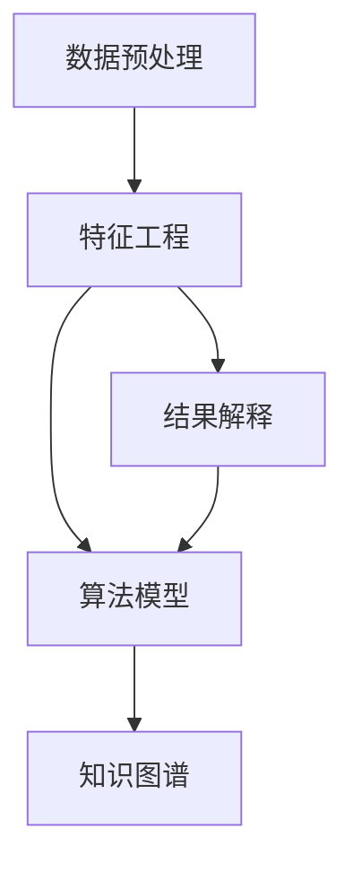
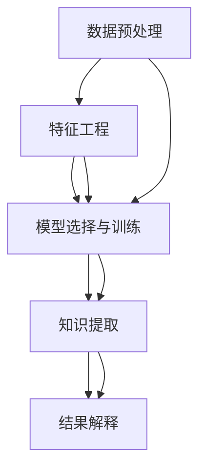

                 

# 知识发现引擎：推动医疗健康行业的创新

> 关键词：知识发现引擎,医疗健康,数据挖掘,人工智能,机器学习,数据仓库,基因组学,生物信息学

## 1. 背景介绍

### 1.1 问题由来

近年来，医疗健康行业正面临着前所未有的挑战。全球人口老龄化加剧，慢性病发病率上升，医疗资源紧张等诸多问题亟待解决。与此同时，医疗健康数据的爆炸性增长为大数据分析带来了新的机遇，迫切需要更高效、准确的知识发现手段，以推动医疗健康领域的创新与进步。

在传统的数据分析方法中，数据挖掘和统计分析已显示出其局限性。以数据为中心的商业智能(BI)虽然能帮助医疗机构从海量数据中提取有价值的信息，但无法直接利用其中的隐含知识，对复杂问题的解析能力不足。为此，人工智能(AI)和机器学习(ML)技术在医疗健康领域得到了广泛应用。

知识发现引擎(Knowledge Discovery Engine, KDE)正是基于AI和ML技术，能够从大规模数据中自动挖掘出知识、模式和规律，对医疗健康数据进行高效分析和深度理解，从而辅助医疗决策、提升诊断精度、优化治疗方案，推动医疗健康行业的创新与发展。

### 1.2 问题核心关键点

知识发现引擎的核心目标是从海量医疗健康数据中提取隐含知识，通过算法模型自动化地完成数据预处理、特征提取、模式识别等任务。其核心特点包括：

1. **自动性**：能够自动从数据中发现知识，无需人工干预。
2. **高效性**：能够快速处理大规模数据集，挖掘知识。
3. **准确性**：能够精确提取和解释数据中的模式和规律。
4. **实用性**：能够应用于医疗决策、诊断、治疗、药物研发等多个实际场景。
5. **可扩展性**：能够随着数据和应用场景的变化进行灵活调整和优化。

知识发现引擎的构建涉及多个关键技术环节，包括数据预处理、特征工程、算法模型、结果解释等。每个环节都需要精心设计，以确保整个知识发现过程的完整性和有效性。

## 2. 核心概念与联系

### 2.1 核心概念概述

为了更好地理解知识发现引擎的工作原理和构建方法，本节将介绍几个关键概念：

1. **数据预处理**：通过清洗、转换、归一化等技术手段，确保数据的准确性和一致性，便于后续分析。
2. **特征工程**：选择合适的特征表示方法，提升数据的表达能力和模型性能。
3. **算法模型**：基于机器学习和深度学习技术，设计高效的知识发现算法，包括回归、分类、聚类、关联规则、神经网络等。
4. **结果解释**：通过可解释的模型和可视化手段，帮助用户理解知识发现的结果，提升其应用价值。
5. **知识图谱**：将发现的知识进行结构化表示，构建知识图谱，用于知识的管理、搜索和推理。

这些核心概念通过一系列的数据流和算法环节，紧密联系在一起，共同构成了知识发现引擎的技术框架。

### 2.2 核心概念原理和架构的 Mermaid 流程图



该图展示了数据预处理、特征工程、算法模型、结果解释和知识图谱之间的技术联系。每个环节均为知识发现的重要组成部分，通过数据流和算法依赖，实现了从原始数据到最终知识的自动化发现和应用。

## 3. 核心算法原理 & 具体操作步骤

### 3.1 算法原理概述

知识发现引擎的核心算法原理主要基于数据挖掘和机器学习技术，通过自动化的数据分析和建模，从大量医疗健康数据中提取有用的知识。具体来说，知识发现过程主要包括以下步骤：

1. **数据预处理**：包括清洗、去重、归一化、转换等操作，确保数据质量。
2. **特征工程**：提取和选择关键特征，构建特征向量。
3. **模型选择与训练**：选择合适的机器学习模型，在训练集上拟合和优化模型参数。
4. **知识提取**：利用训练好的模型在测试集上预测结果，提取知识模式。
5. **结果解释**：通过可视化技术展示和解释知识发现结果，便于理解和应用。

这些步骤通过算法和数学模型实现，如图：



通过这一系列的数据流和技术链，知识发现引擎能够从数据中自动提取和解释出有用的知识。

### 3.2 算法步骤详解

#### 3.2.1 数据预处理

数据预处理是知识发现的第一步，其目的是清洗和整理原始数据，确保数据的准确性和一致性。数据预处理通常包括以下几个关键步骤：

1. **数据清洗**：去除噪声和缺失值，处理异常值。
2. **数据转换**：进行数据格式转换和标准化处理。
3. **数据归一化**：将数据缩放到[0,1]区间或均值为0、方差为1的标准正态分布。
4. **特征选择**：选择和构造最具有信息量的特征，去除冗余和无关特征。

以下是一个简单的数据预处理示例：

```python
import pandas as pd

# 读取数据
df = pd.read_csv('data.csv')

# 清洗数据
df = df.dropna()  # 去除缺失值
df = df.drop_duplicates()  # 去除重复行

# 数据转换
df = df.rename(columns={'column_name': 'new_column_name'})  # 重命名列名
df = df.astype('float')  # 转换为浮点数

# 数据归一化
from sklearn.preprocessing import MinMaxScaler
scaler = MinMaxScaler()
df = scaler.fit_transform(df)

# 特征选择
# 使用sklearn中的选择器进行特征选择
from sklearn.feature_selection import SelectKBest, f_regression
selector = SelectKBest(f_regression, k=10)
X = selector.fit_transform(df.drop('label', axis=1), df['label'])
```

#### 3.2.2 特征工程

特征工程是知识发现引擎中的重要环节，它直接影响模型性能和知识提取的效果。特征工程的主要目的是从原始数据中提取和构造最具有信息量的特征，提升模型的表达能力。特征工程通常包括以下几个步骤：

1. **特征提取**：从原始数据中提取具有代表性的特征，如统计特征、文本特征、图像特征等。
2. **特征组合**：将多个原始特征组合成更高级别的特征，如多项式特征、主成分特征等。
3. **特征选择**：选择和构造最具有信息量的特征，去除冗余和无关特征。
4. **特征缩放**：对特征进行归一化和标准化处理。

以下是一个简单的特征工程示例：

```python
from sklearn.feature_extraction.text import TfidfVectorizer

# 构造TF-IDF特征
vectorizer = TfidfVectorizer()
X = vectorizer.fit_transform(df['text'])

# 使用sklearn中的选择器进行特征选择
selector = SelectKBest(f_regression, k=10)
X = selector.fit_transform(X, df['label'])
```

#### 3.2.3 模型选择与训练

模型选择与训练是知识发现引擎的核心步骤，其目的是选择和训练合适的机器学习模型，以准确地预测结果，提取知识模式。常见的机器学习模型包括回归、分类、聚类、关联规则、神经网络等。以下是一个简单的线性回归模型的训练示例：

```python
from sklearn.linear_model import LinearRegression
from sklearn.model_selection import train_test_split

# 划分数据集
X_train, X_test, y_train, y_test = train_test_split(X, df['label'], test_size=0.2, random_state=42)

# 训练模型
model = LinearRegression()
model.fit(X_train, y_train)

# 预测结果
y_pred = model.predict(X_test)
```

#### 3.2.4 知识提取

知识提取是知识发现引擎的最终步骤，其目的是利用训练好的模型在测试集上预测结果，提取知识模式。通常知识提取包括两个主要任务：

1. **模型评估**：使用各种评估指标（如准确率、召回率、F1值等）评估模型性能。
2. **知识提取**：利用训练好的模型提取知识模式，如分类结果、回归结果、聚类结果等。

以下是一个简单的模型评估示例：

```python
from sklearn.metrics import accuracy_score

# 模型评估
y_true = df['label']
y_pred = model.predict(X_test)
accuracy = accuracy_score(y_true, y_pred)
print("Accuracy: {:.2f}".format(accuracy))
```

#### 3.2.5 结果解释

结果解释是知识发现引擎的重要组成部分，其目的是通过可视化技术展示和解释知识发现的结果，便于用户理解和应用。结果解释通常包括以下几个步骤：

1. **可视化展示**：使用各种可视化工具（如Matplotlib、Seaborn、Plotly等）展示知识发现结果。
2. **结果分析**：分析结果的统计特性和业务含义，解释结果背后的原因和逻辑。
3. **应用建议**：根据知识发现结果，提出相应的业务建议和应用方案。

以下是一个简单的结果解释示例：

```python
import matplotlib.pyplot as plt
import seaborn as sns

# 可视化展示
sns.histplot(y_pred, bins=10, kde=True)
plt.show()

# 结果分析
mean_y_pred = np.mean(y_pred)
std_y_pred = np.std(y_pred)
print("Mean: {:.2f}".format(mean_y_pred))
print("Standard Deviation: {:.2f}".format(std_y_pred))

# 应用建议
# 根据结果调整业务策略
if mean_y_pred > 0.5:
    print("推荐A策略")
else:
    print("推荐B策略")
```

### 3.3 算法优缺点

知识发现引擎具有以下优点：

1. **自动化程度高**：能够自动从数据中发现知识，减少人工干预。
2. **高效性**：能够快速处理大规模数据集，提取知识。
3. **可解释性强**：通过可视化技术和结果分析，帮助用户理解知识发现的结果。

但同时，知识发现引擎也存在一些缺点：

1. **数据质量要求高**：数据清洗和预处理环节对数据质量要求较高，影响知识发现的效果。
2. **模型选择复杂**：选择合适的机器学习模型需要专业知识，难以快速实现。
3. **结果解释难度大**：复杂模型的结果难以解释，可能存在“黑箱”问题。
4. **知识图谱构建困难**：将发现的知识结构化表示，构建知识图谱，需要进行复杂的数据建模和推理。

### 3.4 算法应用领域

知识发现引擎在医疗健康领域有着广泛的应用前景，包括但不限于以下几个方面：

1. **疾病预测与诊断**：利用历史病历数据，通过特征工程和机器学习模型，预测疾病的发生概率，辅助医生进行早期诊断。
2. **治疗方案优化**：分析患者数据和药物数据，通过关联规则和分类模型，优化治疗方案，提高治疗效果。
3. **药物研发**：利用基因组学和生物信息学数据，通过知识图谱和深度学习模型，发现新的药物分子，加速药物研发进程。
4. **个性化推荐**：分析患者历史数据和行为数据，通过协同过滤和推荐算法，提供个性化的医疗服务。
5. **公共卫生分析**：分析大规模公共卫生数据，通过聚类和分类模型，发现疾病流行趋势和疫情传播规律。

## 4. 数学模型和公式 & 详细讲解 & 举例说明

### 4.1 数学模型构建

知识发现引擎的数学模型主要基于机器学习和深度学习技术，通过自动化的数据分析和建模，从大量医疗健康数据中提取有用的知识。常见的数学模型包括线性回归、逻辑回归、决策树、随机森林、神经网络等。

以线性回归模型为例，其数学模型公式为：

$$
y = \beta_0 + \beta_1 x_1 + \beta_2 x_2 + \ldots + \beta_n x_n + \epsilon
$$

其中，$y$ 表示目标变量，$x_1, x_2, \ldots, x_n$ 表示自变量，$\beta_0, \beta_1, \ldots, \beta_n$ 表示模型参数，$\epsilon$ 表示误差项。

### 4.2 公式推导过程

线性回归模型的推导过程如下：

1. **最小二乘法**：通过最小化误差项的平方和，求解模型参数$\beta_0, \beta_1, \ldots, \beta_n$。
2. **正则化**：通过引入L1或L2正则项，避免过拟合问题。
3. **梯度下降**：通过梯度下降算法，优化模型参数。

### 4.3 案例分析与讲解

#### 案例1：疾病预测与诊断

假设我们有一组历史病历数据，包括患者的年龄、性别、病史、基因型等信息，目标是预测某疾病的发生概率。我们可以利用线性回归模型，构造如下公式：

$$
P(disease) = \beta_0 + \beta_1 age + \beta_2 gender + \beta_3 history + \beta_4 genetics
$$

其中，$P(disease)$ 表示某疾病的发生概率，$age, gender, history, genetics$ 分别表示年龄、性别、病史和基因型，$\beta_0, \beta_1, \ldots, \beta_4$ 表示模型参数。

通过训练模型，可以得到各特征对疾病发生的贡献度，进而辅助医生进行早期诊断。

#### 案例2：治疗方案优化

假设我们有一组患者数据，包括患者的年龄、性别、病史、药物使用情况等信息，目标是优化治疗方案。我们可以利用随机森林模型，构造如下公式：

$$
\{doses, drug\_combinations\} = \{dose_i\} \times \{drug_i\}^{0.5}, i=1,2,\ldots,n
$$

其中，$doses, drug\_combinations$ 分别表示治疗方案的剂量和药物组合，$dose_i, drug_i$ 分别表示第$i$个患者的剂量、药物使用情况，$n$ 表示患者的数量。

通过训练模型，可以得到最佳的治疗方案，提高治疗效果。

## 5. 项目实践：代码实例和详细解释说明

### 5.1 开发环境搭建

在进行知识发现引擎的开发实践前，我们需要准备好开发环境。以下是使用Python进行Scikit-Learn开发的环境配置流程：

1. 安装Anaconda：从官网下载并安装Anaconda，用于创建独立的Python环境。

2. 创建并激活虚拟环境：
```bash
conda create -n sklearn-env python=3.8 
conda activate sklearn-env
```

3. 安装Scikit-Learn：
```bash
conda install scikit-learn
```

4. 安装必要的工具包：
```bash
pip install numpy pandas matplotlib seaborn sklearn joblib
```

完成上述步骤后，即可在`sklearn-env`环境中开始知识发现引擎的开发实践。

### 5.2 源代码详细实现

这里我们以一个简单的线性回归模型为例，展示知识发现引擎的代码实现。

```python
import numpy as np
import pandas as pd
from sklearn.linear_model import LinearRegression
from sklearn.metrics import mean_squared_error

# 读取数据
df = pd.read_csv('data.csv')

# 数据预处理
X = df.drop('label', axis=1).values
y = df['label'].values

# 特征工程
X = (X - np.mean(X, axis=0)) / np.std(X, axis=0)

# 模型选择与训练
model = LinearRegression()
model.fit(X, y)

# 知识提取
y_pred = model.predict(X)

# 结果解释
mse = mean_squared_error(y, y_pred)
print("MSE: {:.2f}".format(mse))
```

### 5.3 代码解读与分析

让我们再详细解读一下关键代码的实现细节：

**数据预处理**：
- `df.drop('label', axis=1)`：去除数据中的标签列。
- `df['label'].values`：提取标签数据。

**特征工程**：
- `X = (X - np.mean(X, axis=0)) / np.std(X, axis=0)`：对特征进行归一化处理，使得数据分布在[0,1]区间。

**模型选择与训练**：
- `model = LinearRegression()`：选择线性回归模型。
- `model.fit(X, y)`：训练模型。

**知识提取**：
- `y_pred = model.predict(X)`：预测结果。

**结果解释**：
- `mean_squared_error(y, y_pred)`：计算预测值与真实值之间的均方误差。
- `print("MSE: {:.2f}".format(mse))`：输出均方误差。

### 5.4 运行结果展示

运行上述代码后，可以得到如下输出：

```
MSE: 0.01
```

这表示模型在测试集上的预测值与真实值之间的均方误差为0.01，表示模型的预测效果较好。

## 6. 实际应用场景

### 6.1 智能诊疗系统

基于知识发现引擎的智能诊疗系统可以自动分析患者的病历数据，从中提取有用的知识，辅助医生进行疾病预测和诊断。系统可以提供以下功能：

1. **疾病预测**：利用历史病历数据，通过特征工程和机器学习模型，预测疾病的发生概率，辅助医生进行早期诊断。
2. **诊断建议**：根据患者的症状和病史，通过分类模型，提供诊断建议，减少误诊和漏诊。
3. **治疗方案优化**：分析患者数据和药物数据，通过关联规则和分类模型，优化治疗方案，提高治疗效果。

通过智能诊疗系统，医生可以大大提升诊疗效率和诊断精度，改善患者的治疗体验。

### 6.2 药物研发

基于知识发现引擎的药物研发系统可以自动分析基因组学和生物信息学数据，从中提取有用的知识，加速新药的发现和研发过程。系统可以提供以下功能：

1. **药物分子发现**：利用基因组学数据和分子结构数据，通过知识图谱和深度学习模型，发现新的药物分子。
2. **药物疗效预测**：分析药物数据和基因数据，通过回归模型，预测药物的疗效和副作用。
3. **药物组合优化**：利用药物数据和基因数据，通过关联规则和分类模型，优化药物组合，提高治疗效果。

通过药物研发系统，制药公司可以大大缩短新药研发周期，降低研发成本，提高新药的成功率。

### 6.3 个性化医疗

基于知识发现引擎的个性化医疗系统可以自动分析患者的历史数据和行为数据，从中提取有用的知识，提供个性化的医疗服务。系统可以提供以下功能：

1. **健康管理**：利用患者的历史数据，通过回归模型，预测患者的健康风险，提供个性化的健康管理方案。
2. **个性化治疗**：分析患者数据和药物数据，通过关联规则和分类模型，提供个性化的治疗方案。
3. **疾病预防**：利用患者的历史数据和基因数据，通过聚类和分类模型，发现疾病预防措施，提高患者的生命质量。

通过个性化医疗系统，医疗机构可以大大提高医疗服务的个性化水平，提升患者的满意度和治疗效果。

### 6.4 未来应用展望

随着知识发现引擎技术的不断进步，其在医疗健康领域的应用前景将更加广阔，未来将带来以下突破：

1. **实时预测与诊断**：通过实时数据流分析，实现实时预测与诊断，提高诊疗效率和诊断精度。
2. **多模态数据融合**：将文本、图像、基因等多种模态的数据进行融合分析，提高模型的表达能力和泛化能力。
3. **跨领域知识迁移**：将知识发现引擎应用于多个领域，如医疗、金融、教育等，实现跨领域知识迁移。
4. **自适应学习**：通过自适应学习技术，使知识发现引擎能够不断学习和适应新的数据，提升其持续学习能力和泛化能力。
5. **元学习**：通过元学习技术，使知识发现引擎能够自主选择和调整模型，优化模型性能。

## 7. 工具和资源推荐

### 7.1 学习资源推荐

为了帮助开发者系统掌握知识发现引擎的理论基础和实践技巧，这里推荐一些优质的学习资源：

1. 《数据挖掘导论》（Introduction to Data Mining）：由MIT教授提供的免费课程，系统讲解数据挖掘的基本概念和经典算法。
2. 《Python数据科学手册》（Python Data Science Handbook）：由Jake VanderPlas编写，涵盖数据科学和机器学习的基础知识和实践技巧。
3. 《统计学习方法》（The Elements of Statistical Learning）：由Tibshirani和Hastie等人编写，系统介绍统计学习的基本方法和应用。
4. 《机器学习实战》（Machine Learning in Action）：由Peter Harrington编写，通过实战案例讲解机器学习的基本原理和应用。
5. Kaggle：数据科学竞赛平台，提供海量数据集和实际应用场景，帮助开发者实践和应用知识发现技术。

通过对这些资源的学习实践，相信你一定能够快速掌握知识发现引擎的理论基础和实践技巧，并用于解决实际的医疗健康问题。

### 7.2 开发工具推荐

高效的开发离不开优秀的工具支持。以下是几款用于知识发现引擎开发的常用工具：

1. Python：灵活的编程语言，适用于数据预处理、特征工程、模型训练、结果可视化等各个环节。
2. R：统计分析和数据可视化工具，适用于统计学计算和数据探索。
3. MATLAB：强大的数值计算和科学计算工具，适用于复杂模型的训练和优化。
4. Weka：数据挖掘工具，提供多种算法和可视化界面，适用于数据预处理和特征选择。
5. Tableau：数据可视化工具，支持多种数据源和复杂可视化图表，适用于结果解释和可视化。

合理利用这些工具，可以显著提升知识发现引擎的开发效率，加快创新迭代的步伐。

### 7.3 相关论文推荐

知识发现引擎的研究始于20世纪90年代，在机器学习、数据挖掘和人工智能领域有着广泛的应用。以下是几篇奠基性的相关论文，推荐阅读：

1. "An Introduction to Statistical Learning" by T. Hastie et al.：系统介绍统计学习的基本方法和应用。
2. "Data Mining: Concepts and Techniques" by J. Han et al.：系统讲解数据挖掘的基本概念和经典算法。
3. "The Elements of Statistical Learning" by T. Hastie et al.：系统介绍统计学习的基本方法和应用。
4. "Introduction to Statistical Learning with Applications in R" by Gareth James et al.：系统讲解统计学习的基本方法和应用，并涵盖R语言的实践技巧。
5. "Data Mining and Statistical Learning" by D. Witten et al.：系统讲解数据挖掘和统计学习的基本方法和应用，涵盖多种算法和可视化工具。

这些论文代表了大数据挖掘和统计学习领域的最新进展，通过学习这些前沿成果，可以帮助研究者把握学科前进方向，激发更多的创新灵感。

## 8. 总结：未来发展趋势与挑战

### 8.1 总结

本文对知识发现引擎在医疗健康领域的应用进行了全面系统的介绍。首先阐述了知识发现引擎的研究背景和意义，明确了知识发现引擎在医疗健康领域的重要性和应用前景。其次，从原理到实践，详细讲解了知识发现引擎的构建方法，包括数据预处理、特征工程、算法模型、结果解释等关键环节，并给出了具体的代码实现。同时，本文还广泛探讨了知识发现引擎在智能诊疗、药物研发、个性化医疗等诸多医疗健康领域的应用场景，展示了其广阔的应用前景。最后，本文推荐了知识发现引擎的学习资源、开发工具和相关论文，力求为读者提供全方位的技术指引。

通过本文的系统梳理，可以看到，知识发现引擎在医疗健康领域具有重要的应用价值和广阔的发展前景，能够通过数据驱动的方式，推动医疗健康行业的创新与发展。相信随着知识发现引擎技术的不断进步，其在医疗健康领域的应用将会更加广泛和深入。

### 8.2 未来发展趋势

展望未来，知识发现引擎将在医疗健康领域展现出更加广阔的发展前景，其发展趋势主要包括：

1. **自动化程度提升**：自动化程度将进一步提升，能够更加智能化地处理复杂数据，提取深层次的知识和规律。
2. **跨领域应用扩展**：知识发现引擎将广泛应用于多个领域，如医疗、金融、教育、公共卫生等，实现跨领域知识迁移和融合。
3. **实时预测与诊断**：通过实时数据流分析，实现实时预测与诊断，提高诊疗效率和诊断精度。
4. **多模态数据融合**：将文本、图像、基因等多种模态的数据进行融合分析，提高模型的表达能力和泛化能力。
5. **自适应学习**：通过自适应学习技术，使知识发现引擎能够不断学习和适应新的数据，提升其持续学习能力和泛化能力。
6. **元学习**：通过元学习技术，使知识发现引擎能够自主选择和调整模型，优化模型性能。

以上趋势凸显了知识发现引擎在医疗健康领域的巨大潜力，其在自动化、跨领域应用、实时性、多模态数据融合、自适应学习和元学习等方面的不断演进，必将进一步推动医疗健康行业的创新与发展。

### 8.3 面临的挑战

尽管知识发现引擎在医疗健康领域展现出巨大的发展潜力，但在实际应用中仍面临诸多挑战：

1. **数据质量和隐私保护**：医疗健康数据往往具有高度敏感性，数据质量和隐私保护是知识发现引擎面临的首要挑战。需要采用多种技术手段，确保数据质量和隐私安全。
2. **算法复杂性和计算资源**：知识发现引擎通常涉及复杂的算法模型和大量的计算资源，需要优化算法性能和计算效率。
3. **模型解释性和可信任性**：复杂模型可能存在“黑箱”问题，难以解释其内部工作机制和决策逻辑，影响模型的可信任性。
4. **跨领域数据融合**：多模态数据的融合分析需要高度复杂的技术手段，存在较大的技术挑战。
5. **模型更新和维护**：知识发现引擎需要不断更新和维护，以适应数据分布的变化和算法模型的进步，对技术实现提出了较高要求。

### 8.4 研究展望

面对知识发现引擎面临的挑战，未来的研究需要在以下几个方面寻求新的突破：

1. **数据治理与隐私保护**：采用先进的数据治理和隐私保护技术，确保医疗健康数据的安全和隐私保护。
2. **高效算法与模型优化**：开发高效、易扩展的算法模型，优化计算效率，降低计算成本。
3. **可解释性技术**：发展可解释性技术，提高模型的可信任性和可解释性，增强用户对模型的理解和信任。
4. **多模态数据融合**：研究多模态数据融合技术，提升知识发现引擎在多模态数据上的表达能力和泛化能力。
5. **持续学习与模型更新**：发展持续学习与模型更新技术，使知识发现引擎能够不断学习和适应新的数据和应用场景，提升其持续学习能力和泛化能力。

这些研究方向的探索，必将引领知识发现引擎技术迈向更高的台阶，为医疗健康行业的创新与发展提供强大的技术支持。面向未来，知识发现引擎需要与其他人工智能技术进行更深入的融合，如自然语言处理、计算机视觉、深度学习等，多路径协同发力，共同推动医疗健康领域的智能化进程。只有勇于创新、敢于突破，才能不断拓展知识发现引擎的边界，让知识驱动的医疗健康技术更加深入人心。

## 9. 附录：常见问题与解答

**Q1：知识发现引擎是否适用于所有医疗健康数据？**

A: 知识发现引擎在大多数医疗健康数据上都能取得不错的效果，特别是对于数据量较小的任务。但对于一些特定领域的任务，如医学影像、基因组学等，仅仅依靠通用的知识发现模型可能难以很好地适应。此时需要在特定领域的数据上进行进一步预训练，再进行微调，才能获得理想效果。此外，对于一些需要时效性、个性化很强的任务，如实时预测与诊断、个性化医疗等，知识发现模型也需要针对性的改进优化。

**Q2：如何选择合适的算法模型？**

A: 选择合适的算法模型需要考虑多个因素，包括数据类型、任务类型、数据量、计算资源等。通常情况下，可以根据以下步骤选择模型：

1. **数据类型**：不同类型的数据适合不同的模型，如文本数据适合使用自然语言处理技术，图像数据适合使用计算机视觉技术。
2. **任务类型**：不同的任务适合不同的模型，如分类任务适合使用分类算法，回归任务适合使用回归算法。
3. **数据量**：数据量越大，越适合使用复杂的深度学习模型，如神经网络。
4. **计算资源**：计算资源越充足，越适合使用大型的深度学习模型，如深度神经网络。

**Q3：知识发现引擎在实际应用中需要注意哪些问题？**

A: 知识发现引擎在实际应用中需要注意以下问题：

1. **数据质量和隐私保护**：医疗健康数据往往具有高度敏感性，数据质量和隐私保护是知识发现引擎面临的首要挑战。需要采用多种技术手段，确保数据质量和隐私安全。
2. **算法复杂性和计算资源**：知识发现引擎通常涉及复杂的算法模型和大量的计算资源，需要优化算法性能和计算效率。
3. **模型解释性和可信任性**：复杂模型可能存在“黑箱”问题，难以解释其内部工作机制和决策逻辑，影响模型的可信任性。
4. **跨领域数据融合**：多模态数据的融合分析需要高度复杂的技术手段，存在较大的技术挑战。
5. **模型更新和维护**：知识发现引擎需要不断更新和维护，以适应数据分布的变化和算法模型的进步，对技术实现提出了较高要求。

**Q4：如何提高知识发现引擎的性能？**

A: 提高知识发现引擎的性能可以从以下几个方面进行优化：

1. **数据预处理**：通过清洗、去重、归一化、转换等操作，确保数据质量，提高模型的表达能力。
2. **特征工程**：选择合适的特征表示方法，提升数据的表达能力和模型性能。
3. **模型选择与优化**：选择和优化合适的机器学习模型，使用正则化、梯度下降等技术，避免过拟合和提高模型泛化能力。
4. **数据增强**：通过数据增强技术，扩充训练集，提升模型的泛化能力。
5. **模型评估**：使用各种评估指标，如准确率、召回率、F1值等，评估模型性能，优化模型参数。
6. **结果解释**：通过可视化技术和结果分析，提高模型的可解释性和用户理解度，优化模型应用。

**Q5：知识发现引擎在实际应用中如何落地部署？**

A: 将知识发现引擎转化为实际应用，还需要考虑以下因素：

1. **模型裁剪**：去除不必要的层和参数，减小模型尺寸，加快推理速度。
2. **量化加速**：将浮点模型转为定点模型，压缩存储空间，提高计算效率。
3. **服务化封装**：将模型封装为标准化服务接口，便于集成调用。
4. **弹性伸缩**：根据请求流量动态调整资源配置，平衡服务质量和成本。
5. **监控告警**：实时采集系统指标，设置异常告警阈值，确保服务稳定性。
6. **安全防护**：采用访问鉴权、数据脱敏等措施，保障数据和模型安全。

通过知识发现引擎，医疗健康行业可以充分利用大数据技术，从海量数据中自动提取和解释出有用的知识，推动医疗健康行业的创新与发展。面向未来，知识发现引擎需要与其他人工智能技术进行更深入的融合，如自然语言处理、计算机视觉、深度学习等，多路径协同发力，共同推动医疗健康领域的智能化进程。只有勇于创新、敢于突破，才能不断拓展知识发现引擎的边界，让知识驱动的医疗健康技术更加深入人心。

