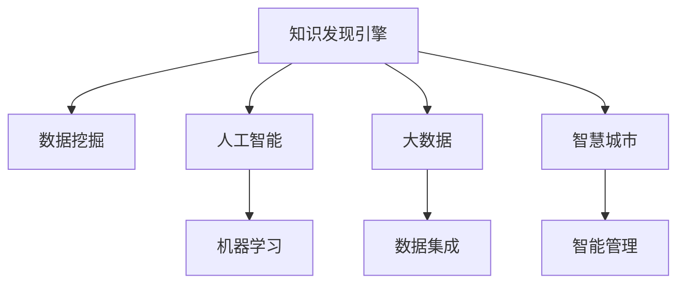

                 

# 知识发现引擎：推动智慧城市的建设蓝图

## 1. 背景介绍

### 1.1 智慧城市的概念
智慧城市（Smart City）是基于新一代信息通信技术与物联网、大数据、人工智能等技术在城市中的应用，以构建更为便捷、高效、可持续发展的城市治理体系和运行模式为目标。智慧城市不仅包括城市管理、基础设施、公共服务等方面的智能化，更涵盖了智慧交通、智慧能源、智慧医疗、智慧教育等多个领域。

### 1.2 知识发现引擎的作用
知识发现引擎（Knowledge Discovery Engine, KDE）在智慧城市建设中扮演着重要角色。通过挖掘城市大数据中的隐含知识，提供基于数据的决策支持，优化城市运行管理和公共服务，提升城市治理的科学性和智能化水平。智慧城市的有效运行离不开全面、及时、准确的知识发现与分析。

### 1.3 知识发现引擎的发展现状
当前的知识发现引擎主要依赖数据挖掘、机器学习、人工智能等技术，已经应用于智慧城市的多个子领域。例如，智慧交通领域的交通流量预测与优化、智慧能源领域的能源需求与供应分析、智慧医疗领域的疾病预测与诊断、智慧教育领域的个性化学习推荐等。

## 2. 核心概念与联系

### 2.1 核心概念概述

为更好地理解知识发现引擎在智慧城市中的应用，本节将介绍几个关键概念：

- 知识发现（Knowledge Discovery, KD）：通过算法和模型从原始数据中提取有价值的信息和知识的过程。
- 数据挖掘（Data Mining）：利用统计学、机器学习等方法从大量数据中发现数据间的关系和模式。
- 人工智能（Artificial Intelligence, AI）：模拟人类智能行为，通过学习与推理，实现智能化应用。
- 大数据（Big Data）：指体量巨大、复杂多变、难以用传统方式处理的结构化、半结构化、非结构化数据集。
- 智慧城市（Smart City）：运用现代信息技术手段，全面提升城市运行效率和市民生活质量的城市管理模式。

这些概念之间的联系通过以下Mermaid流程图来展示：



这个流程图展示了知识发现引擎与智慧城市建设的关键关联：

1. 知识发现引擎通过数据挖掘和机器学习技术，从大数据中提取知识，支持智慧城市智能管理。
2. 人工智能技术为知识发现提供了高效的工具和方法，使得数据处理和知识发现更加精准。
3. 大数据作为知识发现的基础，提供了丰富的数据来源，为智慧城市提供了海量支撑数据。
4. 智慧城市建设过程中，知识发现引擎的应用，使得城市运行更加智能、高效、可持续。

## 3. 核心算法原理 & 具体操作步骤
### 3.1 算法原理概述

知识发现引擎的核心算法主要包括数据预处理、特征工程、模型选择与训练、结果解释与验证等步骤。以下将详细介绍这些算法原理。

### 3.2 算法步骤详解

**Step 1: 数据预处理**

数据预处理是知识发现引擎的首要步骤，包括以下关键操作：

1. 数据收集：从城市运行管理的各个环节中收集相关数据，如交通流量、能源消耗、医疗记录、教育数据等。
2. 数据清洗：去除重复、错误、无关的数据，处理缺失值和异常值，确保数据质量和一致性。
3. 数据转换：对数据进行归一化、标准化处理，确保数据适合用于模型训练和分析。

**Step 2: 特征工程**

特征工程是知识发现引擎的重要环节，通过构建高质量的特征，提高模型的预测准确性和泛化能力。具体步骤如下：

1. 特征选择：根据任务需求，选择对模型预测有帮助的特征。
2. 特征提取：通过算法或手工方式从原始数据中提取新的特征，如时间特征、地理位置特征、文本情感特征等。
3. 特征变换：对特征进行变换处理，如PCA降维、归一化、平滑处理等，以提升模型效率和效果。

**Step 3: 模型选择与训练**

模型选择与训练是知识发现引擎的核心步骤，目标是构建高效、准确的预测模型。主要包括以下操作：

1. 模型选择：根据任务类型和数据特征，选择合适的机器学习算法或深度学习模型，如线性回归、逻辑回归、随机森林、神经网络等。
2. 参数调优：通过交叉验证、网格搜索等方法，寻找模型最优参数组合。
3. 模型训练：使用训练数据集进行模型训练，得到初步的模型预测结果。

**Step 4: 结果解释与验证**

结果解释与验证是知识发现引擎的重要环节，主要包括以下操作：

1. 结果解释：对模型预测结果进行解释和可视化，帮助用户理解模型决策逻辑和预测结果。
2. 结果验证：在验证数据集上评估模型性能，确保模型泛化能力。
3. 模型部署：将训练好的模型部署到实际应用场景中，实现实时预测与优化。

### 3.3 算法优缺点

知识发现引擎的优点包括：

1. 高效性：通过自动化数据分析，能够快速处理大量数据，提供实时预测与决策支持。
2. 精确性：利用机器学习和深度学习算法，能够实现高精度的预测和优化。
3. 普适性：适应于多种数据类型和分析任务，如分类、回归、聚类等。
4. 可扩展性：能够处理多源异构数据，支持大规模数据的分析和处理。

然而，知识发现引擎也存在一些缺点：

1. 依赖数据质量：数据质量和完整性对模型的预测结果影响较大，低质量数据可能影响结果准确性。
2. 模型复杂度高：复杂的模型可能导致计算资源消耗大，模型解释性差。
3. 结果解释性不足：部分模型难以解释其决策逻辑，用户难以理解和信任预测结果。
4. 对数据分布敏感：模型在训练数据分布与实际数据分布不一致时，可能出现泛化能力差的问题。

### 3.4 算法应用领域

知识发现引擎在智慧城市建设中，应用于以下多个领域：

- 智慧交通：通过交通流量预测和优化，提升交通效率，减少拥堵。
- 智慧能源：通过能源需求和供应分析，优化能源配置，提高能源利用效率。
- 智慧医疗：通过疾病预测和诊断，提升医疗服务水平，降低医疗成本。
- 智慧教育：通过个性化学习推荐，提升教育质量，满足个性化需求。
- 智慧安全：通过异常行为识别和预警，提高城市安全防范能力。
- 智慧环境：通过环境监测和治理，提升城市环境质量，保护生态环境。

## 4. 数学模型和公式 & 详细讲解 & 举例说明

### 4.1 数学模型构建

知识发现引擎的数学模型构建主要包括以下步骤：

1. 数据预处理：包括数据收集、清洗、转换等操作，确保数据适合用于模型训练和分析。
2. 特征工程：通过特征选择、特征提取、特征变换等步骤，构建高质量的特征集。
3. 模型选择与训练：根据任务需求选择合适的模型，如线性回归、逻辑回归、随机森林、神经网络等，并使用训练数据进行模型训练。

### 4.2 公式推导过程

以交通流量预测为例，假设已知历史交通流量数据 $D=\{x_t, y_t\}_{t=1}^N$，其中 $x_t$ 为第 $t$ 天的交通流量，$y_t$ 为第 $t$ 天的天气情况，如晴天、雨天、雾天等。

模型选择线性回归模型：

$$
\hat{y_t} = \beta_0 + \beta_1 x_{t-1} + \epsilon_t
$$

其中 $\beta_0, \beta_1$ 为模型参数，$\epsilon_t$ 为随机误差项。

训练模型时，需要最小化均方误差损失函数：

$$
L(\beta) = \frac{1}{N} \sum_{t=1}^N (y_t - \hat{y_t})^2
$$

通过梯度下降等优化算法，求解最优参数 $\beta$。

### 4.3 案例分析与讲解

假设某智慧城市需要对未来一天的交通流量进行预测，数据如下：

| 时间       | 交通流量 | 天气情况 |
|-----------|---------|--------|
| 06:00     | 10000   | 晴天    |
| 07:00     | 15000   | 雨天    |
| 08:00     | 18000   | 晴天    |
| ...       | ...     | ...    |
| 23:00     | 5000    | 雾天    |

首先进行数据预处理，去除缺失值和异常值，并进行归一化处理。

然后进行特征工程，构建时间序列特征、天气特征等。

最后，选择线性回归模型进行训练和预测，得到未来一天的交通流量预测结果。

## 5. 项目实践：代码实例和详细解释说明

### 5.1 开发环境搭建

在进行知识发现引擎的实践开发前，我们需要准备好开发环境。以下是使用Python进行Scikit-Learn开发的环境配置流程：

1. 安装Anaconda：从官网下载并安装Anaconda，用于创建独立的Python环境。

2. 创建并激活虚拟环境：
```bash
conda create -n sklearn-env python=3.8 
conda activate sklearn-env
```

3. 安装Scikit-Learn：
```bash
pip install scikit-learn
```

4. 安装其他必要的工具包：
```bash
pip install numpy pandas matplotlib
```

完成上述步骤后，即可在`sklearn-env`环境中开始项目实践。

### 5.2 源代码详细实现

我们以交通流量预测为例，给出使用Scikit-Learn进行线性回归模型的代码实现。

首先，定义数据预处理函数：

```python
import pandas as pd
from sklearn.model_selection import train_test_split
from sklearn.preprocessing import StandardScaler
from sklearn.linear_model import LinearRegression

def preprocess_data(df):
    # 数据清洗
    df = df.dropna()
    # 数据转换
    df['weather'] = df['weather'].replace({'晴天': 1, '雨天': 2, '雾天': 3})
    # 特征工程
    X = df[['交通流量']].values.reshape(-1, 1)
    y = df['天气情况'].values.reshape(-1, 1)
    X_train, X_test, y_train, y_test = train_test_split(X, y, test_size=0.2)
    # 数据标准化
    scaler = StandardScaler()
    X_train = scaler.fit_transform(X_train)
    X_test = scaler.transform(X_test)
    return X_train, X_test, y_train, y_test
```

然后，定义模型训练函数：

```python
def train_model(X_train, y_train):
    model = LinearRegression()
    model.fit(X_train, y_train)
    return model
```

接着，定义结果验证函数：

```python
def evaluate_model(model, X_test, y_test):
    y_pred = model.predict(X_test)
    accuracy = model.score(X_test, y_test)
    return y_pred, accuracy
```

最后，启动模型训练流程并在测试集上评估：

```python
# 加载数据
df = pd.read_csv('traffic_data.csv')

# 数据预处理
X_train, X_test, y_train, y_test = preprocess_data(df)

# 模型训练
model = train_model(X_train, y_train)

# 结果验证
y_pred, accuracy = evaluate_model(model, X_test, y_test)
print('模型准确度：', accuracy)
```

以上就是使用Scikit-Learn进行交通流量预测的完整代码实现。可以看到，借助Scikit-Learn，线性回归模型的实现变得简洁高效。

### 5.3 代码解读与分析

让我们再详细解读一下关键代码的实现细节：

**preprocess_data函数**：
- 数据清洗：删除缺失值和异常值，确保数据质量。
- 数据转换：对天气情况进行编码，并构建时间序列特征。
- 特征工程：使用特征选择方法，构建高质量的特征集。
- 数据标准化：使用标准差对数据进行归一化处理。

**train_model函数**：
- 模型选择：选择线性回归模型。
- 模型训练：使用训练数据进行模型训练。

**evaluate_model函数**：
- 结果验证：在测试数据集上验证模型性能。
- 结果展示：输出模型的准确度和预测结果。

**启动模型训练流程**：
- 数据加载：从数据文件中加载数据。
- 模型训练：在训练数据集上训练模型。
- 结果评估：在测试数据集上验证模型，输出结果。

可以看到，Scikit-Learn提供的机器学习工具库使得模型训练过程更加简单高效。开发者可以更多地关注数据处理和模型优化等核心逻辑，而不必过多关注底层实现细节。

当然，工业级的系统实现还需考虑更多因素，如模型的保存和部署、超参数的自动搜索、更灵活的任务适配层等。但核心的知识发现引擎范式基本与此类似。

## 6. 实际应用场景

### 6.1 智慧交通

知识发现引擎在智慧交通中的应用非常广泛，主要用于交通流量预测、拥堵优化、事故预测等方面。通过对历史交通流量数据进行分析和建模，预测未来交通流量，实时调整信号灯和道路资源，避免交通拥堵，提升出行效率。

### 6.2 智慧能源

知识发现引擎在智慧能源领域，主要用于能源需求与供应预测、能源利用效率优化等方面。通过对能源消耗数据的分析，预测未来能源需求，优化能源配置，提高能源利用效率，降低能源消耗。

### 6.3 智慧医疗

知识发现引擎在智慧医疗中的应用，主要体现在疾病预测、诊断推荐、个性化治疗方案等方面。通过对医疗数据的分析，预测疾病发病趋势，优化诊疗方案，提供个性化的治疗建议，提升医疗服务质量。

### 6.4 智慧教育

知识发现引擎在智慧教育中的应用，主要体现在个性化学习推荐、学生行为分析、课程优化等方面。通过对学生行为数据的分析，推荐适合的学习资源，优化课程设置，提升教育效果。

### 6.5 智慧安全

知识发现引擎在智慧安全领域，主要用于异常行为识别、安全事件预测、应急响应等方面。通过对监控视频数据的分析，识别异常行为，预测安全事件，及时预警并采取应急措施，保障城市安全。

### 6.6 智慧环境

知识发现引擎在智慧环境领域，主要用于环境监测、污染预测、垃圾分类等方面。通过对环境监测数据的分析，预测污染趋势，优化垃圾分类策略，提升环境质量，保护生态环境。

## 7. 工具和资源推荐

### 7.1 学习资源推荐

为了帮助开发者系统掌握知识发现引擎的理论基础和实践技巧，这里推荐一些优质的学习资源：

1. 《Python机器学习》书籍：由Sebastian Raschka和Vahid Mirjalili所著，介绍了Python在数据挖掘、机器学习等领域的应用，包括Scikit-Learn的使用。
2. Kaggle平台：提供海量数据集和竞赛任务，有助于实践和提升数据挖掘和机器学习技能。
3. Udacity《数据科学与机器学习纳米学位》课程：由Google、Facebook等公司联合开设，系统介绍数据挖掘、机器学习、深度学习等核心技能。
4. Coursera《数据科学方法与工具》课程：由Johns Hopkins大学开设，涵盖数据预处理、特征工程、模型选择等多个环节。
5. 《深度学习》书籍：由Ian Goodfellow、Yoshua Bengio、Aaron Courville等知名学者合著，介绍了深度学习在知识发现中的应用。

通过对这些资源的学习实践，相信你一定能够快速掌握知识发现引擎的精髓，并用于解决实际的智慧城市问题。

### 7.2 开发工具推荐

高效的开发离不开优秀的工具支持。以下是几款用于知识发现引擎开发的常用工具：

1. Python：作为知识发现引擎的主要开发语言，Python拥有丰富的库和框架，如Scikit-Learn、TensorFlow等。
2. Jupyter Notebook：提供交互式编程环境，方便进行数据探索和模型调试。
3. Apache Spark：分布式计算框架，适用于大规模数据处理和机器学习任务。
4. TensorFlow：由Google主导开发的深度学习框架，支持分布式训练和模型部署。
5. Weights & Biases：模型训练的实验跟踪工具，记录和可视化模型训练过程中的各项指标。
6. Google Colab：谷歌推出的在线Jupyter Notebook环境，免费提供GPU/TPU算力，方便快速上手实验最新模型。

合理利用这些工具，可以显著提升知识发现引擎的开发效率，加快创新迭代的步伐。

### 7.3 相关论文推荐

知识发现引擎的发展源于学界的持续研究。以下是几篇奠基性的相关论文，推荐阅读：

1. J. Han和M. Kamber的《数据挖掘：概念与技术》：介绍了数据挖掘的基本概念、技术和算法，涵盖分类、聚类、关联规则等多个领域。
2. G. Hinton等人的《深度学习》：由深度学习领域权威学者合著，系统介绍深度学习在知识发现中的应用。
3. J. Friedman的《The Elements of Statistical Learning》：介绍了统计学习的基本方法和算法，涵盖回归、分类、聚类等多个领域。
4. I. Guyon和A. Elisseeff的《An Introduction to Variable and Feature Selection》：介绍了特征选择的基本方法和算法，涵盖传统方法和机器学习方法。
5. Y. Bengio等人的《Deep Learning for Natural Language Processing》：介绍了深度学习在自然语言处理领域的应用，包括语言模型、机器翻译、问答系统等。

这些论文代表了大数据与知识发现领域的发展脉络。通过学习这些前沿成果，可以帮助研究者把握学科前进方向，激发更多的创新灵感。

## 8. 总结：未来发展趋势与挑战

### 8.1 总结

本文对知识发现引擎在智慧城市中的应用进行了全面系统的介绍。首先阐述了智慧城市的概念及其对知识发现引擎的需求，明确了知识发现引擎在智慧城市建设中的重要作用。其次，从原理到实践，详细讲解了知识发现引擎的核心算法和操作步骤，给出了知识发现引擎任务开发的完整代码实例。同时，本文还探讨了知识发现引擎在智慧交通、智慧能源、智慧医疗等多个领域的应用场景，展示了知识发现引擎的广阔应用前景。最后，本文精选了知识发现引擎的学习资源和开发工具，力求为读者提供全方位的技术指引。

通过本文的系统梳理，可以看到，知识发现引擎在智慧城市建设中发挥了重要作用，成为推动城市治理智能化、科学化的重要工具。智慧城市的有效运行离不开全面、及时、准确的知识发现与分析，未来的智慧城市建设需要更多的知识发现引擎技术的支撑。

### 8.2 未来发展趋势

展望未来，知识发现引擎在智慧城市建设中将呈现以下几个发展趋势：

1. 模型复杂度提升：随着数据量的不断增加和分析需求的不断提升，知识发现引擎将采用更加复杂的模型，如深度学习模型、强化学习模型等，以提升预测准确性和泛化能力。
2. 跨模态分析普及：未来知识发现引擎将逐步拓展到多模态数据的分析，如文本、图像、语音、视频等，提升城市运行管理的全面性。
3. 边缘计算部署：随着物联网设备的应用普及，知识发现引擎将逐步部署到边缘设备上，实现实时、高效的数据分析和处理。
4. 联邦学习应用：未来知识发现引擎将采用联邦学习技术，在保护数据隐私的前提下，实现多源异构数据的联合分析。
5. 智能协同优化：未来知识发现引擎将与物联网、云计算、区块链等技术结合，实现智能化协同优化，提升城市运行管理效率。
6. 社会治理支持：未来知识发现引擎将支持社会治理分析，如舆情监测、政策评估、犯罪预测等，提升城市治理的智能化水平。

以上趋势凸显了知识发现引擎在智慧城市建设中的重要作用，为智慧城市的未来发展提供了新的思路和方向。

### 8.3 面临的挑战

尽管知识发现引擎在智慧城市建设中已经取得了一定的成就，但在迈向更加智能化、普适化应用的过程中，仍面临诸多挑战：

1. 数据质量瓶颈：数据质量和完整性对模型的预测结果影响较大，低质量数据可能影响结果准确性。如何提高数据质量，确保数据的一致性和可靠性，是未来需要解决的重要问题。
2. 模型复杂度高：复杂的模型可能导致计算资源消耗大，模型解释性差。如何优化模型结构，提升模型效率，增强模型解释性，是未来研究的重要方向。
3. 结果解释性不足：部分模型难以解释其决策逻辑，用户难以理解和信任预测结果。如何赋予模型更强的解释性，增强模型的可信度和可接受性，是未来需要解决的重要问题。
4. 对数据分布敏感：模型在训练数据分布与实际数据分布不一致时，可能出现泛化能力差的问题。如何提高模型的泛化能力，确保模型在实际应用中的表现，是未来研究的重要方向。
5. 隐私保护与数据安全：随着数据应用的广泛化，数据隐私和安全性问题更加突出。如何保护用户隐私，确保数据安全，是未来研究的重要方向。
6. 模型更新与优化：模型需要不断更新与优化，以适应数据分布的变化和应用场景的变化。如何设计有效的模型更新机制，确保模型性能的持续提升，是未来研究的重要方向。

### 8.4 研究展望

面对知识发现引擎面临的这些挑战，未来的研究需要在以下几个方面寻求新的突破：

1. 数据预处理与清洗技术：开发更加高效的数据预处理和清洗方法，提高数据质量和一致性。
2. 模型压缩与优化技术：开发更加高效的模型压缩与优化方法，提升模型效率和解释性。
3. 多模态数据融合技术：开发更加高效的多模态数据融合方法，提升城市运行管理的全面性。
4. 联邦学习与隐私保护技术：开发更加高效的联邦学习与隐私保护方法，确保数据安全与隐私保护。
5. 模型更新与自适应技术：开发更加高效的模型更新与自适应方法，确保模型性能的持续提升。
6. 社会治理与智能优化技术：开发更加高效的智能优化方法，提升社会治理的智能化水平。

这些研究方向的探索，必将引领知识发现引擎技术迈向更高的台阶，为智慧城市的未来发展提供新的技术支撑。面向未来，知识发现引擎需要与其他人工智能技术进行更深入的融合，如知识表示、因果推理、强化学习等，多路径协同发力，共同推动智慧城市的建设与发展。

## 9. 附录：常见问题与解答

**Q1：知识发现引擎是否适用于所有智慧城市应用场景？**

A: 知识发现引擎在智慧城市建设中应用广泛，适用于多数智慧城市应用场景，如智慧交通、智慧能源、智慧医疗、智慧教育等。但对于一些特殊领域，如航空管制、金融交易等，需要更加专业的算法和模型。

**Q2：知识发现引擎的开发过程需要注意哪些问题？**

A: 知识发现引擎的开发过程中，需要注意以下问题：
1. 数据质量：确保数据的质量和一致性，去除重复、错误、无关的数据。
2. 模型选择：根据任务需求选择合适的模型，如线性回归、逻辑回归、随机森林、神经网络等。
3. 模型训练：使用训练数据进行模型训练，确保模型的泛化能力。
4. 结果解释：对模型预测结果进行解释和可视化，确保模型的可解释性和可信度。
5. 模型部署：将模型部署到实际应用场景中，确保模型的实时性和稳定性。

**Q3：知识发现引擎在智慧城市建设中面临哪些挑战？**

A: 知识发现引擎在智慧城市建设中面临以下挑战：
1. 数据质量瓶颈：低质量数据可能影响结果准确性。
2. 模型复杂度高：复杂的模型可能导致计算资源消耗大，模型解释性差。
3. 结果解释性不足：部分模型难以解释其决策逻辑，用户难以理解和信任预测结果。
4. 对数据分布敏感：模型在训练数据分布与实际数据分布不一致时，可能出现泛化能力差的问题。
5. 隐私保护与数据安全：需要保护用户隐私，确保数据安全。

**Q4：如何提升知识发现引擎的泛化能力？**

A: 提升知识发现引擎的泛化能力，可以从以下方面进行改进：
1. 数据多样化：使用多样化的数据进行模型训练，提升模型的泛化能力。
2. 正则化技术：使用L2正则、Dropout等正则化技术，避免模型过拟合。
3. 迁移学习：将知识发现引擎应用于多个任务，提升模型的泛化能力。
4. 联邦学习：采用联邦学习技术，实现多源异构数据的联合分析。
5. 跨模态融合：采用多模态数据融合技术，提升模型的全面性。

这些方法可以通过提升模型的泛化能力，提高知识发现引擎在实际应用中的表现。

**Q5：如何保护知识发现引擎的数据隐私？**

A: 保护知识发现引擎的数据隐私，可以从以下方面进行改进：
1. 数据匿名化：使用数据匿名化技术，保护用户隐私。
2. 差分隐私：使用差分隐私技术，保护数据隐私。
3. 联邦学习：采用联邦学习技术，在保护数据隐私的前提下，实现多源异构数据的联合分析。
4. 数据加密：使用数据加密技术，保护数据隐私。
5. 隐私保护算法：开发隐私保护算法，保护数据隐私。

这些方法可以通过保护用户隐私，确保知识发现引擎的数据安全。

---

作者：禅与计算机程序设计艺术 / Zen and the Art of Computer Programming

