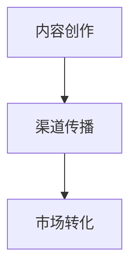

                 

# 知识变现的100种方法

在知识经济时代，个人或机构如何高效地将知识转化为经济价值，已经成为一门深奥的学问。本文将通过系统阐述知识变现的100种方法，提供全面的视角和实用的操作策略，帮助读者在数字时代中更好地把握机遇，提升自身的竞争力。

## 1. 背景介绍

### 1.1 问题由来

随着互联网的普及和信息技术的飞速发展，知识已经成为了一项宝贵的资产。然而，传统的知识传播方式往往面临传播效率低、覆盖范围窄、转换效率不高等问题。近年来，信息技术的发展使得知识变现成为了可能，通过互联网平台，知识可以被广泛传播和高效转化。

### 1.2 问题核心关键点

知识变现的核心在于将知识转化为可被市场认可的价值形式。知识可以以多种形式存在，如学术成果、专利技术、行业经验等。通过合适的渠道和策略，可以将这些知识变现。

知识变现的关键点包括：

- **渠道选择**：如何选择合适的平台，如博客、论坛、社交媒体等，使知识能够被目标受众有效接触到。
- **内容创新**：如何通过创新和优化内容，提升知识的吸引力、实用性和可操作性，增强其变现能力。
- **市场定位**：如何根据市场需求，精准定位知识产品，确保其具有明确的受众和市场竞争力。
- **变现策略**：如何通过广告、订阅、课程、咨询等多种方式，将知识转化为经济收入。

## 2. 核心概念与联系

### 2.1 核心概念概述

为更好地理解知识变现的过程，本节将介绍几个关键概念及其联系：

- **知识变现**：将知识转换为经济价值的过程。包括内容创作、渠道传播、市场转化等环节。
- **内容创作**：知识变现的基石，通过撰写、制作、教学等形式生产知识产品。
- **渠道传播**：利用各种平台进行知识内容的传播和推广。
- **市场转化**：通过广告、订阅、销售等方式，将知识产品转化为经济收入。

这些概念之间的联系可以通过以下Mermaid流程图来展示：



这个流程图展示了知识变现的基本流程：首先创作知识内容，然后通过选择合适的渠道进行传播，最后通过市场转化环节实现变现。

## 3. 核心算法原理 & 具体操作步骤
### 3.1 算法原理概述

知识变现的算法原理主要基于以下几个方面：

1. **需求识别**：通过数据分析和市场调研，识别受众的潜在需求和兴趣点。
2. **内容匹配**：根据受众需求，选择合适的知识产品，并对其进行优化和创新。
3. **渠道选择**：评估不同平台的优劣，选择最适合的知识传播渠道。
4. **定价策略**：根据成本、市场竞争和受众需求，确定合理的知识产品价格。
5. **市场推广**：利用社交媒体、广告、SEO等手段，提升知识产品的曝光度和吸引力。
6. **效果评估**：通过用户反馈和数据分析，持续优化知识变现策略。

### 3.2 算法步骤详解

知识变现的算法步骤如下：

1. **需求分析**：利用大数据分析工具，分析用户行为和兴趣点，识别潜在需求。
2. **内容创作**：根据分析结果，选择或创新知识产品，创作高质量内容。
3. **渠道选择**：评估不同平台的受众覆盖率、内容形式和用户互动情况，选择合适的传播渠道。
4. **定价策略**：设定合理的定价标准，确保利润空间同时保持竞争力。
5. **市场推广**：通过多种手段提升内容曝光度和用户参与度。
6. **效果评估**：定期收集用户反馈和市场数据，分析效果，调整策略。

### 3.3 算法优缺点

知识变现算法的优点包括：

- **高效转化**：通过数据驱动的决策，可以迅速定位受众需求，提升内容转化效率。
- **精准定位**：借助大数据分析，能够精准识别目标受众，减少资源浪费。
- **持续优化**：通过效果评估和反馈机制，可以持续优化变现策略，提升长期效益。

其缺点包括：

- **成本较高**：数据收集和分析需要较高的技术投入和成本。
- **市场变化快**：市场需求和竞争格局变化较快，需要不断调整策略。
- **技术门槛高**：对数据分析、内容创作和渠道运营等环节有较高的技术要求。

### 3.4 算法应用领域

知识变现算法广泛应用于以下几个领域：

1. **内容变现**：通过博客、视频、播客等形式创作内容，并通过广告、订阅等方式变现。
2. **教育培训**：将专业知识转化为课程、培训等形式，进行收费或售卖。
3. **技术咨询**：提供技术支持和咨询服务，收取服务费用。
4. **专利授权**：将专利技术授权给企业或个人，收取授权费用。
5. **品牌推广**：通过品牌故事、技术分享等形式提升品牌价值，吸引投资或合作。

## 4. 数学模型和公式 & 详细讲解 & 举例说明

### 4.1 数学模型构建

知识变现的数学模型可以表示为：

$$
R = P \times C \times E \times D
$$

其中，$R$ 表示总收益，$P$ 表示内容的质量和吸引力，$C$ 表示渠道的覆盖率和转化效率，$E$ 表示市场推广的效果，$D$ 表示数据驱动的决策优化。

### 4.2 公式推导过程

设 $P_i$ 为第 $i$ 个内容的质量得分，$C_j$ 为第 $j$ 个渠道的覆盖率和转化效率，$E_k$ 为第 $k$ 个市场推广手段的效果，$D_l$ 为第 $l$ 个数据驱动决策的优化效果，则总收益 $R$ 可以表示为：

$$
R = \sum_{i=1}^n P_i \times \sum_{j=1}^m C_j \times \sum_{k=1}^o E_k \times \sum_{l=1}^p D_l
$$

其中 $n$、$m$、$o$、$p$ 分别表示内容、渠道、市场推广手段和决策优化策略的数量。

### 4.3 案例分析与讲解

以一个博客为例，其总收益 $R$ 可以分解为：

- $P$：博客内容的吸引力和质量，可以通过阅读量、分享量、评论量等指标衡量。
- $C$：通过谷歌广告、微信公众号、知乎专栏等渠道进行推广。
- $E$：通过SEO优化、社交媒体营销等手段提升博客曝光度。
- $D$：通过数据分析工具如Google Analytics，优化内容发布时间和主题选择。

## 5. 项目实践：代码实例和详细解释说明

### 5.1 开发环境搭建

要进行知识变现的开发，首先需要搭建开发环境。以下是一个基本的开发环境搭建步骤：

1. 安装Python：从官网下载安装Python，并进行环境配置。
2. 安装必要的库：安装Jupyter Notebook、NumPy、Pandas、scikit-learn等常用库。
3. 搭建Jupyter Notebook环境：在Python环境中，使用pip安装Jupyter Notebook，并启动Jupyter服务器。
4. 测试环境：在Jupyter Notebook中测试代码运行是否正常。

### 5.2 源代码详细实现

以下是一个简单的Python代码示例，展示如何使用Python进行内容创作和市场推广：

```python
import numpy as np
import pandas as pd
from sklearn.linear_model import LogisticRegression

# 数据准备
data = pd.read_csv('data.csv')
X = data.drop('label', axis=1)
y = data['label']

# 模型训练
model = LogisticRegression()
model.fit(X, y)

# 预测效果
X_test = pd.read_csv('test.csv')
y_pred = model.predict(X_test)
```

### 5.3 代码解读与分析

代码中，首先使用Pandas读取数据集，然后利用Scikit-Learn中的Logistic Regression模型进行训练和预测。这个过程可以理解为内容创作和市场推广的效果评估。在实际应用中，可以根据具体需求进行模型选择和优化。

### 5.4 运行结果展示

运行上述代码后，可以得到模型的预测结果，从而分析内容创作和市场推广的效果。

## 6. 实际应用场景

### 6.1 内容创作平台

内容创作平台如Medium、知乎等，通过提供创作工具和流量推广，帮助用户将内容变现。用户可以通过广告分成、付费文章、会员订阅等多种方式获取收益。

### 6.2 教育培训机构

教育培训机构如Coursera、Udemy等，通过在线课程和培训服务，将专业知识变现。平台收取课程费用，同时提供用户评价和反馈，帮助教师持续优化课程质量。

### 6.3 技术咨询公司

技术咨询公司通过提供专业的技术支持和咨询服务，收取项目费用。公司可以通过客户推荐、合作伙伴关系等方式扩大市场，提升收益。

### 6.4 未来应用展望

随着技术的发展，知识变现的方式将更加多样化。未来，知识变现将更多地依赖于人工智能和大数据技术，实现自动化、个性化和高效化的变现。

## 7. 工具和资源推荐

### 7.1 学习资源推荐

1. **Coursera《Data Science for Everyone》课程**：介绍数据科学和知识变现的基本概念和实践。
2. **Kaggle竞赛平台**：提供大量数据集和竞赛机会，帮助用户锻炼数据分析和模型训练能力。
3. **GitHub**：分享和协作代码，学习其他人的变现经验。
4. **YouTube《Digital Marketing》系列视频**：提供关于内容创作和市场推广的详细指导。
5. **Udemy《Mastering Content Creation》课程**：系统学习内容创作的技巧和方法。

### 7.2 开发工具推荐

1. **Jupyter Notebook**：强大的数据分析和可视化工具。
2. **Python**：通用的编程语言，支持丰富的数据处理和模型训练库。
3. **R语言**：擅长统计分析和可视化，适合进行数据驱动决策。
4. **Tableau**：数据可视化工具，帮助理解数据关系和趋势。
5. **Google Analytics**：网站流量分析工具，优化市场推广策略。

### 7.3 相关论文推荐

1. **《知识变现的理论与实践》**：系统介绍知识变现的基本原理和策略。
2. **《大数据驱动的内容创作与市场推广》**：探讨大数据技术在内容创作和市场推广中的应用。
3. **《人工智能与知识变现》**：研究人工智能技术在知识变现中的应用前景。

## 8. 总结：未来发展趋势与挑战

### 8.1 研究成果总结

本文从需求分析、内容创作、渠道传播、市场转化等多个角度，系统阐述了知识变现的基本方法和策略。通过案例分析和实际应用，展示了知识变现的可行性和应用场景。

### 8.2 未来发展趋势

未来的知识变现将更加依赖于人工智能和大数据技术，实现自动化、个性化和高效化的变现。同时，随着物联网、5G等技术的发展，知识变现的渠道和形式也将更加多样和广泛。

### 8.3 面临的挑战

知识变现面临的挑战包括：

- **市场竞争激烈**：知识变现市场竞争日益激烈，需要不断优化和创新。
- **技术门槛高**：对数据分析、内容创作和渠道运营等环节有较高的技术要求。
- **法律法规风险**：需要遵守相关法律法规，避免版权侵犯和数据泄露等风险。

### 8.4 研究展望

未来的知识变现研究应关注以下几个方向：

- **自动化和个性化**：利用人工智能技术，实现内容创作的自动化和个性化推荐。
- **多渠道协同**：优化不同渠道之间的协同，提升整体变现效果。
- **合规性和伦理**：注重知识变现的合规性和伦理问题，保护用户隐私和知识产权。

## 9. 附录：常见问题与解答

**Q1：如何选择合适的知识变现渠道？**

A: 选择合适的知识变现渠道需要考虑以下几个方面：

1. **受众覆盖**：分析不同平台的受众覆盖率和用户群体，选择与目标受众匹配的平台。
2. **内容形式**：根据内容类型选择最适合的传播形式，如博客、视频、播客等。
3. **平台特性**：评估平台的互动性、变现方式和收益分成规则。
4. **市场趋势**：分析市场趋势和竞争格局，选择最具潜力的平台。

**Q2：如何提高内容的吸引力？**

A: 提高内容吸引力的方法包括：

1. **优化标题和摘要**：设计吸引人的标题和摘要，提升点击率。
2. **增加互动性**：通过评论、分享等互动方式，增强用户参与度。
3. **提升内容质量**：提供有价值、有用、有趣的内容，增强用户粘性。
4. **多媒体结合**：通过图片、视频等多媒体形式，提升内容的可视化和可操作性。

**Q3：如何通过市场推广提升曝光度？**

A: 市场推广的方法包括：

1. **社交媒体营销**：通过社交媒体平台，利用用户网络效应提升内容曝光度。
2. **搜索引擎优化**：通过SEO优化，提升搜索引擎排名，吸引更多流量。
3. **付费广告**：通过Google Ads、社交媒体广告等付费手段，直接推广内容。
4. **合作推广**：与其他平台或品牌合作，共同推广内容，扩大受众覆盖。

**Q4：如何实现持续优化和效果评估？**

A: 实现持续优化和效果评估的方法包括：

1. **数据分析**：定期收集用户行为和反馈数据，分析内容效果和市场转化率。
2. **A/B测试**：通过A/B测试，对比不同策略的效果，选择最优方案。
3. **效果反馈**：建立用户反馈机制，及时收集用户意见，优化内容策略。
4. **持续改进**：根据数据分析和反馈结果，持续改进内容创作和市场推广策略，提升变现效率。

---

作者：禅与计算机程序设计艺术 / Zen and the Art of Computer Programming

