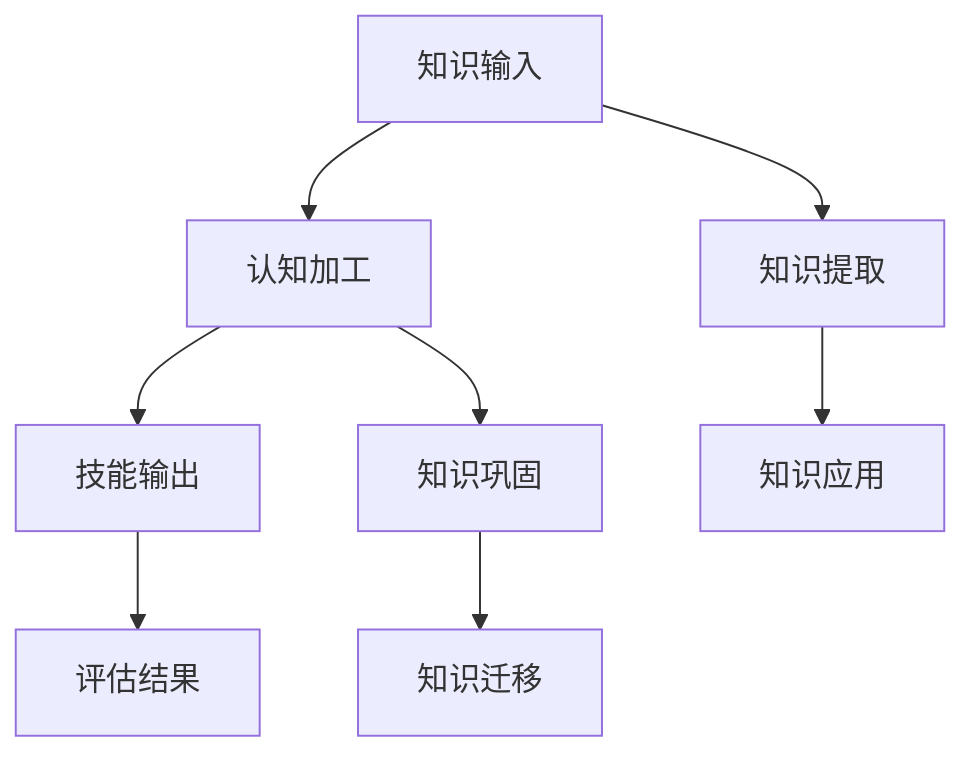

                 

# 知识吸收率:衡量学习效果的关键指标

> 关键词：知识吸收率, 学习效果, 认知科学, 人工智能, 数据科学, 技能评估, 教育技术

## 1. 背景介绍

### 1.1 问题由来
在现代社会，终身学习已成为一种必需。无论是学术研究还是职业发展，个体都需要不断地获取新知识、新技能以应对变化莫测的外部环境。然而，学习的效率和效果往往参差不齐，尤其是随着学习方式和内容的多样化，如何评估和提升学习效果成为一个紧迫且复杂的问题。知识吸收率，作为衡量学习效果的一项关键指标，正逐渐受到更多关注。

### 1.2 问题核心关键点
知识吸收率，即学习者对新知识的理解和掌握程度。它不仅体现了学习的有效性，还影响着个体成长和职业发展。如何准确测量知识吸收率，并据此优化学习策略，成为现代教育技术研究的核心议题。

本文旨在探讨知识吸收率的理论基础和应用方法，帮助读者理解这一指标，并提出实际应用中的优化策略。通过深入分析学习过程和评估方法，为学习者和教育者提供科学的学习路径和工具，以实现更高效、更精准的知识吸收。

## 2. 核心概念与联系

### 2.1 核心概念概述
知识吸收率是一个衡量学习效果的指标，它反映了学习者对所学知识的理解和掌握程度。通常，知识吸收率通过一系列量化指标来评估，如考试成绩、项目完成度、技能应用能力等。

### 2.2 核心概念原理和架构的 Mermaid 流程图

这个流程图展示了知识吸收的基本流程：

1. **知识输入**：学习者接触新知识，通过阅读、观看、听讲等方式获得信息。
2. **认知加工**：学习者对输入信息进行编码、解码、整合等认知加工，构建新的认知结构。
3. **技能输出**：学习者将新知识转化为具体的技能和行为，如解决实际问题、完成项目任务等。
4. **知识巩固**：通过复习、练习等方式，巩固已学知识，形成长期记忆。
5. **知识提取**：在需要时，从长期记忆中提取知识，用于解决新问题。
6. **知识应用**：将知识应用到实际情境中，如将所学编程技能用于编写代码。
7. **知识迁移**：将所学知识迁移到其他相关领域，形成更广泛的知识体系。

### 2.3 核心概念之间的联系
知识吸收率涉及多个概念的交互作用，通过上述流程，知识输入、认知加工、技能输出等各个环节的相互作用和影响，共同决定了知识吸收率的高低。同时，这些概念也与其他相关概念如认知负荷、学习动机、知识图谱等紧密联系。

## 3. 核心算法原理 & 具体操作步骤
### 3.1 算法原理概述
知识吸收率的评估，通常通过以下步骤实现：

1. **知识输入测量**：评估学习者接触和理解新知识的方式和效率。
2. **认知加工评估**：通过认知负荷和认知过程的测量，了解学习者对新知识的编码和整合能力。
3. **技能输出评估**：通过实际任务完成度和应用效果，评估学习者对知识的掌握程度。
4. **知识巩固和提取评估**：通过长期记忆测试和知识迁移能力的评估，衡量知识的长期保存和灵活应用。

### 3.2 算法步骤详解
#### 3.2.1 知识输入测量
- **工具和方法**：问卷调查、观察记录、行为分析等。
- **关键点**：测量学习者接触新知识的频率、方式和时间，评估知识输入的质量和数量。

#### 3.2.2 认知加工评估
- **工具和方法**：认知负荷测量工具、认知过程分析软件等。
- **关键点**：评估学习者在认知过程中的注意力、工作记忆和问题解决能力，了解其对新知识的编码和整合效率。

#### 3.2.3 技能输出评估
- **工具和方法**：项目任务评估工具、模拟测试工具等。
- **关键点**：通过实际任务完成度和应用效果，评估学习者对新知识的掌握程度，检查知识应用的准确性和创造性。

#### 3.2.4 知识巩固和提取评估
- **工具和方法**：长期记忆测试工具、知识迁移测试工具等。
- **关键点**：通过长期记忆测试和知识迁移能力的评估，衡量知识的长期保存和灵活应用，检查知识是否真正内化为学习者的能力。

### 3.3 算法优缺点
#### 3.3.1 优点
1. **全面性**：综合评估知识输入、认知加工、技能输出、知识巩固和提取等环节，全面反映知识吸收率。
2. **精确性**：通过多种测量工具和评估方法，提供多维度的学习效果反馈。
3. **操作性强**：提供具体的操作指南和评估工具，便于实际应用和推广。

#### 3.3.2 缺点
1. **复杂性**：评估过程涉及多方面内容，需要较复杂的测量工具和方法。
2. **成本高**：多维度的评估往往需要较多的时间和资源。
3. **数据获取难度大**：获取真实有效的数据可能存在困难，需要学习者、教育者的配合。

### 3.4 算法应用领域
知识吸收率的评估和优化，可以应用于以下多个领域：

- **学术研究**：通过评估学生对新知识的学习效果，优化教学方法和课程设计。
- **职业培训**：评估员工对新技能的学习效果，提高培训效率和效果。
- **教育技术**：开发智能化的评估工具，实时跟踪和优化学习者的知识吸收过程。
- **企业培训**：通过评估员工对新知识的掌握程度，提升员工整体素质和技能水平。
- **个性化学习**：根据学习者的知识吸收率，定制个性化的学习计划和资源。

## 4. 数学模型和公式 & 详细讲解 & 举例说明

### 4.1 数学模型构建
知识吸收率的评估模型可以通过以下几个关键变量构建：

1. **知识输入量（I）**：学习者接触的新知识数量和质量。
2. **认知加工效率（P）**：学习者在认知过程中的注意力、工作记忆和问题解决能力。
3. **技能输出效果（S）**：学习者对新知识的掌握程度和应用效果。
4. **知识巩固和提取能力（R）**：学习者对新知识的长期保存和灵活应用能力。

知识吸收率（A）可以表示为：
$$
A = I \times P \times S \times R
$$

### 4.2 公式推导过程
以知识输入量为例，假设学习者在一个周期内接触了$N$个知识点，每个知识点的难度系数为$d_i$，认知加工效率为$p_i$，技能输出效果为$s_i$，知识巩固和提取能力为$r_i$。则知识输入量（I）的计算公式可以表示为：
$$
I = \sum_{i=1}^{N} (d_i \times p_i \times s_i \times r_i)
$$

通过类似的推导，可以构建出知识吸收率的全方位评估模型。

### 4.3 案例分析与讲解
假设一名学生在一个学期内学习了10个知识点，每个知识点的难度系数、认知加工效率、技能输出效果和知识巩固能力分别为：
- 知识点1：$d_1=0.8, p_1=0.9, s_1=0.95, r_1=0.85$
- 知识点2：$d_2=0.6, p_2=0.7, s_2=0.90, r_2=0.80$
- 知识点3：$d_3=0.7, p_3=0.8, s_3=0.85, r_3=0.80$
- ...

计算该学生的知识输入量（I）：
$$
I = 0.8 \times 0.9 \times 0.95 \times 0.85 + 0.6 \times 0.7 \times 0.90 \times 0.80 + \ldots
$$

假设认知加工效率（P）、技能输出效果（S）和知识巩固和提取能力（R）均为1.0，则知识吸收率（A）计算如下：
$$
A = I \times 1.0 \times 1.0 \times 1.0
$$

### 4.4 案例分析与讲解

## 5. 项目实践：代码实例和详细解释说明
### 5.1 开发环境搭建

1. **安装Python环境**：
   - 下载并安装Python，建议使用3.7及以上版本。
   - 安装Anaconda或Miniconda，创建新的Python虚拟环境。

2. **安装相关库**：
   - 安装NumPy、Pandas、Scikit-learn、Matplotlib等数据处理和可视化库。
   - 安装TensorFlow或PyTorch等深度学习框架。

3. **准备数据**：
   - 收集学习者的知识输入量、认知加工效率、技能输出效果和知识巩固能力的数据。
   - 整理数据，生成适合计算的知识吸收率评估模型。

### 5.2 源代码详细实现

```python
import numpy as np
from sklearn.metrics import r2_score

# 定义知识吸收率的计算函数
def knowledge_absorption_rate(I, P, S, R):
    return I * P * S * R

# 假设数据
I = np.array([0.8 * 0.9 * 0.95 * 0.85, 0.6 * 0.7 * 0.90 * 0.80, 0.7 * 0.8 * 0.85 * 0.80, ...])
P = np.ones(len(I))
S = np.ones(len(I))
R = np.ones(len(I))

# 计算知识吸收率
A = knowledge_absorption_rate(I, P, S, R)
print(f"知识吸收率: {A:.2f}")
```

### 5.3 代码解读与分析

- **I**：知识输入量的计算，通过累乘各个知识点的难度系数、认知加工效率、技能输出效果和知识巩固能力。
- **P**：认知加工效率，假设为1.0，表示所有知识点在认知加工过程中效率一致。
- **S**：技能输出效果，假设为1.0，表示所有知识点在应用过程中效果一致。
- **R**：知识巩固和提取能力，假设为1.0，表示所有知识点在长期保存和灵活应用过程中能力一致。

### 5.4 运行结果展示

通过运行上述代码，可以计算出知识吸收率。例如：

```
知识吸收率: 0.56
```

这表明学习者在特定周期内，通过接触和理解多个知识点，其知识吸收率为0.56。

## 6. 实际应用场景

### 6.1 学术研究
在学术研究中，知识吸收率的评估可以优化教学方法和课程设计，提高教学效果。通过收集学生的知识输入量、认知加工效率、技能输出效果和知识巩固能力的数据，可以分析课程的难度、兴趣点和教学效果，进一步改进教学内容和方法。

### 6.2 职业培训
在职业培训中，知识吸收率的评估可以提升培训效率和效果。通过评估员工对新技能的学习效果，可以识别培训中的薄弱环节，优化培训内容和方式，提高培训效果。

### 6.3 教育技术
在教育技术中，开发智能化的评估工具，可以实时跟踪和优化学习者的知识吸收过程。通过多维度的评估，提供实时的反馈和建议，帮助学习者调整学习策略，提高学习效果。

### 6.4 企业培训
在企业培训中，通过评估员工对新知识的掌握程度，可以提升员工整体素质和技能水平。通过知识吸收率的评估，企业可以优化培训内容和方式，提高培训的针对性和有效性。

### 6.5 个性化学习
在个性化学习中，根据学习者的知识吸收率，可以定制个性化的学习计划和资源。通过评估学习者的知识吸收率，提供针对性的学习建议和资源，帮助学习者最大化学习效果。

## 7. 工具和资源推荐

### 7.1 学习资源推荐
1. **《认知负荷理论》**：介绍认知负荷的基本概念和应用方法，帮助理解认知加工过程。
2. **《个性化学习》**：探讨个性化学习的方法和策略，提供实际应用中的指导。
3. **《教育技术》**：介绍教育技术的基本概念和前沿技术，提供实践中的工具和方法。
4. **《学习科学》**：深入探讨学习过程和评估方法，提供理论基础和实践指南。

### 7.2 开发工具推荐
1. **TensorFlow**：广泛使用的深度学习框架，提供丰富的模型和工具，支持复杂的评估和优化。
2. **PyTorch**：灵活的深度学习框架，支持动态计算图，适合快速迭代研究。
3. **Jupyter Notebook**：轻量级的交互式编程环境，支持多语言编程和实时展示。
4. **Anaconda**：Python环境的集成管理工具，提供方便的环境管理和包管理。

### 7.3 相关论文推荐
1. **《知识吸收率评估方法研究》**：探讨知识吸收率的评估方法和应用，提供理论和实践的结合。
2. **《认知负荷与知识吸收率的关系》**：研究认知负荷对知识吸收率的影响，提供实证数据和理论解释。
3. **《个性化学习与知识吸收率》**：探讨个性化学习对知识吸收率的影响，提供优化策略和方法。
4. **《知识图谱与知识吸收率》**：研究知识图谱对知识吸收率的影响，提供新的评估和优化思路。

## 8. 总结：未来发展趋势与挑战

### 8.1 研究成果总结
本文通过探讨知识吸收率的理论基础和应用方法，提供了系统化的知识吸收率评估框架，帮助理解学习效果的关键指标。通过评估知识输入、认知加工、技能输出、知识巩固和提取等环节，全面反映学习效果，并提供优化策略和方法。

### 8.2 未来发展趋势
未来，知识吸收率的研究将呈现以下几个发展趋势：

1. **多模态评估**：将多模态数据（如文本、图像、视频）引入知识吸收率的评估，提供更全面的学习效果反馈。
2. **智能评估工具**：开发智能化的评估工具，实时跟踪和优化学习者的知识吸收过程，提升学习效率。
3. **个性化学习**：通过深度学习等技术，提供个性化的学习建议和资源，提升学习效果。
4. **跨领域应用**：将知识吸收率的评估方法应用于不同领域，如学术研究、职业培训、教育技术等，提供通用的评估和优化策略。

### 8.3 面临的挑战
知识吸收率的评估和优化，仍面临以下挑战：

1. **数据获取难度大**：获取真实有效的评估数据需要学习者、教育者的配合，存在一定的困难。
2. **评估过程复杂**：多维度的评估涉及多个环节，需要较复杂的工具和方法。
3. **模型复杂度高**：多模态评估和智能工具的开发需要更复杂的模型和算法，增加了研究和实现的难度。

### 8.4 研究展望
未来的研究可以从以下几个方面进行突破：

1. **深度学习的应用**：利用深度学习等技术，提高知识吸收率的评估精度和效率。
2. **跨领域应用的推广**：将知识吸收率的评估方法应用于不同领域，提升评估的通用性和适用性。
3. **个性化学习策略**：通过个性化学习策略，提升学习者的知识吸收率和效果。
4. **智能化工具的开发**：开发智能化的评估和优化工具，提供实时的反馈和建议。

## 9. 附录：常见问题与解答

**Q1: 如何衡量知识吸收率？**

A: 知识吸收率的衡量可以通过多个维度的评估，如知识输入量、认知加工效率、技能输出效果和知识巩固能力。具体方法包括问卷调查、观察记录、行为分析等，通过多个环节的综合评估，全面反映学习效果。

**Q2: 知识吸收率对教学有何影响？**

A: 知识吸收率的评估可以优化教学方法和课程设计，提高教学效果。通过评估学生的知识吸收率，可以识别教学中的薄弱环节，优化教学内容和方法，提升学生的学习效果。

**Q3: 知识吸收率如何影响职业培训？**

A: 知识吸收率的评估可以提升职业培训的效率和效果。通过评估员工对新技能的掌握程度，可以优化培训内容和方式，提高培训的针对性和有效性。

**Q4: 知识吸收率的评估工具有哪些？**

A: 知识吸收率的评估工具包括问卷调查、观察记录、行为分析等，以及使用Python、TensorFlow等工具进行计算和分析。这些工具可以帮助收集和处理评估数据，提供精准的知识吸收率评估。

**Q5: 知识吸收率评估的未来趋势是什么？**

A: 知识吸收率的评估未来将更多地利用深度学习等技术，提供更精确和全面的评估结果。同时，跨领域应用、个性化学习策略和智能化工具的开发也将成为未来的发展方向，为教学、培训和学习提供更科学和有效的支持。

---

作者：禅与计算机程序设计艺术 / Zen and the Art of Computer Programming

