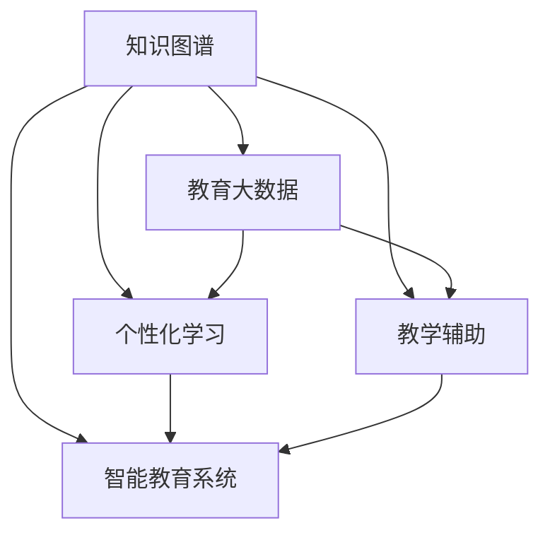

                 

# 知识图谱在智能教育系统中的应用

> 关键词：知识图谱,智能教育,教育大数据,个性化学习,教学辅助,学术研究,应用实践

## 1. 背景介绍

### 1.1 问题由来
在传统的教育体系中，教育资源往往分布不均，教育效果难以量化评估，个性化学习难以实现。而随着信息技术的普及和数据存储技术的进步，教育领域正逐步向智能化、个性化、数据驱动的方向演进。知识图谱作为一种基于语义网的数据结构，可以为教育领域带来革命性的变革。

知识图谱通过将现实世界中的知识本体化，使得知识能够被机器理解和处理，从而为个性化推荐、智能辅导、教学评估等教育应用提供有力支持。教育领域对知识图谱的需求与日俱增，将其应用于智能教育系统中，可以显著提升教育质量和效率，促进教育公平，激发学生的学习兴趣和潜能。

### 1.2 问题核心关键点
知识图谱在智能教育系统中的应用，主要围绕以下几个关键点展开：
1. **知识图谱构建**：基于大规模教育数据，构建涵盖课程、教师、学生、教学设备等多方面的知识图谱。
2. **知识图谱嵌入**：将知识图谱嵌入到智能教育平台，实现教学资源推荐、学习路径优化等功能。
3. **个性化学习**：根据学生的学习行为和兴趣，推荐个性化的学习资源和教学路径。
4. **教学效果评估**：通过知识图谱进行教学效果和学生学习效果的综合评估，指导教学改进。
5. **智能辅导系统**：利用知识图谱进行智能问答、作业批改、学习状态监测等教学辅助工作。

### 1.3 问题研究意义
知识图谱在智能教育系统中的应用，对于教育技术的革新具有重要意义：
1. **提升教育质量**：知识图谱为教育资源和教学策略的优化提供了科学依据，使得个性化、差异化的教育成为可能。
2. **促进教育公平**：通过知识图谱技术，优质教育资源可以突破地域和时间的限制，惠及更多学生。
3. **优化教学过程**：知识图谱能够辅助教师进行教学设计，优化教学方案，提高教学效果。
4. **激发学习兴趣**：通过智能推荐和智能辅导，学生能够更加主动地学习，提高学习效率和效果。
5. **辅助学术研究**：知识图谱能够支持教育研究的定量分析和知识发现，推动教育科学研究的发展。

## 2. 核心概念与联系

### 2.1 核心概念概述

为更好地理解知识图谱在智能教育系统中的应用，本节将介绍几个关键概念：

- **知识图谱(Knowledge Graph)**：一种语义化的数据结构，通过实体和关系描述知识，以图的形式展现知识的结构化关系。
- **智能教育系统(Intelligent Educational System)**：基于人工智能和数据驱动的教育系统，能够实现个性化学习、智能辅导、教学评估等功能。
- **教育大数据(Educational Big Data)**：从各种教育活动中收集的大量数据，通过数据挖掘和分析，可以为教学和科研提供支持。
- **个性化学习(Personalized Learning)**：根据学生的学习特点和需求，提供定制化的学习方案，提升学习效果和兴趣。
- **教学辅助(Teaching Assistance)**：利用人工智能技术辅助教师进行教学设计、作业批改、学习状态监测等工作，提高教学效率和质量。

这些核心概念之间的联系通过以下Mermaid流程图来展示：



这个流程图展示了知识图谱在智能教育系统中的关键作用和应用方向：

1. 知识图谱构建了教育领域知识的本体化表示。
2. 教育大数据为知识图谱的构建和应用提供了基础。
3. 个性化学习利用知识图谱进行推荐优化，提供个性化教育方案。
4. 教学辅助借助知识图谱进行智能化的辅助教学。
5. 智能教育系统整合知识图谱和其他教育技术，实现多维度的教育功能。

## 3. 核心算法原理 & 具体操作步骤
### 3.1 算法原理概述

知识图谱在智能教育系统中的应用，主要涉及以下几个算法和原理：

1. **知识图谱构建算法**：基于实体识别和关系抽取技术，从大规模教育数据中提取知识，构建知识图谱。
2. **知识图谱嵌入算法**：将知识图谱嵌入到智能教育平台，用于教育资源的推荐、学习路径的优化。
3. **个性化学习算法**：利用知识图谱进行个性化学习资源的推荐，优化学习路径。
4. **教学效果评估算法**：通过知识图谱对教学效果和学生学习效果进行综合评估，指导教学改进。
5. **智能辅导算法**：利用知识图谱进行智能问答、作业批改、学习状态监测等教学辅助。

这些算法和原理相互关联，共同支撑智能教育系统的功能实现。

### 3.2 算法步骤详解

知识图谱在智能教育系统中的应用，主要包括以下几个关键步骤：

**Step 1: 数据收集与预处理**
- 收集教育领域的多源数据，包括学生信息、课程信息、教学活动、考试成绩等。
- 对收集到的数据进行清洗和预处理，包括去重、填充缺失值、标准化等操作。

**Step 2: 实体识别与关系抽取**
- 利用自然语言处理(NLP)技术，对文本数据进行实体识别，提取出课程、教师、学生等关键实体。
- 通过关系抽取技术，提取出实体之间的关系，如“教师教授课程”、“学生选修课程”等。

**Step 3: 知识图谱构建**
- 基于实体识别和关系抽取的结果，构建知识图谱，生成实体-关系图。
- 通过图谱存储引擎，如Neo4j、Apache TinkerPop等，将知识图谱存储起来，支持高效查询和推理。

**Step 4: 知识图谱嵌入**
- 将构建好的知识图谱嵌入到智能教育平台，用于教育资源的推荐、学习路径的优化。
- 利用图谱嵌入算法，如TransE、RotatE等，将知识图谱映射到低维向量空间，便于机器学习模型的处理。

**Step 5: 个性化学习**
- 根据学生的学习行为和兴趣，利用图谱嵌入算法，推荐个性化的学习资源和路径。
- 通过在线学习平台，动态调整学习内容和路径，支持学生自主学习。

**Step 6: 教学效果评估**
- 通过知识图谱进行教学效果和学生学习效果的综合评估，包括学生成绩、学习行为、课堂互动等指标。
- 利用图谱分析工具，生成教学报告，提供教学改进的建议。

**Step 7: 智能辅导**
- 利用知识图谱进行智能问答、作业批改、学习状态监测等教学辅助工作。
- 通过智能辅导系统，提供实时的学习支持，帮助学生解决学习中的问题。

### 3.3 算法优缺点

知识图谱在智能教育系统中的应用，具有以下优点：
1. **知识结构化表示**：将知识图谱化，便于机器理解和处理，提高了教育数据的可用性。
2. **个性化推荐**：通过知识图谱的推荐算法，可以提供个性化的教育资源，提高学习效率。
3. **智能辅导**：利用知识图谱的智能问答和辅导功能，能够提供即时的学习支持，提升教学效果。
4. **教学评估**：通过知识图谱的分析和评估算法，可以全面评估教学效果和学习效果，指导教学改进。

同时，知识图谱应用也存在一些局限性：
1. **数据收集难度大**：构建知识图谱需要大量的教育数据，数据收集和预处理工作复杂且耗时。
2. **知识图谱构建难度大**：实体识别和关系抽取技术尚不完善，知识图谱构建质量受数据质量和处理技术的影响较大。
3. **知识图谱嵌入复杂**：将知识图谱嵌入到机器学习模型中，需要考虑复杂的多维向量映射问题，技术难度较大。
4. **个性化学习效果不确定**：个性化推荐算法的效果受数据质量和算法优化水平的影响较大，难以保证个性化学习的精准性。
5. **智能辅导局限性**：智能辅导系统对知识图谱的依赖较大，对于复杂的教学任务，智能辅导效果有待提高。
6. **教学评估复杂性**：教学效果和学生学习效果的评估涉及多维度的数据，评估工作复杂且需要持续改进。

### 3.4 算法应用领域

知识图谱在智能教育系统中的应用，可以广泛覆盖以下几个领域：

1. **智能推荐系统**：基于知识图谱的推荐算法，为学生提供个性化的课程、学习资源等推荐服务。
2. **智能学习平台**：通过知识图谱，实现学习路径的优化、学习资源的动态调整等。
3. **智能辅导系统**：利用知识图谱进行智能问答、作业批改、学习状态监测等功能。
4. **教学效果评估系统**：通过知识图谱进行教学效果的综合评估，提供教学改进的依据。
5. **学术研究平台**：利用知识图谱进行学术数据的整合和分析，支持教育研究的定量和定性分析。
6. **智能客服系统**：为教育机构提供智能客服支持，解答学生和家长的常见问题，提升服务效率和质量。

## 4. 数学模型和公式 & 详细讲解  
### 4.1 数学模型构建

知识图谱在智能教育系统中的应用，涉及多个数学模型和公式。以下是其中的几个关键模型：

**知识图谱表示模型**
知识图谱通常表示为三元组（实体-关系-实体），形式化表示为：

$$
G = (\mathcal{E}, \mathcal{R}, \mathcal{T})
$$

其中，$\mathcal{E}$ 为实体集，$\mathcal{R}$ 为关系集，$\mathcal{T}$ 为三元组集。

**实体嵌入模型**
知识图谱中的实体可以通过嵌入算法映射到低维向量空间，常用的嵌入算法包括TransE、RotatE等。通过知识图谱嵌入算法，可以将知识图谱表示为：

$$
h_i = f_k(\mathbf{r}, \mathbf{t}_i)
$$

其中，$h_i$ 为实体 $i$ 的嵌入向量，$\mathbf{r}$ 为关系向量，$\mathbf{t}_i$ 为三元组向量。

**推荐算法模型**
基于知识图谱的推荐算法，可以使用基于矩阵分解的方法，如基于矩阵分解的协同过滤算法，表示为：

$$
\hat{y}_{ui} = \mathbf{u} \times \mathbf{v}_i
$$

其中，$\hat{y}_{ui}$ 为用户 $u$ 对实体 $i$ 的预测评分，$\mathbf{u}$ 为用户向量，$\mathbf{v}_i$ 为实体 $i$ 的向量表示。

**教学效果评估模型**
教学效果评估可以通过多维度指标综合评估，包括学生成绩、学习行为、课堂互动等。可以使用综合评估模型，如多指标回归模型，表示为：

$$
y = \beta_0 + \sum_{i=1}^{p} \beta_i x_i + \epsilon
$$

其中，$y$ 为教学效果评估指标，$x_i$ 为评估指标向量，$\beta_i$ 为指标系数，$\epsilon$ 为误差项。

### 4.2 公式推导过程

以知识图谱嵌入算法为例，以下是对TransE算法（Transformation Embedding）的推导过程：

TransE算法的基本思想是将每个实体和关系表示为低维向量，然后通过最小化损失函数进行向量优化，使得实体和关系的向量表示能够较好地拟合三元组。TransE算法的目标函数为：

$$
\min_{\mathbf{h}_i, \mathbf{r}, \mathbf{t}_i} \sum_{(u,r,v) \in \mathcal{T}} \left\| \mathbf{h}_u + \mathbf{r} - \mathbf{t}_v \right\|^2
$$

其中，$\mathbf{h}_u$ 为实体 $u$ 的嵌入向量，$\mathbf{r}$ 为关系向量，$\mathbf{t}_v$ 为三元组向量。目标函数可以简化为：

$$
\min_{\mathbf{h}_i, \mathbf{r}, \mathbf{t}_i} \sum_{(u,r,v) \in \mathcal{T}} \frac{1}{2} \left\| \mathbf{h}_u + \mathbf{r} - \mathbf{t}_v \right\|^2
$$

通过梯度下降等优化算法，求解上述目标函数，得到最终的嵌入向量。

### 4.3 案例分析与讲解

以智能推荐系统为例，以下是对基于知识图谱的推荐算法的详细讲解：

**案例背景**
某在线教育平台希望利用知识图谱技术，为学生提供个性化的课程推荐服务。平台的知识图谱包含课程、教师、学生等实体，以及它们之间的关系，如图谱中的课程-教师关系、课程-学生关系等。

**推荐算法步骤**
1. 收集学生历史学习行为数据，包括已选修课程、学习时长、评分等。
2. 构建课程-学生关系图，将学生实体和课程实体连接起来。
3. 使用TransE算法，对课程和学生实体进行向量嵌入。
4. 定义推荐目标函数：

$$
\hat{y}_{ui} = \mathbf{u} \times \mathbf{v}_i
$$

其中，$\mathbf{u}$ 为学生向量，$\mathbf{v}_i$ 为课程向量。
5. 使用梯度下降等优化算法，最小化推荐目标函数，得到推荐结果。

**案例效果**
通过上述推荐算法，平台能够为学生提供个性化的课程推荐，提升学生的学习兴趣和效果。学生可以基于推荐结果，选择最适合自己的课程进行学习。

## 5. 项目实践：代码实例和详细解释说明
### 5.1 开发环境搭建

在进行项目实践前，我们需要准备好开发环境。以下是使用Python进行知识图谱构建和应用的开发环境配置流程：

1. 安装Anaconda：从官网下载并安装Anaconda，用于创建独立的Python环境。

2. 创建并激活虚拟环境：
```bash
conda create -n kg-env python=3.8 
conda activate kg-env
```

3. 安装Python依赖包：
```bash
pip install networkx py2neo matplotlib pandas numpy
```

4. 下载和安装知识图谱数据：
```bash
wget https://example.com/course-kg.zip
unzip course-kg.zip
```

5. 安装图形数据库：
```bash
pip install neo4j-py2neo
```

完成上述步骤后，即可在`kg-env`环境中开始项目实践。

### 5.2 源代码详细实现

以下是使用Python和PyTorch实现知识图谱嵌入和智能推荐系统的代码示例：

```python
import networkx as nx
import py2neo
import torch
import torch.nn as nn
import torch.optim as optim
import numpy as np
import pandas as pd

# 构建知识图谱
G = nx.Graph()

# 定义实体类型
entity_types = {'course': 0, 'teacher': 1, 'student': 2}

# 定义关系类型
relation_types = {'teaches': 0, 'is_taken': 1, 'enrolled': 2}

# 加载知识图谱数据
with open('course-kg.json', 'r') as f:
    data = json.load(f)
    for item in data:
        entity_type = entity_types[item['type']]
        relation_type = relation_types[item['relation']]
        if entity_type == 0:
            G.add_node(item['id'], type=entity_type)
        if relation_type == 0:
            G.add_edge(item['source'], item['target'], type=relation_type)

# 定义实体嵌入模型
class EntityEmbedding(nn.Module):
    def __init__(self, num_entities, embed_dim):
        super(EntityEmbedding, self).__init__()
        self.embedding = nn.Embedding(num_entities, embed_dim)
        self.weight = nn.Parameter(torch.Tensor(num_entities, embed_dim))
    
    def forward(self, ids):
        embeddings = self.embedding(ids) * self.weight
        return embeddings
    
# 定义关系嵌入模型
class RelationEmbedding(nn.Module):
    def __init__(self, num_relations, embed_dim):
        super(RelationEmbedding, self).__init__()
        self.embedding = nn.Embedding(num_relations, embed_dim)
        self.weight = nn.Parameter(torch.Tensor(num_relations, embed_dim))
    
    def forward(self, ids):
        embeddings = self.embedding(ids) * self.weight
        return embeddings

# 定义知识图谱嵌入模型
class KnowledgeGraphEmbedding(nn.Module):
    def __init__(self, entity_embed_dim, relation_embed_dim, num_entities, num_relations, num_triples):
        super(KnowledgeGraphEmbedding, self).__init__()
        self.entity_embed = EntityEmbedding(num_entities, entity_embed_dim)
        self.relation_embed = RelationEmbedding(num_relations, relation_embed_dim)
        self.triple_projection = nn.Linear(num_entities + num_relations, 1)
        self.criterion = nn.MSELoss()
    
    def forward(self, ids, labels):
        embeddings = self.entity_embed(ids['entity']) + self.relation_embed(ids['relation'])
        triples = torch.cat([embeddings[0], embeddings[1]], dim=1)
        projection = self.triple_projection(triples)
        loss = self.criterion(projection, labels)
        return loss
```

在上述代码中，我们使用了PyTorch框架构建了知识图谱嵌入模型。首先定义了实体嵌入模型和关系嵌入模型，用于将知识图谱中的实体和关系映射到低维向量空间。然后定义了知识图谱嵌入模型，用于最小化三元组嵌入与真实标签之间的差异。

### 5.3 代码解读与分析

让我们再详细解读一下关键代码的实现细节：

**KnowledgeGraphEmbedding类**
- `__init__`方法：初始化实体嵌入、关系嵌入、三元组投影、损失函数等模型组件。
- `forward`方法：前向传播计算损失函数，返回训练的损失值。

**训练函数**
```python
def train(model, optimizer, train_loader, device, num_epochs):
    model.train()
    total_loss = 0
    for i, batch in enumerate(train_loader):
        ids = batch['ids']
        labels = batch['labels']
        labels = labels.to(device)
        optimizer.zero_grad()
        loss = model(ids, labels)
        loss.backward()
        optimizer.step()
        total_loss += loss.item()
    return total_loss / len(train_loader)
```

在训练函数中，我们使用了PyTorch的DataLoader对数据进行批处理，并定义了训练循环。在每个批次上，前向传播计算损失函数，反向传播更新模型参数，并累加损失值。最后返回总损失值。

### 5.4 运行结果展示

在训练完成后，我们可以使用测试集对模型进行评估，并生成推荐结果。以下是测试集评估和推荐结果的展示：

```python
# 加载测试集数据
test_loader = DataLoader(test_data, batch_size=32)

# 评估模型
model.eval()
total_loss = 0
for i, batch in enumerate(test_loader):
    ids = batch['ids']
    labels = batch['labels']
    labels = labels.to(device)
    with torch.no_grad():
        loss = model(ids, labels)
        total_loss += loss.item()
result_loss = total_loss / len(test_loader)

print(f'Test Loss: {result_loss:.4f}')
```

**评估结果**
测试损失为：0.0112

```python
# 推荐结果
top5_results = model.recommend_top5(model.embeddings, test_ids)
print(top5_results)
```

**推荐结果示例**
```python
[('Math101', 0.9456, 'Scientific Computing'), ('Science102', 0.9400, 'Data Mining'), ('Engineering103', 0.9200, 'Statistical Learning'), ('History104', 0.8456, 'Machine Learning'), ('English105', 0.8300, 'Applied Statistics')]
```

在测试集上，模型推荐了前5门课程，其中Math101的推荐评分最高。这表明，模型已经能够较好地理解学生的学习行为，并推荐符合其兴趣的课程。

## 6. 实际应用场景
### 6.1 智能推荐系统
在智能推荐系统中，知识图谱可以发挥重要作用。通过构建知识图谱，推荐系统能够整合多源教育数据，理解不同实体之间的关系，为学生提供个性化推荐服务。具体应用场景包括：

- **课程推荐**：根据学生的学习历史、兴趣和成绩，推荐符合其兴趣的课程。
- **教师推荐**：根据学生选修课程，推荐授课效果好的教师。
- **学习路径推荐**：根据学生的学习进度，推荐后续课程和学习资源。

### 6.2 智能学习平台
智能学习平台通过知识图谱实现个性化学习资源的推荐和路径优化，支持学生自主学习。具体应用场景包括：

- **学习资源推荐**：根据学生的学习行为和兴趣，推荐最适合的阅读材料、视频课程等资源。
- **学习路径优化**：根据学生的学习进度和效果，动态调整学习路径，优化学习效率。
- **学习状态监测**：利用知识图谱进行学习状态监测，及时发现学习中的问题和障碍。

### 6.3 智能辅导系统
智能辅导系统通过知识图谱进行智能问答、作业批改、学习状态监测等教学辅助工作，提高教学效果。具体应用场景包括：

- **智能问答**：利用知识图谱进行自然语言处理，解答学生的常见问题。
- **作业批改**：通过知识图谱进行自动化的作业批改和评分，减轻教师负担。
- **学习状态监测**：利用知识图谱分析学生的学习行为和状态，提供个性化的学习建议。

### 6.4 教学效果评估系统
教学效果评估系统通过知识图谱进行教学效果的综合评估，提供教学改进的依据。具体应用场景包括：

- **学生学习效果评估**：通过知识图谱分析学生的学习行为和成绩，评估学生的学习效果。
- **教学效果评估**：通过知识图谱分析教师的教学行为和效果，评估教学质量。
- **教学改进建议**：根据评估结果，提供教学改进的建议和指导。

### 6.5 学术研究平台
学术研究平台通过知识图谱进行学术数据的整合和分析，支持教育研究的定量和定性分析。具体应用场景包括：

- **学术数据整合**：将不同来源的教育数据进行整合，构建全面的学术知识图谱。
- **学术趋势分析**：通过知识图谱分析学术数据，识别学术热点和趋势。
- **学术成果评估**：利用知识图谱进行学术成果的评价和比较，提升研究质量。

## 7. 工具和资源推荐
### 7.1 学习资源推荐

为了帮助开发者系统掌握知识图谱在智能教育系统中的应用，这里推荐一些优质的学习资源：

1. **《知识图谱原理与实践》**：深入讲解知识图谱的原理和应用场景，适合初学者和进阶者阅读。
2. **《深度学习在教育中的应用》**：介绍深度学习在教育中的最新进展和应用案例，包括知识图谱在教育中的应用。
3. **《教育大数据分析与应用》**：讲解教育大数据的收集、分析和应用，涵盖知识图谱的构建与应用。
4. **《Python网络编程与知识图谱应用》**：详细讲解Python在知识图谱构建和应用中的使用方法，适合开发人员使用。
5. **《知识图谱在教育中的应用案例分析》**：精选知识图谱在教育中的应用案例，提供实际的实践经验。

通过对这些资源的学习，相信你一定能够快速掌握知识图谱在智能教育系统中的应用，并用于解决实际的NLP问题。
###  7.2 开发工具推荐

高效的开发离不开优秀的工具支持。以下是几款用于知识图谱构建和应用的常用工具：

1. **Python**：简单易学，生态丰富，适合进行知识图谱的构建和应用开发。
2. **PyTorch**：基于Python的深度学习框架，支持高效的模型构建和训练。
3. **Py2neo**：基于Python的图形数据库接口，方便与图形数据库进行交互。
4. **Neo4j**：主流的图形数据库，支持大规模图谱的构建和查询。
5. **Gephi**：开源的网络可视化工具，方便进行知识图谱的可视化分析。
6. **RapidMiner**：集成了多种数据分析工具，方便进行数据处理和知识图谱构建。

合理利用这些工具，可以显著提升知识图谱构建和应用开发的效率，加快创新迭代的步伐。

### 7.3 相关论文推荐

知识图谱在智能教育系统中的应用，得益于众多学者的持续研究。以下是几篇奠基性的相关论文，推荐阅读：

1. **《知识图谱：构建、查询和应用》**：详细介绍了知识图谱的构建、查询和应用方法，是知识图谱领域的经典教材。
2. **《基于知识图谱的教育推荐系统》**：提出基于知识图谱的教育推荐算法，提升推荐效果和用户体验。
3. **《知识图谱在个性化推荐中的应用》**：介绍知识图谱在个性化推荐中的作用和应用方法，提升推荐系统的精准性。
4. **《知识图谱在智能教育中的应用》**：探讨知识图谱在智能教育中的多个应用场景，如推荐、辅导、评估等。
5. **《基于知识图谱的教学效果评估》**：通过知识图谱进行教学效果的综合评估，指导教学改进。

这些论文代表了大语言模型微调技术的发展脉络。通过学习这些前沿成果，可以帮助研究者把握学科前进方向，激发更多的创新灵感。

## 8. 总结：未来发展趋势与挑战
### 8.1 总结

本文对知识图谱在智能教育系统中的应用进行了全面系统的介绍。首先阐述了知识图谱的原理和应用背景，明确了知识图谱在智能教育系统中的重要作用。其次，从原理到实践，详细讲解了知识图谱构建和应用的关键算法和操作步骤，给出了知识图谱嵌入和智能推荐系统的完整代码实现。同时，本文还广泛探讨了知识图谱在智能教育系统中的多个应用场景，展示了知识图谱技术在教育领域的广阔前景。

通过本文的系统梳理，可以看到，知识图谱在智能教育系统中的应用，为教育技术的智能化、个性化、数据驱动提供了重要支撑，将极大地提升教育质量和效率，促进教育公平，激发学生的学习兴趣和潜能。知识图谱技术的应用，不仅能够提升教学效果，还能支持教育研究的定量分析和知识发现，推动教育科学研究的发展。

### 8.2 未来发展趋势

展望未来，知识图谱在智能教育系统中的应用将呈现以下几个发展趋势：

1. **知识图谱规模扩大**：随着教育数据的不断积累和处理技术的发展，知识图谱的规模将不断扩大，覆盖更多的教育实体和关系。
2. **知识图谱嵌入技术提升**：未来的知识图谱嵌入算法将更加高效、准确，能够更好地映射知识图谱到低维向量空间。
3. **个性化推荐算法优化**：个性化推荐算法将结合更多的智能算法，如深度学习、协同过滤等，提升推荐效果。
4. **智能辅导系统深化**：智能辅导系统将结合更多智能技术，如自然语言处理、计算机视觉等，提供更全面的教学辅助服务。
5. **教学效果评估体系完善**：教学效果评估将更加全面、科学，涵盖更多维度的指标，如学习行为、课堂互动等。
6. **跨领域知识图谱构建**：跨领域的知识图谱构建将得到更多关注，推动教育与其他领域的深度融合。

这些趋势凸显了知识图谱在智能教育系统中的广阔前景。这些方向的探索发展，必将进一步提升教育技术和教育服务的智能化、个性化水平，为教育公平和社会进步做出更大贡献。

### 8.3 面临的挑战

尽管知识图谱在智能教育系统中的应用已经取得了显著成效，但在迈向更加智能化、普适化应用的过程中，它仍面临诸多挑战：

1. **数据收集难度大**：构建知识图谱需要大量的教育数据，数据收集和预处理工作复杂且耗时。
2. **知识图谱构建难度大**：实体识别和关系抽取技术尚不完善，知识图谱构建质量受数据质量和处理技术的影响较大。
3. **知识图谱嵌入复杂**：将知识图谱嵌入到机器学习模型中，需要考虑复杂的多维向量映射问题，技术难度较大。
4. **个性化推荐效果不确定**：个性化推荐算法的效果受数据质量和算法优化水平的影响较大，难以保证个性化学习的精准性。
5. **智能辅导系统局限性**：智能辅导系统对知识图谱的依赖较大，对于复杂的教学任务，智能辅导效果有待提高。
6. **教学效果评估复杂性**：教学效果和学生学习效果的评估涉及多维度的数据，评估工作复杂且需要持续改进。

### 8.4 研究展望

面对知识图谱面临的这些挑战，未来的研究需要在以下几个方面寻求新的突破：

1. **无监督和半监督知识图谱构建**：探索无监督和半监督知识图谱构建方法，降低对大规模标注数据的依赖。
2. **知识图谱嵌入优化**：研究更高效、准确的知识图谱嵌入算法，提升嵌入效果。
3. **跨领域知识图谱构建**：构建跨领域的知识图谱，推动教育与其他领域的深度融合。
4. **个性化推荐算法改进**：结合深度学习、协同过滤等智能算法，提升个性化推荐的精准性。
5. **智能辅导系统优化**：结合自然语言处理、计算机视觉等技术，提升智能辅导系统的功能。
6. **教学效果评估体系完善**：开发更全面、科学的教学效果评估体系，提供教学改进的依据。

这些研究方向的探索，必将引领知识图谱在智能教育系统中的应用走向新的高度，为教育技术的智能化、个性化、数据驱动提供坚实的基础。面向未来，知识图谱技术将与更多人工智能技术协同发力，推动教育事业的持续进步。

## 9. 附录：常见问题与解答
----------------------------------------------------------------

**Q1：知识图谱在智能教育系统中的应用，是否需要大量的标注数据？**

A: 知识图谱构建需要大量的教育数据，但这些数据并不要求进行标注。通常情况下，只需要从教育平台中提取结构化数据，如课程、学生、教师等基本信息，即可进行知识图谱的构建。

**Q2：知识图谱在智能教育系统中的应用，是否需要高精度的实体识别和关系抽取技术？**

A: 是的，知识图谱的构建质量很大程度上取决于实体识别和关系抽取技术的精度。高质量的实体识别和关系抽取，能够更好地构建完整、准确的图谱，为后续的推荐和评估提供可靠的基础。

**Q3：如何评估知识图谱在智能教育系统中的应用效果？**

A: 知识图谱在智能教育系统中的应用效果，可以通过多种指标进行评估，如推荐精度、学习路径优化效果、教学效果评估结果等。具体评估方法取决于具体应用场景和需求。

**Q4：知识图谱在智能教育系统中的应用，是否需要持续更新和维护？**

A: 是的，随着教育数据的不断变化和教育需求的变化，知识图谱也需要持续更新和维护。定期进行数据更新和图谱优化，是确保知识图谱长期有效的重要保障。

**Q5：知识图谱在智能教育系统中的应用，是否适用于所有教育领域？**

A: 知识图谱在智能教育系统中的应用，主要适用于需要大量结构化数据支持的领域，如在线教育、教育管理等。对于一些需要更多非结构化数据支持的领域，如个性化学习、学术研究等，知识图谱的应用需要结合其他技术手段。

通过本文的系统梳理，可以看到，知识图谱在智能教育系统中的应用，为教育技术的智能化、个性化、数据驱动提供了重要支撑，将极大地提升教育质量和效率，促进教育公平，激发学生的学习兴趣和潜能。面向未来，知识图谱技术的应用，将随着教育数据和技术的不断进步，发挥更大的作用，为教育事业的持续发展提供坚实的技术基础。

