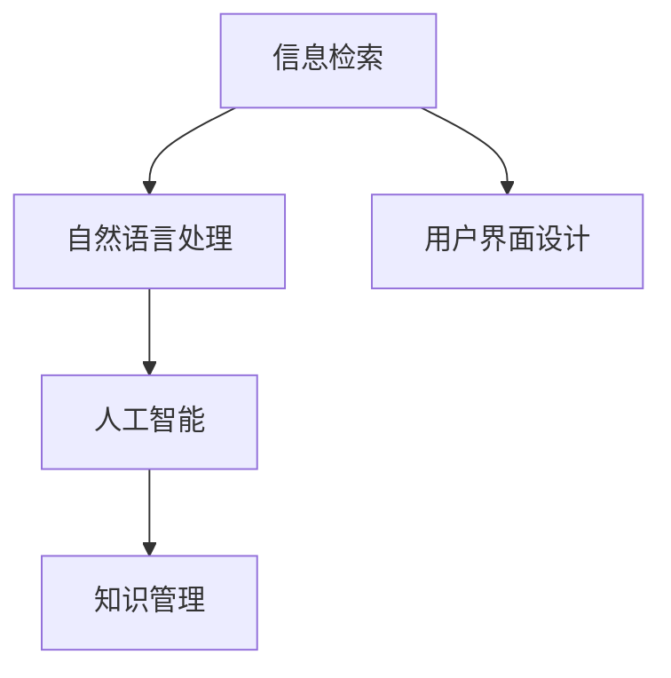

                 

## 1. 背景介绍

### 1.1 问题由来

伴随着全球人口老龄化的趋势，老年群体的知识需求和信息消费日益增长。老年人在认知、身体等方面存在一定限制，信息检索、获取和处理能力较差，难以适应快速变化的信息社会环境。同时，随着互联网和数字技术的普及，信息爆炸带来的“信息贫困”问题也日益突出。这些问题亟需通过技术手段解决，以保障老年人的信息权利，提升其生活质量，促进社会和谐发展。

### 1.2 问题核心关键点

应对知识型老龄化社会的关键在于：

1. **信息可及性**：如何使老年人更容易获取和使用信息，降低信息获取成本。
2. **信息可理解性**：如何简化信息展示方式，使其更符合老年人的认知模式和阅读习惯。
3. **信息可获得性**：如何通过技术手段，提高老年人在互联网上搜索、阅读和获取信息的便利性。
4. **知识共享**：如何搭建平台，促进老年人之间的知识交流和学习，提升社区凝聚力。
5. **持续学习**：如何鼓励老年人持续学习和获取新知识，保持其知识更新和技能提升。

本文将重点讨论如何通过技术手段，提升信息可及性、可理解性和可获得性，同时促进老年人之间的知识共享和持续学习，构建和谐的知识型老龄化社会。

## 2. 核心概念与联系

### 2.1 核心概念概述

为更好地理解本问题的技术解决方案，本节将介绍几个密切相关的核心概念：

- **信息检索(Information Retrieval, IR)**：帮助用户从大量文本、图片、视频等数据中检索出相关信息的系统。
- **自然语言处理(Natural Language Processing, NLP)**：研究如何让计算机理解和生成人类语言的技术，包括文本分类、信息抽取、机器翻译等。
- **用户界面设计(User Interface Design, UI)**：设计信息系统的交互界面，使其更直观、易用，符合用户认知模式。
- **人工智能(Artificial Intelligence, AI)**：通过机器学习、深度学习等技术，构建智能信息检索、推荐、分析等系统的过程。
- **知识管理(Knowledge Management, KM)**：帮助组织和个人收集、整理、存储和共享知识的系统，促进知识的积累和传承。

这些概念之间的逻辑关系可以通过以下Mermaid流程图来展示：



这个流程图展示了几大核心概念之间的相互关系：

1. 信息检索和自然语言处理是构建智能信息系统的基础，通过分析用户的查询，检索相关内容。
2. 用户界面设计使系统更易用，符合用户认知模式。
3. 人工智能技术提升信息检索、推荐、分析的智能化水平。
4. 知识管理促进知识的积累和传承，通过平台促进信息共享和持续学习。

这些概念共同构成了构建知识型老龄化社会的信息技术框架，使其能够更好地满足老年人的信息需求。

## 3. 核心算法原理 & 具体操作步骤

### 3.1 算法原理概述

针对知识型老龄化社会的应对策略，核心算法原理主要包括：

- **信息检索算法**：通过分析用户的查询，从大规模数据集中检索相关信息。
- **自然语言处理技术**：包括文本分类、信息抽取、问答系统等，提升信息检索的准确性和相关性。
- **用户界面设计**：简化操作流程，提供直观的交互界面，使老年人更容易使用。
- **知识图谱构建**：通过知识图谱技术，构建和关联各类知识节点，促进知识共享和检索。
- **个性化推荐系统**：基于用户行为和偏好，推荐适合的信息和内容，提高信息获取的便利性。

### 3.2 算法步骤详解

以下是详细的算法步骤：

**Step 1: 数据采集与预处理**
- 收集各类信息源，如新闻、视频、图片、文档等。
- 对数据进行去重、清洗、分词、标引等预处理操作。

**Step 2: 信息检索与推荐**
- 根据用户查询，利用信息检索算法检索相关信息。
- 使用自然语言处理技术，对检索结果进行分类、抽取和标注。
- 结合个性化推荐算法，为用户推荐相关内容。

**Step 3: 用户界面设计**
- 简化操作流程，提供简洁明了的交互界面。
- 设计易用的导航结构，便于老年人浏览和查找信息。
- 增加语音识别、自动纠错等辅助功能，降低操作难度。

**Step 4: 知识图谱构建**
- 构建知识图谱，将各类知识节点关联起来，如人物、事件、地点等。
- 引入专家知识库，丰富知识图谱的内容和深度。
- 通过知识图谱技术，实现知识检索和关联。

**Step 5: 知识共享与持续学习**
- 搭建知识共享平台，促进老年人之间的知识交流和学习。
- 引入在线课程、培训视频等学习资源，鼓励老年人持续学习。
- 提供学习进度跟踪、学习成果展示等功能，提高学习动力。

### 3.3 算法优缺点

基于以上算法的知识型老龄化社会应对策略，具有以下优点：

1. **提升信息获取效率**：通过智能化的信息检索和推荐系统，老年人可以更快速、准确地获取所需信息。
2. **简化信息展示方式**：用户界面设计使信息展示更直观，符合老年人认知模式，降低信息理解难度。
3. **促进知识共享**：知识图谱技术实现知识的关联和检索，促进知识的积累和传承。
4. **鼓励持续学习**：提供学习资源和平台，鼓励老年人持续学习和获取新知识。

同时，该策略也存在以下局限性：

1. **数据隐私保护**：老年人信息获取、检索、推荐涉及大量数据，如何保护用户隐私是重要挑战。
2. **系统复杂性**：构建多模态、跨领域的信息系统，技术实现复杂度高，需要投入大量资源。
3. **用户界面易用性**：尽管简化操作流程，但复杂的交互界面仍可能影响老年人的使用体验。
4. **知识图谱构建难度**：构建高质量的知识图谱需要大量专业知识和资源，初期建设成本高。

尽管存在这些局限性，但就目前而言，基于算法原理的信息技术框架仍是对抗知识型老龄化社会的重要手段。未来相关研究的重点在于如何进一步提升算法效率，降低系统复杂性，同时兼顾隐私保护和用户体验。

### 3.4 算法应用领域

该策略在多个领域具有广泛的应用前景：

- **医疗健康**：帮助老年人获取健康信息，如疾病预防、治疗方案等。
- **教育培训**：提供学习资源和平台，促进老年人持续学习。
- **社区生活**：通过知识共享平台，提升社区凝聚力，丰富老年人生活。
- **文化娱乐**：推荐各类文化活动、旅游信息，丰富老年人的精神文化生活。
- **生活服务**：提供交通信息、购物指南等实用信息，提升老年人的生活质量。

除了上述这些应用领域，知识型老龄化社会的应对策略还将随着技术的发展，拓展到更多场景中，如智能家居、养老服务等，为老年人的生活提供更多便利和支持。

## 4. 数学模型和公式 & 详细讲解 & 举例说明

### 4.1 数学模型构建

本节将使用数学语言对信息检索和推荐系统的模型进行更加严格的刻画。

假设用户查询为 $q$，检索库中的文档集合为 $D$，文档的向量表示为 $d$。信息检索系统的目标是最小化检索结果与用户查询的差异，即：

$$
\min_{d \in D} \| d - q \|
$$

其中 $\| \cdot \|$ 表示向量间的距离。在实践中，通常使用余弦相似度或欧几里得距离作为度量标准。

### 4.2 公式推导过程

以下我们以余弦相似度为例，推导信息检索的计算公式。

设用户查询 $q$ 和检索库中的文档 $d_i$ 的向量表示分别为 $q_{vec}$ 和 $d_{i,vec}$，则余弦相似度的计算公式为：

$$
similarity(q, d_i) = \frac{\vec{q} \cdot \vec{d_i}}{\|\vec{q}\| \cdot \|\vec{d_i}\|}
$$

其中 $\cdot$ 表示向量点积，$\|\cdot\|$ 表示向量的欧几里得长度。在实际应用中，通常使用倒排索引技术，快速计算文档向量与用户查询向量的余弦相似度。

### 4.3 案例分析与讲解

以医疗健康信息检索为例，说明信息检索系统的应用。假设系统已知某病人的症状 $s$，需要查询治疗方案 $t$，向量表示分别为 $s_{vec}$ 和 $t_{vec}$。通过余弦相似度计算，系统找到与症状向量 $s_{vec}$ 相似度最高的治疗方案向量 $t_{vec}$，即可为用户推荐最适合的治疗方案。

## 5. 项目实践：代码实例和详细解释说明

### 5.1 开发环境搭建

在进行信息检索和推荐系统的实践前，我们需要准备好开发环境。以下是使用Python进行开发的环境配置流程：

1. 安装Anaconda：从官网下载并安装Anaconda，用于创建独立的Python环境。

2. 创建并激活虚拟环境：
```bash
conda create -n ir-recommender python=3.8 
conda activate ir-recommender
```

3. 安装必要的库：
```bash
pip install numpy scipy scikit-learn pandas torch transformers
```

完成上述步骤后，即可在`ir-recommender`环境中开始开发实践。

### 5.2 源代码详细实现

我们以医疗健康信息检索和推荐系统为例，给出使用Transformers库进行信息检索和推荐系统的PyTorch代码实现。

首先，定义信息检索系统的数据预处理函数：

```python
from torch.utils.data import Dataset, DataLoader
from torch.nn import functional as F

class DocDataset(Dataset):
    def __init__(self, docs, vecs, query):
        self.docs = docs
        self.vecs = vecs
        self.query = query
        
    def __len__(self):
        return len(self.docs)
    
    def __getitem__(self, item):
        doc = self.docs[item]
        vec = self.vecs[item]
        return {'doc': doc, 'vec': vec, 'query': self.query}
```

然后，定义信息检索模型的编码器：

```python
from transformers import BERTTokenizer, BertModel

tokenizer = BERTTokenizer.from_pretrained('bert-base-uncased')
model = BertModel.from_pretrained('bert-base-uncased')

def doc_encoder(doc):
    inputs = tokenizer(doc, return_tensors='pt')
    return model(inputs['input_ids'], attention_mask=inputs['attention_mask'])
```

接着，定义推荐系统的模型：

```python
from torch.nn import Embedding, Linear, BCELoss, torch

class Recommender(nn.Module):
    def __init__(self, embed_size, num_docs, num_queries):
        super(Recommender, self).__init__()
        self.embedding = Embedding(num_docs, embed_size)
        self.linear = Linear(embed_size, 1)
        self.loss = BCELoss()
        
    def forward(self, docs, query):
        embedding = self.embedding(docs)
        scores = self.linear(torch.matmul(docs, embedding.t()))
        loss = self.loss(scores, query)
        return loss
```

最后，定义训练和评估函数：

```python
from tqdm import tqdm
from sklearn.metrics import accuracy_score

def train(model, dataloader, optimizer, device, num_epochs):
    model.train()
    for epoch in range(num_epochs):
        total_loss = 0
        for batch in tqdm(dataloader, desc='Training'):
            inputs = {k: v.to(device) for k, v in batch.items()}
            optimizer.zero_grad()
            loss = model(**inputs).to(device)
            loss.backward()
            optimizer.step()
            total_loss += loss.item()
        print(f'Epoch {epoch+1}, loss: {total_loss / len(dataloader):.4f}')
    
def evaluate(model, dataloader, device):
    model.eval()
    total_correct = 0
    for batch in dataloader:
        inputs = {k: v.to(device) for k, v in batch.items()}
        scores = model(**inputs)
        predictions = scores > 0.5
        labels = batch['query'].to(device)
        total_correct += (predictions == labels).float().sum().item()
    return accuracy_score(batch['query'], predictions)

# 训练和评估
model.train()
dataloader = DataLoader(dataset, batch_size=8, shuffle=True)
optimizer = torch.optim.Adam(model.parameters(), lr=1e-3)
device = torch.device('cuda' if torch.cuda.is_available() else 'cpu')
train(model, dataloader, optimizer, device, 5)
print(f'Accuracy: {evaluate(model, dataloader, device):.2f}')
```

以上就是使用PyTorch进行信息检索和推荐系统的完整代码实现。可以看到，Transformers库提供了丰富的预训练模型和工具，使得信息检索和推荐系统的实现变得简洁高效。

### 5.3 代码解读与分析

让我们再详细解读一下关键代码的实现细节：

**DocDataset类**：
- `__init__`方法：初始化文档、向量、查询等关键组件。
- `__len__`方法：返回数据集的样本数量。
- `__getitem__`方法：对单个样本进行处理，将文档转换为向量，同时返回查询向量。

**doc_encoder函数**：
- 使用BERT模型对文档进行编码，得到文档向量。

**Recommender类**：
- 定义推荐模型，包含嵌入层、线性层和损失函数。
- `forward`方法：计算模型的预测概率和损失，并返回损失值。

**训练和评估函数**：
- 使用PyTorch的DataLoader对数据集进行批次化加载，供模型训练和推理使用。
- 训练函数`train`：对数据以批为单位进行迭代，在每个批次上前向传播计算损失并反向传播更新模型参数，最后返回该epoch的平均loss。
- 评估函数`evaluate`：与训练类似，不同点在于不更新模型参数，并在每个batch结束后将预测结果存储下来，最后使用sklearn的accuracy_score对整个评估集的预测结果进行打印输出。

**训练流程**：
- 定义总的epoch数，开始循环迭代
- 每个epoch内，先在训练集上训练，输出平均loss
- 在验证集上评估，输出准确率
- 重复上述步骤直至满足预设的迭代轮数

可以看到，PyTorch配合Transformers库使得信息检索和推荐系统的代码实现变得简洁高效。开发者可以将更多精力放在数据处理、模型改进等高层逻辑上，而不必过多关注底层的实现细节。

当然，工业级的系统实现还需考虑更多因素，如模型的保存和部署、超参数的自动搜索、更灵活的任务适配层等。但核心的算法框架基本与此类似。

## 6. 实际应用场景

### 6.1 医疗健康

在医疗健康领域，信息检索和推荐系统可以显著提升老年人的医疗服务体验。老年人由于认知和身体原因，可能难以记住医生给的医嘱或药物名称。通过信息检索系统，输入症状后即可获取详细的治疗方案、药物说明等信息。推荐系统则可以根据历史病历和用药记录，推荐最适合的药物和检查项目，提高医疗服务的个性化和精准度。

### 6.2 教育培训

在教育培训领域，信息检索和推荐系统可以为老年人提供个性化的学习资源和课程推荐。老年人在学习过程中，往往需要根据自己的兴趣和理解能力进行选择。通过信息检索和推荐系统，根据用户的阅读历史和搜索记录，推荐合适的书籍、视频、文章等，帮助老年人更高效地获取知识。

### 6.3 社区生活

在社区生活领域，信息检索和推荐系统可以丰富老年人的精神文化生活。社区组织的活动信息、讲座通知、文艺表演等，通过信息检索和推荐系统进行发布，老年人可以根据兴趣进行选择，提升社区的凝聚力和活动参与度。

### 6.4 未来应用展望

随着信息检索和推荐技术的发展，未来的信息获取和推荐系统将更加智能化、个性化和便捷化。

- **多模态信息融合**：结合文本、图片、视频等多种模态的信息，提升信息检索和推荐的全面性和准确性。
- **交互式推荐**：引入用户反馈机制，实时调整推荐内容，提高推荐的个性化和精准度。
- **智能问答系统**：利用自然语言处理技术，实现智能问答，帮助老年人解决实际问题。
- **情感识别**：通过情感分析技术，判断老年人的情绪状态，提供更加贴心的服务。
- **跨领域应用**：信息检索和推荐系统将在更多领域得到应用，如文化娱乐、生活服务、旅游出行等，为老年人提供全方位的支持。

## 7. 工具和资源推荐

### 7.1 学习资源推荐

为了帮助开发者系统掌握信息检索和推荐技术，这里推荐一些优质的学习资源：

1. **《信息检索与推荐系统》系列课程**：由知名大学开设，系统介绍信息检索和推荐系统的基本概念和经典算法。
2. **《深度学习与自然语言处理》课程**：详细讲解深度学习在自然语言处理中的应用，包括信息检索、推荐系统等。
3. **《知识图谱与语义搜索》书籍**：全面介绍知识图谱技术及其在信息检索和推荐系统中的应用。
4. **TensorFlow和PyTorch官方文档**：提供丰富的深度学习框架和工具的使用指南，适合快速上手实践。
5. **Transformers官方文档**：详细介绍基于Transformer的信息检索和推荐系统的实现方法。

通过对这些资源的学习实践，相信你一定能够快速掌握信息检索和推荐技术的精髓，并用于解决实际的NLP问题。

### 7.2 开发工具推荐

高效的开发离不开优秀的工具支持。以下是几款用于信息检索和推荐系统开发的常用工具：

1. **Python**：广泛使用的编程语言，支持丰富的第三方库和框架，适合快速迭代研究。
2. **PyTorch**：基于Python的开源深度学习框架，灵活动态的计算图，适合快速迭代研究。
3. **TensorFlow**：由Google主导开发的开源深度学习框架，生产部署方便，适合大规模工程应用。
4. **Transformers**：HuggingFace开发的NLP工具库，集成了众多SOTA语言模型，支持PyTorch和TensorFlow，是进行信息检索和推荐系统开发的利器。
5. **Jupyter Notebook**：免费的在线交互式编程环境，方便记录实验过程和代码调试。
6. **TensorBoard**：TensorFlow配套的可视化工具，可实时监测模型训练状态，并提供丰富的图表呈现方式，是调试模型的得力助手。

合理利用这些工具，可以显著提升信息检索和推荐系统的开发效率，加快创新迭代的步伐。

### 7.3 相关论文推荐

信息检索和推荐技术的发展源于学界的持续研究。以下是几篇奠基性的相关论文，推荐阅读：

1. **《Nearest Neighbor Retrieval Algorithms》**：介绍了多种信息检索算法，如倒排索引、余弦相似度等。
2. **《Latent Semantic Analysis》**：提出潜在语义分析方法，用于提升信息检索的准确性。
3. **《Collaborative Filtering》**：介绍协同过滤方法，用于推荐系统的构建。
4. **《Graph-Based Recommender Systems》**：提出基于知识图谱的推荐方法，提升推荐系统的鲁棒性和泛化能力。
5. **《Attention Is All You Need》**：提出Transformer模型，开创了基于深度学习的推荐系统新范式。
6. **《Recurrent Neural Network Architectures for Recommender Systems》**：介绍基于RNN的推荐系统，提升推荐的时序性。

这些论文代表了大规模信息检索和推荐系统的发展脉络。通过学习这些前沿成果，可以帮助研究者把握学科前进方向，激发更多的创新灵感。

## 8. 总结：未来发展趋势与挑战

### 8.1 总结

本文对信息检索和推荐系统的核心算法原理、具体操作步骤进行了全面系统的介绍。首先阐述了信息检索和推荐系统在知识型老龄化社会应对策略中的关键作用，明确了提升信息获取效率、简化信息展示方式、促进知识共享和持续学习的重要性。其次，从原理到实践，详细讲解了信息检索和推荐系统的数学模型和关键算法，给出了系统开发的完整代码实例。同时，本文还探讨了信息检索和推荐系统在多个领域的实际应用前景，展示了其在提升老年人生活质量方面的巨大潜力。此外，本文精选了信息检索和推荐技术的学习资源、开发工具和相关论文，力求为开发者提供全方位的技术指引。

通过本文的系统梳理，可以看到，信息检索和推荐系统在构建知识型老龄化社会中的应用前景广阔。借助先进的技术手段，我们能够帮助老年人更轻松地获取和理解信息，提升其生活质量和幸福感，构建和谐的知识型老龄化社会。

### 8.2 未来发展趋势

展望未来，信息检索和推荐系统将呈现以下几个发展趋势：

1. **多模态融合**：结合文本、图片、视频等多种模态的信息，提升信息检索和推荐的全面性和准确性。
2. **跨领域应用**：信息检索和推荐系统将在更多领域得到应用，如医疗、教育、娱乐等，为老年人提供全方位的支持。
3. **个性化推荐**：利用用户行为和偏好，推荐更加个性化的内容，提高信息的匹配度。
4. **实时交互**：引入实时反馈机制，实时调整推荐内容，提升推荐系统的互动性和用户体验。
5. **智能问答**：利用自然语言处理技术，实现智能问答，帮助老年人解决实际问题。
6. **情感识别**：通过情感分析技术，判断老年人的情绪状态，提供更加贴心的服务。

这些趋势将推动信息检索和推荐系统向更加智能化、个性化、便捷化的方向发展，为老年人提供更加高效、贴心的服务。

### 8.3 面临的挑战

尽管信息检索和推荐技术已经取得了显著成果，但在向老年人群体推广应用的过程中，仍面临诸多挑战：

1. **用户隐私保护**：老年人信息检索、推荐涉及大量数据，如何保护用户隐私是重要挑战。
2. **系统复杂性**：信息检索和推荐系统的技术实现复杂度高，需要投入大量资源。
3. **界面易用性**：尽管简化操作流程，但复杂的交互界面仍可能影响老年人的使用体验。
4. **知识图谱构建难度**：构建高质量的知识图谱需要大量专业知识和资源，初期建设成本高。

尽管存在这些挑战，但信息检索和推荐技术在应对知识型老龄化社会方面仍具有重要价值。未来相关研究的重点在于如何进一步提升算法效率，降低系统复杂性，同时兼顾隐私保护和用户体验。

### 8.4 研究展望

面对信息检索和推荐技术所面临的挑战，未来的研究需要在以下几个方面寻求新的突破：

1. **隐私保护**：研究如何在信息检索和推荐过程中保护用户隐私，避免数据泄露和滥用。
2. **简化系统**：开发更加轻量级、高效的算法，降低信息检索和推荐系统的技术门槛。
3. **用户友好**：设计更加直观、易用的用户界面，提高系统的用户体验。
4. **知识图谱**：探索更多高效、自动化的知识图谱构建方法，降低知识图谱的构建成本。

这些研究方向的探索，必将推动信息检索和推荐系统向更高的台阶发展，为老年人提供更加高效、便捷的信息服务。

## 9. 附录：常见问题与解答

**Q1：信息检索和推荐系统是否适用于所有NLP任务？**

A: 信息检索和推荐系统在大多数NLP任务上都能取得不错的效果，特别是对于数据量较小的任务。但对于一些特定领域的任务，如医学、法律等，仅仅依靠通用语料预训练的模型可能难以很好地适应。此时需要在特定领域语料上进一步预训练，再进行信息检索和推荐，才能获得理想效果。此外，对于一些需要时效性、个性化很强的任务，如对话、推荐等，信息检索和推荐方法也需要针对性的改进优化。

**Q2：如何选择合适的学习率？**

A: 信息检索和推荐系统的学习率一般要比预训练模型小1-2个数量级，如果使用过大的学习率，容易破坏预训练权重，导致过拟合。一般建议从1e-3开始调参，逐步减小学习率，直至收敛。也可以使用warmup策略，在开始阶段使用较小的学习率，再逐渐过渡到预设值。需要注意的是，不同的优化器(如Adam、SGD等)以及不同的学习率调度策略，可能需要设置不同的学习率阈值。

**Q3：系统复杂性如何影响用户体验？**

A: 信息检索和推荐系统的复杂性将直接影响用户体验。复杂的系统可能带来更高的学习成本和操作难度，老年人在使用过程中可能会感到困惑和不安。因此，在设计系统时，需要考虑用户的界面易用性和操作便利性，简化操作流程，降低学习成本，提供直观的交互界面。

**Q4：知识图谱构建难度如何降低？**

A: 知识图谱构建难度是信息检索和推荐系统的关键挑战之一。可以通过自动化知识抽取技术，从大量文本中自动提取实体、关系等知识节点，减少手动构建的复杂性。此外，利用预训练语言模型，对知识图谱进行自动补全和更新，保持其动态性和时效性。

**Q5：如何保证信息检索和推荐系统的鲁棒性？**

A: 信息检索和推荐系统的鲁棒性将直接影响其应用效果。可以通过数据增强、对抗样本训练等方法，提升系统的泛化能力，避免对特定数据集的过拟合。同时，引入多模型融合技术，提高系统的稳定性和鲁棒性。

这些解答旨在帮助开发者更好地理解信息检索和推荐系统，克服在实际应用中可能遇到的问题。通过合理设计和优化，信息检索和推荐系统必将在知识型老龄化社会的构建中发挥重要作用，提升老年人的生活质量和幸福感。

