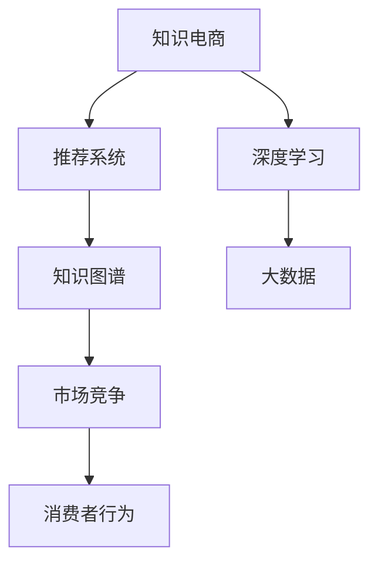

                 

# 知识电商满足用户需求,实现知识商品化

> 关键词：知识电商,知识商品化,用户需求,深度学习,推荐系统,推荐算法,知识图谱,市场竞争,消费者行为,大数据,模型训练,应用部署

## 1. 背景介绍

### 1.1 问题由来
在知识经济的时代，信息爆炸、知识贬值的现象越来越普遍，用户对于高质量、个性化知识的需求日益增强。传统教科书、学术论文、电子书籍等知识形式，已经无法满足用户在各个场景下的实际需求。而知识电商作为新兴的行业，依托于互联网技术，通过电商平台的流量优势和深度学习技术，提供实时、精准、个性化的知识服务。

知识电商的兴起，标志着知识商品化的新阶段。以往知识获取需要高昂的订阅费、复杂的学习路径和长时间的学习周期，如今通过电商平台的便捷渠道，用户可以在短时间内获得高质量、碎片化的知识，极大地提升了学习效率和知识获取的便捷性。知识电商通过将知识商品化，改变了知识的获取方式，使之更加市场化、商品化、商业化。

### 1.2 问题核心关键点
知识电商的核心关键点在于：
- 如何通过电商平台实现知识的实时获取和个性化推荐。
- 如何通过深度学习技术构建推荐系统，实现用户对知识商品的精准匹配。
- 如何构建知识图谱，以捕捉知识之间的关联，提升推荐系统的效果。
- 如何通过市场竞争，提升知识电商平台的用户黏性。
- 如何通过消费者行为数据分析，洞察用户需求，优化推荐系统。
- 如何利用大数据技术，优化模型训练过程，提升推荐系统的精度和效率。

通过解决这些关键点，知识电商可以实现知识商品化，满足用户的实际需求。

## 2. 核心概念与联系

### 2.1 核心概念概述

为更好地理解知识电商的推荐系统，本节将介绍几个密切相关的核心概念：

- 知识电商(Knowledge E-commerce)：以知识商品为对象，通过电商平台销售知识内容的商业模式。
- 推荐系统(Recommender System)：根据用户的历史行为和偏好，自动推荐用户可能感兴趣的知识商品的技术。
- 深度学习(Deep Learning)：基于神经网络的机器学习方法，可以自动提取数据的高级特征，实现对复杂模式的建模。
- 知识图谱(Knowledge Graph)：表示知识领域内概念和实体之间关系的图结构，可以用于捕捉知识之间的关联。
- 市场竞争(Market Competition)：知识电商平台之间的竞争关系，主要体现在用户获取、留存和转化等方面。
- 消费者行为(Consumer Behavior)：用户在使用知识电商平台的搜索、购买、评价等行为，可以用于优化推荐系统。
- 大数据(Big Data)：大规模、高速、多样化的数据集，可以为推荐系统提供充足的训练数据，提升模型精度。

这些核心概念之间的逻辑关系可以通过以下Mermaid流程图来展示：



这个流程图展示了一些核心概念及其之间的关系：

1. 知识电商以推荐系统为核心技术，实现知识商品化。
2. 推荐系统基于深度学习构建，可以学习用户行为和商品属性之间的复杂关系。
3. 深度学习依赖于大数据提供的数据支持，可以更好地进行模型训练。
4. 知识图谱可以捕捉知识之间的关联，增强推荐系统的精度。
5. 市场竞争驱动知识电商平台的持续创新。
6. 消费者行为的数据分析可以洞察用户需求，优化推荐系统。

这些概念共同构成了知识电商的推荐系统技术框架，使之能够为用户提供高质量的知识服务。

## 3. 核心算法原理 & 具体操作步骤
### 3.1 算法原理概述

知识电商的推荐系统主要是基于用户历史行为和商品属性，构建用户-商品之间的关系图，通过深度学习算法进行预测，为用户推荐个性化的知识商品。其核心思想是：将用户历史行为、商品属性、用户画像等信息，通过有监督的深度学习算法，训练出推荐模型，预测用户对每个知识商品的兴趣评分，从而实现个性化推荐。

形式化地，假设用户集合为 $U$，商品集合为 $I$，每个用户 $u$ 的历史行为 $H_u=\{(i_j,r_j)\}_{j=1}^N$，其中 $i_j$ 表示用户 $u$ 浏览或购买过的知识商品，$r_j$ 表示行为类型（浏览、购买、收藏等）。知识电商的推荐目标是最小化预测误差，即：

$$
\theta^* = \mathop{\arg\min}_{\theta} \sum_{u\in U} \sum_{i\in I} \sum_{j=1}^N (y_{u,i_j} \cdot \ell(f_u(x_i,\theta) - r_j)) + \lambda \| \theta \|_2^2
$$

其中 $f_u(x_i,\theta)$ 表示预测模型，$\ell$ 为损失函数，$\lambda$ 为正则化参数，$\theta$ 为模型参数。

### 3.2 算法步骤详解

知识电商的推荐系统通常包含以下几个关键步骤：

**Step 1: 数据预处理**

- 收集用户历史行为数据和商品属性数据，如浏览记录、购买记录、评分记录等。
- 对数据进行清洗和预处理，如去除噪声、缺失值处理、数据标准化等。
- 构建用户-商品关系图，如用户-商品交互矩阵、商品-商品关系矩阵等。

**Step 2: 模型选择**

- 选择合适的推荐算法，如基于矩阵分解的算法（如SVD）、基于协同过滤的算法（如ALS）、基于神经网络的算法（如DeepFM）等。
- 设计模型架构，包括输入层、隐层、输出层等。
- 选择合适的损失函数，如均方误差、交叉熵等。

**Step 3: 模型训练**

- 将数据集分为训练集、验证集和测试集。
- 使用训练集对模型进行训练，优化模型参数。
- 在验证集上评估模型效果，避免过拟合。
- 根据模型效果进行调整，如超参数调优、特征选择等。

**Step 4: 模型测试与部署**

- 在测试集上测试模型的准确率和召回率等指标。
- 部署模型到生产环境，实现实时推荐。
- 定期更新模型，适应新的数据变化。

**Step 5: 反馈与迭代**

- 收集用户的反馈信息，如评分、评价等。
- 对模型进行迭代优化，提升推荐效果。
- 持续改进算法和特征，提升推荐系统的性能。

以上是知识电商推荐系统的核心流程。在实际应用中，还需要针对具体场景进行优化设计，如加入对抗样本、引入用户画像、考虑冷启动问题等。

### 3.3 算法优缺点

基于深度学习的知识电商推荐系统具有以下优点：

1. 数据利用率高。深度学习可以自动提取数据的高级特征，最大化利用用户行为和商品属性信息。
2. 模型精度高。深度神经网络能够捕捉复杂的非线性关系，提升推荐系统的准确率。
3. 实时性强。深度学习模型可以快速适应新的数据，实现实时推荐。
4. 个性化程度高。深度学习可以学习用户的行为模式，实现个性化推荐。

同时，该方法也存在一些局限性：

1. 模型复杂度高。深度学习模型参数量庞大，需要大量计算资源和存储空间。
2. 训练成本高。深度学习模型需要大量标注数据，训练过程时间长。
3. 容易过拟合。在数据量不足的情况下，深度学习模型容易过拟合，泛化能力不足。
4. 可解释性差。深度学习模型通常被认为是"黑盒"系统，难以解释模型的决策过程。

尽管存在这些局限性，但就目前而言，基于深度学习的推荐系统仍是最主流、效果最好的推荐技术。未来相关研究的重点在于如何进一步降低推荐系统的训练成本，提升模型的可解释性和鲁棒性，同时兼顾高效性。

### 3.4 算法应用领域

知识电商推荐系统已经广泛应用于各种场景中，例如：

- 在线教育：为学生推荐适合的学习资源、在线课程。
- 图书推荐：为用户推荐感兴趣的书籍、文章。
- 视频推荐：为用户推荐感兴趣的视频、电影、综艺节目。
- 游戏推荐：为用户推荐适合的游戏、游戏攻略。
- 知识分享：为用户推荐相关的知识分享文章、PPT等。
- 行业资讯：为用户推荐相关的行业新闻、资讯。
- 金融理财：为用户推荐相关的金融产品、理财策略。

除了上述这些经典应用外，知识电商推荐系统还被创新性地应用于更多场景中，如个性化的健康指导、法律咨询、工程设计等，为不同行业的数字化转型升级提供新的技术路径。

## 4. 数学模型和公式 & 详细讲解 & 举例说明

### 4.1 数学模型构建

本节将使用数学语言对知识电商推荐系统的基本数学模型进行更加严格的刻画。

假设用户集合为 $U$，商品集合为 $I$，每个用户 $u$ 的历史行为 $H_u=\{(i_j,r_j)\}_{j=1}^N$，其中 $i_j$ 表示用户 $u$ 浏览或购买过的商品，$r_j$ 表示行为类型（浏览、购买、收藏等）。知识电商的推荐目标是最小化预测误差，即：

$$
\theta^* = \mathop{\arg\min}_{\theta} \sum_{u\in U} \sum_{i\in I} \sum_{j=1}^N (y_{u,i_j} \cdot \ell(f_u(x_i,\theta) - r_j)) + \lambda \| \theta \|_2^2
$$

其中 $f_u(x_i,\theta)$ 表示预测模型，$\ell$ 为损失函数，$\lambda$ 为正则化参数，$\theta$ 为模型参数。

假设 $f_u(x_i,\theta)$ 为一个全连接神经网络，其输入为商品 $x_i$ 的属性特征 $x_{i,1},x_{i,2},...,x_{i,D}$，输出为用户 $u$ 对商品 $i$ 的兴趣评分 $f_u(x_i,\theta)$。设神经网络的隐藏层数为 $H$，则模型可以表示为：

$$
f_u(x_i,\theta) = W_{out} \cdot \sigma(W_{hidden} \cdot \sigma(W_{in} \cdot x_i + b_{in}) + b_{hidden}) + b_{out}
$$

其中 $W_{in},W_{hidden},W_{out}$ 为神经网络的权重矩阵，$b_{in},b_{hidden},b_{out}$ 为偏置向量，$\sigma$ 为激活函数。

### 4.2 公式推导过程

以下我们以深度神经网络为例，推导深度学习推荐模型的预测公式及其梯度计算。

设用户 $u$ 对商品 $i$ 的兴趣评分为 $y_{u,i}$，则推荐系统的预测公式为：

$$
f_u(x_i,\theta) = W_{out} \cdot \sigma(W_{hidden} \cdot \sigma(W_{in} \cdot x_i + b_{in}) + b_{hidden}) + b_{out}
$$

其中 $W_{in},W_{hidden},W_{out}$ 为神经网络的权重矩阵，$b_{in},b_{hidden},b_{out}$ 为偏置向量，$\sigma$ 为激活函数。

假设预测模型 $f_u(x_i,\theta)$ 的误差为 $e_{u,i} = y_{u,i} - f_u(x_i,\theta)$，则推荐系统的损失函数为：

$$
\ell(e_{u,i}) = \frac{1}{2} e_{u,i}^2
$$

则模型参数 $\theta$ 的梯度为：

$$
\nabla_{\theta} \ell(\theta) = \sum_{u\in U} \sum_{i\in I} \nabla_{\theta} f_u(x_i,\theta) \cdot e_{u,i}
$$

其中 $\nabla_{\theta} f_u(x_i,\theta)$ 表示模型对输入 $x_i$ 的梯度，可以通过反向传播算法计算得到。

在得到参数梯度后，即可带入优化算法进行参数更新。重复上述过程直至收敛，最终得到适应知识电商推荐任务的最优模型参数 $\theta^*$。

## 5. 项目实践：代码实例和详细解释说明
### 5.1 开发环境搭建

在进行知识电商推荐系统开发前，我们需要准备好开发环境。以下是使用Python进行TensorFlow开发的环境配置流程：

1. 安装Anaconda：从官网下载并安装Anaconda，用于创建独立的Python环境。

2. 创建并激活虚拟环境：
```bash
conda create -n tf-env python=3.8 
conda activate tf-env
```

3. 安装TensorFlow：根据CUDA版本，从官网获取对应的安装命令。例如：
```bash
conda install tensorflow -c conda-forge -c pypi
```

4. 安装其他工具包：
```bash
pip install pandas numpy scikit-learn matplotlib jupyter notebook ipython
```

完成上述步骤后，即可在`tf-env`环境中开始推荐系统实践。

### 5.2 源代码详细实现

下面我们以基于神经网络的深度学习推荐系统为例，给出使用TensorFlow进行知识电商推荐系统的PyTorch代码实现。

首先，定义推荐系统的数据处理函数：

```python
import tensorflow as tf

class DataLoader(tf.keras.utils.Sequence):
    def __init__(self, data, batch_size):
        self.data = data
        self.batch_size = batch_size
        
    def __len__(self):
        return len(self.data) // self.batch_size
    
    def __getitem__(self, item):
        batch_data = self.data[item * self.batch_size: (item+1) * self.batch_size]
        return batch_data
```

然后，定义模型和优化器：

```python
model = tf.keras.Sequential([
    tf.keras.layers.Dense(64, activation='relu'),
    tf.keras.layers.Dense(32, activation='relu'),
    tf.keras.layers.Dense(1)
])

optimizer = tf.keras.optimizers.Adam(learning_rate=0.001)
```

接着，定义训练和评估函数：

```python
def train_step(model, dataset, batch_size, optimizer):
    model.compile(loss='mse', optimizer=optimizer)
    model.fit(dataset, epochs=10, batch_size=batch_size)

def evaluate_step(model, dataset, batch_size):
    model.evaluate(dataset, batch_size=batch_size)
```

最后，启动训练流程并在测试集上评估：

```python
batch_size = 16

train_dataset = DataLoader(train_data, batch_size)
test_dataset = DataLoader(test_data, batch_size)

train_step(model, train_dataset, batch_size, optimizer)
evaluate_step(model, test_dataset, batch_size)
```

以上就是使用TensorFlow对知识电商推荐系统进行开发的完整代码实现。可以看到，利用TensorFlow的高级API，代码实现简洁高效，开发者可以更多关注模型设计、数据处理等高层逻辑。

### 5.3 代码解读与分析

让我们再详细解读一下关键代码的实现细节：

**DataLoader类**：
- `__init__`方法：初始化数据集和批次大小。
- `__len__`方法：返回数据集的样本数。
- `__getitem__`方法：对单个批次进行处理，返回处理后的数据。

**训练和评估函数**：
- `train_step`函数：定义模型的编译方式、损失函数、优化器，进行模型训练。
- `evaluate_step`函数：进行模型评估，输出评估指标。

**训练流程**：
- 定义批次大小和数据集。
- 使用`train_step`函数进行模型训练。
- 使用`evaluate_step`函数进行模型评估。

可以看到，TensorFlow提供了强大的API支持，可以方便地进行模型训练、评估和部署。利用TensorFlow的模块化和封装特性，可以显著提升推荐系统开发的效率。

## 6. 实际应用场景
### 6.1 在线教育平台

在线教育平台通过知识电商推荐系统，为学生推荐适合的学习资源和课程，大大提升了学习效率和个性化程度。学生可以在短时间内获取到更多、更适合自己的学习材料，从而更好地掌握知识。

在技术实现上，可以收集学生的浏览记录、学习时间、评分记录等数据，构建用户画像，对每个学生的学习偏好进行建模。同时，平台可以收集各课程的用户评价、热门程度等属性，作为推荐系统的输入。通过深度学习算法，平台能够实时地为学生推荐适合的学习材料，从而提升学习体验和效果。

### 6.2 图书电商

图书电商通过知识电商推荐系统，为读者推荐感兴趣的书籍和文章。读者可以在平台上方便地发现感兴趣的书籍，并通过评价、评论等方式互动交流，提升阅读体验。

在技术实现上，图书电商可以收集读者的浏览记录、评分记录、收藏记录等数据，构建用户画像，对每个读者的阅读偏好进行建模。同时，平台可以收集图书的属性信息，如作者、出版社、出版社等，作为推荐系统的输入。通过深度学习算法，平台能够实时地为读者推荐感兴趣的书籍，从而提升用户的购物体验。

### 6.3 视频平台

视频平台通过知识电商推荐系统，为用户推荐感兴趣的视频、电影、综艺节目等。用户可以在平台上方便地发现感兴趣的内容，并通过评论、分享等方式互动交流，提升观看体验。

在技术实现上，视频平台可以收集用户的浏览记录、评分记录、收藏记录等数据，构建用户画像，对每个用户的观看偏好进行建模。同时，平台可以收集视频的属性信息，如导演、演员、类型等，作为推荐系统的输入。通过深度学习算法，平台能够实时地为用户推荐感兴趣的视频，从而提升用户的观看体验。

### 6.4 金融理财平台

金融理财平台通过知识电商推荐系统，为用户推荐相关的金融产品、理财策略等。用户可以在平台上方便地发现适合自己的金融产品，并通过专家解读、投资建议等方式获取理财知识，提升理财效果。

在技术实现上，金融理财平台可以收集用户的浏览记录、评分记录、购买记录等数据，构建用户画像，对每个用户的理财偏好进行建模。同时，平台可以收集金融产品的属性信息，如收益率、风险等级等，作为推荐系统的输入。通过深度学习算法，平台能够实时地为用户推荐适合的金融产品，从而提升用户的理财体验。

### 6.5 健康医疗平台

健康医疗平台通过知识电商推荐系统，为患者推荐适合的医疗知识、健康指导等。患者可以在平台上方便地发现感兴趣的健康知识，并通过专家解读、健康建议等方式获取医疗知识，提升健康管理效果。

在技术实现上，健康医疗平台可以收集患者的浏览记录、评价记录、搜索记录等数据，构建用户画像，对每个患者的健康需求进行建模。同时，平台可以收集医疗知识的属性信息，如专家推荐、时间戳等，作为推荐系统的输入。通过深度学习算法，平台能够实时地为患者推荐适合的健康知识，从而提升患者的健康管理体验。

### 6.6 行业资讯平台

行业资讯平台通过知识电商推荐系统，为用户推荐相关的行业新闻、资讯等。用户可以在平台上方便地发现感兴趣的新闻资讯，并通过评论、分享等方式互动交流，提升阅读体验。

在技术实现上，行业资讯平台可以收集用户的浏览记录、评分记录、收藏记录等数据，构建用户画像，对每个用户的阅读偏好进行建模。同时，平台可以收集新闻资讯的属性信息，如作者、来源、发布时间等，作为推荐系统的输入。通过深度学习算法，平台能够实时地为用户推荐感兴趣的新闻资讯，从而提升用户的阅读体验。

## 7. 工具和资源推荐
### 7.1 学习资源推荐

为了帮助开发者系统掌握知识电商推荐系统的理论基础和实践技巧，这里推荐一些优质的学习资源：

1. 《深度学习推荐系统》系列书籍：详细介绍了深度学习推荐系统的发展历程、算法原理和应用场景，是深度学习推荐系统的经典教材。
2. Coursera《深度学习在推荐系统中的应用》课程：由斯坦福大学教授主讲，介绍了深度学习推荐系统的前沿技术和应用实例。
3. 《Python深度学习推荐系统》书籍：介绍了基于Python的推荐系统开发方法和实现技巧，适合实战应用。
4. PyTorch官方文档：提供了详细的推荐系统开发教程和样例代码，帮助开发者快速上手。
5. TensorFlow官方文档：提供了丰富的推荐系统开发API和样例代码，方便开发者进行模型训练和部署。

通过对这些资源的学习实践，相信你一定能够快速掌握知识电商推荐系统的精髓，并用于解决实际的推荐问题。

### 7.2 开发工具推荐

高效的开发离不开优秀的工具支持。以下是几款用于知识电商推荐系统开发的常用工具：

1. TensorFlow：由Google主导开发的开源深度学习框架，生产部署方便，适合大规模工程应用。提供了丰富的推荐系统开发API和样例代码。
2. PyTorch：基于Python的开源深度学习框架，灵活动态的计算图，适合快速迭代研究。提供了丰富的推荐系统开发API和样例代码。
3. Scikit-learn：简单易用的机器学习库，提供了丰富的特征工程和模型训练功能。
4. Pandas：强大的数据分析库，可以方便地进行数据预处理和特征工程。
5. Jupyter Notebook：支持多种编程语言的交互式开发环境，方便进行模型调试和实验记录。

合理利用这些工具，可以显著提升知识电商推荐系统的开发效率，加快创新迭代的步伐。

### 7.3 相关论文推荐

知识电商推荐系统的发展源于学界的持续研究。以下是几篇奠基性的相关论文，推荐阅读：

1. DeepFM: A Factorization Machine with Feature Crossing for Recommender Systems（DeepFM）：提出了一种基于神经网络的推荐算法，通过特征交叉和深度学习，提升推荐系统的精度。
2. Neural Collaborative Filtering（NeCF）: A Deep Learning Approach for Multi-faceted Recommendations（NeCF）：提出了一种基于神经网络的协同过滤推荐算法，利用多维用户和商品表示，提升推荐系统的精度。
3. Multi-view Matrix Factorization for Recommendation（MMF）：提出了一种基于多视图矩阵分解的推荐算法，通过融合用户行为和商品属性信息，提升推荐系统的精度。
4. Hybrid Recommender System Based on the Composition of Multiple Recommendation Algorithms（Hybrid-Rec）：提出了一种基于多种推荐算法的混合推荐系统，通过融合不同算法的优势，提升推荐系统的精度和鲁棒性。
5. Explainable AI: Interpreting and Understanding Machine Learning Predictions（XAI）：介绍了可解释性AI的研究进展，探讨如何提高推荐系统的可解释性和透明性。

这些论文代表了大语言模型微调技术的发展脉络。通过学习这些前沿成果，可以帮助研究者把握学科前进方向，激发更多的创新灵感。

## 8. 总结：未来发展趋势与挑战

### 8.1 总结

本文对基于深度学习的知识电商推荐系统进行了全面系统的介绍。首先阐述了知识电商推荐系统的背景和意义，明确了推荐系统在知识电商中的核心作用。其次，从原理到实践，详细讲解了推荐系统的数学原理和关键步骤，给出了推荐系统开发的完整代码实例。同时，本文还广泛探讨了推荐系统在在线教育、图书电商、视频平台等场景中的应用前景，展示了推荐系统在实际应用中的巨大潜力。此外，本文精选了推荐系统的各类学习资源，力求为开发者提供全方位的技术指引。

通过本文的系统梳理，可以看到，基于深度学习的推荐系统正在成为知识电商的核心技术，极大地提升了用户的个性化推荐体验，推动了知识电商平台的快速发展。未来，伴随深度学习技术的不断演进和优化，推荐系统必将在更多领域得到应用，为知识电商平台的数字化转型升级提供新的技术路径。

### 8.2 未来发展趋势

展望未来，深度学习推荐系统将呈现以下几个发展趋势：

1. 推荐模型的多样化。未来的推荐系统将不再局限于传统的深度学习模型，将引入更多前沿的模型和技术，如图神经网络、强化学习、对抗学习等。
2. 推荐算法的复杂化。未来的推荐算法将更加复杂，可以同时考虑用户行为、商品属性、社交网络等多维度的信息，提升推荐精度和个性化程度。
3. 推荐系统的实时化。未来的推荐系统将更加实时，能够快速响应用户行为的变化，提升推荐的时效性。
4. 推荐系统的个性化。未来的推荐系统将更加个性化，能够根据用户的实时行为进行动态调整，提升推荐的效果。
5. 推荐系统的可解释性。未来的推荐系统将更加可解释，能够提供推荐理由和解释，增强用户信任和满意度。
6. 推荐系统的多模态融合。未来的推荐系统将更加多模态，能够同时考虑文本、图像、语音等多模态数据，提升推荐系统的精度和鲁棒性。

这些趋势将推动推荐系统向着更加智能、高效、个性化的方向发展，为知识电商平台的智能化转型提供新的技术路径。

### 8.3 面临的挑战

尽管深度学习推荐系统已经取得了显著成效，但在迈向更加智能化、普适化应用的过程中，它仍面临着诸多挑战：

1. 数据质量问题。推荐系统依赖于高质量的用户行为数据和商品属性数据，数据的噪声、缺失和稀疏性将直接影响推荐效果。如何提升数据质量，是推荐系统面临的重要挑战之一。
2. 推荐模型的复杂性。深度学习推荐系统通常需要大规模的计算资源和存储空间，训练过程复杂，优化难度大。如何降低推荐模型的复杂度，提高训练效率，是推荐系统面临的重要挑战之一。
3. 推荐系统的公平性。推荐系统在个性化推荐的同时，容易加剧用户之间的信息不对称，导致推荐公平性不足。如何提升推荐系统的公平性，是推荐系统面临的重要挑战之一。
4. 推荐系统的隐私保护。推荐系统需要收集用户行为数据和商品属性数据，如何保护用户隐私，是推荐系统面临的重要挑战之一。
5. 推荐系统的可解释性。深度学习推荐系统通常被认为是"黑盒"系统，难以解释模型的决策过程。如何提高推荐系统的可解释性和透明性，是推荐系统面临的重要挑战之一。

这些挑战将随着推荐系统的不断演进而逐步解决，未来深度学习推荐系统必将在更多领域得到应用，为知识电商平台的数字化转型升级提供新的技术路径。

### 8.4 研究展望

面对深度学习推荐系统所面临的种种挑战，未来的研究需要在以下几个方面寻求新的突破：

1. 优化推荐模型的复杂度。开发更加高效的推荐模型，降低模型的计算复杂度，提升训练效率。
2. 提升推荐系统的公平性。引入公平性约束，提升推荐系统的公平性，避免用户之间的信息不对称。
3. 加强推荐系统的隐私保护。引入隐私保护技术，保护用户隐私，增强用户信任和满意度。
4. 提高推荐系统的可解释性。引入可解释性技术，提高推荐系统的透明性和可解释性，增强用户信任和满意度。
5. 融合多模态数据。引入多模态数据融合技术，提升推荐系统的精度和鲁棒性。

这些研究方向的探索，必将引领深度学习推荐系统迈向更高的台阶，为知识电商平台的智能化转型提供新的技术路径。面向未来，深度学习推荐系统还需要与其他人工智能技术进行更深入的融合，如知识表示、因果推理、强化学习等，多路径协同发力，共同推动知识电商平台的智能化进程。只有勇于创新、敢于突破，才能不断拓展推荐系统的边界，让推荐系统更好地造福知识电商平台的用户。

## 9. 附录：常见问题与解答

**Q1：知识电商推荐系统的核心关键点是什么？**

A: 知识电商推荐系统的核心关键点在于：
1. 如何通过电商平台实现知识的实时获取和个性化推荐。
2. 如何通过深度学习技术构建推荐系统，实现用户对知识商品的精准匹配。
3. 如何构建知识图谱，以捕捉知识之间的关联，提升推荐系统的效果。
4. 如何通过市场竞争，提升知识电商平台的用户黏性。
5. 如何通过消费者行为数据分析，洞察用户需求，优化推荐系统。
6. 如何利用大数据技术，优化模型训练过程，提升推荐系统的精度和效率。

通过解决这些关键点，知识电商推荐系统可以实现知识商品化，满足用户的实际需求。

**Q2：知识电商推荐系统是如何进行数据预处理的？**

A: 知识电商推荐系统通常进行以下数据预处理：

1. 收集用户历史行为数据和商品属性数据，如浏览记录、购买记录、评分记录等。
2. 对数据进行清洗和预处理，如去除噪声、缺失值处理、数据标准化等。
3. 构建用户-商品关系图，如用户-商品交互矩阵、商品-商品关系矩阵等。

这些预处理步骤可以提升数据的质量和适用性，为推荐系统的构建提供更可靠的输入。

**Q3：知识电商推荐系统如何处理冷启动问题？**

A: 冷启动问题是指新用户或新商品加入推荐系统时，由于没有足够的历史行为数据，难以进行推荐。知识电商推荐系统通常采用以下方法解决冷启动问题：

1. 基于内容的推荐：利用商品的属性特征进行推荐，不依赖于用户行为数据。
2. 基于模型的推荐：利用模型预测用户对商品的兴趣，通过模型训练得到推荐结果。
3. 基于协同过滤的推荐：利用相似用户或相似商品的推荐结果，进行推荐。
4. 基于混合推荐的推荐：结合多种推荐算法，提升推荐效果。

这些方法可以在一定程度上解决冷启动问题，提高推荐系统的覆盖度和精度。

**Q4：知识电商推荐系统的损失函数有哪些？**

A: 知识电商推荐系统常用的损失函数包括：

1. 均方误差损失（Mean Squared Error, MSE）：用于回归任务，计算预测值和真实值之间的差异。
2. 交叉熵损失（Cross-Entropy Loss）：用于分类任务，计算模型预测概率和真实标签之间的差异。
3. 对数损失（Log Loss）：用于二分类任务，计算模型预测概率和真实标签之间的差异。
4. 对比损失（Contrastive Loss）：用于多分类任务，优化模型在不同类别之间的差异。
5. 带正则化的损失函数：如L2正则化损失，防止过拟合。

选择合适的损失函数，对提升推荐系统的精度和泛化能力至关重要。

**Q5：知识电商推荐系统的训练流程包含哪些关键步骤？**

A: 知识电商推荐系统的训练流程通常包含以下关键步骤：

1. 数据预处理：收集和清洗数据，构建用户-商品关系图。
2. 模型选择：选择合适的推荐算法和模型架构。
3. 模型训练：使用训练集对模型进行训练，优化模型参数。
4. 模型测试：使用验证集评估模型效果，避免过拟合。
5. 模型部署：将模型部署到生产环境，实现实时推荐。

这些步骤环环相扣，共同构建知识电商推荐系统的训练流程。

**Q6：知识电商推荐系统如何提升推荐系统的可解释性？**

A: 知识电商推荐系统可以通过以下方法提升推荐系统的可解释性：

1. 引入可解释性技术：如LIME、SHAP等，提供推荐理由和解释，增强用户信任和满意度。
2. 引入规则和知识：将符号化的先验知识，如知识图谱、逻辑规则等，与神经网络模型进行融合，引导推荐系统学习更全面、准确的知识表示。
3. 引入因果分析：通过因果分析方法，识别出推荐系统决策的关键特征，增强推荐系统的透明性和可解释性。

这些方法可以在一定程度上提高推荐系统的可解释性和透明性，增强用户信任和满意度。

**Q7：知识电商推荐系统如何优化模型训练过程？**

A: 知识电商推荐系统可以通过以下方法优化模型训练过程：

1. 采用分布式训练：利用分布式计算框架，加速模型训练过程。
2. 采用混合精度训练：将浮点模型转为定点模型，压缩存储空间，提高计算效率。
3. 采用剪枝和量化技术：去除冗余参数和特征，提高模型的可解释性和训练效率。
4. 采用模型压缩技术：通过模型剪枝、蒸馏等方法，降低模型的计算复杂度，提升训练效率。
5. 采用自动微分技术：利用自动微分工具，优化模型的计算图，提高训练效率。

这些方法可以在一定程度上优化推荐系统的训练过程，提升模型的精度和效率。

通过本文的系统梳理，可以看到，知识电商推荐系统正在成为知识电商的核心技术，极大地提升了用户的个性化推荐体验，推动了知识电商平台的快速发展。未来，伴随深度学习技术的不断演进和优化，推荐系统必将在更多领域得到应用，为知识电商平台的智能化转型提供新的技术路径。

