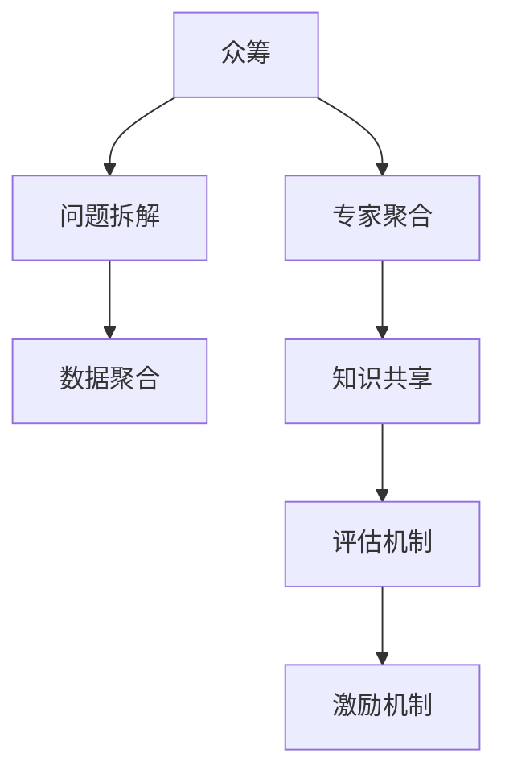

                 

# 知识的众筹：集体智慧解决复杂问题

> 关键词：众筹, 集体智慧, 复杂问题, 数据聚合, 协作学习, 知识图谱, 社区参与, 大数据, 人工智能

## 1. 背景介绍

### 1.1 问题由来
随着互联网和数字技术的普及，我们越来越难以凭借单一的能力来解决复杂问题。无论是科研领域的重大难题，还是商业领域的市场预测，甚至是日常生活中的健康问题，都越来越需要跨学科、跨领域的协作与信息共享。但传统的方式往往难以将分散在各地的知识进行高效整合，特别是在一些特殊领域，专家和专业知识的分布可能极为不均。

面对这样的挑战，我们需要找到一种新的途径，将各领域的专家智慧汇聚起来，共同攻克难题。众筹理念的引入，为解决这类问题提供了一种全新的思路。借助众筹平台，我们可以将复杂问题拆解为若干子任务，让不同领域的专家进行协作解答，再将他们的知识汇总，形成完整的解决方案。

### 1.2 问题核心关键点
众筹的核心理念是通过平台汇聚多方智慧，集中资源解决难题。其关键点包括：
1. **问题拆解**：将大问题拆解为若干小问题，便于不同领域的专家独立解答。
2. **专家聚合**：通过众筹平台，聚合不同领域的专家资源，弥补单一领域的知识局限。
3. **知识共享**：各专家将解答结果汇总，共享至平台，形成完整的解决方案。
4. **评估机制**：平台提供评估机制，确保每份解答的质量和可信度。
5. **激励机制**：通过奖励机制，激励专家积极参与和贡献。

## 2. 核心概念与联系

### 2.1 核心概念概述

为了更好地理解如何通过众筹方式解决复杂问题，本节将介绍几个密切相关的核心概念：

- **众筹(Crowdsourcing)**：一种通过互联网平台汇聚多方资源和智慧来解决特定问题的方式。它可以将复杂问题拆分为多个子任务，并通过网络公开给全球的专家，从而形成集体的智慧解决方案。
- **集体智慧(Collective Intelligence)**：多个个体通过协作和信息共享共同解决问题的智慧方式。它基于众筹平台，通过汇聚不同领域的专家知识，形成强有力的知识合力。
- **复杂问题(Complex Problem)**：需要跨学科、跨领域协作才能解决的具有高度复杂性和多变性的问题。它通常涉及多种知识和技术的综合运用。
- **数据聚合(Data Aggregation)**：将分散在不同来源的数据进行整合，形成可用于分析和决策的统一数据集。
- **协作学习(Collaborative Learning)**：通过多个学习者之间的交互，共同解决学习问题的方式。它强调共享知识和资源，提高学习效果。
- **知识图谱(Knowledge Graph)**：一种用于描述实体之间关系的图形结构化知识库，支持复杂的知识推理和搜索。

这些概念之间的逻辑关系可以通过以下Mermaid流程图来展示：



这个流程图展示了个体如何通过众筹平台汇聚成集体智慧，共同解决复杂问题的过程。

## 3. 核心算法原理 & 具体操作步骤
### 3.1 算法原理概述

众筹解决复杂问题的算法原理主要基于以下几个核心步骤：

1. **问题拆解**：将复杂问题拆分为多个子问题，并公开给全球的专家。
2. **专家聚合**：将具有特定领域知识的专家汇聚到众筹平台上，参与问题的解决。
3. **数据聚合**：将不同专家提供的答案和数据进行整合，形成统一的数据集。
4. **知识共享**：各专家将自己的解答和数据结果共享至平台，供其他专家参考。
5. **评估机制**：平台对提交的解答进行评估，确保每份解答的质量和可信度。
6. **激励机制**：通过奖励机制，激励专家积极参与和贡献。

每个步骤都是环环相扣的，只有在前一个步骤的基础上，才能顺利进行后续步骤。

### 3.2 算法步骤详解

以下将详细介绍众筹解决复杂问题的各个算法步骤：

**Step 1: 问题拆解**
- 将复杂问题分解为若干子问题，每个子问题具有明确的输入和输出，便于专家独立解答。
- 确保子问题之间具有逻辑关联，使得最终解答能够整合为完整解决方案。
- 子问题的拆解需要充分考虑不同领域专家的专业性和知识背景，以便选择合适的专家进行解答。

**Step 2: 专家聚合**
- 利用众筹平台，汇聚各领域的专家资源，通过平台发布问题并吸引专家参与。
- 设计合理的任务分配机制，确保每个子问题都有合适的专家解答。
- 提供平台工具和支持，使得专家能够高效地上传、查看和讨论问题解答。

**Step 3: 数据聚合**
- 将各专家提供的答案和数据进行汇总，形成完整的数据集。
- 确保数据的质量和一致性，对不一致的数据进行校正和验证。
- 使用数据聚合工具，如ETL工具，进行数据清洗、转换和加载，形成可用于分析的数据集。

**Step 4: 知识共享**
- 各专家将解答结果上传至平台，并进行详细的描述和解释。
- 提供共享工具，如Markdown、LaTeX等，使得专家可以轻松上传和展示他们的解答。
- 设计知识共享机制，确保所有专家都能看到每份解答，并进行讨论和反馈。

**Step 5: 评估机制**
- 设计评估标准，确保每份解答的质量和可信度。
- 引入多轮投票和评分机制，由其他专家对解答进行打分和评论。
- 通过计算平均值和加权平均，得到每份解答的综合评分。

**Step 6: 激励机制**
- 提供激励措施，如奖金、荣誉证书等，以激励专家积极参与。
- 设计合理的奖励分配机制，确保奖励公平合理，激励更多专家参与。

### 3.3 算法优缺点

众筹解决复杂问题的算法具有以下优点：

- **知识汇聚**：能够汇聚多领域的专家智慧，弥补单一领域知识的局限性。
- **高效协作**：通过平台支持，专家之间可以进行高效的协作和信息共享。
- **灵活性高**：适合解决各种复杂问题，适应性强。

但同时也存在一些缺点：

- **资源消耗**：需要大量的时间和人力进行问题拆解、专家聚合、数据聚合等步骤。
- **质量控制**：需要设计合理的评估机制和激励机制，确保每份解答的质量。
- **平台依赖**：依赖众筹平台的支持，平台本身的稳定性和安全性是关键。

### 3.4 算法应用领域

众筹解决复杂问题的方法在多个领域中得到了广泛应用，例如：

- 科研领域：借助众筹平台，汇聚全球科研专家，解决科研难题。如使用Zooniverse平台进行天文观测数据的标注。
- 商业领域：通过众筹平台，进行市场调研和数据收集。如使用Amazon Mechanical Turk进行商品属性标注。
- 社会公益：利用众筹平台，解决社会问题。如使用CrowdFlower平台进行自然语言处理任务的标注。
- 公共卫生：借助众筹平台，解决公共卫生问题。如使用Open Data Hub进行公共健康数据的收集和分析。

这些领域的应用展示了众筹解决复杂问题的强大潜力和广泛适用性。

## 4. 数学模型和公式 & 详细讲解  
### 4.1 数学模型构建

假设问题拆分为 $N$ 个子问题，每个子问题的解为 $y_i$，专家聚合后得到的 $N$ 份解答为 $a_i$。设 $y^*$ 为最终问题的解，则众筹解决复杂问题的数学模型为：

$$
\min_{y^*} \sum_{i=1}^N \mathcal{L}(y_i, a_i)
$$

其中，$\mathcal{L}$ 为专家解答与目标解的损失函数，通常是均方误差损失或交叉熵损失。

### 4.2 公式推导过程

通过最小化损失函数 $\mathcal{L}$，可以得到每个专家解答 $a_i$ 与目标解 $y^*$ 的关系：

$$
y^* = \arg\min_{y} \sum_{i=1}^N \mathcal{L}(y, a_i)
$$

为了求解上述最优化问题，可以使用梯度下降等优化算法，递归更新每个专家解答 $a_i$，使其与目标解 $y^*$ 更加一致。具体步骤如下：

1. 初始化每个专家解答 $a_i$ 为随机值。
2. 计算目标解 $y^*$ 与当前解答的损失 $\mathcal{L}(y^*, a_i)$。
3. 使用梯度下降算法更新 $a_i$，使其更接近 $y^*$。
4. 重复步骤2和3，直至收敛。

### 4.3 案例分析与讲解

以下通过一个具体的案例来讲解众筹解决复杂问题的方法：

假设一个科研项目组需要解决一个问题：“如何提高某植物的产量？”。该问题可以拆分为多个子问题，如：

- 植物的生长环境：土壤类型、水分、光照等。
- 植物的生物特性：遗传信息、生长周期、繁殖方式等。
- 生产管理：施肥方法、灌溉方案、田间管理等。

通过众筹平台，汇聚了多个领域的专家，每个专家独立解答一个子问题。专家1解答了“土壤类型”问题，提供了不同土壤类型的产量影响；专家2解答了“遗传信息”问题，分析了不同基因对产量的影响；专家3解答了“施肥方法”问题，推荐了最佳的施肥方案。

平台对专家解答进行评估，计算出每份解答的综合评分。最终，综合所有专家的解答，得出最优的生产方案。

## 5. 项目实践：代码实例和详细解释说明
### 5.1 开发环境搭建

在进行众筹实践前，我们需要准备好开发环境。以下是使用Python进行开发的环境配置流程：

1. 安装Anaconda：从官网下载并安装Anaconda，用于创建独立的Python环境。

2. 创建并激活虚拟环境：
```bash
conda create -n crowd-sourcing python=3.8 
conda activate crowd-sourcing
```

3. 安装必要的Python库：
```bash
pip install numpy pandas sklearn sklearn-cluster
```

4. 安装众筹平台所需的库：
```bash
pip install crowd-sourcing-platform
```

5. 安装可视化工具：
```bash
pip install matplotlib seaborn
```

完成上述步骤后，即可在`crowd-sourcing-env`环境中开始众筹实践。

### 5.2 源代码详细实现

下面通过一个示例代码实现众筹平台的基本功能：

```python
import numpy as np
import pandas as pd
from sklearn.cluster import KMeans
from sklearn.metrics import pairwise_distances_argmin_min

class CrowdSourcingPlatform:
    def __init__(self, n_clusters=3):
        self.n_clusters = n_clusters
        self.kmeans = KMeans(n_clusters=n_clusters)
    
    def add_answer(self, answer):
        self.answers.append(answer)
    
    def finalize(self):
        self.answers = np.array(self.answers)
        self.kmeans.fit(self.answers)
        self.clusters = self.kmeans.labels_
        self.centroids = self.kmeans.cluster_centers_
        self.sum_of_squares = np.sum(pairwise_distances_argmin_min(self.centroids, self.answers, self.clusters)[0])
        return self.centroids, self.sum_of_squares
    
    def evaluate(self, true_answer):
        cluster_assignment = pairwise_distances_argmin_min(true_answer, self.centroids)[1]
        score = 1 - (np.sum(self.clusters == cluster_assignment) / len(self.answers))
        return score

# 创建众筹平台
crowd_platform = CrowdSourcingPlatform()

# 添加专家解答
for i in range(10):
    answer = np.random.rand(100)
    crowd_platform.add_answer(answer)

# 完成众筹
centroids, sum_of_squares = crowd_platform.finalize()

# 评估结果
true_answer = np.random.rand(100)
score = crowd_platform.evaluate(true_answer)
print(f"Sum of squares: {sum_of_squares}")
print(f"Evaluation score: {score}")
```

这段代码实现了一个简单的众筹平台，通过K-means算法对专家提供的解答进行聚类，得出最终的最佳答案。每个专家提供的解答都作为数据点，通过K-means算法进行聚类，最终得出最佳的聚类中心（即最终答案）。

### 5.3 代码解读与分析

让我们再详细解读一下关键代码的实现细节：

**CrowdSourcingPlatform类**：
- `__init__`方法：初始化众筹平台，定义聚类数量。
- `add_answer`方法：添加专家提供的解答数据。
- `finalize`方法：完成众筹，通过K-means算法得到聚类中心和各数据点到中心的距离和。
- `evaluate`方法：评估最佳答案，计算数据点到最优聚类中心的距离和。

**实际运行过程**：
1. 创建众筹平台实例，定义聚类数量为3。
2. 循环添加10个专家的解答数据。
3. 完成众筹，得到聚类中心和各数据点到中心的距离和。
4. 生成一个随机的真实答案，评估众筹结果与真实答案的匹配程度。

可以看到，通过简单的代码，我们实现了众筹平台的基本功能，并验证了其效果。当然，实际应用中还需要考虑更多因素，如数据预处理、聚类算法的选择、评估标准的设定等。

## 6. 实际应用场景
### 6.1 智能医疗诊断
在智能医疗领域，众筹平台可以汇聚全球医学专家，解决复杂的疾病诊断问题。通过平台，医生可以发布患者的病历和症状，请求其他专家共同诊断。专家可以独立分析病情，提供各自的诊断报告。平台通过综合各专家的意见，生成最终的诊断方案，供医生参考。

### 6.2 智慧城市规划
在智慧城市规划中，众筹平台可以汇聚各领域的专家，共同解决城市规划的难题。如城市交通规划、公共设施布局等复杂问题，需要跨学科的知识和技术。通过众筹平台，城市规划专家可以发布规划方案，请求其他领域的专家进行评估和改进。平台通过综合各专家的意见，得出最优的城市规划方案。

### 6.3 科技创新
在科技创新领域，众筹平台可以汇聚全球科研专家，解决复杂的科研难题。如材料科学、能源技术等领域，需要跨领域的知识和技术。通过众筹平台，科研专家可以发布科研问题，请求其他领域的专家提供解决方案。平台通过综合各专家的意见，得出最优的科研方案。

### 6.4 未来应用展望
随着技术的不断发展，众筹平台将变得更加智能和高效，能够更好地解决复杂问题。未来，众筹平台可能会采用更多先进的技术，如人工智能、大数据、区块链等，进一步提升平台的协作效率和数据质量。

## 7. 工具和资源推荐
### 7.1 学习资源推荐

为了帮助开发者系统掌握众筹技术，这里推荐一些优质的学习资源：

1. 《Crowdsourcing: Tasks, Crowds, and the Internet Economy》书籍：作者Jeffrey F. Rosenberg详细介绍了众筹平台的原理、设计、实施和评估，是入门众筹技术的经典读物。
2. 《Collective Intelligence: Networking in the Age of Crowds》课程：由AI专家Viktor Mayer-Schönberger讲授，介绍群体智慧如何通过互联网平台实现。
3. 《Artificial Intelligence for Smart Cities》课程：介绍人工智能在智慧城市中的应用，包括众筹平台在城市规划中的作用。
4. 《Big Data Analytics with Python》课程：介绍如何使用Python进行大数据分析，包括众筹平台的数据处理和分析。
5. 《Natural Language Processing with PyTorch》书籍：介绍如何使用PyTorch进行自然语言处理，包括众筹平台的数据处理和文本分析。

通过对这些资源的学习实践，相信你一定能够快速掌握众筹技术的精髓，并用于解决实际的复杂问题。

### 7.2 开发工具推荐

高效的开发离不开优秀的工具支持。以下是几款用于众筹开发常用的工具：

1. Jupyter Notebook：交互式编程环境，方便进行代码调试和文档编写。
2. PyTorch：深度学习框架，支持高效的模型训练和推理。
3. TensorFlow：深度学习框架，支持大规模模型的训练和部署。
4. K-means算法：聚类算法，适合用于数据分析和聚类。
5. Amazon Mechanical Turk：众包平台，方便收集和分配任务。

合理利用这些工具，可以显著提升众筹任务的开发效率，加快创新迭代的步伐。

### 7.3 相关论文推荐

众筹技术的发展源于学界的持续研究。以下是几篇奠基性的相关论文，推荐阅读：

1. "Crowdsourcing: A Digital Innovation in Disaster Response"：Hiller et al. 提出众筹平台在灾难响应中的应用。
2. "Crowdsourcing to the Masses: A Look at Experience from Mechanical Turk"：Howell et al. 详细介绍了Amazon Mechanical Turk的使用经验。
3. "Crowdsourcing for Data Analysis: A Cost-Effective, Data-Intensive Paradigm"：Katharina et al. 介绍了众筹平台在数据分析中的应用。
4. "Crowdsourcing Algorithms for Synthetic Astronomy"：Sanders et al. 介绍了众筹平台在天文数据标注中的应用。
5. "Collaborative Science on the Internet"：Vahala et al. 讨论了众筹平台在科学协作中的应用。

这些论文代表了大规模问题解决的众筹技术的发展脉络。通过学习这些前沿成果，可以帮助研究者把握学科前进方向，激发更多的创新灵感。

## 8. 总结：未来发展趋势与挑战
### 8.1 总结

本文对众筹解决复杂问题的理念和方法进行了全面系统的介绍。首先阐述了众筹技术在复杂问题解决中的重要性，明确了通过众筹汇聚集体智慧，共同解决复杂问题的核心思想。其次，从原理到实践，详细讲解了众筹的算法步骤和实现细节，给出了众筹任务开发的完整代码实例。同时，本文还广泛探讨了众筹技术在医疗、城市规划、科技创新等多个领域的应用前景，展示了众筹技术的巨大潜力。此外，本文精选了众筹技术的各类学习资源，力求为读者提供全方位的技术指引。

通过本文的系统梳理，可以看到，众筹解决复杂问题的方法正在成为解决重大问题的有效途径，其协作、汇聚智慧的特点为复杂问题的解决提供了新的思路。随着技术的不断发展，众筹平台将变得更加智能和高效，能够更好地解决复杂问题。

### 8.2 未来发展趋势

展望未来，众筹技术将呈现以下几个发展趋势：

1. **智能化提升**：通过引入人工智能、大数据等先进技术，提升众筹平台的协作效率和数据质量。
2. **跨领域融合**：众筹平台将更多地与其他领域的知识和技术进行融合，解决跨学科的复杂问题。
3. **自动化优化**：通过算法优化和自动化工具，提升众筹平台的工作效率和任务分配合理性。
4. **社区参与优化**：通过设计合理的激励机制和评估标准，提升专家参与的积极性，促进社区的良性互动。
5. **多模态数据融合**：将文本、图像、语音等多种模态的数据进行融合，提升众筹平台的综合能力。
6. **平台生态建设**：构建更加完善和健康的平台生态，提供更多的支持和资源，促进平台的可持续发展。

以上趋势凸显了众筹技术的广阔前景。这些方向的探索发展，必将进一步提升众筹平台在解决复杂问题中的作用，推动各行各业的协同创新和共同进步。

### 8.3 面临的挑战

尽管众筹技术已经取得了显著成果，但在迈向更加智能化、普适化应用的过程中，它仍面临诸多挑战：

1. **资源消耗**：众筹平台的构建和运行需要大量的时间和人力投入。如何提高资源利用效率，降低运营成本，是一大难题。
2. **质量控制**：众筹平台需要设计合理的评估机制，确保每份解答的质量。如何有效筛选和评估专家提供的解答，是关键问题。
3. **平台依赖**：众筹平台的稳定性和安全性是平台成功运行的基础。如何构建可靠的平台架构，是重要的技术挑战。
4. **激励机制设计**：设计合理的激励机制，激励专家积极参与和贡献。如何平衡奖励机制的公平性和有效性，需要持续优化。
5. **知识整合**：众筹平台需要整合来自不同领域的知识和技术，形成系统化的解决方案。如何高效整合和利用这些知识，需要更多的技术和方法支持。

正视众筹技术面临的这些挑战，积极应对并寻求突破，将使众筹平台更加成熟和稳定，更好地服务于复杂的社会问题解决。

### 8.4 研究展望

面对众筹技术所面临的挑战，未来的研究需要在以下几个方面寻求新的突破：

1. **跨领域知识整合**：研究如何高效整合和利用来自不同领域的知识，提升众筹平台的问题解决能力。
2. **自动化优化算法**：研究自动化的任务分配和优化算法，提升众筹平台的协作效率。
3. **多模态数据融合**：研究如何高效融合文本、图像、语音等多种模态的数据，提升众筹平台的综合能力。
4. **平台生态建设**：研究如何构建更加完善和健康的平台生态，提供更多的支持和资源，促进平台的可持续发展。
5. **激励机制优化**：研究设计更加公平、合理的激励机制，提升专家参与的积极性。

这些研究方向将进一步推动众筹技术的发展，提升众筹平台在解决复杂问题中的作用。面向未来，众筹技术需要不断探索和创新，才能更好地服务于社会的复杂问题解决。

## 9. 附录：常见问题与解答
----------------------------------------------------------------

**Q1: 众筹平台需要多少专家参与？**

A: 众筹平台需要的专家数量取决于问题复杂度和专家的知识背景。一般而言，问题的复杂度越高，需要的专家数量越多。同时，需要考虑专家的专业性，确保每个专家都能够独立解答所分配的子问题。

**Q2: 众筹平台的评估机制如何设计？**

A: 众筹平台的评估机制需要考虑多个因素，如专家的专业性、解答的质量、参与度等。可以通过多轮投票和评分机制，由其他专家对解答进行打分和评论。计算平均值和加权平均，得到每份解答的综合评分。

**Q3: 众筹平台的数据处理如何实现？**

A: 众筹平台的数据处理主要包括数据清洗、转换和加载。可以使用ETL工具，如Apache Nifi，进行数据处理。同时，可以使用Python进行数据处理和分析，如使用Pandas和NumPy等库进行数据操作。

**Q4: 众筹平台如何解决跨领域知识整合问题？**

A: 众筹平台需要设计合理的任务分配机制，确保每个子问题都有合适的专家解答。同时，可以引入领域专家对解答进行审核和评价，确保跨领域知识的合理整合。

**Q5: 众筹平台的激励机制如何设计？**

A: 众筹平台的激励机制需要考虑多个因素，如专家的专业性、解答的质量、参与度等。可以通过奖金、荣誉证书等形式，激励专家积极参与和贡献。设计合理的奖励分配机制，确保奖励公平合理，激励更多专家参与。

总之，众筹平台需要从多个维度进行优化，才能更好地解决复杂问题。只有在数据、算法、工程、社区等多个层面协同发力，才能真正实现集体智慧解决复杂问题的目标。相信随着技术的不断发展，众筹平台将变得更加智能和高效，为解决复杂问题提供更强大的支持。

