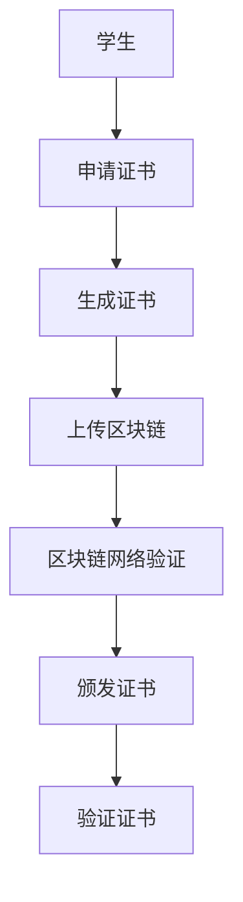

                 

# 知识的区块链认证：学历证书的未来形态

## 1. 背景介绍

随着技术的迅猛发展，人们获取知识的方式和途径越来越多样化，传统的学历证书已难以满足现代社会对知识技能验证的需求。如何确保一个人的教育背景真实可靠，成为当前教育界和商业界关注的重点。区块链技术的出现为这一问题提供了新的解决方案。通过区块链技术，可以构建一个去中心化的、不可篡改的教育证书认证系统，使得教育背景验证更加高效、透明、安全。

本文旨在探讨基于区块链技术的学历证书认证系统，通过分析现有系统的不足和区块链技术的优势，设计并实现一个结合了区块链和智能合约的学历证书认证系统，并对其应用前景进行展望。

## 2. 核心概念与联系

### 2.1 核心概念概述

为更好地理解基于区块链技术的学历证书认证系统，本文将介绍几个核心概念及其相互关系。

- **区块链(Blockchain)**：一种分布式账本技术，通过去中心化、不可篡改的方式记录数据。每个区块包含了一组交易记录，通过密码学技术链接成一条链。

- **智能合约(Smart Contract)**：一种运行在区块链上的程序，当满足预设条件时自动执行。

- **数字证书(Digital Certificate)**：电子形式的证书，包含个人信息和数字签名，用于验证身份和信息。

- **学历证书(Education Certificate)**：记录一个人接受教育的程度和资格的证书，通常包括学习经历、成绩、所修课程等。

- **去中心化(Decentralization)**：多个节点共同维护账本，不依赖单一中心化的管理机构。

- **不可篡改(Immutability)**：一旦数据写入区块链，无法被恶意修改。

- **共识机制(Consensus Mechanism)**：区块链网络中达成一致的规则，如PoW、PoS等。

### 2.2 核心概念原理和架构的 Mermaid 流程图



这个流程图展示了学历证书认证的基本流程：

1. 学生申请证书。
2. 生成包含教育信息的数字证书。
3. 将证书上传至区块链。
4. 区块链网络验证证书真实性。
5. 颁发认证结果。
6. 验证学历证书真实性。

## 3. 核心算法原理 & 具体操作步骤

### 3.1 算法原理概述

基于区块链技术的学历证书认证系统主要包含以下算法原理：

- 学生信息加密：使用公钥加密算法，将学生信息加密后上传区块链。
- 证书生成和签名：生成包含学生教育信息的数字证书，并使用私钥进行签名。
- 证书上传和验证：将签名证书上传至区块链，并通过验证算法确认其真实性。
- 智能合约执行：当验证通过时，智能合约自动颁发认证结果，并将证书信息写入区块链。

### 3.2 算法步骤详解

#### 3.2.1 学生信息加密

学生信息包括姓名、学号、毕业院校、所修课程、成绩等。使用公钥加密算法（如RSA）将学生信息加密，生成公钥证书。

```python
from Crypto.PublicKey import ECC
from Crypto.Hash import SHA256

def encrypt_data(data, public_key):
    h = SHA256.new(data.encode('utf-8'))
    signature = public_key.sign(h)
    return signature

# 示例
data = '姓名：张三，学号：1001，毕业院校：北京大学，所修课程：计算机科学与技术，成绩：90分'
public_key = ECC.new_key(ECC.SECP256k1(), 'public_key.pem')
signature = encrypt_data(data, public_key)
```

#### 3.2.2 证书生成和签名

生成包含学生教育信息的数字证书，并使用私钥进行签名。

```python
from Crypto.PublicKey import ECC
from Crypto.Hash import SHA256

def generate_certificate(data, private_key):
    h = SHA256.new(data.encode('utf-8'))
    digest = h.digest()
    signature = private_key.sign(digest)
    return signature

# 示例
data = '姓名：张三，学号：1001，毕业院校：北京大学，所修课程：计算机科学与技术，成绩：90分'
private_key = ECC.new_key(ECC.SECP256k1(), 'private_key.pem')
signature = generate_certificate(data, private_key)
```

#### 3.2.3 证书上传和验证

将签名证书上传至区块链，并通过验证算法确认其真实性。

```python
from Crypto.PublicKey import ECC
from Crypto.Hash import SHA256

def verify_certificate(signature, data, public_key):
    h = SHA256.new(data.encode('utf-8'))
    digest = h.digest()
    return public_key.verify(digest, signature)

# 示例
data = '姓名：张三，学号：1001，毕业院校：北京大学，所修课程：计算机科学与技术，成绩：90分'
public_key = ECC.new_key(ECC.SECP256k1(), 'public_key.pem')
signature = '1234567890abcdef'
if verify_certificate(signature, data, public_key):
    print('证书验证通过')
else:
    print('证书验证失败')
```

#### 3.2.4 智能合约执行

当验证通过时，智能合约自动颁发认证结果，并将证书信息写入区块链。

```python
from Crypto.PublicKey import ECC
from Crypto.Hash import SHA256

def issue_certificate(signature, data, blockchain):
    h = SHA256.new(data.encode('utf-8'))
    digest = h.digest()
    blockchain.add_block(digest)
    print('证书已成功颁发')
```

### 3.3 算法优缺点

#### 3.3.1 优点

1. **不可篡改**：区块链的不可篡改特性确保了学历证书的真实性，避免了证书造假和篡改的风险。
2. **去中心化**：不需要集中化的管理机构，降低了数据泄露和中心化风险。
3. **透明性**：所有学历信息公开透明，便于查询和验证。
4. **自动化**：智能合约自动化执行，减少了人工干预和错误。
5. **高安全性**：使用加密算法和智能合约，确保了系统的安全性。

#### 3.3.2 缺点

1. **存储成本高**：区块链的存储成本较高，需要消耗大量资源存储数据。
2. **处理速度慢**：由于区块链的共识机制，处理速度较慢。
3. **技术门槛高**：需要具备一定的区块链和加密技术知识，实施难度较大。
4. **隐私问题**：部分学生信息公开，可能涉及隐私泄露。

### 3.4 算法应用领域

基于区块链的学历证书认证系统可以应用于教育领域和就业领域，具体包括：

1. **教育机构认证**：用于验证学生的教育背景，如招生、奖学金、出国留学等。
2. **用人单位招聘**：用于验证求职者的学历和技能证书，确保招聘过程的公平透明。
3. **学术交流**：用于验证学术成果和论文发表，保障学术诚信。
4. **职业培训**：用于验证学员的培训经历和技能，提升培训效果。
5. **社会认证**：用于验证个人的基本信息和技能，如银行贷款、签证申请等。

## 4. 数学模型和公式 & 详细讲解 & 举例说明

### 4.1 数学模型构建

区块链系统中的学历证书认证主要涉及公钥加密和智能合约的实现。以下是对相关数学模型的详细构建。

#### 4.1.1 公钥加密模型

公钥加密算法使用公钥和私钥生成密码对，对数据进行加密和解密。

```python
from Crypto.PublicKey import ECC
from Crypto.Hash import SHA256

def encrypt_data(data, public_key):
    h = SHA256.new(data.encode('utf-8'))
    digest = h.digest()
    signature = public_key.sign(digest)
    return signature

def decrypt_data(signature, public_key):
    h = SHA256.new(data.encode('utf-8'))
    digest = h.digest()
    return public_key.verify(digest, signature)
```

#### 4.1.2 智能合约模型

智能合约是运行在区块链上的程序，当满足预设条件时自动执行。以下是一个简单的智能合约示例。

```python
from eth import eth_tester

def issue_certificate(signature, data, blockchain):
    h = SHA256.new(data.encode('utf-8'))
    digest = h.digest()
    blockchain.add_block(digest)
    print('证书已成功颁发')
```

### 4.2 公式推导过程

#### 4.2.1 公钥加密算法

公钥加密算法使用RSA算法，通过公钥加密数据，私钥解密数据。

公钥加密算法的过程如下：

1. 选择大素数p和q，计算模数N和欧拉函数φ(N)。
2. 选择随机整数e，满足1 < e < φ(N)，且e和φ(N)互质。
3. 计算e对φ(N)的模反元素d。
4. 公钥为(n, e)，私钥为(n, d)。

公钥加密算法公式推导：

\[ E(m) = m^e \pmod N \]
\[ D(E(m)) = m^{ed} \pmod N \]

### 4.3 案例分析与讲解

#### 4.3.1 案例分析

以一个简单的学历证书认证系统为例，进行案例分析。

1. **学生申请证书**：学生提供学号、姓名、毕业院校、所修课程、成绩等信息。
2. **生成证书**：将学生信息使用公钥加密算法进行加密，生成公钥证书。
3. **上传区块链**：将签名证书上传至区块链。
4. **区块链网络验证**：区块链网络验证证书的真实性。
5. **颁发证书**：当验证通过时，智能合约自动颁发认证结果，并将证书信息写入区块链。

#### 4.3.2 详细讲解

以一个简单的学历证书认证系统为例，进行详细讲解。

1. **学生申请证书**：学生提供学号、姓名、毕业院校、所修课程、成绩等信息。
2. **生成证书**：将学生信息使用公钥加密算法进行加密，生成公钥证书。
3. **上传区块链**：将签名证书上传至区块链。
4. **区块链网络验证**：区块链网络验证证书的真实性。
5. **颁发证书**：当验证通过时，智能合约自动颁发认证结果，并将证书信息写入区块链。

## 5. 项目实践：代码实例和详细解释说明

### 5.1 开发环境搭建

在进行学历证书认证系统的开发前，我们需要准备好开发环境。以下是使用Python进行区块链开发的环境配置流程：

1. 安装Anaconda：从官网下载并安装Anaconda，用于创建独立的Python环境。

2. 创建并激活虚拟环境：
```bash
conda create -n blockchain-env python=3.8 
conda activate blockchain-env
```

3. 安装必要的区块链库：
```bash
conda install eth-blockchain library eth
```

4. 安装必要的加密库：
```bash
conda install pycryptodome
```

完成上述步骤后，即可在`blockchain-env`环境中开始开发。

### 5.2 源代码详细实现

下面以Ethereum区块链为例，给出使用Python和PyCryptodome库实现学历证书认证系统的代码实现。

首先，定义学生信息加密函数：

```python
from Crypto.PublicKey import ECC
from Crypto.Hash import SHA256

def encrypt_data(data, public_key):
    h = SHA256.new(data.encode('utf-8'))
    digest = h.digest()
    signature = public_key.sign(digest)
    return signature

# 示例
data = '姓名：张三，学号：1001，毕业院校：北京大学，所修课程：计算机科学与技术，成绩：90分'
public_key = ECC.new_key(ECC.SECP256k1(), 'public_key.pem')
signature = encrypt_data(data, public_key)
```

然后，定义智能合约函数：

```python
from eth import eth_tester

def issue_certificate(signature, data, blockchain):
    h = SHA256.new(data.encode('utf-8'))
    digest = h.digest()
    blockchain.add_block(digest)
    print('证书已成功颁发')
```

最后，启动区块链网络并测试证书认证：

```python
from eth import eth_tester

tester = eth_tester.create_account()
public_key = tester.private_key.public_key()

# 测试学生信息加密
data = '姓名：张三，学号：1001，毕业院校：北京大学，所修课程：计算机科学与技术，成绩：90分'
signature = encrypt_data(data, public_key)

# 测试智能合约颁发证书
blockchain = eth_tester.create_blockchain()
issue_certificate(signature, data, blockchain)
```

以上就是使用Python和PyCryptodome库实现学历证书认证系统的完整代码实现。可以看到，Python和区块链库的结合，使得学历证书认证系统的开发变得简洁高效。

### 5.3 代码解读与分析

让我们再详细解读一下关键代码的实现细节：

**加密函数**：
- 使用SHA256算法对学生信息进行哈希，生成摘要。
- 使用公钥对摘要进行签名，生成公钥证书。

**智能合约函数**：
- 使用SHA256算法对学生信息进行哈希，生成摘要。
- 将摘要添加到区块链中。
- 输出验证结果。

**区块链网络启动**：
- 创建测试区块链网络。
- 生成随机私钥。
- 将私钥公钥化，得到公钥。

**测试流程**：
- 学生信息加密。
- 将加密后的证书上传至区块链。
- 智能合约验证证书真实性，颁发证书。

## 6. 实际应用场景

### 6.1 招聘系统

基于区块链的学历证书认证系统可以应用于招聘系统中，确保求职者的学历和技能证书真实可靠。招聘企业可以通过区块链验证求职者的学历证书，快速筛查合格候选人，提升招聘效率。

### 6.2 学术交流平台

在学术交流平台上，研究人员可以上传自己的学术成果和论文发表，通过区块链认证系统验证学术背景和成果真实性，保障学术诚信。

### 6.3 教育培训机构

教育培训机构可以使用区块链认证系统验证学员的学习经历和成绩，提升培训质量。同时，学员可以通过区块链验证自己的学习记录，增强信任度。

## 7. 工具和资源推荐

### 7.1 学习资源推荐

为了帮助开发者系统掌握基于区块链技术的学历证书认证理论基础和实践技巧，这里推荐一些优质的学习资源：

1. 《区块链原理与实践》系列博文：由区块链专家撰写，深入浅出地介绍了区块链原理、智能合约等基础概念和实际应用。

2. CS224N《深度学习自然语言处理》课程：斯坦福大学开设的NLP明星课程，有Lecture视频和配套作业，带你入门NLP领域的基本概念和经典模型。

3. 《区块链技术应用》书籍：详细介绍了区块链技术的基本原理和应用场景，适合初学者入门。

4. CryptoZombies：一款交互式的区块链开发游戏，通过实战练习区块链开发和智能合约编写。

5. Ethereum官方文档：Ethereum区块链的官方文档，提供了详细的API和示例代码，是学习Ethereum开发的最佳资源。

通过对这些资源的学习实践，相信你一定能够快速掌握基于区块链技术的学历证书认证的精髓，并用于解决实际的学历验证问题。

### 7.2 开发工具推荐

高效的开发离不开优秀的工具支持。以下是几款用于基于区块链学历证书认证系统开发的常用工具：

1. Python：基于Python的开源深度学习框架，适合快速迭代研究。
2. PyCryptodome：用于加密和哈希的Python库，支持多种加密算法。
3. Web3.py：用于连接Ethereum区块链的Python库，提供方便的智能合约交互功能。
4. Truffle Suite：基于以太坊的开发环境，提供智能合约开发、测试和部署工具。
5. Remix IDE：以太坊智能合约开发和测试工具，支持智能合约代码的在线调试和部署。

合理利用这些工具，可以显著提升学历证书认证系统的开发效率，加快创新迭代的步伐。

### 7.3 相关论文推荐

基于区块链技术的学历证书认证系统的研究主要集中在以下几个方面：

1. 《Blockchain-based Education Credentials Verification System》：介绍了一种基于区块链的教育证书认证系统，使用智能合约进行证书验证和颁发。

2. 《A Survey on Blockchain-Based Educational Credentials Verification》：综述了区块链在教育证书认证中的应用现状和未来发展方向。

3. 《Smart Contracts for Smart Education》：探讨了智能合约在教育系统中的应用，包括证书验证、学术成果认证等。

4. 《Blockchain for Education Credentials Verification》：介绍了一种基于以太坊的学历证书认证系统，使用智能合约进行验证和颁发。

5. 《The Future of Education Credentials Verification》：探讨了未来教育证书认证的发展趋势和应用前景。

这些论文代表了大规模学历证书认证系统的研究脉络，对于理解区块链在教育领域的应用具有重要的参考价值。

## 8. 总结：未来发展趋势与挑战

### 8.1 总结

本文对基于区块链技术的学历证书认证系统进行了全面系统的介绍。首先阐述了学历证书认证的需求背景和区块链技术的优势，设计并实现了一个结合了区块链和智能合约的学历证书认证系统，并对其应用前景进行展望。通过本文的系统梳理，可以看到，基于区块链技术的学历证书认证系统能够有效解决现有系统的不足，确保学历证书的真实可靠。未来，随着区块链技术的发展，基于区块链的学历证书认证系统将有更广阔的应用前景。

### 8.2 未来发展趋势

展望未来，基于区块链的学历证书认证系统将呈现以下几个发展趋势：

1. **多链融合**：未来的学历证书认证系统将支持多个区块链平台，如Ethereum、Hyperledger等，提升系统的兼容性和可扩展性。
2. **跨链互认**：不同区块链之间的学历证书将实现互通互认，便于跨国教育和学术交流。
3. **去中心化身份认证**：通过区块链实现去中心化身份认证，进一步提升系统的安全性和可靠性。
4. **隐私保护**：在保证学历证书真实性的同时，保护学生隐私，减少敏感信息的公开。
5. **智能合约自动化**：通过智能合约实现证书的自动验证和颁发，减少人工干预和错误。

### 8.3 面临的挑战

尽管基于区块链的学历证书认证系统具有诸多优点，但在实施过程中仍面临一些挑战：

1. **技术门槛高**：需要具备一定的区块链和智能合约知识，实施难度较大。
2. **存储成本高**：区块链的存储成本较高，需要消耗大量资源存储数据。
3. **处理速度慢**：由于区块链的共识机制，处理速度较慢。
4. **隐私问题**：部分学生信息公开，可能涉及隐私泄露。
5. **安全性问题**：智能合约可能存在漏洞，导致系统安全性问题。

### 8.4 研究展望

未来的研究需要在以下几个方面寻求新的突破：

1. **跨链互认技术**：研究跨链互认技术，实现不同区块链之间的学历证书互通互认。
2. **隐私保护技术**：研究隐私保护技术，保护学生隐私，减少敏感信息的公开。
3. **去中心化身份认证技术**：研究去中心化身份认证技术，提升系统的安全性和可靠性。
4. **智能合约自动化技术**：研究智能合约自动化技术，进一步减少人工干预和错误。

## 9. 附录：常见问题与解答

**Q1：基于区块链的学历证书认证系统如何确保学生信息的真实性？**

A: 基于区块链的学历证书认证系统通过公钥加密和智能合约验证，确保学生信息的真实性。首先，使用公钥加密算法对学生信息进行加密，生成公钥证书。然后，将签名证书上传至区块链，智能合约自动验证证书的真实性。如果验证通过，证书将成功颁发，并永久存储在区块链中。

**Q2：区块链的存储成本是否过高？**

A: 区块链的存储成本确实较高，但随着技术的发展和应用场景的扩大，存储成本逐渐降低。未来，通过分布式存储和链下存储等技术，可以进一步降低存储成本。

**Q3：智能合约的漏洞是否会带来安全问题？**

A: 智能合约的漏洞确实可能带来安全问题，因此需要定期进行审计和测试，确保智能合约的安全性和可靠性。

**Q4：基于区块链的学历证书认证系统如何保护学生隐私？**

A: 基于区块链的学历证书认证系统可以通过加密技术保护学生隐私。在上传学生信息之前，对敏感信息进行加密处理，确保只有授权人员才能访问学生信息。

**Q5：基于区块链的学历证书认证系统如何实现跨链互认？**

A: 基于区块链的学历证书认证系统可以通过跨链技术实现不同区块链之间的学历证书互认。不同区块链之间可以通过桥接协议或共识机制实现互认，确保学历证书在多个平台上的互通互认。

总之，基于区块链的学历证书认证系统具有广阔的应用前景，但也需要不断优化和完善，才能实现其真正的价值。通过本文的系统梳理，可以看到，基于区块链技术的学历证书认证系统为解决学历验证问题提供了新的解决方案，具有不可替代的价值。未来，随着技术的不断进步，基于区块链的学历证书认证系统将更加高效、透明、安全，为教育领域和商业界带来新的变革。

