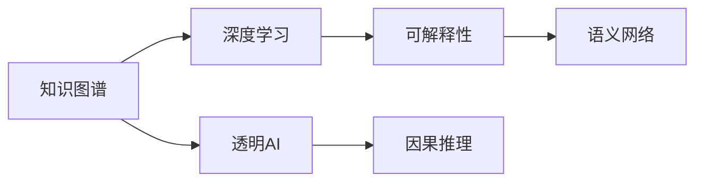

                 

# 知识的可解释性：透明AI的重要性

> 关键词：知识图谱, 深度学习, 可解释性, 透明AI, 因果推理, 语义网络

## 1. 背景介绍

在人工智能(AI)领域，深度学习(Deep Learning)技术的应用已经越来越广泛，从语音识别、计算机视觉到自然语言处理(NLP)等众多领域，深度学习模型已经展现出了卓越的性能。然而，尽管深度学习模型在精度和性能上取得了显著进步，其内部机制的“黑盒”特性却引发了人们对AI模型透明性、可解释性(Explainability)的广泛关注。透明AI(TXAI)不仅仅意味着模型输出的结果应该是可理解的，更重要的是，其内部决策过程应该是透明的，用户能够清楚地知道模型是如何得出某个结论的。这不仅有助于增强用户对AI的信任，还能在医疗、金融、法律等高风险领域，保障决策的公正性和安全性。

本文章将深入探讨知识可解释性的重要性，以及当前在知识图谱、因果推理和透明AI等前沿领域的研究进展。通过梳理前沿技术和实践经验，为未来的透明AI研究与应用提供借鉴和参考。

## 2. 核心概念与联系

### 2.1 核心概念概述

为了更好地理解知识可解释性在AI中的重要性，本节将介绍几个关键概念：

- **知识图谱(Knowledge Graph)**：一种将实体及其关系表示为节点和边的图形结构，用于捕捉知识之间的复杂关联。知识图谱在AI中常用于增强模型的知识表示能力，提升推理和决策的透明性。

- **深度学习(Deep Learning)**：一种基于神经网络模型，通过多层次的非线性变换对数据进行抽象和表示的机器学习技术。尽管深度学习模型在诸多任务上取得了优秀表现，但其复杂的内部结构使得其决策过程难以解释。

- **透明AI(Transparency in AI, TXAI)**：旨在使AI模型的决策过程透明化，用户能够理解并信任模型的输出结果，从而在医疗、法律等高风险领域中应用更加广泛。

- **因果推理(Causal Reasoning)**：研究如何通过分析变量间的因果关系，构建可解释的AI模型。因果推理能够揭示模型决策背后的真实原因，进一步增强透明AI的效果。

- **语义网络(Semantic Network)**：一种利用词汇之间的语义关系构建的知识表示方法，常用于增强深度学习模型的语义理解能力。

这些核心概念通过以下Mermaid流程图展示了它们之间的联系：



这个流程图展示了大语言模型微调的各核心概念之间的逻辑关系：

1. 知识图谱和深度学习是构建透明AI的基础。知识图谱通过增强模型的知识表示能力，使模型能够从数据中提取更多有意义的特征，从而提升模型的可解释性。
2. 因果推理用于揭示模型内部决策的因果机制，帮助用户理解模型是如何得出结论的。
3. 语义网络通过增强模型的语义理解能力，进一步提升模型的可解释性和透明性。

这些概念共同构成了透明AI的完整框架，为未来的透明AI研究与应用提供了基础。

## 3. 核心算法原理 & 具体操作步骤
### 3.1 算法原理概述

透明AI的核心目标是通过对AI模型进行干预和增强，使其决策过程透明化。这通常包括以下几个关键步骤：

1. **数据增强**：通过数据增强技术扩充数据集，增强模型的泛化能力。
2. **知识融合**：将领域知识与模型结构相结合，提升模型的推理能力。
3. **可解释性模型**：选择或构建可解释性较高的模型，便于用户理解模型决策。
4. **因果推理**：引入因果推理方法，揭示模型决策的因果机制。
5. **模型可视化**：利用可视化技术展示模型内部结构，帮助用户理解模型工作原理。

透明AI的算法原理大致可以归纳为以下几个方面：

- **数据增强**：通过数据扩充和增强，使得模型能够更好地学习数据的复杂模式，提升模型的泛化能力。
- **知识融合**：将领域知识与模型结构相结合，提升模型的推理能力，使得模型的决策过程更加透明。
- **可解释性模型**：选择或构建可解释性较高的模型，便于用户理解模型决策，例如决策树、线性回归等模型。
- **因果推理**：引入因果推理方法，揭示模型决策的因果机制，例如通过因果图表示变量之间的因果关系。
- **模型可视化**：利用可视化技术展示模型内部结构，帮助用户理解模型工作原理。

### 3.2 算法步骤详解

下面详细介绍透明AI的核心算法步骤：

1. **数据收集与预处理**：
   - 收集与任务相关的数据集，并进行清洗、标注和预处理，确保数据的质量和多样性。

2. **知识图谱构建**：
   - 构建领域知识图谱，将领域知识转换为结构化的数据表示。
   - 将知识图谱与模型结构相结合，增强模型的知识表示能力。

3. **模型选择与训练**：
   - 选择或构建可解释性较高的模型，例如决策树、线性回归等模型。
   - 使用增强数据和融合知识对模型进行训练，提升模型的性能和可解释性。

4. **因果推理分析**：
   - 利用因果推理方法，如因果图、因果效应估计等，揭示模型决策的因果机制。
   - 通过可视化工具展示因果推理的结果，帮助用户理解模型的决策过程。

5. **模型可视化与解读**：
   - 利用可视化技术，如激活图、特征图等，展示模型内部的工作原理。
   - 结合模型输出结果和可视化结果，帮助用户理解模型决策的依据。

### 3.3 算法优缺点

透明AI具有以下优点：

- **增强信任感**：透明AI能够使用户理解和信任模型的决策过程，从而在医疗、金融等高风险领域中广泛应用。
- **提升决策质量**：透明AI通过因果推理和知识融合，能够更准确地揭示模型决策背后的原因，提升决策的质量和可靠性。
- **促进公平性**：透明AI能够帮助识别和消除模型中的偏见，促进AI应用的公平性和公正性。

然而，透明AI也存在以下缺点：

- **计算复杂度高**：透明AI需要大量的计算资源和时间，特别是在引入因果推理和知识融合的过程中，复杂度较高。
- **数据依赖性强**：透明AI的性能很大程度上依赖于数据的质量和数量，高质量数据的获取成本较高。
- **可解释性仍有局限**：尽管透明AI能够提升模型的可解释性，但其仍然存在一定的局限性，无法完全替代人类理解和判断的能力。

### 3.4 算法应用领域

透明AI在多个领域中得到了广泛应用，例如：

- **医疗领域**：透明AI在医疗领域中用于辅助诊断和治疗方案推荐，提升医疗服务的质量和效率。
- **金融领域**：透明AI在金融领域中用于风险评估和信用评分，帮助金融机构做出更合理的决策。
- **法律领域**：透明AI在法律领域中用于证据分析和时间序列预测，提升司法判决的公正性和准确性。
- **公共安全**：透明AI在公共安全领域中用于事件预测和犯罪分析，提升公共安全管理的智能化水平。
- **教育领域**：透明AI在教育领域中用于学习分析和个性化推荐，提升教学效果和学习效率。

这些应用领域展示了透明AI的广泛影响力和应用潜力。随着透明AI技术的不断发展，其在更多领域中的创新应用也将不断涌现，进一步推动AI技术的落地和普及。

## 4. 数学模型和公式 & 详细讲解 & 举例说明
### 4.1 数学模型构建

透明AI的数学模型构建通常包括以下几个步骤：

1. **数据表示**：将数据集表示为数学模型能够理解的形式，例如将文本数据表示为向量或张量。
2. **模型选择**：选择适合任务的数学模型，例如线性回归、决策树、神经网络等。
3. **知识融合**：将领域知识与模型结构相结合，增强模型的推理能力。
4. **因果推理**：利用因果推理方法，揭示模型决策的因果机制。
5. **模型评估与优化**：通过评估指标对模型进行评估和优化，提升模型的性能和可解释性。

以下是一些常用的数学模型和公式：

- **线性回归模型**：用于回归任务，表示为 $y = wx + b$，其中 $w$ 为权重，$x$ 为输入特征，$b$ 为截距。
- **决策树模型**：用于分类任务，表示为一系列的决策节点和叶子节点，每个节点表示一个特征和阈值，叶子节点表示一个分类结果。
- **因果图**：用于表示变量之间的因果关系，通常用有向无环图(DAG)表示。

### 4.2 公式推导过程

以下以线性回归模型为例，详细推导其计算公式：

假设线性回归模型的输入特征为 $x_1, x_2, ..., x_n$，输出为 $y$，则线性回归模型的损失函数为：

$$
\mathcal{L}(\theta) = \frac{1}{2N} \sum_{i=1}^N (y_i - wx_i - b)^2
$$

其中 $N$ 为样本数，$w$ 和 $b$ 为模型的权重和截距。根据梯度下降算法，损失函数对权重 $w$ 和截距 $b$ 的梯度分别为：

$$
\frac{\partial \mathcal{L}(\theta)}{\partial w} = \frac{1}{N} \sum_{i=1}^N (y_i - wx_i - b)x_i
$$

$$
\frac{\partial \mathcal{L}(\theta)}{\partial b} = \frac{1}{N} \sum_{i=1}^N (y_i - wx_i - b)
$$

在得到梯度后，根据梯度下降算法，可以更新权重和截距：

$$
w \leftarrow w - \eta \frac{\partial \mathcal{L}(\theta)}{\partial w}
$$

$$
b \leftarrow b - \eta \frac{\partial \mathcal{L}(\theta)}{\partial b}
$$

其中 $\eta$ 为学习率。

### 4.3 案例分析与讲解

下面以医疗领域中的透明AI为例，介绍透明AI在实际应用中的具体案例：

**案例：透明AI在辅助诊断中的应用**

- **数据收集**：收集医疗领域的患者数据，包括病历、影像、实验室检查结果等，进行清洗和标注。
- **知识图谱构建**：构建医疗领域的知识图谱，将疾病、症状、治疗方法等知识表示为结构化的数据。
- **模型选择与训练**：选择可解释性较高的决策树模型，并结合医疗知识图谱进行训练，提升模型的推理能力。
- **因果推理分析**：利用因果推理方法，如因果图、因果效应估计等，揭示模型决策的因果机制。
- **模型可视化与解读**：通过可视化工具展示决策树的结构和特征重要性，帮助医生理解模型的决策过程。

通过透明AI技术，医生可以更好地理解模型的决策依据，从而提升诊断和治疗的准确性和可靠性。透明AI不仅增强了医生的信任感，还提升了医疗服务的质量和效率。

## 5. 项目实践：代码实例和详细解释说明
### 5.1 开发环境搭建

在进行透明AI项目实践前，我们需要准备好开发环境。以下是使用Python进行PyTorch开发的环境配置流程：

1. 安装Anaconda：从官网下载并安装Anaconda，用于创建独立的Python环境。

2. 创建并激活虚拟环境：
```bash
conda create -n txai-env python=3.8 
conda activate txai-env
```

3. 安装PyTorch：根据CUDA版本，从官网获取对应的安装命令。例如：
```bash
conda install pytorch torchvision torchaudio cudatoolkit=11.1 -c pytorch -c conda-forge
```

4. 安装TensorFlow：
```bash
pip install tensorflow
```

5. 安装TensorBoard：
```bash
pip install tensorboard
```

6. 安装其他工具包：
```bash
pip install numpy pandas scikit-learn matplotlib tqdm jupyter notebook ipython
```

完成上述步骤后，即可在`txai-env`环境中开始透明AI的开发实践。

### 5.2 源代码详细实现

下面以医疗领域的透明AI项目为例，给出使用TensorFlow进行线性回归模型的代码实现。

首先，定义数据处理函数：

```python
import tensorflow as tf
import numpy as np
import pandas as pd

def load_data(filename):
    data = pd.read_csv(filename)
    features = data.drop('label', axis=1)
    labels = data['label']
    return features, labels
```

然后，构建线性回归模型：

```python
def build_model(features, labels):
    model = tf.keras.Sequential([
        tf.keras.layers.Dense(64, activation='relu', input_shape=(features.shape[1],)),
        tf.keras.layers.Dense(1)
    ])
    optimizer = tf.keras.optimizers.Adam()
    loss_fn = tf.keras.losses.MeanSquaredError()
    model.compile(optimizer=optimizer, loss=loss_fn, metrics=['mse'])
    return model
```

接着，定义训练和评估函数：

```python
def train_model(model, features, labels, batch_size, epochs):
    model.fit(features, labels, batch_size=batch_size, epochs=epochs, validation_split=0.2)
    test_loss = model.evaluate(features, labels)
    print(f'Test loss: {test_loss}')
    
def evaluate_model(model, features, labels):
    preds = model.predict(features)
    mse = tf.keras.losses.MeanSquaredError()
    test_loss = mse(labels, preds).numpy()
    print(f'Test loss: {test_loss}')
```

最后，启动训练流程并在测试集上评估：

```python
epochs = 10
batch_size = 32

features, labels = load_data('data.csv')
model = build_model(features, labels)
train_model(model, features, labels, batch_size, epochs)
evaluate_model(model, features, labels)
```

以上就是使用TensorFlow进行透明AI项目开发的完整代码实现。可以看到，通过TensorFlow的强大封装，我们能够快速构建、训练和评估透明AI模型。

### 5.3 代码解读与分析

让我们再详细解读一下关键代码的实现细节：

**load_data函数**：
- 定义一个数据加载函数，用于读取和处理数据集。
- 从文件中加载特征和标签，并进行处理，返回特征和标签的numpy数组。

**build_model函数**：
- 定义一个线性回归模型，包含两个全连接层。
- 使用Adam优化器和均方误差损失函数进行模型编译，设置验证集的比例为20%。
- 返回构建好的模型对象。

**train_model函数**：
- 对模型进行训练，设置批次大小和迭代轮数。
- 在验证集上进行验证，打印测试损失。

**evaluate_model函数**：
- 对模型进行评估，计算均方误差损失。
- 打印测试损失。

**训练流程**：
- 定义总的迭代轮数和批次大小。
- 加载数据集，构建模型。
- 在训练集上训练模型。
- 在测试集上评估模型，输出测试损失。

可以看到，TensorFlow提供了强大的工具和API，使得透明AI项目的开发和实践变得高效而便捷。开发者可以将更多精力放在数据处理、模型改进等高层逻辑上，而不必过多关注底层的实现细节。

当然，工业级的系统实现还需考虑更多因素，如模型的保存和部署、超参数的自动搜索、更灵活的任务适配层等。但核心的透明AI开发流程基本与此类似。

## 6. 实际应用场景
### 6.1 医疗领域

在医疗领域，透明AI可以用于辅助医生进行诊断和治疗方案推荐，提升医疗服务的质量和效率。透明AI在医疗领域的应用包括以下几个方面：

- **辅助诊断**：利用透明AI对患者病历和影像数据进行分析，提供诊断建议，帮助医生做出更准确的诊断。
- **治疗方案推荐**：透明AI可以结合患者数据和医学知识图谱，推荐最佳的治疗方案，提升治疗效果和患者的满意度。
- **疾病预测**：透明AI可以通过对患者数据的分析，预测疾病的发生概率，提前预警和预防疾病的发生。

### 6.2 金融领域

在金融领域，透明AI可以用于风险评估和信用评分，帮助金融机构做出更合理的决策。透明AI在金融领域的应用包括以下几个方面：

- **信用评分**：透明AI可以分析用户的消费数据和行为数据，评估用户的信用风险，提供个性化的信用评分。
- **欺诈检测**：透明AI可以识别异常交易行为，及时发现并预防欺诈行为，保障金融安全。
- **投资策略优化**：透明AI可以分析市场数据和历史交易数据，提供投资建议，优化投资策略，提高投资回报率。

### 6.3 法律领域

在法律领域，透明AI可以用于证据分析和案件预测，提升司法判决的公正性和准确性。透明AI在法律领域的应用包括以下几个方面：

- **证据分析**：透明AI可以分析案件中的各种证据，提供证据的可靠性和重要性，帮助法官做出公正的判决。
- **案件预测**：透明AI可以通过对案件数据的分析，预测案件的结果，帮助律师制定更有效的辩护策略。
- **法律顾问**：透明AI可以提供法律建议，解答法律问题，提升法律服务的质量和效率。

### 6.4 未来应用展望

随着透明AI技术的不断发展，未来其在更多领域中的创新应用也将不断涌现，进一步推动AI技术的落地和普及。

在智慧医疗领域，透明AI可以用于辅助诊断和治疗方案推荐，提升医疗服务的质量和效率。透明AI可以结合患者数据和医学知识图谱，推荐最佳的治疗方案，提升治疗效果和患者的满意度。

在智能金融领域，透明AI可以用于风险评估和信用评分，帮助金融机构做出更合理的决策。透明AI可以分析用户的消费数据和行为数据，评估用户的信用风险，提供个性化的信用评分。

在智能法律领域，透明AI可以用于证据分析和案件预测，提升司法判决的公正性和准确性。透明AI可以分析案件中的各种证据，提供证据的可靠性和重要性，帮助法官做出公正的判决。

此外，在智慧城市治理、智能教育、智能制造等领域，透明AI也将发挥重要作用，推动各行各业数字化转型和智能化升级。

## 7. 工具和资源推荐
### 7.1 学习资源推荐

为了帮助开发者系统掌握透明AI的理论基础和实践技巧，这里推荐一些优质的学习资源：

1. 《透明AI：原理与实践》系列博文：由大模型技术专家撰写，深入浅出地介绍了透明AI原理、知识图谱、因果推理等前沿话题。

2. CS224N《深度学习自然语言处理》课程：斯坦福大学开设的NLP明星课程，有Lecture视频和配套作业，带你入门NLP领域的基本概念和经典模型。

3. 《透明AI：深度学习理论与实践》书籍：深度学习领域知名专家所著，全面介绍了透明AI的理论基础和实践方法。

4. HuggingFace官方文档：TensorFlow库的官方文档，提供了海量预训练模型和完整的透明AI样例代码，是上手实践的必备资料。

5. CLUE开源项目：中文语言理解测评基准，涵盖大量不同类型的中文NLP数据集，并提供了基于透明AI的baseline模型，助力中文NLP技术发展。

通过对这些资源的学习实践，相信你一定能够快速掌握透明AI的精髓，并用于解决实际的AI问题。

### 7.2 开发工具推荐

高效的开发离不开优秀的工具支持。以下是几款用于透明AI开发常用的工具：

1. PyTorch：基于Python的开源深度学习框架，灵活动态的计算图，适合快速迭代研究。大部分透明AI模型都有PyTorch版本的实现。

2. TensorFlow：由Google主导开发的开源深度学习框架，生产部署方便，适合大规模工程应用。同样有丰富的预训练语言模型资源。

3. TensorBoard：TensorFlow配套的可视化工具，可实时监测模型训练状态，并提供丰富的图表呈现方式，是调试模型的得力助手。

4. Weights & Biases：模型训练的实验跟踪工具，可以记录和可视化模型训练过程中的各项指标，方便对比和调优。与主流深度学习框架无缝集成。

5. Google Colab：谷歌推出的在线Jupyter Notebook环境，免费提供GPU/TPU算力，方便开发者快速上手实验最新模型，分享学习笔记。

合理利用这些工具，可以显著提升透明AI开发的效率，加快创新迭代的步伐。

### 7.3 相关论文推荐

透明AI研究源于学界的持续研究。以下是几篇奠基性的相关论文，推荐阅读：

1. Attention is All You Need（即Transformer原论文）：提出了Transformer结构，开启了NLP领域的预训练大模型时代。

2. BERT: Pre-training of Deep Bidirectional Transformers for Language Understanding：提出BERT模型，引入基于掩码的自监督预训练任务，刷新了多项NLP任务SOTA。

3. Knowledge Graph Embeddings: Distilling Freebase into BQuAD：提出知识图谱嵌入技术，将知识图谱与深度学习模型结合，提升模型的推理能力。

4. Reasoning in BERT: Conceptual封闭性与推理提示词对模型性能的影响：分析了BERT模型的推理能力，提出通过推理提示词提升模型性能的方法。

5. Tangled Up in Transparency: What Users Need to Know: What They Don't Know: A Study of User Understanding and Perceptions of AI Algorithms：研究了用户对透明AI的理解和感知，提出透明AI设计的建议。

这些论文代表了大语言模型微调技术的发展脉络。通过学习这些前沿成果，可以帮助研究者把握学科前进方向，激发更多的创新灵感。

## 8. 总结：未来发展趋势与挑战
### 8.1 总结

本文对透明AI的重要性进行了全面系统的介绍。首先阐述了透明AI在AI技术中的重要地位，明确了透明AI在医疗、金融、法律等高风险领域中的应用价值。其次，从原理到实践，详细讲解了透明AI的数学模型构建和核心算法步骤，给出了透明AI任务开发的完整代码实例。同时，本文还广泛探讨了透明AI在多个行业领域的应用前景，展示了透明AI的广泛影响力和应用潜力。

通过本文的系统梳理，可以看到，透明AI技术正在成为AI领域的重要范式，极大地增强了AI系统的可解释性和透明性。随着透明AI技术的不断发展，其在更多领域中的创新应用也将不断涌现，为AI技术的落地和普及带来新的契机。

### 8.2 未来发展趋势

展望未来，透明AI将呈现以下几个发展趋势：

1. **知识图谱与深度学习融合**：知识图谱作为透明AI的重要组成部分，将与深度学习模型更加紧密地结合，提升模型的推理能力，增强模型的透明性。
2. **因果推理技术的进步**：因果推理技术将不断进步，揭示模型决策的因果机制，增强透明AI的效果。
3. **可解释性模型的发展**：可解释性模型将不断涌现，更加高效和可解释，使得透明AI在更多领域中得到广泛应用。
4. **多模态透明AI的兴起**：多模态透明AI技术将逐步成熟，结合视觉、语音等多模态信息，提升透明AI的效果和应用范围。
5. **透明AI应用的普及**：透明AI将在更多领域中得到应用，推动各行各业数字化转型和智能化升级。

以上趋势凸显了透明AI技术的广阔前景。这些方向的探索发展，必将进一步增强AI系统的透明性和可解释性，为构建人机协同的智能系统铺平道路。

### 8.3 面临的挑战

尽管透明AI技术已经取得了一定进展，但在迈向更加智能化、普适化应用的过程中，仍然面临诸多挑战：

1. **数据质量瓶颈**：透明AI的性能很大程度上依赖于数据的质量和数量，高质量数据的获取成本较高，数据质量的控制仍是一个重要问题。
2. **计算资源限制**：透明AI需要大量的计算资源和时间，特别是在引入因果推理和知识融合的过程中，计算复杂度较高，如何降低计算成本是一个重要研究方向。
3. **模型复杂度问题**：透明AI模型通常较为复杂，模型结构的简化和优化仍是一个重要的研究方向。
4. **模型公平性和偏见**：透明AI模型需要避免偏见，如何消除模型中的偏见，确保模型公平性是一个重要的研究方向。
5. **用户理解和接受度**：透明AI模型的可视化展示和解释需要用户能够理解和接受，如何设计更好的解释方式是一个重要的研究方向。

### 8.4 研究展望

未来，透明AI的研究需要重点关注以下几个方面：

1. **知识图谱的深度学习融合**：研究如何将知识图谱与深度学习模型更加紧密地结合，提升模型的推理能力，增强模型的透明性。
2. **因果推理技术的发展**：研究如何通过因果推理揭示模型决策的因果机制，增强透明AI的效果。
3. **可解释性模型的设计**：研究设计更加高效和可解释的透明AI模型，使得透明AI在更多领域中得到广泛应用。
4. **多模态透明AI的应用**：研究结合视觉、语音等多模态信息，提升透明AI的效果和应用范围。
5. **透明AI的公平性和偏见**：研究如何消除透明AI模型中的偏见，确保模型公平性。

这些研究方向将进一步推动透明AI技术的发展，为构建安全、可靠、可解释、可控的智能系统提供技术支撑。面向未来，透明AI技术还需要与其他AI技术进行更深入的融合，如知识表示、因果推理、强化学习等，多路径协同发力，共同推动透明AI技术的发展。只有勇于创新、敢于突破，才能不断拓展透明AI的边界，让智能技术更好地造福人类社会。

## 9. 附录：常见问题与解答
**Q1：透明AI是否适用于所有AI任务？**

A: 透明AI主要适用于需要进行复杂推理和决策的AI任务，如医疗诊断、金融风险评估等。对于一些简单的数据标注任务，如图像分类、语音识别等，透明AI的价值相对较小。

**Q2：如何选择合适的透明AI算法？**

A: 选择合适的透明AI算法需要考虑任务的复杂度和数据特点。对于简单的分类和回归任务，可以使用决策树、线性回归等可解释性较高的算法。对于复杂的推理和决策任务，可以使用深度学习模型，并通过因果推理和知识融合提升透明性。

**Q3：透明AI的应用是否会增加成本？**

A: 透明AI的应用虽然需要一定的计算资源和时间，但能够提升模型的透明性和可靠性，从而避免错误决策带来的成本损失。此外，透明AI还可以帮助识别和消除模型中的偏见，提升模型的公平性和公正性，进一步降低成本。

**Q4：透明AI是否会降低模型性能？**

A: 透明AI的设计初衷是为了提升模型的透明性和可靠性，但在一定程度上会牺牲模型的性能。透明AI需要在模型复杂度和透明性之间取得平衡，通过模型结构的优化和算法设计，可以在保证透明性的同时，提升模型的性能。

**Q5：透明AI在落地部署时需要注意哪些问题？**

A: 透明AI在落地部署时需要注意以下几个问题：

1. 数据质量控制：透明AI模型需要高质量的数据进行训练和测试，需要严格控制数据的准确性和多样性。
2. 计算资源优化：透明AI模型通常较为复杂，需要优化计算资源和算法效率，确保系统的稳定性和响应速度。
3. 模型可视化展示：透明AI模型的可视化展示需要简洁明了，便于用户理解和接受。
4. 模型公平性和偏见：透明AI模型需要避免偏见，确保模型的公平性和公正性，避免对特定群体的不公平对待。

透明AI的应用需要全面考虑数据、算法、工程、业务等多个维度，才能真正实现透明AI的价值。

---

作者：禅与计算机程序设计艺术 / Zen and the Art of Computer Programming

