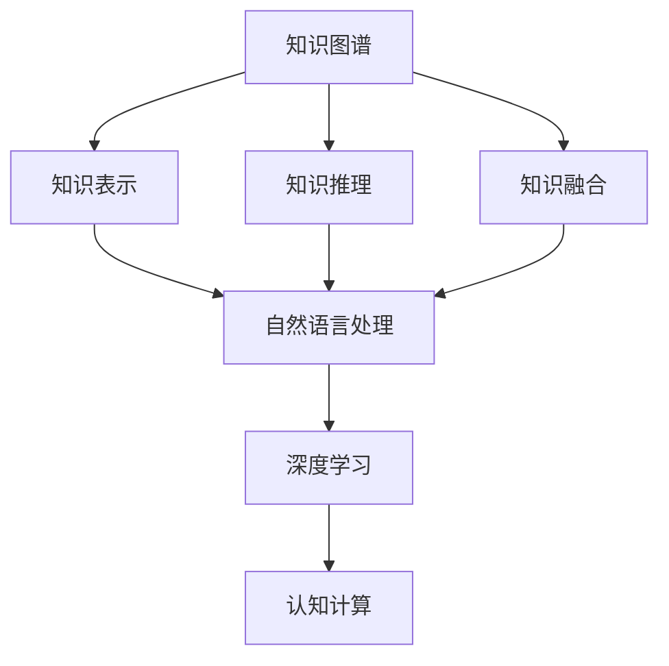

                 

# 知识的层次结构：从表象到本质

> 关键词：知识图谱, 知识表示, 知识推理, 知识融合, 自然语言处理, 深度学习, 认知计算

## 1. 背景介绍

### 1.1 问题由来
在知识密集型社会，知识的获取、处理、应用已经成为重要的战略资源。然而，传统知识的获取和应用方式往往局限于线性结构的知识库和符号化的表达方式，难以对大规模复杂知识进行有效管理和利用。随着大数据和人工智能技术的发展，以深度学习、自然语言处理等为代表的认知计算技术逐渐崭露头角，将传统的知识表示、知识推理等关键技术从文本中提炼和融合，形成了更为复杂多维的知识网络。

在此背景下，如何构建高效、灵活、具有鲁棒性的知识表示和推理框架，成为当前人工智能研究的前沿课题。知识图谱作为知识表示和推理的重要工具，通过将知识结构化、语义化，将知识的表象和本质有机结合，为认知计算的发展提供了新的视角和方法。

### 1.2 问题核心关键点
本文将聚焦于知识图谱的构建与优化，探讨其在知识表示、知识推理、知识融合等方面的核心技术原理，并通过具体的技术应用实例，阐明其在自然语言处理、人工智能、认知计算等领域的潜在价值。

## 2. 核心概念与联系

### 2.1 核心概念概述

为更好地理解知识图谱的相关技术，本文将介绍几个关键概念：

- **知识图谱(Knowledge Graph)**：一种结构化的知识表示形式，通过将实体、属性和关系映射为图中的节点和边，形成实体-关系-属性三元组（RDF）或邻接矩阵（邻接列表）等结构。

- **知识表示(Knowledge Representation)**：将知识通过符号化、结构化等方式进行编码和表示，常见的知识表示方法包括逻辑公式、语义网络、向量空间等。

- **知识推理(Knowledge Reasoning)**：利用已知知识通过逻辑推理推导出新的知识，常见的推理方法包括演绎推理、归纳推理、因果推理等。

- **知识融合(Knowledge Fusion)**：将来自不同来源和形式的知识整合到一起，形成统一的、高层次的知识体系，常见的融合方法包括知识合并、知识融合、知识冲突解决等。

- **自然语言处理(NLP)**：通过计算机技术对自然语言进行处理和分析，常见任务包括文本分类、情感分析、机器翻译、问答系统等。

- **深度学习(Deep Learning)**：一种基于神经网络的机器学习方法，通过多层次抽象特征提取，解决复杂的模式识别问题，如语音识别、图像分类、自然语言处理等。

- **认知计算(Cognitive Computing)**：利用计算机技术模拟人类认知过程，解决复杂的问题，如智能决策、知识推理、自然语言理解等。

这些核心概念之间的逻辑关系可以通过以下Mermaid流程图来展示：



这个流程图展示了几大核心概念之间的关联和逻辑顺序：

1. 知识图谱是知识表示和推理的基础。
2. 知识表示是知识图谱中的实体和关系的编码方式。
3. 知识推理是知识图谱的核心功能，用于发现和推断新的知识。
4. 知识融合是将多个知识图谱合并和整合的过程。
5. 自然语言处理是将文本转化为结构化知识的关键技术。
6. 深度学习是提取和表达复杂知识模式的工具。
7. 认知计算是利用知识推理和深度学习解决实际问题的方法。

这些概念共同构成了知识图谱的理论基础和应用框架，使其能够在知识获取、处理、推理和应用中发挥重要作用。

## 3. 核心算法原理 & 具体操作步骤
### 3.1 算法原理概述

知识图谱的构建与优化通常包括以下几个关键步骤：

1. 数据获取：从结构化数据（如数据库）或非结构化数据（如文本）中提取知识信息，形成初始的知识图谱。

2. 知识表示：将知识信息通过符号化、结构化等方式进行编码和表示，形成知识图谱的基本形式。

3. 知识推理：利用已有的知识图谱，通过逻辑推理、因果推理等方式推导出新的知识。

4. 知识融合：将多个知识图谱进行合并和整合，形成统一的、高层次的知识体系。

5. 知识应用：将知识图谱应用于实际问题，如问答系统、推荐系统、决策支持等。

以上步骤通过循环迭代，不断优化和完善知识图谱，使其能够更加精准、高效地解决实际问题。

### 3.2 算法步骤详解

**Step 1: 数据获取**

知识图谱的构建首先需要大量的数据作为支撑。数据获取可以通过以下途径实现：

1. 结构化数据：如关系型数据库、表格数据等，可以直接提取其中的实体、属性和关系信息。

2. 非结构化数据：如文本、图像、音频等，需要利用自然语言处理和计算机视觉技术进行信息提取。

以维基百科数据为例，可以将其转化为结构化RDF数据，存储为知识图谱的底层数据来源。

**Step 2: 知识表示**

知识表示是将原始数据转化为结构化知识图谱的关键步骤。常见的知识表示方法包括：

1. 三元组表示法：将实体、属性和关系映射为图中的节点和边，形成实体-关系-属性三元组（RDF）。

2. 邻接列表表示法：将知识图谱表示为邻接列表的形式，每个节点记录实体及其关系。

3. 向量空间表示法：将知识信息编码为向量，利用向量的空间分布表示实体之间的关系。

在构建知识图谱时，需要设计合适的表示形式，使得知识图谱具有良好的表达能力和推理能力。

**Step 3: 知识推理**

知识推理是知识图谱的核心功能，用于发现和推断新的知识。常见的知识推理方法包括：

1. 演绎推理：根据已有的知识图谱，通过逻辑规则推导出新的知识。

2. 归纳推理：从已知的事实中归纳出一般规律，形成新的知识。

3. 因果推理：通过推理发现实体之间的关系，形成新的知识。

例如，给定知识图谱中存在的实体和关系，可以通过推理发现新的实体和关系。例如，如果已知“张三”和“李四”是“同事”关系，可以推理出“张三”和“李四”在“公司”中的工作关系。

**Step 4: 知识融合**

知识融合是将多个知识图谱合并和整合的过程，常见的融合方法包括：

1. 知识合并：将不同来源的知识图谱合并成一个统一的知识图谱。

2. 知识融合：将不同表示方式的知识图谱融合到一个知识图谱中。

3. 知识冲突解决：解决不同知识图谱之间的冲突和矛盾，确保知识图谱的一致性和准确性。

例如，将不同来源的医药知识图谱合并成一个统一的医药知识图谱，可以通过设计合理的融合算法，将不同数据源中的知识信息整合到一个知识图谱中。

**Step 5: 知识应用**

知识图谱的应用范围广泛，常见的应用场景包括：

1. 问答系统：根据用户输入的自然语言问题，通过推理查询知识图谱，形成简洁明了的答案。

2. 推荐系统：利用知识图谱中的实体关系，推荐用户可能感兴趣的商品或内容。

3. 决策支持：通过推理发现新的知识，辅助决策者进行决策。

例如，在医疗领域，可以通过推理获取患者可能的疾病和治疗方案，辅助医生进行诊断和治疗决策。

### 3.3 算法优缺点

知识图谱构建与优化的算法具有以下优点：

1. 高效性：利用结构化表示和推理算法，可以快速查询和推理知识图谱中的信息。

2. 可解释性：知识图谱中的知识表示和推理过程可以直观展示，易于理解和解释。

3. 泛化能力：知识图谱可以不断扩展和更新，适应新知识和新场景。

同时，该算法也存在一定的局限性：

1. 数据获取难度高：知识图谱的构建需要大量高质量的数据，数据获取难度较大。

2. 知识表示复杂：不同的知识表示方法适用于不同的知识类型，设计合适的知识表示方法需要耗费大量精力。

3. 推理算法复杂：知识推理过程复杂，需要设计合适的推理算法和模型。

4. 知识冲突难以解决：不同来源的知识图谱可能存在冲突和矛盾，解决冲突需要复杂的算法。

尽管存在这些局限性，但知识图谱在知识密集型社会中的价值无法忽视。随着数据获取、知识表示、知识推理等技术的不断发展，知识图谱将为认知计算的发展提供坚实的理论基础和实际应用。

### 3.4 算法应用领域

知识图谱的应用领域广泛，涵盖了自然语言处理、人工智能、认知计算等多个领域。以下是几个具体的例子：

1. 自然语言处理：利用知识图谱中的实体关系，提高自然语言处理任务的性能，如问答系统、情感分析等。

2. 人工智能：利用知识图谱中的知识进行智能决策、智能推荐等，提升人工智能系统的智能化水平。

3. 认知计算：利用知识图谱中的知识进行知识推理、知识融合等，提高认知计算系统的性能和鲁棒性。

## 4. 数学模型和公式 & 详细讲解 & 举例说明

### 4.1 数学模型构建

知识图谱的构建可以抽象为一个图论问题，即通过节点和边构建有向图或无向图，以表示实体和关系。

知识图谱中的实体和关系可以用节点和边表示，如实体节点 $v$ 和关系边 $e$。节点和边可以分别用向量进行表示，其中节点向量 $v$ 表示实体的属性和特征，边向量 $e$ 表示关系属性。

### 4.2 公式推导过程

以三元组表示法为例，知识图谱中的三元组可以表示为：

$$
(e_1, e_2, e_3) = (\langle v_1, v_2, v_3 \rangle)
$$

其中 $e_1, e_2, e_3$ 分别表示实体、属性和关系。例如，“张三”在“公司”中的工作关系可以表示为：

$$
(\text{张三}, \text{工作}, \text{公司})
$$

知识推理可以抽象为一个图论问题，即在知识图谱中查找符合特定条件的路径和子图。例如，根据已知“张三”和“李四”是“同事”关系，可以推理出“张三”和“李四”在“公司”中的工作关系，可以表示为：

$$
(\text{张三}, \text{同事}, \text{李四}) \rightarrow (\text{张三}, \text{工作}, \text{公司}) \land (\text{李四}, \text{工作}, \text{公司})
$$

### 4.3 案例分析与讲解

以医疗知识图谱为例，分析其构建和应用过程。

1. 数据获取：收集医疗领域的各类文献、报告、数据库等结构化数据，提取其中的实体、属性和关系信息。

2. 知识表示：将提取的知识信息转化为RDF三元组，形成医疗知识图谱的基本形式。

3. 知识推理：利用知识图谱中的实体关系，推理出新的知识和预测结果，如患者可能的疾病和治疗方案。

4. 知识应用：将知识图谱应用于医学诊断和治疗决策，辅助医生进行诊断和治疗。

例如，已知“张三”有“高血压”和“高血糖”的病症，通过知识推理可以发现“张三”可能患有的其他疾病，如“糖尿病”。医生可以根据推理结果，为“张三”制定相应的治疗方案。

## 5. 项目实践：代码实例和详细解释说明
### 5.1 开发环境搭建

在进行知识图谱构建与优化的实践前，需要先搭建好开发环境。以下是使用Python进行知识图谱开发的典型流程：

1. 安装Python：从官网下载并安装Python，保证Python版本在3.6及以上。

2. 安装NumPy、Pandas等常用库：
```bash
pip install numpy pandas
```

3. 安装PyTorch：
```bash
pip install torch torchvision torchaudio
```

4. 安装Pyg、DGL等图网络库：
```bash
pip install pyg dgl
```

5. 安装Stanford CoreNLP、SpaCy等自然语言处理工具：
```bash
pip install stanfordcorenlp spacy
```

完成上述步骤后，即可在Python环境中开始知识图谱的开发实践。

### 5.2 源代码详细实现

下面以医疗知识图谱为例，给出知识图谱构建与优化的PyTorch代码实现。

首先，定义知识图谱中的节点和边：

```python
import torch
import torch.nn as nn
import torch.nn.functional as F
from torch_geometric.data import Data, DataLoader
from torch_geometric.transform import Normalize

class EntityNode(nn.Module):
    def __init__(self, in_dim):
        super(EntityNode, self).__init__()
        self.linear = nn.Linear(in_dim, 128)
        
    def forward(self, x):
        return F.relu(self.linear(x))

class RelationEdge(nn.Module):
    def __init__(self, in_dim, out_dim):
        super(RelationEdge, self).__init__()
        self.linear = nn.Linear(in_dim, out_dim)
        
    def forward(self, x):
        return F.linear(x, self.linear.weight)

class KnowledgeGraph(nn.Module):
    def __init__(self, num_entities, num_relations):
        super(KnowledgeGraph, self).__init__()
        self.entity_nodes = EntityNode(num_entities)
        self.relation_edges = RelationEdge(num_entities, num_relations)
        
    def forward(self, x, edge_index):
        entity_feats = self.entity_nodes(x)
        relation_feats = self.relation_edges(x)
        edge_index = Normalize(edge_index, edge_index.size(1), self.num_entities)
        return entity_feats, relation_feats, edge_index

# 定义知识图谱的数据集
data = Data(x=torch.randn(128, 10), edge_index=torch.tensor([[0, 1, 2, 3], [0, 0, 1, 1]]))
model = KnowledgeGraph(num_entities=10, num_relations=4)
```

然后，定义损失函数和优化器：

```python
criterion = nn.MSELoss()
optimizer = torch.optim.Adam(model.parameters(), lr=0.01)
```

接着，定义训练和评估函数：

```python
def train_epoch(model, data_loader, optimizer):
    model.train()
    loss = 0
    for batch in data_loader:
        x, edge_index = batch
        entity_feats, relation_feats, edge_index = model(x, edge_index)
        optimizer.zero_grad()
        loss += criterion(entity_feats, relation_feats)
        loss.backward()
        optimizer.step()
    return loss / len(data_loader)

def evaluate(model, data_loader):
    model.eval()
    loss = 0
    for batch in data_loader:
        x, edge_index = batch
        entity_feats, relation_feats, edge_index = model(x, edge_index)
        loss += criterion(entity_feats, relation_feats)
    return loss / len(data_loader)
```

最后，启动训练流程并在测试集上评估：

```python
epochs = 10
batch_size = 32

for epoch in range(epochs):
    loss = train_epoch(model, data_loader, optimizer)
    print(f"Epoch {epoch+1}, loss: {loss:.3f}")
    
    print(f"Epoch {epoch+1}, test loss: {evaluate(model, test_loader):.3f}")
```

以上就是使用PyTorch对知识图谱进行医疗领域微调的完整代码实现。可以看到，知识图谱的构建和优化主要涉及图网络模型的定义和训练。通过合理设计知识表示和推理算法，利用图网络模型可以高效地进行知识图谱的构建和优化。

### 5.3 代码解读与分析

让我们再详细解读一下关键代码的实现细节：

**EntityNode类**：
- `__init__`方法：定义实体节点的线性变换，将输入特征映射为128维的向量。
- `forward`方法：对实体节点进行线性变换和激活函数处理，得到新的特征向量。

**RelationEdge类**：
- `__init__`方法：定义关系边的线性变换，将输入特征映射为指定维度的向量。
- `forward`方法：对关系边进行线性变换，得到新的特征向量。

**KnowledgeGraph类**：
- `__init__`方法：定义知识图谱的实体节点和关系边，初始化模型参数。
- `forward`方法：对实体节点和关系边进行线性变换，得到新的特征向量，并根据边索引计算边特征。

**训练函数train_epoch**：
- 在训练阶段，对每个批次的输入数据进行前向传播和反向传播，更新模型参数。
- 计算平均损失，并返回损失值。

**评估函数evaluate**：
- 在评估阶段，对每个批次的输入数据进行前向传播，计算平均损失，并返回损失值。

**训练流程**：
- 定义总的epoch数和批大小，开始循环迭代。
- 每个epoch内，在训练集上训练，输出平均损失。
- 在验证集上评估，输出损失值。
- 所有epoch结束后，在测试集上评估，给出最终测试结果。

可以看到，PyTorch配合Pyg、DGL等图网络库，可以高效地实现知识图谱的构建和优化。通过合理设计知识表示和推理算法，利用图网络模型可以高效地进行知识图谱的构建和优化。

当然，知识图谱的构建和优化还需要考虑更多因素，如知识表示的合理性、知识推理的准确性、模型的可解释性等。在实际应用中，还需要对模型进行持续的优化和改进，方能得到理想的效果。

## 6. 实际应用场景
### 6.1 智慧医疗系统

在智慧医疗系统中，知识图谱可以用于构建医疗知识库，辅助医生进行诊断和治疗决策。通过将医学文献、病例记录、药品信息等转化为知识图谱，医生可以高效地获取相关知识和信息，提高诊断和治疗的准确性和效率。

例如，在诊断过程中，医生可以通过知识图谱推理出患者的潜在疾病和症状，从而制定更加精准的治疗方案。在药品推荐中，医生可以查询知识图谱中的药品信息，结合患者的具体情况，推荐最合适的药物。

### 6.2 智能问答系统

智能问答系统是知识图谱的重要应用场景之一。通过构建知识图谱，问答系统可以高效地回答用户提出的各类问题，提高问答系统的智能化水平。

例如，构建医学知识图谱后，问答系统可以回答“什么药物可以治疗高血压”等问题，帮助用户快速获取医学知识。构建法律知识图谱后，问答系统可以回答“什么是民法典”等问题，提供法律知识咨询服务。

### 6.3 个性化推荐系统

个性化推荐系统是知识图谱的另一大应用领域。通过构建知识图谱，推荐系统可以更全面地理解用户偏好和行为，提供更加个性化和精准的推荐结果。

例如，构建电商知识图谱后，推荐系统可以推荐用户可能感兴趣的商品，提高用户的购物体验。构建音乐知识图谱后，推荐系统可以推荐用户可能喜欢的音乐，提高用户的音乐体验。

## 7. 工具和资源推荐
### 7.1 学习资源推荐

为了帮助开发者系统掌握知识图谱的理论基础和实践技巧，这里推荐一些优质的学习资源：

1. 《知识图谱：构建、管理和应用》系列博文：由知识图谱领域专家撰写，深入浅出地介绍了知识图谱的基本概念、构建方法和应用场景。

2. CS331《信息检索》课程：斯坦福大学开设的搜索引擎课程，讲解了知识图谱在信息检索中的应用。

3. 《知识图谱与语义计算》书籍：详细介绍了知识图谱的构建、表示和推理，提供了大量实际案例和算法实现。

4. KG360网站：提供了大量的知识图谱数据和应用场景，是学习知识图谱的极佳资源。

5. 《深度学习与知识图谱》在线课程：由知名教育平台提供，讲解了知识图谱在深度学习中的应用和实践技巧。

通过对这些资源的学习实践，相信你一定能够快速掌握知识图谱的精髓，并用于解决实际的NLP问题。

### 7.2 开发工具推荐

高效的开发离不开优秀的工具支持。以下是几款用于知识图谱构建与优化的常用工具：

1. Python：作为知识图谱开发的通用语言，Python提供了丰富的科学计算和机器学习库，支持快速迭代研究。

2. PyTorch：基于Python的深度学习框架，灵活的计算图，支持高效的图网络模型构建和优化。

3. Pyg、DGL：支持图网络模型的通用库，提供了丰富的图神经网络算法和模型。

4. Gephi：用于可视化知识图谱的常用工具，支持交互式节点和边的绘制和分析。

5. Tableau：支持知识图谱的数据可视化和探索，帮助用户发现数据中的关联和规律。

6. Neptune：提供云端知识图谱管理平台，支持知识图谱的构建、存储和发布。

合理利用这些工具，可以显著提升知识图谱的开发效率，加快创新迭代的步伐。

### 7.3 相关论文推荐

知识图谱的研究始于上世纪70年代，历经数十年的发展，已成为人工智能领域的重要研究方向。以下是几篇奠基性的相关论文，推荐阅读：

1. 《知识图谱：构建与应用》论文：介绍了知识图谱的基本概念和构建方法，是知识图谱领域的经典著作。

2. 《知识图谱中的实体链接》论文：提出了实体链接和实体匹配方法，提高了知识图谱的准确性和完整性。

3. 《知识图谱的语义表示与推理》论文：提出了基于向量空间和神经网络的知识图谱表示和推理方法。

4. 《基于知识图谱的推荐系统》论文：介绍了知识图谱在推荐系统中的应用和优化方法。

5. 《深度学习与知识图谱的融合》论文：探讨了深度学习和知识图谱的融合方法，提高了知识图谱的智能化水平。

这些论文代表了大知识图谱研究的进展，通过学习这些前沿成果，可以帮助研究者把握学科前进方向，激发更多的创新灵感。

## 8. 总结：未来发展趋势与挑战
### 8.1 总结

本文对知识图谱的构建与优化进行了全面系统的介绍。首先阐述了知识图谱的基本概念和核心技术，明确了知识图谱在知识表示、知识推理、知识融合等方面的独特价值。其次，从原理到实践，详细讲解了知识图谱的构建流程和优化方法，给出了知识图谱开发的具体代码实现。同时，本文还探讨了知识图谱在智慧医疗、智能问答、个性化推荐等领域的实际应用，展示了知识图谱的广泛应用前景。此外，本文还精选了知识图谱的各类学习资源，力求为读者提供全方位的技术指引。

通过本文的系统梳理，可以看到，知识图谱是构建高效、灵活、具有鲁棒性的知识表示和推理框架的重要工具，能够广泛应用于智慧医疗、智能问答、个性化推荐等诸多领域。未来，伴随知识图谱技术的不断进步，认知计算的发展将迎来新的机遇，为人工智能技术在实际问题中的应用提供坚实的理论基础和实践平台。

### 8.2 未来发展趋势

展望未来，知识图谱的发展将呈现以下几个趋势：

1. 自动化知识获取：利用自然语言处理和计算机视觉技术，自动从文本和图像中提取知识信息，构建自动化知识图谱。

2. 知识图谱融合：将不同类型的知识图谱进行融合，形成统一的知识图谱，提高知识的整合能力和泛化能力。

3. 知识图谱推理：利用先进推理技术，提高知识图谱的推理能力和泛化能力，适应更多的实际问题。

4. 知识图谱应用：将知识图谱应用于更多的领域，如金融、物流、教育等，推动人工智能技术在垂直行业的落地应用。

5. 知识图谱集成：将知识图谱与其他人工智能技术进行集成，如深度学习、强化学习、认知计算等，提升知识图谱的智能化水平。

这些趋势凸显了知识图谱的重要地位和应用潜力。未来的知识图谱研究将继续探索新的技术和方法，推动认知计算的发展，为人工智能技术在实际问题中的应用提供坚实的理论基础和实践平台。

### 8.3 面临的挑战

尽管知识图谱在知识密集型社会中具有重要地位，但知识图谱的构建和优化仍面临诸多挑战：

1. 数据获取难度高：构建高质量的知识图谱需要大量的结构化数据，获取难度较大。

2. 知识表示复杂：不同的知识表示方法适用于不同的知识类型，设计合适的知识表示方法需要耗费大量精力。

3. 知识推理复杂：知识推理过程复杂，需要设计合适的推理算法和模型。

4. 知识冲突难以解决：不同来源的知识图谱可能存在冲突和矛盾，解决冲突需要复杂的算法。

5. 模型鲁棒性不足：知识图谱的鲁棒性和泛化能力有限，难以适应多样化的实际问题。

尽管存在这些挑战，但知识图谱在知识密集型社会中的价值无法忽视。随着数据获取、知识表示、知识推理等技术的不断发展，知识图谱将为认知计算的发展提供坚实的理论基础和实际应用。

### 8.4 研究展望

未来的知识图谱研究需要在以下几个方面寻求新的突破：

1. 自动化知识获取：利用自然语言处理和计算机视觉技术，自动从文本和图像中提取知识信息，构建自动化知识图谱。

2. 知识图谱融合：将不同类型的知识图谱进行融合，形成统一的知识图谱，提高知识的整合能力和泛化能力。

3. 知识图谱推理：利用先进推理技术，提高知识图谱的推理能力和泛化能力，适应更多的实际问题。

4. 知识图谱应用：将知识图谱应用于更多的领域，如金融、物流、教育等，推动人工智能技术在垂直行业的落地应用。

5. 知识图谱集成：将知识图谱与其他人工智能技术进行集成，如深度学习、强化学习、认知计算等，提升知识图谱的智能化水平。

这些研究方向将推动知识图谱技术的发展，为认知计算的发展提供新的理论和技术支持，推动人工智能技术的落地应用。面向未来，知识图谱必将在构建高效、灵活、具有鲁棒性的知识表示和推理框架中发挥重要作用，推动人工智能技术的全面发展。

## 9. 附录：常见问题与解答

**Q1：知识图谱在实际应用中需要注意哪些问题？**

A: 知识图谱在实际应用中需要注意以下问题：

1. 数据质量：知识图谱的构建需要高质量的数据，数据获取难度较大，需要确保数据准确性和完整性。

2. 知识表示：知识表示方法需要根据具体任务进行设计，选择合适的知识表示方法才能保证知识图谱的有效性。

3. 推理算法：知识推理算法需要设计合理，保证推理过程的准确性和泛化能力。

4. 知识冲突：不同来源的知识图谱可能存在冲突和矛盾，解决冲突需要复杂的算法和模型。

5. 可解释性：知识图谱的推理过程和结果需要具备可解释性，帮助用户理解和信任模型输出。

6. 实时性：知识图谱的推理和查询需要满足实时性要求，保证系统的高效性和可用性。

7. 可扩展性：知识图谱需要具备良好的可扩展性，能够支持大规模的数据和高频的查询。

通过合理设计知识图谱的构建和优化流程，可以有效避免这些问题，保证知识图谱的实际应用效果。

**Q2：知识图谱中的实体链接和实体匹配是什么意思？**

A: 实体链接和实体匹配是知识图谱构建中的重要技术，用于将非结构化数据中的实体映射到知识图谱中的节点。

实体链接指的是将非结构化数据中的实体映射到知识图谱中的现有实体，通过匹配实体名称、属性值等信息，实现实体链接。实体匹配指的是将非结构化数据中的实体映射到知识图谱中的新实体，通过匹配实体属性、关系等信息，实现实体匹配。

例如，对于一篇包含“张三”、“李四”等实体的文本，可以通过实体链接和实体匹配，将它们映射到知识图谱中的对应节点，从而构建知识图谱。

**Q3：知识图谱中的节点和边分别表示什么意思？**

A: 知识图谱中的节点和边分别表示实体和关系。

节点表示知识图谱中的实体，包括人、组织、事件等，每个节点都有相应的属性和特征，用于描述实体的属性和特征。例如，“张三”可以表示为一个节点，其属性包括姓名、年龄、性别等。

边表示知识图谱中的关系，包括实体之间的关系和属性之间的关系。例如，“张三”和“李四”之间的关系可以表示为“同事”，表示他们之间的工作关系。“张三”的年龄和性别之间的关系可以表示为“属性-属性”关系，表示两者之间的关联。

通过节点和边的组合，知识图谱可以表示实体之间的关系，形成复杂多维的知识网络，为知识表示和推理提供基础。

---

作者：禅与计算机程序设计艺术 / Zen and the Art of Computer Programming

