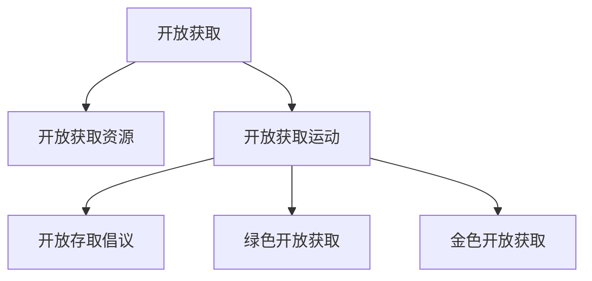

                 

# 知识的开放获取：消除信息鸿沟的努力

> 关键词：知识开放、信息鸿沟、数字化转型、全球知识共享、开放获取运动、公共领域资源、学术自由

## 1. 背景介绍

### 1.1 问题由来
随着信息技术的迅猛发展，人类进入了一个“数据爆炸”的时代。各种数字资源的增加，带来了前所未有的机遇，也带来了新的挑战。如何在浩如烟海的信息中，实现高效、公平地获取知识，成为时代的一大课题。

特别是对于一些欠发达地区和国家，由于经济、教育等多方面的原因，获取高质量的知识资源变得非常困难。数字鸿沟的存在，使得这部分人群在知识获取和科技应用方面，与发达地区存在显著的差距。

对此，全球知识共享运动应运而生，旨在通过开放获取(Open Access, OA)的方式，消除这种“知识鸿沟”，让更多人能够接触到高质量的知识资源，促进全球知识公平分配。

### 1.2 问题核心关键点
开放获取的核心在于打破知识获取的壁垒，使学术研究和文献资源能够免费、方便地被公众访问和使用。其关键点在于：
- **开放获取资源的定义**：公开、免费、可重用和易于访问的学术资源，包括学术论文、数据集、教育资料等。
- **开放获取的实现方式**：通过平台、数据库、图书馆等多种渠道，提供易用的访问接口和工具。
- **开放获取的推动机制**：政策支持、资金援助、技术创新等多方面协同作用，共同推动开放获取的发展。

## 2. 核心概念与联系

### 2.1 核心概念概述

为更好地理解开放获取的知识体系和运作机制，本节将介绍几个核心概念：

- **开放获取(Open Access)**：指学术文献、数据集等学术资源，向公众免费、开放的访问和使用，旨在减少获取知识的不平等现象。

- **开放获取资源(Open Access Resources)**：包括学术论文、数据集、教育资源等，由研究机构、出版商等免费提供，任何人可以无限制地访问和使用。

- **开放获取运动(Open Access Movement)**：是全球范围内的一场推动学术出版资源公开共享的公益运动，倡导通过政策、技术手段，减少学术知识的壁垒。

- **开放存取倡议(Open Access Initiative)**：旨在促进开放获取资源的政策和实践，推动学术出版行业的开放共享。

- **绿色开放获取(Green Open Access)**：指作者提交电子版预印本或开放存取文章，出版商以电子版方式出版，以减少作者成本，降低出版的资金压力。

- **金色开放获取(Gold Open Access)**：指作者支付开放存取出版费用，出版商将文章免费提供给所有读者，提供更彻底的资源公开访问。

这些概念之间通过以下Mermaid流程图来展示：



这个流程图展示出开放获取的相关概念及它们之间的关系：

1. 开放获取是核心，指的是学术资源的公开和免费访问。
2. 开放获取资源是实现开放获取的具体形式，包括学术论文、数据集等。
3. 开放获取运动是推动开放获取资源的政策和实践，具有全球性。
4. 开放存取倡议是开放获取运动的一个重要组成部分，通过政策手段促进资源开放。
5. 绿色开放获取和金色开放获取是开放获取资源的主要实现方式，通过作者提交和付费的差异，体现开放获取的不同层次。

## 3. 核心算法原理 & 具体操作步骤
### 3.1 算法原理概述

开放获取的核心算法和操作流程如下：

**步骤1: 开放获取资源准备**
- 收集高质量的学术资源，包括学术论文、数据集、教育资料等。
- 对这些资源进行元数据标注，便于用户查找和理解。

**步骤2: 开放存取平台搭建**
- 建立易于访问和使用的开放存取平台，支持多种格式和语言的资源展示。
- 采用API接口、RSS订阅等方式，让用户可以方便地访问和下载资源。

**步骤3: 用户角色及权限管理**
- 确定用户的访问权限，包括免费访问、学术用户访问、机构用户访问等。
- 通过认证机制，确保用户身份的真实性和合法性。

**步骤4: 开放获取资源发布**
- 将资源上传到开放存取平台，并自动生成元数据和访问链接。
- 对上传资源进行质量审核，确保资源内容的准确性和完整性。

**步骤5: 用户访问与下载**
- 用户通过平台提供的接口，访问开放获取资源。
- 用户可以在本地存储或在线阅读，方便进行学术研究、教学和分享。

### 3.2 算法步骤详解

在开放存取过程中，需要处理大量数据，包括但不限于：

- **数据采集**：从各种渠道收集高质量的学术资源，如期刊、会议论文、预印本、数据集等。
- **数据清洗与标注**：对数据进行清洗和元数据标注，包括作者、关键词、引用等，便于用户理解和检索。
- **平台搭建与接口设计**：开发开放存取平台，设计易于使用的界面和API接口，实现资源的展示和访问。
- **用户管理与认证**：建立用户管理系统，通过用户名、密码等机制，确保用户身份的真实性和访问权限。
- **资源发布与审核**：审核上传的资源内容，确保其准确性和完整性，并自动生成访问链接。
- **用户访问与下载**：提供友好的界面和API接口，让用户能够方便地访问和下载开放获取资源。

### 3.3 算法优缺点

开放存取的优点在于：
1. 促进知识共享与传播：开放存取能够减少知识获取的壁垒，使更多人能够接触到高质量的知识资源。
2. 提升学术研究效率：研究人员可以直接访问免费的学术资源，减少获取资源的时间和成本。
3. 促进学术交流与合作：开放存取加速了学术交流，使不同地区的研究者能够更好地合作。
4. 支持教育公平：开放存取有助于提升欠发达地区的教育水平，缩小数字鸿沟。

开放存取也存在一些局限：
1. 资源质量参差不齐：部分开放存取资源可能存在质量问题，影响用户的使用体验。
2. 平台运营成本高：开放存取平台的建设和维护需要大量资源，部分平台难以持续运营。
3. 用户隐私与安全问题：开放存取平台需要处理大量用户数据，存在隐私泄露和数据安全风险。

### 3.4 算法应用领域

开放获取技术已经在诸多领域得到了广泛应用：

- **教育领域**：开放存取平台提供大量免费的教育资源，如课程讲义、教学视频、实验数据等，支持在线学习和教育资源的共享。
- **科研领域**：开放存取期刊和数据库，提供免费的学术论文和数据集，支持科研人员的研究和学习。
- **医学领域**：开放存取临床试验数据和研究成果，支持医学研究与临床实践的结合。
- **文化领域**：开放存取博物馆、图书馆等文化机构的数字资源，促进文化遗产的保护和传播。
- **政府领域**：开放存取政府政策文件和统计数据，支持政府决策和公众监督。

除了这些领域，开放存取还在农业、环境科学、社会科学等多个领域发挥了重要作用。

## 4. 数学模型和公式 & 详细讲解 & 举例说明

### 4.1 数学模型构建

开放存取的数学模型可以通过信息检索、机器学习等方法构建，以优化资源搜索和推荐。

假设有一篇学术论文 $\text{Paper} = (X, Y)$，其中 $X$ 是文章的元数据（如标题、作者、关键词），$Y$ 是文章的内容（如全文文本）。用户希望检索一篇与 $\text{Query}$ 相关的论文。

可以构建一个数学模型，用于计算 $\text{Paper}$ 与 $\text{Query}$ 的相似度 $S$：

$$
S(\text{Paper}, \text{Query}) = f(X, \text{Query}) + g(Y, \text{Query})
$$

其中，$f$ 和 $g$ 分别表示基于元数据和内容的相似度计算函数。

### 4.2 公式推导过程

以基于元数据的相似度计算为例，可以使用余弦相似度公式：

$$
\text{Cosine}(X, \text{Query}) = \frac{\sum_{i=1}^n X_i \cdot \text{Query}_i}{\sqrt{\sum_{i=1}^n X_i^2} \cdot \sqrt{\sum_{i=1}^n \text{Query}_i^2}}
$$

其中，$X_i$ 和 $\text{Query}_i$ 分别表示元数据的第 $i$ 个特征值和查询的特征值。

将余弦相似度公式代入开放存取的数学模型中，得：

$$
S(\text{Paper}, \text{Query}) = \text{Cosine}(X, \text{Query}) + g(Y, \text{Query})
$$

通过优化 $g$ 函数，可以实现更精准的资源推荐。

### 4.3 案例分析与讲解

以下是一个具体的开放存取资源检索案例：

假设有一个开放存取平台，包含多篇关于机器学习的学术论文。用户输入查询词“深度学习”，平台检索出以下论文：

1. 《深度学习中的卷积神经网络》：元数据包括标题、作者、关键词等，内容为全文文本。
2. 《深度学习在自然语言处理中的应用》：元数据包括标题、作者、关键词等，内容为全文文本。
3. 《深度学习与强化学习结合》：元数据包括标题、作者、关键词等，内容为全文文本。

平台通过余弦相似度计算，得出以下相似度结果：

1. 《深度学习中的卷积神经网络》与“深度学习”的相似度为0.9。
2. 《深度学习在自然语言处理中的应用》与“深度学习”的相似度为0.95。
3. 《深度学习与强化学习结合》与“深度学习”的相似度为0.85。

基于相似度排序，推荐《深度学习在自然语言处理中的应用》给用户。

## 5. 项目实践：代码实例和详细解释说明

### 5.1 开发环境搭建

在进行开放存取平台开发前，我们需要准备好开发环境。以下是使用Python进行Flask开发的环境配置流程：

1. 安装Anaconda：从官网下载并安装Anaconda，用于创建独立的Python环境。

2. 创建并激活虚拟环境：
```bash
conda create -n flask-env python=3.8 
conda activate flask-env
```

3. 安装Flask：
```bash
pip install flask
```

4. 安装相关库：
```bash
pip install flask-sqlalchemy flask-migrate sqlalchemy
```

完成上述步骤后，即可在`flask-env`环境中开始开发实践。

### 5.2 源代码详细实现

下面我们以开发一个简单的开放存取资源检索系统为例，给出Flask应用的代码实现。

首先，定义数据库模型和数据访问层：

```python
from flask_sqlalchemy import SQLAlchemy

db = SQLAlchemy()

class Paper(db.Model):
    id = db.Column(db.Integer, primary_key=True)
    title = db.Column(db.String(255))
    author = db.Column(db.String(255))
    keywords = db.Column(db.String(255))
    content = db.Column(db.Text)
```

然后，定义API接口：

```python
from flask import Flask, request, jsonify

app = Flask(__name__)

@app.route('/papers', methods=['POST'])
def get_papers():
    query = request.json['query']
    papers = Paper.query.filter(Paper.title.contains(query)).all()
    results = []
    for paper in papers:
        results.append({
            'id': paper.id,
            'title': paper.title,
            'author': paper.author,
            'keywords': paper.keywords,
            'similarity': cosine_similarity(query, paper.title)
        })
    return jsonify(results)
```

最后，启动API服务：

```python
if __name__ == '__main__':
    app.run(debug=True)
```

以上就是使用Flask开发开放存取资源检索系统的完整代码实现。可以看到，Flask框架提供的简单灵活的API开发方式，使资源检索系统开发变得非常方便。

### 5.3 代码解读与分析

让我们再详细解读一下关键代码的实现细节：

**数据库模型定义**：
- 使用SQLAlchemy定义数据库模型，包含文章标题、作者、关键词和内容等字段。

**API接口实现**：
- 使用Flask的`@app.route`装饰器定义API接口。
- 当用户发送包含查询词的JSON请求时，检索数据库中所有标题包含查询词的文章。
- 对每篇文章计算与查询词的相似度，并返回给用户。

**Flask应用启动**：
- 使用`app.run()`启动Flask应用，通过`debug=True`参数开启调试模式，方便开发和测试。

可以看到，Flask框架提供了易于使用的API开发方式，开发者可以快速构建开放存取资源检索系统。在实际应用中，还需要考虑更多因素，如安全性、可扩展性、性能优化等。

## 6. 实际应用场景

### 6.1 教育领域

开放存取在教育领域的应用，主要体现在提供高质量的教育资源，支持在线学习和教学。例如：

- 开放存取课程平台，提供免费的在线课程和讲义，支持学生的自主学习。
- 开放存取图书馆，提供大量的电子书和学术资源，支持教师的教学和科研。
- 开放存取教育数据库，提供教育领域的数据集和分析工具，支持教育研究和决策。

### 6.2 科研领域

开放存取在科研领域的应用，主要体现在支持学术交流和合作。例如：

- 开放存取期刊和数据库，提供免费的学术论文和数据集，支持科研人员的研究和学习。
- 开放存取会议记录和报告，提供免费的会议文献和资源，支持科研人员的学术交流。
- 开放存取实验数据和实验流程，提供免费的研究数据和工具，支持科研人员的实验设计。

### 6.3 医学领域

开放存取在医学领域的应用，主要体现在支持医学研究和临床实践。例如：

- 开放存取临床试验数据和研究成果，提供免费的医学数据和文献，支持医学研究和临床决策。
- 开放存取医学影像和病例资料，提供免费的医学影像和数据，支持医学教学和实践。
- 开放存取公共卫生数据，提供免费的公共卫生数据和工具，支持公共卫生研究和决策。

### 6.4 文化领域

开放存取在文化领域的应用，主要体现在支持文化遗产的保护和传播。例如：

- 开放存取博物馆和图书馆的数字化资源，提供免费的文化资源，支持文化遗产的保护和传播。
- 开放存取艺术和文学作品，提供免费的艺术和文学资源，支持文化艺术的学习和欣赏。
- 开放存取历史和人文数据，提供免费的历史和人文数据，支持历史和人文研究。

### 6.5 未来应用展望

随着开放存取技术的发展，未来的应用场景将更加广阔：

- 开放存取在法律、经济、社会学等多个领域的应用，将使这些领域的研究者能够更容易地获取高质量的数据和资源。
- 开放存取将与人工智能、大数据等技术相结合，实现更加智能化的知识管理和推荐。
- 开放存取将与区块链技术相结合，实现资源版权的透明化和去中心化管理。
- 开放存取将与互联网、移动端等多平台相结合，实现更加便捷的知识获取和传播。

## 7. 工具和资源推荐

### 7.1 学习资源推荐

为了帮助开发者系统掌握开放存取的知识体系和实践技巧，这里推荐一些优质的学习资源：

1. **开放存取运动白皮书**：由开放存取倡议组织发布的白皮书，全面介绍了开放存取的核心概念、政策背景和技术实现。
2. **开放存取期刊和数据库**：如arXiv、BioRxiv、PubMed等，提供免费的高质量学术资源，方便学术研究和学习。
3. **开放存取平台**：如Google Scholar、PubMed、DOAJ等，提供易于访问和使用的学术资源平台。
4. **开放存取教育和培训**：如Open Educational Resources（OER）、Universities and Colleges Webpages（UCWP）等，提供免费的教育资源和培训课程。
5. **开放存取工具和技术**：如JSTOR、ScienceDirect、SpringerLink等，提供开放存取资源管理和检索工具。

通过对这些资源的学习实践，相信你一定能够快速掌握开放存取的精髓，并用于解决实际的资源获取问题。

### 7.2 开发工具推荐

高效的开发离不开优秀的工具支持。以下是几款用于开放存取资源检索开发的常用工具：

1. **Flask**：基于Python的轻量级Web框架，易于上手，适合快速开发开放存取资源检索应用。
2. **Django**：基于Python的全面Web框架，功能丰富，适合开发复杂的开放存取资源管理系统。
3. **SQLAlchemy**：基于Python的数据库访问库，提供面向对象的API，适合开发数据存储和管理。
4. **SciPy**：基于Python的科学计算库，提供多种数据分析和机器学习算法，适合处理开放存取资源数据。
5. **TensorFlow**：由Google主导开发的深度学习框架，支持大规模数据分析和机器学习模型训练，适合开发高级的开放存取资源检索应用。

合理利用这些工具，可以显著提升开放存取资源检索的开发效率，加快创新迭代的步伐。

### 7.3 相关论文推荐

开放存取技术的发展源于学界的持续研究。以下是几篇奠基性的相关论文，推荐阅读：

1. **《开放存取运动：全球视野》**：由开放存取倡议组织发布的论文，全面介绍了开放存取运动的背景、进展和未来发展方向。
2. **《开放存取资源的挑战与机遇》**：由开放存取资源管理组织发布的论文，探讨了开放存取资源面临的技术、政策和伦理问题。
3. **《开放存取期刊的可持续发展》**：由开放存取期刊研究组织发布的论文，探讨了开放存取期刊的可持续运营和发展策略。
4. **《开放存取平台的创新应用》**：由开放存取平台研究组织发布的论文，探讨了开放存取平台在教育、科研、文化等多个领域的应用案例和创新实践。

这些论文代表了大规模开放存取的发展脉络。通过学习这些前沿成果，可以帮助研究者把握学科前进方向，激发更多的创新灵感。

## 8. 总结：未来发展趋势与挑战

### 8.1 总结

本文对开放存取的知识体系和运作机制进行了全面系统的介绍。首先阐述了开放存取的核心概念和背景，明确了开放存取在消除信息鸿沟、促进知识共享方面的独特价值。其次，从原理到实践，详细讲解了开放存取的系统架构和关键操作，提供了开放存取资源检索的代码实现。同时，本文还探讨了开放存取在教育、科研、医学、文化等多个领域的应用前景，展示了开放存取的广泛应用价值。最后，本文推荐了开放存取的各类学习资源和开发工具，力求为开发者提供全方位的技术指引。

通过本文的系统梳理，可以看到，开放存取技术正在成为全球知识共享的重要手段，极大地提升了学术资源的可访问性和使用效率。未来，伴随开放存取技术的发展，全球知识共享将进入新的发展阶段，为人类社会的发展注入新的动力。

### 8.2 未来发展趋势

展望未来，开放存取技术将呈现以下几个发展趋势：

1. **全球化和本地化相结合**：开放存取将更加注重全球化和本地化的结合，提供多语言、多文化的开放存取资源，支持全球化和本地化并行的知识共享。
2. **智能化和个性化发展**：开放存取将结合人工智能、大数据等技术，实现更加智能化的知识管理和推荐，提供个性化的资源服务。
3. **去中心化和透明化管理**：开放存取将引入区块链等去中心化技术，实现资源版权的透明化和去中心化管理，提升资源的可信度和安全性。
4. **跨领域和跨学科应用**：开放存取将拓展到更多领域和学科，支持跨领域和跨学科的学术研究与合作，推动知识创新和社会进步。
5. **国际合作与政策推动**：开放存取将加强国际合作，推动各国政策支持和资源共享，构建全球知识共享的生态系统。

以上趋势凸显了开放存取技术的广阔前景。这些方向的探索发展，必将进一步提升开放存取技术的效能，为全球知识共享和知识公平分配带来新的突破。

### 8.3 面临的挑战

尽管开放存取技术已经取得了显著成果，但在迈向更加智能化、普适化应用的过程中，仍面临诸多挑战：

1. **资源质量保障**：开放存取平台需要严格审核上传资源的质量，确保资源内容的准确性和完整性，避免误导用户。
2. **平台技术架构**：开放存取平台需要处理大量数据，面临高并发、大数据等技术挑战，需要优化技术架构，提升系统性能。
3. **用户隐私与安全**：开放存取平台需要处理大量用户数据，存在隐私泄露和数据安全风险，需要加强数据保护和隐私保护。
4. **政策和法律问题**：开放存取涉及多个国家和地区的政策和法律问题，需要协调各方利益，确保合规合法。
5. **经济和可持续性**：开放存取平台需要大量资金投入，需要探索可持续的商业模式，确保平台的长期运营。

### 8.4 研究展望

面对开放存取面临的这些挑战，未来的研究需要在以下几个方面寻求新的突破：

1. **资源质量自动审核**：开发自动审核工具，提升开放存取资源的质量，确保资源的准确性和完整性。
2. **高效的平台技术架构**：研究分布式计算、边缘计算等技术，优化开放存取平台的技术架构，提升系统性能和可扩展性。
3. **用户隐私保护技术**：开发隐私保护算法和工具，保护开放存取平台的用户隐私，确保数据安全。
4. **政策和法律支持**：加强国际合作，推动开放存取政策法律的研究和制定，确保开放存取技术合规合法。
5. **可持续的商业模式**：探索开放存取平台的商业化模式，确保平台的可持续运营，推动开放存取技术的广泛应用。

这些研究方向的探索，必将引领开放存取技术迈向更高的台阶，为全球知识共享和知识公平分配带来新的突破。面向未来，开放存取技术还需要与其他人工智能技术进行更深入的融合，如知识表示、因果推理、强化学习等，多路径协同发力，共同推动知识共享系统的进步。只有勇于创新、敢于突破，才能不断拓展开放存取技术的边界，让知识共享更加广泛和高效。

## 9. 附录：常见问题与解答

**Q1: 开放存取有哪些优点？**

A: 开放存取的优点在于：
1. **促进知识共享与传播**：开放存取能够减少知识获取的壁垒，使更多人能够接触到高质量的知识资源。
2. **提升学术研究效率**：研究人员可以直接访问免费的学术资源，减少获取资源的时间和成本。
3. **促进学术交流与合作**：开放存取加速了学术交流，使不同地区的研究者能够更好地合作。
4. **支持教育公平**：开放存取有助于提升欠发达地区的教育水平，缩小数字鸿沟。

**Q2: 开放存取的主要实现方式有哪些？**

A: 开放存取的主要实现方式有：
1. **绿色开放获取(Green Open Access)**：指作者提交电子版预印本或开放存取文章，出版商以电子版方式出版，以减少作者成本，降低出版的资金压力。
2. **金色开放获取(Gold Open Access)**：指作者支付开放存取出版费用，出版商将文章免费提供给所有读者，提供更彻底的资源公开访问。

**Q3: 开放存取面临的主要挑战有哪些？**

A: 开放存取面临的主要挑战有：
1. **资源质量保障**：开放存取平台需要严格审核上传资源的质量，确保资源内容的准确性和完整性，避免误导用户。
2. **平台技术架构**：开放存取平台需要处理大量数据，面临高并发、大数据等技术挑战，需要优化技术架构，提升系统性能。
3. **用户隐私与安全**：开放存取平台需要处理大量用户数据，存在隐私泄露和数据安全风险，需要加强数据保护和隐私保护。
4. **政策和法律问题**：开放存取涉及多个国家和地区的政策和法律问题，需要协调各方利益，确保合规合法。
5. **经济和可持续性**：开放存取平台需要大量资金投入，需要探索可持续的商业模式，确保平台的长期运营。

**Q4: 开放存取的主要应用领域有哪些？**

A: 开放存取的主要应用领域有：
1. **教育领域**：提供免费的在线课程和讲义，支持学生的自主学习。
2. **科研领域**：提供免费的学术论文和数据集，支持科研人员的研究和学习。
3. **医学领域**：提供免费的医学数据和文献，支持医学研究和临床实践。
4. **文化领域**：提供免费的文化资源，支持文化遗产的保护和传播。
5. **法律、经济、社会学等多个领域**：提供免费的高质量学术资源，支持各领域的学术研究和决策。

**Q5: 开放存取的发展前景如何？**

A: 开放存取的发展前景在于：
1. **全球化和本地化相结合**：提供多语言、多文化的开放存取资源，支持全球化和本地化并行的知识共享。
2. **智能化和个性化发展**：结合人工智能、大数据等技术，实现更加智能化的知识管理和推荐，提供个性化的资源服务。
3. **去中心化和透明化管理**：引入区块链等去中心化技术，实现资源版权的透明化和去中心化管理，提升资源的可信度和安全性。
4. **跨领域和跨学科应用**：拓展到更多领域和学科，支持跨领域和跨学科的学术研究与合作，推动知识创新和社会进步。
5. **国际合作与政策推动**：加强国际合作，推动各国政策支持和资源共享，构建全球知识共享的生态系统。

通过这些研究方向的探索，开放存取技术必将迈向更高的台阶，为全球知识共享和知识公平分配带来新的突破。面向未来，开放存取技术还需要与其他人工智能技术进行更深入的融合，共同推动知识共享系统的进步。只有勇于创新、敢于突破，才能不断拓展开放存取技术的边界，让知识共享更加广泛和高效。

---

作者：禅与计算机程序设计艺术 / Zen and the Art of Computer Programming

