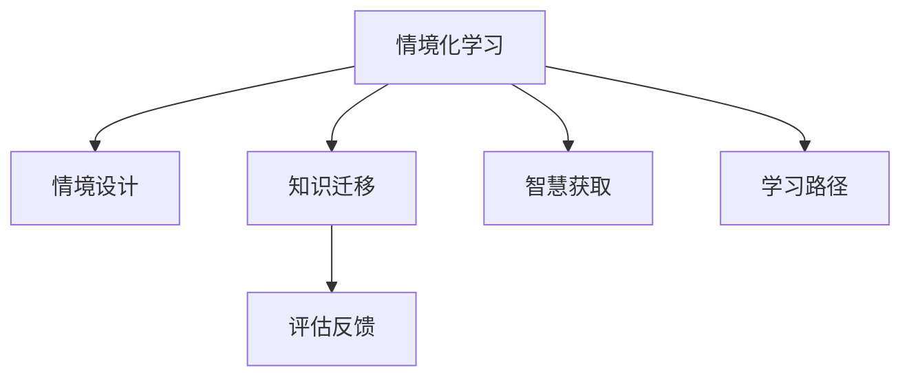

                 

## 1. 背景介绍

### 1.1 问题由来

在现代社会，知识的获取和应用方式正经历深刻的变革。传统教育体系注重知识点的传授和记忆，而现代智能技术正逐渐突破这一局限，使知识的获取和应用变得更加情境化、智能化。情境化学习（Situated Learning）旨在将学习置于具体情境中，使学习者在真实问题解决过程中构建知识体系，提升智慧水平。

情境化学习的应用领域日益广泛，从教育、培训、到企业知识管理、智慧城市建设等，其带来的变革效应和应用前景引起了广泛关注。本文旨在深入探讨情境化学习的原理、方法及其在实践中的应用，为相关领域的进一步研究和应用提供理论基础和实践指导。

### 1.2 问题核心关键点

情境化学习的核心在于将知识学习与具体情境相结合，使学习者能够更深刻地理解知识，并能够在真实环境中灵活应用。这一过程涉及多个关键点：

1. **情境设计**：如何设计有效、逼真的情境，使学习者能够在其中沉浸，并深度思考。
2. **学习路径**：如何制定合理的学习路径，引导学习者逐步掌握知识，并实现深度迁移。
3. **评估机制**：如何设计评估机制，衡量学习者情境化学习的成效，提供持续改进的反馈。

这些关键点相互影响、相互作用，共同构成了情境化学习的全貌。

## 2. 核心概念与联系

### 2.1 核心概念概述

为更好地理解情境化学习的原理和架构，本节将介绍几个核心概念及其相互联系：

- **情境化学习**：将知识学习置于具体情境中，使学习者在实际问题解决过程中构建知识体系，提升智慧水平。
- **情境设计**：设计逼真的情境，使学习者能够在其中沉浸，并深度思考。
- **知识迁移**：在学习新知识的过程中，如何实现知识的深度迁移，使其在真实环境中能够灵活应用。
- **智慧获取**：在情境化学习过程中，如何构建学习者的智慧体系，提升其分析、解决问题和创造的能力。
- **评估反馈**：设计科学的评估机制，衡量学习者的学习成效，并提供持续改进的反馈。

这些概念通过以下Mermaid流程图展示其相互联系：



该流程图展示了情境化学习过程中的关键环节及其相互关系：情境设计是基础，知识迁移是核心，智慧获取是目标，评估反馈是保障。学习路径则是连接这些环节的桥梁，贯穿始终。

## 3. 核心算法原理 & 具体操作步骤

### 3.1 算法原理概述

情境化学习的核心算法原理，可以概括为以下几个方面：

1. **情境设计**：通过虚拟现实(VR)、增强现实(AR)、混合现实(MR)等技术，构建逼真的学习情境。
2. **知识迁移**：通过项目导向、问题导向、案例导向等多种教学方法，促进学习者知识的深度迁移。
3. **智慧获取**：通过反思、总结、交流等活动，构建学习者的智慧体系。
4. **评估反馈**：通过实时评估、同伴评价、自我评估等机制，提供持续改进的反馈。

### 3.2 算法步骤详解

情境化学习的具体操作步骤，可以概括为以下几个关键步骤：

**Step 1: 情境设计**

- 确定学习目标和情境主题，设计逼真的学习情境。
- 选择合适的技术手段，如VR、AR、MR等，构建沉浸式学习环境。
- 设计学习情境的交互元素，如角色扮演、任务导向等，增强学习的互动性。

**Step 2: 知识迁移**

- 确定学习者的初始知识水平，制定合理的学习路径。
- 设计项目导向、问题导向、案例导向等多种教学活动，引导学习者深入探索。
- 鼓励学习者进行反思、总结、交流，促进知识的内化和迁移。

**Step 3: 智慧获取**

- 设计反思性、探究性的学习活动，如思维导图、思维导图、头脑风暴等。
- 鼓励学习者进行创新和创作，如项目设计、论文撰写等。
- 通过导师指导、同伴评价、自我评价等机制，促进学习者的深度思考和智慧构建。

**Step 4: 评估反馈**

- 设计科学的评估机制，如自适应评估、同伴评估、导师评估等，及时反馈学习成效。
- 根据评估结果，调整学习路径，提供个性化改进建议。
- 持续收集学习者的反馈意见，优化情境化学习的设计和实施。

### 3.3 算法优缺点

情境化学习在实践中的优点包括：

1. **提升学习效果**：通过情境设计，使学习者能够在真实环境中应用知识，提升学习效果。
2. **促进知识迁移**：通过多种教学方法，促进学习者知识的深度迁移和应用。
3. **构建智慧体系**：通过反思、总结、交流等活动，构建学习者的智慧体系。
4. **提高学习动机**：通过情境设计和互动元素，提高学习者的学习动机和兴趣。

然而，情境化学习也存在一些局限：

1. **技术依赖性**：构建逼真的学习情境需要高成本的技术手段，可能难以广泛应用。
2. **资源消耗大**：情境化学习通常需要较多的时间和资源，难以大规模推广。
3. **设计复杂性**：设计逼真的学习情境和有效的学习路径，需要高水平的设计能力和经验。
4. **评估难度大**：评估学习者的学习成效和智慧水平，需要科学合理的评估机制。

## 4. 数学模型和公式 & 详细讲解 & 举例说明

### 4.1 数学模型构建

情境化学习的数学模型，可以概括为以下几个方面：

1. **情境设计模型**：描述如何通过虚拟现实、增强现实等技术，构建逼真的学习情境。
2. **知识迁移模型**：描述如何通过项目导向、问题导向等多种教学方法，促进学习者知识的深度迁移。
3. **智慧获取模型**：描述如何通过反思、总结、交流等活动，构建学习者的智慧体系。
4. **评估反馈模型**：描述如何设计科学的评估机制，及时反馈学习成效。

### 4.2 公式推导过程

以下以情境设计模型为例，推导其核心公式。

**情境设计模型**：

- **情境构建**：通过虚拟现实、增强现实等技术，构建逼真的学习情境。
- **情境互动**：设计学习情境的交互元素，如角色扮演、任务导向等，增强学习的互动性。

**公式推导**：

$$
S = f(V, A, I)
$$

其中，$S$ 表示情境，$V$ 表示虚拟现实技术，$A$ 表示增强现实技术，$I$ 表示学习情境的交互元素。

### 4.3 案例分析与讲解

以项目导向的情境化学习为例，分析其实际应用效果。

**案例背景**：

某大学计算机系学生，需要学习人工智能的基础知识和应用技能。学校设计了一个“智能家居项目”的情境化学习课程，通过虚拟现实技术，构建了一个逼真的智能家居场景。

**实施步骤**：

1. **情境设计**：通过虚拟现实技术，构建一个智能家居场景，包括智能音箱、智能灯光、智能温控器等设备。
2. **知识迁移**：引导学生通过项目导向的方式，学习人工智能的基础知识和应用技能。例如，通过编写智能音箱的语音识别程序，学习自然语言处理和语音识别技术。
3. **智慧获取**：鼓励学生在项目过程中进行反思、总结、交流，构建智慧体系。例如，通过讨论智能家居的设计理念和技术方案，提升学生的创新能力。
4. **评估反馈**：设计科学的评估机制，如项目展示、同伴评价、导师评价等，及时反馈学习成效。

## 5. 项目实践：代码实例和详细解释说明

### 5.1 开发环境搭建

在进行情境化学习项目开发前，我们需要准备好开发环境。以下是使用Python进行PyTorch开发的环境配置流程：

1. 安装Anaconda：从官网下载并安装Anaconda，用于创建独立的Python环境。

2. 创建并激活虚拟环境：
```bash
conda create -n pytorch-env python=3.8 
conda activate pytorch-env
```

3. 安装PyTorch：根据CUDA版本，从官网获取对应的安装命令。例如：
```bash
conda install pytorch torchvision torchaudio cudatoolkit=11.1 -c pytorch -c conda-forge
```

4. 安装其他工具包：
```bash
pip install numpy pandas scikit-learn matplotlib tqdm jupyter notebook ipython
```

完成上述步骤后，即可在`pytorch-env`环境中开始情境化学习项目开发。

### 5.2 源代码详细实现

这里我们以情境化学习中的虚拟现实场景为例，给出使用PyTorch进行情境设计的基本代码实现。

首先，定义虚拟现实场景的类：

```python
import torch
import torchvision.transforms as transforms
import numpy as np

class VirtualRealityScene:
    def __init__(self, camera, scene):
        self.camera = camera
        self.scene = scene
        
    def render(self, image):
        # 渲染虚拟现实场景
        # 计算视角和渲染效果
        # 返回渲染后的图像
        pass
        
    def interact(self, action):
        # 根据用户操作，交互场景
        # 返回交互结果
        pass
```

然后，定义虚拟现实场景的交互行为：

```python
class VRAction:
    def __init__(self, scene, action):
        self.scene = scene
        self.action = action
        
    def execute(self):
        # 执行用户操作
        # 更新场景状态
        pass
```

最后，实现虚拟现实场景的渲染和交互：

```python
def render_vr_scene():
    # 创建虚拟现实场景
    scene = VirtualRealityScene(camera, scene)
    
    # 渲染场景
    image = scene.render(image)
    
    # 交互行为
    action = VRAction(scene, action)
    result = action.execute()
    
    return image, result
```

以上就是一个简单的虚拟现实场景的代码实现。可以看到，通过定义虚拟现实场景的类和交互行为，可以实现逼真的情境设计。

### 5.3 代码解读与分析

让我们再详细解读一下关键代码的实现细节：

**VirtualRealityScene类**：
- `__init__`方法：初始化虚拟现实场景的摄像头和场景。
- `render`方法：渲染虚拟现实场景，并返回渲染后的图像。
- `interact`方法：根据用户操作，交互场景，并返回交互结果。

**VRAction类**：
- `__init__`方法：初始化虚拟现实场景和用户操作。
- `execute`方法：执行用户操作，并更新场景状态。

**render_vr_scene函数**：
- 创建虚拟现实场景，并渲染场景。
- 根据用户操作，执行交互行为，并返回结果。

可以看出，虚拟现实场景的开发需要多方面的技术支持，如图像处理、传感器技术、人机交互等。通过系统化的设计和实现，可以构建逼真的虚拟现实学习环境，促进学习者情境化学习。

当然，工业级的系统实现还需考虑更多因素，如用户界面设计、硬件设备适配、多用户支持等。但核心的情境化学习设计基本与此类似。

## 6. 实际应用场景

### 6.1 企业培训

在企业培训中，情境化学习可以显著提升员工的实际应用能力。传统的培训课程往往难以将理论知识与实际工作场景相结合，导致员工在学习后难以将所学知识应用到实际工作中。

通过情境化学习，企业可以在真实的工作场景中，模拟各种实际问题，使员工在情境中学习知识，提升其实际应用能力。例如，通过模拟企业内部流程和业务场景，员工可以更加深刻地理解业务流程和工具使用方法，从而在实际工作中更加高效。

### 6.2 教育培训

在教育培训中，情境化学习可以更好地激发学生的学习兴趣和动机。传统的课堂教学往往难以激发学生的学习兴趣，导致学生对学习内容缺乏深刻理解。

通过情境化学习，教师可以在课堂中模拟真实情境，使学生在情境中学习知识。例如，通过模拟医院手术场景，学生可以更好地理解医学知识和操作技能，从而在实际手术中更加自信和高效。

### 6.3 医疗健康

在医疗健康领域，情境化学习可以显著提升医生的临床决策能力。传统的医疗培训往往难以将理论知识与实际病例相结合，导致医生在临床决策中缺乏实际经验。

通过情境化学习，医疗机构可以在模拟病历和真实病例中，训练医生的临床决策能力。例如，通过模拟疑难病例，医生可以更好地理解疾病诊断和治疗方法，从而在实际医疗中更加准确和高效。

### 6.4 未来应用展望

随着情境化学习技术的不断发展，其在更多领域的应用前景将日益广阔。

在智慧城市建设中，情境化学习可以为城市管理提供决策支持。通过模拟城市场景，可以更好地理解城市运行规律和问题，从而制定更加科学的城市管理策略。

在农业生产中，情境化学习可以优化农业生产流程。通过模拟农业生产场景，可以更好地理解农业生产中的各种问题，从而制定更加科学的生产方案。

在智能制造中，情境化学习可以优化生产流程。通过模拟生产场景，可以更好地理解生产流程中的各种问题，从而制定更加科学的生产方案。

## 7. 工具和资源推荐

### 7.1 学习资源推荐

为了帮助开发者系统掌握情境化学习的理论基础和实践技巧，这里推荐一些优质的学习资源：

1. 《情境化学习原理与实践》系列博文：由情境化学习专家撰写，深入浅出地介绍了情境化学习的原理、方法和应用。

2. Coursera《情境化学习》课程：由知名教育机构开设的情境化学习课程，有视频讲解和配套作业，带你系统掌握情境化学习的核心概念和实践技巧。

3. 《情境化学习设计与实施》书籍：情境化学习领域的经典著作，全面介绍了情境化学习的设计和实施方法，适合深层次研究。

4. 情境化学习社区：社区平台聚集了情境化学习的研究者和实践者，可以互相交流经验，获取最新的研究和实践动态。

5. 情境化学习开源项目：开源社区提供了众多情境化学习的项目和样例，可以快速上手实践。

通过对这些资源的学习实践，相信你一定能够快速掌握情境化学习的精髓，并用于解决实际的NLP问题。

### 7.2 开发工具推荐

高效的开发离不开优秀的工具支持。以下是几款用于情境化学习开发的常用工具：

1. PyTorch：基于Python的开源深度学习框架，灵活动态的计算图，适合快速迭代研究。大部分情境化学习模型都有PyTorch版本的实现。

2. TensorFlow：由Google主导开发的开源深度学习框架，生产部署方便，适合大规模工程应用。同样有丰富的情境化学习模型资源。

3. Unity：虚拟现实游戏引擎，支持多平台开发，适合构建逼真的虚拟现实学习环境。

4. Blender：3D建模和渲染软件，支持多种建模和渲染技术，适合构建高保真的虚拟现实场景。

5. VPython：Python编程语言中的可视化工具，支持3D场景的创建和交互，适合构建简单的虚拟现实场景。

6. Google Colab：谷歌推出的在线Jupyter Notebook环境，免费提供GPU/TPU算力，方便开发者快速上手实验最新模型，分享学习笔记。

合理利用这些工具，可以显著提升情境化学习任务的开发效率，加快创新迭代的步伐。

### 7.3 相关论文推荐

情境化学习的研究源于学界的持续探索。以下是几篇奠基性的相关论文，推荐阅读：

1. Situated Cognition and the Culture of Learning（情境认知和学习文化）：由心理学家和教育学家编写，深入探讨了情境认知和学习的基本概念和理论。

2. Situated Learning: A Definition and Framework for Research（情境化学习：定义和研究框架）：由学习科学家编写，提供了情境化学习的研究框架和实践指南。

3. Contextual Learning: A New Paradigm for Curriculum Development（情境学习：新型的课程开发范式）：由教育专家编写，探讨了情境学习在课程开发中的应用。

4. Beyond Multimedia: Learning in the Large by Distributed Persuasion and Negotiation（超越多媒体：通过分布式说服和谈判进行大规模学习）：由计算机科学家编写，探讨了情境化学习在分布式系统中的应用。

5. Situated Learning and Knowledge Construction（情境化学习与知识构建）：由教育学家编写，提供了情境化学习的理论和实践方法。

这些论文代表了大语言模型微调技术的发展脉络。通过学习这些前沿成果，可以帮助研究者把握学科前进方向，激发更多的创新灵感。

## 8. 总结：未来发展趋势与挑战

### 8.1 总结

本文对情境化学习的原理、方法及其在实践中的应用进行了全面系统的介绍。首先阐述了情境化学习的研究背景和意义，明确了情境化学习在提升学习效果、促进知识迁移、构建智慧体系等方面的独特价值。其次，从原理到实践，详细讲解了情境化学习的数学原理和关键步骤，给出了情境化学习任务开发的完整代码实例。同时，本文还广泛探讨了情境化学习在企业培训、教育培训、医疗健康等多个领域的应用前景，展示了情境化学习的巨大潜力。此外，本文精选了情境化学习的各类学习资源，力求为读者提供全方位的技术指引。

通过本文的系统梳理，可以看到，情境化学习正在成为教育、培训、企业知识管理等领域的重要范式，极大地拓展了知识获取和应用的方式，提升了学习者的智慧水平。未来，伴随情境化学习技术的不断演进，相信其将进一步推动教育、培训和产业应用的发展，为社会进步注入新的动力。

### 8.2 未来发展趋势

展望未来，情境化学习技术将呈现以下几个发展趋势：

1. **技术融合**：情境化学习将与人工智能、虚拟现实、增强现实等技术进行深度融合，提供更加沉浸、逼真的学习环境。

2. **数据驱动**：情境化学习将更加依赖数据驱动，通过大数据分析和智能推荐，优化学习路径和内容。

3. **自适应学习**：情境化学习将更加注重自适应学习，通过个性化推荐和自适应评估，提升学习效率和效果。

4. **智能决策**：情境化学习将更加注重智能决策，通过深度学习和智能算法，辅助学习者做出最优决策。

5. **知识图谱**：情境化学习将更加注重知识图谱的构建和应用，通过知识图谱的融合，促进学习者的深度思考和知识迁移。

以上趋势凸显了情境化学习技术的广阔前景。这些方向的探索发展，必将进一步提升情境化学习的应用范围和效果，为教育、培训和产业应用带来新的突破。

### 8.3 面临的挑战

尽管情境化学习技术已经取得了显著进展，但在迈向更加智能化、普适化应用的过程中，仍面临诸多挑战：

1. **技术复杂性**：构建逼真的学习情境和有效的学习路径，需要高水平的技术能力和资源支持，可能难以广泛推广。
2. **学习成本高**：情境化学习通常需要较多的时间和资源，难以大规模推广。
3. **评估难度大**：评估学习者的学习成效和智慧水平，需要科学合理的评估机制。
4. **应用场景复杂**：情境化学习在不同领域的应用场景复杂多样，需要针对不同领域进行定制化设计和实施。

正视情境化学习面临的这些挑战，积极应对并寻求突破，将是大语言模型微调走向成熟的必由之路。相信随着学界和产业界的共同努力，这些挑战终将一一被克服，情境化学习必将在构建人机协同的智能时代中扮演越来越重要的角色。

### 8.4 研究展望

面对情境化学习所面临的种种挑战，未来的研究需要在以下几个方面寻求新的突破：

1. **技术标准化**：制定情境化学习的技术标准和规范，推动技术普及和应用。

2. **数据资源开放**：建立情境化学习的数据资源库，开放共享学习数据和知识，促进技术创新。

3. **多模态融合**：探索情境化学习与多模态数据的融合，提升学习者的多感官体验和知识获取效果。

4. **智能推荐系统**：开发智能推荐系统，通过数据分析和智能推荐，优化学习路径和内容。

5. **学习分析**：研究学习者的行为和认知过程，提供个性化的学习建议和指导。

6. **伦理和安全**：研究情境化学习的伦理和安全问题，确保学习数据和模型的安全性和公平性。

这些研究方向的前沿性探索，必将引领情境化学习技术迈向更高的台阶，为教育、培训和产业应用提供更加科学、高效、安全的技术支持。总之，情境化学习需要从技术、数据、伦理等多个维度协同发力，才能真正实现其在教育、培训和产业应用中的广泛应用。

## 9. 附录：常见问题与解答

**Q1：如何设计逼真的学习情境？**

A: 设计逼真的学习情境，需要考虑以下几个方面：

1. **情境目标**：明确情境化学习的目标，确定需要学习的内容和技能。
2. **情境主题**：选择与学习目标相关的情境主题，构建逼真的情境环境。
3. **情境元素**：设计情境元素，如角色扮演、任务导向等，增强学习的互动性。

**Q2：如何评估学习者的学习成效？**

A: 评估学习者的学习成效，需要考虑以下几个方面：

1. **多维度评估**：采用多种评估方法，如自适应评估、同伴评估、导师评估等，全面评估学习者的学习成效。
2. **实时反馈**：及时反馈学习者的学习成效，提供个性化的改进建议。
3. **持续改进**：根据评估结果，调整学习路径和内容，持续改进学习效果。

**Q3：如何提升情境化学习的覆盖面？**

A: 提升情境化学习的覆盖面，需要考虑以下几个方面：

1. **技术支持**：利用虚拟现实、增强现实等技术，构建逼真的学习情境。
2. **资源开放**：开放共享学习数据和知识，提供丰富的学习资源。
3. **多模态融合**：探索情境化学习与多模态数据的融合，提升学习者的多感官体验和知识获取效果。

**Q4：情境化学习在不同领域的应用前景如何？**

A: 情境化学习在不同领域的应用前景非常广阔，包括：

1. **教育培训**：通过情境化学习，提升学生的学习兴趣和动机，提高学习效果。
2. **企业培训**：通过情境化学习，提升员工的应用能力，提高工作效率。
3. **医疗健康**：通过情境化学习，提升医生的临床决策能力，提高医疗水平。
4. **智慧城市**：通过情境化学习，优化城市管理，提高城市运行效率。
5. **智能制造**：通过情境化学习，优化生产流程，提高生产效率。

总之，情境化学习正在成为教育、培训、企业知识管理等领域的重要范式，其应用前景广阔，具有巨大的潜力和价值。

---

作者：禅与计算机程序设计艺术 / Zen and the Art of Computer Programming

