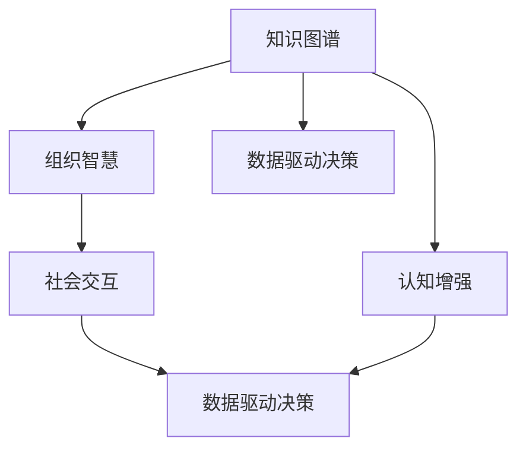
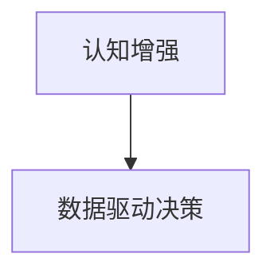

                 

# 知识的生态系统：个人、组织与社会的互动

> 关键词：知识图谱, 认知增强, 组织智慧, 社会交互, 数据驱动决策, 协同创新

## 1. 背景介绍

在数字化转型的浪潮中，知识和智慧成为连接个人、组织与社会的关键纽带。知识的生态系统不仅关乎信息管理，更涉及到认知增强、组织智慧、社会交互等诸多层面。本博客将深入探讨知识图谱、认知增强、组织智慧、社会交互以及数据驱动决策等核心概念，并结合实际案例分析，探讨其应用与挑战，为未来的知识生态系统建设提供有价值的洞见。

### 1.1 问题由来
在信息爆炸的时代，个人、组织与社会面临着前所未有的知识管理与利用的挑战。一方面，海量数据的涌现带来了巨大的信息富矿，为个人和组织提供了前所未有的学习与发展机会；另一方面，信息的无序与碎片化，也使得知识筛选与整合变得异常复杂。如何在复杂多变的知识海洋中，高效地获取、管理和应用知识，成为当下亟需解决的关键问题。

### 1.2 问题核心关键点
要解答上述问题，需要从知识图谱、认知增强、组织智慧、社会交互等多个维度入手。核心关键点如下：

- 知识图谱：构建结构化的知识表示，将碎片化的知识连接为有机的知识网络。
- 认知增强：利用先进的AI与机器学习技术，提升个人与组织的认知能力，实现高效的知识理解和应用。
- 组织智慧：在知识共享与协作的基础上，构建组织的集体智慧，推动创新与发展。
- 社会交互：通过知识传播与交互，促进个人、组织与社会的多层次互动，实现知识的广泛应用与迭代升级。

这些关键点构成了知识生态系统的核心，其相互作用与演进，将深刻影响未来社会的发展方向。

## 2. 核心概念与联系

### 2.1 核心概念概述

为了更好地理解知识生态系统的构建，本节将介绍几个核心概念及其相互联系：

- **知识图谱**：一种用于表示实体、关系及其属性的图结构，常用于知识表示与推理。
- **认知增强**：通过认知计算、增强学习等技术，提升个体的认知能力，实现更高效的知识处理与决策。
- **组织智慧**：在组织内部构建知识库、协作平台等基础设施，促进知识的共享与协作，形成集体的智慧与创新力。
- **社会交互**：通过知识传播与互动，促进个人、组织与社会的多层次交流，实现知识的广泛应用与迭代升级。
- **数据驱动决策**：基于数据分析与机器学习，实现科学决策与优化管理。

这些概念之间具有紧密的联系，共同构成了知识生态系统的整体框架。

### 2.2 核心概念原理和架构的 Mermaid 流程图(Mermaid 流程节点中不要有括号、逗号等特殊字符)



### 2.3 核心概念原理和架构的 Mermaid 流程图（续）



这个流程图展示了知识图谱、认知增强、组织智慧、社会交互以及数据驱动决策之间的相互关系与演进路径。

## 3. 核心算法原理 & 具体操作步骤

### 3.1 算法原理概述

知识生态系统的构建，本质上是一个多层次、多维度的知识整合与增强过程。其核心算法原理包括：

- **知识图谱构建**：基于大规模数据集，构建结构化的知识表示，支持高效的查询与推理。
- **认知增强模型**：利用深度学习与增强学习技术，提升个体的认知能力，实现高效的知识理解和应用。
- **组织智慧平台**：通过知识共享与协作机制，构建集体的智慧与创新力，推动组织内部的协同创新。
- **社会交互模型**：基于社交网络与知识传播理论，设计知识传播与互动机制，促进知识在个人、组织与社会层面的广泛应用。
- **数据驱动决策算法**：基于数据分析与机器学习，优化决策流程，提升决策科学性。

### 3.2 算法步骤详解

构建知识生态系统通常包括以下关键步骤：

**Step 1: 数据收集与预处理**
- 收集各类来源的数据，如文档、文章、社交媒体、传感器数据等。
- 进行数据清洗与预处理，包括去除噪声、缺失值处理、数据转换等。

**Step 2: 知识图谱构建**
- 设计知识图谱模型，包括实体、关系与属性等元数据。
- 利用自然语言处理（NLP）技术，从文本中提取实体、关系与属性。
- 将提取的知识结构化，构建知识图谱。

**Step 3: 认知增强**
- 选择合适的认知增强模型，如深度学习、增强学习等。
- 训练模型，提升认知能力，如文本理解、推理、生成等。
- 将训练好的模型应用于知识图谱，实现高效的知识处理与理解。

**Step 4: 组织智慧平台**
- 设计知识共享与协作机制，如知识库、文档管理系统、协作平台等。
- 构建组织的知识图谱，支持知识检索与智能推荐。
- 促进知识共享与协作，形成集体的智慧与创新力。

**Step 5: 社会交互模型**
- 设计知识传播与互动机制，如社交网络、论坛、社区等。
- 基于社会网络分析，优化知识传播路径与频率。
- 促进个人、组织与社会的多层次互动，实现知识的广泛应用。

**Step 6: 数据驱动决策**
- 设计数据分析与机器学习模型，如聚类、分类、回归等。
- 基于数据分析，优化决策流程，提升决策科学性。
- 实现数据驱动的动态管理与优化。

### 3.3 算法优缺点

知识生态系统的构建具有以下优点：

- **高效知识管理**：结构化的知识图谱与高效的认知增强技术，实现知识的系统化管理与高效利用。
- **智能决策支持**：基于数据驱动的决策算法，提供科学的决策支持，提升管理效率。
- **促进创新与发展**：组织智慧与社会交互机制，促进知识传播与创新，推动组织与社会的发展。

同时，该方法也存在一些局限性：

- **数据依赖性强**：知识生态系统的构建对数据质量与数据量有较高要求。
- **模型复杂度高**：构建知识图谱与认知增强模型需要较高的技术门槛与计算资源。
- **交互层次多**：社会交互模型的设计与实施，需要跨层次的协作与沟通，可能面临较大挑战。

尽管存在这些局限性，但就目前而言，知识生态系统的构建方法仍是大规模知识管理与利用的主流范式。未来相关研究的主要方向在于如何进一步简化模型，降低技术门槛，同时提升数据质量与利用效率。

### 3.4 算法应用领域

知识生态系统已经在多个领域得到了广泛应用，例如：

- **医疗健康**：构建医学知识图谱，支持临床决策与疾病管理。
- **金融服务**：设计智能投顾系统，实现基于大数据的金融决策与风险管理。
- **教育培训**：构建知识库与学习平台，支持个性化学习与智能辅导。
- **智能制造**：设计知识图谱与认知增强技术，支持设备维护与生产优化。
- **智慧城市**：构建城市知识图谱，支持城市规划与智能管理。

这些领域的应用展示了知识生态系统的巨大潜力和广泛应用前景。

## 4. 数学模型和公式 & 详细讲解 & 举例说明（备注：数学公式请使用latex格式，latex嵌入文中独立段落使用 $$，段落内使用 $)

### 4.1 数学模型构建

本节将使用数学语言对知识图谱构建、认知增强与组织智慧等核心算法进行更加严格的刻画。

### 4.2 公式推导过程

知识图谱的构建需要处理实体、关系与属性之间的关系。以下以知识图谱中的实体关系抽取为例，展示其数学模型与公式推导过程。

设知识图谱中的实体集合为 $E$，关系集合为 $R$，属性集合为 $A$。假设一个文本 $T$ 描述了一个实体及其关系，记为 $(T, e, r)$，其中 $e \in E$ 表示实体，$r \in R$ 表示关系。

设文本 $T$ 中包含实体 $e$ 的概率为 $P(e|T)$，关系 $r$ 的概率为 $P(r|T)$。则根据贝叶斯公式，实体关系抽取的目标是最大化 $P(e,r|T)$。

根据信息检索中的隐式语义模型，实体关系抽取可以通过计算文本 $T$ 与知识图谱中所有实体的匹配度来实现。设知识图谱中所有实体 $e_1, e_2, ..., e_n$ 在文本 $T$ 中的匹配度分别为 $P(e_1|T), P(e_2|T), ..., P(e_n|T)$，关系 $r$ 在文本 $T$ 中的匹配度为 $P(r|T)$。则实体关系抽取的概率公式为：

$$
P(e,r|T) = P(e|T) \cdot P(r|T)
$$

在计算过程中，可以使用TF-IDF等方法计算文本与实体的匹配度，使用词向量模型（如Word2Vec、GloVe）表示关系 $r$。

### 4.3 案例分析与讲解

以医疗知识图谱的构建为例，展示知识图谱在支持临床决策中的应用。

假设构建一个医疗知识图谱，包含疾病、症状、治疗方法等实体，以及因果关系等关系。首先，从医疗文献、病历数据中提取实体与关系，构建初始知识图谱。然后，使用文本匹配技术，从新病历数据中提取未包含在初始图谱中的实体与关系，动态更新知识图谱。最后，构建基于知识图谱的临床决策支持系统，通过推理与查询，提供诊断与治疗建议。

## 5. 项目实践：代码实例和详细解释说明

### 5.1 开发环境搭建

在进行知识生态系统构建的实践前，我们需要准备好开发环境。以下是使用Python进行PyTorch开发的环境配置流程：

1. 安装Anaconda：从官网下载并安装Anaconda，用于创建独立的Python环境。
2. 创建并激活虚拟环境：
```bash
conda create -n pytorch-env python=3.8 
conda activate pytorch-env
```

3. 安装PyTorch：根据CUDA版本，从官网获取对应的安装命令。例如：
```bash
conda install pytorch torchvision torchaudio cudatoolkit=11.1 -c pytorch -c conda-forge
```

4. 安装Transformers库：
```bash
pip install transformers
```

5. 安装各类工具包：
```bash
pip install numpy pandas scikit-learn matplotlib tqdm jupyter notebook ipython
```

完成上述步骤后，即可在`pytorch-env`环境中开始知识生态系统的构建实践。

### 5.2 源代码详细实现

这里我们以医疗知识图谱的构建为例，给出使用Transformers库构建知识图谱的PyTorch代码实现。

首先，定义知识图谱中的实体、关系与属性：

```python
from pykg import KG, Relation, Entity
from transformers import AutoTokenizer, AutoModel

# 定义实体类型
Person = Entity('Person')
Disease = Entity('Disease')
Symptom = Entity('Symptom')
Treatment = Entity('Treatment')

# 定义关系类型
HasSymptom = Relation('HasSymptom')
HasTreatment = Relation('HasTreatment')
Causal = Relation('Causal')
```

然后，定义知识图谱的加载与保存：

```python
kg = KG()

# 加载已有的知识图谱数据
kg.load_from_file('medical_graph.json')

# 保存知识图谱数据
kg.save_to_file('medical_graph_updated.json')
```

接着，定义文本处理与匹配函数：

```python
def preprocess_text(text):
    tokenizer = AutoTokenizer.from_pretrained('bert-base-cased')
    encoded_input = tokenizer(text, return_tensors='pt', padding=True, truncation=True)
    return encoded_input

def match_entities(text, kg):
    tokenized_input = preprocess_text(text)
    entity_ids = []
    for token in tokenized_input['input_ids']:
        if token == 1:  # 匹配到实体
            entity_ids.append(tokenizer.convert_ids_to_tokens(token))
    return entity_ids

def match_relations(text, kg):
    tokenized_input = preprocess_text(text)
    relation_ids = []
    for token in tokenized_input['input_ids']:
        if token == 2:  # 匹配到关系
            relation_ids.append(tokenizer.convert_ids_to_tokens(token))
    return relation_ids
```

最后，进行实体关系抽取与知识图谱更新：

```python
# 从文本中抽取实体与关系
def extract_entities_relations(text):
    entity_ids = match_entities(text, kg)
    relation_ids = match_relations(text, kg)
    return entity_ids, relation_ids

# 从新文本中抽取实体与关系，动态更新知识图谱
def update_knowledge_graph(text):
    entity_ids, relation_ids = extract_entities_relations(text)
    kg.add_entity(Person, entity_ids)
    kg.add_entity(Disease, entity_ids)
    kg.add_entity(Symptom, entity_ids)
    kg.add_entity(Treatment, entity_ids)
    kg.add_relation(HasSymptom, entity_ids, relation_ids)
    kg.add_relation(HasTreatment, entity_ids, relation_ids)
    kg.add_relation(Causal, entity_ids, relation_ids)
    kg.save_to_file('medical_graph_updated.json')
```

### 5.3 代码解读与分析

让我们再详细解读一下关键代码的实现细节：

**KG类定义**：
- 定义了一个知识图谱类 `KG`，用于管理实体、关系与属性。
- 提供了加载与保存知识图谱数据的方法，以及添加实体与关系的方法。

**预处理函数**：
- `preprocess_text`函数：利用BERT模型将文本进行预处理，提取token ids，用于实体关系抽取。
- `match_entities`函数：根据token ids匹配实体，返回实体文本。
- `match_relations`函数：根据token ids匹配关系，返回关系文本。

**知识图谱更新函数**：
- `extract_entities_relations`函数：从文本中提取实体与关系。
- `update_knowledge_graph`函数：根据提取的实体与关系，动态更新知识图谱，并保存更新后的图谱。

可以看到，PyTorch配合Transformers库使得知识图谱构建的代码实现变得简洁高效。开发者可以将更多精力放在数据处理、模型改进等高层逻辑上，而不必过多关注底层的实现细节。

当然，工业级的系统实现还需考虑更多因素，如模型的保存和部署、超参数的自动搜索、更灵活的任务适配层等。但核心的知识图谱构建过程基本与此类似。

## 6. 实际应用场景

### 6.1 智能客服系统

智能客服系统通过构建知识图谱，实现对客户问题的高效解答与决策支持。系统自动从客户输入的问题中提取关键实体与关系，利用知识图谱进行推理与匹配，生成最佳答复。客户提出的新问题，系统可以自动搜索知识图谱，动态更新回答内容，确保响应的一致性和准确性。

### 6.2 金融服务

金融服务系统通过构建金融知识图谱，实现基于大数据的金融决策与风险管理。系统自动从市场数据、新闻报道、交易记录等中抽取实体与关系，构建实时更新的金融知识图谱。金融顾问系统通过推理与查询，提供市场趋势预测、投资组合优化等决策支持，帮助客户规避风险，提升投资收益。

### 6.3 教育培训

教育培训系统通过构建知识图谱，支持个性化学习与智能辅导。系统自动从学生记录、教材、在线资源中抽取实体与关系，构建知识图谱。学习系统通过推理与查询，提供个性化的学习建议与资源推荐，帮助学生高效学习，提升学习效果。

### 6.4 未来应用展望

随着知识图谱、认知增强、组织智慧等技术的发展，知识生态系统将在更多领域得到应用，为传统行业带来变革性影响。

在智慧医疗领域，知识图谱将帮助医生快速获取相关知识，提高诊疗准确性与效率。在金融服务、教育培训、智能制造等众多领域，知识图谱与认知增强技术的应用，将大幅提升系统性能与决策科学性。未来，知识生态系统将进一步拓展应用场景，实现多领域、多层次的知识共享与协同创新。

## 7. 工具和资源推荐

### 7.1 学习资源推荐

为了帮助开发者系统掌握知识生态系统的理论基础和实践技巧，这里推荐一些优质的学习资源：

1. 《知识图谱：理论与实践》系列博文：由知识图谱领域的专家撰写，深入浅出地介绍了知识图谱的构建与应用。
2. 《认知计算基础》课程：斯坦福大学开设的认知计算课程，涵盖认知计算、增强学习等内容，是理解认知增强技术的重要基础。
3. 《组织智慧与协同创新》书籍：介绍如何构建组织内部的知识共享与协作平台，实现组织智慧的积累与创新。
4. 《数据驱动决策》书籍：全面介绍了数据驱动决策的方法与实践，适合学习数据分析与机器学习技术的应用。
5. 《社交网络分析》课程：宾夕法尼亚大学开设的社交网络分析课程，涵盖社交网络构建、分析与优化等内容，是设计社会交互模型的重要参考。

通过对这些资源的学习实践，相信你一定能够快速掌握知识生态系统的精髓，并用于解决实际问题。

### 7.2 开发工具推荐

高效的开发离不开优秀的工具支持。以下是几款用于知识生态系统构建开发的常用工具：

1. PyTorch：基于Python的开源深度学习框架，灵活动态的计算图，适合快速迭代研究。
2. TensorFlow：由Google主导开发的开源深度学习框架，生产部署方便，适合大规模工程应用。
3. Gephi：用于可视化与分析社交网络的常用工具，适合设计社会交互模型。
4. Tableau：数据可视化与探索工具，适合进行数据驱动决策分析。
5. Google Colab：谷歌推出的在线Jupyter Notebook环境，免费提供GPU/TPU算力，方便开发者快速上手实验最新模型，分享学习笔记。

合理利用这些工具，可以显著提升知识生态系统构建任务的开发效率，加快创新迭代的步伐。

### 7.3 相关论文推荐

知识生态系统的构建与优化，得益于学界的持续研究。以下是几篇奠基性的相关论文，推荐阅读：

1. 《构建与利用知识图谱》论文：展示了知识图谱在信息检索、自然语言处理等领域的广泛应用。
2. 《认知增强与知识管理》论文：研究了认知增强技术在知识图谱构建与应用的潜力。
3. 《组织智慧与协同创新》论文：探讨了组织内部知识共享与协作的机制与方法。
4. 《社会交互模型与知识传播》论文：介绍了基于社交网络的知识传播与互动模型。
5. 《数据驱动决策与优化管理》论文：展示了数据驱动决策在企业管理中的应用效果。

这些论文代表了大规模知识管理与利用技术的发展脉络。通过学习这些前沿成果，可以帮助研究者把握学科前进方向，激发更多的创新灵感。

## 8. 总结：未来发展趋势与挑战

### 8.1 研究成果总结

本文对知识图谱、认知增强、组织智慧、社会交互以及数据驱动决策等核心概念进行了全面系统的介绍。首先阐述了知识生态系统的构建背景和意义，明确了知识生态系统在连接个人、组织与社会方面的重要作用。其次，从原理到实践，详细讲解了知识生态系统的构建流程，包括数据收集与预处理、知识图谱构建、认知增强、组织智慧平台、社会交互模型以及数据驱动决策等关键步骤，给出了知识生态系统构建的完整代码实例。同时，本文还广泛探讨了知识生态系统在医疗健康、金融服务、教育培训等领域的实际应用场景，展示了知识生态系统的巨大潜力和广泛应用前景。最后，本文精选了知识生态系统的各类学习资源，力求为读者提供全方位的技术指引。

通过本文的系统梳理，可以看到，知识生态系统正在成为连接个人、组织与社会的重要纽带，其高效知识管理与决策支持能力，将深刻影响未来社会的发展方向。

### 8.2 未来发展趋势

展望未来，知识生态系统将呈现以下几个发展趋势：

1. **知识图谱规模化**：随着数据量的增加与算力的提升，知识图谱的规模将持续扩大，支持更复杂、更精细的知识表示与推理。
2. **认知增强技术的突破**：认知增强技术将继续发展，提升个体的认知能力与知识理解水平，实现更高效的知识处理与生成。
3. **组织智慧与协作**：基于知识共享与协作机制，组织内部的集体智慧将进一步提升，推动组织内部的协同创新与发展。
4. **社会交互的多样化**：社会交互模型将更加多样与灵活，促进个人、组织与社会的多层次互动，实现知识的广泛应用与迭代升级。
5. **数据驱动决策的深度化**：数据驱动决策将更加深入与智能，支持更科学、更精准的决策流程，提升决策科学性。

这些趋势凸显了知识生态系统在知识管理与利用方面的巨大潜力，其不断演进将深刻影响未来社会的发展方向。

### 8.3 面临的挑战

尽管知识生态系统已经取得了一定的成果，但在构建过程中仍面临诸多挑战：

1. **数据质量与获取**：知识图谱的构建对数据质量与数据量有较高要求，如何获取高质量、多样化的数据，是知识生态系统构建的难点之一。
2. **模型复杂性**：知识图谱与认知增强模型的构建需要较高的技术门槛与计算资源，模型复杂度高，难以快速迭代优化。
3. **社会交互的多样性**：社会交互模型的设计与实施，需要跨层次的协作与沟通，可能面临较大挑战。
4. **数据驱动决策的复杂性**：数据驱动决策的实现需要高效的算法与强大的计算资源，复杂多变的数据环境对决策算法的鲁棒性提出了高要求。
5. **知识图谱的更新与维护**：知识图谱的动态更新与维护需要持续的资源投入，如何高效管理与更新知识图谱，是知识生态系统建设的重要问题。

尽管存在这些挑战，但知识生态系统的构建与优化，仍是当前AI与数据科学领域的前沿课题，具有重要的理论与实践意义。

### 8.4 研究展望

面向未来，知识生态系统需要在以下几个方面进行更多的探索与创新：

1. **数据驱动的协同创新**：基于数据驱动的方法，推动个人、组织与社会的多层次协同创新，实现知识的广泛应用与迭代升级。
2. **认知增强与知识图谱的融合**：研究认知增强技术与知识图谱的融合方法，提升知识图谱的智能性与可解释性。
3. **组织智慧的持续优化**：构建基于知识共享与协作的组织智慧平台，促进知识的持续优化与积累。
4. **社会交互的智能化**：设计更加智能化的社会交互模型，支持多层次、多模态的知识传播与互动。
5. **数据驱动决策的科学化**：研究更加科学、高效的数据驱动决策算法，支持复杂多变的数据环境下的智能决策。

这些研究方向将推动知识生态系统的不断演进与优化，为构建安全、可靠、可解释、可控的智能系统铺平道路。只有勇于创新、敢于突破，才能不断拓展知识生态系统的边界，实现知识的高效管理与利用。

## 9. 附录：常见问题与解答

**Q1：知识图谱的构建对数据质量与数据量有哪些要求？**

A: 知识图谱的构建对数据质量与数据量有较高要求，主要包括以下方面：
1. 数据质量：数据需经过清洗、去重、标注等处理，确保数据的准确性与完整性。
2. 数据量：数据量需足够丰富，涵盖各类实体与关系，以构建结构化且全面的知识图谱。

**Q2：认知增强模型如何提升个体的认知能力？**

A: 认知增强模型通过深度学习与增强学习技术，提升个体的认知能力，具体包括：
1. 文本理解：利用语言模型对文本进行理解，提取关键信息。
2. 推理生成：利用神经网络进行推理与生成，处理复杂问题。
3. 知识整合：将新知识整合到已有知识体系中，实现知识的积累与扩展。

**Q3：组织智慧如何促进协同创新？**

A: 组织智慧通过知识共享与协作机制，促进协同创新，具体包括：
1. 知识库与协作平台：构建知识库与协作平台，促进知识的共享与协作。
2. 知识集成：将分散的知识资源整合，形成集体的智慧与创新力。
3. 协同创新：通过知识共享与协作，推动团队内部的创新与合作。

**Q4：社会交互模型的设计与实施需要注意哪些问题？**

A: 社会交互模型的设计与实施需要注意以下问题：
1. 社会网络分析：设计社会网络分析模型，优化知识传播路径与频率。
2. 多层次互动：支持多层次、多模态的知识传播与互动，提升知识传播效果。
3. 数据隐私保护：设计数据隐私保护机制，确保知识传播的安全性与合法性。

**Q5：数据驱动决策的实现需要哪些关键要素？**

A: 数据驱动决策的实现需要以下关键要素：
1. 数据获取：从各类数据源获取高质量、多样化的数据。
2. 数据分析：使用数据分析与机器学习技术，提取关键信息与规律。
3. 模型构建：设计高效的数据驱动决策模型，支持科学的决策流程。
4. 结果评估：对决策结果进行评估与优化，确保决策的科学性与可靠性。

通过这些问题与解答，相信你对知识生态系统的构建与应用有了更深入的理解，也为未来的实践与研究提供了方向与思路。

---

作者：禅与计算机程序设计艺术 / Zen and the Art of Computer Programming

