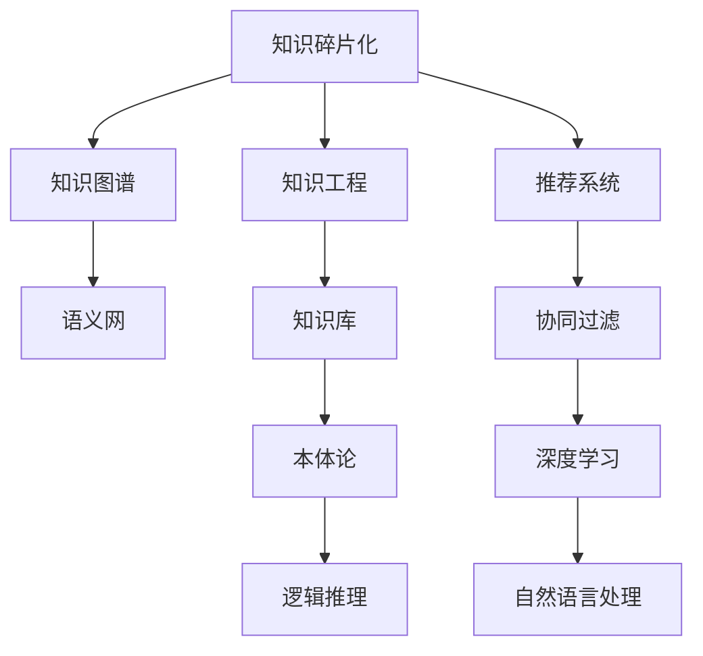

                 

## 1. 背景介绍

在当今信息爆炸的时代，人类获取知识的方式正发生翻天覆地的变化。从传统的线性阅读、专家讲授到信息检索、在线课程，再到AI辅助的个性化学习，知识获取和分享的方式日益多样化。然而，这种多样性在带来便利的同时，也引发了知识碎片化（Knowledge Fragmentation）的挑战，即知识的获取和组织越来越分散、零碎。本博客将从这一现象入手，探讨其背后的原因、带来的影响及应对策略，为未来的知识管理提供新的思路和机遇。

## 2. 核心概念与联系

### 2.1 核心概念概述

为了更好地理解知识碎片化的概念和影响，首先需要明确几个核心概念：

- **知识碎片化（Knowledge Fragmentation）**：指在信息时代，知识被分散存储在各种媒介（如书籍、网站、应用、社交网络）中，用户难以在短时间内全面掌握某一领域的知识。

- **知识碎片**：指零散、独立、缺乏逻辑联系的知识片段，无法系统地构成完整知识体系。

- **知识图谱（Knowledge Graph）**：一种语义化的知识组织方式，通过将实体、属性和关系三元组结构化，形成完整的知识网络。

- **知识工程（Knowledge Engineering）**：应用人工智能、计算机科学等技术，设计和构建知识库、知识推理引擎等，辅助人类获取和利用知识。

- **推荐系统（Recommendation System）**：通过用户行为数据、内容特征等分析，为每个用户推荐最相关的知识内容，提升学习效率和体验。

这些核心概念之间相互关联，共同构成了信息时代知识管理和利用的框架。知识碎片化是现象，知识图谱、知识工程、推荐系统等技术则是为了应对这一现象而产生的工具和手段。

### 2.2 核心概念原理和架构的 Mermaid 流程图



该流程图展示了知识碎片化现象与知识图谱、知识工程、推荐系统等技术之间的联系：

1. **知识碎片化**通过知识图谱进行整合，形成完整的知识体系。
2. **知识工程**利用知识库、本体论等技术，辅助构建知识图谱和推理引擎。
3. **推荐系统**通过协同过滤、深度学习等技术，为知识推荐提供依据。

## 3. 核心算法原理 & 具体操作步骤

### 3.1 算法原理概述

知识碎片化的主要解决思路是通过构建知识图谱和知识库，将分散的知识片段进行结构化整理和关联，形成一个逻辑连贯的知识体系。这一过程涉及知识抽取、知识融合、知识推理等多个步骤，需要结合自然语言处理（NLP）、计算机视觉（CV）、深度学习（DL）等多种技术手段。

### 3.2 算法步骤详解

构建知识图谱主要分为以下几个步骤：

1. **知识抽取（Knowledge Extraction）**：从海量的文本、图片、视频等数据源中，自动提取出实体、属性和关系，形成初步的知识片段。
2. **知识融合（Knowledge Fusion）**：将抽取出的知识片段进行去重、消歧、关联等处理，形成一个逻辑连贯的知识图谱。
3. **知识推理（Knowledge Reasoning）**：利用逻辑推理和深度学习技术，对知识图谱进行语义理解和推理，丰富知识表达。
4. **知识表示（Knowledge Representation）**：采用本体论等技术，对知识图谱进行形式化和语义化处理，便于机器理解和操作。

### 3.3 算法优缺点

**优点**：

- **提高知识利用效率**：通过知识图谱，将零散的知识片段整合成系统化的知识体系，便于用户获取和理解。
- **增强知识关联性**：通过知识融合和推理，知识之间的联系更加紧密，能够揭示更深层次的知识关联。
- **支持自动化知识更新**：借助机器学习算法，自动从新数据中提取和融合知识，保持知识库的实时性和准确性。

**缺点**：

- **构建复杂**：知识图谱的构建涉及多个技术和领域，需要大量人力和资源投入。
- **数据质量依赖**：知识抽取和融合的准确性依赖于数据源的质量，错误的输入数据可能导致错误的知识表示。
- **推理难度高**：知识推理需要高精度的模型和算法，对计算资源和专业知识要求较高。

### 3.4 算法应用领域

知识碎片化的解决思路在多个领域都有广泛应用，如：

- **医疗知识管理**：将医学文献、病历、药品信息等知识片段整合到知识图谱中，辅助医生诊断和治疗决策。
- **教育知识体系**：构建在线课程、教材和习题的语义化知识库，支持个性化学习路径的推荐。
- **金融知识图谱**：将市场数据、财务报表、新闻等知识片段整合，为投资分析和风险评估提供依据。
- **智能客服系统**：通过知识图谱和推荐系统，为用户提供实时、准确的问答服务。

## 4. 数学模型和公式 & 详细讲解 & 举例说明

### 4.1 数学模型构建

知识图谱的构建主要依赖于关系型数据库，通过三元组（实体、属性、关系）进行表示。例如，以下是一个关于医学领域的三元组示例：

- **节点**：医生、患者、疾病、药品
- **关系**：治疗、诊断、检测、预防
- **属性**：时间、地点、症状、剂量

### 4.2 公式推导过程

知识图谱的构建过程中，涉及多个数学和统计模型。以关系抽取为例，常用的方法是基于NLP的实体识别和关系分类技术，通过神经网络模型进行推导。例如，对于一句话“约翰得了感冒”，可以抽取实体“约翰”和“感冒”，以及它们之间的关系“得了”。

### 4.3 案例分析与讲解

以谷歌的知识图谱为例，其构建过程包括以下几个步骤：

1. **网页抓取与预处理**：使用Web爬虫抓取网页，并进行分词、去噪等预处理。
2. **实体识别与关系抽取**：通过机器学习模型识别网页中的实体和关系，如使用LSTM进行实体识别，使用CNN进行关系抽取。
3. **知识融合与关联**：将抽取出的知识片段进行去重、消歧和关联，形成一个完整的知识图谱。
4. **知识推理与更新**：利用逻辑推理和深度学习技术，对知识图谱进行语义理解和推理，支持自动更新和纠错。

## 5. 项目实践：代码实例和详细解释说明

### 5.1 开发环境搭建

要进行知识图谱的构建，需要安装以下软件和库：

1. Python：作为主要开发语言。
2. TensorFlow：用于构建和训练神经网络模型。
3. PyTorch：提供灵活的深度学习框架。
4. NLTK：用于自然语言处理。
5. SpaCy：提供高效的NLP工具库。
6. Scikit-learn：用于数据预处理和特征提取。

### 5.2 源代码详细实现

以下是一个简单的关系抽取示例代码，使用TensorFlow实现：

```python
import tensorflow as tf
from tensorflow.keras.layers import Input, Embedding, LSTM, Dense

# 定义输入层和嵌入层
inputs = Input(shape=(None, ), dtype='int32')
embedding = Embedding(input_dim=1000, output_dim=50, mask_zero=True)(inputs)

# 定义LSTM层进行实体识别
lstm = LSTM(units=50, return_sequences=True)(embedding)

# 定义分类层进行关系抽取
outputs = Dense(units=1, activation='sigmoid')(lstm)

# 编译模型
model = tf.keras.Model(inputs=inputs, outputs=outputs)
model.compile(optimizer='adam', loss='binary_crossentropy')

# 训练模型
model.fit(x_train, y_train, epochs=10, batch_size=32)
```

### 5.3 代码解读与分析

上述代码定义了一个简单的关系抽取模型，使用LSTM对输入的文本进行实体识别，并使用全连接层进行关系分类。模型通过交叉熵损失函数进行训练，最终输出二分类结果。

## 6. 实际应用场景

### 6.1 医疗知识管理

在医疗领域，知识碎片化问题尤为突出。医生需要处理海量的医学文献、病历和药品信息，难以全面掌握最新的医学知识。通过构建知识图谱，医生可以快速获取特定疾病的相关知识，辅助诊断和治疗决策。例如，某医生想要了解“新冠肺炎”的最新治疗方案，可以查询知识图谱中的“新冠肺炎”节点，获取相关治疗药物、病历和研究论文等知识片段，帮助其做出科学决策。

### 6.2 教育知识体系

在线教育平台通过知识图谱构建，可以实现个性化学习路径的推荐。学生可以根据自身兴趣和知识水平，从知识图谱中推荐相关的课程和教材。例如，某学生对人工智能感兴趣，可以在知识图谱中查询“人工智能”节点，获取相关的课程、论文和开源项目等，形成系统的学习路径。

### 6.3 金融知识图谱

金融领域的数据量庞大、信息密集，知识碎片化问题同样突出。通过构建金融知识图谱，投资分析师可以更全面地了解市场动态和风险因素。例如，某分析师想要了解“比特币”的市场趋势，可以查询知识图谱中的“比特币”节点，获取相关的市场分析报告、技术指标和经济预测等，辅助其投资决策。

### 6.4 未来应用展望

随着技术的不断进步，知识图谱和推荐系统将在更多领域得到应用，带来深远影响：

1. **智慧城市治理**：通过构建城市知识图谱，支持交通、环保、医疗等城市治理的应用，提升城市管理智能化水平。
2. **智能制造**：利用工业知识图谱和推荐系统，优化生产流程，提升产品质量和生产效率。
3. **智能农业**：通过农业知识图谱和推荐系统，提供智能化的农资选择和种植建议，提升农业生产效益。

## 7. 工具和资源推荐

### 7.1 学习资源推荐

为了帮助开发者掌握知识图谱和推荐系统的技术，以下是一些优质的学习资源：

1. **《知识图谱》**：刘挺教授的专著，系统介绍了知识图谱的构建、查询和应用。
2. **《推荐系统》**：王斌教授的专著，详细讲解了协同过滤、深度学习等推荐算法。
3. **Coursera的“Knowledge Graphs”课程**：由斯坦福大学的陈希鹏教授主讲，介绍了知识图谱的构建和应用。
4. **Kaggle上的知识图谱竞赛**：如KGCap Challenge，通过实际竞赛项目，提升学习效果。

### 7.2 开发工具推荐

以下是一些常用的开发工具，有助于知识图谱和推荐系统的构建和部署：

1. **Neo4j**：主流的图形数据库，支持复杂的关系查询和图算法。
2. **Eclipse Neptune**：基于Neo4j的开源平台，支持分布式存储和计算。
3. **Elk**：提供图形化界面的工具，方便知识图谱的构建和管理。
4. **Recommenders.io**：基于TensorFlow的推荐系统框架，支持多种推荐算法。
5. **Scrapy**：用于抓取网页和提取数据的爬虫框架。
6. **PyTorch**：提供灵活的深度学习框架，支持各种神经网络模型。

### 7.3 相关论文推荐

以下是几篇关于知识图谱和推荐系统的经典论文：

1. **知识图谱**：
   - **Holistic knowledge graph structure for intelligent learning**：通过知识图谱结构优化，提高智能学习系统的效果。
   - **Knowledge graph-based deep learning for semantic web**：利用知识图谱进行语义搜索和推荐，提升Web应用性能。

2. **推荐系统**：
   - **Item-based collaborative filtering**：经典的协同过滤算法，适用于小型数据集。
   - **Matrix factorization techniques for recommendation systems**：基于矩阵分解的推荐方法，适用于大型数据集。
   - **Deep neural networks for recommendation systems**：利用深度学习提高推荐系统的准确性和个性化。

## 8. 总结：未来发展趋势与挑战

### 8.1 研究成果总结

知识碎片化是信息时代的一大挑战，但通过知识图谱和推荐系统的构建，可以有效地解决这一问题。知识图谱技术已经广泛应用于医疗、教育、金融等多个领域，带来了显著的效益。推荐系统技术也逐渐从单一的协同过滤算法，向基于深度学习的推荐系统转变，实现了更高的精度和个性化推荐。

### 8.2 未来发展趋势

展望未来，知识图谱和推荐系统将在更多领域得到应用，带来更大的发展机遇：

1. **普适化**：知识图谱和推荐系统将逐步普及到各行各业，成为人工智能应用的基础设施。
2. **实时化**：通过实时数据更新和推理，实现动态的知识推荐和决策支持。
3. **个性化**：结合用户行为数据和个性化推荐技术，实现更精准的个性化学习路径和知识推荐。
4. **多模态**：融合文本、图像、视频等多模态数据，提升知识表示和推理能力。

### 8.3 面临的挑战

尽管知识图谱和推荐系统在许多领域取得了显著成果，但仍面临以下挑战：

1. **数据质量**：知识抽取和融合的准确性依赖于数据源的质量，错误的输入数据可能导致错误的知识表示。
2. **计算资源**：知识图谱和推荐系统的构建和推理需要大量的计算资源，对硬件设备和算法优化要求较高。
3. **知识整合**：不同领域和学科的知识图谱和推荐系统需要有效整合，才能形成完整的知识体系。
4. **隐私保护**：用户数据的隐私保护成为知识图谱和推荐系统面临的重要问题，需要设计合理的隐私保护机制。

### 8.4 研究展望

未来，需要在以下几个方面进行深入研究：

1. **跨领域知识图谱构建**：通过跨领域知识融合，形成覆盖更多学科的知识图谱。
2. **知识图谱的自动化构建**：利用自然语言处理和机器学习技术，实现知识图谱的自动化构建和更新。
3. **推荐系统的公平性和可解释性**：通过公平性评估和可解释性研究，提升推荐系统的可信度和透明性。
4. **知识图谱的跨模态融合**：通过融合不同模态的数据，提升知识图谱的完整性和可用性。

## 9. 附录：常见问题与解答

**Q1: 如何构建知识图谱？**

A: 知识图谱的构建需要经过以下步骤：
1. **数据收集**：从各种数据源中收集实体、属性和关系，如医学文献、金融数据、社交网络等。
2. **实体识别与关系抽取**：使用NLP和深度学习模型进行实体识别和关系抽取，如使用LSTM和CNN等。
3. **知识融合与关联**：将抽取出的知识片段进行去重、消歧和关联，形成完整的知识图谱。
4. **知识推理与更新**：利用逻辑推理和深度学习技术，对知识图谱进行语义理解和推理，支持自动更新和纠错。

**Q2: 知识图谱有哪些应用？**

A: 知识图谱在多个领域都有广泛应用，如：
- **医疗**：辅助医生诊断和治疗决策。
- **教育**：支持个性化学习路径的推荐。
- **金融**：支持投资分析和风险评估。
- **智慧城市**：支持交通、环保、医疗等城市治理的应用。

**Q3: 推荐系统如何提升个性化推荐？**

A: 推荐系统通过以下几个步骤提升个性化推荐：
1. **用户画像**：构建用户的兴趣和行为画像，如阅读历史、观看记录等。
2. **内容标签**：给物品打上标签，如书籍、电影等。
3. **协同过滤**：利用用户的相似性进行推荐，如协同过滤算法。
4. **深度学习**：利用深度神经网络进行推荐，如序列推荐、冷启动推荐等。

**Q4: 知识图谱的构建面临哪些挑战？**

A: 知识图谱的构建面临以下挑战：
1. **数据质量**：知识抽取和融合的准确性依赖于数据源的质量，错误的输入数据可能导致错误的知识表示。
2. **计算资源**：知识图谱和推荐系统的构建和推理需要大量的计算资源，对硬件设备和算法优化要求较高。
3. **知识整合**：不同领域和学科的知识图谱和推荐系统需要有效整合，才能形成完整的知识体系。
4. **隐私保护**：用户数据的隐私保护成为知识图谱和推荐系统面临的重要问题，需要设计合理的隐私保护机制。

**Q5: 知识图谱和推荐系统的发展趋势是什么？**

A: 知识图谱和推荐系统的发展趋势包括：
1. **普适化**：逐步普及到各行各业，成为人工智能应用的基础设施。
2. **实时化**：通过实时数据更新和推理，实现动态的知识推荐和决策支持。
3. **个性化**：结合用户行为数据和个性化推荐技术，实现更精准的个性化学习路径和知识推荐。
4. **多模态**：融合文本、图像、视频等多模态数据，提升知识表示和推理能力。

---

作者：禅与计算机程序设计艺术 / Zen and the Art of Computer Programming

