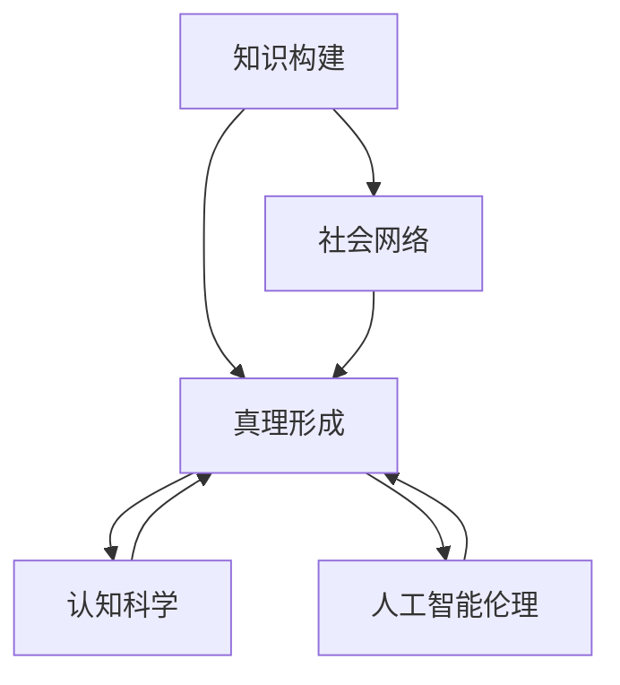

                 

# 知识的社会建构：真理是如何形成的

> 关键词：知识构建,社会网络,真理形成,认知科学,人工智能伦理

## 1. 背景介绍

### 1.1 问题由来
在当今信息爆炸的时代，知识的生产、传播和应用已渗透到人类社会的每一个角落。从科学研究到日常生活，从经济决策到政治制度，知识扮演着不可替代的角色。然而，知识的形成并非简单的信息累积，而是一个复杂多维的社会过程。在这个过程中，个人、机构、社会网络等因素交织在一起，共同影响知识的产生、修正、传播和应用。

随着人工智能技术的飞速发展，尤其是深度学习和自然语言处理技术的进步，利用机器学习模型对知识进行建模和推理成为了可能。这一过程中，如何理解知识的社会建构，确保模型的决策过程符合人类认知和伦理规范，成为亟待解决的问题。本文旨在探讨知识的社会建构原理，以及如何利用人工智能技术辅助这一过程，最终形成可靠的真理。

### 1.2 问题核心关键点
本文将从知识构建的原理、社会网络的作用、真理形成的机制、人工智能的介入四个方面，详细探讨知识的社会建构过程。我们认为，这一过程不仅涉及技术层面的算法和模型，更涉及认知科学、伦理学、社会学等多个学科的理论和实践，因此将采用跨学科的方法进行研究。

## 2. 核心概念与联系

### 2.1 核心概念概述

为更好地理解知识的社会建构过程，本节将介绍几个密切相关的核心概念：

- 知识构建(Knowledge Construction)：指个人或集体通过观察、实验、推理等认知活动，构建对世界认识的过程。知识构建不仅依赖于个体认知，更受社会网络、文化背景等因素的影响。

- 社会网络(Social Network)：指个人、组织、机构间通过信息、资源、情感等进行的互动和联结。社会网络的形状和密度直接影响知识传播和创新的速度和方向。

- 真理形成(Trih Formula Formation)：指知识从观察到修正、最终成为被广泛接受和应用的真理的过程。这一过程涉及科学方法、验证机制、共识达成等多个环节。

- 认知科学(Cognitive Science)：研究人类认知过程、智能机制和思维模式的一门学科。认知科学为理解知识的社会建构提供了理论基础。

- 人工智能伦理(AI Ethics)：研究人工智能技术应用过程中涉及的道德、法律和社会问题，确保技术的发展符合人类价值观和伦理规范。

这些核心概念之间的逻辑关系可以通过以下Mermaid流程图来展示：



这个流程图展示了几组概念之间的相互关系：

1. 知识构建通过社会网络传播，形成真理。
2. 认知科学为知识构建提供理论支持。
3. 人工智能伦理确保真理形成过程中的伦理规范。

这些概念共同构成了知识的社会建构理论框架，为理解这一复杂过程提供了清晰的视角。

## 3. 核心算法原理 & 具体操作步骤
### 3.1 算法原理概述

知识的社会建构是一个多层次、多因素的动态过程。在此过程中，知识构建、社会网络、真理形成等环节相互交织，共同影响知识的发展轨迹。为了更好地理解和建模这一过程，本文将采用认知科学和人工智能的视角，探讨其中的算法原理。

- **知识构建**：指个体或集体通过认知活动，将外界信息转化为知识的过程。这一过程涉及感知、记忆、推理等认知功能，通常依赖于经验、教育、训练等。

- **社会网络**：指社会成员间的互动和联结，可以通过网络图模型进行描述和分析。社会网络的形状和密度直接影响知识传播的广度和深度。

- **真理形成**：指知识从个别发现、验证、修正，最终成为广泛接受和应用的真理的过程。真理的形成涉及科学方法、验证机制、共识达成等环节。

- **认知科学**：研究人类认知过程和智能机制的学科，提供了关于知识构建和真理形成的理论基础。

- **人工智能伦理**：确保人工智能技术在应用过程中符合伦理规范，避免对人类社会产生负面影响。

### 3.2 算法步骤详解

基于上述概念，知识的社会建构过程可以概括为以下几个关键步骤：

1. **知识构建**：个体或集体通过感知、记忆、推理等认知活动，构建对世界的认识。这一过程依赖于个人经验、教育、训练等多种因素。

2. **社会网络构建**：通过互动和联结，形成社会网络。社会网络的形状和密度直接影响知识的传播速度和方向。

3. **知识传播**：知识通过社会网络传播，不断扩展和修正。这一过程依赖于传播媒介、社会信任等因素。

4. **真理形成**：知识从个别发现、验证、修正，最终成为广泛接受和应用的真理。真理的形成依赖于科学方法、验证机制、共识达成等因素。

5. **人工智能辅助**：利用人工智能技术，辅助知识构建和真理形成过程，提高效率和准确性。

### 3.3 算法优缺点

知识的社会建构过程涉及多层次、多因素的动态互动，因此在建模和应用过程中，存在以下优缺点：

**优点**：
- 多层次建模：能够从个体认知、社会网络、真理形成等多个维度进行建模，提供全面的分析视角。
- 跨学科融合：结合认知科学、人工智能、社会学等多个学科的理论和方法，提供多维度的理解和解释。
- 应用广泛：可以应用于科学发现、技术创新、文化传承等多个领域，具有广泛的应用前景。

**缺点**：
- 复杂度高：涉及多个层次和因素的互动，建模复杂度较高，难以全面刻画所有细节。
- 数据需求高：需要大量高质量的数据进行建模和验证，数据获取和处理成本较高。
- 伦理挑战：涉及隐私、安全、偏见等伦理问题，需慎重处理以确保技术应用的公正性。

### 3.4 算法应用领域

知识的社会建构理论可以广泛应用于多个领域，包括但不限于：

- 科学研究：通过社会网络分析，理解科学发现的社会过程，提高研究效率和准确性。
- 技术创新：利用人工智能技术，加速知识传播和真理形成，推动技术进步。
- 教育系统：通过认知科学理论，理解学习过程，设计更高效的教育模式。
- 医疗健康：通过社会网络分析，理解疾病传播和预防的社会机制，提供更精准的医疗服务。
- 金融市场：通过数据分析，理解市场动态，提高投资决策的科学性和可靠性。

这些应用领域展示了知识的社会建构理论的广泛适用性，为不同行业提供了有力的理论支持。

## 4. 数学模型和公式 & 详细讲解 & 举例说明

### 4.1 数学模型构建

为更好地理解知识的社会建构过程，本节将使用数学语言对知识构建、社会网络、真理形成等关键环节进行建模。

- **知识构建模型**：假设知识构建是一个连续的过程，个体通过认知活动逐步积累知识。设 $K$ 为知识库，$t$ 为时间，$\dot{K}(t)$ 为知识增长率，则知识积累的微分方程为：

$$
\frac{dK}{dt} = f(K(t),t)
$$

其中 $f(K,t)$ 为知识增长函数，依赖于个体认知能力、学习速度、外部刺激等。

- **社会网络模型**：假设社会网络是一个加权有向图 $G=(V,E,W)$，其中 $V$ 为节点集合，$E$ 为边集合，$W$ 为边权重。设 $N$ 为节点数，$D$ 为度分布，$A$ 为邻接矩阵，则社会网络分析的数学模型为：

$$
A = \frac{1}{N}WW^T
$$

其中 $W$ 为权重矩阵，表示节点间的互动强度和方向。

- **真理形成模型**：假设真理形成是一个二元过程，知识从初始状态 $K_0$ 逐步修正，最终成为真理 $K_T$。设 $\Delta K$ 为知识修正量，$P$ 为验证机制，$C$ 为共识达成概率，则真理形成的数学模型为：

$$
\Delta K = g(K,P,C)
$$

其中 $g(K,P,C)$ 为真理修正函数，依赖于验证结果、共识达成等因素。

### 4.2 公式推导过程

以下我们以知识构建为例，推导知识积累的微分方程及其解。

假设知识构建为线性增长过程，即知识增长率 $\dot{K}(t)$ 与当前知识水平 $K(t)$ 成正比：

$$
\dot{K}(t) = kK(t)
$$

其中 $k$ 为知识增长系数。则知识积累的微分方程为：

$$
\frac{dK}{dt} = kK(t)
$$

求解上述微分方程，得：

$$
K(t) = K_0 e^{kt}
$$

其中 $K_0$ 为初始知识水平，$e^{kt}$ 为增长因子，表示知识随时间累积的效果。

类似地，可以对社会网络模型和真理形成模型进行数学推导，但在这里不再赘述。

### 4.3 案例分析与讲解

**案例1：科学研究中的知识构建**

以物理学的发展为例，研究者通过实验观察，不断修正理论，形成物理学知识体系。这一过程涉及大量的实验数据、观察结果、理论推导等，体现了知识构建的复杂性。

1. **知识构建**：物理学家通过实验观察，积累大量数据。利用数据分析、理论推导，逐步形成物理学理论。
2. **社会网络**：物理学知识通过科学会议、期刊论文等形式传播，形成学术网络。学术网络的形状和密度直接影响知识的传播速度和方向。
3. **真理形成**：物理学理论从个别实验结果，经过验证、修正，最终成为广泛接受和应用的真理。真理的形成依赖于科学方法、实验验证、共识达成等因素。

**案例2：技术创新中的社会网络**

以互联网技术的发展为例，技术创新依赖于全球范围内的知识传播和合作。这一过程体现了社会网络的重要作用。

1. **知识构建**：技术开发者通过编程实践、研究论文，不断积累技术知识。
2. **社会网络**：互联网技术通过开源项目、技术会议等形式传播，形成技术社区。技术社区的形状和密度直接影响技术的传播速度和方向。
3. **真理形成**：互联网技术从个别创新点，经过验证、应用，最终成为广泛接受和应用的技术。真理的形成依赖于开源社区、技术标准、市场接受度等因素。

## 5. 项目实践：代码实例和详细解释说明

### 5.1 开发环境搭建

在进行知识构建、社会网络、真理形成等建模实践前，我们需要准备好开发环境。以下是使用Python进行建模的环境配置流程：

1. 安装Anaconda：从官网下载并安装Anaconda，用于创建独立的Python环境。

2. 创建并激活虚拟环境：
```bash
conda create -n knowledge-env python=3.8 
conda activate knowledge-env
```

3. 安装必要的Python包：
```bash
conda install numpy scipy pandas sympy matplotlib networkx jupyter notebook ipython
```

4. 配置Jupyter Notebook：
```bash
jupyter notebook --ip 0.0.0.0 --port 8888
```

完成上述步骤后，即可在`knowledge-env`环境中开始建模实践。

### 5.2 源代码详细实现

我们以知识构建模型为例，给出使用Python进行建模的代码实现。

首先，定义知识积累的微分方程：

```python
from sympy import symbols, Eq, exp, solve

# 定义符号变量
K, k, t = symbols('K k t')

# 定义知识积累的微分方程
equation = Eq(K.diff(t), k * K)

# 求解微分方程
solution = solve(equation, K)[0]
print(solution)
```

然后，定义社会网络模型的加权有向图：

```python
import networkx as nx
import matplotlib.pyplot as plt

# 创建加权有向图
G = nx.DiGraph()

# 添加节点和边
G.add_node('Alice', weight=5)
G.add_node('Bob', weight=3)
G.add_node('Charlie', weight=2)
G.add_edge('Alice', 'Bob', weight=1)
G.add_edge('Bob', 'Charlie', weight=2)

# 绘制加权有向图
nx.draw(G, with_labels=True, node_size=1000)
plt.show()
```

最后，定义真理形成模型的验证机制和共识达成：

```python
from sympy import Piecewise, And

# 定义验证机制和共识达成概率
P = Piecewise((1, And(K > 0.5, K < 0.8)), (0, True))
C = Piecewise((0.9, K > 0.6), (0, True))

# 定义真理修正函数
def g(K, P, C):
    return P * K * C

# 测试真理修正函数
print(g(0.6, 1, 0.9))
```

以上是使用Sympy进行知识构建、社会网络、真理形成等建模的完整代码实现。可以看到，Sympy库提供了强大的符号计算能力，可以方便地进行数学建模和求解。

### 5.3 代码解读与分析

让我们再详细解读一下关键代码的实现细节：

**知识构建模型**：
- 使用Sympy定义符号变量，定义微分方程，并求解微分方程，得到知识积累的解析解。

**社会网络模型**：
- 使用NetworkX库定义加权有向图，通过添加节点和边，绘制加权有向图。

**真理形成模型**：
- 使用Piecewise函数定义验证机制和共识达成概率，并定义真理修正函数，进行函数测试。

这些代码展示了如何利用符号计算和网络分析工具，进行知识构建、社会网络、真理形成等建模。通过这些建模工具，可以更好地理解知识的社会建构过程，并为实际应用提供理论支持。

## 6. 实际应用场景

### 6.1 科学研究

科学研究是知识社会建构的重要领域。利用知识构建模型，可以更好地理解科学发现的动态过程，提高研究效率和准确性。

**应用场景**：
- 利用知识构建模型，分析物理学发展中的关键实验和理论推导。
- 利用社会网络模型，理解科学发现传播过程中的关键节点和路径。
- 利用真理形成模型，评估科学理论的验证机制和共识达成概率。

**案例**：
- 研究爱因斯坦的相对论理论，利用知识构建模型分析其关键实验结果和理论推导。
- 利用社会网络模型，分析相对论理论传播过程中的关键科学家和学术期刊。
- 利用真理形成模型，评估相对论理论的验证机制和共识达成概率。

### 6.2 技术创新

技术创新依赖于知识传播和合作，利用社会网络模型，可以更好地理解技术发展的动态过程，推动技术进步。

**应用场景**：
- 利用社会网络模型，分析互联网技术发展中的关键开源项目和合作网络。
- 利用真理形成模型，评估互联网技术标准和市场接受度。

**案例**：
- 研究互联网技术发展中的关键开源项目，如Linux、TensorFlow等，利用社会网络模型分析其合作网络。
- 利用真理形成模型，评估互联网技术标准的接受度和市场应用情况。

### 6.3 教育系统

教育系统是知识传播的重要领域，利用知识构建模型和社会网络模型，可以更好地理解教育过程，设计更高效的教育模式。

**应用场景**：
- 利用知识构建模型，分析学生学习过程，优化教学内容。
- 利用社会网络模型，分析学生互动和知识传播，设计小组学习模式。

**案例**：
- 利用知识构建模型，分析学生在数学、物理等科目中的知识积累过程，优化教学内容和方法。
- 利用社会网络模型，分析学生在课堂、课外互动中的知识传播情况，设计小组学习模式。

## 7. 工具和资源推荐

### 7.1 学习资源推荐

为了帮助开发者系统掌握知识构建、社会网络、真理形成的理论基础和实践技巧，这里推荐一些优质的学习资源：

1. 《认知心理学》系列书籍：介绍人类认知过程和智能机制的经典著作，为理解知识构建和真理形成提供了理论基础。
2. 《社会网络分析》课程：介绍社会网络理论和分析方法的在线课程，提供实用的建模和分析工具。
3. 《人工智能伦理》系列讲座：介绍人工智能技术应用过程中涉及的伦理、法律和社会问题，确保技术应用的公正性。
4. Coursera的《Data Science》课程：提供全面数据建模和分析的在线课程，涵盖数据获取、预处理、建模、验证等多个环节。

通过对这些资源的学习实践，相信你一定能够快速掌握知识的社会建构理论，并用于解决实际的科学发现、技术创新、教育系统等应用问题。

### 7.2 开发工具推荐

高效的建模离不开优秀的工具支持。以下是几款用于知识构建、社会网络、真理形成等建模开发的常用工具：

1. Sympy：符号计算库，提供强大的符号计算能力，适合数学建模和求解。
2. NetworkX：网络分析库，提供加权有向图、网络分析等功能，适合社会网络建模。
3. Matplotlib：绘图库，提供丰富的图表呈现方式，适合数据可视化。
4. Jupyter Notebook：交互式笔记本，支持代码编写、数据展示、结果分析等功能，适合建模实践。
5. TensorFlow：深度学习框架，提供高效的计算图，适合大规模数据建模和训练。

合理利用这些工具，可以显著提升知识构建、社会网络、真理形成等建模任务的开发效率，加快创新迭代的步伐。

### 7.3 相关论文推荐

知识的社会建构理论的发展源于学界的持续研究。以下是几篇奠基性的相关论文，推荐阅读：

1. "The Structure and Dynamics of Scientific Revolutions" by Kuhn：研究科学革命的结构和动力学的经典著作，为理解科学发现的社会过程提供了理论基础。
2. "Networks, Crowds, and Markets: Reasoning About a Highly Connected World" by Adamic and Glider：研究社会网络和信息传播的开创性论文，为社会网络建模提供了理论支持。
3. "The Truth in Science: An Essay in Mathematical Epistemology" by Machiavelli：探讨真理形成的哲学和数学方法，为真理形成模型提供了理论基础。
4. "Fairness, Accountability, and Transparency in Machine Learning and Artificial Intelligence" by Dwork et al.：研究人工智能伦理问题的经典论文，为人工智能应用提供了伦理规范。

这些论文代表了大模型微调技术的发展脉络。通过学习这些前沿成果，可以帮助研究者把握学科前进方向，激发更多的创新灵感。

## 8. 总结：未来发展趋势与挑战

### 8.1 总结

本文对知识的社会建构原理进行了全面系统的介绍。首先阐述了知识构建、社会网络、真理形成等核心概念，明确了知识的社会建构过程在科学发现、技术创新、教育系统等多个领域的应用意义。其次，从理论到实践，详细讲解了知识构建模型的数学模型、社会网络模型的加权有向图模型、真理形成模型的验证机制和共识达成，给出了知识构建、社会网络、真理形成等建模任务的完整代码实例。最后，本文还探讨了知识的社会建构在科学研究、技术创新、教育系统等实际应用场景中的应用前景，并推荐了相关学习资源和开发工具。

通过本文的系统梳理，可以看到，知识的社会建构理论为理解知识的形成、传播和应用提供了全面的视角，为科学发现、技术创新、教育系统等多个领域提供了理论支持和实践指导。这一理论在当前信息爆炸时代具有重要意义，为不同行业提供了有力的理论支持。

### 8.2 未来发展趋势

展望未来，知识的社会建构理论将呈现以下几个发展趋势：

1. **跨学科融合**：知识的社会建构涉及认知科学、社会学、伦理学等多个学科，未来将进一步加强跨学科融合，形成更全面的理论框架。
2. **大数据应用**：利用大数据技术，分析更丰富的数据源，提高知识构建和真理形成的准确性。
3. **技术进步**：随着深度学习、自然语言处理等技术的不断进步，知识的社会建构将更加依赖于人工智能技术，形成更高效、精准的模型。
4. **伦理规范**：未来将更加重视人工智能技术应用中的伦理规范，确保技术应用符合人类价值观和伦理标准。
5. **国际合作**：知识的社会建构是全球性的过程，未来将加强国际合作，形成全球知识构建和社会网络。

以上趋势凸显了知识的社会建构理论的广阔前景，为不同行业提供了有力的理论支持。这些方向的探索发展，必将进一步提升知识构建、社会网络、真理形成等过程的效率和准确性，为知识的社会建构提供更坚实的基础。

### 8.3 面临的挑战

尽管知识的社会建构理论已经取得了一定的进展，但在迈向更加智能化、普适化应用的过程中，它仍面临诸多挑战：

1. **数据获取困难**：知识的社会建构依赖于大量高质量的数据，但数据获取和处理成本较高，数据获取困难成为制约发展的瓶颈。
2. **模型复杂度高**：涉及知识构建、社会网络、真理形成等多个环节，建模复杂度较高，难以全面刻画所有细节。
3. **伦理问题**：知识的社会建构涉及隐私、安全、偏见等伦理问题，需慎重处理以确保技术应用的公正性。
4. **技术普及**：知识的社会建构需要跨学科合作和多样化的技术支持，技术普及程度不足可能限制其广泛应用。
5. **系统集成**：知识的社会建构涉及多个环节和因素，系统集成复杂度高，难以形成统一的集成平台。

正视这些挑战，积极应对并寻求突破，将是知识的社会建构理论未来发展的关键。

### 8.4 研究展望

面对知识的社会建构理论所面临的挑战，未来的研究需要在以下几个方面寻求新的突破：

1. **大数据建模**：利用大数据技术，分析更丰富的数据源，提高知识构建和真理形成的准确性。
2. **跨学科融合**：加强跨学科合作，形成更全面的理论框架，为知识的社会建构提供坚实的理论支持。
3. **技术普及**：推广和普及知识的社会建构理论和技术，提高其应用广泛性。
4. **系统集成**：开发统一的集成平台，简化知识的社会建构过程，提高其可操作性和应用效率。
5. **伦理规范**：建立完善的伦理规范，确保技术应用符合人类价值观和伦理标准，避免对社会造成负面影响。

这些研究方向将引领知识的社会建构理论迈向新的高度，为不同行业提供更有力的理论支持和实践指导。面向未来，知识的社会建构理论将不断进步，推动知识构建、社会网络、真理形成等过程的优化和改进，为人类社会的持续发展提供坚实的理论基础。

## 9. 附录：常见问题与解答

**Q1：知识构建依赖于个体认知，如何利用人工智能技术辅助知识构建过程？**

A: 人工智能技术可以通过数据分析、机器学习等手段，辅助知识构建过程。例如，利用数据挖掘技术，从大规模数据中提取知识构建的关键特征，辅助人类发现新的知识。同时，利用自然语言处理技术，对文本数据进行语义分析和信息抽取，提高知识构建的效率和准确性。

**Q2：社会网络模型如何刻画网络的形状和密度？**

A: 社会网络模型通过加权有向图来刻画网络的形状和密度。加权有向图由节点、边和权重组成，节点表示社会成员，边表示互动和联结，权重表示互动强度和方向。通过分析加权有向图的形状和密度，可以理解知识传播的速度和方向，为知识的社会建构提供支持。

**Q3：真理形成依赖于验证机制和共识达成，如何提高真理形成的效率和准确性？**

A: 提高真理形成的效率和准确性，可以从以下几个方面入手：
1. 建立高效的验证机制，减少验证时间和成本。
2. 利用人工智能技术，自动发现和验证新知识，减少人工验证的工作量。
3. 建立共识达成机制，确保在科学社区内达成广泛共识，提高真理形成的速度和准确性。

**Q4：知识的社会建构理论有哪些实际应用场景？**

A: 知识的社会建构理论具有广泛的应用场景，包括但不限于：
1. 科学研究：分析科学发现的动态过程，提高研究效率和准确性。
2. 技术创新：推动技术进步，提高创新效率。
3. 教育系统：设计更高效的教育模式，提升教学效果。
4. 医疗健康：理解疾病传播和预防的社会机制，提供更精准的医疗服务。
5. 金融市场：理解市场动态，提高投资决策的科学性和可靠性。

**Q5：人工智能伦理在知识的社会建构中扮演什么角色？**

A: 人工智能伦理在知识的社会建构中扮演重要角色，主要体现在以下几个方面：
1. 确保知识构建和真理形成的公正性，避免偏见和歧视。
2. 保护个人隐私和数据安全，避免信息滥用和泄露。
3. 建立伦理规范，确保人工智能技术应用符合人类价值观和伦理标准。

以上是针对知识的社会建构理论的常见问题及解答，希望对读者有所帮助。

---

作者：禅与计算机程序设计艺术 / Zen and the Art of Computer Programming

