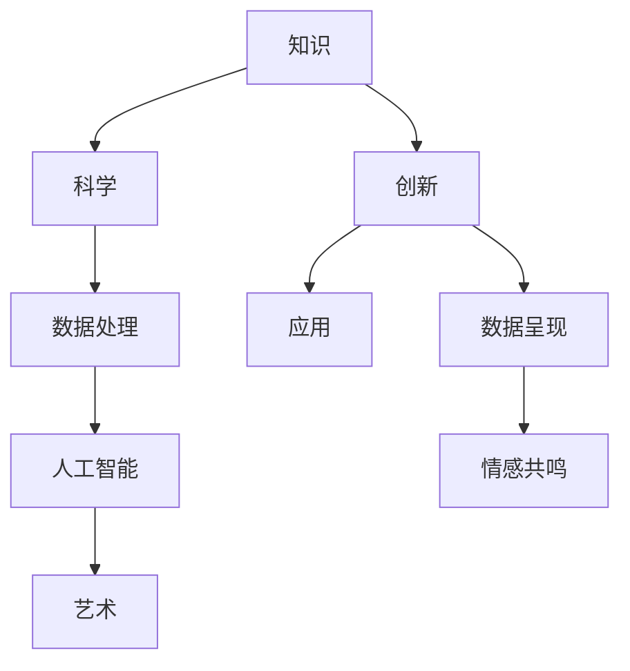

                 

# 知识的美学：科学与艺术的交融

## 1. 背景介绍

在数字化时代，人工智能（AI）技术的飞速发展使得科学与艺术在知识处理和生成方面不断融合。这一趋势不仅改变了人们获取和利用知识的方式，也重新定义了知识本身的意义与形态。本文旨在探讨知识的美学，即科学与艺术如何协同作用，推动知识的创新与转化。

### 1.1 问题的由来

在传统学术界，科学以严谨的逻辑推理和定量分析为特征，而艺术则以创意和情感表达为核心。然而，随着大数据、深度学习等技术的崛起，这种界限开始模糊。人工智能通过处理海量数据，不仅能发现潜在的规律与模式，还能创造前所未有的艺术作品。因此，探讨科学与艺术的融合，对于理解知识的新形态具有重要意义。

### 1.2 问题的核心关键点

科学和艺术的交融在知识创新过程中体现在多个层面：

- **数据处理**：科学提供数据处理和分析的工具，艺术则在数据呈现上引入创意与美感。
- **知识结构**：科学关注知识的逻辑结构与精确性，艺术则关注知识的表达与情感共鸣。
- **创新过程**：科学强调系统性、连续性，艺术则鼓励跳跃性、突破性思维。
- **应用场景**：科学常用于解决实际问题，艺术则拓展了知识的认知边界。

这些关键点共同构成了科学与艺术在知识美学中的互动机制。

## 2. 核心概念与联系

### 2.1 核心概念概述

理解知识的美学，首先需要明确几个关键概念：

- **知识**：即信息的系统化、结构化表达，包括事实、理论、方法等。
- **科学**：基于观察、实验、逻辑推理等方法获取知识的过程和体系。
- **艺术**：通过情感、创造力表达思想和情感，反映人类内在精神的产物。
- **人工智能**：通过模拟人类智能，处理和生成信息的技术。

这些概念之间的联系通过以下Mermaid流程图进行展示：



## 3. 核心算法原理 & 具体操作步骤

### 3.1 算法原理概述

科学与艺术的融合体现在知识的生成和表达两个层面。知识生成通过科学方法提取数据中的结构与规律，而艺术则通过创意与美感将这些结构与规律转化为人可感知的形式。

### 3.2 算法步骤详解

#### 3.2.1 数据收集与预处理

数据是科学与艺术融合的基础。数据收集需要考虑数据的广泛性、代表性，以确保提取的知识具有普适性。数据预处理则包括数据清洗、特征提取、数据标准化等步骤，以确保数据质量和一致性。

#### 3.2.2 知识结构化

知识结构化是科学的核心。通过数学模型、逻辑推理、统计分析等方法，将数据转化为知识体系。这一过程要求高度的结构性和精确性，确保知识的科学性。

#### 3.2.3 艺术表达

艺术表达是艺术的灵魂。在知识结构化的基础上，通过创意与美感，将知识转化为艺术作品。这包括视觉、听觉、文字等不同形式的表达，以丰富受众的认知体验。

#### 3.2.4 人工智能的协同

人工智能通过数据处理、模型训练等技术，为科学和艺术的融合提供工具和平台。例如，通过深度学习模型，可以从数据中自动提取特征，生成知识结构；通过生成对抗网络（GAN）等技术，可以创作艺术作品。

### 3.3 算法优缺点

科学与艺术的融合具有以下优点：

- **创新性**：艺术引入创意与美感，增强了知识的创新性。
- **可理解性**：艺术通过情感共鸣，使知识更容易被理解和接受。
- **多样性**：艺术形式的多样性，拓宽了知识的表现形式。

然而，这一过程也存在一些缺点：

- **复杂性**：融合过程需要同时考虑科学与艺术的多维度特征，增加了复杂性。
- **技术依赖**：艺术表达依赖于数据处理和算法模型，对技术要求较高。
- **主观性**：艺术表达具有较强的主观性，可能影响知识的客观性。

### 3.4 算法应用领域

科学与艺术的融合在多个领域中具有广泛应用：

- **媒体与娱乐**：通过生成对抗网络等技术，创作动画、电影、音乐等艺术作品。
- **教育与培训**：利用虚拟现实、增强现实等技术，将知识转化为互动式、沉浸式的教学体验。
- **城市规划与设计**：通过数据分析与艺术设计，创造美观、功能齐全的城市空间。
- **营销与广告**：通过数据分析与艺术创意，设计有吸引力的营销策略和广告内容。
- **环境保护**：通过数据分析与艺术表达，揭示环境问题的根源，推广环保理念。

## 4. 数学模型和公式 & 详细讲解 & 举例说明

### 4.1 数学模型构建

在知识的美学中，数学模型是理解和表达知识的重要工具。以下是几个基本的数学模型：

- **线性回归模型**：用于分析变量之间的关系，形式为 $y = \theta_0 + \theta_1 x_1 + \cdots + \theta_n x_n$。
- **决策树模型**：通过树形结构进行决策，每个节点代表一个属性或特征。
- **神经网络模型**：模拟人脑神经元的工作方式，用于复杂数据的处理与分类。

### 4.2 公式推导过程

以线性回归模型为例，其最小二乘法公式推导如下：

$$
\theta = (X^T X)^{-1} X^T y
$$

其中，$\theta$ 为模型参数，$X$ 为特征矩阵，$y$ 为标签向量。

### 4.3 案例分析与讲解

假设我们有一组关于房价的数据集，目标是预测未来房价。通过线性回归模型，我们可以将房价与房屋面积、地理位置等因素关联起来。随后，我们可以使用艺术表达，将这一预测结果转化为可视化图表，帮助用户更直观地理解房价变化趋势。

## 5. 项目实践：代码实例和详细解释说明

### 5.1 开发环境搭建

在Python环境中搭建开发环境，具体步骤如下：

1. 安装Anaconda：从官网下载并安装Anaconda，创建虚拟环境。
2. 安装相关依赖：如TensorFlow、PyTorch等深度学习框架，以及NumPy、Pandas等科学计算库。
3. 安装艺术表达工具：如Matplotlib、Seaborn等，用于数据可视化。

### 5.2 源代码详细实现

以下是一个简单的Python代码示例，演示如何使用线性回归模型预测房价，并通过Matplotlib进行可视化：

```python
import numpy as np
import matplotlib.pyplot as plt
from sklearn.linear_model import LinearRegression

# 准备数据
X = np.array([[50, 2.5], [80, 3.0], [120, 4.5]])
y = np.array([300000, 500000, 700000])

# 训练模型
model = LinearRegression()
model.fit(X, y)

# 预测房价
new_X = np.array([[70, 2.5]])
new_y = model.predict(new_X)

# 可视化结果
plt.scatter(X[:, 0], y, color='blue', label='Actual Prices')
plt.plot(new_X, new_y, color='red', label='Predicted Price')
plt.xlabel('House Area (m^2)')
plt.ylabel('Price (USD)')
plt.legend()
plt.show()
```

### 5.3 代码解读与分析

这段代码通过线性回归模型预测新房价，并使用Matplotlib将实际房价与预测房价进行可视化对比。代码简洁直观，易于理解。通过这样的实践，我们可以更好地掌握科学和艺术在知识生成中的协同作用。

### 5.4 运行结果展示

运行代码后，将得到一个散点图，其中蓝色点表示实际房价，红色线表示预测房价。通过这一可视化，用户可以直观地看到预测结果的准确性。

## 6. 实际应用场景

### 6.1 媒体与娱乐

在电影制作中，人工智能可以通过分析大量历史数据，预测票房趋势，优化剧本内容。艺术创作者则根据这些预测，创作出更具市场潜力的作品。

### 6.2 教育与培训

在在线教育中，人工智能可以分析学生的学习行为，提供个性化推荐和辅导。艺术则通过互动式教学，使学习过程更加生动有趣。

### 6.3 城市规划与设计

在城市规划中，人工智能可以分析交通流量、环境数据，生成城市设计方案。艺术设计师则根据这些方案，创作出美观且功能齐全的城市设计作品。

### 6.4 营销与广告

在营销中，人工智能可以分析用户行为，预测消费趋势，生成个性化广告。艺术则通过创意广告，吸引用户关注和参与。

### 6.5 环境保护

在环境保护中，人工智能可以分析环境数据，识别污染源和趋势。艺术家则通过创意作品，揭示环境问题的根源，倡导环保理念。

## 7. 工具和资源推荐

### 7.1 学习资源推荐

为了深入理解知识的美学，推荐以下学习资源：

1. **《人工智能导论》**：介绍人工智能的基本概念和应用，强调科学与艺术的结合。
2. **Coursera《深度学习》课程**：由斯坦福大学教授主讲，涵盖深度学习的基础与实践，包括科学方法的引入。
3. **Kaggle竞赛**：通过参与实际项目，学习如何运用科学方法解决实际问题，并融入艺术创意。
4. **Google Arts & Culture**：探索艺术作品背后的科学原理，感受科学与艺术的交融之美。

### 7.2 开发工具推荐

以下是一些常用的开发工具：

1. **Jupyter Notebook**：支持代码和数据可视化，便于科学和艺术并行实验。
2. **Google Colab**：提供GPU资源，便于进行深度学习模型训练和测试。
3. **Blender**：开源3D动画制作工具，结合艺术创意与科学计算，进行动态视觉表达。

### 7.3 相关论文推荐

以下是几篇探讨科学与艺术融合的代表性论文：

1. **《大数据时代的艺术与创意》**：探讨大数据如何促进艺术创作与创新。
2. **《人工智能与艺术的未来》**：讨论AI技术在艺术创作和欣赏中的应用前景。
3. **《科学与艺术：跨学科的研究方法》**：分析科学与艺术融合的理论与实践。

## 8. 总结：未来发展趋势与挑战

### 8.1 研究成果总结

科学与艺术的融合在知识美学中取得了显著进展，推动了知识创新和转化。通过科学方法提取数据规律，艺术创意进行表达转化，知识的美学得以在多个领域中得到应用。

### 8.2 未来发展趋势

未来，知识的美学将进一步深化，体现在以下几个方面：

- **跨学科研究**：科学与艺术融合的广度和深度将不断拓展，形成更多交叉学科。
- **智能艺术**：人工智能将创造更多具有情感和创意的智能艺术作品。
- **个性化知识**：通过数据分析和艺术表达，为用户提供更加个性化的知识服务。
- **全球知识共享**：科学与艺术融合的知识作品将跨越文化、语言障碍，实现全球共享。

### 8.3 面临的挑战

尽管科学与艺术的融合前景广阔，但也面临一些挑战：

- **技术壁垒**：科学与艺术融合需要高水平的技术支持，对技术要求较高。
- **文化差异**：艺术作品在不同文化背景下的理解与接受度可能存在差异。
- **版权问题**：艺术作品在数字化过程中的版权保护和伦理问题。
- **知识偏见**：科学模型可能存在偏见，艺术表达可能加剧偏见，需要注意平衡。

### 8.4 研究展望

未来研究应在以下几个方面寻求新的突破：

- **跨领域融合**：探索科学与艺术在更多领域中的融合，如医疗、建筑等。
- **伦理与安全性**：研究如何保证知识美学的伦理与安全性，避免有害内容的传播。
- **创新性保护**：建立知识产权保护机制，鼓励科学与艺术领域的创新发展。
- **教育普及**：推动科学与艺术融合的教育普及，培养更多复合型人才。

## 9. 附录：常见问题与解答

### Q1: 为什么科学与艺术在知识处理中需要融合？

**A1**: 科学与艺术在知识处理中的融合，能够通过科学方法提取数据中的规律，并通过艺术表达将这些规律转化为易于理解和接受的形式。这不仅提高了知识的创新性，还增强了知识的可理解性和艺术性。

### Q2: 如何平衡科学与艺术在知识处理中的作用？

**A2**: 平衡科学与艺术的作用需要根据具体问题选择合适的方法。通常情况下，先通过科学方法分析数据，提取规律；再通过艺术表达将这些规律转化为视觉、听觉等形式。这样既能保证知识的科学性，又能增强其艺术性。

### Q3: 哪些工具可以帮助科学与艺术融合？

**A3**: 许多工具可以帮助科学与艺术融合，包括深度学习框架（如TensorFlow、PyTorch）、数据可视化工具（如Matplotlib、Seaborn）、艺术创作工具（如Blender）等。选择合适的工具，可以大大提升融合过程的效率和效果。

### Q4: 如何评估知识美学的创新性？

**A4**: 评估知识美学的创新性可以从多个维度考虑：
- **科学准确性**：评估模型和数据处理方法的科学性和准确性。
- **艺术美感**：评估艺术表达的创意与美感。
- **实际应用效果**：评估融合后的知识作品在实际应用中的效果。
- **用户体验**：评估用户对知识作品的使用体验和反馈。

通过综合考虑这些维度，可以全面评估知识美学的创新性。

---

作者：禅与计算机程序设计艺术 / Zen and the Art of Computer Programming

