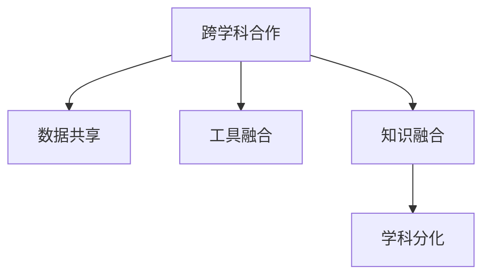

                 

## 1. 背景介绍

### 1.1 问题由来

随着科技的飞速发展和跨学科研究的日益深入，现代知识体系变得日益复杂和交叉。从物理、化学到生物、医学，从计算机科学到社会科学，各领域的知识边界逐渐模糊，学科交叉成为了促进创新和解决复杂问题的关键。这种交叉不仅仅表现在理论和方法的融合，还体现在数据、工具和资源的共享上。

### 1.2 问题核心关键点

学科交叉的关键在于如何有效融合不同领域的知识，以形成新的方法和理论，解决复杂问题。常见的交叉方法包括：

- **跨学科合作**：不同领域的专家共同合作，结合各自优势，推动问题的解决。
- **跨学科数据共享**：通过数据共享平台，促进不同领域的数据融合，提高研究效率。
- **跨学科工具使用**：引入其他领域的工具和技术，提升研究效率和准确性。
- **跨学科知识融合**：将不同学科的知识和方法结合，形成新的学科范式。

在计算机科学中，人工智能（AI）作为前沿领域，与多个学科的交叉尤为频繁，如医学、生物学、社会学等。AI技术，尤其是深度学习和自然语言处理，为解决复杂问题提供了新的视角和工具。

### 1.3 问题研究意义

学科交叉的研究对于推动科学技术的创新和应用具有重要意义：

1. **促进跨学科创新**：不同领域的知识融合可以激发新的研究思路和突破。
2. **提升研究效率**：跨学科合作和数据共享可以加速研究进程，提高研究成果的实用性和影响力。
3. **解决复杂问题**：多学科合作能够应对现实世界中的复杂问题，提供更全面、更精准的解决方案。
4. **推动学科发展**：跨学科研究可以拓宽学科边界，促进学科体系的进步。
5. **增强社会价值**：跨学科合作可以解决更多社会问题，提升社会福祉。

## 2. 核心概念与联系

### 2.1 核心概念概述

为了更好地理解学科交叉的动态平衡，本节将介绍几个关键概念及其相互联系：

- **跨学科合作**：不同学科专家共同研究问题，以多学科视角进行分析和解决。
- **数据共享**：通过数据共享平台，促进不同领域的数据融合，提高研究效率。
- **工具融合**：将不同学科的工具和技术结合，提升研究效率和准确性。
- **知识融合**：将不同学科的知识和方法结合，形成新的学科范式。
- **学科分化**：在特定方向深入研究，形成具有鲜明特色的学科分支。

这些概念之间的逻辑关系可以通过以下Mermaid流程图来展示：



这个流程图展示了几大核心概念及其相互关系：

1. 跨学科合作是学科交叉的基础，不同学科专家共同合作，形成新的研究方向。
2. 数据共享和工具融合是跨学科合作的重要手段，提高研究效率。
3. 知识融合是跨学科合作的核心目的，形成新的学科范式。
4. 学科分化则是进一步深化研究，形成更具特色的学科分支。

## 3. 核心算法原理 & 具体操作步骤

### 3.1 算法原理概述

学科交叉的核心算法原理在于如何有效地融合和转化不同学科的知识，以解决复杂问题。以深度学习在医学图像分析中的应用为例，我们可以从以下几个步骤进行：

1. **数据预处理**：将医学图像和标签数据进行预处理，包括数据清洗、增强、归一化等。
2. **模型选择**：选择合适的深度学习模型，如卷积神经网络（CNN）。
3. **特征提取**：使用预训练的模型，如ResNet、Inception等，提取图像特征。
4. **融合知识**：结合医学领域的知识和经验，对模型进行微调，提高其对医学图像的识别能力。
5. **结果输出**：对输出结果进行后处理，生成可解释的诊断结果。

### 3.2 算法步骤详解

以AI在医学图像分析中的应用为例，具体步骤如下：

**Step 1: 数据预处理**
- 收集医学图像和标注数据，并进行清洗、增强和归一化。
- 将图像数据转化为模型所需的输入格式。

**Step 2: 模型选择**
- 选择适合的深度学习模型，如ResNet、Inception等。
- 使用预训练模型作为初始化参数，加快模型训练。

**Step 3: 特征提取**
- 使用预训练模型提取图像特征。
- 将提取出的特征输入到分类器进行分类。

**Step 4: 融合知识**
- 结合医学领域的知识，对模型进行微调。
- 使用标注数据进行有监督学习，优化模型参数。

**Step 5: 结果输出**
- 对输出结果进行后处理，生成可解释的诊断结果。
- 使用可视化工具展示结果。

### 3.3 算法优缺点

学科交叉的算法具有以下优点：

1. **提升研究效率**：跨学科合作和数据共享可以加速研究进程，提高研究成果的实用性和影响力。
2. **解决复杂问题**：多学科合作能够应对现实世界中的复杂问题，提供更全面、更精准的解决方案。
3. **推动学科发展**：跨学科研究可以拓宽学科边界，促进学科体系的进步。
4. **增强社会价值**：跨学科合作可以解决更多社会问题，提升社会福祉。

同时，该方法也存在一定的局限性：

1. **学科差异**：不同学科的知识体系和语言存在差异，融合难度较大。
2. **数据隐私**：跨学科数据共享可能涉及隐私和安全问题。
3. **工具兼容**：不同学科的工具和技术存在兼容性问题，需要额外的整合工作。
4. **知识冲突**：不同学科的知识和方法可能存在冲突，需要进行权衡和协调。

尽管存在这些局限性，但学科交叉的算法原理为解决复杂问题提供了新的视角和方法，具有重要的研究价值。

### 3.4 算法应用领域

学科交叉的算法在多个领域得到了广泛应用，例如：

- **医疗诊断**：AI技术在医学图像分析、病理诊断、基因测序等方面的应用。
- **环境监测**：使用AI技术分析环境数据，监测大气污染、水质等。
- **智能交通**：使用AI技术进行交通流量预测、智能导航等。
- **金融分析**：使用AI技术进行市场分析、风险评估等。
- **农业管理**：使用AI技术进行精准农业、智能农场等。

这些应用展示了学科交叉的强大生命力和广泛前景。随着技术的发展和应用的深入，学科交叉的算法将在更多领域发挥重要作用。

## 4. 数学模型和公式 & 详细讲解 & 举例说明

### 4.1 数学模型构建

以AI在医学图像分析中的应用为例，我们可以使用以下数学模型进行建模：

设医学图像为 $x \in \mathbb{R}^n$，标签为 $y \in \{0,1\}$。假设 $f(x; \theta)$ 为深度学习模型， $\theta$ 为模型参数。则目标函数可以表示为：

$$
\mathcal{L}(\theta) = -\frac{1}{N} \sum_{i=1}^N \log f(x_i; \theta) \cdot y_i
$$

其中，$N$ 为样本数量。优化目标是最小化损失函数 $\mathcal{L}(\theta)$，找到最优参数 $\theta^*$：

$$
\theta^* = \mathop{\arg\min}_{\theta} \mathcal{L}(\theta)
$$

### 4.2 公式推导过程

以简单的二分类任务为例，推导目标函数的梯度。

设模型输出为 $f(x; \theta)$，则损失函数为：

$$
\mathcal{L}(\theta) = -\frac{1}{N} \sum_{i=1}^N \log f(x_i; \theta) \cdot y_i
$$

对 $\theta$ 求导，得到：

$$
\frac{\partial \mathcal{L}(\theta)}{\partial \theta} = -\frac{1}{N} \sum_{i=1}^N \frac{1}{f(x_i; \theta)} \cdot (y_i - f(x_i; \theta))
$$

### 4.3 案例分析与讲解

以深度学习在医学图像分析中的应用为例，进行详细分析：

**Case 1: 数据预处理**

使用数据增强技术，对医学图像进行旋转、平移、缩放等操作，扩充训练集。例如，对胸片图像进行旋转和裁剪，生成新的图像数据。

**Case 2: 模型选择**

选择预训练的ResNet模型，作为特征提取器。ResNet模型具有较强的图像特征提取能力，能够在医疗图像分析中取得不错的效果。

**Case 3: 特征提取**

将ResNet模型应用于医学图像，提取图像特征。使用预训练模型作为初始化参数，加速模型训练。

**Case 4: 融合知识**

结合医学领域的知识，对模型进行微调。使用标注数据进行有监督学习，优化模型参数。例如，对模型进行病灶检测的微调，使其能够识别和定位病灶区域。

**Case 5: 结果输出**

对输出结果进行后处理，生成可解释的诊断结果。例如，使用可视化工具展示病灶检测结果，标注病灶位置和大小。

## 5. 项目实践：代码实例和详细解释说明

### 5.1 开发环境搭建

在进行学科交叉的算法实践前，我们需要准备好开发环境。以下是使用Python进行PyTorch开发的环境配置流程：

1. 安装Anaconda：从官网下载并安装Anaconda，用于创建独立的Python环境。

2. 创建并激活虚拟环境：
```bash
conda create -n pytorch-env python=3.8 
conda activate pytorch-env
```

3. 安装PyTorch：根据CUDA版本，从官网获取对应的安装命令。例如：
```bash
conda install pytorch torchvision torchaudio cudatoolkit=11.1 -c pytorch -c conda-forge
```

4. 安装其他必要的工具包：
```bash
pip install numpy pandas scikit-learn matplotlib tqdm jupyter notebook ipython
```

完成上述步骤后，即可在`pytorch-env`环境中开始学科交叉的算法实践。

### 5.2 源代码详细实现

这里我们以医学图像分析中的病灶检测为例，给出使用Transformers库对ResNet模型进行微调的PyTorch代码实现。

首先，定义数据处理函数：

```python
import torch
from torch.utils.data import Dataset
from torchvision import transforms
from PIL import Image

class MedicalImageDataset(Dataset):
    def __init__(self, image_dir, label_dir, transform=None):
        self.image_dir = image_dir
        self.label_dir = label_dir
        self.transform = transform
        
    def __len__(self):
        return len(os.listdir(self.image_dir))
    
    def __getitem__(self, index):
        img_path = os.path.join(self.image_dir, f"image_{index}.png")
        label_path = os.path.join(self.label_dir, f"label_{index}.png")
        
        img = Image.open(img_path).convert('RGB')
        label = Image.open(label_path).convert('L')
        
        if self.transform is not None:
            img = self.transform(img)
            label = self.transform(label)
        
        return {'image': img, 'label': label}
```

然后，定义模型和优化器：

```python
from transformers import ResNet, AdamW

model = ResNet()
model.load_pretrained_model('resnet50')

optimizer = AdamW(model.parameters(), lr=2e-5)
```

接着，定义训练和评估函数：

```python
from torch.utils.data import DataLoader
from tqdm import tqdm
from sklearn.metrics import classification_report

device = torch.device('cuda') if torch.cuda.is_available() else torch.device('cpu')
model.to(device)

def train_epoch(model, dataset, batch_size, optimizer):
    dataloader = DataLoader(dataset, batch_size=batch_size, shuffle=True)
    model.train()
    epoch_loss = 0
    for batch in tqdm(dataloader, desc='Training'):
        input_data = batch['image'].to(device)
        label_data = batch['label'].to(device)
        model.zero_grad()
        outputs = model(input_data)
        loss = outputs.loss
        epoch_loss += loss.item()
        loss.backward()
        optimizer.step()
    return epoch_loss / len(dataloader)

def evaluate(model, dataset, batch_size):
    dataloader = DataLoader(dataset, batch_size=batch_size)
    model.eval()
    preds, labels = [], []
    with torch.no_grad():
        for batch in tqdm(dataloader, desc='Evaluating'):
            input_data = batch['image'].to(device)
            label_data = batch['label'].to(device)
            batch_preds = model(input_data)
            batch_labels = label_data.to('cpu').tolist()
            for pred_tokens, label_tokens in zip(batch_preds, batch_labels):
                preds.append(pred_tokens[:len(label_tokens)])
                labels.append(label_tokens)
                
    print(classification_report(labels, preds))
```

最后，启动训练流程并在测试集上评估：

```python
epochs = 5
batch_size = 16

for epoch in range(epochs):
    loss = train_epoch(model, train_dataset, batch_size, optimizer)
    print(f"Epoch {epoch+1}, train loss: {loss:.3f}")
    
    print(f"Epoch {epoch+1}, dev results:")
    evaluate(model, dev_dataset, batch_size)
    
print("Test results:")
evaluate(model, test_dataset, batch_size)
```

以上就是使用PyTorch对ResNet模型进行医学图像病灶检测任务微调的完整代码实现。可以看到，得益于Transformers库的强大封装，我们可以用相对简洁的代码完成模型的加载和微调。

### 5.3 代码解读与分析

让我们再详细解读一下关键代码的实现细节：

**MedicalImageDataset类**：
- `__init__`方法：初始化图像和标签目录，并设置数据转换。
- `__len__`方法：返回数据集的样本数量。
- `__getitem__`方法：对单个样本进行处理，将图像和标签转换为Tensor，并进行数据增强。

**训练和评估函数**：
- 使用PyTorch的DataLoader对数据集进行批次化加载，供模型训练和推理使用。
- 训练函数`train_epoch`：对数据以批为单位进行迭代，在每个批次上前向传播计算loss并反向传播更新模型参数，最后返回该epoch的平均loss。
- 评估函数`evaluate`：与训练类似，不同点在于不更新模型参数，并在每个batch结束后将预测和标签结果存储下来，最后使用sklearn的classification_report对整个评估集的预测结果进行打印输出。

**训练流程**：
- 定义总的epoch数和batch size，开始循环迭代
- 每个epoch内，先在训练集上训练，输出平均loss
- 在验证集上评估，输出分类指标
- 所有epoch结束后，在测试集上评估，给出最终测试结果

可以看到，PyTorch配合Transformers库使得ResNet微调的代码实现变得简洁高效。开发者可以将更多精力放在数据处理、模型改进等高层逻辑上，而不必过多关注底层的实现细节。

当然，工业级的系统实现还需考虑更多因素，如模型的保存和部署、超参数的自动搜索、更灵活的任务适配层等。但核心的微调范式基本与此类似。

## 6. 实际应用场景

### 6.1 智能医疗

基于大语言模型微调的医学图像分析技术，可以广泛应用于智能医疗系统的构建。传统医疗诊断依赖专业医生，耗时长且易出错。而使用微调后的图像分析模型，可以24小时不间断服务，快速诊断影像，提高诊断准确率。

在技术实现上，可以收集医院的历史影像数据，标注病灶位置，在此基础上对预训练模型进行微调。微调后的模型能够自动识别病灶位置，辅助医生进行诊断。对于医生提出的新病灶区域，还可以接入检索系统实时搜索相关病例，动态生成诊断报告。如此构建的智能医疗系统，能大幅提升诊断效率和准确性。

### 6.2 环境监测

环境监测是学科交叉的重要应用场景之一。使用AI技术分析环境数据，监测大气污染、水质等，为环境保护提供科学依据。

具体而言，可以收集各监测点的环境数据，标注数据集，在此基础上对预训练模型进行微调。微调后的模型能够自动识别环境变化，预测污染趋势，及时预警，协助环境保护部门采取措施。

### 6.3 智能交通

智能交通系统是另一个典型应用场景。使用AI技术进行交通流量预测、智能导航等，为城市交通管理提供支撑。

在技术实现上，可以收集交通流量数据，标注时间、地点等信息，在此基础上对预训练模型进行微调。微调后的模型能够预测交通流量变化，优化交通信号灯配置，提高交通效率，降低交通拥堵。

### 6.4 未来应用展望

随着学科交叉的深入发展，未来在更多领域将出现新的应用场景，如智能农业、智能制造等。AI技术结合跨学科知识，将为这些领域带来革命性变化。

在智能农业中，使用AI技术进行精准农业管理，提高农业生产效率和产品质量。在智能制造中，使用AI技术进行设备预测性维护，提高设备利用率和安全性。

此外，在教育、金融、公共安全等众多领域，学科交叉技术也将发挥重要作用。未来，学科交叉的算法和应用将不断拓展，推动人工智能技术走向更加广泛和深入的应用。

## 7. 工具和资源推荐

### 7.1 学习资源推荐

为了帮助开发者系统掌握学科交叉的算法理论，以下是一些优质的学习资源：

1. 《机器学习基础》：斯坦福大学Andrew Ng教授的课程，全面介绍了机器学习的核心概念和算法。
2. 《深度学习》：Ian Goodfellow等著，系统讲解深度学习的理论和实践。
3. 《计算机视觉：算法与应用》：Russell Bengio等著，介绍了计算机视觉的最新进展和应用。
4. 《数据科学导论》：Coursera上的课程，涵盖数据科学的核心概念和工具。
5. Kaggle：数据科学竞赛平台，提供了大量真实数据集和优秀竞赛项目，供开发者学习和实践。

通过对这些资源的学习实践，相信你一定能够系统掌握学科交叉的算法理论，并应用于实际项目中。

### 7.2 开发工具推荐

高效的开发离不开优秀的工具支持。以下是几款用于学科交叉算法开发的常用工具：

1. PyTorch：基于Python的开源深度学习框架，灵活动态的计算图，适合快速迭代研究。
2. TensorFlow：由Google主导开发的开源深度学习框架，生产部署方便，适合大规模工程应用。
3. Jupyter Notebook：交互式的开发环境，支持代码、数据和文档的一体化展示。
4. Visual Studio Code：功能强大的开发工具，支持多种编程语言和框架。
5. Git：版本控制系统，支持多人协作开发，方便代码管理和版本控制。

合理利用这些工具，可以显著提升学科交叉算法开发的效率，加快创新迭代的步伐。

### 7.3 相关论文推荐

学科交叉的算法研究源于学界的持续研究。以下是几篇奠基性的相关论文，推荐阅读：

1. "Deep Residual Learning for Image Recognition"：He等提出的ResNet模型，成为计算机视觉领域的重要里程碑。
2. "Fine-tune Deep Residual Networks for Single Object Detection"：Li等提出的微调方法，在目标检测任务上取得了显著效果。
3. "Knowledge Graph Embeddings"：Bordes等提出的知识图嵌入方法，为知识图谱的自动化构建和推理提供了新思路。
4. "FusionNet: Multi-Modal Feature Fusion for Multi-Object Tracking"：Krüger等提出的多模态特征融合方法，提高了目标跟踪的准确性和鲁棒性。
5. "Fine-tuning Models for Multilingual Document Understanding"：Rogers等提出的多语言文档理解方法，提升了文档分类和标注的准确性。

这些论文代表了大语言模型微调技术的发展脉络。通过学习这些前沿成果，可以帮助研究者把握学科交叉的最新动态，激发更多的创新灵感。

## 8. 总结：未来发展趋势与挑战

### 8.1 总结

本文对学科交叉的算法进行了全面系统的介绍。首先阐述了跨学科合作和数据共享的重要性，明确了学科交叉在推动科学和技术创新方面的独特价值。其次，从原理到实践，详细讲解了跨学科算法的数学模型和具体步骤，给出了跨学科算法的完整代码实例。同时，本文还广泛探讨了学科交叉在多个领域的应用前景，展示了跨学科算法的强大生命力和广阔前景。此外，本文精选了学科交叉的各类学习资源，力求为读者提供全方位的技术指引。

通过本文的系统梳理，可以看到，跨学科算法在解决复杂问题、推动科学研究和技术创新方面具有重要的意义。未来，随着跨学科算法的不断演进，将会有更多学科交叉的应用场景涌现，推动人工智能技术的进一步发展。

### 8.2 未来发展趋势

展望未来，学科交叉的算法将呈现以下几个发展趋势：

1. **深度融合**：跨学科合作将更加紧密，形成更加系统化的学科范式。
2. **数据共享**：跨学科数据共享平台将更加完善，促进不同领域的数据融合。
3. **工具融合**：跨学科工具的整合将更加深入，提升研究效率和准确性。
4. **知识融合**：跨学科知识的整合将更加全面，形成更加丰富的学科体系。
5. **多学科应用**：跨学科算法将广泛应用于各个领域，推动科学技术的进步。

这些趋势将进一步提升跨学科算法的实用性和影响力，为科学研究和技术创新提供新的动力。

### 8.3 面临的挑战

尽管跨学科算法已经取得了显著进展，但在迈向更加智能化、普适化应用的过程中，仍面临诸多挑战：

1. **数据隐私**：跨学科数据共享可能涉及隐私和安全问题，需要严格的保护措施。
2. **工具兼容**：不同学科的工具和技术存在兼容性问题，需要进行额外的整合工作。
3. **知识冲突**：不同学科的知识和方法可能存在冲突，需要进行权衡和协调。
4. **计算资源**：跨学科算法的计算资源需求高，需要高效的计算平台支持。
5. **伦理道德**：跨学科算法的应用可能涉及伦理道德问题，需要进行严格的规范和管理。

这些挑战需要跨学科团队的共同努力，才能克服困难，推动跨学科算法的发展。

### 8.4 研究展望

面对跨学科算法面临的挑战，未来的研究需要在以下几个方面寻求新的突破：

1. **跨学科数据共享平台**：建立更加完善的跨学科数据共享平台，保护数据隐私和安全。
2. **跨学科工具融合**：开发更加高效的跨学科工具，提升研究效率和准确性。
3. **跨学科知识融合**：推动跨学科知识的整合，形成更加丰富的学科体系。
4. **跨学科计算平台**：开发高效的跨学科计算平台，支持大规模计算任务。
5. **跨学科伦理规范**：建立严格的跨学科伦理规范，确保算法的道德性和安全性。

这些研究方向将推动跨学科算法的进一步发展，为科学研究和技术创新提供新的动力。

## 9. 附录：常见问题与解答

**Q1: 学科交叉的算法在实际应用中有什么优势？**

A: 学科交叉的算法在实际应用中具有以下优势：

1. **提升研究效率**：跨学科合作和数据共享可以加速研究进程，提高研究成果的实用性和影响力。
2. **解决复杂问题**：多学科合作能够应对现实世界中的复杂问题，提供更全面、更精准的解决方案。
3. **推动学科发展**：跨学科研究可以拓宽学科边界，促进学科体系的进步。
4. **增强社会价值**：跨学科合作可以解决更多社会问题，提升社会福祉。

**Q2: 跨学科合作中需要注意哪些问题？**

A: 跨学科合作中需要注意以下问题：

1. **沟通障碍**：不同学科的专家可能有不同的术语和思路，需要进行充分的沟通和理解。
2. **数据共享**：数据共享可能涉及隐私和安全问题，需要建立严格的数据保护机制。
3. **工具融合**：不同学科的工具和技术存在兼容性问题，需要进行额外的整合工作。
4. **知识冲突**：不同学科的知识和方法可能存在冲突，需要进行权衡和协调。
5. **伦理道德**：跨学科算法的应用可能涉及伦理道德问题，需要进行严格的规范和管理。

**Q3: 如何提高跨学科算法的鲁棒性和泛化能力？**

A: 提高跨学科算法的鲁棒性和泛化能力可以采取以下措施：

1. **数据增强**：通过数据增强技术，扩充训练集，提高模型的泛化能力。
2. **正则化**：使用L2正则、Dropout等技术，防止模型过拟合。
3. **迁移学习**：通过迁移学习，利用预训练模型，提升模型的鲁棒性和泛化能力。
4. **多模态融合**：结合多模态数据，提高模型的鲁棒性和泛化能力。
5. **对抗训练**：使用对抗样本，提高模型的鲁棒性和泛化能力。

**Q4: 跨学科算法在实际应用中面临哪些挑战？**

A: 跨学科算法在实际应用中面临以下挑战：

1. **数据隐私**：跨学科数据共享可能涉及隐私和安全问题，需要严格的保护措施。
2. **工具兼容**：不同学科的工具和技术存在兼容性问题，需要进行额外的整合工作。
3. **知识冲突**：不同学科的知识和方法可能存在冲突，需要进行权衡和协调。
4. **计算资源**：跨学科算法的计算资源需求高，需要高效的计算平台支持。
5. **伦理道德**：跨学科算法的应用可能涉及伦理道德问题，需要进行严格的规范和管理。

**Q5: 如何优化跨学科算法的计算效率？**

A: 优化跨学科算法的计算效率可以采取以下措施：

1. **模型裁剪**：去除不必要的层和参数，减小模型尺寸，加快推理速度。
2. **量化加速**：将浮点模型转为定点模型，压缩存储空间，提高计算效率。
3. **分布式计算**：利用分布式计算平台，加速大规模计算任务。
4. **异构计算**：结合CPU、GPU等多种计算资源，提升计算效率。

---

作者：禅与计算机程序设计艺术 / Zen and the Art of Computer Programming

