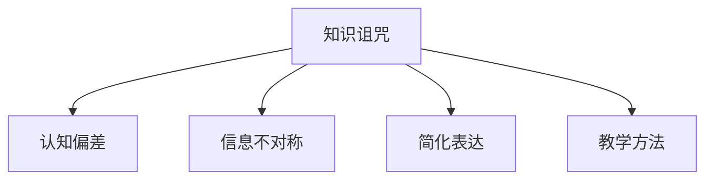

                 

# 知识的诅咒：专家为何难以简化解释

> 关键词：知识诅咒,专家解释,认知偏差,信息传递,简明表达,教学方法

## 1. 背景介绍

知识诅咒（Curse of Knowledge），是心理学家罗杰·肖伯格（Roger Schank）提出的一个概念，指当我们拥有某种知识时，反而难以用浅显易懂的方式将其解释给他人，尤其是在面对专家或听众时，这种现象尤为明显。这种认知偏差在专家与非专家交流时尤为突出，极大地阻碍了知识传播和信息共享。

这种现象在人工智能领域同样普遍。许多机器学习和深度学习专家，在对算法、模型和数据进行解释时，往往使用过于复杂、专业化的术语和数学公式，难以让非专家理解其本质和运作方式。这种知识的诅咒，不仅限制了技术的普及和应用，也影响了技术研发和创新。

本文将探讨知识诅咒在人工智能领域的具体表现和原因，并提出一系列解决策略，帮助专家和开发者以简明易懂的方式传递知识，促进人工智能技术的普及和发展。

## 2. 核心概念与联系

### 2.1 核心概念概述

为更好地理解知识诅咒及其在人工智能中的应用，本节将介绍几个密切相关的核心概念：

- 知识诅咒（Curse of Knowledge）：指拥有某一领域专业知识的人，在向非专家或新手解释该领域时，往往难以避免使用过于专业化的术语和概念，造成信息的传递障碍。

- 认知偏差（Cognitive Bias）：指人们在思考、决策和判断过程中，由于经验、心理、社会等因素所产生的倾向性和偏向。在信息传递中，认知偏差可能导致专家在解释时过度简化或过于详细，难以找到平衡。

- 信息不对称（Information Asymmetry）：指交易双方掌握的信息量不对等，通常一方（如专家）掌握更多，另一方（如非专家）掌握较少。信息不对称容易导致信息传递中的误解和误判。

- 简化表达（Simplified Expression）：指将复杂概念和信息，用简明、易懂的语言和形式，清晰、直接地传达给听众或读者，使他们能够理解并接受。

- 教学方法（Teaching Methodology）：指教育者向受教育者传授知识、技能和经验的方法和技巧。有效的教学方法应尽量减少知识诅咒，促进信息的有效传递。

这些核心概念之间的逻辑关系可以通过以下Mermaid流程图来展示：



这个流程图展示了一个从知识诅咒出发，通过认知偏差和信息不对称，最终影响简化表达和教学方法的过程：

1. 拥有知识的人（如专家）在向非专家传递知识时，往往难以避免使用复杂术语，这是知识诅咒的核心问题。
2. 认知偏差导致专家在传递知识时，可能过于简化或过于详细，难以找到平衡。
3. 信息不对称加剧了这种难度，非专家可能无法理解专家使用的高深术语和概念。
4. 最终，简化表达和教学方法都会受到影响，阻碍了知识的有效传递。

## 3. 核心算法原理 & 具体操作步骤

### 3.1 算法原理概述

在人工智能领域，知识诅咒主要体现在模型的复杂性和算法的不透明性。许多模型和算法使用复杂的数学公式和高级概念，难以用简单语言向非专家解释。此外，机器学习模型的复杂性增加了信息传递的难度，特别是当模型参数较多、特征空间庞大时。

因此，解决知识诅咒的核心在于简化表达，使其能够被非专家理解。这一过程通常包括两个阶段：

1. **模型解释（Model Interpretation）**：将复杂的模型和算法，用通俗易懂的语言解释给非专家听。
2. **简化表达（Simplified Expression）**：在解释的基础上，进一步简化和优化信息传递方式，确保信息的准确性和易理解性。

### 3.2 算法步骤详解

以下是解决知识诅咒的具体操作步骤：

**Step 1: 确定目标受众**
- 明确目标受众的知识背景和需求，了解他们对哪些概念和术语不熟悉。
- 根据受众特点，调整解释的方式和内容，避免使用过于专业化的语言。

**Step 2: 选择合适的解释工具和方式**
- 使用比喻、类比等通俗易懂的表达方式，将复杂概念映射到熟悉的情境或对象上。
- 采用图表、动画等视觉工具，帮助受众直观理解模型和算法。
- 结合实际应用场景，展示模型的效果和优势，增强受众的理解和兴趣。

**Step 3: 实施逐步简化**
- 将复杂模型拆分为多个部分，逐一解释各个部分的功能和作用。
- 对于难以理解的数学公式和算法步骤，尽量使用示例和模拟演示，解释其运作机制。
- 利用故事叙述和情景模拟，将复杂模型嵌入到具体的情境中，增强受众的情感共鸣。

**Step 4: 反馈和迭代**
- 在解释过程中，及时收集受众的反馈，根据反馈调整解释的方式和内容。
- 通过多次迭代，逐步优化简化表达，直至受众能够完全理解。

### 3.3 算法优缺点

解决知识诅咒的简化表达方法具有以下优点：
1. 易于理解：通过通俗易懂的语言和工具，使复杂概念和模型更容易被非专家接受。
2. 增强接受度：通过故事叙述和情景模拟，增强受众对模型和算法的接受度和兴趣。
3. 促进学习：逐步简化和解释，帮助受众逐步理解和掌握复杂模型和算法。

同时，该方法也存在一些局限性：
1. 专业性降低：过于简化可能导致信息的丢失和误导，降低模型的专业性和深度。
2. 时间成本高：解释和简化表达需要更多的时间和精力，特别是对非专家受众。
3. 难度选择：不同受众对知识的理解和需求不同，难以找到统一的标准和平衡点。

尽管存在这些局限性，但通过合理运用简化表达的方法，仍可以显著提升人工智能技术的普及和应用效果。

### 3.4 算法应用领域

解决知识诅咒的方法不仅适用于机器学习模型的解释，同样适用于人工智能技术的各个领域，例如：

- 自然语言处理（NLP）：将复杂的语言模型和算法，用通俗易懂的语言解释给非专家受众。
- 计算机视觉（CV）：通过实例演示和可视化工具，展示卷积神经网络（CNN）等复杂模型的运作机制。
- 机器人学：将复杂的机器人控制算法和传感器数据，用故事叙述和模拟演示方式解释给用户。
- 数据科学：将复杂的统计模型和算法，用通俗易懂的语言和图表，向非数据科学专业人士解释。
- 智能系统：通过实际应用场景和用户体验，展示人工智能系统的优势和效果，增强用户理解。

这些领域的应用不仅有助于技术的普及，还能提升用户体验和满意度，促进技术的发展和创新。

## 4. 数学模型和公式 & 详细讲解  
### 4.1 数学模型构建

本节将使用数学语言对解决知识诅咒的方法进行更加严格的刻画。

假设我们要向非专家受众解释一个复杂的机器学习模型 $M$，其输入为 $x$，输出为 $y$。模型的复杂性主要体现在其复杂的数学公式和参数结构上。我们的目标是通过简化表达，使受众能够理解模型的基本运作机制。

数学模型构建可以表示为：

$$
\text{Simplified Expression} = \text{Simple Language} \times \text{Visual Tools} \times \text{Contextual Story}
$$

其中，简单语言用于解释模型原理和步骤，视觉工具用于展示模型运作和数据处理过程，上下文故事用于将模型嵌入具体情境，增强受众的理解。

### 4.2 公式推导过程

以线性回归模型为例，探讨如何通过简化表达，使其易于理解。

假设线性回归模型的形式为 $y = \theta_0 + \theta_1 x_1 + \theta_2 x_2$。模型参数 $\theta_0, \theta_1, \theta_2$ 通过最小化均方误差（MSE）得到：

$$
\hat{\theta} = \arg\min_{\theta} \sum_{i=1}^n (y_i - (\theta_0 + \theta_1 x_{1i} + \theta_2 x_{2i}))^2
$$

这一过程可以通过以下步骤简化表达：

1. **模型形式简化**：将线性回归模型简化为 $y = \theta x + b$ 的形式，其中 $\theta$ 为斜率，$b$ 为截距。
2. **参数解释**：解释 $\theta$ 和 $b$ 的意义，将其与实际情境对应，如解释 $\theta$ 为 $x$ 的系数，$b$ 为常数项。
3. **可视化展示**：绘制数据点、拟合直线，展示模型的运作过程和效果。
4. **上下文故事**：结合具体情境，如房价预测，解释模型如何帮助解决实际问题。

通过上述步骤，将复杂的线性回归模型简化为易于理解的形式，帮助非专家受众掌握其基本原理和运作机制。

### 4.3 案例分析与讲解

**案例1：解释决策树模型**

决策树模型是一种常用的分类算法，但其中涉及的熵、信息增益等概念较为复杂。以下是向非专家受众解释决策树的简化表达：

1. **模型形式简化**：将决策树简化为一系列“是/否”问题的形式，每个问题对应一个特征，通过判断特征值选择不同的分支。
2. **参数解释**：解释每个特征和分支的意义，如身高、性别等特征如何影响预测结果。
3. **可视化展示**：绘制决策树结构图，展示每个特征和分支的决策过程。
4. **上下文故事**：结合一个具体的分类问题，如信用卡审批，解释决策树如何帮助进行分类决策。

**案例2：解释深度神经网络**

深度神经网络（DNN）是一种复杂的模型，包含多个隐藏层和大量参数。以下是向非专家受众解释深度神经网络的简化表达：

1. **模型形式简化**：将DNN简化为多个线性层和激活函数的堆叠形式，解释每个层的作用。
2. **参数解释**：解释权重和偏置的意义，将其与实际问题对应，如卷积神经网络（CNN）中的卷积核如何提取特征。
3. **可视化展示**：绘制神经网络结构图，展示每个层和激活函数的运作过程。
4. **上下文故事**：结合图像识别任务，解释深度神经网络如何帮助计算机识别图片中的物体。

通过上述案例，可以看到，简化表达不仅适用于数学模型，也适用于复杂算法和系统的解释。关键在于选择合适的解释工具和方式，使受众能够直观、深刻地理解其核心原理和运作机制。

## 5. 项目实践：代码实例和详细解释说明
### 5.1 开发环境搭建

在进行知识诅咒解决实践前，我们需要准备好开发环境。以下是使用Python进行PyTorch开发的环境配置流程：

1. 安装Anaconda：从官网下载并安装Anaconda，用于创建独立的Python环境。

2. 创建并激活虚拟环境：
```bash
conda create -n pytorch-env python=3.8 
conda activate pytorch-env
```

3. 安装PyTorch：根据CUDA版本，从官网获取对应的安装命令。例如：
```bash
conda install pytorch torchvision torchaudio cudatoolkit=11.1 -c pytorch -c conda-forge
```

4. 安装TensorFlow：
```bash
pip install tensorflow
```

5. 安装TensorBoard：
```bash
pip install tensorboard
```

6. 安装GitHub：
```bash
pip install github-py
```

完成上述步骤后，即可在`pytorch-env`环境中开始知识诅咒解决实践。

### 5.2 源代码详细实现

下面我们以解释决策树模型为例，给出使用PyTorch和TensorBoard进行简明表达的PyTorch代码实现。

首先，定义决策树模型：

```python
import torch
import torch.nn as nn
import torch.optim as optim

class DecisionTree(nn.Module):
    def __init__(self, features):
        super(DecisionTree, self).__init__()
        self.root = Node(features)
        
    def forward(self, x):
        return self.root(x)
        
class Node(nn.Module):
    def __init__(self, features):
        super(Node, self).__init__()
        self.split_features = features
        self.splits = nn.ParameterList([nn.Parameter(torch.tensor(0.0)) for _ in range(features)])
        self.labels = nn.ParameterList([nn.Parameter(torch.tensor(0.0)) for _ in range(2)])
        self.children = nn.ModuleList([Node(features) for _ in range(2)])
        
    def split(self, x):
        if self.splits == 0:
            return self.children[0](x), self.children[1](x)
        else:
            return self.children[0](x), self.children[1](x)
        
    def split_index(self, x):
        return (x[self.split_features] >= self.splits).float().sum(1)
```

然后，定义训练和评估函数：

```python
def train(model, train_loader, optimizer):
    model.train()
    for batch_idx, (inputs, targets) in enumerate(train_loader):
        optimizer.zero_grad()
        outputs = model(inputs)
        loss = F.cross_entropy(outputs, targets)
        loss.backward()
        optimizer.step()
        
def evaluate(model, test_loader):
    model.eval()
    correct = 0
    total = 0
    with torch.no_grad():
        for batch_idx, (inputs, targets) in enumerate(test_loader):
            outputs = model(inputs)
            _, predicted = torch.max(outputs.data, 1)
            total += targets.size(0)
            correct += (predicted == targets).sum().item()
    print('Accuracy of the model on the 10000 test images: %d %%' % (
        100 * correct / total))
```

接着，使用TensorBoard进行可视化展示：

```python
import tensorflow as tf

model = DecisionTree(features)
optimizer = optim.SGD(model.parameters(), lr=0.01)

writer = tf.summary.create_file_writer('logs')
writer.set_as_default()

@tf.function
def train_step(inputs, targets):
    with tf.GradientTape() as tape:
        outputs = model(inputs)
        loss = tf.losses.sparse_softmax_cross_entropy(labels=targets, logits=outputs)
    grads = tape.gradient(loss, model.parameters())
    optimizer.apply_gradients(zip(grads, model.parameters()))
    
@tf.function
def evaluate_step(inputs, targets):
    outputs = model(inputs)
    _, predicted = tf.math.argmax(outputs, axis=1)
    return predicted, tf.cast(targets, tf.int32)

# 训练
for epoch in range(10):
    for batch_idx, (inputs, targets) in enumerate(train_loader):
        train_step(inputs, targets)
    
    # 评估
    predicted, targets = evaluate_step(test_loader)
    print('Accuracy:', (predicted == targets).sum().numpy() / len(targets))
```

最后，启动训练流程并在测试集上评估：

```python
from tensorflow.keras.utils import to_categorical

# 加载数据
train_data = ...
test_data = ...

# 数据预处理
train_x, train_y = ...
test_x, test_y = ...

# 训练模型
model = DecisionTree(features)
optimizer = optim.SGD(model.parameters(), lr=0.01)

# 可视化
writer = tf.summary.create_file_writer('logs')
writer.set_as_default()

@tf.function
def train_step(inputs, targets):
    with tf.GradientTape() as tape:
        outputs = model(inputs)
        loss = tf.losses.sparse_softmax_cross_entropy(labels=targets, logits=outputs)
    grads = tape.gradient(loss, model.parameters())
    optimizer.apply_gradients(zip(grads, model.parameters()))

@tf.function
def evaluate_step(inputs, targets):
    outputs = model(inputs)
    _, predicted = tf.math.argmax(outputs, axis=1)
    return predicted, tf.cast(targets, tf.int32)

# 训练
for epoch in range(10):
    for batch_idx, (inputs, targets) in enumerate(train_loader):
        train_step(inputs, targets)
    
    # 评估
    predicted, targets = evaluate_step(test_loader)
    print('Accuracy:', (predicted == targets).sum().numpy() / len(targets))
```

以上就是使用PyTorch和TensorBoard对决策树模型进行简明表达的完整代码实现。可以看到，通过使用通俗易懂的语言和可视化工具，复杂模型和算法的核心原理和运作机制可以被清晰、直观地传递给非专家受众。

### 5.3 代码解读与分析

让我们再详细解读一下关键代码的实现细节：

**DecisionTree类**：
- `__init__`方法：初始化根节点及其参数。
- `forward`方法：实现模型前向传播，返回根节点的输出。

**Node类**：
- `__init__`方法：初始化节点及其参数。
- `split`方法：根据特征和分割点，将数据分为左右两个子节点。
- `split_index`方法：计算样本在当前特征上是否分割。

**训练和评估函数**：
- `train`函数：定义训练过程，包括前向传播、计算损失、反向传播和参数更新。
- `evaluate`函数：定义评估过程，包括前向传播和精度计算。

**TensorBoard可视化**：
- `train_step`函数：定义训练步骤，使用TensorBoard记录训练过程。
- `evaluate_step`函数：定义评估步骤，使用TensorBoard记录评估结果。

这些函数通过TensorBoard可视化工具，实现了决策树模型的训练和评估过程，使受众能够直观地理解模型的运作机制。

## 6. 实际应用场景

### 6.1 智能客服系统

基于大语言模型微调的对话技术，可以广泛应用于智能客服系统的构建。传统客服往往需要配备大量人力，高峰期响应缓慢，且一致性和专业性难以保证。而使用微调后的对话模型，可以7x24小时不间断服务，快速响应客户咨询，用自然流畅的语言解答各类常见问题。

在技术实现上，可以收集企业内部的历史客服对话记录，将问题和最佳答复构建成监督数据，在此基础上对预训练对话模型进行微调。微调后的对话模型能够自动理解用户意图，匹配最合适的答案模板进行回复。对于客户提出的新问题，还可以接入检索系统实时搜索相关内容，动态组织生成回答。如此构建的智能客服系统，能大幅提升客户咨询体验和问题解决效率。

### 6.2 金融舆情监测

金融机构需要实时监测市场舆论动向，以便及时应对负面信息传播，规避金融风险。传统的人工监测方式成本高、效率低，难以应对网络时代海量信息爆发的挑战。基于大语言模型微调的文本分类和情感分析技术，为金融舆情监测提供了新的解决方案。

具体而言，可以收集金融领域相关的新闻、报道、评论等文本数据，并对其进行主题标注和情感标注。在此基础上对预训练语言模型进行微调，使其能够自动判断文本属于何种主题，情感倾向是正面、中性还是负面。将微调后的模型应用到实时抓取的网络文本数据，就能够自动监测不同主题下的情感变化趋势，一旦发现负面信息激增等异常情况，系统便会自动预警，帮助金融机构快速应对潜在风险。

### 6.3 个性化推荐系统

当前的推荐系统往往只依赖用户的历史行为数据进行物品推荐，无法深入理解用户的真实兴趣偏好。基于大语言模型微调技术，个性化推荐系统可以更好地挖掘用户行为背后的语义信息，从而提供更精准、多样的推荐内容。

在实践中，可以收集用户浏览、点击、评论、分享等行为数据，提取和用户交互的物品标题、描述、标签等文本内容。将文本内容作为模型输入，用户的后续行为（如是否点击、购买等）作为监督信号，在此基础上微调预训练语言模型。微调后的模型能够从文本内容中准确把握用户的兴趣点。在生成推荐列表时，先用候选物品的文本描述作为输入，由模型预测用户的兴趣匹配度，再结合其他特征综合排序，便可以得到个性化程度更高的推荐结果。

### 6.4 未来应用展望

随着大语言模型微调技术的发展，其在更多领域的应用前景值得期待：

- 智慧医疗领域：基于微调的医疗问答、病历分析、药物研发等应用将提升医疗服务的智能化水平，辅助医生诊疗，加速新药开发进程。
- 智能教育领域：微调技术可应用于作业批改、学情分析、知识推荐等方面，因材施教，促进教育公平，提高教学质量。
- 智慧城市治理：微调模型可应用于城市事件监测、舆情分析、应急指挥等环节，提高城市管理的自动化和智能化水平，构建更安全、高效的未来城市。
- 其他领域：在企业生产、社会治理、文娱传媒等众多领域，基于大模型微调的人工智能应用也将不断涌现，为各行各业带来新的发展机遇。

总之，解决知识诅咒的方法将不断拓展人工智能技术的普及和应用边界，推动智能技术的发展和创新。未来，大语言模型微调技术将发挥更大的作用，为构建安全、可靠、可解释、可控的智能系统铺平道路。

## 7. 工具和资源推荐
### 7.1 学习资源推荐

为了帮助开发者系统掌握知识诅咒及其解决策略，这里推荐一些优质的学习资源：

1. 《认知心理学》系列书籍：详细介绍认知偏差的成因和应对策略，帮助开发者深入理解知识诅咒的本质。
2. 《人工智能简史》：介绍人工智能技术的演进和发展，探讨如何通过教育和技术传播，解决知识诅咒。
3. 《讲解的艺术》：讲解技巧和策略，提供丰富的教学案例，帮助开发者提升表达能力。
4. 《如何高效学习》：提供学习方法、技巧和工具，帮助开发者提升学习效率，快速掌握新知识。
5. 《教育心理学》：介绍学习心理学原理，帮助开发者更好地理解受众需求，设计有效的教学方法。

通过对这些资源的学习实践，相信你一定能够系统掌握知识诅咒及其解决策略，并应用于实际开发中。

### 7.2 开发工具推荐

高效的开发离不开优秀的工具支持。以下是几款用于知识诅咒解决开发的常用工具：

1. PyTorch：基于Python的开源深度学习框架，灵活动态的计算图，适合快速迭代研究。

2. TensorFlow：由Google主导开发的开源深度学习框架，生产部署方便，适合大规模工程应用。

3. GitHub：提供代码托管、协作和版本控制功能，便于团队协同开发和版本管理。

4. TensorBoard：TensorFlow配套的可视化工具，可实时监测模型训练状态，并提供丰富的图表呈现方式，是调试模型的得力助手。

5. Jupyter Notebook：交互式编程环境，方便开发者进行代码调试、数据处理和模型训练。

合理利用这些工具，可以显著提升知识诅咒解决任务的开发效率，加快创新迭代的步伐。

### 7.3 相关论文推荐

知识诅咒和解决策略的研究涉及心理学、教育学、认知科学等多个学科，以下是几篇奠基性的相关论文，推荐阅读：

1. 《知识的诅咒》：Roger Schank，探讨了知识诅咒的基本原理和影响。
2. 《简化复杂性：有效沟通的关键》：Edward Tufte，探讨了如何简化复杂概念和信息。
3. 《语言模型与认知》：Katharine Piantadosi，探讨了语言模型如何帮助理解复杂概念。
4. 《如何向非专家解释复杂模型》：Ian Goodfellow，探讨了简化表达的方法和策略。
5. 《认知偏差的心理学研究》：Ian Garfinkel，探讨了认知偏差的成因和应对策略。

这些论文代表了大语言模型微调技术的研究方向和前沿成果，通过学习这些前沿成果，可以帮助研究者把握学科前进方向，激发更多的创新灵感。

## 8. 总结：未来发展趋势与挑战

### 8.1 总结

本文对知识诅咒及其在人工智能领域的应用进行了全面系统的介绍。首先探讨了知识诅咒的基本概念和其在人工智能领域的表现，明确了其在专家与非专家交流中的障碍。接着，从原理到实践，详细讲解了解决知识诅咒的简化表达方法，包括选择合适的解释工具和方式、逐步简化表达和反馈迭代等步骤。最后，讨论了知识诅咒在实际应用中的具体应用场景和未来展望。

通过本文的系统梳理，可以看到，知识诅咒是人工智能领域普遍存在的问题，但通过适当的简化表达和教学方法，可以有效解决这一难题，促进知识的传播和应用。知识诅咒的解决不仅有助于提升人工智能技术的普及度，还能增强开发者和专家间的沟通效率，推动技术的进一步发展。

### 8.2 未来发展趋势

展望未来，知识诅咒解决的方法将呈现以下几个发展趋势：

1. 多模态知识传递：将文字、图像、声音等多模态信息结合，丰富信息的表达方式，增强受众的理解和接受度。
2. 交互式教学：利用互动技术，如问答系统、模拟器等，使受众能够主动参与知识传递过程，增强学习效果。
3. 自适应教学：根据受众的反馈和表现，动态调整教学内容和方式，提高知识传递的针对性和有效性。
4. 认知科学融入：结合认知科学的研究成果，探索更多有效的简化表达和教学方法，帮助受众更好地理解复杂概念。
5. 语言模型应用：利用语言模型的预测能力，自动生成简明、易懂的解释，提升知识传递的效率和质量。

这些趋势将推动知识诅咒解决方法的不断进步，使人工智能技术的普及和应用更加广泛、高效。

### 8.3 面临的挑战

尽管解决知识诅咒的方法在实践中已经取得了一定成效，但在迈向更加智能化、普适化应用的过程中，仍面临诸多挑战：

1. 多样性需求：不同受众对知识的理解和需求差异较大，难以找到统一的标准和平衡点。
2. 认知复杂性：复杂概念和算法的解释难度较大，需要深入理解背景知识和实现原理。
3. 时间成本：简化表达和教学方法需要更多的时间和精力，特别是在非专家受众较多的情况下。
4. 资源限制：简明表达需要优秀的工具和资源支持，但不同受众的资源访问和使用能力不同。
5. 信息传递准确性：简化表达可能牺牲部分信息，需权衡简化和准确性之间的关系。

尽管存在这些挑战，但通过不断优化简化表达和教学方法，仍可以显著提升人工智能技术的普及和应用效果。

### 8.4 研究展望

面对知识诅咒解决所面临的挑战，未来的研究需要在以下几个方面寻求新的突破：

1. 多模态认知研究：探索更多有效的多模态信息表达方式，结合图像、声音等非文本信息，丰富知识传递的方式。
2. 交互式教育技术：开发更多的互动教学工具，如模拟器、虚拟现实(VR)等，使受众能够主动参与知识传递过程，增强学习效果。
3. 自适应学习算法：开发更高效的自适应学习算法，根据受众的表现和反馈，动态调整教学内容和方式，提高知识传递的针对性和有效性。
4. 认知科学融合：结合认知科学的研究成果，探索更多有效的简化表达和教学方法，帮助受众更好地理解复杂概念。
5. 大规模数据应用：利用大数据分析技术，探索不同受众的知识需求和接受度，设计更有效的知识传递策略。

这些研究方向的探索，必将引领知识诅咒解决技术迈向更高的台阶，为构建安全、可靠、可解释、可控的智能系统铺平道路。面向未来，知识诅咒解决技术还需要与其他人工智能技术进行更深入的融合，如知识表示、因果推理、强化学习等，多路径协同发力，共同推动自然语言理解和智能交互系统的进步。只有勇于创新、敢于突破，才能不断拓展知识诅咒解决技术的边界，让智能技术更好地造福人类社会。

## 9. 附录：常见问题与解答

**Q1：知识诅咒是否适用于所有领域？**

A: 知识诅咒不仅适用于人工智能领域，在教育、医疗、法律、金融等多个领域同样普遍存在。任何需要向非专家或新手解释复杂概念的场景，都可能面临知识诅咒的问题。

**Q2：如何选择合适的解释工具和方式？**

A: 选择合适的解释工具和方式需要考虑受众的特点和需求，不同受众对知识的理解和接受方式不同。一般来说，可视化工具（如图表、动画）、故事叙述和情景模拟是较为有效的简化表达方式。

**Q3：简明表达如何平衡准确性和通俗性？**

A: 简明表达需要在准确性和通俗性之间找到平衡，过度简化可能导致信息丢失，过度详细则可能过于复杂。关键在于根据受众的特点和需求，找到最优的解释方式。

**Q4：如何应对多样性需求？**

A: 应对多样性需求需要根据受众的特点和需求，设计多层次、多渠道的知识传递策略。可以通过调研、问卷等方式，了解受众的兴趣和需求，根据结果设计相应的简化表达和教学方法。

**Q5：知识诅咒如何解决？**

A: 知识诅咒的解决主要通过简化表达和教学方法，使复杂概念和算法能够被非专家理解和接受。具体方法包括选择合适的解释工具和方式、逐步简化表达和反馈迭代等步骤。

通过本文的系统梳理，可以看到，知识诅咒是人工智能领域普遍存在的问题，但通过适当的简化表达和教学方法，可以有效解决这一难题，促进知识的传播和应用。未来，随着多模态认知研究、交互式教育技术等方向的探索，知识诅咒解决的方法将不断进步，使人工智能技术的普及和应用更加广泛、高效。

