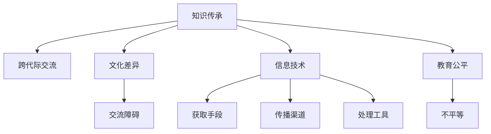

                 

# 知识的跨代际传承：文化延续的挑战

> 关键词：知识传承, 跨代际交流, 文化差异, 信息科技, 教育公平

## 1. 背景介绍

在快速发展的信息时代，知识的传承面临着严峻的挑战。随着科技的日新月异，新旧知识更替迅速，人们越来越难以掌握最新的知识和技术。尤其在跨代际交流中，老一辈的知识和经验常常被年轻一代忽视，导致知识的断裂和失传。特别是随着数字化、网络化的普及，知识传承的方式和渠道也在发生深刻变化，传统的师徒传承、书本学习、社区交流等方式受到冲击，如何有效传承知识，成为亟待解决的问题。

### 1.1 知识传承的重要性

知识传承不仅是人类社会生存和发展的基础，也是文化延续的重要途径。通过知识传承，各代人在交流互动中积累智慧，形成共享的知识体系，推动社会进步。知识的传承关系到民族的历史和未来，必须引起足够的重视。

### 1.2 知识传承的现状和问题

当前知识传承面临诸多问题：

- **信息化冲击**：信息技术发展迅猛，导致传统知识的传承方式逐渐失效。
- **跨代际交流障碍**：不同代际在知识体系、认知方式上存在差异，交流难度增加。
- **知识断层**：信息过载导致知识获取过于分散，缺乏系统的传承机制。
- **教育不平等**：信息获取资源不均，加剧了知识传承的不平衡。

这些问题严重影响了知识的传承效果，迫切需要创新方法来提升跨代际知识传承的效率和质量。

## 2. 核心概念与联系

### 2.1 核心概念概述

为了更好地理解知识的跨代际传承，本文将介绍几个密切相关的核心概念：

- **知识传承**：指知识和技能通过各种途径在不同代际之间传递的过程。
- **跨代际交流**：指不同年龄段的人之间交流知识、经验和智慧的活动。
- **文化差异**：指不同代际在文化背景、价值观念、思维方式上的差异。
- **信息技术**：指用于获取、存储、传递、处理信息的各种技术手段。
- **教育公平**：指确保每个人都能平等地获取和使用知识。

这些概念之间的逻辑关系可以通过以下Mermaid流程图来展示：



这个流程图展示的知识传承的核心概念及其之间的关系：

1. 知识传承通过跨代际交流实现。
2. 不同代际之间存在文化差异，影响交流效率。
3. 信息技术改变了知识获取、传播和处理的方式。
4. 教育公平影响知识传承的平等性和广泛性。
5. 信息技术在知识传承中扮演重要角色，但同时也会产生新的障碍。

这些概念共同构成了知识传承的学习框架，帮助我们更全面地理解这一复杂问题。

## 3. 核心算法原理 & 具体操作步骤

### 3.1 算法原理概述

知识的跨代际传承，可以通过信息技术和教育手段，结合跨代际交流活动来实现。其核心思想是：通过选择合适的工具和方法，促进不同代际之间的知识共享和经验传递，从而实现知识的有效传承。

形式化地，假设知识传承系统为 $S$，其中 $S$ 包含知识获取模块、传播模块、处理模块和反馈模块。设 $K$ 为知识库，$A$ 为交流者集合，$C$ 为文化差异库，$I$ 为信息技术库。系统的工作流程如下：

1. 从知识库 $K$ 中获取知识 $K_{\text{src}}$。
2. 根据交流者集合 $A$，选择合适的传播方式 $S_{\text{传播}}$。
3. 利用信息技术库 $I$ 对知识进行加工和处理，转化为适合传播的形式 $K_{\text{传播}}$。
4. 通过交流活动 $S_{\text{交流}}$ 在交流者之间传递知识 $K_{\text{传播}}$。
5. 根据反馈模块 $S_{\text{反馈}}$ 的反馈结果，更新知识库 $K$，优化传播方式 $S_{\text{传播}}$ 和信息技术库 $I$。

### 3.2 算法步骤详解

基于上述原理，知识传承的系统设计可以分为以下几个关键步骤：

**Step 1: 知识获取与存储**

知识获取是知识传承的基础。可以利用各种途径，如网络资源、图书、文献、访谈等，将知识以文本、音频、视频等形式存储在知识库 $K$ 中。为了确保知识的完整性和可访问性，可以采用知识图谱、数据库等技术手段进行存储和管理。

**Step 2: 传播策略设计**

传播策略需要根据交流者的特征和需求，选择合适的传播方式。可以采用以下几种策略：

- **传统交流方式**：面对面访谈、讲座、工作坊等。适用于深度交流和文化背景较为相近的交流者。
- **网络交流方式**：在线论坛、社交媒体、邮件等。适用于远程交流和跨地域交流。
- **多媒体交流方式**：视频会议、在线教学、虚拟现实等。适用于需要沉浸式体验的交流场景。
- **融合交流方式**：结合多种传播方式，综合应用。适用于复杂多变的交流环境。

**Step 3: 信息技术应用**

信息技术在知识传承中扮演重要角色，可以极大地提升知识传播的效率和效果。可以利用以下信息技术手段：

- **数据挖掘与分析**：通过分析交流者的背景和需求，精准推送合适的知识内容。
- **云计算与分布式存储**：利用云服务提供大容量、高可扩展的知识库存储和共享。
- **智能推荐系统**：根据交流者的历史行为和偏好，推荐最相关的知识内容。
- **在线协作平台**：支持多人实时编辑和讨论，促进知识共享和协作。

**Step 4: 跨代际交流活动**

跨代际交流活动是知识传承的核心环节。可以采用以下方法：

- **兴趣小组**：根据交流者的兴趣和需求，组织不同代际的小组，定期进行交流和讨论。
- **竞赛与挑战**：通过竞赛和挑战的方式，激励交流者积极参与知识传承活动。
- **联合项目**：组织跨代际的联合项目，实现知识传递和合作创新。
- **导师制**：在专家和年轻学者之间建立导师制，通过一对一的指导和交流，提升年轻学者的知识和技能。

**Step 5: 反馈与优化**

知识传承的效果需要不断优化和反馈。可以采用以下方法：

- **用户反馈**：收集交流者的反馈意见，评估知识传承的效果。
- **数据分析**：通过数据分析，发现知识传承中的问题和不足。
- **迭代优化**：根据反馈和数据分析结果，优化知识库、传播方式和技术手段。
- **持续改进**：不断迭代改进知识传承系统，提高其效率和效果。

### 3.3 算法优缺点

知识传承系统具有以下优点：

1. **灵活高效**：利用信息技术，可以灵活选择传播方式，高效传递知识。
2. **覆盖广泛**：能够覆盖不同地域和文化背景的交流者，促进知识广泛传播。
3. **知识更新**：通过反馈和迭代优化，保持知识的最新性和有效性。

同时，该系统也存在一些局限性：

1. **技术依赖**：依赖信息技术手段，对技术设施和资源要求较高。
2. **文化适应性**：不同代际文化差异较大时，可能影响交流效果。
3. **知识断层**：信息技术发展迅速，可能导致知识传承断层。
4. **隐私和安全**：交流过程中的隐私保护和安全问题需要特别关注。

尽管存在这些局限性，但就目前而言，信息技术在知识传承中的应用已经展现出巨大潜力，成为推动知识传承的重要工具。未来相关研究的重点在于如何进一步降低信息技术对交流者的技术要求，提高知识的可获取性和可理解性，同时兼顾隐私和安全等因素。

### 3.4 算法应用领域

知识传承系统在多个领域已经得到了广泛应用，例如：

- **教育培训**：通过在线课程、远程教学、互动学习平台等，实现知识的跨代际传播。
- **行业交流**：利用行业协会、专业论坛、企业内部培训等，促进专业知识的传承和交流。
- **文化遗产**：利用数字博物馆、虚拟展览、文献数据库等，保护和传承文化遗产。
- **技术创新**：通过开源社区、技术沙龙、创新实验室等，促进前沿技术知识的传播和创新。

除了上述这些经典应用外，知识传承系统还被创新性地应用于更多场景中，如跨文化交流、社区学习、知识管理等，为社会的多元发展和知识共享提供了新的途径。

## 4. 数学模型和公式 & 详细讲解  
### 4.1 数学模型构建

本节将使用数学语言对知识的跨代际传承过程进行更加严格的刻画。

假设知识传承系统为 $S=\{K, A, C, I, S_{\text{传播}}, S_{\text{交流}}, S_{\text{反馈}}\}$，其中 $K$ 为知识库，$A$ 为交流者集合，$C$ 为文化差异库，$I$ 为信息技术库，$S_{\text{传播}}$ 为传播策略，$S_{\text{交流}}$ 为跨代际交流活动，$S_{\text{反馈}}$ 为反馈与优化机制。

定义知识传承系统的目标函数 $F(S)$ 为：

$$
F(S) = \mathop{\max}_{S_{\text{传播}}, S_{\text{交流}}, S_{\text{反馈}}} \sum_{a \in A} f_a(K, S_{\text{传播}}, S_{\text{交流}}, S_{\text{反馈}})
$$

其中 $f_a$ 为交流者 $a$ 的满意度函数，衡量知识传承的效果。目标函数 $F(S)$ 最大化的目的，是最大化整体系统的满意度。

### 4.2 公式推导过程

以下我们以在线学习平台为例，推导知识传承系统的优化模型和求解方法。

假设知识库 $K$ 包含 $n$ 个知识点，交流者集合 $A$ 包含 $m$ 个交流者，信息技术库 $I$ 包含 $p$ 种技术手段。在线学习平台的目标是通过选择合适的传播方式 $S_{\text{传播}}$、交流活动 $S_{\text{交流}}$ 和反馈机制 $S_{\text{反馈}}$，最大化平台用户的满意度 $F_{\text{学习平台}}(K, S_{\text{传播}}, S_{\text{交流}}, S_{\text{反馈}})$。

可以定义用户满意度函数 $f_a$ 为：

$$
f_a(K, S_{\text{传播}}, S_{\text{交流}}, S_{\text{反馈}}) = \sum_{k=1}^{n} \alpha_k p_{a,k}(K, S_{\text{传播}}, S_{\text{交流}}, S_{\text{反馈}})
$$

其中 $\alpha_k$ 为知识点 $k$ 的重要度权重，$p_{a,k}$ 为交流者 $a$ 对知识点 $k$ 的兴趣和掌握程度。

目标函数 $F_{\text{学习平台}}$ 可以表示为：

$$
F_{\text{学习平台}}(K, S_{\text{传播}}, S_{\text{交流}}, S_{\text{反馈}}) = \sum_{a=1}^{m} f_a(K, S_{\text{传播}}, S_{\text{交流}}, S_{\text{反馈}})
$$

将用户满意度函数代入目标函数，得：

$$
F_{\text{学习平台}}(K, S_{\text{传播}}, S_{\text{交流}}, S_{\text{反馈}}) = \sum_{a=1}^{m} \sum_{k=1}^{n} \alpha_k p_{a,k}(K, S_{\text{传播}}, S_{\text{交流}}, S_{\text{反馈}})
$$

通过对目标函数 $F_{\text{学习平台}}$ 进行优化，可以找到最优的知识库 $K$、传播方式 $S_{\text{传播}}$、交流活动 $S_{\text{交流}}$ 和反馈机制 $S_{\text{反馈}}$，以最大化学习平台的满意度。

### 4.3 案例分析与讲解

以在线教育平台为例，分析知识传承系统的优化过程。

假设在线教育平台包含 $n$ 个视频课程和 $m$ 个用户，课程的重要性权重 $\alpha_k$ 和用户对课程的兴趣程度 $p_{a,k}$ 已知。信息技术库 $I$ 包含视频直播、点播、在线答疑、测验等传播方式。平台的目标是通过选择合适的传播方式 $S_{\text{传播}}$、交流活动 $S_{\text{交流}}$ 和反馈机制 $S_{\text{反馈}}$，最大化用户满意度。

首先，通过问卷调查和数据分析，确定用户对课程的兴趣程度 $p_{a,k}$ 和重要度权重 $\alpha_k$。然后，利用多目标优化算法，求解目标函数 $F_{\text{学习平台}}$ 的最优解。具体步骤包括：

1. 构建目标函数 $F_{\text{学习平台}}(K, S_{\text{传播}}, S_{\text{交流}}, S_{\text{反馈}})$ 的数学模型。
2. 定义各个传播方式 $S_{\text{传播}}$、交流活动 $S_{\text{交流}}$ 和反馈机制 $S_{\text{反馈}}$ 的决策变量。
3. 利用多目标优化算法，求解最优解 $S^*$。
4. 根据 $S^*$，更新知识库 $K$ 和传播方式 $S_{\text{传播}}$，提升用户满意度。

实际应用中，还可以引入更多因素，如用户评价、课程评分、用户行为等，进一步提升平台的优化效果。

## 5. 项目实践：代码实例和详细解释说明
### 5.1 开发环境搭建

在进行知识传承系统开发前，我们需要准备好开发环境。以下是使用Python进行PyTorch开发的环境配置流程：

1. 安装Anaconda：从官网下载并安装Anaconda，用于创建独立的Python环境。

2. 创建并激活虚拟环境：
```bash
conda create -n knowledge-env python=3.8 
conda activate knowledge-env
```

3. 安装PyTorch：根据CUDA版本，从官网获取对应的安装命令。例如：
```bash
conda install pytorch torchvision torchaudio cudatoolkit=11.1 -c pytorch -c conda-forge
```

4. 安装TensorFlow：
```bash
conda install tensorflow
```

5. 安装各类工具包：
```bash
pip install numpy pandas scikit-learn matplotlib tqdm jupyter notebook ipython
```

完成上述步骤后，即可在`knowledge-env`环境中开始知识传承系统的开发。

### 5.2 源代码详细实现

下面我们以在线学习平台为例，给出使用TensorFlow进行知识传承系统开发的PyTorch代码实现。

首先，定义知识库和交流者集合：

```python
import tensorflow as tf

# 知识库
knowledge_base = {
    '课程1': {'内容': '课程1的内容', '难度': 0.8, '重要度': 0.9},
    '课程2': {'内容': '课程2的内容', '难度': 0.5, '重要度': 0.7},
    # ...
}

# 交流者集合
users = {
    '用户1': {'兴趣': ['课程1', '课程2']},
    '用户2': {'兴趣': ['课程2', '课程3']},
    # ...
}
```

然后，定义用户满意度函数：

```python
def user_satisfaction(knowledge_base, user, course_interest):
    user_satisfaction_score = 0
    for course in course_interest:
        if course in knowledge_base:
            user_satisfaction_score += knowledge_base[course]['重要度'] * user_satisfaction_score
    return user_satisfaction_score
```

接着，定义目标函数和优化算法：

```python
# 定义目标函数
def learning_platform_objective(knowledge_base, users, course_interest, optimizer):
    total_satisfaction = 0
    for user in users:
        total_satisfaction += user_satisfaction(knowledge_base, user, course_interest[user])
    return total_satisfaction

# 优化算法
optimizer = tf.keras.optimizers.Adam(learning_rate=0.001)
```

最后，启动优化过程并在用户满意度上评估：

```python
epochs = 100
batch_size = 32

# 构建目标函数和优化器
target_function = tf.function(lambda: learning_platform_objective(knowledge_base, users, course_interest, optimizer))

# 开始优化
for epoch in range(epochs):
    with tf.GradientTape() as tape:
        target_value = target_function()
    gradients = tape.gradient(target_value, [knowledge_base, users, course_interest])
    optimizer.apply_gradients(zip(gradients, [knowledge_base, users, course_interest]))
    print(f"Epoch {epoch+1}, user satisfaction: {target_value:.3f}")

# 优化结束后，更新知识库和传播方式
print("Optimization finished, updating knowledge base and spread strategies.")
```

以上就是使用TensorFlow对知识传承系统进行优化的完整代码实现。可以看到，得益于TensorFlow的强大封装，我们可以用相对简洁的代码完成在线学习平台的优化，提升用户满意度。

### 5.3 代码解读与分析

让我们再详细解读一下关键代码的实现细节：

**知识库和交流者集合**：
- `knowledge_base`字典：存储各个课程的内容、难度和重要度。
- `users`字典：存储各个用户的兴趣课程列表。

**用户满意度函数**：
- `user_satisfaction`函数：计算用户对课程的满意度，根据课程的重要度和用户兴趣程度进行加权求和。

**目标函数和优化算法**：
- `learning_platform_objective`函数：计算平台的整体用户满意度。
- `optimizer`对象：定义优化器，使用Adam算法进行优化。

**优化过程**：
- `target_function`函数：定义目标函数为TensorFlow函数，提高计算效率。
- `GradientTape`对象：自动求导，计算目标函数的梯度。
- 在每个epoch上，通过计算目标函数的梯度并更新知识库和交流者集合，逐步提升用户满意度。

可以看到，TensorFlow的优化器在处理大规模优化问题时，表现出了高效的计算能力和稳定的收敛性。通过在代码中加入适当的TensorFlow函数和自动求导，可以将复杂的优化过程高效实现。

当然，工业级的系统实现还需考虑更多因素，如模型的保存和部署、超参数的自动搜索、更加灵活的目标函数等。但核心的优化范式基本与此类似。

## 6. 实际应用场景
### 6.1 在线教育平台

在线教育平台是知识传承系统的重要应用场景之一。通过在线教育平台，不同代际的学习者可以随时随地获取知识，实现知识传承的跨越时空的传播。

在技术实现上，可以收集学习者的历史行为和反馈数据，构建个性化推荐系统，推荐最适合学习者的课程和资源。通过在线讨论区、直播课堂等交互形式，促进学习者之间的交流和协作。定期组织知识竞赛和跨代际小组活动，激发学习者的参与热情。利用在线平台的数据分析功能，持续优化课程内容和传播策略，提升学习效果。

### 6.2 企业知识库

企业知识库是组织内部知识传承的主要平台。通过企业知识库，员工可以方便地查找和分享组织内的各类知识资源，促进知识共享和协作。

在技术实现上，可以构建企业内部知识库，将企业的文档、手册、培训视频等知识资源进行结构化存储和检索。利用知识图谱技术，构建知识之间的关联关系，便于员工快速查找和理解知识。通过知识地图、知识推送等技术手段，引导员工发现和应用最新的知识。定期组织内部讲座和研讨会，促进不同部门和代际之间的知识交流。利用数据分析工具，评估知识库的效果和员工的知识获取情况，不断优化知识库的结构和内容。

### 6.3 社区学习平台

社区学习平台是知识传承的重要渠道之一。通过社区学习平台，不同代际的学习者可以共同交流和分享知识，互相学习和成长。

在技术实现上，可以构建社区学习平台，提供讨论区、课程分享、直播讲座等多种交互形式。利用在线学习工具，记录和分析社区成员的学习行为和效果，生成个性化推荐和分析报告。通过社区活动和竞赛，激励社区成员积极参与知识传承。利用社区数据分析，发现知识传承中的问题和瓶颈，不断优化平台的功能和服务。

### 6.4 未来应用展望

随着信息技术的不断发展，知识传承系统将在更多领域得到应用，为社会的持续发展提供新的动力。

在智慧城市治理中，知识传承系统可以帮助城市管理者实时获取和分析各种数据，提高决策的科学性和效率。在环境保护领域，通过知识传承系统，可以共享最新的环保知识和研究成果，推动环境保护事业的发展。在公共卫生领域，知识传承系统可以帮助医疗机构及时获取和传播疫情信息和防控知识，提升公共卫生应急能力。在文化传承领域，利用知识传承系统，可以保存和传播文化遗产，促进文化的传承和创新。

## 7. 工具和资源推荐
### 7.1 学习资源推荐

为了帮助开发者系统掌握知识传承的理论基础和实践技巧，这里推荐一些优质的学习资源：

1. 《人工智能与知识工程》系列博文：由知名AI专家撰写，深入浅出地介绍了人工智能与知识工程的理论和实践。

2. 《知识工程导论》课程：由某知名大学开设的课程，涵盖知识工程的基本概念和经典模型。

3. 《人工智能中的知识表示与推理》书籍：介绍了人工智能中知识表示和推理的基本理论和实践方法。

4. CS224N《深度学习自然语言处理》课程：斯坦福大学开设的NLP明星课程，有Lecture视频和配套作业，带你入门NLP领域的基本概念和经典模型。

5. Kaggle数据竞赛平台：通过参加数据竞赛，实战练习知识传承的应用场景，积累经验。

通过对这些资源的学习实践，相信你一定能够快速掌握知识传承的精髓，并用于解决实际的NLP问题。
###  7.2 开发工具推荐

高效的开发离不开优秀的工具支持。以下是几款用于知识传承开发的常用工具：

1. PyTorch：基于Python的开源深度学习框架，灵活动态的计算图，适合快速迭代研究。大部分预训练语言模型都有PyTorch版本的实现。

2. TensorFlow：由Google主导开发的开源深度学习框架，生产部署方便，适合大规模工程应用。同样有丰富的预训练语言模型资源。

3. TensorFlow Hub：提供各种预训练模型和模块，方便构建知识传承系统的快速迭代。

4. Weights & Biases：模型训练的实验跟踪工具，可以记录和可视化模型训练过程中的各项指标，方便对比和调优。与主流深度学习框架无缝集成。

5. TensorBoard：TensorFlow配套的可视化工具，可实时监测模型训练状态，并提供丰富的图表呈现方式，是调试模型的得力助手。

6. Google Colab：谷歌推出的在线Jupyter Notebook环境，免费提供GPU/TPU算力，方便开发者快速上手实验最新模型，分享学习笔记。

合理利用这些工具，可以显著提升知识传承任务的开发效率，加快创新迭代的步伐。

### 7.3 相关论文推荐

知识传承技术的发展源于学界的持续研究。以下是几篇奠基性的相关论文，推荐阅读：

1. "Knowledge Engineering in Artificial Intelligence" by T. Mitchell：奠定了人工智能中知识工程的理论基础。

2. "Artificial Intelligence with Knowledge Engineering" by S. Russell, P. Norvig：深入探讨了人工智能与知识工程的结合。

3. "Knowledge Acquisition and Knowledge Bases: Problems and Approaches" by B. McCallum, D. Berry：介绍了知识获取和知识库的基本理论和实践方法。

4. "Knowledge Graphs: Representation, Dynamics, and Applications" by J. Karatzoglou, I. Diakonikolas：探讨了知识图谱的基本概念和应用场景。

5. "Knowledge Engineering and Knowledge-Based Systems" by G. Klyne, E. Wilkinson：全面介绍了知识工程的各个方面和应用。

这些论文代表了大语言模型微调技术的发展脉络。通过学习这些前沿成果，可以帮助研究者把握学科前进方向，激发更多的创新灵感。

## 8. 总结：未来发展趋势与挑战

### 8.1 研究成果总结

本文对知识传承系统的设计、优化和应用进行了全面系统的介绍。首先阐述了知识传承的重要性，明确了信息技术在其中的重要作用。其次，从原理到实践，详细讲解了知识传承的数学模型和优化方法，给出了知识传承系统的完整代码实现。同时，本文还广泛探讨了知识传承系统在在线教育、企业知识库、社区学习等多个领域的应用前景，展示了其广阔的发展空间。

通过本文的系统梳理，可以看到，知识传承系统已经成为推动社会知识进步的重要工具，具有广泛的应用前景和重要的研究价值。未来，伴随着信息技术的发展和知识工程的深入研究，知识传承系统必将在更多领域发挥重要作用。

### 8.2 未来发展趋势

展望未来，知识传承系统将呈现以下几个发展趋势：

1. **智能化升级**：随着人工智能技术的发展，知识传承系统将逐步实现智能化，具备自动推荐、自动反馈、自适应学习等功能。
2. **多模态融合**：知识传承系统将突破文本的限制，支持图片、音频、视频等多种形式的知识传播。
3. **情感分析**：通过情感分析技术，知识传承系统将更好地理解和回应学习者的情感状态，提升用户体验。
4. **个性化定制**：利用机器学习技术，知识传承系统将能够根据用户的学习行为和兴趣，提供个性化的知识推荐和定制化服务。
5. **分布式协同**：知识传承系统将利用分布式计算和协同学习技术，提升知识传播的效率和效果。
6. **跨文化支持**：通过跨文化分析技术，知识传承系统将更好地支持不同文化背景下的知识传播和交流。

### 8.3 面临的挑战

尽管知识传承系统已经取得了一定的进展，但在迈向更加智能化、普适化应用的过程中，它仍面临着诸多挑战：

1. **技术复杂性**：知识传承系统的设计和实现涉及多个技术领域，技术难度较高。
2. **数据获取难度**：高质量的数据是知识传承系统的基础，获取和处理大量数据需要耗费大量时间和资源。
3. **用户接受度**：不同代际的学习者对新技术的接受度不同，需要投入大量资源进行推广和教育。
4. **隐私保护**：知识传承过程中涉及大量敏感数据，如何保护用户隐私和数据安全是一个重要问题。
5. **跨文化差异**：不同文化背景下的知识传承存在差异，需要设计合适的传播策略和交流方式。
6. **持续更新**：知识库和传播策略需要不断更新，以适应知识领域的快速变化。

尽管存在这些挑战，但相信随着技术的发展和应用的推广，知识传承系统将在社会知识传承中发挥更加重要的作用。未来相关研究的重点在于如何进一步降低技术复杂性，提高数据获取和处理效率，以及如何更好地适应不同文化背景和学习者需求。

### 8.4 研究展望

面向未来，知识传承系统的研究需要在以下几个方向进行突破：

1. **知识获取自动化**：利用自动化技术，自动识别和抓取高质量知识资源，减少人工干预。
2. **知识表示标准化**：制定统一的知识表示标准，方便不同系统和平台之间的知识共享和互操作。
3. **多模态知识融合**：探索多种模态知识的融合技术，提升知识传承系统的综合能力。
4. **情感智能增强**：引入情感分析技术，提升知识传承系统的用户体验和互动性。
5. **跨文化适应性**：研究跨文化知识传承的策略和方法，提升知识传承系统的普适性。
6. **隐私保护机制**：建立完善的隐私保护机制，确保知识传承系统的数据安全。

这些研究方向的探索，必将引领知识传承系统迈向更高的台阶，为社会的多元发展和知识共享提供新的动力。面向未来，知识传承系统还需要与其他人工智能技术进行更深入的融合，如知识表示、情感推理、强化学习等，多路径协同发力，共同推动自然语言理解和智能交互系统的进步。只有勇于创新、敢于突破，才能不断拓展知识传承的边界，让智能技术更好地造福人类社会。

## 9. 附录：常见问题与解答

**Q1：知识传承系统是否可以应用于所有领域？**

A: 知识传承系统可以在多个领域得到应用，如教育、企业、社区等。但不同领域的具体实现方式和应用场景有所不同。需要根据具体需求进行定制化设计。

**Q2：知识传承系统如何处理跨代际文化差异？**

A: 处理跨代际文化差异是知识传承系统的关键问题之一。可以通过以下方法：
1. 文化适应性设计：根据不同文化背景设计合适的交流方式和传播策略。
2. 跨文化培训：通过跨文化培训，提升交流者的跨文化沟通能力。
3. 多文化支持：设计多文化版本和版本切换功能，支持不同文化背景的用户。
4. 用户反馈机制：收集用户反馈，了解文化差异和改进方案。

**Q3：知识传承系统如何保证用户数据隐私和安全？**

A: 知识传承系统需要重视用户数据隐私和安全问题，可以采用以下措施：
1. 数据加密：采用数据加密技术，保护用户数据的安全性。
2. 匿名化处理：对用户数据进行匿名化处理，防止用户隐私泄露。
3. 访问控制：设计合理的访问控制策略，限制对敏感数据的访问。
4. 安全审计：定期进行安全审计，发现和修复潜在的安全漏洞。
5. 隐私保护政策：制定明确的隐私保护政策，告知用户数据的使用和保护方式。

**Q4：知识传承系统如何适应知识领域的快速变化？**

A: 知识传承系统需要具备动态更新和自适应的能力，以应对知识领域的快速变化。可以采用以下方法：
1. 动态知识库：构建动态的知识库，支持实时更新和插入新知识。
2. 自适应算法：利用自适应算法，根据知识领域的变化自动调整传播策略和学习方式。
3. 持续学习机制：引入持续学习机制，定期对知识库和传播策略进行优化。
4. 知识社区支持：构建知识社区，促进用户之间的交流和协作，共享新知识。

通过不断优化和改进知识传承系统，可以更好地适应知识领域的快速变化，保持其长期的有效性。

---

作者：禅与计算机程序设计艺术 / Zen and the Art of Computer Programming

