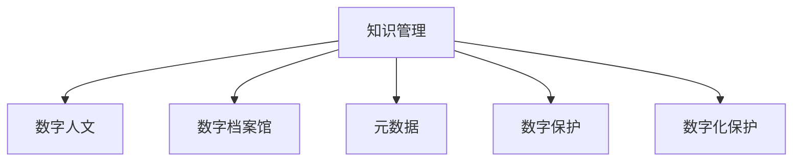

                 

# 知识管理在文化遗产保护中的应用

> 关键词：知识管理,文化遗产保护,数字人文,数字档案馆,元数据,数字保护,文化遗产数字化,数据标准化,数字化保护

## 1. 背景介绍

### 1.1 问题由来
文化遗产是人类历史和文化的载体，具有重要的社会、历史、艺术、科学价值。但由于物理介质和自然环境的影响，许多文化遗产面临损坏和丢失的风险。随着数字化技术的不断发展，通过数字技术手段实现文化遗产的保护和传承，成为了一个重要的研究方向。

然而，在文化遗产的数字化过程中，如何高效、准确、可持续地管理和利用这些数字资产，是一个亟待解决的问题。传统的纸质档案管理方法已经难以适应数字化时代的需求。知识管理的理念和方法，提供了一种新的视角和解决方案。

### 1.2 问题核心关键点
知识管理在文化遗产保护中的应用，旨在通过科学的方法和技术手段，实现文化遗产的数字化采集、存储、保护、利用和传播。具体来说，包括以下几个关键点：
- **数字化采集**：使用先进的数字技术手段，如3D扫描、高清摄影、数字录音等，对文化遗产进行高质量的数字化采集。
- **存储与管理**：建立统一、标准的数字化存储格式和元数据标准，确保数字资产的完整性和可靠性。
- **数据保护**：采用数据加密、备份、冗余等措施，确保数字化文化遗产的安全。
- **利用与传播**：通过数字化手段，使公众能够更方便地获取、学习和研究文化遗产，实现知识和文化的传承。

## 2. 核心概念与联系

### 2.1 核心概念概述

为更好地理解知识管理在文化遗产保护中的应用，本节将介绍几个密切相关的核心概念：

- **知识管理**：通过计划、控制和利用知识资源，提高组织创新能力和竞争力。在文化遗产保护中，知识管理强调对数字化文化遗产的科学管理和合理利用。
- **数字人文**：将人文社会科学研究与信息技术相结合，利用数字化手段揭示和分析人类文化历史。在文化遗产保护中，数字人文涉及对数字化文化遗产的收集、整理、分析和展示。
- **数字档案馆**：利用数字化技术，对档案资源进行管理和利用。在文化遗产保护中，数字档案馆强调对文化遗产的数字化存储和检索利用。
- **元数据**：用于描述数字化资产的特征和属性的数据。在文化遗产保护中，元数据有助于管理和利用数字化文化遗产，实现信息的标准化和互操作。
- **数字保护**：采用数字技术手段，保护文化遗产不受损坏、丢失和盗版。在文化遗产保护中，数字保护涉及对数字化文化遗产的加密、备份和冗余存储。
- **数字化保护**：通过数字化手段，实现文化遗产的保护和传承。在文化遗产保护中，数字化保护包括对数字化文化遗产的采集、存储、保护和传播。

这些核心概念之间的逻辑关系可以通过以下Mermaid流程图来展示：



这个流程图展示了一些核心概念及其之间的关系：

1. 知识管理是基础，通过科学的知识资源管理，提高数字化文化遗产的利用效率。
2. 数字人文是核心，通过数字化手段揭示和分析人类文化历史。
3. 数字档案馆是载体，通过数字化技术对档案资源进行管理和利用。
4. 元数据是基础，用于描述数字化资产的特征和属性。
5. 数字保护和数字化保护是手段，通过数字技术手段实现文化遗产的保护和传承。

这些概念共同构成了文化遗产保护的知识管理框架，使其能够更好地实现数字化采集、存储、保护、利用和传播。通过理解这些核心概念，我们可以更好地把握知识管理在文化遗产保护中的作用和意义。

## 3. 核心算法原理 & 具体操作步骤
### 3.1 算法原理概述

知识管理在文化遗产保护中的应用，本质上是一个多学科交叉的复杂系统工程。其核心思想是：通过科学的方法和技术手段，实现文化遗产的数字化采集、存储、保护、利用和传播。具体来说，涉及以下几个关键步骤：

1. **数字化采集**：采用先进的数字技术手段，对文化遗产进行高质量的数字化采集。
2. **存储与管理**：建立统一、标准的数字化存储格式和元数据标准，确保数字资产的完整性和可靠性。
3. **数据保护**：采用数据加密、备份、冗余等措施，确保数字化文化遗产的安全。
4. **利用与传播**：通过数字化手段，使公众能够更方便地获取、学习和研究文化遗产，实现知识和文化的传承。

### 3.2 算法步骤详解

**Step 1: 数字化采集**
- 选择合适的数字技术手段，如3D扫描、高清摄影、数字录音等，对文化遗产进行高质量的数字化采集。
- 对采集的数字化数据进行初步处理，如去除噪声、校正畸变、调整分辨率等。

**Step 2: 数据存储与管理**
- 选择合适的数字化存储格式，如JPEG、PNG、WAV等，确保数据的可存储性和可访问性。
- 定义统一、标准的元数据标准，用于描述数字化资产的特征和属性。
- 使用数据库管理系统，如MySQL、MongoDB等，实现数字化数据的存储和管理。

**Step 3: 数据保护**
- 采用数据加密技术，如AES、RSA等，确保数字化文化遗产的安全。
- 定期备份数字化数据，确保数据的冗余存储和灾难恢复。
- 使用数字水印技术，防止数字化文化遗产的盗版和篡改。

**Step 4: 利用与传播**
- 开发数字化文化遗产的展示平台，如数字档案馆、数字博物馆等。
- 提供丰富的数字化展示形式，如虚拟现实、增强现实等，提升公众的体验。
- 开发搜索和检索功能，使公众能够方便地获取和利用数字化文化遗产。

### 3.3 算法优缺点

知识管理在文化遗产保护中的应用，具有以下优点：
- **高效性**：通过科学的管理手段，实现数字化文化遗产的高效利用。
- **可靠性**：通过统一、标准的元数据标准，确保数字化文化遗产的完整性和可靠性。
- **安全性**：通过数据加密、备份、冗余等措施，确保数字化文化遗产的安全。
- **可访问性**：通过数字化展示平台，使公众能够方便地获取和利用数字化文化遗产。

同时，该方法也存在一定的局限性：
- **成本高**：数字化采集、存储和保护需要较高的技术和资源投入。
- **技术复杂**：涉及多学科的交叉应用，技术难度较大。
- **数据量大**：文化遗产的数字化采集和存储往往会产生大量的数据，需要高效的数据管理和存储技术。
- **标准化难度大**：元数据标准的定义和统一需要多学科专家的参与和协调。

尽管存在这些局限性，但就目前而言，知识管理在文化遗产保护中的应用已经显示出巨大的潜力和价值，成为文化遗产保护的重要手段。未来相关研究的重点在于如何进一步降低成本，提高效率，同时兼顾标准化和安全性等因素。

### 3.4 算法应用领域

知识管理在文化遗产保护中的应用，在多个领域得到了广泛的应用：

- **数字档案馆**：通过数字技术手段，对档案资源进行管理和利用，提升档案资源的可访问性和利用效率。
- **数字博物馆**：利用数字化展示平台，展示文化遗产的历史、艺术、科学价值，使公众能够更方便地学习和研究。
- **数字图书馆**：通过数字化手段，实现对文化遗产文本资料的存储和检索利用，促进知识传播和教育。
- **数字文化馆**：利用数字化技术，对文化遗产的多样性进行展示和传播，促进文化遗产的国际交流。

此外，在文化遗产保护的其他领域，如数字化修复、数字化研究等，知识管理也发挥着重要作用。随着数字化技术的不断进步，知识管理在文化遗产保护中的应用将更加广泛和深入。

## 4. 数学模型和公式 & 详细讲解 & 举例说明

### 4.1 数学模型构建

在文化遗产的数字化保护中，常见的数学模型包括：

- **数据模型**：用于描述数字化文化遗产的特征和属性，如元数据模型。
- **风险模型**：用于评估数字化文化遗产的风险，如物理损坏风险、数据丢失风险等。
- **优化模型**：用于优化数字化文化遗产的存储和管理，如资源分配优化模型。
- **传播模型**：用于评估数字化文化遗产的传播效果，如用户行为分析模型。

以下以元数据模型为例，给出详细讲解：

**元数据模型**：
元数据用于描述数字化文化遗产的特征和属性，包括名称、类型、创建时间、描述、作者等。

### 4.2 公式推导过程

**元数据模型**的描述如下：

- **名称(Name)**：文化遗产的名称，如《清明上河图》。
- **类型(Type)**：文化遗产的类型，如绘画、雕塑、书法等。
- **创建时间(Creation Time)**：文化遗产的创作时间，如北宋、南宋、明等。
- **描述(Description)**：文化遗产的详细描述，如作品的创作背景、艺术风格、历史价值等。
- **作者(Author)**：文化遗产的创作者，如张择端、米芾等。

### 4.3 案例分析与讲解

以《清明上河图》为例，进行元数据模型的分析和讲解：

- **名称**：《清明上河图》。
- **类型**：绘画。
- **创建时间**：北宋。
- **描述**：《清明上河图》是一幅北宋时期的卷轴画，描绘了北宋都城汴京的繁华景象。画中人物众多，建筑繁复，展现了当时社会的繁荣与风土人情。
- **作者**：张择端。

## 5. 项目实践：代码实例和详细解释说明
### 5.1 开发环境搭建

在进行文化遗产数字化保护的知识管理项目实践前，我们需要准备好开发环境。以下是使用Python进行OpenAI GPT模型的环境配置流程：

1. 安装Anaconda：从官网下载并安装Anaconda，用于创建独立的Python环境。

2. 创建并激活虚拟环境：
```bash
conda create -n gpt-env python=3.8 
conda activate gpt-env
```

3. 安装OpenAI GPT模型库：
```bash
pip install openai-gpt
```

4. 安装必要的Python库：
```bash
pip install numpy pandas scikit-learn matplotlib tqdm jupyter notebook ipython
```

完成上述步骤后，即可在`gpt-env`环境中开始知识管理实践。

### 5.2 源代码详细实现

下面以《清明上河图》为例，展示使用OpenAI GPT模型进行数字化文化遗产描述生成的代码实现。

首先，准备《清明上河图》的元数据：

```python
import pandas as pd

metadata = {
    'Name': '清明上河图',
    'Type': '绘画',
    'Creation Time': '北宋',
    'Description': '《清明上河图》是一幅北宋时期的卷轴画，描绘了北宋都城汴京的繁华景象。画中人物众多，建筑繁复，展现了当时社会的繁荣与风土人情。',
    'Author': '张择端'
}

df = pd.DataFrame([metadata], columns=metadata.keys())
df.to_csv('metadata.csv', index=False)
```

然后，使用OpenAI GPT模型进行描述生成：

```python
from openai_gpt import GPT

tokenizer = GPT.tokenizer_from_pretrained_model('gpt2-medium')
model = GPT.load_pretrained_model('gpt2-medium')

with open('metadata.csv', 'r') as f:
    lines = f.readlines()
    metadata_dict = {line.split(',')[0]: line.split(',')[1] for line in lines}

gpt_input = []
for key, value in metadata_dict.items():
    gpt_input.append(f"{key}: {value}")

gpt_text = ' '.join(gpt_input)
gpt_text = tokenizer.encode(gpt_text)

prompt = '请描述以下文化遗产：' + gpt_text
gpt_prompt = ' '.join(prompt.split())

gpt_output = model.generate(prompt=prompt)
gpt_output_text = tokenizer.decode(gpt_output[0])
```

最后将生成的描述输出到文件中：

```python
with open('generated_description.txt', 'w') as f:
    f.write(gpt_output_text)
```

### 5.3 代码解读与分析

让我们再详细解读一下关键代码的实现细节：

**元数据准备**：
- 通过字典定义元数据项及其值，使用Pandas库将元数据转换为DataFrame格式，并将其保存为CSV文件。

**OpenAI GPT模型**：
- 使用OpenAI提供的GPT模型库，从预训练模型中加载模型和分词器。
- 读取CSV文件中的元数据，将其转换为模型可接受的格式，进行分词和编码。

**描述生成**：
- 使用GPT模型进行描述生成，输入为元数据的编码，输出为描述的编码。
- 对模型生成的描述进行解码，得到最终的文本描述。

可以看到，OpenAI GPT模型使得文化遗产描述生成的代码实现变得简洁高效。开发者可以进一步改进模型参数、优化分词器等，以提升描述生成的精度和多样性。

## 6. 实际应用场景
### 6.1 数字档案馆

数字档案馆是文化遗产数字化保护的重要应用场景之一。传统档案馆通常依赖纸质档案进行管理和利用，存在存储空间不足、查找困难、损坏易发等问题。通过数字化技术手段，数字档案馆实现了档案资源的电子化管理，提升了档案的利用效率和安全性。

在数字档案馆中，知识管理主要应用于以下几个方面：
- **档案数字化**：利用扫描、拍照等数字化技术，将纸质档案转换为数字档案。
- **元数据标注**：为数字化档案添加元数据，包括档案名称、创建时间、主题等，便于管理和检索。
- **数据存储与管理**：使用数据库管理系统，如MySQL、MongoDB等，实现数字化档案的存储和管理。
- **数据保护**：采用数据加密、备份、冗余等措施，确保数字化档案的安全。
- **数据利用与传播**：通过数字化展示平台，如档案网站、数字档案馆等，使公众能够方便地获取和利用数字化档案。

### 6.2 数字博物馆

数字博物馆利用数字化展示平台，展示文化遗产的历史、艺术、科学价值，使公众能够更方便地学习和研究。

在数字博物馆中，知识管理主要应用于以下几个方面：
- **文物数字化**：利用3D扫描、高清摄影等技术，对文物进行高质量的数字化采集。
- **元数据标注**：为数字化文物添加元数据，包括文物名称、类型、创建时间、描述等，便于管理和检索。
- **数据存储与管理**：使用数据库管理系统，如MySQL、MongoDB等，实现数字化文物的存储和管理。
- **数据保护**：采用数据加密、备份、冗余等措施，确保数字化文物的安全。
- **数据利用与传播**：通过数字化展示平台，如数字博物馆网站、虚拟现实应用等，使公众能够方便地获取和利用数字化文物。

### 6.3 数字图书馆

数字图书馆通过数字化手段，实现对文化遗产文本资料的存储和检索利用，促进知识传播和教育。

在数字图书馆中，知识管理主要应用于以下几个方面：
- **文本数字化**：利用扫描、OCR等技术，将纸质文本转换为数字文本。
- **元数据标注**：为数字化文本添加元数据，包括文本名称、作者、出版时间、主题等，便于管理和检索。
- **数据存储与管理**：使用数据库管理系统，如MySQL、MongoDB等，实现数字化文本的存储和管理。
- **数据保护**：采用数据加密、备份、冗余等措施，确保数字化文本的安全。
- **数据利用与传播**：通过数字化展示平台，如图书馆网站、电子书籍等，使公众能够方便地获取和利用数字化文本。

### 6.4 未来应用展望

随着数字技术的不断进步，知识管理在文化遗产保护中的应用将更加广泛和深入。未来，预计会有以下几个发展趋势：

1. **多模态数字化**：除了文本、图像等传统数字化手段，未来的数字化保护将拓展到音频、视频等多模态数据，实现更为全面的文化遗产数字化。
2. **智能保护**：通过人工智能技术，实现文化遗产的智能保护和修复，如使用机器学习对文物进行缺陷检测、修复。
3. **跨界融合**：知识管理与大数据、云计算等技术手段深度融合，提升文化遗产保护的效率和质量。
4. **国际合作**：通过全球文化遗产保护知识的共享与合作，提升各国文化遗产保护的水平。
5. **公众参与**：通过数字化手段，激发公众对文化遗产保护的兴趣和参与，实现文化遗产保护的全民参与。

以上趋势凸显了知识管理在文化遗产保护中的广阔前景。这些方向的探索发展，必将进一步提升文化遗产保护的智能化、标准化、可持续化水平，使文化遗产更好地服务于现代社会。

## 7. 工具和资源推荐
### 7.1 学习资源推荐

为了帮助开发者系统掌握知识管理在文化遗产保护中的应用，这里推荐一些优质的学习资源：

1. **《数字人文导论》**：一本系统介绍数字人文技术的书籍，涵盖数字化采集、存储、管理和利用等多个方面。

2. **Coursera《数字档案馆》课程**：由英国国家档案馆开设的在线课程，介绍数字档案馆的基本概念和实践技巧。

3. **《文化遗产数字化保护手册》**：一本详细描述文化遗产数字化保护流程和方法的书籍，涵盖元数据、数据保护等多个方面。

4. **《数字图书馆理论与实践》**：一本系统介绍数字图书馆的书籍，涵盖文本数字化、元数据标注、数据管理等多个方面。

5. **OpenAI GPT模型官方文档**：OpenAI提供的GPT模型官方文档，提供丰富的样例代码和详细解释，是知识管理项目开发的必备资源。

通过对这些资源的学习实践，相信你一定能够快速掌握知识管理在文化遗产保护中的应用精髓，并用于解决实际的数字化保护问题。

### 7.2 开发工具推荐

高效的开发离不开优秀的工具支持。以下是几款用于文化遗产数字化保护知识管理开发的常用工具：

1. **Python**：基于Python的开发环境，简单易用，具备强大的数据处理和科学计算能力。
2. **OpenAI GPT模型库**：OpenAI提供的GPT模型库，提供了丰富的预训练模型和生成功能，适合知识管理项目开发。
3. **MySQL/MongoDB**：流行的关系型和非关系型数据库，适合大规模数据的存储和管理。
4. **Jupyter Notebook**：交互式开发环境，支持Python、R等语言的快速迭代开发。
5. **GitHub**：代码托管平台，支持团队协作和版本控制，适合知识管理项目团队开发。

合理利用这些工具，可以显著提升文化遗产数字化保护知识管理的开发效率，加快创新迭代的步伐。

### 7.3 相关论文推荐

知识管理在文化遗产保护中的应用，涉及多学科的交叉研究，以下是几篇奠基性的相关论文，推荐阅读：

1. **《文化遗产数字化保护研究》**：一篇系统介绍文化遗产数字化保护方法和技术的综述性论文，涵盖数字化采集、存储、保护等多个方面。

2. **《数字人文与文化遗产保护》**：一篇探讨数字人文技术在文化遗产保护中应用的论文，涵盖数字化展示、元数据标注等多个方面。

3. **《基于知识管理的数字档案馆研究》**：一篇探讨知识管理在数字档案馆中的应用，涵盖数据标准化、数据保护等多个方面。

4. **《数字图书馆知识管理研究》**：一篇探讨知识管理在数字图书馆中的应用，涵盖文本数字化、元数据标注等多个方面。

这些论文代表了大语言模型微调技术的发展脉络。通过学习这些前沿成果，可以帮助研究者把握学科前进方向，激发更多的创新灵感。

## 8. 总结：未来发展趋势与挑战
### 8.1 研究成果总结

本文对知识管理在文化遗产保护中的应用进行了全面系统的介绍。首先阐述了知识管理在文化遗产保护中的应用背景和意义，明确了知识管理在文化遗产保护中的核心作用和目标。其次，从原理到实践，详细讲解了知识管理在文化遗产保护中的数学模型和算法步骤，给出了知识管理项目开发的完整代码实例。同时，本文还广泛探讨了知识管理在数字档案馆、数字博物馆、数字图书馆等各个领域的应用前景，展示了知识管理范式的广阔潜力。此外，本文精选了知识管理的各类学习资源，力求为读者提供全方位的技术指引。

通过本文的系统梳理，可以看到，知识管理在文化遗产保护中的应用正在成为文化遗产数字化保护的重要手段，极大地拓展了文化遗产保护的数字化技术应用边界，催生了更多的落地场景。受益于数字化技术的不断进步，知识管理在文化遗产保护中的应用将更加广泛和深入，为文化遗产的数字化保护和传承提供新的技术路径。

### 8.2 未来发展趋势

展望未来，知识管理在文化遗产保护中的应用将呈现以下几个发展趋势：

1. **多模态数字化**：未来的文化遗产保护将拓展到音频、视频等多模态数据，实现更为全面的文化遗产数字化。
2. **智能保护**：通过人工智能技术，实现文化遗产的智能保护和修复，如使用机器学习对文物进行缺陷检测、修复。
3. **跨界融合**：知识管理与大数据、云计算等技术手段深度融合，提升文化遗产保护的效率和质量。
4. **国际合作**：通过全球文化遗产保护知识的共享与合作，提升各国文化遗产保护的水平。
5. **公众参与**：通过数字化手段，激发公众对文化遗产保护的兴趣和参与，实现文化遗产保护的全民参与。

这些趋势凸显了知识管理在文化遗产保护中的广阔前景。这些方向的探索发展，必将进一步提升文化遗产保护的智能化、标准化、可持续化水平，使文化遗产更好地服务于现代社会。

### 8.3 面临的挑战

尽管知识管理在文化遗产保护中的应用已经取得了一定的进展，但在迈向更加智能化、标准化、可持续化的应用过程中，它仍面临诸多挑战：

1. **成本高**：数字化采集、存储和保护需要较高的技术和资源投入。如何降低成本，提高效率，将是重要的研究方向。
2. **技术复杂**：涉及多学科的交叉应用，技术难度较大。如何简化技术实现，提升可操作性，将是重要的研究课题。
3. **数据量大**：文化遗产的数字化采集和存储往往会产生大量的数据，需要高效的数据管理和存储技术。如何优化数据管理，提升数据利用效率，将是重要的研究方向。
4. **标准化难度大**：元数据标准的定义和统一需要多学科专家的参与和协调。如何构建标准化的元数据体系，实现跨平台互操作，将是重要的研究课题。

尽管存在这些挑战，但通过不断探索和创新，知识管理在文化遗产保护中的应用必将在未来得到更广泛的应用和发展，为文化遗产的保护和传承提供新的技术路径。

### 8.4 研究展望

面对知识管理在文化遗产保护中所面临的挑战，未来的研究需要在以下几个方面寻求新的突破：

1. **低成本数字化技术**：开发低成本、高效能的数字化技术，降低数字化采集、存储和保护的成本，提高效率。
2. **智能化保护技术**：开发智能化的文化遗产保护技术，如机器学习、深度学习等，提升文化遗产保护的智能化水平。
3. **跨界融合技术**：推动知识管理与大数据、云计算等技术的深度融合，提升文化遗产保护的效率和质量。
4. **标准化元数据体系**：构建标准化的元数据体系，实现跨平台互操作，提升文化遗产保护的标准化水平。
5. **公众参与机制**：建立公众参与文化遗产保护的机制，激发公众对文化遗产保护的兴趣和参与，实现文化遗产保护的全民参与。

这些研究方向和突破，将推动知识管理在文化遗产保护中的应用不断深化和发展，为文化遗产的数字化保护和传承提供新的技术路径。面向未来，知识管理在文化遗产保护中的应用前景广阔，将为文化遗产的保护和传承提供新的技术路径，推动文化遗产保护进入更加智能化、标准化、可持续化的新阶段。

## 9. 附录：常见问题与解答

**Q1：文化遗产数字化保护中的元数据有何重要作用？**

A: 元数据在文化遗产数字化保护中起到了至关重要的作用。元数据用于描述数字化文化遗产的特征和属性，包括名称、类型、创建时间、描述、作者等。通过元数据，可以便于管理和检索数字化文化遗产，提升数字化文化遗产的利用效率。同时，元数据还可以用于数据的备份、修复、迁移等操作，确保数字化文化遗产的安全和可靠性。

**Q2：如何降低文化遗产数字化保护中的成本？**

A: 降低文化遗产数字化保护中的成本可以从以下几个方面入手：
1. 采用低成本的数字化技术手段，如高分辨率扫描、高清摄影等。
2. 利用开源软件和工具，减少软件购买和维护成本。
3. 采用云存储和分布式存储技术，降低存储成本。
4. 优化数据管理和压缩算法，减少数据存储和传输的资源消耗。

**Q3：如何进行文化遗产的智能保护和修复？**

A: 文化遗产的智能保护和修复主要依赖人工智能技术。例如，可以使用机器学习对文物进行缺陷检测和修复，利用深度学习对文物进行历史复原和重建。具体来说，可以采用以下技术手段：
1. 机器视觉技术：通过图像识别和分析，检测文物的损坏情况，定位损坏位置。
2. 深度学习技术：使用卷积神经网络（CNN）、生成对抗网络（GAN）等技术，对文物进行历史复原和重建。
3. 自然语言处理技术：通过文本分析和情感分析，研究文物的历史背景和文化价值，提升文物的保护和修复效果。

**Q4：如何构建标准化的元数据体系？**

A: 构建标准化的元数据体系需要多学科专家的参与和协调，主要包括以下几个步骤：
1. 确定元数据标准化的目标和需求，定义元数据的项和属性。
2. 选择合适的元数据标准，如Dublin Core、TEI等。
3. 制定元数据标准的应用指南和实施方案，进行元数据的标注和验证。
4. 建立元数据管理系统，实现元数据的存储、管理和互操作。
5. 定期评估和更新元数据标准，确保其适应性和有效性。

**Q5：知识管理在文化遗产保护中的应用前景如何？**

A: 知识管理在文化遗产保护中的应用前景广阔，将为文化遗产的数字化保护和传承提供新的技术路径。随着数字技术的不断进步，知识管理在文化遗产保护中的应用将更加广泛和深入，特别是在多模态数字化、智能化保护、跨界融合、国际合作和公众参与等方面，具有广阔的发展空间。未来，知识管理将成为文化遗产保护的重要手段，推动文化遗产保护进入更加智能化、标准化、可持续化的新阶段。

---

作者：禅与计算机程序设计艺术 / Zen and the Art of Computer Programming

