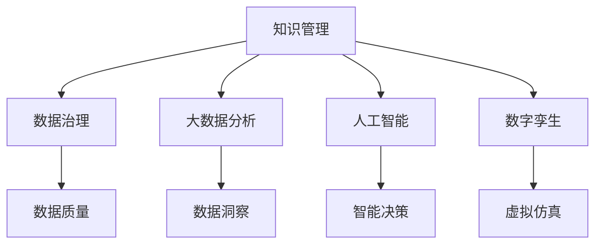

                 

# 知识管理在能源行业的实践

> 关键词：知识管理, 能源行业, 数据治理, 人工智能, 大数据, 数字孪生

## 1. 背景介绍

### 1.1 问题由来
能源行业是一个复杂且关键的基础设施领域，其涵盖的子领域包括电力、石油、天然气、可再生能源等。随着全球能源结构的快速转型，能源行业正面临着越来越严峻的挑战，如环境污染、能源浪费、供应链风险等。针对这些挑战，如何通过有效的知识管理，提升能源企业的决策效率和运营水平，成为近年来研究的热点。

能源行业中的知识管理，不仅仅包括传统的文档管理、信息检索，还包括如何利用现代信息技术手段，实现能源数据的全生命周期治理、智能分析与决策支持。通过知识管理，能源企业能够更好地理解和优化自身的业务流程，提高运营效率，并降低运营风险。

### 1.2 问题核心关键点
当前，能源行业中的知识管理主要面临以下几个关键问题：

1. **数据孤岛问题**：由于各子领域数据格式、数据源不一致，导致数据无法有效整合，形成数据孤岛，影响了信息共享和分析。
2. **数据质量问题**：数据采集、存储、处理过程中存在噪音、遗漏、重复等问题，导致数据质量低下，影响分析和决策。
3. **知识协同问题**：不同部门、团队之间的知识交流不畅，缺乏统一的协作平台，影响了知识的有效利用。
4. **智能分析不足**：传统的数据分析方法无法满足复杂的能源问题，需要引入先进的AI和大数据技术，提升分析深度和广度。
5. **数据安全问题**：能源数据涉及国家安全和商业机密，需要建立完善的数据安全机制，保障数据隐私和合规。

### 1.3 问题研究意义
针对以上问题，本文将探讨如何通过知识管理技术，解决能源行业的关键挑战，提升企业的决策效率和运营水平。研究重点包括数据治理、大数据分析、AI辅助决策、数字孪生等核心技术的应用。通过深入分析，为能源企业的知识管理实践提供可操作的建议和参考。

## 2. 核心概念与联系

### 2.1 核心概念概述

本节将介绍几个核心概念及其在能源行业中的应用：

- **知识管理(Knowledge Management, KMS)**：涉及知识的收集、存储、整合、检索、应用和共享，提升企业决策效率和运营水平。
- **数据治理(Data Governance, DG)**：通过制定数据标准、规范和流程，保障数据质量，实现数据的完整性、一致性和可追溯性。
- **大数据分析(Big Data Analytics)**：利用大数据技术，通过数据挖掘、机器学习等手段，从海量数据中提取有价值的知识和洞察。
- **人工智能(Artificial Intelligence, AI)**：引入AI技术，如自然语言处理、计算机视觉、深度学习等，提升数据分析和决策支持的智能化水平。
- **数字孪生(Digital Twin)**：通过数字技术，构建能源设施的虚拟模型，实现物理与数字世界的紧密结合，提升运营和维护效率。

这些核心概念相互交织，共同构成了能源行业知识管理的框架。下图展示了这些概念之间的联系：



## 3. 核心算法原理 & 具体操作步骤
### 3.1 算法原理概述

在能源行业中，知识管理主要通过以下几个步骤实现：

1. **数据采集**：从不同数据源收集能源数据，包括能源消耗、生产、供应链等。
2. **数据清洗**：对收集的数据进行清洗，去除噪音、遗漏、重复等问题，提升数据质量。
3. **数据存储与管理**：建立统一的数据仓库，实现数据的集中存储和管理，保障数据安全与隐私。
4. **数据分析**：通过大数据分析和AI技术，挖掘数据背后的知识和洞察，支持决策。
5. **知识共享与应用**：构建知识共享平台，促进不同部门和团队之间的知识交流和应用。

### 3.2 算法步骤详解

下面详细讲解能源行业中知识管理的几个关键步骤：

**Step 1: 数据采集**

数据采集是知识管理的第一步。在能源行业中，数据来源多样，包括物联网设备、能源监测系统、第三方数据平台等。对于不同的数据源，需要采用不同的采集技术和工具，如ETL工具、API接口、数据爬虫等。

- **物联网设备**：通过传感器、智能仪表等设备，实时采集能源消耗数据。
- **能源监测系统**：集成能源监测传感器，实时监控能源生产、存储和传输数据。
- **第三方数据平台**：通过API接口或数据接口，从外部数据源获取能源数据，如气象数据、市场数据等。

**Step 2: 数据清洗**

数据清洗的目的是提高数据质量，确保数据的准确性和完整性。在能源行业中，由于数据来源多样，数据格式、质量参差不齐，清洗过程尤为重要。

- **数据格式转换**：将不同格式的数据转换为统一格式，便于后续处理。
- **数据去重**：去除重复数据，确保数据的唯一性。
- **数据修复**：通过插值、填充等方式，修复数据中的缺失值和异常值。
- **数据标准化**：根据行业标准和规范，对数据进行标准化处理，确保数据的可比性和一致性。

**Step 3: 数据存储与管理**

数据存储与管理是知识管理的基础。建立统一的数据仓库，实现数据的集中管理和存储，是保障数据安全和隐私的关键步骤。

- **数据仓库建设**：选择合适的数据仓库平台，如Hadoop、Spark等，构建统一的数据存储和管理环境。
- **数据分区与分片**：根据业务需求和数据特点，将数据分区和分片存储，提升数据查询效率。
- **数据备份与恢复**：建立完善的数据备份与恢复机制，确保数据的安全性和可靠性。
- **数据访问控制**：实现数据的权限管理和访问控制，保障数据隐私和安全。

**Step 4: 数据分析**

数据分析是知识管理的核心步骤。通过大数据分析和AI技术，从数据中提取有价值的知识和洞察，支持决策。

- **大数据分析**：利用大数据技术，如Hadoop、Spark等，对大规模数据进行分布式计算和分析，提取数据中的规律和趋势。
- **机器学习**：通过机器学习算法，如分类、聚类、回归等，对数据进行建模和预测，提供决策支持。
- **自然语言处理**：利用自然语言处理技术，处理和分析能源领域的文本数据，提取有价值的洞察。

**Step 5: 知识共享与应用**

知识共享与应用是知识管理的最终目标。通过构建知识共享平台，促进不同部门和团队之间的知识交流和应用，提升企业的决策效率和运营水平。

- **知识库建设**：构建统一的知识库，实现知识的集中存储和管理。
- **知识检索与查询**：通过搜索引擎和知识图谱，快速检索和查询知识，支持决策。
- **协作平台**：建立协作平台，促进不同部门和团队之间的知识交流和应用，提升团队协作效率。
- **决策支持**：利用数据分析和AI技术，提供决策支持，提升决策效率和质量。

### 3.3 算法优缺点

能源行业中的知识管理技术具有以下优点：

- **提升决策效率**：通过大数据分析和AI技术，提供实时、准确的决策支持，提升决策效率。
- **降低运营成本**：通过数据共享和协作，减少重复劳动和资源浪费，降低运营成本。
- **增强数据安全**：通过数据加密、访问控制等措施，保障数据隐私和安全，降低数据泄露风险。
- **促进创新发展**：通过知识共享和应用，促进不同部门和团队之间的创新合作，推动企业发展。

同时，该技术也存在一定的局限性：

- **数据孤岛问题**：数据来源多样，格式不一致，导致数据难以整合，形成数据孤岛，影响了信息共享和分析。
- **数据质量问题**：数据采集、存储、处理过程中存在噪音、遗漏、重复等问题，导致数据质量低下，影响分析和决策。
- **技术门槛高**：大数据和AI技术复杂度高，需要专业的技术团队支持，对企业资源要求较高。
- **数据隐私问题**：能源数据涉及国家安全和商业机密，需要建立完善的数据安全机制，保障数据隐私和合规。

### 3.4 算法应用领域

能源行业中的知识管理技术，广泛应用于以下几个领域：

1. **能源监测与分析**：通过实时监控和数据分析，提升能源生产、存储和传输的效率和安全性。
2. **智能电网管理**：通过大数据分析和AI技术，优化电网运行和维护，提升能源分配的公平性和效率。
3. **可再生能源管理**：通过大数据分析和机器学习，优化可再生能源的采集、存储和利用，提升能源利用效率。
4. **能源市场分析**：通过数据分析和机器学习，预测能源市场趋势，支持企业的能源采购和销售决策。
5. **能源环境监测**：通过大数据分析和AI技术，监测能源生产和消费对环境的影响，支持环境决策。

## 4. 数学模型和公式 & 详细讲解  
### 4.1 数学模型构建

在能源行业中，知识管理涉及多个领域的数据，需要构建多维度的数学模型。以下是几个核心模型的构建过程：

**Step 1: 数据分布拟合**

在能源行业中，数据分布可能呈现不同的规律，如正态分布、泊松分布等。通过建立数据分布模型，可以对数据进行拟合和预测。

- **正态分布**：对于连续型数据，如能源消耗量，可以使用正态分布模型进行拟合和预测。
- **泊松分布**：对于离散型数据，如能源事故数量，可以使用泊松分布模型进行拟合和预测。

**Step 2: 时间序列分析**

时间序列分析是能源行业中的重要应用。通过时间序列模型，可以对能源数据进行时间依赖性的分析和预测。

- **ARIMA模型**：自回归积分滑动平均模型，用于处理非平稳时间序列。
- **LSTM模型**：长短期记忆网络，用于处理长期依赖的时间序列数据。

**Step 3: 空间数据分析**

空间数据分析是能源行业中的另一重要应用。通过空间数据分析，可以对能源数据进行空间依赖性的分析和预测。

- **KNN模型**：K最近邻模型，用于空间距离计算和模式识别。
- **GIS分析**：地理信息系统分析，用于空间数据的可视化和分析。

### 4.2 公式推导过程

以下是几个核心模型的公式推导过程：

**正态分布模型**

对于一个连续型数据 $x$，假设其服从正态分布 $N(\mu, \sigma^2)$，则其概率密度函数为：

$$
f(x|\mu, \sigma^2) = \frac{1}{\sqrt{2\pi\sigma^2}} \exp\left(-\frac{(x-\mu)^2}{2\sigma^2}\right)
$$

其中，$\mu$ 为均值，$\sigma^2$ 为方差。

**ARIMA模型**

ARIMA模型的公式为：

$$
X_t = \phi(X_{t-1}) + \theta(X_{t-2}) + \alpha(Y_t)
$$

其中，$X_t$ 为第 $t$ 时刻的能源消耗量，$\phi$ 和 $\theta$ 分别为自回归和积分项，$\alpha$ 为滑动平均项，$Y_t$ 为误差项。

**LSTM模型**

LSTM模型的公式为：

$$
h_t = \tanh(W_c \cdot [h_{t-1}, X_t]) \cdot \sigma(U_c \cdot [h_{t-1}, X_t])
$$

其中，$h_t$ 为第 $t$ 时刻的隐藏状态，$W_c$ 和 $U_c$ 为权重矩阵，$\sigma$ 为激活函数，$\tanh$ 为双曲正切函数。

**KNN模型**

KNN模型的公式为：

$$
KNN(x_i, x_j) = \frac{1}{N} \sum_{i=1}^{N} \delta(x_i, x_j)
$$

其中，$x_i$ 和 $x_j$ 为两个样本，$N$ 为样本数量，$\delta(x_i, x_j)$ 为样本间的距离。

### 4.3 案例分析与讲解

**案例 1: 智能电网管理**

某能源公司通过智能电网管理系统，实时监控电网的运行状态和能源消耗情况。利用大数据分析和机器学习技术，该系统可以预测电网的负载变化，优化能源分配，提升电网运行效率。

- **数据采集**：通过智能仪表和传感器，实时采集电网的电压、电流、功率等数据。
- **数据清洗**：去除噪音、异常值，进行数据标准化处理。
- **数据存储与管理**：建立统一的数据仓库，实现数据的集中存储和管理。
- **数据分析**：利用ARIMA模型和时间序列分析技术，预测电网的负载变化。
- **知识共享与应用**：通过知识库和协作平台，支持不同部门和团队之间的知识交流和应用，提升决策效率。

**案例 2: 可再生能源管理**

某能源公司利用大数据分析和机器学习技术，优化可再生能源的采集、存储和利用。通过数据分析，该系统可以预测能源市场的供需变化，优化能源采购和销售策略，提升能源利用效率。

- **数据采集**：通过物联网设备，实时采集太阳能、风能等可再生能源的数据。
- **数据清洗**：去除噪音、遗漏，进行数据标准化处理。
- **数据存储与管理**：建立统一的数据仓库，实现数据的集中存储和管理。
- **数据分析**：利用LSTM模型和时间序列分析技术，预测能源市场的供需变化。
- **知识共享与应用**：通过知识库和协作平台，支持不同部门和团队之间的知识交流和应用，提升决策效率。

## 5. 项目实践：代码实例和详细解释说明
### 5.1 开发环境搭建

在进行能源行业的知识管理实践前，我们需要准备好开发环境。以下是使用Python进行PyTorch开发的环境配置流程：

1. 安装Anaconda：从官网下载并安装Anaconda，用于创建独立的Python环境。

2. 创建并激活虚拟环境：
```bash
conda create -n pytorch-env python=3.8 
conda activate pytorch-env
```

3. 安装PyTorch：根据CUDA版本，从官网获取对应的安装命令。例如：
```bash
conda install pytorch torchvision torchaudio cudatoolkit=11.1 -c pytorch -c conda-forge
```

4. 安装相关的数据处理和可视化库：
```bash
pip install numpy pandas scikit-learn matplotlib
```

完成上述步骤后，即可在`pytorch-env`环境中开始开发。

### 5.2 源代码详细实现

以下是一个简单的数据清洗和分析的Python代码实现，用于演示在能源行业中的知识管理实践：

```python
import pandas as pd
from sklearn.preprocessing import StandardScaler
from sklearn.decomposition import PCA

# 读取能源数据
data = pd.read_csv('energy_data.csv')

# 数据清洗
data.dropna(inplace=True)
data = data.drop_duplicates()

# 数据标准化
scaler = StandardScaler()
data = pd.DataFrame(scaler.fit_transform(data), columns=data.columns)

# 数据降维
pca = PCA(n_components=2)
data_pca = pd.DataFrame(pca.fit_transform(data), columns=['PC1', 'PC2'])

# 可视化
import matplotlib.pyplot as plt
plt.scatter(data_pca['PC1'], data_pca['PC2'], c=data['label'])
plt.xlabel('PC1')
plt.ylabel('PC2')
plt.show()
```

### 5.3 代码解读与分析

以上代码实现了能源数据的清洗、标准化、降维和可视化。下面是关键代码的详细解读：

**数据清洗**

- `dropna`方法用于去除数据中的缺失值。
- `drop_duplicates`方法用于去除数据中的重复值。

**数据标准化**

- `StandardScaler`方法用于对数据进行标准化处理，即将其转化为均值为0，方差为1的标准正态分布。
- `fit_transform`方法用于计算标准化后的数据。

**数据降维**

- `PCA`方法用于对数据进行主成分分析，提取出两个主成分，用于可视化。
- `fit_transform`方法用于计算主成分。

**可视化**

- `matplotlib`库用于绘制散点图，展示主成分的分布情况。
- `show`方法用于展示可视化结果。

## 6. 实际应用场景
### 6.1 智能电网管理

智能电网管理系统是能源行业中的典型应用。通过智能电网管理系统，可以实时监控电网的运行状态和能源消耗情况，提升电网运行效率。

**数据采集**

智能电网管理系统通过智能仪表和传感器，实时采集电网的电压、电流、功率等数据。这些数据通过网络传输到中央数据中心，进行集中存储和管理。

**数据清洗**

对于采集到的数据，需要对其进行清洗，去除噪音和异常值，进行数据标准化处理。这些步骤可以通过Python的`pandas`和`scikit-learn`库实现。

**数据存储与管理**

建立统一的数据仓库，使用分布式存储系统，如Hadoop、Spark等，实现数据的集中存储和管理。数据仓库的建设需要考虑数据的安全性和隐私性，建立完善的数据访问控制机制。

**数据分析**

利用大数据分析和机器学习技术，对电网数据进行分析和预测。例如，可以使用ARIMA模型和时间序列分析技术，预测电网的负载变化，优化能源分配。

**知识共享与应用**

通过知识库和协作平台，支持不同部门和团队之间的知识交流和应用，提升决策效率。知识库可以存储相关的技术文档、操作手册、案例分析等，供员工查询和学习。

### 6.2 可再生能源管理

可再生能源管理是能源行业中的另一重要应用。通过大数据分析和机器学习技术，优化可再生能源的采集、存储和利用，提升能源利用效率。

**数据采集**

通过物联网设备，实时采集太阳能、风能等可再生能源的数据。这些数据包括气象数据、设备运行状态等。

**数据清洗**

对于采集到的数据，需要对其进行清洗，去除噪音和遗漏，进行数据标准化处理。这些步骤可以通过Python的`pandas`和`scikit-learn`库实现。

**数据存储与管理**

建立统一的数据仓库，使用分布式存储系统，如Hadoop、Spark等，实现数据的集中存储和管理。数据仓库的建设需要考虑数据的安全性和隐私性，建立完善的数据访问控制机制。

**数据分析**

利用大数据分析和机器学习技术，对可再生能源数据进行分析和预测。例如，可以使用LSTM模型和时间序列分析技术，预测能源市场的供需变化，优化能源采购和销售策略。

**知识共享与应用**

通过知识库和协作平台，支持不同部门和团队之间的知识交流和应用，提升决策效率。知识库可以存储相关的技术文档、操作手册、案例分析等，供员工查询和学习。

## 7. 工具和资源推荐
### 7.1 学习资源推荐

为了帮助开发者系统掌握能源行业中的知识管理技术，这里推荐一些优质的学习资源：

1. **《Python大数据分析实战》**：介绍了Python在数据清洗、数据处理、数据分析中的应用，适合初学者入门。

2. **《机器学习实战》**：通过多个实际案例，展示了机器学习技术在能源领域的应用，适合中级开发者。

3. **《大数据技术与应用》**：介绍了大数据技术在能源行业中的应用，包括数据采集、存储、分析等环节，适合高级开发者。

4. **《智能电网技术与应用》**：介绍了智能电网管理系统在能源行业中的应用，包括数据采集、存储、分析等环节，适合高级开发者。

5. **《可再生能源技术与管理》**：介绍了可再生能源的管理和优化技术，适合能源领域的专业人士。

通过对这些资源的学习实践，相信你一定能够快速掌握能源行业中的知识管理技术，并用于解决实际的能源问题。

### 7.2 开发工具推荐

高效的开发离不开优秀的工具支持。以下是几款用于能源行业中的知识管理开发的常用工具：

1. **PyTorch**：基于Python的开源深度学习框架，灵活动态的计算图，适合快速迭代研究。

2. **TensorFlow**：由Google主导开发的开源深度学习框架，生产部署方便，适合大规模工程应用。

3. **Hadoop**：开源分布式计算平台，适合大数据处理和存储。

4. **Spark**：Apache基金会提供的开源大数据处理引擎，适合大规模数据处理。

5. **Tableau**：数据可视化工具，适合数据可视化和分析。

6. **Jupyter Notebook**：交互式编程环境，适合快速迭代开发和实验。

合理利用这些工具，可以显著提升能源行业中的知识管理开发的效率，加快创新迭代的步伐。

### 7.3 相关论文推荐

能源行业中的知识管理技术涉及多个学科，包括数据科学、计算机科学、工程学等。以下是几篇奠基性的相关论文，推荐阅读：

1. **《智能电网中的大数据分析与人工智能应用》**：介绍了智能电网管理系统在能源行业中的应用，包括数据采集、存储、分析等环节。

2. **《可再生能源管理中的大数据分析与机器学习》**：介绍了可再生能源的管理和优化技术，包括数据采集、存储、分析等环节。

3. **《知识管理在能源行业中的研究进展》**：总结了能源行业中的知识管理技术的发展历程和应用现状。

4. **《数据治理在能源行业中的实践》**：介绍了数据治理在能源行业中的应用，包括数据标准、规范和流程等方面。

这些论文代表了大数据和AI技术在能源行业中的应用现状，为研究者提供了丰富的参考资料。

## 8. 总结：未来发展趋势与挑战
### 8.1 研究成果总结

本文对能源行业中的知识管理技术进行了系统梳理。通过分析数据采集、数据清洗、数据存储与管理、数据分析和知识共享与应用等关键环节，探讨了如何通过知识管理技术，提升能源企业的决策效率和运营水平。研究表明，大数据分析和人工智能技术在能源行业中的应用，具有重要的现实意义和应用前景。

### 8.2 未来发展趋势

展望未来，能源行业中的知识管理技术将呈现以下几个发展趋势：

1. **数据治理的规范化**：随着数据的规模和复杂度不断增加，数据治理将变得更加重要。制定统一的数据标准和规范，保障数据的质量和一致性。

2. **大数据分析的智能化**：通过引入人工智能技术，提升大数据分析的智能化水平，提供更加深入的洞察和预测。

3. **数据可视化的全面化**：通过可视化工具，提供全面的数据展示和分析，支持决策支持。

4. **协作平台的协同化**：建立统一的协作平台，促进不同部门和团队之间的知识交流和应用，提升团队协作效率。

5. **数据安全的完善化**：建立完善的数据安全机制，保障数据隐私和安全，降低数据泄露风险。

### 8.3 面临的挑战

尽管能源行业中的知识管理技术已经取得了一定进展，但在迈向更加智能化、普适化应用的过程中，仍面临诸多挑战：

1. **数据孤岛问题**：数据来源多样，格式不一致，导致数据难以整合，形成数据孤岛，影响了信息共享和分析。

2. **数据质量问题**：数据采集、存储、处理过程中存在噪音、遗漏、重复等问题，导致数据质量低下，影响分析和决策。

3. **技术门槛高**：大数据和AI技术复杂度高，需要专业的技术团队支持，对企业资源要求较高。

4. **数据隐私问题**：能源数据涉及国家安全和商业机密，需要建立完善的数据安全机制，保障数据隐私和合规。

### 8.4 研究展望

面对能源行业中的知识管理技术所面临的挑战，未来的研究需要在以下几个方面寻求新的突破：

1. **探索数据治理的新方法**：探索数据孤岛问题的解决方案，建立统一的数据治理平台，实现数据的集中管理和共享。

2. **引入AI技术的新模型**：引入先进的大数据和AI模型，提升数据分析和预测的智能化水平。

3. **优化数据安全机制**：建立完善的数据安全机制，保障数据隐私和安全，降低数据泄露风险。

4. **构建协作平台的新模式**：构建更加灵活和高效的协作平台，促进不同部门和团队之间的知识交流和应用。

5. **引入区块链技术**：引入区块链技术，保障数据的透明和可信，提升数据治理的公平性和效率。

这些研究方向将引领能源行业中的知识管理技术迈向更高的台阶，为构建安全、可靠、可解释、可控的智能系统铺平道路。面向未来，能源行业中的知识管理技术还需要与其他人工智能技术进行更深入的融合，如知识表示、因果推理、强化学习等，多路径协同发力，共同推动能源行业的智能化进程。

## 9. 附录：常见问题与解答

**Q1：能源行业中的知识管理与传统知识管理的区别是什么？**

A: 能源行业中的知识管理主要涉及能源数据的采集、存储、分析和应用，具有很强的行业特色。与传统知识管理的区别在于：

- **数据规模大**：能源行业中的数据规模较大，数据类型多样，包括结构化数据、非结构化数据等。
- **应用场景多**：能源行业中的知识管理应用场景丰富，包括智能电网管理、可再生能源管理、能源市场分析等。
- **技术要求高**：能源行业中的知识管理需要引入先进的大数据和AI技术，技术复杂度较高。

**Q2：如何进行能源行业中的知识管理？**

A: 能源行业中的知识管理主要涉及以下几个步骤：

1. **数据采集**：从不同数据源收集能源数据，包括能源消耗、生产、供应链等。
2. **数据清洗**：对收集的数据进行清洗，去除噪音、遗漏、重复等问题，提升数据质量。
3. **数据存储与管理**：建立统一的数据仓库，实现数据的集中存储和管理，保障数据安全与隐私。
4. **数据分析**：通过大数据分析和AI技术，从数据中提取有价值的知识和洞察，支持决策。
5. **知识共享与应用**：构建知识共享平台，促进不同部门和团队之间的知识交流和应用，提升决策效率和运营水平。

**Q3：能源行业中的知识管理面临哪些挑战？**

A: 能源行业中的知识管理面临以下挑战：

1. **数据孤岛问题**：数据来源多样，格式不一致，导致数据难以整合，形成数据孤岛，影响了信息共享和分析。
2. **数据质量问题**：数据采集、存储、处理过程中存在噪音、遗漏、重复等问题，导致数据质量低下，影响分析和决策。
3. **技术门槛高**：大数据和AI技术复杂度高，需要专业的技术团队支持，对企业资源要求较高。
4. **数据隐私问题**：能源数据涉及国家安全和商业机密，需要建立完善的数据安全机制，保障数据隐私和合规。

这些挑战需要通过多方面的努力来解决，才能实现能源行业中的知识管理技术的全面应用。

**Q4：如何提高能源行业中的知识管理效果？**

A: 提高能源行业中的知识管理效果，可以从以下几个方面入手：

1. **数据治理的规范化**：制定统一的数据标准和规范，保障数据的质量和一致性。
2. **大数据分析的智能化**：引入人工智能技术，提升大数据分析的智能化水平，提供更加深入的洞察和预测。
3. **数据可视化的全面化**：通过可视化工具，提供全面的数据展示和分析，支持决策支持。
4. **协作平台的协同化**：建立统一的协作平台，促进不同部门和团队之间的知识交流和应用，提升团队协作效率。
5. **数据安全的完善化**：建立完善的数据安全机制，保障数据隐私和安全，降低数据泄露风险。

只有从数据治理、数据分析、知识共享与应用等多个环节进行全面优化，才能最大限度地发挥知识管理的效果，提升能源行业的决策效率和运营水平。

**Q5：如何在能源行业中应用人工智能技术？**

A: 人工智能技术在能源行业中的应用主要体现在以下几个方面：

1. **智能电网管理**：通过智能电网管理系统，实时监控电网的运行状态和能源消耗情况，提升电网运行效率。
2. **可再生能源管理**：利用大数据分析和机器学习技术，优化可再生能源的采集、存储和利用，提升能源利用效率。
3. **能源市场分析**：通过数据分析和机器学习技术，预测能源市场趋势，支持企业的能源采购和销售决策。
4. **能源环境监测**：通过大数据分析和AI技术，监测能源生产和消费对环境的影响，支持环境决策。

通过引入人工智能技术，能源行业中的知识管理将更加智能化、高效化和人性化，提升企业的决策效率和运营水平。

---

作者：禅与计算机程序设计艺术 / Zen and the Art of Computer Programming

