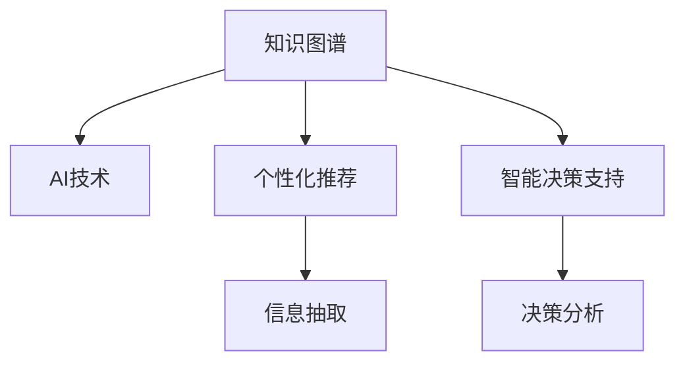

                 

# 知识管理的AI化展望:个性化知识服务和智能决策支持

> 关键词：知识图谱,AI技术,个性化推荐,智能决策,信息抽取

## 1. 背景介绍

随着信息技术的飞速发展，知识管理（Knowledge Management）已成为组织和个人获取、整理、应用和共享知识的重要手段。传统上，知识管理主要依赖人工收集、编辑和检索，难以应对大规模、快速变化的数据。然而，近年来，人工智能（AI）技术尤其是自然语言处理（NLP）和深度学习（DL）的突破，为知识管理带来了革命性的变化，开启了AI化（AI-ification）的全新视角。

AI化知识管理的核心思想在于：利用机器学习和大数据技术，自动化地从海量数据中挖掘、提炼和组织知识，并结合用户行为、需求和偏好，提供个性化、智能化的知识服务。这一过程不仅提升了知识获取的效率，还增强了知识的价值利用度，实现了从被动检索到主动推荐、从静态数据库到动态智能系统的重要转型。

## 2. 核心概念与联系

### 2.1 核心概念概述

- **知识图谱(Knowledge Graph)**：一种语义化的数据结构，用于表示实体和它们之间的关系，是知识管理的基础设施。
- **AI技术**：包括机器学习、深度学习、自然语言处理等技术，用于自动化地分析和理解知识，支持智能推荐和决策。
- **个性化推荐**：根据用户的历史行为和当前需求，动态生成最相关的知识推荐，满足用户的个性化需求。
- **智能决策支持**：通过分析复杂数据，结合领域专家知识和经验，辅助用户进行决策，提升决策的科学性和效率。
- **信息抽取(Information Extraction)**：从文本中自动提取出有用的信息，并结构化存储，便于检索和应用。

这些概念之间的关系可以通过以下Mermaid流程图来展示：



这个流程图展示了几者之间的联系：

1. 知识图谱提供结构化的知识结构，为AI技术分析和应用知识提供基础。
2. AI技术自动从海量数据中提取、分析知识，生成推荐和辅助决策。
3. 个性化推荐和智能决策支持利用AI技术，为用户提供精准的知识服务和决策支持。
4. 信息抽取是知识图谱和AI技术的基础，确保数据的准确性和可用性。

## 3. 核心算法原理 & 具体操作步骤

### 3.1 算法原理概述

AI化知识管理的核心算法主要基于知识图谱和深度学习技术，通过构建和训练模型，实现知识提取、分析和推荐。其核心步骤包括：

1. **数据采集与清洗**：从多源数据中采集知识，清洗噪声和重复数据，构建数据集。
2. **知识图谱构建**：将数据集转换为结构化的知识图谱，用图算法计算实体和关系权重。
3. **特征提取与嵌入**：通过深度学习模型将知识图谱中的实体和关系嵌入低维向量空间，提取特征。
4. **个性化推荐算法**：基于用户的互动历史，结合知识图谱中的信息，生成个性化推荐。
5. **智能决策算法**：结合领域专家的知识图谱，利用机器学习算法进行决策分析，生成推荐。

### 3.2 算法步骤详解

以下是AI化知识管理的主要操作步骤：

**Step 1: 数据采集与清洗**
- 收集多源数据，如新闻、学术论文、社交媒体等。
- 使用数据清洗工具去除噪声、重复和错误数据，保留高质量的知识源。

**Step 2: 知识图谱构建**
- 定义实体类型和关系类型，如人名、地点、事件、时间和因果关系等。
- 使用图算法计算实体和关系的权重，如PageRank、GCN等。
- 将数据映射为知识图谱，构建三元组或四元组，形成结构化的知识库。

**Step 3: 特征提取与嵌入**
- 设计神经网络模型，如GCN、GAT、TransE等，对知识图谱中的实体和关系进行嵌入。
- 使用图卷积网络、图注意力网络等方法，学习实体和关系的隐含特征。
- 利用BERT、GPT等模型，进一步提取实体的上下文语义信息。

**Step 4: 个性化推荐算法**
- 根据用户的行为数据（如浏览、点击、评分等），提取用户特征。
- 使用协同过滤、内容推荐等技术，结合知识图谱中的信息，生成个性化推荐。
- 结合召回和排序策略，提升推荐质量。

**Step 5: 智能决策算法**
- 定义决策目标，如市场分析、风险评估等。
- 提取相关实体的知识图谱信息，使用深度学习模型进行特征学习。
- 结合专家知识，使用决策树、神经网络等模型进行预测和评估。

### 3.3 算法优缺点

AI化知识管理有以下优点：
1. **高效自动化**：自动化地从大规模数据中提取、分析和应用知识，提升效率。
2. **精准推荐**：结合用户行为和知识图谱信息，提供高度个性化的知识推荐。
3. **智能决策**：结合专家知识和机器学习算法，生成更加科学、合理的决策。

但同时也存在以下局限性：
1. **数据质量依赖**：数据采集和清洗的准确性直接影响模型的性能。
2. **知识图谱构建复杂**：需要定义准确的知识类型和关系，构建高质量的知识图谱。
3. **模型复杂性高**：深度学习模型和图算法较复杂，需要大量计算资源。
4. **可解释性不足**：模型决策过程复杂，难以解释和调试。

### 3.4 算法应用领域

AI化知识管理在多个领域中得到广泛应用，例如：

- **金融领域**：利用知识图谱进行风险评估、市场分析、股票推荐等。
- **医疗领域**：通过知识图谱辅助诊断、药物研发、治疗方案推荐等。
- **教育领域**：提供个性化学习路径、推荐学习资源、评估学习效果等。
- **电子商务**：生成个性化商品推荐、广告投放策略、客户流失预测等。
- **政府和企业决策**：提供决策分析、政策评估、战略规划等服务。

## 4. 数学模型和公式 & 详细讲解 & 举例说明

### 4.1 数学模型构建

在AI化知识管理中，常用的数学模型包括知识图谱的表示模型、嵌入模型和推荐模型。以下以实体嵌入模型和推荐模型为例进行介绍。

**实体嵌入模型**：
- 目标：将实体表示为低维向量，便于模型处理和推荐。
- 模型：TransE、KG-GraphSAGE等。

**推荐模型**：
- 目标：基于用户历史行为和知识图谱信息，生成个性化推荐。
- 模型：协同过滤、基于内容的推荐、深度学习推荐等。

### 4.2 公式推导过程

以TransE模型为例，推导实体嵌入的过程。

**TransE模型**：
- 目标：将实体 $e$ 和关系 $r$ 表示为向量 $e^r$ 和 $r^e$。
- 公式：$h \rightarrow e \rightarrow t \Rightarrow e^r = h + r^e + \epsilon$。

其中 $h$ 为头实体向量，$t$ 为尾实体向量，$\epsilon$ 为噪声向量。通过最小化损失函数，如 $\mathcal{L} = \sum_{(h,r,t)}\|h + r^e + \epsilon - t\|^2$，可以学习到实体的嵌入向量。

**协同过滤模型**：
- 目标：基于用户的历史行为，预测未来行为。
- 公式：$\hat{y} = \alpha X^T w + b$。

其中 $X$ 为用户-物品矩阵，$w$ 为模型权重，$\alpha$ 为正则化参数。通过最大化均方误差损失函数 $\mathcal{L} = \frac{1}{N} \sum_{i=1}^N \sum_{j=1}^M (y_{ij} - \hat{y}_{ij})^2$，可以学习到用户偏好向量。

### 4.3 案例分析与讲解

以金融领域的信用风险评估为例，展示AI化知识管理的应用。

**数据采集与清洗**：
- 收集历史信用记录、市场数据、企业财务报表等数据。
- 使用数据清洗工具，去除缺失值、异常值等噪声数据。

**知识图谱构建**：
- 定义实体类型，如企业、个人、产品等。
- 定义关系类型，如信贷、投资、交易等。
- 构建知识图谱，存储三元组，形成结构化的知识库。

**特征提取与嵌入**：
- 使用GCN模型对知识图谱进行嵌入，学习实体的特征向量。
- 利用BERT模型提取实体的上下文语义信息。

**个性化推荐算法**：
- 根据用户的历史信用记录，提取用户特征。
- 使用协同过滤算法，结合知识图谱中的信用关系，生成个性化推荐。
- 结合召回和排序策略，提升推荐质量。

**智能决策算法**：
- 定义决策目标，如评估信用风险。
- 提取相关实体的知识图谱信息，使用深度学习模型进行特征学习。
- 结合专家知识，使用决策树模型进行预测和评估。

## 5. 项目实践：代码实例和详细解释说明

### 5.1 开发环境搭建

在进行AI化知识管理实践前，我们需要准备好开发环境。以下是使用Python进行TensorFlow开发的环境配置流程：

1. 安装Anaconda：从官网下载并安装Anaconda，用于创建独立的Python环境。

2. 创建并激活虚拟环境：
```bash
conda create -n tf-env python=3.8 
conda activate tf-env
```

3. 安装TensorFlow：根据CUDA版本，从官网获取对应的安装命令。例如：
```bash
conda install tensorflow -c conda-forge
```

4. 安装PyTorch：
```bash
pip install torch torchvision torchaudio
```

5. 安装Keras：
```bash
pip install keras
```

6. 安装其他依赖：
```bash
pip install pandas matplotlib jupyter notebook
```

完成上述步骤后，即可在`tf-env`环境中开始AI化知识管理的实践。

### 5.2 源代码详细实现

下面我们以推荐系统为例，给出使用TensorFlow进行AI化知识管理的代码实现。

```python
import tensorflow as tf
import numpy as np
from tensorflow.keras.layers import Input, Dense, Embedding, Flatten
from tensorflow.keras.models import Model
from tensorflow.keras.optimizers import Adam
from tensorflow.keras.preprocessing import sequence

# 定义模型参数
embedding_dim = 100
hidden_dim = 128
epochs = 10

# 加载数据集
with open('data/data.txt', 'r') as f:
    data = f.read().splitlines()

# 数据预处理
user_ids = [int(x.split()[0]) for x in data]
item_ids = [int(x.split()[1]) for x in data]
ratings = [float(x.split()[2]) for x in data]

# 数据嵌入
user_ids = np.array(user_ids, dtype=np.int32)
item_ids = np.array(item_ids, dtype=np.int32)
ratings = np.array(ratings, dtype=np.float32)

# 定义模型结构
user_input = Input(shape=(1,))
item_input = Input(shape=(1,))
rating = Input(shape=(1,))

# 嵌入层
user_embedding = Embedding(input_dim=len(user_ids), output_dim=embedding_dim)(user_input)
item_embedding = Embedding(input_dim=len(item_ids), output_dim=embedding_dim)(item_input)

# 全连接层
user_features = Flatten()(user_embedding)
item_features = Flatten()(item_embedding)

# 融合层
concat = tf.keras.layers.concatenate([user_features, item_features, rating])
output = Dense(hidden_dim, activation='relu')(concat)

# 输出层
output = Dense(1, activation='sigmoid')(output)

# 定义模型
model = Model(inputs=[user_input, item_input, rating], outputs=output)

# 编译模型
model.compile(optimizer=Adam(lr=0.001), loss='binary_crossentropy', metrics=['accuracy'])

# 训练模型
model.fit([user_ids, item_ids, ratings], ratings, epochs=epochs, batch_size=32)
```

### 5.3 代码解读与分析

让我们再详细解读一下关键代码的实现细节：

**数据预处理**：
- 从数据文件中读取用户ID、物品ID和评分。
- 使用NumPy库进行数组转换和数值处理。

**模型定义**：
- 使用Keras框架定义输入层、嵌入层、全连接层和输出层。
- 定义模型的损失函数和优化器。
- 使用模型编译函数进行模型构建和编译。

**模型训练**：
- 使用Keras框架的fit函数进行模型训练。
- 设置训练轮数和批次大小。

以上代码展示了使用TensorFlow进行个性化推荐系统的构建。可以看到，TensorFlow的Keras框架简化了模型的构建和训练过程，使得开发者可以更加专注于模型设计和优化。

## 6. 实际应用场景

### 6.1 智慧医疗

AI化知识管理在智慧医疗领域的应用非常广泛。通过构建疾病知识图谱和医疗知识图谱，结合患者的电子病历、医学影像等数据，可以实现智能诊断、治疗方案推荐、药品推荐等。

例如，在智能诊断中，可以使用知识图谱辅助医生进行疾病诊断。通过分析患者的症状、病史和检验结果，结合知识图谱中的疾病和症状关系，生成可能的诊断结果，辅助医生进行诊断决策。在治疗方案推荐中，根据患者的病情和治疗历史，结合知识图谱中的治疗关系和药物信息，推荐合适的治疗方案和药物。

### 6.2 智能制造

在智能制造领域，AI化知识管理可以帮助企业实现智能生产、供应链优化和设备维护。通过构建设备知识图谱和生产知识图谱，结合设备状态数据和生产数据，可以实现设备故障预测、生产流程优化、维护计划制定等。

例如，在设备故障预测中，根据设备的历史运行数据和知识图谱中的设备关系，预测设备的故障发生时间和类型，提前进行维护，减少停机时间。在生产流程优化中，根据生产数据和知识图谱中的生产关系，优化生产流程，提高生产效率和质量。

### 6.3 智能金融

在智能金融领域，AI化知识管理可以帮助银行进行风险评估、金融产品推荐和投资分析。通过构建金融知识图谱和市场知识图谱，结合客户的历史交易数据和市场数据，可以实现信用评估、金融产品推荐和投资分析等。

例如，在信用评估中，根据客户的交易历史和知识图谱中的信用关系，评估客户的信用风险，决定是否贷款或提供信用额度。在金融产品推荐中，根据客户的历史交易数据和知识图谱中的金融产品关系，推荐适合的金融产品。

### 6.4 未来应用展望

随着AI化知识管理技术的不断发展和应用场景的不断扩展，其未来应用前景将更加广阔。未来，AI化知识管理将更加注重以下几个方面：

1. **多模态融合**：结合文本、图像、语音等多模态数据，实现更全面的知识抽取和应用。
2. **实时更新**：知识图谱和推荐模型可以实时更新，及时反映最新知识和用户需求。
3. **个性化定制**：结合用户的个性化需求和行为数据，提供更加精准的个性化推荐和服务。
4. **跨领域应用**：将AI化知识管理应用于更多领域，如教育、交通、能源等，实现领域之间的协同和智能化。
5. **联邦学习**：结合分布式计算和联邦学习技术，保护数据隐私的同时，提升知识管理的效率和效果。

总之，AI化知识管理将逐步成为智能系统的核心组件，推动各行业数字化、智能化进程，为人类社会带来更多的价值和便利。

## 7. 工具和资源推荐

### 7.1 学习资源推荐

为了帮助开发者系统掌握AI化知识管理的理论基础和实践技巧，这里推荐一些优质的学习资源：

1. **《深度学习》by Ian Goodfellow**：涵盖了深度学习的基本概念、算法和应用，适合了解AI化知识管理的基础知识。
2. **《自然语言处理综论》by Christopher Manning**：介绍了自然语言处理的经典技术和应用，包括知识图谱和推荐系统。
3. **Kaggle平台**：提供了大量数据集和比赛，适合实战练习和知识积累。
4. **Coursera平台**：提供了多门深度学习和知识图谱的课程，涵盖理论基础和实践应用。
5. **Arxiv预印本网站**：收集了大量的前沿研究论文，适合跟踪最新进展和技术突破。

通过对这些资源的学习实践，相信你一定能够快速掌握AI化知识管理的精髓，并用于解决实际的NLP问题。

### 7.2 开发工具推荐

高效的开发离不开优秀的工具支持。以下是几款用于AI化知识管理开发的常用工具：

1. **TensorFlow**：由Google主导开发的深度学习框架，生产部署方便，适合大规模工程应用。
2. **Keras**：基于TensorFlow的高级API，提供了简单易用的接口，适合快速迭代研究。
3. **PyTorch**：灵活的动态计算图框架，适合快速原型开发和模型研究。
4. **Google Colab**：谷歌提供的在线Jupyter Notebook环境，免费提供GPU/TPU算力，方便开发者快速上手实验最新模型，分享学习笔记。
5. **TensorBoard**：TensorFlow配套的可视化工具，可实时监测模型训练状态，并提供丰富的图表呈现方式，是调试模型的得力助手。
6. **Weights & Biases**：模型训练的实验跟踪工具，可以记录和可视化模型训练过程中的各项指标，方便对比和调优。

合理利用这些工具，可以显著提升AI化知识管理的开发效率，加快创新迭代的步伐。

### 7.3 相关论文推荐

AI化知识管理的发展源于学界的持续研究。以下是几篇奠基性的相关论文，推荐阅读：

1. **Knowledge Graph Embeddings**：提出知识图谱的嵌入方法，将实体和关系表示为低维向量。
2. **Collaborative Filtering for Implicit Feedback Datasets**：提出协同过滤算法，基于用户的历史行为，生成个性化推荐。
3. **Structural Deep Embedding Learning for Knowledge Graphs**：提出深度学习模型，结合知识图谱，学习实体的隐含特征。
4. **Latent Feature Models for Collective Question Answering**：提出深度学习模型，结合知识图谱，进行问题解答。
5. **Deep Neural Networks for Event Extraction from News**：提出深度学习模型，结合知识图谱，进行事件抽取。

这些论文代表了大语言模型微调技术的发展脉络。通过学习这些前沿成果，可以帮助研究者把握学科前进方向，激发更多的创新灵感。

## 8. 总结：未来发展趋势与挑战

### 8.1 总结

本文对AI化知识管理方法进行了全面系统的介绍。首先阐述了AI化知识管理的研究背景和意义，明确了其在提高知识获取效率、增强知识利用度方面的重要价值。其次，从原理到实践，详细讲解了AI化知识管理的数学模型和关键步骤，给出了代码实例和详细解释。同时，本文还广泛探讨了AI化知识管理在多个行业领域的应用前景，展示了其广阔的适用性和应用潜力。最后，本文精选了学习资源和开发工具，力求为读者提供全方位的技术指引。

通过本文的系统梳理，可以看到，AI化知识管理正在成为各行业智能化转型中不可或缺的重要技术，其高效自动化、精准推荐和智能决策的特点，将为知识管理的未来发展带来深远影响。

### 8.2 未来发展趋势

展望未来，AI化知识管理技术将呈现以下几个发展趋势：

1. **多模态融合**：结合文本、图像、语音等多模态数据，实现更全面的知识抽取和应用。
2. **实时更新**：知识图谱和推荐模型可以实时更新，及时反映最新知识和用户需求。
3. **个性化定制**：结合用户的个性化需求和行为数据，提供更加精准的个性化推荐和服务。
4. **跨领域应用**：将AI化知识管理应用于更多领域，如教育、交通、能源等，实现领域之间的协同和智能化。
5. **联邦学习**：结合分布式计算和联邦学习技术，保护数据隐私的同时，提升知识管理的效率和效果。

以上趋势凸显了AI化知识管理技术的广阔前景。这些方向的探索发展，必将进一步提升各行业的信息化水平，为人类社会带来更多的价值和便利。

### 8.3 面临的挑战

尽管AI化知识管理技术已经取得了显著进展，但在迈向更加智能化、普适化应用的过程中，仍面临诸多挑战：

1. **数据质量和完整性**：数据采集和清洗的准确性和完整性直接影响模型的性能。
2. **知识图谱构建复杂**：需要定义准确的知识类型和关系，构建高质量的知识图谱。
3. **模型复杂性高**：深度学习模型和图算法较复杂，需要大量计算资源。
4. **可解释性不足**：模型决策过程复杂，难以解释和调试。
5. **隐私和安全**：保护用户数据隐私和安全，防止模型滥用。

### 8.4 研究展望

面对AI化知识管理所面临的挑战，未来的研究需要在以下几个方面寻求新的突破：

1. **数据质量提升**：采用数据清洗和补全技术，提升数据的质量和完整性。
2. **知识图谱自动化**：开发自动化的知识图谱构建工具，提高构建效率和质量。
3. **轻量化模型**：开发轻量化模型和算法，减少计算资源消耗，提升推理效率。
4. **可解释性增强**：结合符号逻辑和可解释性工具，增强模型的可解释性。
5. **隐私保护技术**：开发隐私保护技术，确保数据隐私和安全。

这些研究方向将有助于进一步提升AI化知识管理技术的实用性和可靠性，为各行业的智能化发展提供有力支持。

## 9. 附录：常见问题与解答

**Q1：AI化知识管理是否适用于所有领域？**

A: AI化知识管理在大多数领域中都能取得不错的效果，特别是对于数据量较大的领域。但对于一些特定领域的知识管理，如法律、金融等，可能存在一定的局限性。在实际应用中，需要根据领域特性进行模型设计和优化。

**Q2：AI化知识管理的训练数据质量如何保证？**

A: AI化知识管理的训练数据质量直接影响模型的性能。建议从多个可信来源收集数据，进行数据清洗和预处理，去除噪声和异常值。同时，可以采用数据增强和数据扩充技术，提升数据的多样性和数量。

**Q3：如何评估AI化知识管理的模型效果？**

A: 评估AI化知识管理模型效果时，可以使用多种指标，如准确率、召回率、F1-score等。同时，可以结合领域专家的意见，进行主观评价和反馈。在实际应用中，还需要注意模型的可解释性和鲁棒性，确保模型输出的合理性和稳定性。

**Q4：AI化知识管理的模型如何实时更新？**

A: 为了实现AI化知识管理的实时更新，可以采用增量学习、在线学习等技术，使得模型能够不断从新数据中学习，保持最新的知识状态。同时，可以设计多线程、分布式计算等方案，提高模型更新效率。

**Q5：AI化知识管理的可解释性如何提升？**

A: 提升AI化知识管理的可解释性，可以从模型设计、数据处理、结果展示等多个环节入手。例如，在模型设计中，可以采用符号逻辑、规则库等手段，增强模型的可解释性。在数据处理中，可以记录和存储模型的输入和输出，方便事后分析和解释。在结果展示中，可以提供直观的图表和报告，帮助用户理解模型的决策过程。

总之，AI化知识管理技术将在多个领域中发挥重要作用，未来还需不断探索和优化，提升其应用效果和可解释性，为人类社会的智能化发展提供有力支持。

---

作者：禅与计算机程序设计艺术 / Zen and the Art of Computer Programming

