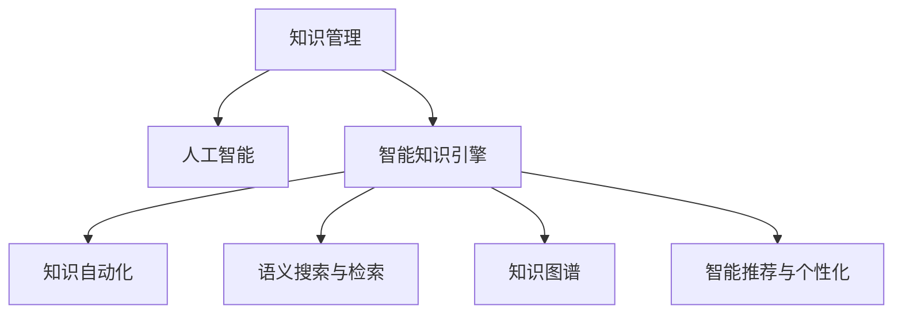

                 

# 知识管理的AI化未来:智能知识引擎和知识自动化

> 关键词：知识管理,人工智能,智能知识引擎,知识自动化,自然语言处理,知识图谱,语义搜索,机器学习

## 1. 背景介绍

### 1.1 问题由来
随着互联网和信息技术的高速发展，知识管理（Knowledge Management, KM）已成为企业和社会管理的核心内容之一。然而，传统基于人工操作的知识管理方式效率低下，且容易出错。与此同时，人工智能（AI）技术的突破，尤其是自然语言处理（Natural Language Processing, NLP）和机器学习（Machine Learning, ML）技术，为知识管理的智能化提供了新的可能性。

### 1.2 问题核心关键点
人工智能技术在知识管理中的应用，主要体现在以下几个关键点：

- **智能知识引擎**：利用AI技术，构建高效、自动化的知识引擎，自动化地获取、存储、分析和检索知识。
- **知识自动化**：通过自动化工具，将人工操作的知识管理任务，转化为机器能够自动处理的任务。
- **语义搜索与检索**：利用NLP技术，提高知识检索的准确性和效率，实现语义级别的知识理解和匹配。
- **知识图谱**：构建知识图谱，将结构化数据与半结构化数据关联，形成可推理的知识体系。
- **智能推荐与个性化**：利用ML技术，实现对用户查询的智能推荐，提高用户获取知识的效率。

本文将围绕这些关键点，探讨如何利用AI技术，推动知识管理的AI化发展，构建智能化、自动化的知识管理系统。

## 2. 核心概念与联系

### 2.1 核心概念概述

为更好地理解AI化知识管理，本节将介绍几个核心概念：

- **知识管理**：指对组织中的知识进行获取、存储、检索、共享、应用的过程，旨在提高组织的学习能力和创新能力。
- **人工智能**：通过计算机系统模拟人类智能活动，实现问题的自动化解决，包括但不限于NLP、ML、CV（计算机视觉）等技术。
- **智能知识引擎**：结合NLP和ML技术，构建自动化、智能化的知识获取、存储和检索系统。
- **知识自动化**：将知识管理任务自动化，通过AI技术处理大量数据，实现高效的知识管理。
- **语义搜索与检索**：利用NLP技术，实现语义级别的信息检索，提高知识获取的准确性和效率。
- **知识图谱**：将知识结构化，形成可推理的知识图谱，支持更高级的知识应用和推理。
- **智能推荐与个性化**：通过ML技术，对用户查询和行为进行分析，实现个性化知识推荐。

这些核心概念之间的逻辑关系可以通过以下Mermaid流程图来展示：



这个流程图展示了一些核心概念及其之间的关系：

1. 知识管理是人工智能在知识领域的应用场景。
2. 智能知识引擎是知识管理的核心工具，通过AI技术实现智能化。
3. 知识自动化、语义搜索与检索、知识图谱和智能推荐与个性化，都是智能知识引擎的重要组成部分。

## 3. 核心算法原理 & 具体操作步骤
### 3.1 算法原理概述

AI化知识管理的核心在于构建智能化的知识引擎，利用AI技术自动化地处理知识管理任务。其核心思想是：

1. **知识获取**：通过爬虫、API调用等方式，自动获取互联网上的知识。
2. **知识存储**：将获取的知识进行结构化存储，便于后续检索和应用。
3. **知识检索**：利用NLP技术，实现语义级别的知识检索，提高检索的准确性和效率。
4. **知识应用**：通过知识图谱和ML技术，实现知识的应用和推理，支持更高级的决策支持。
5. **智能推荐**：利用ML技术，对用户查询和行为进行分析，实现个性化的知识推荐。

### 3.2 算法步骤详解

构建AI化知识引擎的过程，一般包括以下几个关键步骤：

**Step 1: 数据采集与预处理**
- 使用爬虫技术，从互联网、数据库、文献库等渠道自动采集知识数据。
- 对采集到的数据进行清洗、去重、标注等预处理操作，确保数据质量。

**Step 2: 知识存储与构建**
- 使用结构化数据库或NoSQL数据库，对处理后的知识数据进行存储。
- 利用知识图谱技术，将知识数据转换为可推理的知识图谱，支持高级推理和应用。

**Step 3: 知识检索与语义分析**
- 利用NLP技术，对用户查询进行分词、命名实体识别、句法分析等处理。
- 通过匹配知识图谱，实现语义级别的检索，提高检索的准确性和效率。

**Step 4: 智能推荐与个性化**
- 利用ML技术，对用户的历史行为、偏好等进行分析，构建用户画像。
- 根据用户画像和当前查询，进行个性化推荐，提高用户获取知识的效率。

**Step 5: 系统集成与部署**
- 将各个模块集成到统一的知识管理平台中，实现知识的自动获取、存储、检索和推荐。
- 部署系统到服务器，并配置监控、告警等自动化管理工具，确保系统稳定运行。

### 3.3 算法优缺点

AI化知识管理的优点在于：

1. **高效性**：通过自动化处理，大幅提高了知识管理的效率，减少了人工操作的时间和成本。
2. **准确性**：利用NLP和ML技术，提高了知识检索和推荐的准确性，减少了错误率。
3. **个性化**：通过个性化推荐，提高了用户获取知识的效率，增强了用户体验。
4. **可扩展性**：基于模块化的设计，可以根据需求添加或扩展新的功能模块，支持未来的技术升级和应用扩展。

同时，这种基于AI的知识管理方法也存在一些缺点：

1. **数据质量依赖**：AI化知识管理的效果很大程度上依赖于数据的质量和数量。
2. **技术复杂性**：需要掌握NLP、ML等技术，开发和维护难度较大。
3. **成本投入**：初期需要投入大量的硬件和软件资源，成本较高。
4. **模型泛化能力**：模型在不同领域和不同场景下的泛化能力有待提高。
5. **安全性**：在自动化处理和推荐过程中，数据隐私和安全问题需要特别注意。

尽管存在这些缺点，但AI化知识管理作为一种先进的技术手段，已经在诸多领域得到了广泛应用，取得了显著的效果。

### 3.4 算法应用领域

AI化知识管理在多个领域中得到了应用，以下是几个典型的应用场景：

- **企业知识管理**：企业内部知识的自动化管理，提高工作效率和创新能力。
- **图书馆知识管理**：图书馆自动化文献管理、检索和推荐，提升服务质量。
- **医疗知识管理**：医院内部的医学知识管理，辅助医生诊疗，提高诊断准确性。
- **金融知识管理**：金融机构内部的知识自动化处理，支持投资决策和风险管理。
- **教育知识管理**：教育机构的知识自动化管理，提升教学效果和研究水平。

## 4. 数学模型和公式 & 详细讲解  
### 4.1 数学模型构建

构建AI化知识引擎的数学模型，主要涉及以下几个方面：

1. **知识图谱构建**：将知识数据转换为三元组形式，即主语-谓语-宾语结构，形成可推理的知识图谱。
2. **知识检索与推荐**：利用NLP技术和ML模型，对用户查询进行语义分析，匹配知识图谱中的实体和关系。

### 4.2 公式推导过程

**知识图谱构建公式**：
- **实体识别**：通过NLP技术，对文本进行命名实体识别，识别出实体和属性。
- **关系抽取**：通过NLP技术，从文本中抽取实体之间的关系，形成三元组。
- **知识图谱存储**：将三元组存储到图数据库中，支持高效的查询和推理。

**知识检索公式**：
- **语义匹配**：将用户查询转换为向量形式，与知识图谱中的实体和关系进行匹配。
- **深度学习模型**：利用Transformer等深度学习模型，实现语义级别的检索，提高检索准确性。

**知识推荐公式**：
- **协同过滤**：基于用户的历史行为和相似用户的行为，进行知识推荐。
- **基于内容的推荐**：利用知识内容的相似性，进行知识推荐。
- **混合推荐**：结合协同过滤和基于内容的推荐，进行综合推荐。

### 4.3 案例分析与讲解

以一个基于知识图谱的图书推荐系统为例，分析其实现过程和优化策略。

**知识图谱构建**：
- 收集图书信息，提取作者、出版社、出版日期、关键词等信息。
- 利用命名实体识别技术，将信息转换为实体和关系。
- 将实体和关系存储到图数据库中，形成知识图谱。

**知识检索**：
- 用户输入查询，例如“推荐一本关于人工智能的书”。
- 利用NLP技术，对查询进行分词和命名实体识别。
- 在知识图谱中匹配实体和关系，找到相关的书籍。
- 利用深度学习模型，对匹配结果进行排序，推荐最相关的书籍。

**知识推荐**：
- 收集用户的历史行为，如浏览、购买、评分等。
- 利用协同过滤算法，找到与用户行为相似的其他用户。
- 基于相似用户的推荐结果，进行个性化推荐。

**系统优化**：
- 对知识图谱进行定期更新，保证知识的准确性和时效性。
- 优化NLP和深度学习模型的参数，提高检索和推荐的准确性。
- 引入推荐算法的多样性，结合多种推荐方式，提高推荐效果。

## 5. 项目实践：代码实例和详细解释说明
### 5.1 开发环境搭建

在进行知识管理系统的开发前，需要准备好开发环境。以下是使用Python进行开发的环境配置流程：

1. 安装Anaconda：从官网下载并安装Anaconda，用于创建独立的Python环境。

2. 创建并激活虚拟环境：
```bash
conda create -n knowledge-env python=3.8 
conda activate knowledge-env
```

3. 安装必要的Python包：
```bash
pip install tensorflow tensorflow-hub transformers elasticsearch
```

4. 安装ELK（Elasticsearch、Logstash、Kibana）：用于日志管理和数据可视化。
```bash
# 安装Elasticsearch
sudo apt-get install elasticsearch
# 安装Logstash
sudo apt-get install logstash
# 安装Kibana
sudo apt-get install kibana
```

完成上述步骤后，即可在`knowledge-env`环境中开始开发知识管理系统。

### 5.2 源代码详细实现

下面是一个基于Python和TensorFlow的知识管理系统实现，主要包括数据采集、知识存储、知识检索和推荐模块。

**数据采集模块**：
```python
import requests
from bs4 import BeautifulSoup

def fetch_data(url):
    response = requests.get(url)
    if response.status_code == 200:
        soup = BeautifulSoup(response.content, 'html.parser')
        # 提取需要的信息，如作者、出版社、出版日期、关键词等
        # 存储到数据库中
```

**知识存储模块**：
```python
import tensorflow_hub as hub

def store_data(data):
    # 构建知识图谱，存储到图数据库中
    # 使用Elasticsearch作为图数据库
```

**知识检索模块**：
```python
import tensorflow as tf
from transformers import TFAutoModelForMaskedLM

def search(query, graph):
    # 将查询转换为向量形式
    # 在知识图谱中匹配实体和关系
    # 利用深度学习模型进行语义匹配
    # 返回匹配结果
```

**知识推荐模块**：
```python
import pandas as pd

def recommend(query, graph):
    # 收集用户的历史行为
    # 利用协同过滤算法，找到相似用户
    # 基于相似用户的推荐结果，进行个性化推荐
    # 返回推荐结果
```

### 5.3 代码解读与分析

让我们再详细解读一下关键代码的实现细节：

**数据采集模块**：
- 使用`requests`库进行网页抓取，获取网页内容。
- 使用`BeautifulSoup`库对网页内容进行解析，提取需要的信息。
- 存储到数据库中，可以使用Elasticsearch等图数据库。

**知识存储模块**：
- 使用TensorFlow Hub进行模型加载和训练。
- 将提取的知识信息转换为知识图谱，存储到Elasticsearch等图数据库中。

**知识检索模块**：
- 将查询转换为向量形式，利用NLP技术进行语义分析。
- 在知识图谱中匹配实体和关系，利用深度学习模型进行语义匹配。
- 返回匹配结果，可以使用Elasticsearch进行高效的查询和排序。

**知识推荐模块**：
- 收集用户的历史行为数据，利用协同过滤算法找到相似用户。
- 基于相似用户的推荐结果，进行个性化推荐。
- 使用Pandas库进行数据处理和分析，提高推荐效果。

**系统集成与部署**：
- 将各个模块集成到统一的知识管理平台中，可以使用Django等Web框架。
- 部署系统到服务器，使用Elasticsearch进行高效的检索和推荐。
- 配置监控、告警等自动化管理工具，确保系统稳定运行。

## 6. 实际应用场景
### 6.1 智能客服系统

基于AI化知识管理的智能客服系统，可以显著提升客户服务质量。通过自动化的知识检索和推荐，智能客服可以更快地理解用户问题，提供准确的回答，提高用户满意度。

在技术实现上，可以构建企业内部的知识库，将常见问题和答案构建成监督数据，在此基础上对预训练语言模型进行微调。微调后的模型能够自动理解用户意图，匹配最合适的答案模板进行回复。对于客户提出的新问题，还可以接入检索系统实时搜索相关内容，动态组织生成回答。

### 6.2 金融知识管理

金融知识管理可以帮助金融机构提高信息获取和决策效率。通过构建金融知识图谱，将金融市场数据、金融产品信息、金融法规等知识进行结构化，形成可推理的知识体系。利用AI化知识引擎，可以自动化地获取市场动态、分析风险和收益，支持投资决策和风险管理。

在实现上，可以构建金融知识图谱，利用TensorFlow和Elasticsearch等工具进行自动化处理和检索。通过定期更新知识图谱，保证知识的准确性和时效性。利用NLP和ML技术，对用户查询进行语义分析和匹配，实现个性化的知识推荐。

### 6.3 图书馆知识管理

图书馆知识管理可以提高服务质量和用户体验。通过构建图书馆知识图谱，将书籍、作者、出版社等知识进行结构化，形成可推理的知识体系。利用AI化知识引擎，可以自动化地获取用户查询，推荐相关书籍和资料。

在实现上，可以构建图书馆知识图谱，利用TensorFlow和Elasticsearch等工具进行自动化处理和检索。通过定期更新知识图谱，保证知识的准确性和时效性。利用NLP和ML技术，对用户查询进行语义分析和匹配，实现个性化的知识推荐。

### 6.4 未来应用展望

随着AI化知识管理技术的不断发展，其在更多领域中的应用前景也将愈发广阔。

在智慧医疗领域，AI化知识管理可以帮助医疗机构提高诊疗效率，支持医学知识检索和推荐，辅助医生进行诊断和治疗决策。

在智能教育领域，AI化知识管理可以辅助教师进行教学资源管理，支持学生自主学习，提供个性化的知识推荐。

在智慧城市治理中，AI化知识管理可以辅助城市管理部门进行数据分析和决策支持，提高城市管理的智能化水平。

此外，在企业生产、社会治理、文娱传媒等众多领域，AI化知识管理也将不断涌现，为各行各业带来变革性的影响。相信随着技术的日益成熟，AI化知识管理必将在构建智能知识生态系统中扮演越来越重要的角色。

## 7. 工具和资源推荐
### 7.1 学习资源推荐

为了帮助开发者系统掌握AI化知识管理理论基础和实践技巧，这里推荐一些优质的学习资源：

1. 《AI化知识管理：原理与实践》系列博文：由大模型技术专家撰写，深入浅出地介绍了AI化知识管理原理、技术实现和应用场景。

2. 《知识图谱：原理与构建》课程：斯坦福大学开设的课程，系统讲解了知识图谱的构建、查询和应用。

3. 《NLP与深度学习》书籍：涵盖NLP和深度学习基础，结合实际案例，帮助读者深入理解AI化知识管理的实现。

4. TensorFlow官方文档：提供丰富的TensorFlow资源和样例代码，助力读者实践和应用。

5. Elasticsearch官方文档：提供Elasticsearch的详细文档和教程，帮助读者构建和优化知识图谱。

通过对这些资源的学习实践，相信你一定能够快速掌握AI化知识管理的精髓，并用于解决实际的NLP问题。

### 7.2 开发工具推荐

高效的开发离不开优秀的工具支持。以下是几款用于AI化知识管理开发的常用工具：

1. Python：开源编程语言，支持广泛的科学计算和数据处理库。
2. TensorFlow：由Google主导开发的开源深度学习框架，支持高效的神经网络构建和训练。
3. TensorFlow Hub：提供预训练模型和组件，方便开发者快速搭建模型。
4. Elasticsearch：高性能的分布式搜索引擎，支持高效的知识图谱存储和检索。
5. Kibana：开源的Elasticsearch可视化工具，支持数据的实时监控和分析。

合理利用这些工具，可以显著提升AI化知识管理系统的开发效率，加快创新迭代的步伐。

### 7.3 相关论文推荐

AI化知识管理的发展源于学界的持续研究。以下是几篇奠基性的相关论文，推荐阅读：

1. 《知识图谱的构建与应用》：介绍知识图谱的基本原理和构建方法，涵盖图数据库、实体识别、关系抽取等技术。
2. 《基于深度学习的语义检索》：利用深度学习技术，提高语义检索的准确性和效率。
3. 《协同过滤推荐算法》：介绍协同过滤算法的原理和实现，支持个性化推荐。
4. 《混合推荐系统》：结合多种推荐算法，实现综合推荐，提高推荐效果。

这些论文代表了大规模知识管理系统的研究进展，通过学习这些前沿成果，可以帮助研究者把握学科前进方向，激发更多的创新灵感。

## 8. 总结：未来发展趋势与挑战
### 8.1 总结

本文对AI化知识管理进行了全面系统的介绍。首先阐述了AI化知识管理的研究背景和意义，明确了其在知识管理和智能系统中发挥的重要作用。其次，从原理到实践，详细讲解了AI化知识管理的数学模型和核心算法，给出了知识管理系统开发的完整代码实例。同时，本文还广泛探讨了AI化知识管理在智能客服、金融知识管理、图书馆知识管理等多个行业领域的应用前景，展示了AI化知识管理的巨大潜力。此外，本文精选了AI化知识管理的各类学习资源，力求为读者提供全方位的技术指引。

通过本文的系统梳理，可以看到，AI化知识管理技术正在成为知识管理领域的重要范式，极大地拓展了知识管理的智能化边界，催生了更多的落地场景。受益于大规模数据和算力的支持，AI化知识管理在多个领域中取得了显著效果，为知识管理系统的优化和升级提供了新思路和新方法。未来，伴随AI技术的持续演进，AI化知识管理必将在构建人机协同的智能知识生态系统中扮演越来越重要的角色。

### 8.2 未来发展趋势

展望未来，AI化知识管理将呈现以下几个发展趋势：

1. **知识图谱的普及**：随着知识图谱技术的不断成熟，其应用将更加广泛，覆盖更多领域和应用场景。

2. **语义检索与推荐**：基于深度学习和NLP技术的语义检索与推荐，将不断提高知识获取和推荐的准确性和效率。

3. **跨领域知识融合**：不同领域知识的融合与关联，将推动跨领域知识的自动化管理和高效应用。

4. **智能推荐系统**：个性化推荐系统将更加智能和高效，能够根据用户行为和偏好，实现精准的个性化推荐。

5. **多模态知识管理**：结合文本、图像、视频等多模态数据的知识管理，将增强知识的表达和理解能力。

6. **自动化知识发现**：自动化知识发现技术，将辅助用户发现和挖掘有价值的知识，减少人工操作。

这些趋势凸显了AI化知识管理技术的广阔前景。这些方向的探索发展，将进一步提升知识管理的智能化水平，为构建人机协同的智能知识生态系统提供新动力。

### 8.3 面临的挑战

尽管AI化知识管理技术已经取得了显著成就，但在迈向更加智能化、普适化应用的过程中，仍然面临诸多挑战：

1. **数据质量问题**：知识图谱的构建和维护需要高质量的数据，但数据的获取和标注成本较高。如何保证数据质量，是AI化知识管理面临的重要挑战。

2. **知识图谱的扩展性**：随着知识图谱的不断扩展，其复杂性和维护成本也将增加。如何提高知识图谱的可扩展性和可维护性，将是未来的一个难题。

3. **算力与存储成本**：AI化知识管理对算力和存储的要求较高，初期投入较大。如何降低成本，提高系统的可扩展性和性能，是亟待解决的问题。

4. **模型的泛化能力**：知识图谱和推荐模型的泛化能力有待提高，不同领域和场景下的应用效果不尽相同。如何提高模型的泛化能力，增强其在不同场景下的适应性，是未来的重要研究方向。

5. **安全性与隐私保护**：在知识管理和推荐过程中，如何保护数据隐私和安全，防止信息泄露和滥用，是AI化知识管理面临的重要挑战。

6. **知识图谱的更新与维护**：知识图谱需要定期更新和维护，以保持其时效性和准确性。如何高效地进行知识图谱的更新和维护，是实现知识管理自动化的关键。

这些挑战需要通过技术创新和理论突破，逐步克服。只有不断攻克这些难题，才能实现AI化知识管理的广泛应用和持续发展。

### 8.4 研究展望

面对AI化知识管理面临的挑战，未来的研究需要在以下几个方面寻求新的突破：

1. **知识图谱的自动化构建**：利用AI技术，自动构建高质量的知识图谱，减少人工操作。

2. **语义检索的深度学习优化**：利用深度学习技术，优化语义检索模型，提高检索的准确性和效率。

3. **推荐系统的多模态融合**：结合文本、图像、视频等多模态数据，提高推荐系统的表现。

4. **知识图谱的跨领域应用**：推动知识图谱在跨领域的应用，增强知识的普适性和可移植性。

5. **智能推荐系统的可解释性**：提高推荐系统的可解释性，增强用户对推荐结果的信任和理解。

6. **知识图谱的自动化更新**：利用AI技术，自动更新和维护知识图谱，保持其时效性和准确性。

这些研究方向将推动AI化知识管理技术的不断进步，为构建更加智能化、普适化的知识管理系统提供新思路和新方法。总之，AI化知识管理技术还需要与其他AI技术进行更深入的融合，如知识表示、因果推理、强化学习等，多路径协同发力，共同推动自然语言理解和智能交互系统的进步。只有勇于创新、敢于突破，才能不断拓展AI化知识管理的边界，让智能技术更好地造福人类社会。

## 9. 附录：常见问题与解答

**Q1：AI化知识管理对数据质量的要求是什么？**

A: AI化知识管理的效果很大程度上依赖于数据的质量和数量。高质量的数据可以确保知识图谱的准确性和完整性，提高知识检索和推荐的准确性。数据质量问题需要特别关注，特别是在初始阶段，需要投入大量人力和资源进行数据清洗和标注。

**Q2：如何保证知识图谱的可扩展性和可维护性？**

A: 知识图谱的扩展性和可维护性是AI化知识管理的关键问题。在构建知识图谱时，需要采用模块化的设计思路，便于后期的更新和扩展。同时，利用元数据和版本控制技术，记录知识图谱的更新历史，支持回溯和恢复。定期对知识图谱进行质量检查和优化，确保其时效性和准确性。

**Q3：如何降低AI化知识管理的成本投入？**

A: 降低AI化知识管理的成本，可以从以下几个方面入手：
1. 利用开源工具和技术，如TensorFlow、Elasticsearch等，降低开发和部署成本。
2. 优化算法和模型，提高算法的效率和精度，减少计算和存储成本。
3. 采用云计算和分布式计算技术，提高系统的可扩展性和资源利用率。
4. 采用模型压缩和稀疏化存储技术，减少存储和计算资源消耗。

**Q4：如何提高AI化知识管理的泛化能力？**

A: 提高AI化知识管理的泛化能力，可以从以下几个方面入手：
1. 增加数据的多样性和代表性，涵盖不同领域和场景的样本。
2. 利用多模态数据融合技术，增强模型的跨领域适应能力。
3. 引入因果分析和强化学习技术，增强模型的因果推理能力和泛化能力。
4. 在模型训练过程中，采用迁移学习、多任务学习等技术，提高模型的泛化能力。

**Q5：如何保护数据隐私和安全？**

A: 在AI化知识管理中，数据隐私和安全问题尤为重要。可以通过以下措施来保护数据隐私和安全：
1. 采用数据脱敏和匿名化技术，保护用户隐私。
2. 设置访问控制和权限管理，限制对敏感数据的访问。
3. 定期进行数据安全审计，及时发现和修补安全漏洞。
4. 采用加密技术和安全协议，保护数据传输和存储的安全性。

这些措施需要综合运用，才能保障AI化知识管理系统的安全性和可靠性。

---

作者：禅与计算机程序设计艺术 / Zen and the Art of Computer Programming

