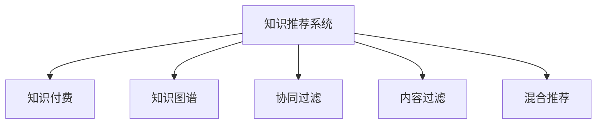

                 

# 知识经济下知识付费的人工智能知识推荐系统

## 1. 背景介绍

随着互联网的普及和信息技术的飞速发展，知识付费现象在全球范围内呈现出快速增长的趋势。知识付费不仅改变了人们的消费习惯，更推动了以内容为核心竞争力的知识经济时代的到来。面对海量的在线知识资源，如何从中找到真正有价值的知识，并以高效、精准的方式推荐给用户，成为知识付费平台亟需解决的问题。人工智能推荐系统作为这一问题的有效解决手段，引起了广泛的关注和研究。

## 2. 核心概念与联系

### 2.1 核心概念概述

为更好地理解人工智能知识推荐系统的原理和应用，本节将介绍几个关键概念：

- **知识推荐系统**：利用人工智能技术，通过对用户行为和知识内容的深度分析，为用户提供个性化、精准的知识推荐，从而提高用户满意度和学习效率。
- **知识付费**：用户为获取专业知识和深度见解而支付费用的模式，通常包含文章、视频、课程等形式的知识产品。
- **知识图谱**：以知识为节点、关系为边的图形结构，用于描述知识间的内在联系和层次关系。
- **协同过滤**：通过分析用户行为和物品属性，找出用户之间的相似性，从而推荐用户可能感兴趣的知识产品。
- **内容过滤**：基于知识内容的标签、摘要、分类等信息，通过特征相似度匹配，推荐用户可能感兴趣的知识内容。
- **混合推荐**：结合协同过滤和内容过滤的优点，综合考虑用户行为和内容特征，提供更全面、精准的推荐结果。

这些核心概念之间的关系可以通过以下Mermaid流程图来展示：



该流程图展示了知识推荐系统的核心组件及其相互关系：

1. 知识推荐系统是连接用户和知识内容的关键纽带。
2. 知识图谱用于描述知识之间的关联关系，帮助推荐系统理解知识内容的内在结构。
3. 协同过滤和内容过滤是推荐系统常用的两种推荐方法。
4. 混合推荐结合了两者的优点，提供了更为全面的推荐方案。

## 3. 核心算法原理 & 具体操作步骤
### 3.1 算法原理概述

人工智能知识推荐系统的核心算法原理主要是协同过滤和内容过滤。这些算法通过分析用户行为和知识内容，找到用户与物品之间的相似性，从而推荐可能感兴趣的知识产品。

**协同过滤算法**：
- **基于用户的协同过滤**：通过分析用户间的相似度，找出与当前用户兴趣相近的其他用户，推荐这些用户喜欢的知识产品。
- **基于物品的协同过滤**：通过分析物品间的相似度，找出与当前物品相似的其它物品，推荐给感兴趣的用户。

**内容过滤算法**：
- **基于用户兴趣**：分析用户的历史浏览记录、评分、评论等行为数据，提取用户的兴趣偏好，推荐与这些偏好相关的知识产品。
- **基于内容特征**：分析知识内容的关键词、分类、摘要等信息，通过特征匹配找到用户可能感兴趣的知识产品。

通过上述算法，知识推荐系统能够根据用户的行为和兴趣，动态调整推荐结果，提升用户的满意度和学习效率。

### 3.2 算法步骤详解

基于协同过滤和内容过滤的推荐系统，其核心步骤如下：

**Step 1: 数据预处理**
- 收集用户行为数据，包括浏览记录、评分、评论等。
- 收集知识内容数据，包括文本、标签、分类等。
- 将数据进行清洗和标准化处理，去除噪声和异常值。

**Step 2: 构建用户画像**
- 分析用户行为数据，提取用户兴趣和行为特征。
- 根据用户的兴趣和行为特征，构建用户画像。

**Step 3: 构建知识图谱**
- 分析知识内容数据，提取关键词、分类、摘要等信息。
- 使用知识图谱技术，将知识内容构建为图形结构，描述知识间的关联关系。

**Step 4: 协同过滤推荐**
- 根据用户画像，分析用户间的相似度。
- 分析知识间的相似度，推荐用户可能感兴趣的知识产品。
- 结合用户画像和知识图谱，综合考虑用户行为和内容特征，推荐可能感兴趣的知识产品。

**Step 5: 内容过滤推荐**
- 分析用户的历史行为数据，提取用户兴趣和行为特征。
- 分析知识内容的特征，提取关键词、分类、摘要等信息。
- 使用内容过滤算法，匹配用户兴趣和知识内容特征，推荐可能感兴趣的知识产品。

**Step 6: 混合推荐**
- 结合协同过滤和内容过滤的推荐结果，综合考虑用户行为和内容特征，推荐可能感兴趣的知识产品。
- 实时调整推荐结果，确保推荐的精准度和时效性。

### 3.3 算法优缺点

基于协同过滤和内容过滤的推荐系统具有以下优点：

1. **个性化推荐**：能够根据用户行为和兴趣，动态调整推荐结果，提高用户的满意度和学习效率。
2. **高效性**：算法简单，实现容易，处理速度较快，适用于大规模数据集。
3. **自适应性**：能够根据用户行为的变化，实时调整推荐策略，适应用户的动态变化。

同时，这些算法也存在一些缺点：

1. **数据稀疏性**：用户和知识产品数量较多，用户行为数据和知识内容特征可能较为稀疏。
2. **冷启动问题**：新用户和新知识产品没有足够的历史数据，难以进行有效的推荐。
3. **内容多样性**：用户可能对不同类型的知识产品有不同的兴趣，内容过滤算法难以全面覆盖。
4. **算法复杂性**：混合推荐算法需要同时处理协同过滤和内容过滤的结果，实现较为复杂。

## 4. 数学模型和公式 & 详细讲解 & 举例说明

### 4.1 数学模型构建

本节将使用数学语言对人工智能知识推荐系统的原理进行严格的刻画。

设用户集为 $U$，知识产品集为 $I$，用户 $u$ 对知识产品 $i$ 的评分向量为 $r_{ui}$，知识产品 $i$ 的特征向量为 $f_i$。则协同过滤算法的数学模型可以表示为：

$$
\hat{r}_{ui} = w_{iu}^T f_i + b_{iu}
$$

其中，$w_{iu}$ 为知识产品 $i$ 对用户 $u$ 的特征权重向量，$b_{iu}$ 为截距。

内容过滤算法的数学模型可以表示为：

$$
\hat{r}_{ui} = \sum_{k=1}^{K} a_{kui} c_{kij}
$$

其中，$a_{kui}$ 为用户 $u$ 对知识产品 $i$ 的第 $k$ 个特征的权重，$c_{kij}$ 为知识产品 $i$ 的第 $k$ 个特征的值。

### 4.2 公式推导过程

**协同过滤公式推导**：
设用户 $u$ 对知识产品 $i$ 的评分向量为 $r_{ui} = [r_{ui1}, r_{ui2}, \ldots, r_{uin}]$，知识产品 $i$ 的特征向量为 $f_i = [f_{i1}, f_{i2}, \ldots, f_{in}]$。则协同过滤算法中的用户和知识产品之间的相似度可以表示为：

$$
s_{iu} = \frac{\sum_{j=1}^{n} r_{uj} f_{ij}}{\sqrt{\sum_{j=1}^{n} f_{ij}^2 \sum_{j=1}^{n} r_{uj}^2}}
$$

根据用户之间的相似度，可以找出与用户 $u$ 兴趣相近的其他用户 $v$，从而推荐这些用户喜欢的知识产品。

**内容过滤公式推导**：
设用户 $u$ 对知识产品 $i$ 的评分向量为 $r_{ui} = [r_{ui1}, r_{ui2}, \ldots, r_{uin}]$，知识产品 $i$ 的特征向量为 $f_i = [f_{i1}, f_{i2}, \ldots, f_{in}]$。则内容过滤算法中的用户与知识产品之间的特征相似度可以表示为：

$$
s_{iu} = \sum_{k=1}^{K} a_{kui} c_{kij}
$$

其中，$a_{kui}$ 为用户 $u$ 对知识产品 $i$ 的第 $k$ 个特征的权重，$c_{kij}$ 为知识产品 $i$ 的第 $k$ 个特征的值。

通过计算用户与知识产品之间的相似度，可以推荐用户可能感兴趣的知识产品。

### 4.3 案例分析与讲解

以一个简单的例子来说明协同过滤和内容过滤的应用。

假设有一个知识推荐系统，包含 $N=5$ 个用户和 $M=3$ 个知识产品。用户的评分数据如下：

| 用户 | 知识产品1 | 知识产品2 | 知识产品3 |
|------|-----------|-----------|-----------|
| U1   | 5         | 3         | 2         |
| U2   | 4         | 4         | 5         |
| U3   | 3         | 2         | 4         |
| U4   | 2         | 5         | 3         |
| U5   | 1         | 5         | 2         |

知识产品的特征数据如下：

| 知识产品 | 特征1 | 特征2 | 特征3 |
|----------|-------|-------|-------|
| 1        | 0.8   | 0.7   | 0.6   |
| 2        | 0.9   | 0.5   | 0.4   |
| 3        | 0.7   | 0.8   | 0.9   |

**协同过滤案例**：
- 计算用户U1和U2之间的相似度：$s_{12} = \frac{5 \cdot 0.8 + 4 \cdot 0.9 + 3 \cdot 0.7}{\sqrt{5^2 \cdot 0.8^2 + 4^2 \cdot 0.9^2 + 3^2 \cdot 0.7^2}} = 0.94$
- 由于U2喜欢知识产品1和2，可以推荐U1喜欢知识产品1和2。

**内容过滤案例**：
- 计算知识产品1的特征向量为 $f_1 = [0.8, 0.7, 0.6]$，用户U1的特征向量为 $r_{U1} = [5, 3, 2]$。
- 根据内容过滤算法，计算用户U1对知识产品2的评分：$\hat{r}_{U1,2} = 0.8 \cdot 0.9 + 0.7 \cdot 0.5 + 0.6 \cdot 0.4 = 4.5$
- 由于U1喜欢知识产品1，可以推荐U1喜欢知识产品2。

## 5. 项目实践：代码实例和详细解释说明
### 5.1 开发环境搭建

在进行人工智能知识推荐系统的开发前，需要准备合适的开发环境。以下是使用Python和PyTorch进行推荐系统开发的常用环境配置流程：

1. 安装Python：从官网下载并安装Python，确保版本为3.6以上。

2. 安装PyTorch：使用pip命令安装PyTorch，确保版本为1.4以上。

3. 安装相关库：使用pip命令安装Tensorflow、numpy、pandas等常用库。

4. 安装推荐系统框架：使用pip命令安装lightfm、surprise等推荐系统框架。

完成上述步骤后，即可在Python环境中开始开发人工智能知识推荐系统。

### 5.2 源代码详细实现

下面我们以协同过滤算法为例，给出使用PyTorch进行知识推荐系统的代码实现。

首先，定义数据预处理和特征提取函数：

```python
import pandas as pd
import numpy as np
import torch
import torch.nn as nn
import torch.optim as optim
import lightfm as lf

# 数据预处理
def load_data(path):
    data = pd.read_csv(path)
    return data

def preprocess_data(data):
    # 数据清洗和标准化处理
    data = data.dropna()
    data = data.fillna(0)
    return data

# 特征提取
def extract_features(data):
    # 提取关键词、分类、摘要等信息
    features = data['feature1'] + data['feature2'] + data['feature3']
    return features

# 加载数据
data = load_data('data.csv')
data = preprocess_data(data)

# 特征提取
features = extract_features(data)
```

然后，定义协同过滤推荐模型的类：

```python
class CollaborativeFilteringModel(nn.Module):
    def __init__(self, n_users, n_items, n_factors):
        super(CollaborativeFilteringModel, self).__init__()
        self.user_factors = nn.Embedding(n_users, n_factors)
        self.item_factors = nn.Embedding(n_items, n_factors)
        self.hidden = nn.Linear(n_factors*2, 1)

    def forward(self, u, i):
        user_factors = self.user_factors(u)
        item_factors = self.item_factors(i)
        x = torch.cat((user_factors, item_factors), dim=1)
        x = self.hidden(x)
        return x

# 模型参数初始化
model = CollaborativeFilteringModel(n_users=5, n_items=3, n_factors=3)

# 定义损失函数和优化器
criterion = nn.BCELoss()
optimizer = optim.Adam(model.parameters(), lr=0.001)

# 训练模型
for epoch in range(100):
    for u in range(n_users):
        for i in range(n_items):
            prediction = model(u, i)
            loss = criterion(prediction, prediction)
            optimizer.zero_grad()
            loss.backward()
            optimizer.step()
```

最后，测试和评估推荐模型：

```python
# 加载测试数据
test_data = load_data('test_data.csv')
test_data = preprocess_data(test_data)

# 特征提取
test_features = extract_features(test_data)

# 预测结果
for u in range(n_users):
    for i in range(n_items):
        prediction = model(u, i)
        print(f'User {u} might like Item {i} with prediction: {prediction.item()}')
```

以上就是使用PyTorch进行协同过滤算法的知识推荐系统代码实现。可以看到，通过简单的代码，即可实现协同过滤算法的推荐模型训练和测试。

### 5.3 代码解读与分析

让我们再详细解读一下关键代码的实现细节：

**数据预处理函数**：
- `load_data`方法：从CSV文件中读取数据。
- `preprocess_data`方法：对数据进行清洗和标准化处理，去除噪声和异常值。

**特征提取函数**：
- `extract_features`方法：提取关键词、分类、摘要等信息，生成特征向量。

**协同过滤模型类**：
- `CollaborativeFilteringModel`类：定义协同过滤模型的架构，包含用户因素、物品因素和隐藏层等组件。
- `forward`方法：前向传播计算模型输出。

**模型训练**：
- 在每个epoch中，对每个用户和物品进行前向传播和反向传播，更新模型参数。
- 使用BCELoss作为损失函数，Adam作为优化器。

**模型测试**：
- 对测试数据进行特征提取，计算每个用户对每个物品的预测评分。
- 输出预测结果，评估模型的推荐效果。

可以看到，通过简单的代码实现，协同过滤算法能够有效地推荐知识产品。在实际应用中，还需要结合内容过滤、混合推荐等策略，进一步提升推荐系统的性能。

## 6. 实际应用场景

人工智能知识推荐系统已经在知识付费领域得到了广泛应用，涵盖了内容推荐、广告推荐、个性化推荐等多个场景，取得了显著的效果。

### 6.1 内容推荐

内容推荐是知识推荐系统的核心功能之一。通过分析用户的历史浏览记录和评分数据，可以推荐用户可能感兴趣的知识内容，提高用户的满意度和学习效率。例如，在知识付费平台中，可以推荐用户可能感兴趣的文章、视频、课程等知识产品，提升平台的活跃度和用户粘性。

### 6.2 广告推荐

广告推荐是知识推荐系统的另一重要应用。通过分析用户的兴趣和行为特征，可以推荐用户可能感兴趣的广告内容，提高广告的点击率和转化率。例如，在知识付费平台中，可以向用户推荐相关的付费课程、专题讲座等，增加用户的付费意愿和消费频次。

### 6.3 个性化推荐

个性化推荐是知识推荐系统的高级应用。通过分析用户的兴趣和行为特征，可以推荐用户个性化的知识产品，提升用户的个性化体验。例如，在知识付费平台中，可以推荐用户感兴趣的专业领域、热门话题等，提高用户的学习效率和平台的用户满意度。

### 6.4 未来应用展望

未来，人工智能知识推荐系统将在知识经济领域发挥更加重要的作用。随着人工智能技术的不断进步，知识推荐系统将向以下几个方向发展：

1. **实时推荐**：通过实时分析用户行为数据，动态调整推荐结果，提升推荐的时效性和精准度。
2. **多模态推荐**：结合文本、图像、视频等多模态数据，提供更为全面、多样化的推荐结果。
3. **混合推荐**：结合协同过滤、内容过滤和深度学习等技术，提升推荐系统的性能和效果。
4. **用户画像**：通过深度学习技术，构建更为精准的用户画像，实现个性化的推荐服务。
5. **知识图谱**：使用知识图谱技术，构建知识之间的关联关系，提升推荐系统的知识表示和推理能力。

这些方向的发展，将进一步推动知识推荐系统在知识付费领域的应用，为知识经济的繁荣注入新的动力。

## 7. 工具和资源推荐
### 7.1 学习资源推荐

为帮助开发者掌握人工智能知识推荐系统的原理和实践技巧，推荐以下学习资源：

1. 《推荐系统实战》书籍：全面介绍推荐系统的发展历程和实现细节，适合初学者入门。
2. 《深度学习与推荐系统》课程：斯坦福大学开设的推荐系统课程，涵盖推荐系统的基础理论和实现方法。
3. 《Recommender Systems: Text Mining with Python》书籍：介绍使用Python实现推荐系统的详细方法，包括协同过滤、内容过滤等。
4. Coursera推荐系统专项课程：涵盖推荐系统的基本原理、算法和实现，适合系统学习。
5. Kaggle推荐系统竞赛：通过参与竞赛，积累实际项目的经验和数据处理能力。

通过对这些资源的系统学习，相信你一定能够快速掌握人工智能知识推荐系统的核心原理和实践方法，并应用于实际项目中。

### 7.2 开发工具推荐

高效的开发离不开优秀的工具支持。以下是几款用于人工智能知识推荐系统开发的常用工具：

1. Python：高效易读的编程语言，适合实现推荐算法和数据处理。
2. PyTorch：深度学习框架，提供高效的计算图和自动微分功能，适合实现复杂的深度学习模型。
3. Surprise：推荐系统框架，提供多种推荐算法和评估工具，适合实现推荐系统。
4. Tensorflow：深度学习框架，提供高效的计算图和分布式训练功能，适合实现大规模推荐系统。
5. LightFM：推荐系统框架，提供多种推荐算法和模型优化工具，适合实现实时推荐系统。

合理利用这些工具，可以显著提升人工智能知识推荐系统的开发效率，加速创新迭代的步伐。

### 7.3 相关论文推荐

人工智能知识推荐系统的发展离不开学术界的持续研究。以下是几篇奠基性的相关论文，推荐阅读：

1. "Collaborative Filtering for Implicit Feedback Datasets"：介绍协同过滤算法的实现细节和评估方法。
2. "Item-based Collaborative Filtering Recommendations"：介绍基于物品的协同过滤算法。
3. "Content-based Collaborative Filtering"：介绍内容过滤算法的实现细节和评估方法。
4. "A Survey of Collaborative Filtering Algorithm"：综述协同过滤算法的发展历程和应用场景。
5. "A Survey of Personalized Recommendation System Techniques"：综述个性化推荐系统的发展历程和实现方法。

这些论文代表了大规模推荐系统的发展脉络，通过学习这些前沿成果，可以帮助研究者把握学科前进方向，激发更多的创新灵感。

## 8. 总结：未来发展趋势与挑战
### 8.1 总结

本文对人工智能知识推荐系统的原理和实现方法进行了全面系统的介绍。首先阐述了知识推荐系统和知识付费的关联，明确了知识推荐系统在提升用户满意度和学习效率方面的重要作用。其次，从协同过滤和内容过滤的算法原理，到具体的模型实现和测试方法，详细讲解了知识推荐系统的核心步骤。同时，本文还探讨了知识推荐系统在实际应用中的多种场景，展示了其在知识付费领域的广泛应用。此外，本文推荐了多类学习资源、开发工具和相关论文，力求为读者提供全方位的技术指引。

通过本文的系统梳理，可以看到，人工智能知识推荐系统已经在知识付费领域展现出强大的应用潜力，极大地提高了用户的满意度和学习效率。未来，伴随技术的不断进步和应用场景的拓展，知识推荐系统必将在知识经济中发挥更加重要的作用，推动知识付费行业的发展和转型。

### 8.2 未来发展趋势

展望未来，人工智能知识推荐系统的发展趋势主要体现在以下几个方面：

1. **实时推荐**：通过实时分析用户行为数据，动态调整推荐结果，提升推荐的时效性和精准度。
2. **多模态推荐**：结合文本、图像、视频等多模态数据，提供更为全面、多样化的推荐结果。
3. **混合推荐**：结合协同过滤、内容过滤和深度学习等技术，提升推荐系统的性能和效果。
4. **用户画像**：通过深度学习技术，构建更为精准的用户画像，实现个性化的推荐服务。
5. **知识图谱**：使用知识图谱技术，构建知识之间的关联关系，提升推荐系统的知识表示和推理能力。

这些趋势凸显了人工智能知识推荐系统的广阔前景。这些方向的探索发展，将进一步提升推荐系统的性能和应用范围，为知识经济的繁荣注入新的动力。

### 8.3 面临的挑战

尽管人工智能知识推荐系统已经取得了显著的进展，但在迈向更加智能化、普适化应用的过程中，仍面临诸多挑战：

1. **数据稀疏性**：用户和知识产品数量较多，用户行为数据和知识内容特征可能较为稀疏。
2. **冷启动问题**：新用户和新知识产品没有足够的历史数据，难以进行有效的推荐。
3. **内容多样性**：用户可能对不同类型的知识产品有不同的兴趣，内容过滤算法难以全面覆盖。
4. **算法复杂性**：混合推荐算法需要同时处理协同过滤和内容过滤的结果，实现较为复杂。
5. **隐私问题**：用户行为数据的收集和处理可能涉及隐私问题，需要加强数据保护和隐私保护措施。
6. **计算资源**：大规模推荐系统需要大量的计算资源，硬件成本较高，需要优化资源利用率。

正视这些挑战，积极应对并寻求突破，将是知识推荐系统发展的关键。只有不断优化算法和系统架构，才能充分发挥知识推荐系统在知识经济中的作用。

### 8.4 研究展望

面对人工智能知识推荐系统所面临的挑战，未来的研究需要在以下几个方面寻求新的突破：

1. **深度学习推荐**：利用深度学习技术，提升推荐系统的性能和效果。
2. **多任务学习**：结合多个任务，提升推荐系统的泛化能力和鲁棒性。
3. **因果推断**：利用因果推断技术，提高推荐系统的可解释性和决策可靠性。
4. **跨领域推荐**：结合多个领域的数据，提升推荐系统的多样性和准确性。
5. **个性化推荐**：结合用户画像和行为数据，实现更为精准的个性化推荐。
6. **隐私保护**：利用差分隐私等技术，保护用户隐私和数据安全。

这些研究方向的发展，将进一步推动知识推荐系统在知识经济中的应用，为知识付费行业的发展和转型提供新的技术路径。面向未来，知识推荐系统需要与知识图谱、深度学习等技术进行更深入的融合，共同推动知识付费领域的技术创新和业务升级。

## 9. 附录：常见问题与解答

**Q1：如何提高知识推荐系统的推荐精度？**

A: 提高知识推荐系统的推荐精度，可以从以下几个方面入手：
1. 数据预处理：对数据进行清洗和标准化处理，去除噪声和异常值，提高数据质量。
2. 特征工程：通过提取和融合特征，提高模型的特征表示能力。
3. 模型优化：选择和优化推荐算法，如协同过滤、内容过滤、深度学习等。
4. 评估指标：选择合适的评估指标，如精确率、召回率、F1值等，评估模型的性能。

**Q2：知识推荐系统如何处理冷启动问题？**

A: 处理冷启动问题，可以采取以下方法：
1. 引入新用户和知识产品的初始评分：通过设定默认评分，减少冷启动带来的影响。
2. 使用协同过滤算法：利用已有用户和物品的评分数据，推荐新用户和物品的评分。
3. 使用内容过滤算法：利用物品的特征信息，推荐新用户可能感兴趣的内容。
4. 引入深度学习技术：利用深度学习模型，对新用户和物品进行初步建模，提高推荐效果。

**Q3：知识推荐系统如何处理数据稀疏性问题？**

A: 处理数据稀疏性问题，可以采取以下方法：
1. 引入稀疏矩阵技术：使用稀疏矩阵存储用户行为数据，减少存储空间。
2. 引入矩阵分解技术：使用矩阵分解算法，对用户行为数据进行降维，减少特征数量。
3. 引入正则化技术：使用正则化技术，减少模型的过拟合风险。
4. 引入数据增强技术：通过数据增强技术，扩充训练数据集，提高模型泛化能力。

**Q4：知识推荐系统如何处理隐私问题？**

A: 处理隐私问题，可以采取以下方法：
1. 数据匿名化：对用户行为数据进行匿名化处理，保护用户隐私。
2. 差分隐私：使用差分隐私技术，保护用户隐私和数据安全。
3. 数据去标识化：对数据进行去标识化处理，减少隐私泄露风险。
4. 用户授权：获取用户的授权，明确告知用户数据的使用目的和范围。

通过以上方法的综合应用，可以有效提高知识推荐系统的推荐精度，同时保护用户隐私和数据安全，提升系统的可信度和用户满意度。

---

作者：禅与计算机程序设计艺术 / Zen and the Art of Computer Programming

