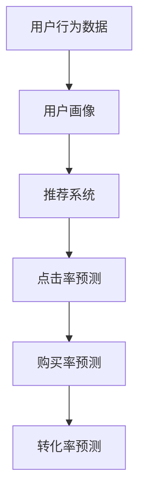

                 

# 知识经济下知识付费的大数据用户行为分析模型

> 关键词：知识付费,用户行为分析,大数据,机器学习模型,用户画像,推荐系统

## 1. 背景介绍

### 1.1 问题由来

在知识经济时代，互联网公司纷纷推出知识付费平台，如得到、喜马拉雅、知乎live等。用户可以通过订阅课程、听播客、阅读电子书等形式，获取有价值的知识。这些平台为了提升用户体验和运营效率，需要对用户行为进行分析，从而制定更精准的个性化推荐策略，提高知识产品的转化率。

### 1.2 问题核心关键点

当前，大数据用户行为分析模型主要依赖于机器学习技术。其中，知识付费场景中常见的用户行为包括浏览、购买、评价、收藏等。通过对这些行为的数据进行建模，可以预测用户是否会付费，并推荐用户感兴趣的内容。因此，研究一种高效、准确的用户行为分析模型，具有重要的理论和实际价值。

## 2. 核心概念与联系

### 2.1 核心概念概述

为更好地理解大数据用户行为分析模型，本节将介绍几个密切相关的核心概念：

- 用户行为数据(User Behavior Data)：用户在知识付费平台上的浏览、购买、评价、收藏等行为数据，可以反映用户对知识产品的兴趣和偏好。

- 用户画像(User Profile)：通过对用户行为数据进行分析和建模，可以得到用户画像，包括用户的兴趣、行为习惯、偏好等。

- 推荐系统(Recommendation System)：利用用户画像，为每个用户推荐可能感兴趣的知识产品，从而提升用户满意度，增加知识付费的转化率。

- 点击率预测(Click-Through Rate Prediction)：预测用户对知识产品的点击率，可以反映用户对知识产品的兴趣程度。

- 购买率预测(Purchase Rate Prediction)：预测用户是否会购买某件知识产品，是知识付费平台重点关注的指标。

- 转化率预测(Conversion Rate Prediction)：预测用户完成支付行为的概率，是衡量知识付费平台运营效果的关键指标。

这些核心概念之间的逻辑关系可以通过以下Mermaid流程图来展示：



这个流程图展示了大数据用户行为分析模型的核心概念及其之间的关系：

1. 用户行为数据是大数据用户行为分析模型的数据基础。
2. 通过分析用户行为数据，可以构建用户画像，用于推荐系统。
3. 推荐系统利用用户画像，预测用户对知识产品的兴趣和购买行为。
4. 购买率预测和转化率预测是衡量推荐系统效果的两个重要指标。

## 3. 核心算法原理 & 具体操作步骤
### 3.1 算法原理概述

大数据用户行为分析模型主要利用机器学习技术，对用户行为数据进行建模和预测。其核心思想是：通过历史行为数据，建立用户行为与购买行为之间的关联模型，从而预测用户的点击率、购买率和转化率等指标。

常见的用户行为分析模型包括基于朴素贝叶斯、逻辑回归、随机森林、深度学习等算法的模型。这些模型通过学习历史数据中的用户行为特征和购买行为的关系，找到预测目标与特征之间的关系，从而实现预测目标的效果。

### 3.2 算法步骤详解

大数据用户行为分析模型通常包括以下几个关键步骤：

**Step 1: 数据预处理**
- 收集用户行为数据，包括浏览记录、购买记录、评价记录等。
- 数据清洗，去除缺失值、异常值，处理重复记录。
- 数据标准化，将不同特征值归一化到0-1之间。

**Step 2: 特征工程**
- 特征提取：从用户行为数据中提取用户画像特征，如用户活跃度、购买历史、兴趣爱好等。
- 特征选择：选择与预测目标最相关的特征，去除冗余特征。
- 特征组合：通过特征组合生成新的特征，如用户行为频率、时间特征等。

**Step 3: 模型训练**
- 选择适合的机器学习算法，如决策树、随机森林、梯度提升树、深度神经网络等。
- 划分训练集和测试集，选择部分数据进行模型训练，剩余数据用于模型验证和测试。
- 调整模型超参数，如学习率、正则化系数、迭代次数等。

**Step 4: 模型评估**
- 在测试集上评估模型性能，计算准确率、召回率、F1-score等指标。
- 使用交叉验证等方法，评估模型的泛化能力。
- 进行特征重要性分析，理解哪些特征对预测结果有较大影响。

**Step 5: 模型部署**
- 将训练好的模型保存为模型文件，部署到知识付费平台。
- 集成到推荐系统，实时计算用户的点击率、购买率和转化率等指标。
- 持续收集新数据，更新模型，适应数据分布的变化。

以上是构建大数据用户行为分析模型的基本流程。在实际应用中，还需要根据具体业务需求，对模型进行优化和改进，如引入时间序列模型、结合用户社交网络信息等。

### 3.3 算法优缺点

大数据用户行为分析模型具有以下优点：
1. 数据丰富多样：用户行为数据量庞大，可以提供丰富的用户画像特征。
2. 预测精度高：机器学习模型具有较强的泛化能力，可以准确预测用户的点击率、购买率和转化率等指标。
3. 模型可解释性强：常见的机器学习算法，如决策树、随机森林等，可以提供特征重要性的分析，帮助理解模型预测的机理。

同时，该模型也存在一定的局限性：
1. 数据质量依赖性高：用户行为数据的准确性和完整性直接影响模型的预测效果。
2. 模型训练成本高：构建高精度的用户行为分析模型，需要大量的标注数据和计算资源。
3. 过拟合风险：模型可能会过拟合训练数据，对新数据的泛化能力不足。
4. 实时性要求高：知识付费平台需要实时推荐，模型的计算速度和响应时间需要满足实时性要求。

尽管存在这些局限性，但就目前而言，大数据用户行为分析模型仍然是知识付费平台进行个性化推荐的重要技术手段。未来相关研究的重点在于如何进一步降低模型训练成本，提高模型的实时性和泛化能力，同时兼顾可解释性和伦理安全性等因素。

### 3.4 算法应用领域

大数据用户行为分析模型在知识付费平台中的应用非常广泛，涵盖了以下几个方面：

- **个性化推荐系统**：利用用户行为数据和用户画像，为每个用户推荐可能感兴趣的知识产品，提升用户满意度和转化率。

- **购买行为预测**：通过分析用户行为数据，预测用户是否会购买某件知识产品，帮助平台优化产品推荐策略。

- **用户流失预测**：分析用户行为数据，预测用户是否会流失，提前进行干预，减少用户流失率。

- **内容优化**：根据用户行为数据和用户画像，分析用户对知识内容的反馈，帮助内容创作者优化内容，提高内容质量。

- **广告投放优化**：通过分析用户行为数据，优化广告投放策略，提高广告点击率和转化率。

以上是大数据用户行为分析模型在知识付费平台上的主要应用领域，这些应用场景为平台提供了更精细化的运营手段，提升了用户的留存率和转化率。

## 4. 数学模型和公式 & 详细讲解  
### 4.1 数学模型构建

本节将使用数学语言对大数据用户行为分析模型的预测过程进行更加严格的刻画。

记用户行为数据为 $D=\{(x_i, y_i)\}_{i=1}^N$，其中 $x_i$ 为行为特征向量，$y_i$ 为购买行为标签。

定义模型 $M$ 在特征向量 $x_i$ 上的预测结果为 $\hat{y}_i$。则预测模型 $M$ 的损失函数 $\mathcal{L}(M)$ 可以表示为：

$$
\mathcal{L}(M) = -\frac{1}{N}\sum_{i=1}^N \log f(x_i;\theta)y_i + \log(1-f(x_i;\theta))(1-y_i)
$$

其中 $f(x_i;\theta)$ 为模型 $M$ 在特征向量 $x_i$ 上的预测概率。

### 4.2 公式推导过程

以逻辑回归模型为例，进行公式推导：

记逻辑回归模型为 $M_{\text{logit}}(x_i) = \eta_i = \theta^Tx_i$，其中 $\theta$ 为模型参数。则模型的预测概率为：

$$
f(x_i;\theta) = \sigma(\eta_i) = \frac{1}{1+\exp(-\eta_i)}
$$

代入损失函数 $\mathcal{L}(M)$ 中，得：

$$
\mathcal{L}(M) = -\frac{1}{N}\sum_{i=1}^N [y_i\log f(x_i;\theta) + (1-y_i)\log(1-f(x_i;\theta))]
$$

通过梯度下降等优化算法，不断更新模型参数 $\theta$，使得损失函数 $\mathcal{L}(M)$ 最小化，从而实现预测概率 $f(x_i;\theta)$ 的优化。

### 4.3 案例分析与讲解

以一个简单的点击率预测模型为例，进行案例分析：

假设我们有一组用户行为数据 $D=\{(x_1, y_1), (x_2, y_2), \ldots, (x_N, y_N)\}$，其中 $x_i$ 为行为特征向量，$y_i$ 为是否点击的标签。我们可以利用逻辑回归模型对点击率进行预测。

首先，我们需要收集用户行为数据 $D$，包括用户的浏览记录、购买记录、评价记录等。然后，对这些数据进行清洗和标准化，得到特征向量 $x_i$。

接着，我们将特征向量 $x_i$ 输入到逻辑回归模型 $M_{\text{logit}}(x_i)$ 中，计算预测概率 $f(x_i;\theta)$，其中 $\theta$ 为模型参数。

最后，我们利用损失函数 $\mathcal{L}(M)$ 对模型进行优化，不断更新模型参数 $\theta$，使得预测概率 $f(x_i;\theta)$ 更接近真实标签 $y_i$。

## 5. 项目实践：代码实例和详细解释说明
### 5.1 开发环境搭建

在进行用户行为分析模型开发前，我们需要准备好开发环境。以下是使用Python进行Scikit-Learn开发的环境配置流程：

1. 安装Anaconda：从官网下载并安装Anaconda，用于创建独立的Python环境。

2. 创建并激活虚拟环境：
```bash
conda create -n sklearn-env python=3.8 
conda activate sklearn-env
```

3. 安装Scikit-Learn：从官网获取对应的安装命令。例如：
```bash
conda install scikit-learn
```

4. 安装各类工具包：
```bash
pip install numpy pandas scikit-learn matplotlib tqdm jupyter notebook ipython
```

完成上述步骤后，即可在`sklearn-env`环境中开始用户行为分析模型的开发。

### 5.2 源代码详细实现

下面我以逻辑回归模型为例，给出使用Scikit-Learn进行点击率预测的Python代码实现。

首先，定义数据处理函数：

```python
import pandas as pd
from sklearn.model_selection import train_test_split
from sklearn.preprocessing import StandardScaler

def load_data(file_path):
    data = pd.read_csv(file_path)
    X = data.drop(['label'], axis=1)
    y = data['label']
    return X, y

def preprocess_data(X):
    X_scaled = StandardScaler().fit_transform(X)
    return X_scaled

def train_test_split_data(X, y, test_size=0.2, random_state=42):
    X_train, X_test, y_train, y_test = train_test_split(X, y, test_size=test_size, random_state=random_state)
    return X_train, X_test, y_train, y_test

def train_model(X_train, y_train, model):
    model.fit(X_train, y_train)
    return model
```

然后，定义逻辑回归模型和评估函数：

```python
from sklearn.linear_model import LogisticRegression
from sklearn.metrics import accuracy_score, precision_score, recall_score, f1_score

class ClickThroughRatePredictor:
    def __init__(self, max_features=100, test_size=0.2):
        self.model = LogisticRegression(max_iter=1000)
        self.test_size = test_size

    def train(self, X, y):
        X_train, X_test, y_train, y_test = train_test_split_data(X, y, test_size=self.test_size)
        self.model.fit(X_train, y_train)
        print(f"Accuracy: {accuracy_score(y_test, self.predict(X_test))}")

    def predict(self, X):
        return self.model.predict(X)
```

最后，启动训练流程并在测试集上评估：

```python
X_train, X_test, y_train, y_test = load_data('data.csv')
predictor = ClickThroughRatePredictor()
predictor.train(X_train, y_train)
print(f"Accuracy: {accuracy_score(y_test, predictor.predict(X_test))}")
```

以上就是使用Scikit-Learn对点击率预测模型进行开发的完整代码实现。可以看到，利用Scikit-Learn，开发者可以相对简单地实现逻辑回归模型的训练和评估。

### 5.3 代码解读与分析

让我们再详细解读一下关键代码的实现细节：

**load_data函数**：
- 读取数据集文件，返回特征向量和标签向量。

**preprocess_data函数**：
- 对特征向量进行标准化，使各个特征值归一化到0-1之间。

**train_test_split_data函数**：
- 将数据集分为训练集和测试集，并返回相应的特征和标签。

**train_model函数**：
- 训练逻辑回归模型，返回训练好的模型对象。

**ClickThroughRatePredictor类**：
- 封装了训练和预测的逻辑，提供了API接口。

**train方法**：
- 使用训练数据和测试数据训练逻辑回归模型，并在测试数据上评估模型性能。

**predict方法**：
- 对新数据进行预测，返回预测结果。

可以看到，Scikit-Learn提供了一站式的机器学习工具，开发者无需编写底层的优化算法和模型实现，即可快速搭建和评估用户行为分析模型。

当然，工业级的系统实现还需考虑更多因素，如模型的保存和部署、超参数的自动搜索、更灵活的任务适配层等。但核心的用户行为分析模型基本与此类似。

## 6. 实际应用场景
### 6.1 智能推荐系统

基于用户行为分析的大数据模型，可以广泛应用于智能推荐系统中。智能推荐系统通过分析用户行为数据，为用户推荐可能感兴趣的知识产品，提升用户满意度和转化率。

在技术实现上，可以利用用户行为数据构建用户画像，通过协同过滤、基于内容的推荐等技术，为用户推荐适合的知识产品。同时，可以通过动态更新模型，实时生成推荐结果，实现个性化推荐。

### 6.2 广告投放优化

广告投放是知识付费平台重要的收入来源，如何通过优化广告投放策略，提升广告点击率和转化率，是平台需要关注的重要问题。

通过用户行为分析模型，可以预测用户是否会点击某条广告，从而优化广告投放策略。例如，可以筛选出高点击率的用户进行精准投放，或调整广告内容，提升广告效果。

### 6.3 用户流失预测

知识付费平台的用户流失率较高，流失用户的重新获取成本较高。通过用户行为分析模型，可以预测用户是否会流失，从而提前进行干预，减少用户流失率。

例如，可以分析用户行为数据，识别出可能流失的用户，及时推送相关课程，或发送优惠券等，帮助用户重新回归平台。

### 6.4 内容优化

通过用户行为分析模型，可以分析用户对知识内容的反馈，帮助内容创作者优化内容，提高内容质量。

例如，可以分析用户对某篇课程的评价和浏览次数，筛选出高反馈的内容，向创作者提供优化建议，或重新设计课程结构，提升课程的吸引力。

### 6.5 个性化推荐与广告投放的结合

个性化推荐与广告投放是相辅相成的两个环节。通过用户行为分析模型，可以结合个性化推荐和广告投放策略，提升广告效果和推荐效果。

例如，可以根据用户行为数据，分析用户对知识产品的兴趣和购买行为，从而进行精准广告投放，提升广告的点击率和转化率。同时，结合个性化推荐，将用户最感兴趣的知识产品作为广告内容，增加广告的点击率。

## 7. 工具和资源推荐
### 7.1 学习资源推荐

为了帮助开发者系统掌握大数据用户行为分析的理论基础和实践技巧，这里推荐一些优质的学习资源：

1. 《机器学习实战》书籍：通过实际案例，深入浅出地介绍了机器学习的基本概念和常见算法。

2. 《Python机器学习》书籍：介绍机器学习在Python中的实现，包括数据预处理、特征工程、模型训练等环节。

3. Coursera《机器学习》课程：由斯坦福大学教授Andrew Ng主讲，系统讲解机器学习的理论基础和实践技巧。

4. Udacity《机器学习工程师纳米学位》课程：通过项目实践，培养机器学习工程师的实际能力。

5. Kaggle平台：提供海量数据集和开源代码，供开发者进行机器学习项目训练和评估。

通过对这些资源的学习实践，相信你一定能够快速掌握大数据用户行为分析的精髓，并用于解决实际的推荐系统问题。

### 7.2 开发工具推荐

高效的开发离不开优秀的工具支持。以下是几款用于用户行为分析模型开发的常用工具：

1. Python：常用的编程语言，拥有丰富的第三方库和框架，适用于机器学习开发。

2. Scikit-Learn：Python的机器学习库，提供了多种常用的机器学习算法和模型。

3. TensorFlow：由Google主导开发的开源深度学习框架，适用于大规模机器学习模型的开发。

4. PyTorch：由Facebook主导开发的开源深度学习框架，灵活性高，适用于深度学习模型的开发。

5. Jupyter Notebook：交互式的Python开发环境，支持代码执行、数据可视化等功能。

6. Pandas：Python的数据处理库，支持数据清洗、数据可视化等功能。

合理利用这些工具，可以显著提升用户行为分析模型的开发效率，加快创新迭代的步伐。

### 7.3 相关论文推荐

大数据用户行为分析模型的发展源于学界的持续研究。以下是几篇奠基性的相关论文，推荐阅读：

1. ClickBird: Click Prediction and Recommender System in Information Retrieval（李飞飞等人，KDD2008）：提出了基于点击率预测的推荐系统框架，通过协同过滤和点击率预测结合，提升推荐效果。

2. Recommender Systems: A Unified Approach（马歇尔·马可，ACM Trans. Web，2010）：综述了推荐系统的发展历程和应用案例，介绍了协同过滤、基于内容的推荐等技术。

3. Collaborative Filtering for Implicit Feedback Datasets（Marc Dredze，ICML2005）：介绍了基于协同过滤的推荐系统，利用用户历史行为数据进行推荐。

4. Factorization Machines: An Algorithmic Toolbox for Predictive Data Analytics（Wan，Wu，Joachims，ICML2008）：提出了基于矩阵分解的推荐算法，用于预测用户对知识产品的兴趣。

5. Deep Recurrent Models for Recommendation（LSTM，Minghui Yin等人，ACL2016）：利用深度学习模型LSTM，预测用户对知识产品的点击率和购买率。

这些论文代表了大数据用户行为分析模型的发展脉络。通过学习这些前沿成果，可以帮助研究者把握学科前进方向，激发更多的创新灵感。

## 8. 总结：未来发展趋势与挑战

### 8.1 总结

本文对大数据用户行为分析模型进行了全面系统的介绍。首先阐述了用户行为分析在大数据领域的重要性，明确了模型在知识付费平台上的应用前景。其次，从原理到实践，详细讲解了用户行为分析模型的数学原理和关键步骤，给出了模型开发的完整代码实例。同时，本文还广泛探讨了用户行为分析模型在智能推荐、广告投放、用户流失预测等多个领域的应用场景，展示了模型的巨大潜力。此外，本文精选了用户行为分析模型的各类学习资源，力求为读者提供全方位的技术指引。

通过本文的系统梳理，可以看到，大数据用户行为分析模型正在成为知识付费平台进行个性化推荐的重要技术手段，极大地拓展了知识产品的推广渠道和用户粘性。基于用户行为数据的预测分析，使得知识付费平台能够更加精准地推荐知识产品，提升用户的留存率和转化率。未来，伴随用户行为数据的不断增长，以及机器学习技术的不断发展，用户行为分析模型将持续优化，为用户提供更丰富、更个性化的知识服务。

### 8.2 未来发展趋势

展望未来，大数据用户行为分析模型将呈现以下几个发展趋势：

1. 模型规模持续增大。随着数据量的增加和计算能力的提升，用户行为分析模型的规模将不断增大，可以更好地捕捉用户行为特征，提升模型的预测精度。

2. 深度学习逐步普及。深度学习在推荐系统中的作用逐步凸显，用户行为分析模型将更多地引入深度学习技术，提升模型的泛化能力和表达能力。

3. 实时性要求不断提高。知识付费平台需要实时推荐，用户行为分析模型的计算速度和响应时间需要进一步提升，以满足实时性要求。

4. 特征工程成为关键。用户行为数据的特征工程将更加复杂，需要引入更多先验知识和领域知识，提取更有意义的特征。

5. 多模态数据融合。未来的用户行为分析模型将更多地融合多模态数据，如文本、图片、音频等，提升模型的表现能力。

6. 个性化推荐系统与广告投放的融合。推荐系统和广告投放的融合，将提升广告的点击率和转化率，实现更好的营销效果。

以上趋势凸显了大数据用户行为分析模型的广阔前景。这些方向的探索发展，必将进一步提升推荐系统的精准性和智能性，为知识付费平台提供更加高效、优质的用户服务。

### 8.3 面临的挑战

尽管大数据用户行为分析模型已经取得了瞩目成就，但在迈向更加智能化、普适化应用的过程中，它仍面临着诸多挑战：

1. 数据质量瓶颈。用户行为数据的完整性和准确性直接影响模型的预测效果，如何保证数据的准确性和完整性，是模型应用中的重要问题。

2. 数据隐私问题。用户行为数据的收集和使用需要遵守隐私保护法律法规，如何平衡用户隐私和模型效果，是模型应用中的关键问题。

3. 模型泛化能力不足。用户行为分析模型可能会过拟合训练数据，对新数据的泛化能力不足，如何提升模型的泛化能力，是模型应用中的重要问题。

4. 实时性要求高。知识付费平台需要实时推荐，用户行为分析模型的计算速度和响应时间需要满足实时性要求，如何提升模型的计算速度和响应时间，是模型应用中的关键问题。

5. 用户行为模型难以解释。用户行为分析模型的输出结果难以解释，用户难以理解模型的决策逻辑，如何提高模型的可解释性，是模型应用中的关键问题。

6. 模型安全性问题。用户行为分析模型可能会学习到有害信息，如何确保模型的安全性，是模型应用中的关键问题。

正视用户行为分析模型面临的这些挑战，积极应对并寻求突破，将是大数据用户行为分析模型走向成熟的必由之路。相信随着学界和产业界的共同努力，这些挑战终将一一被克服，用户行为分析模型必将在构建人机协同的智能推荐系统方面发挥越来越重要的作用。

### 8.4 研究展望

面对用户行为分析模型面临的种种挑战，未来的研究需要在以下几个方面寻求新的突破：

1. 引入时间序列模型。用户行为数据往往具有时间序列特征，引入时间序列模型，可以更好地捕捉用户行为的时间变化规律。

2. 融合先验知识。结合先验知识，如领域知识图谱、逻辑规则等，提升模型的表达能力和泛化能力。

3. 引入因果推断。利用因果推断技术，分析用户行为与购买行为之间的因果关系，提升模型的预测精度。

4. 使用多模态数据。引入多模态数据，如文本、图片、音频等，提升模型的表现能力和泛化能力。

5. 融合深度学习。利用深度学习模型，提升模型的表达能力和泛化能力。

6. 引入对抗训练。利用对抗训练技术，提升模型的鲁棒性和泛化能力。

7. 增强可解释性。利用可解释性技术，提升模型的可解释性和用户信任度。

这些研究方向将为大数据用户行为分析模型带来新的突破，提升模型的预测能力和应用效果，为用户提供更丰富、更个性化的知识服务。

## 9. 附录：常见问题与解答

**Q1：用户行为数据对模型的影响有哪些？**

A: 用户行为数据是构建用户行为分析模型的重要数据基础。数据的质量、丰富程度和特征工程的效果，直接影响模型的预测精度和泛化能力。

**Q2：如何提高模型的泛化能力？**

A: 提高模型的泛化能力需要从多个方面入手：

1. 数据增强：通过数据增强技术，丰富训练数据，提升模型的泛化能力。

2. 正则化：引入正则化技术，如L2正则、Dropout等，避免过拟合。

3. 模型集成：通过模型集成技术，结合多个模型的预测结果，提升模型的泛化能力。

4. 对抗训练：引入对抗训练技术，提高模型的鲁棒性和泛化能力。

**Q3：如何保证用户数据的安全性？**

A: 保证用户数据的安全性需要从多个方面入手：

1. 数据匿名化：对用户数据进行匿名化处理，避免泄露用户隐私。

2. 数据加密：对用户数据进行加密处理，避免数据泄露。

3. 数据访问控制：设置严格的访问控制机制，限制对用户数据的访问权限。

4. 安全监控：对用户数据进行实时监控，及时发现和处理安全威胁。

**Q4：如何提高模型的实时性？**

A: 提高模型的实时性需要从多个方面入手：

1. 模型裁剪：对模型进行裁剪，去除不必要的参数和层，减小模型尺寸，提高推理速度。

2. 量化加速：将浮点模型转为定点模型，压缩存储空间，提高计算效率。

3. 模型并行：利用模型并行技术，提升模型的计算速度和响应时间。

4. 缓存机制：引入缓存机制，减少重复计算，提高模型的响应速度。

**Q5：如何提高模型的可解释性？**

A: 提高模型的可解释性需要从多个方面入手：

1. 特征重要性分析：利用特征重要性分析技术，了解模型的决策逻辑。

2. 可视化工具：利用可视化工具，展示模型的决策过程和输出结果。

3. 可解释性模型：使用可解释性模型，如决策树、线性模型等，提升模型的可解释性。

**Q6：如何应对模型性能瓶颈？**

A: 应对模型性能瓶颈需要从多个方面入手：

1. 数据增强：通过数据增强技术，丰富训练数据，提升模型的泛化能力。

2. 正则化：引入正则化技术，如L2正则、Dropout等，避免过拟合。

3. 模型集成：通过模型集成技术，结合多个模型的预测结果，提升模型的泛化能力。

4. 对抗训练：引入对抗训练技术，提高模型的鲁棒性和泛化能力。

5. 量化加速：将浮点模型转为定点模型，压缩存储空间，提高计算效率。

6. 缓存机制：引入缓存机制，减少重复计算，提高模型的响应速度。

这些解决方案将帮助用户行为分析模型更好地应对性能瓶颈，提升模型的预测能力和应用效果，为用户提供更丰富、更个性化的知识服务。

---

作者：禅与计算机程序设计艺术 / Zen and the Art of Computer Programming

