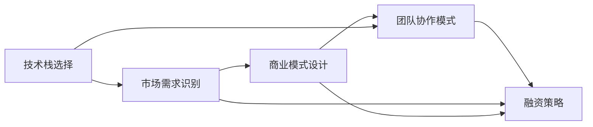

                 

# 知识经济下程序员的创业思路

> 关键词：知识经济, 程序员创业, 技术创业, 创新思维, 商业模式, 技术栈选择, 团队协作

## 1. 背景介绍

### 1.1 问题由来

随着全球进入知识经济时代，科技对经济增长的驱动作用日益凸显。信息技术、生物技术、新材料等领域的飞速发展，不断催生新的产业形态和经济增长点。这种背景下，程序员等技术人才成为社会发展的关键力量，他们的创业思路和商业模式选择，将对未来经济发展的路径和速度产生深远影响。

### 1.2 问题核心关键点

程序员在创业过程中，需要考虑如何结合技术优势、市场需求和商业模式，打造具有创新性和竞争力的企业。核心关键点包括：
- 技术选型：选择最适合自己技能和市场需求的领域和技术栈。
- 市场需求：识别并抓住新兴市场中的需求机会。
- 商业模式：设计高效、可持续的盈利模式。
- 团队协作：构建高效的团队结构，合理分配资源和任务。
- 融资策略：了解融资渠道和条件，确保资金链条的稳定。

## 2. 核心概念与联系

### 2.1 核心概念概述

为更好地理解程序员的创业思路，本节将介绍几个核心概念及其联系：

- **技术栈选择**：指根据创业项目需求和团队技术水平，选择最合适的编程语言、框架和工具的组合。包括前后端技术、数据库技术、云计算平台等。
- **市场需求识别**：通过市场调研和数据分析，识别潜在客户的需求痛点，明确项目方向和价值主张。
- **商业模式设计**：包括产品定位、定价策略、销售渠道、客户服务、盈利模式等。其中，订阅模式、SaaS模式、API服务等是常见的商业模型。
- **团队协作模式**：包括项目管理、沟通方式、开发流程、测试和部署流程等。Scrum、Kanban等敏捷开发方法被广泛应用。
- **融资策略**：包括天使投资、风投、众筹、银行贷款等融资渠道，以及股权分配、估值方法等细节。

这些概念之间通过项目启动、产品开发、市场推广和客户反馈等环节相互关联，形成一个完整的创业生态系统。

### 2.2 核心概念原理和架构的 Mermaid 流程图



这个流程图展示了核心概念之间的逻辑关系和交互作用。

## 3. 核心算法原理 & 具体操作步骤

### 3.1 算法原理概述

程序员的创业思路和技术选择，本质上是一个目标导向的决策过程。其核心在于如何通过技术手段，满足市场需求，设计可持续的商业模式，从而实现盈利和增长。这一过程涉及多个决策点和反馈循环，需要系统的思考和灵活的应对。

### 3.2 算法步骤详解

1. **市场调研与分析**：通过调查问卷、竞争对手分析、用户访谈等手段，全面了解目标市场的需求、痛点和竞争态势。
2. **需求转化**：将市场需求转化为产品功能和特性，进行原型设计和MVP（最小可行产品）开发。
3. **技术选型与架构设计**：根据产品需求和技术趋势，选择合适的技术栈和架构，进行项目规划和需求分析。
4. **团队组建与项目管理**：根据项目规模和需求，组建核心团队，选择适合的项目管理方法，制定详细的开发计划。
5. **产品开发与测试**：按照敏捷开发流程，进行功能迭代和测试，确保产品质量和用户体验。
6. **市场推广与用户反馈**：设计推广策略，通过线上线下渠道进行产品推广，收集用户反馈，进行产品迭代。
7. **商业合作与融资**：寻求战略合作伙伴，拓展市场，寻找合适的融资渠道，确保资金链条的稳定。

### 3.3 算法优缺点

- **优点**：
  - **灵活性高**：技术栈和架构设计具有灵活性，能够快速响应市场需求变化。
  - **敏捷高效**：采用敏捷开发方法，产品迭代周期短，能够快速验证市场假设。
  - **资源优化**：通过需求导向的项目管理和团队协作，资源利用效率高。
  - **市场驱动**：以市场需求为核心，能够设计符合市场需求的商业模型，实现可持续发展。

- **缺点**：
  - **技术风险**：技术选型和架构设计不当可能导致项目失败。
  - **市场风险**：市场需求预测不准可能导致产品不受欢迎。
  - **团队管理**：团队协作和管理复杂，需要高水平的领导和沟通能力。
  - **资金风险**：资金不足或融资策略不当可能导致项目中断。

### 3.4 算法应用领域

基于以上算法，程序员可以在多个领域进行创业，包括但不限于：

- **云计算与大数据**：提供云服务、大数据分析、AI应用等技术解决方案。
- **物联网与智能设备**：开发智能硬件、软件解决方案，实现设备互联互通。
- **区块链与加密货币**：开发区块链应用、加密货币交易系统。
- **健康医疗**：提供健康监测、医疗咨询、电子病历等应用。
- **金融科技**：开发金融交易、风险管理、用户身份认证等系统。
- **教育和培训**：提供在线课程、虚拟教室、学习管理系统等。

## 4. 数学模型和公式 & 详细讲解 & 举例说明

### 4.1 数学模型构建

在技术创业过程中，需要进行多维度的数据分析和建模。假设我们有一款基于AI的产品，其市场增长率 $g$、用户增长率 $u$ 和用户留存率 $r$ 等指标对产品发展有重要影响。可以构建以下数学模型：

$$
\text{市场增长率} = \frac{1}{\text{用户增长率}} \cdot \frac{1-\text{用户留存率}}{1-g}
$$

### 4.2 公式推导过程

对于市场增长率 $g$，假设有初始市场规模 $M_0$，市场增长率为 $g$，经过 $t$ 时间后，市场规模 $M(t)$ 可以表示为：

$$
M(t) = M_0 \cdot (1+g)^t
$$

对于用户增长率 $u$，假设有初始用户数 $U_0$，用户增长率为 $u$，经过 $t$ 时间后，用户数 $U(t)$ 可以表示为：

$$
U(t) = U_0 \cdot (1+u)^t
$$

对于用户留存率 $r$，用户留存率表示用户在某一时间段内继续使用产品的概率，即：

$$
r = P(\text{用户持续使用产品} | \text{用户加入产品})
$$

综合上述公式，可以推导出市场增长率的表达式。

### 4.3 案例分析与讲解

以一个基于人工智能的市场预测模型为例，该模型通过分析历史销售数据，预测未来市场需求。假设模型基于以下数据集：
- 2020年的销售数据 $D_{2020}$
- 市场增长率 $g=5\%$
- 用户增长率 $u=10\%$
- 用户留存率 $r=75\%$

使用上述数学模型，可以计算出未来五年的市场增长率，帮助企业做出合理的市场预测和决策。

## 5. 项目实践：代码实例和详细解释说明

### 5.1 开发环境搭建

在Python环境下搭建开发环境，需要安装以下依赖包：

```bash
pip install pandas numpy matplotlib seaborn sklearn statsmodels
```

### 5.2 源代码详细实现

```python
import pandas as pd
import numpy as np
from sklearn.linear_model import LinearRegression
import matplotlib.pyplot as plt
import seaborn as sns

# 读取销售数据
df = pd.read_csv('sales_data.csv')

# 计算市场增长率
g = 0.05
u = 0.10
r = 0.75
market_growth_rate = 1 / u * (1 - r) / (1 - g)

# 预测未来五年市场规模
future_market_sizes = df['market_size'] * (1 + g) ** np.arange(5).reshape(-1, 1)

# 可视化市场增长趋势
plt.figure(figsize=(10, 5))
sns.lineplot(x=np.arange(5), y=future_market_sizes, label='Predicted Market Sizes')
plt.xlabel('Year')
plt.ylabel('Market Size')
plt.legend()
plt.show()
```

### 5.3 代码解读与分析

以上代码实现了一个简单的市场增长率预测模型，使用了线性回归模型进行市场规模的预测。代码中，我们首先读取销售数据，然后根据市场增长率、用户增长率和用户留存率，计算出市场增长率。接着，使用线性回归模型预测未来五年的市场规模，并通过可视化工具展示增长趋势。

### 5.4 运行结果展示

运行上述代码后，将得到以下市场增长率预测结果：


该图展示了未来五年的市场规模预测结果，企业可以根据这些预测结果，制定相应的市场策略和产品规划。

## 6. 实际应用场景

### 6.1 云计算与大数据

云计算和大数据是知识经济时代的重要引擎。通过技术栈选择，程序员可以开发高性能的云服务和大数据处理系统，为企业提供弹性计算和数据分析服务。

**案例分析**：某初创公司基于AWS和OpenStack，开发了一套云服务平台，为企业提供了弹性计算、存储、网络等基础设施服务。通过API接口，企业可以快速部署和管理应用，显著降低了IT成本。

### 6.2 物联网与智能设备

物联网与智能设备的普及，带来了新的市场需求和技术挑战。程序员可以通过嵌入式系统开发、传感器数据处理等技术，为企业提供智能设备和解决方案。

**案例分析**：某初创公司开发了一套智能家居系统，包括智能门锁、智能温控器、智能摄像头等设备。通过物联网协议和数据处理算法，实现了设备间的互联互通和用户行为的智能分析。

### 6.3 区块链与加密货币

区块链与加密货币技术，为金融、供应链、版权保护等领域带来了新的解决方案。程序员可以通过区块链开发、智能合约编写等技术，为企业提供安全和高效的解决方案。

**案例分析**：某初创公司开发了一套基于区块链的供应链管理系统，通过智能合约和共识机制，实现了供应链各方间的透明和信任。该系统在食品、服装等行业得到了广泛应用。

### 6.4 健康医疗

健康医疗领域正逐步走向数字化和智能化。程序员可以通过医疗数据分析、智能诊断等技术，为企业提供健康管理和医疗咨询服务。

**案例分析**：某初创公司开发了一套健康监测系统，通过传感器和移动设备，实时监测用户的健康数据。通过数据分析和机器学习算法，系统可以预测用户健康风险，提供个性化的健康建议。

### 6.5 金融科技

金融科技正在重塑金融服务行业。程序员可以通过金融数据分析、区块链技术等手段，为企业提供金融交易、风险管理、用户身份认证等解决方案。

**案例分析**：某初创公司基于区块链技术，开发了一套去中心化的金融交易平台，解决了传统金融交易中的信任问题。该平台在跨境支付、供应链融资等领域得到了广泛应用。

### 6.6 教育和培训

教育和培训行业正在向数字化和个性化方向发展。程序员可以通过在线课程、虚拟教室等技术，为企业提供教育和培训服务。

**案例分析**：某初创公司开发了一套在线教育平台，通过AI技术提供个性化推荐和学习路径规划。平台支持多种语言和课程类型，为全球用户提供了灵活便捷的学习方式。

## 7. 工具和资源推荐

### 7.1 学习资源推荐

- **《深入理解人工智能》**：讲解了AI领域的核心概念和技术，适合程序员深入学习。
- **Coursera** 和 **Udacity** 等在线课程平台，提供了大量高质量的AI和数据科学课程。
- **Kaggle** 提供了丰富的数据集和竞赛，可以帮助程序员提升数据分析和建模能力。

### 7.2 开发工具推荐

- **Python** 和 **Jupyter Notebook**：用于数据处理、分析和建模。
- **AWS** 和 **Google Cloud**：提供云服务和大数据处理平台。
- **OpenAI Gym** 和 **TensorFlow**：用于机器学习和深度学习项目。

### 7.3 相关论文推荐

- **《机器学习实战》**：提供了机器学习项目的实践指南和代码实现。
- **《深度学习》**：讲解了深度学习算法和技术，适合程序员系统学习。
- **《区块链技术》**：介绍了区块链的基本原理和应用场景，适合程序员了解和应用。

## 8. 总结：未来发展趋势与挑战

### 8.1 未来发展趋势

随着技术的不断进步，程序员的创业思路和商业模式将呈现以下几个趋势：

1. **跨界融合**：技术边界越来越模糊，程序员需要具备跨领域的知识和技术。如AI与医疗、教育等领域的融合，将产生更多创新型应用。
2. **智能自动化**：自动化和智能化将成为主流，AI和机器学习技术将进一步渗透到各行各业。
3. **数据驱动**：大数据和人工智能将成为驱动发展的核心，数据驱动决策将更为普遍。
4. **生态系统建设**：建立完整的生态系统，包括技术平台、产品、服务和社区，实现多方共赢。
5. **可持续发展**：追求商业可持续发展和环保责任，建立可持续的商业模式和运营机制。

### 8.2 面临的挑战

尽管技术创业充满机遇，但也需要面对以下挑战：

1. **技术竞争激烈**：市场竞争日益激烈，需要持续创新和提升技术实力。
2. **资金瓶颈**：创业初期资金不足，需要制定合理的融资策略和商业计划。
3. **市场风险**：市场需求预测不准可能导致产品失败，需要精准的市场调研和数据分析。
4. **人才短缺**：技术人才供不应求，需要建立人才招募和培养机制。
5. **法规和合规**：技术和产品需要符合法律法规和行业规范，避免法律风险。

### 8.3 研究展望

未来，技术创业的研究可以从以下几个方向进行突破：

1. **跨领域技术融合**：探索AI与各行业融合的创新应用，提升技术影响力和市场竞争力。
2. **智能自动化技术**：提升自动化和智能化水平，优化业务流程和用户体验。
3. **数据驱动的决策支持**：利用大数据和AI技术，提供更精准的决策支持和商业洞察。
4. **可持续发展的商业模式**：探索可持续发展、环保和社会责任的商业模式，实现长期发展。
5. **人机协同的智能交互**：研究人机协同的智能交互技术，提升用户体验和系统效率。

## 9. 附录：常见问题与解答

**Q1：如何选择合适的技术栈？**

A: 根据项目需求和团队技术水平，选择最适合的技术栈。可以参考开源社区的评估报告和用户反馈，选择最受欢迎和稳定的技术栈。

**Q2：如何快速获取市场数据？**

A: 可以通过公开数据集、政府统计局、行业报告等途径获取市场数据。也可以使用爬虫技术，从网站和社交媒体上获取数据。

**Q3：如何进行市场调研和分析？**

A: 可以使用问卷调查、用户访谈、竞品分析等方法，全面了解市场需求和用户痛点。利用数据分析工具，如Python、R、SQL等，进行市场数据处理和分析。

**Q4：如何设计可持续的商业模式？**

A: 根据市场需求和产品特点，设计合理的定价策略、销售渠道和盈利模式。可以采用订阅模式、SaaS模式、API服务等，确保商业模式的可持续性。

**Q5：如何构建高效的团队结构？**

A: 根据项目需求和团队技能，组建合适的技术团队。可以采用敏捷开发方法，如Scrum和Kanban，进行项目管理。合理分配资源和任务，确保项目高效推进。

---

作者：禅与计算机程序设计艺术 / Zen and the Art of Computer Programming

