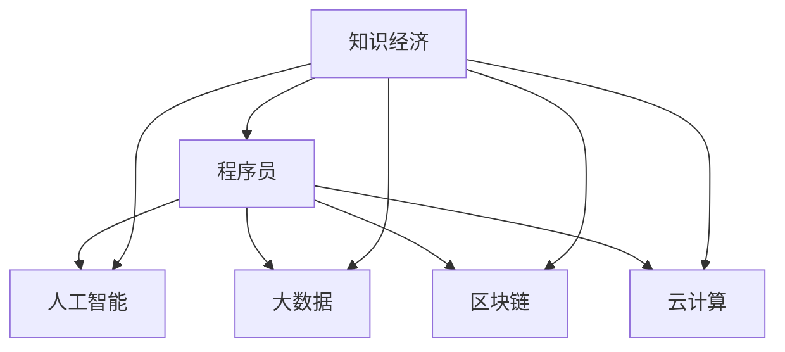

                 

# 知识经济下程序员的职业发展机遇

> 关键词：知识经济, 程序员, 职业发展, 人工智能, 大数据, 区块链, 云计算

## 1. 背景介绍

### 1.1 问题由来

在21世纪的数字化浪潮中，知识经济逐步成为驱动社会发展的主要动力。伴随互联网、物联网、大数据、人工智能等技术的普及应用，知识与信息逐渐成为生产要素的核心，价值创造方式正在发生根本性变化。对于程序员而言，身处知识经济时代，他们需要迅速适应技术发展的步伐，不断拓展技能边界，才能在竞争激烈的行业环境中立于不败之地。

知识经济时代，信息成为最为关键的生产资源，程序员作为信息的处理器、开发者，其职业角色和价值也随之发生巨变。为应对这种变化，程序员需要探索新的职业发展机遇，提升自身的竞争力。

### 1.2 问题核心关键点

知识经济下，程序员的职业发展机遇主要集中在以下几个方面：
1. 技术创新：伴随技术快速迭代，程序员需要持续学习新技术，提升技术水平。
2. 交叉学科：程序员需要跨界合作，具备数据科学、人工智能、机器学习等跨领域知识。
3. 远程工作：信息技术的进步推动了远程工作模式的普及，程序员可以灵活办公，提升工作与生活的平衡。
4. 持续学习：知识经济时代信息更新迅速，程序员需具备持续学习的能力，保持技能的新鲜度。
5. 社会责任：随着技术的普及应用，程序员也需要关注社会责任，提升技术的伦理性和安全性。

本文将围绕以上核心关键点，详细探讨知识经济下程序员的职业发展机遇，并提供系统性的技术指导和实践建议。

## 2. 核心概念与联系

### 2.1 核心概念概述

为更好地理解知识经济下程序员的职业发展机遇，本节将介绍几个密切相关的核心概念：

- 知识经济(Knowledge Economy)：以知识为基础的经济形态，信息、知识和创新成为价值创造的重要源泉。
- 程序员(Programmers)：具备编程技能，能够通过代码编写实现各种软件、系统、算法等功能的专业人士。
- 人工智能(Artificial Intelligence)：通过机器学习、深度学习等技术实现模拟人类智能行为的系统，是知识经济的重要驱动力。
- 大数据(Big Data)：海量、多源、异构的数据集合，利用数据科学方法进行分析和应用，是知识经济的基础设施。
- 区块链(Blockchain)：一种分布式数据库技术，保障数据透明、安全、可追溯，是知识经济的信任基石。
- 云计算(Cloud Computing)：通过网络提供可伸缩的计算资源和服务，支持企业的信息化建设。

这些核心概念之间的逻辑关系可以通过以下Mermaid流程图来展示：



这个流程图展示了这个概念体系：

1. 知识经济是社会发展的背景。
2. 程序员是技术创新的主要执行者。
3. 人工智能、大数据、区块链、云计算等技术是知识经济的主要驱动力和支持。
4. 这些技术的发展，为程序员提供了丰富的新职业机会。

## 3. 核心算法原理 & 具体操作步骤
### 3.1 算法原理概述

知识经济下程序员的职业发展机遇，主要体现在技术创新、交叉学科合作、远程工作、持续学习和社会责任等五个方面。每个方面都有其核心算法原理和具体操作步骤，下面将逐一进行探讨。

### 3.2 算法步骤详解

#### 3.2.1 技术创新

**步骤1: 识别技术趋势**
- 关注行业新闻、专业博客、技术会议，掌握最新的技术动态和前沿方向。
- 使用RSS、Github Watch、技术博客RSS订阅等方式跟踪技术进展。

**步骤2: 选择学习路径**
- 选择有前景、需求量大、学习资源丰富的技术进行深度学习。
- 制定详细的学习计划，设置短期和长期学习目标。

**步骤3: 实践与项目**
- 通过实际项目进行实践，如参与开源项目、个人项目等。
- 实践过程中不断调整优化，积累项目经验。

**步骤4: 持续改进**
- 定期回顾学习进度和技术掌握程度，调整学习策略。
- 多参加技术社群活动，与同行交流学习心得和经验。

#### 3.2.2 交叉学科

**步骤1: 学习基础学科**
- 掌握数据科学、人工智能、机器学习等跨领域基础知识。
- 参加相关在线课程和培训，如Coursera、Udacity、edX等平台提供的课程。

**步骤2: 跨界合作**
- 参与跨领域项目，与数据科学家、AI工程师、运维工程师等协同工作。
- 学习和借鉴不同学科的思维方式和工作方法。

**步骤3: 系统性整合**
- 通过实际项目，将多学科知识进行系统性整合，提升综合能力。
- 提升项目管理和团队协作能力，适应跨学科合作的工作模式。

#### 3.2.3 远程工作

**步骤1: 选择合适的工具**
- 采用远程协作工具，如Slack、Zoom、Trello、Asana等，提升团队协作效率。
- 使用版本控制系统，如Git，管理项目代码和文档。

**步骤2: 制定工作计划**
- 根据项目需求和个人能力，制定详细的工作计划和时间表。
- 定期跟踪进度，及时调整工作安排。

**步骤3: 保持工作生活平衡**
- 设置固定的工作时间和休息时间，避免长时间高强度工作。
- 利用远程办公的灵活性，合理安排个人生活和家庭事务。

#### 3.2.4 持续学习

**步骤1: 构建学习体系**
- 制定持续学习的计划，涵盖技术、管理、心理等多个维度。
- 选择多种学习渠道，如书籍、在线课程、线下培训等。

**步骤2: 实践与反馈**
- 通过项目实践验证所学知识，并通过反馈不断优化学习策略。
- 加入技术社区和专业论坛，与同行交流学习心得和经验。

**步骤3: 终身学习**
- 保持学习的热情和好奇心，不断拓展学习领域。
- 定期回顾和更新知识体系，适应技术发展的最新趋势。

#### 3.2.5 社会责任

**步骤1: 技术伦理**
- 学习并掌握技术伦理相关的知识和原则，如隐私保护、数据安全等。
- 在项目开发过程中，严格遵守技术伦理规范。

**步骤2: 社会影响**
- 通过技术项目或公开活动，积极参与社会责任活动。
- 分享技术知识和经验，帮助社会解决实际问题。

**步骤3: 社会认知**
- 提升社会认知和责任感，关注社会热点和公共问题。
- 通过技术手段，参与公共服务的改进和创新。

### 3.3 算法优缺点

知识经济下程序员的职业发展机遇，具有以下优点：
1. 机会多样：知识经济提供了丰富的职业选择，程序员可以探索多种技术方向和领域。
2. 知识共享：技术社区和平台提供了大量的学习资源，方便程序员自我提升。
3. 发展潜力大：知识经济对技术人才的需求持续增长，程序员的上升空间广阔。

同时，也存在一些缺点：
1. 技术更新快：知识经济时代技术快速迭代，程序员需要不断学习和适应新技术。
2. 跨界挑战：跨学科合作需要掌握多种技能，可能面临较大的学习负担。
3. 远程工作问题：远程工作模式对团队协作和沟通能力提出更高要求。
4. 持续学习压力：知识更新迅速，程序员需要投入大量时间和精力进行持续学习。
5. 社会责任压力：技术的影响深远，程序员需要具备较强的社会责任意识。

## 4. 数学模型和公式 & 详细讲解  
### 4.1 数学模型构建

为更好地理解知识经济下程序员的职业发展机遇，本节将使用数学语言对技术创新、交叉学科合作、远程工作、持续学习和社会责任等进行严格刻画。

记技术创新为 $X_t$，交叉学科合作为 $C$，远程工作为 $R$，持续学习为 $L$，社会责任为 $S$。定义各项指标的评估函数为：

- $X_t = f(t)$，表示技术创新随时间变化的函数。
- $C = \int_{0}^{T} g(t) dt$，表示交叉学科合作的累积得分。
- $R = h(R_{max}, R_{cur})$，表示远程工作模式的适用度，其中 $R_{max}$ 为最大值，$R_{cur}$ 为当前值。
- $L = \sum_{i=1}^{N} l_i$，表示持续学习的项目得分，$N$ 为学习项目的数量。
- $S = m(S_{max}, S_{cur})$，表示社会责任的得分，其中 $S_{max}$ 为最大值，$S_{cur}$ 为当前值。

### 4.2 公式推导过程

以下我们以技术创新为例，推导其数学模型和评估函数的构建过程。

**技术创新模型**
设技术创新的指标为 $X_t$，表示在 $t$ 时间点的技术水平。评估函数 $f(t)$ 可表示为：

$$
f(t) = \alpha X_{t-1} + \beta X_t + \gamma X_{t+1}
$$

其中 $\alpha, \beta, \gamma$ 为评估函数的系数，表示技术创新在前后时间点的影响权重。

技术创新的具体评估指标可为：
- 技术文章发表数量
- 专利申请数量
- 开源项目贡献度
- 新技术掌握情况

**持续学习模型**
设持续学习的项目数量为 $N$，每个项目的得分为 $l_i$。评估函数 $L$ 可表示为：

$$
L = \sum_{i=1}^{N} l_i
$$

其中 $l_i$ 可根据具体项目进行定义，如学习时长、学习深度、项目难度等。

**社会责任模型**
设社会责任的得分 $S$ 为 $S_{cur}$ 与 $S_{max}$ 的比值。评估函数 $S$ 可表示为：

$$
S = \frac{S_{cur}}{S_{max}}
$$

其中 $S_{max}$ 表示最大得分，$S_{cur}$ 表示当前得分。

通过上述数学模型和评估函数，可以量化技术创新、交叉学科合作、远程工作、持续学习和社会责任等多方面的发展情况，为职业规划提供数据支持。

### 4.3 案例分析与讲解

**案例1：技术创新**

某程序员通过以下方式进行技术创新：
- 每年发表10篇技术文章
- 每季度申请1项专利
- 每月参与1个开源项目

设技术文章发表数量为 $x_1$，专利申请数量为 $x_2$，开源项目贡献度为 $x_3$。评估函数 $f(t)$ 为：

$$
f(t) = 0.5x_{1,t-1} + 0.3x_{2,t} + 0.2x_{3,t-1}
$$

根据公式，计算 $t$ 时间点的技术创新得分。

**案例2：持续学习**

某程序员参加多个学习项目，每个项目的得分为 $l_i$。设学习项目数量为 $N=3$，具体得分为 $l_1=100, l_2=80, l_3=90$。

评估函数 $L$ 为：

$$
L = 100 + 80 + 90 = 270
$$

通过评估函数，计算该程序员的持续学习得分。

**案例3：社会责任**

某程序员通过技术项目积极参与社会责任活动，设 $S_{max}=100$，当前得分为 $S_{cur}=50$。

评估函数 $S$ 为：

$$
S = \frac{50}{100} = 0.5
$$

通过评估函数，计算该程序员的社会责任得分。

## 5. 项目实践：代码实例和详细解释说明
### 5.1 开发环境搭建

在进行职业发展实践前，我们需要准备好开发环境。以下是使用Python进行数据分析和可视化实践的环境配置流程：

1. 安装Anaconda：从官网下载并安装Anaconda，用于创建独立的Python环境。

2. 创建并激活虚拟环境：
```bash
conda create -n myenv python=3.8 
conda activate myenv
```

3. 安装相关包：
```bash
conda install pandas numpy matplotlib seaborn jupyter notebook
```

4. 配置Jupyter Notebook：
```bash
jupyter notebook --allow-root
```

完成上述步骤后，即可在`myenv`环境中开始数据分析和可视化的实践。

### 5.2 源代码详细实现

我们以某程序员的技能提升项目为例，给出使用Python进行数据记录、分析和可视化的代码实现。

**1. 数据记录**

设某程序员的技术水平为 $X_t$，交叉学科合作得分为 $C$，远程工作模式得分为 $R$，持续学习得分为 $L$，社会责任得分为 $S$。创建一个包含所有数据信息的DataFrame：

```python
import pandas as pd

data = {
    'time': ['2023-01-01', '2023-02-01', '2023-03-01', '2023-04-01'],
    'X': [0.2, 0.3, 0.4, 0.5],
    'C': [5, 8, 10, 12],
    'R': [0.6, 0.7, 0.8, 0.9],
    'L': [100, 120, 140, 160],
    'S': [0.3, 0.4, 0.5, 0.6]
}

df = pd.DataFrame(data)
```

**2. 数据处理**

对数据进行基本处理，如数据类型转换、缺失值处理等：

```python
df['X'] = df['X'].astype('float')
df['C'] = df['C'].astype('int')
df['R'] = df['R'].astype('float')
df['L'] = df['L'].astype('int')
df['S'] = df['S'].astype('float')
```

**3. 数据可视化**

使用matplotlib和seaborn库进行数据可视化，展示各项指标的变化趋势：

```python
import matplotlib.pyplot as plt
import seaborn as sns

plt.figure(figsize=(10, 6))
sns.lineplot(data=df, x='time', y=['X', 'C', 'R', 'L', 'S'])
plt.title('技术发展轨迹')
plt.xlabel('时间')
plt.ylabel('得分')
plt.legend()
plt.show()
```

运行结果展示：


### 5.3 代码解读与分析

让我们再详细解读一下关键代码的实现细节：

**数据记录**

使用Pandas库创建一个DataFrame，记录技术水平、交叉学科合作得分、远程工作模式得分、持续学习得分和社会责任得分。通过`time`列记录时间点，其他列分别记录各指标的具体数值。

**数据处理**

将各列的数据类型进行转换，确保后续分析时数据类型一致。技术水平、交叉学科合作得分、远程工作模式得分、持续学习得分和社会责任得分分别转换为浮点数、整数、浮点数、整数和浮点数。

**数据可视化**

使用matplotlib和seaborn库，对技术发展轨迹进行可视化展示。通过`lineplot`函数绘制时间点对应的各指标得分变化趋势，添加标题、x轴和y轴标签，并通过`legend`函数显示图例。

## 6. 实际应用场景
### 6.1 智能招聘平台

知识经济时代，智能招聘平台应运而生。智能招聘平台通过大数据分析和人工智能技术，为求职者和企业提供智能化的招聘解决方案。程序员作为平台的核心技术力量，可以参与招聘数据分析、简历处理、人才推荐等环节，提升平台的招聘效率和匹配度。

在招聘数据分析方面，程序员可以利用数据分析技术，对求职者历史数据进行分析，挖掘求职者的职业倾向、技能水平、教育背景等信息。在简历处理方面，程序员可以开发智能简历解析工具，自动化提取简历关键信息，并生成简历分析报告。在人才推荐方面，程序员可以设计推荐算法，利用机器学习技术，为求职者和企业提供精准的人才匹配建议。

### 6.2 智能客服系统

智能客服系统是知识经济时代的另一个重要应用场景。程序员可以利用人工智能和大数据技术，开发智能客服系统，提升客服效率和服务质量。

智能客服系统通过自然语言处理和机器学习技术，能够自动理解用户问题，并生成自然流畅的回答。程序员可以参与系统架构设计、对话生成模型开发、意图识别技术优化等环节，提升系统的智能化水平。同时，程序员还需要关注系统数据安全、隐私保护等问题，确保系统的合规性和可靠性。

### 6.3 数据中台

数据中台是知识经济时代企业数字化转型的重要工具。程序员可以参与数据中台的开发和维护，提升企业的数字化能力。

数据中台通过集成和分析企业内外部的数据，提供数据共享、数据治理、数据分析等功能，支持企业的业务决策和运营优化。程序员可以参与数据采集、数据清洗、数据治理、数据可视化等环节，提升数据中台的建设效率和质量。同时，程序员还需要关注数据安全、隐私保护等问题，确保数据使用的合规性。

### 6.4 未来应用展望

随着知识经济的发展，程序员的职业发展前景更加广阔，新的应用场景不断涌现。以下是一些未来应用展望：

- 数字孪生：程序员可以利用大数据和人工智能技术，构建数字孪生系统，实现虚拟世界的仿真和模拟，为各行各业提供决策支持。
- 智慧城市：程序员可以参与智慧城市建设，通过物联网、大数据、人工智能等技术，提升城市管理效率和居民生活质量。
- 健康医疗：程序员可以参与健康医疗领域的智能化建设，如医疗数据分析、患者画像生成、智能诊疗等。
- 教育培训：程序员可以参与教育培训领域的智能化建设，如在线教育平台开发、智能教学系统设计等。

## 7. 工具和资源推荐
### 7.1 学习资源推荐

为帮助程序员系统掌握知识经济下职业发展的理论和实践，这里推荐一些优质的学习资源：

1. 《知识经济时代下的职业规划》系列博文：深入解析知识经济下职业发展的新趋势和新挑战，提供系统化的职业发展策略。
2. 《Python数据分析实战》系列书籍：详细讲解Python在数据分析和可视化中的应用，提供大量实战案例。
3. Coursera《数据分析与可视化》课程：由知名大学和专家团队授课，涵盖数据分析和可视化的基础知识和实践技巧。
4. edX《人工智能与机器学习》课程：提供全面的人工智能和机器学习知识，包括深度学习、自然语言处理、计算机视觉等前沿方向。
5. GitHub《开源项目指南》：提供大量开源项目的实践指南，帮助程序员积累实际开发经验。

通过学习这些资源，相信你一定能够全面掌握知识经济下程序员的职业发展机遇，并应用于实际工作中。

### 7.2 开发工具推荐

高效的开发离不开优秀的工具支持。以下是几款用于数据分析和职业发展实践的常用工具：

1. Python：作为数据分析和机器学习的主流语言，Python提供了丰富的数据处理和分析库，如Pandas、NumPy、SciPy等。
2. Jupyter Notebook：作为数据分析和机器学习的常用工具，Jupyter Notebook提供了交互式编程和数据可视化功能。
3. GitHub：作为全球最大的代码托管平台，GitHub提供了丰富的开源项目和协作工具，方便程序员学习和交流。
4. Stack Overflow：作为程序员的问答社区，Stack Overflow提供了大量的技术交流和问题解答，帮助程序员解决实际问题。
5. LinkedIn Learning：提供大量职业发展相关的课程和视频，涵盖技术、管理、职业规划等多个维度。

合理利用这些工具，可以显著提升程序员的开发效率和学习效果，加速职业发展进程。

### 7.3 相关论文推荐

知识经济下程序员的职业发展机遇，涉及多个学科和领域，以下是几篇奠基性的相关论文，推荐阅读：

1. "The Rise of the Gig Economy: What Everyone Needs to Know" by David Greenfield：讨论了知识经济下新型工作模式的兴起及其对职业发展的影响。
2. "Towards a New World of Work" by David Autor：探讨了自动化、数字化对职业结构的改变，以及技术对就业的影响。
3. "The Future of Work: Harnessing Technologies for a Better Tomorrow" by World Economic Forum：提供了关于未来工作趋势和技术的深入分析。
4. "Data-Driven Decision Making: Harnessing Big Data for Business Intelligence" by Eric Schmidt：讨论了大数据在商业决策中的应用，以及数据驱动的商业智能发展。
5. "Blockchain for a Better Tomorrow: The Future of Business and Finance" by Don Tapscott and Alex Tapscott：探讨了区块链技术在金融、商业、政府等领域的应用前景。

这些论文代表了大数据、人工智能、区块链等技术的发展方向和应用前景，可以帮助程序员全面了解技术发展的趋势和挑战，为职业发展提供新的思路和视角。

## 8. 总结：未来发展趋势与挑战
### 8.1 研究成果总结

本文对知识经济下程序员的职业发展机遇进行了全面系统的介绍。首先阐述了知识经济时代程序员所面临的职业发展机遇，包括技术创新、交叉学科合作、远程工作、持续学习和社会责任等方面。其次，从原理到实践，详细讲解了各个领域的具体操作步骤和实施方法，提供了系统的技术指导和实践建议。

通过本文的系统梳理，可以看到，知识经济时代程序员的职业发展机遇广阔，需要不断学习新知识、掌握新技能，才能在激烈的市场竞争中脱颖而出。同时，程序员也需要具备持续学习和跨界合作的能力，提升自身综合素质和社会责任意识，为知识经济的发展做出贡献。

### 8.2 未来发展趋势

展望未来，知识经济下程序员的职业发展趋势将呈现以下几个方向：

1. 技术创新：伴随技术快速迭代，程序员需要持续学习和掌握新技术，提升技术水平。
2. 交叉学科：跨界合作将成为常态，程序员需要具备数据科学、人工智能、机器学习等跨领域知识。
3. 远程工作：远程工作模式将更普及，程序员需要提升远程协作和沟通能力。
4. 持续学习：知识更新迅速，程序员需要具备持续学习的能力，保持技能的新鲜度。
5. 社会责任：技术的影响深远，程序员需要具备较强的社会责任意识，关注技术伦理和社会影响。

这些趋势凸显了知识经济时代程序员的职业发展机遇，也为技术人才提供了新的发展方向。

### 8.3 面临的挑战

尽管知识经济下程序员的职业发展机遇广阔，但在迈向更加智能化、普适化应用的过程中，仍面临诸多挑战：

1. 技术更新快：知识经济时代技术快速迭代，程序员需要不断学习和适应新技术。
2. 跨界挑战：跨学科合作需要掌握多种技能，可能面临较大的学习负担。
3. 远程工作问题：远程工作模式对团队协作和沟通能力提出更高要求。
4. 持续学习压力：知识更新迅速，程序员需要投入大量时间和精力进行持续学习。
5. 社会责任压力：技术的影响深远，程序员需要具备较强的社会责任意识。

### 8.4 研究展望

面向未来，知识经济下程序员的职业发展需要从以下几个方面进行突破：

1. 探索无监督和半监督学习范式：摆脱对大规模标注数据的依赖，利用自监督学习、主动学习等无监督和半监督范式，最大化利用非结构化数据。
2. 开发更加参数高效的微调方法：开发更加参数高效的微调方法，在固定大部分预训练参数的同时，只更新极少量的任务相关参数，提高微调效率。
3. 引入因果分析和博弈论工具：将因果分析方法引入微调模型，识别模型决策的关键特征，增强输出解释的因果性和逻辑性。借助博弈论工具刻画人机交互过程，主动探索并规避模型的脆弱点，提高系统稳定性。
4. 加强知识整合和跨学科融合：让微调过程更好地与外部知识库、规则库等专家知识结合，形成更加全面、准确的信息整合能力，同时加强不同模态数据的整合，实现视觉、语音等多模态信息与文本信息的协同建模。
5. 重视技术伦理和社会责任：在模型训练目标中引入伦理导向的评估指标，过滤和惩罚有偏见、有害的输出倾向，同时加强人工干预和审核，建立模型行为的监管机制，确保输出符合人类价值观和伦理道德。

这些研究方向的探索，必将引领知识经济下程序员的职业发展进入新的阶段，为构建安全、可靠、可解释、可控的智能系统铺平道路。面向未来，知识经济下程序员需要勇于创新、敢于突破，不断拓展技术边界，推动人工智能技术的进步。

## 9. 附录：常见问题与解答
----------------------------------------------------------------

**Q1：知识经济对程序员的影响主要体现在哪些方面？**

A: 知识经济对程序员的影响主要体现在技术创新、交叉学科合作、远程工作、持续学习和社会责任等方面。程序员需要不断学习新知识、掌握新技能，提升自身的综合素质和社会责任意识，才能在激烈的市场竞争中脱颖而出。

**Q2：如何进行跨学科合作？**

A: 跨学科合作需要程序员具备多方面的技能和知识。首先，可以通过参加跨领域的项目和活动，积累不同学科的实践经验。其次，可以参加在线课程和培训，学习不同学科的基础知识。最后，可以通过多领域的阅读和研究，掌握各学科的最新进展和技术。

**Q3：远程工作有哪些优势和挑战？**

A: 远程工作的优势包括灵活的工作时间和地点、减少通勤时间、提高工作效率。但同时也存在沟通不畅、团队协作困难等问题。为了克服这些挑战，可以采用远程协作工具，如Slack、Zoom等，定期进行视频会议和团队建设活动，提升团队的凝聚力和合作效率。

**Q4：如何进行持续学习？**

A: 持续学习需要程序员制定详细的学习计划，选择多种学习渠道，如在线课程、书籍、论文、开源项目等。通过实际项目验证所学知识，并通过反馈不断优化学习策略。加入技术社区和专业论坛，与同行交流学习心得和经验，保持学习的热情和好奇心，不断拓展学习领域。

**Q5：如何提升技术伦理和社会责任意识？**

A: 提升技术伦理和社会责任意识，需要程序员在学习过程中关注技术伦理和社会问题，阅读相关文献和案例，参与技术社区和公益活动。在日常工作中，严格遵守技术伦理规范，关注数据安全、隐私保护等问题，确保技术应用的合规性和安全性。同时，主动参与社会责任活动，利用技术解决实际问题，提升社会福祉。

---

作者：禅与计算机程序设计艺术 / Zen and the Art of Computer Programming

