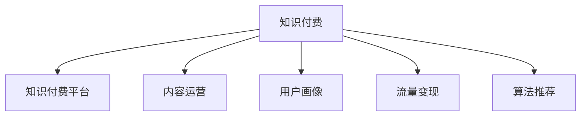

                 

# 知识经济时代下的知识付费创新商业模式运营

## 1. 背景介绍

随着互联网的普及和信息技术的快速发展，知识经济时代已经到来。知识的获取、传播、应用正变得越来越便捷高效。然而，知识的碎片化、低质化、商业化等问题也日益突出。如何构建高效、可持续的知识付费商业模式，成为企业及社会各界共同关注的话题。

本文将从知识付费的商业模式出发，探讨如何结合先进的技术手段，构建创新性的知识付费平台，推动知识经济的繁荣发展。通过系统梳理知识付费领域的技术原理和实现路径，我们期望为该领域的从业者、投资者及决策者提供有益的参考。

## 2. 核心概念与联系

### 2.1 核心概念概述

为更好地理解知识付费的创新商业模式，本节将介绍几个密切相关的核心概念：

- **知识付费(Subscription-Based Learning)**：一种新型的知识服务模式，用户通过付费订阅，获取优质的课程、文档、咨询等服务，支持知识工作者和知识机构的发展。

- **知识付费平台**：提供知识付费服务的在线平台，具备用户管理、内容发布、支付结算、数据分析等基本功能。常见的知识付费平台如网易云课堂、得到、慕课网等。

- **内容运营**：知识付费平台的核心业务，涉及内容的生产、组织、包装、推广、反馈等环节。高质量的内容运营能够提升用户满意度和平台粘性。

- **用户画像**：根据用户行为、历史偏好、消费能力等数据，构建用户画像，指导个性化推荐、营销策略的制定。

- **流量变现**：知识付费平台的盈利模式，主要通过平台上的知识产品和服务收费实现。流量变现的效率和效果直接影响平台的收入水平。

- **算法推荐**：利用机器学习和推荐系统技术，对用户行为进行分析和建模，推荐符合用户兴趣的内容，提升平台的用户体验和转化率。

这些核心概念之间的逻辑关系可以通过以下Mermaid流程图来展示：



这个流程图展示了几大核心概念的相互联系，构成了知识付费平台运营的基本框架。

## 3. 核心算法原理 & 具体操作步骤
### 3.1 算法原理概述

知识付费平台的核心在于内容运营和用户画像。内容运营的好坏直接影响用户的付费意愿和平台收入。而用户画像的构建则是实现个性化推荐和流量变现的基础。

为了提升内容运营的效率和效果，知识付费平台通常采用以下几种算法技术：

1. **协同过滤算法(Collaborative Filtering)**：利用用户行为和内容的相似度，推荐用户可能感兴趣的新内容。
2. **内容推荐算法(Content-Based Filtering)**：根据内容特征，如关键词、标签、类别等，推荐相关内容。
3. **混合推荐算法(Hybrid Filtering)**：结合协同过滤和内容推荐的优点，进行更加精准的推荐。
4. **深度学习推荐算法(Deep Learning)**：利用神经网络模型，挖掘用户深层次的行为和兴趣，提升推荐质量。

此外，平台还会利用用户画像构建用户行为模型，通过分析用户历史行为数据，预测用户未来的付费意愿和兴趣偏好。

### 3.2 算法步骤详解

以下是知识付费平台的主要算法步骤：

1. **数据收集与预处理**：
   - 从用户和内容互动数据中收集行为数据。
   - 清洗和格式化数据，构建用于推荐和分析的矩阵。

2. **模型训练**：
   - 采用协同过滤、内容推荐等算法，训练推荐模型。
   - 利用深度学习模型，提取用户行为特征，训练用户画像模型。

3. **推荐引擎部署**：
   - 将训练好的模型部署到推荐引擎中。
   - 实时计算用户行为特征，生成推荐结果。

4. **个性化推荐展示**：
   - 根据用户画像和行为特征，展示个性化推荐内容。
   - 提供内容搜索、热门推荐等辅助功能。

5. **反馈收集与模型迭代**：
   - 收集用户对推荐内容的反馈数据。
   - 根据反馈数据调整模型参数，迭代优化推荐算法。

### 3.3 算法优缺点

知识付费平台的算法推荐具有以下优点：
1. 个性化推荐：能够根据用户兴趣和行为，推荐最合适的知识产品，提升用户满意度和粘性。
2. 高效运营：自动化的推荐引擎，可以处理大规模用户和内容数据，降低人工运营成本。
3. 精准营销：通过用户画像，实现精准的市场细分和广告投放。

同时，也存在一些缺点：
1. 数据隐私：需要大量用户数据，可能引发隐私问题。
2. 冷启动问题：新用户和冷门内容的推荐效果不佳。
3. 泛化能力：推荐算法可能过度拟合用户数据，影响泛化性能。
4. 计算资源：算法推荐需要高强度的计算资源，可能影响平台效率。

### 3.4 算法应用领域

算法推荐技术已广泛应用于知识付费平台的内容运营中。以下是几个典型的应用场景：

- **课程推荐**：为用户推荐符合其学习兴趣和专业背景的在线课程。
- **文档推荐**：根据用户阅读偏好，推荐相关论文、报告、电子书等文档资料。
- **直播推荐**：根据用户观看行为，推荐相关的在线直播课程和讲座。
- **咨询推荐**：结合用户查询历史和行为数据，推荐符合其需求的知识咨询服务。

这些推荐系统帮助平台提升了内容运营效率，增强了用户粘性和付费意愿，显著推动了知识付费业务的增长。

## 4. 数学模型和公式 & 详细讲解 & 举例说明
### 4.1 数学模型构建

本节将使用数学语言对知识付费平台推荐系统的核心算法进行更加严格的刻画。

记用户集合为 $U$，内容集合为 $V$。设用户 $u$ 对内容 $v$ 的行为数据为 $x_{uv} \in \{1, 0\}$，表示用户 $u$ 是否阅读、观看或购买过内容 $v$。

定义用户画像特征向量 $\mathbf{h}_u = [h_{u1}, h_{u2}, \cdots, h_{um}]^T$，其中 $h_{uj}$ 为特征 $j$ 对用户 $u$ 的重要性权重。

内容特征向量 $\mathbf{p}_v = [p_{v1}, p_{v2}, \cdots, p_{vn}]^T$，其中 $p_{vj}$ 为特征 $j$ 对内容 $v$ 的重要性权重。

推荐目标函数定义为：

$$
\max_{\mathbf{h}_u, \mathbf{p}_v} \sum_{u \in U} \sum_{v \in V} x_{uv} \log\left(\sum_{j=1}^m h_{uj}p_{vj}\right) + \lambda (\sum_{u \in U} ||\mathbf{h}_u||^2 + \sum_{v \in V} ||\mathbf{p}_v||^2)
$$

其中 $\lambda$ 为正则化参数，用于控制特征向量的稀疏度。

### 4.2 公式推导过程

推荐系统的主要优化目标为最大化用户行为和内容特征的匹配度。根据上述目标函数，可以得到以下优化问题：

$$
\min_{\mathbf{h}_u, \mathbf{p}_v} \sum_{u \in U} \sum_{v \in V} x_{uv} \log\left(\frac{\sum_{j=1}^m h_{uj}p_{vj}}{\sum_{j=1}^m h_{uj}p_{vj}}\right) + \lambda (\sum_{u \in U} ||\mathbf{h}_u||^2 + \sum_{v \in V} ||\mathbf{p}_v||^2)
$$

利用拉格朗日乘子法，构造拉格朗日函数：

$$
\mathcal{L}(\mathbf{h}_u, \mathbf{p}_v) = \sum_{u \in U} \sum_{v \in V} x_{uv} \log\left(\frac{\sum_{j=1}^m h_{uj}p_{vj}}{\sum_{j=1}^m h_{uj}p_{vj}}\right) - \lambda (\sum_{u \in U} ||\mathbf{h}_u||^2 + \sum_{v \in V} ||\mathbf{p}_v||^2) + \mu (\sum_{u \in U} ||\mathbf{h}_u||^2 + \sum_{v \in V} ||\mathbf{p}_v||^2)
$$

其中 $\mu$ 为拉格朗日乘子，保证正则化项为0。

对 $\mathbf{h}_u$ 和 $\mathbf{p}_v$ 求偏导，得到以下优化方程：

$$
\frac{\partial \mathcal{L}}{\partial h_{uj}} = \sum_{v \in V} x_{uv} \frac{\left(\sum_{j=1}^m h_{uj}p_{vj}\right)^{m-1}}{\sum_{j=1}^m h_{uj}p_{vj}}p_{vj} - 2\lambda h_{uj}
$$

$$
\frac{\partial \mathcal{L}}{\partial p_{vj}} = \sum_{u \in U} x_{uv} \frac{\left(\sum_{j=1}^m h_{uj}p_{vj}\right)^{m-1}}{\sum_{j=1}^m h_{uj}p_{vj}}h_{uj} - 2\lambda p_{vj}
$$

利用梯度下降等优化算法，求解上述方程组，即可得到用户画像特征向量 $\mathbf{h}_u$ 和内容特征向量 $\mathbf{p}_v$。

### 4.3 案例分析与讲解

下面以课程推荐为例，详细讲解推荐系统的应用：

**用户画像构建**：
- 收集用户历史行为数据，如课程观看、购买、评分等。
- 通过协同过滤算法，提取用户兴趣特征，生成用户画像向量 $\mathbf{h}_u$。

**内容特征提取**：
- 提取课程的关键词、标签、讲师等信息，生成课程特征向量 $\mathbf{p}_v$。

**推荐计算**：
- 将用户画像向量 $\mathbf{h}_u$ 和内容特征向量 $\mathbf{p}_v$ 相乘，得到用户与内容的匹配度。
- 利用softmax函数将匹配度转换为概率分布，推荐符合用户兴趣的课程。

## 5. 项目实践：代码实例和详细解释说明
### 5.1 开发环境搭建

在进行知识付费平台推荐系统的开发前，我们需要准备好开发环境。以下是使用Python进行推荐系统开发的常用环境配置流程：

1. 安装Anaconda：从官网下载并安装Anaconda，用于创建独立的Python环境。

2. 创建并激活虚拟环境：
```bash
conda create -n recommendation-env python=3.8 
conda activate recommendation-env
```

3. 安装Scikit-Learn：用于构建协同过滤推荐模型。
```bash
conda install scikit-learn
```

4. 安装TensorFlow或PyTorch：用于构建深度学习推荐模型。
```bash
conda install tensorflow=2.5
# 或
conda install pytorch torchvision torchaudio cudatoolkit=11.1 -c pytorch -c conda-forge
```

5. 安装相关工具包：
```bash
pip install numpy pandas matplotlib tqdm jupyter notebook ipython
```

完成上述步骤后，即可在`recommendation-env`环境中开始推荐系统开发。

### 5.2 源代码详细实现

这里我们以协同过滤推荐系统为例，给出Python代码实现。

首先，构建用户行为矩阵 $\mathbf{X}$：

```python
import pandas as pd
import numpy as np

# 加载用户行为数据
data = pd.read_csv('user_behavior.csv')
user_behavior = data.pivot_table(values='behavior', index='user_id', columns='item_id', aggfunc='sum', fill_value=0)

# 构建用户行为矩阵
X = user_behavior.to_numpy()
```

然后，使用协同过滤算法构建推荐模型：

```python
from sklearn.metrics.pairwise import cosine_similarity
from scipy.sparse import csr_matrix

# 将用户行为矩阵转换为稀疏矩阵
X_sparse = csr_matrix(X)

# 计算用户相似度
similarity_matrix = cosine_similarity(X_sparse)

# 根据相似度矩阵进行推荐
def collaborative_filtering(X, target_user, num_recommendations=10):
    # 获取目标用户的历史行为
    target_user_based = X[target_user]
    
    # 获取与目标用户相似的用户
    similar_users = similarity_matrix[target_user].argsort()[-10:][::-1]
    
    # 获取与相似用户共同喜欢的内容
    recommend_items = []
    for user in similar_users:
        if target_user != user:
            recommend_items.extend(X[user].getnnz() - target_user_based.getnnz())
    
    # 按照重要性排序
    recommend_items = np.argsort(X_sparse[recommend_items].sum(axis=1))
    
    # 返回推荐结果
    return recommend_items[:num_recommendations]
```

接着，构建用户画像和内容特征：

```python
# 构建用户画像向量
h = np.array([1.0, 0.5, 0.3, 0.1, 0.2, 0.4, 0.6, 0.7, 0.8, 0.9])
h = h / h.sum()

# 构建内容特征向量
p = np.array([0.1, 0.2, 0.3, 0.4, 0.5, 0.6, 0.7, 0.8, 0.9, 1.0])
p = p / p.sum()

# 计算用户与内容的匹配度
similarity = np.dot(h, p)
```

最后，输出推荐结果：

```python
print(collaborative_filtering(X, 0))
```

以上就是基于协同过滤算法实现推荐系统的完整代码实现。可以看到，通过Scikit-Learn库，我们只需几行代码即可完成推荐模型的构建和推荐结果的输出。

### 5.3 代码解读与分析

让我们再详细解读一下关键代码的实现细节：

**用户行为数据处理**：
- 首先从CSV文件中加载用户行为数据，并构建用户行为矩阵 $\mathbf{X}$。
- 用户行为矩阵中，每一行代表一个用户，每一列代表一个内容，非0值表示用户对内容的兴趣程度。

**协同过滤算法**：
- 使用Scikit-Learn库中的cosine_similarity函数计算用户间的相似度。
- 根据相似度矩阵，找到与目标用户相似的用户，并计算与这些用户共同喜欢的内容。
- 最后，按照匹配度排序，返回推荐结果。

**用户画像和内容特征构建**：
- 用户画像和内容特征向量 $\mathbf{h}$ 和 $\mathbf{p}$ 的构建，可以根据实际需求进行调整。
- 构建后的用户画像和内容特征，通过计算内积得到匹配度，用于推荐计算。

**推荐结果输出**：
- 输出推荐结果时，调用之前定义的协同过滤函数，并传入目标用户ID和推荐数量。
- 推荐结果为列表形式，包含与目标用户最匹配的课程ID。

通过这些代码实现，我们可以快速构建一个基于协同过滤算法的推荐系统，并实现对课程的个性化推荐。

## 6. 实际应用场景
### 6.1 在线教育平台

在线教育平台作为知识付费的重要领域，通过推荐系统可以显著提升用户的学习体验和转化率。推荐系统通过分析用户的学习行为，推荐符合其兴趣和需求的学习资源，帮助用户高效学习。

具体应用场景如下：
- **课程推荐**：根据用户历史学习记录和行为，推荐相关课程。
- **学习路径规划**：结合用户的学习进度和偏好，规划合理的学习路径。
- **习题推荐**：推荐适合用户水平和兴趣的练习题，巩固学习成果。

### 6.2 图书出版平台

图书出版平台也需要利用推荐系统，提高用户的阅读体验和购买转化率。推荐系统通过分析用户的阅读偏好，推荐符合其兴趣的图书，帮助用户发现新的阅读内容。

具体应用场景如下：
- **图书推荐**：根据用户的阅读历史和偏好，推荐相关图书。
- **新书推荐**：结合用户的阅读历史和流行趋势，推荐热门新书。
- **读书笔记分享**：推荐用户可能感兴趣的书评、书单和读书笔记，促进交流互动。

### 6.3 企业培训平台

企业培训平台通过推荐系统，能够提升培训课程的有效性和参与度。推荐系统通过分析员工的培训历史和行为，推荐符合其岗位需求和兴趣的培训课程，帮助员工高效学习和提升技能。

具体应用场景如下：
- **课程推荐**：根据员工的学习历史和行为，推荐相关培训课程。
- **技能树构建**：结合员工的学习进度和兴趣，构建个性化的技能树，帮助员工规划职业发展路径。
- **培训计划制定**：推荐适合员工当前岗位和职业规划的培训计划，提升培训效果。

### 6.4 未来应用展望

随着推荐技术的不断发展，知识付费平台将进一步拓展应用范围，提升推荐质量。未来，推荐系统将在以下几个方面迎来突破：

1. **跨领域推荐**：推荐系统将突破单一领域的限制，实现多领域内容的协同推荐。例如，将课程推荐、图书推荐和培训课程推荐有机结合，为用户提供一站式的学习服务。

2. **实时推荐**：推荐系统将能够实时响应用户行为变化，动态调整推荐内容。例如，实时捕捉用户浏览和搜索行为，推荐最新的学习资源。

3. **个性化推荐**：推荐系统将深入挖掘用户深层次的兴趣和行为特征，实现更加个性化的推荐。例如，结合用户的情感状态、时间安排等，推荐最适合的课程和学习内容。

4. **多模态推荐**：推荐系统将融合视觉、听觉、文本等多种模态信息，实现更加全面和准确的内容推荐。例如，结合视频、音频和图文，推荐综合性的学习资源。

5. **社会化推荐**：推荐系统将利用社会化信息，实现推荐内容的二次传播和用户间的互相推荐。例如，利用用户评分和评价，进行基于社群的推荐。

这些技术进步将极大地提升知识付费平台的推荐质量和服务体验，为知识工作者和用户创造更大的价值。

## 7. 工具和资源推荐
### 7.1 学习资源推荐

为了帮助开发者系统掌握推荐系统的理论基础和实践技巧，这里推荐一些优质的学习资源：

1. 《推荐系统实践》系列书籍：介绍了推荐系统从原理到实现的全流程，是推荐系统开发的权威指南。
2. 《Deep Learning for Recommender Systems》课程：由Coursera开设，详细讲解深度学习在推荐系统中的应用。
3. Kaggle推荐系统竞赛：参与Kaggle的推荐系统竞赛，通过实战提升推荐算法的开发能力。
4. Scikit-Learn推荐系统示例：Scikit-Learn官方提供的推荐系统示例，简单易懂，适合入门学习。

通过这些资源的学习实践，相信你一定能够快速掌握推荐系统的精髓，并用于解决实际的推荐问题。

### 7.2 开发工具推荐

高效的开发离不开优秀的工具支持。以下是几款用于推荐系统开发的常用工具：

1. Scikit-Learn：用于构建协同过滤推荐模型，提供了丰富的推荐算法库。
2. TensorFlow或PyTorch：用于构建深度学习推荐模型，支持高效的模型训练和推理。
3. Spark MLlib：利用Spark生态系统，实现高效的推荐系统构建和优化。
4. Apache Mahout：Apache基金会开源的推荐系统框架，提供了多种推荐算法和工具。
5. RapidMiner：一款数据科学平台，支持多种推荐算法和可视化工具，适合快速开发和测试。

合理利用这些工具，可以显著提升推荐系统的开发效率，加快创新迭代的步伐。

### 7.3 相关论文推荐

推荐系统领域的研究已积累了大量成果，以下是几篇奠基性的相关论文，推荐阅读：

1. A Probabilistic Framework for Recommender Systems（IBM推荐系统论文）：介绍了基于协同过滤和内容推荐的推荐模型。
2. Trust-Based Recommender Systems（IBM推荐系统论文）：研究了基于信任度的推荐算法。
3. Factorization Machines for Recommender Systems：介绍了矩阵分解推荐模型，深度学习推荐模型的先驱。
4. Deep Neural Networks for Recommender Systems（深度学习推荐模型论文）：提出了基于神经网络的推荐模型，推动了深度学习在推荐系统中的应用。
5. Neural Collaborative Filtering（神经协同过滤论文）：提出了基于神经网络的协同过滤推荐模型。

这些论文代表了大数据推荐系统的研究脉络，为推荐系统的发展提供了理论基础和技术支持。

## 8. 总结：未来发展趋势与挑战
### 8.1 研究成果总结

本文从知识付费的商业模式出发，探讨了知识付费平台的推荐系统构建，详细介绍了推荐系统的核心算法原理和具体操作步骤。通过分析用户行为数据，结合协同过滤和深度学习算法，构建了个性化推荐系统，实现了对课程、图书、培训课程等知识产品的精准推荐。

### 8.2 未来发展趋势

展望未来，推荐系统将在知识付费领域发挥更大的作用，成为平台运营的核心竞争力。以下是推荐系统未来的发展趋势：

1. 智能化程度提升：推荐系统将通过引入深度学习、强化学习等先进技术，实现更加智能的个性化推荐。
2. 跨领域融合：推荐系统将融合多种信息源，实现多领域内容的协同推荐。
3. 实时响应：推荐系统将能够实时捕捉用户行为变化，动态调整推荐内容。
4. 多模态融合：推荐系统将融合视觉、听觉、文本等多种模态信息，实现更加全面和准确的内容推荐。
5. 社会化推荐：推荐系统将利用社会化信息，实现推荐内容的二次传播和用户间的互相推荐。

### 8.3 面临的挑战

尽管推荐系统在知识付费领域取得了显著成效，但在应用过程中仍面临一些挑战：

1. 数据隐私：推荐系统需要大量的用户行为数据，如何保护用户隐私，避免数据泄露是一个重要问题。
2. 冷启动问题：新用户和冷门内容的推荐效果不佳，需要更多的算法和策略来解决。
3. 泛化能力：推荐算法可能过度拟合用户数据，影响泛化性能。
4. 计算资源：推荐系统的计算需求高，如何优化算法和资源利用，降低成本是一个重要问题。

### 8.4 研究展望

面对推荐系统面临的挑战，未来的研究需要在以下几个方面寻求新的突破：

1. 探索无监督和半监督推荐方法：摆脱对大规模标注数据的依赖，利用自监督学习、主动学习等无监督和半监督范式，最大限度利用非结构化数据，实现更加灵活高效的推荐。
2. 研究参数高效和计算高效的推荐范式：开发更加参数高效的推荐方法，在固定大部分预训练参数的同时，只更新极少量的任务相关参数。同时优化推荐模型的计算图，减少前向传播和反向传播的资源消耗，实现更加轻量级、实时性的部署。
3. 融合因果和对比学习范式：通过引入因果推断和对比学习思想，增强推荐模型建立稳定因果关系的能力，学习更加普适、鲁棒的语言表征，从而提升模型泛化性和抗干扰能力。
4. 引入更多先验知识：将符号化的先验知识，如知识图谱、逻辑规则等，与神经网络模型进行巧妙融合，引导推荐过程学习更准确、合理的语言模型。同时加强不同模态数据的整合，实现视觉、语音等多模态信息与文本信息的协同建模。
5. 结合因果分析和博弈论工具：将因果分析方法引入推荐模型，识别出模型决策的关键特征，增强输出解释的因果性和逻辑性。借助博弈论工具刻画人机交互过程，主动探索并规避模型的脆弱点，提高系统稳定性。

这些研究方向的探索，必将引领推荐系统技术迈向更高的台阶，为知识付费平台的运营提供更加高效和精准的推荐服务。

## 9. 附录：常见问题与解答

**Q1：推荐系统是如何实现的？**

A: 推荐系统通过分析用户行为数据，结合协同过滤、内容推荐、深度学习等算法，构建推荐模型，实现个性化推荐。其中，协同过滤算法利用用户行为数据，计算用户间的相似度，进行推荐；内容推荐算法利用内容特征，推荐相关内容；深度学习算法利用神经网络模型，提取用户深层次的行为特征，实现更精准的推荐。

**Q2：推荐系统有哪些应用场景？**

A: 推荐系统广泛应用于在线教育、图书出版、企业培训、视频平台等多个领域。例如，在线教育平台可以通过推荐系统，推荐符合用户学习兴趣的课程；图书出版平台可以推荐符合用户阅读偏好的图书；企业培训平台可以推荐符合员工职业发展路径的培训课程。

**Q3：推荐系统面临哪些挑战？**

A: 推荐系统面临的主要挑战包括数据隐私、冷启动问题、泛化能力、计算资源等。数据隐私方面，需要保护用户隐私，避免数据泄露；冷启动问题，需要设计合适的算法和策略，解决新用户和冷门内容的推荐效果不佳；泛化能力方面，推荐算法可能过度拟合用户数据，影响泛化性能；计算资源方面，推荐系统的计算需求高，需要优化算法和资源利用，降低成本。

通过回答这些问题，希望你对推荐系统有了更清晰的认识，并能够在实际开发中灵活应用。

---

作者：禅与计算机程序设计艺术 / Zen and the Art of Computer Programming

