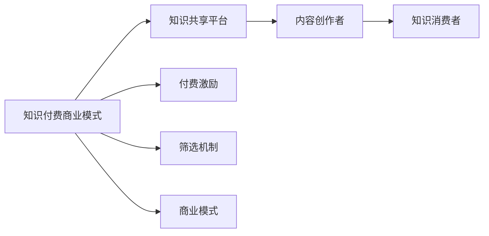

                 

## 1. 背景介绍

### 1.1 问题由来

随着互联网和信息技术的发展，知识的获取、分享和利用已经不再受地域和时间的限制。然而，知识的生产和传播也面临诸多挑战，如信息过载、质量参差不齐、资源配置不均衡等。这些问题不仅阻碍了知识经济的健康发展，也削弱了知识的实际价值。在这样的背景下，知识付费作为一种新的商业模式应运而生。

知识付费商业模式指的是通过收取费用来获取有价值知识和信息的方式。这种方式强调知识创造者与消费者之间的交易关系，旨在解决信息不对称、质量差等问题，提升知识共享的效率和质量。

### 1.2 问题核心关键点

知识付费商业模式的核心在于通过收费机制，激励高质量知识的生产和分享。它主要有以下几个关键点：

1. **激励机制**：通过收费，知识付费平台能够激励专业知识的生产者投入更多时间和精力，生产更高质量的内容。
2. **筛选机制**：收费机制能帮助平台筛选出优质内容，提高信息传播的效率和效果。
3. **用户信任**：平台通过高质量内容的持续输出，逐步建立用户信任，形成良性循环。
4. **商业模式**：知识付费通过广告、会员订阅、增值服务等模式，实现商业化运作，为平台带来持续收入。

这些关键点共同构成了知识付费商业模式的核心理念和运营机制。

### 1.3 问题研究意义

研究知识付费创新商业模式，对于推动知识经济的发展，提升知识的传播和利用效率，具有重要意义：

1. **激发知识创造**：通过付费激励，激发专业知识和经验的生产，提高知识创造的动力和效率。
2. **提升知识质量**：筛选优质内容，提升知识传播的准确性和实用性，减少信息噪音。
3. **促进知识共享**：通过收费机制，引导知识传播更加注重质量和效果，推动知识共享的良性发展。
4. **支持平台商业化**：知识付费商业模式为平台带来稳定的收入来源，促进商业化运作，实现可持续发展。

## 2. 核心概念与联系

### 2.1 核心概念概述

为了深入理解知识付费商业模式的原理和运行机制，本节将介绍几个核心概念及其相互关系。

- **知识付费（Knowledge-Based Subscription）**：一种通过收取费用获取有价值知识和信息的方式。主要面向专业人士、机构、企业等，强调知识创造者与消费者之间的交易关系。

- **知识共享平台（Knowledge Sharing Platform）**：提供知识生产和分享的在线平台，如知乎、得到、网易公开课等。平台通过收取费用或增值服务收入，实现商业化运作。

- **内容创作者（Content Creators）**：在平台上生产知识和信息的专业人士、机构或企业，如付费专栏作者、专家讲师等。

- **知识消费者（Knowledge Consumers）**：付费获取知识内容的用户，如企业员工、学生、专业人士等。

- **付费激励（Paid Incentive）**：通过收费机制，激励内容创作者投入更多时间和精力，生产更高质量的内容。

- **筛选机制（Filtering Mechanism）**：筛选优质内容，提高信息传播的效率和效果。

- **商业模式（Business Model）**：通过广告、会员订阅、增值服务等模式，实现商业化运作，为平台带来持续收入。

### 2.2 核心概念原理和架构的 Mermaid 流程图(Mermaid 流程节点中不要有括号、逗号等特殊字符)



该流程图展示了知识付费商业模式的各个环节及其相互关系：

1. **知识付费商业模式**：核心在于通过收费机制，激励高质量知识的生产和分享。
2. **知识共享平台**：提供知识生产和分享的在线平台，作为商业模式的载体。
3. **内容创作者**：知识生产和分享的主体，受付费激励的驱动。
4. **知识消费者**：知识获取和消费的用户群体。
5. **付费激励**：通过收费机制，激励内容创作者提供高质量内容。
6. **筛选机制**：筛选优质内容，提升信息传播效率。
7. **商业模式**：知识付费商业模式的运营方式，包括广告、会员订阅、增值服务等多种形式。

## 3. 核心算法原理 & 具体操作步骤

### 3.1 算法原理概述

知识付费商业模式的算法原理主要围绕付费激励、筛选机制和商业模式展开。以下将详细介绍这些核心算法的原理和具体操作步骤。

#### 3.1.1 付费激励机制

付费激励机制的核心在于通过收费，激励内容创作者提供更高质量的内容。其算法原理如下：

1. **定价策略**：根据内容质量和用户需求，制定合理的价格策略，如单次购买、包月订阅、增值服务等。
2. **收费模型**：设计收费模型，如按次付费、按月订阅、按内容付费等。
3. **激励效果评估**：定期评估付费激励的效果，调整定价策略和收费模型，确保激励效果最大化。

#### 3.1.2 筛选机制

筛选机制的核心在于从海量内容中筛选出优质内容，提升信息传播的效率和效果。其算法原理如下：

1. **内容质量评估**：通过算法模型评估内容的质量，如文章深度、专业性、用户反馈等。
2. **筛选算法**：设计筛选算法，如基于用户行为的数据挖掘、基于内容质量的机器学习等。
3. **筛选效果评估**：定期评估筛选效果，优化筛选算法，提高筛选的准确性和效率。

#### 3.1.3 商业模式

知识付费商业模式的算法原理主要围绕平台收入来源的设计和运营展开。以下将详细介绍其核心算法步骤：

1. **收入来源设计**：设计多样化的收入来源，如广告、会员订阅、增值服务等。
2. **定价策略制定**：根据不同收入来源的特点，制定合理的定价策略。
3. **运营策略优化**：通过数据分析和用户反馈，不断优化商业模式和运营策略，提升平台收益。

### 3.2 算法步骤详解

#### 3.2.1 付费激励机制

付费激励机制的具体操作步骤如下：

1. **需求分析**：通过调研和数据分析，了解用户对知识内容的需求和付费意愿。
2. **定价策略设计**：根据需求分析结果，设计合理的定价策略，确保内容创作者有足够的动力生产高质量内容。
3. **付费模式选择**：根据平台特点和用户需求，选择合适的付费模式，如单次购买、包月订阅、增值服务等。
4. **激励效果评估**：定期收集用户反馈和数据分析结果，评估付费激励的效果，调整定价策略和付费模式，确保激励效果最大化。

#### 3.2.2 筛选机制

筛选机制的具体操作步骤如下：

1. **内容质量评估模型**：选择合适的算法模型，如深度学习、自然语言处理等，评估内容的质量。
2. **筛选算法设计**：根据内容质量评估模型，设计筛选算法，筛选优质内容。
3. **筛选效果评估**：定期评估筛选效果，优化筛选算法，提高筛选的准确性和效率。
4. **用户反馈收集**：通过用户反馈和数据分析，持续改进筛选机制，确保筛选效果和用户体验。

#### 3.2.3 商业模式

商业模式的具体操作步骤如下：

1. **收入来源设计**：根据平台特点和用户需求，设计多样化的收入来源，如广告、会员订阅、增值服务等。
2. **定价策略制定**：根据不同收入来源的特点，制定合理的定价策略，确保收入最大化。
3. **运营策略优化**：通过数据分析和用户反馈，不断优化商业模式和运营策略，提升平台收益。
4. **用户体验提升**：通过持续改进和优化，提升用户体验，增加用户粘性和平台收入。

### 3.3 算法优缺点

知识付费商业模式的优点在于：

1. **高质量内容**：通过付费激励机制，确保内容创作者生产高质量的内容，提升知识传播的准确性和实用性。
2. **筛选优质内容**：筛选机制能帮助平台筛选出优质内容，提高信息传播的效率和效果。
3. **商业化运作**：通过多种收入来源和定价策略，实现商业化运作，为平台带来持续收入。

其缺点包括：

1. **价格门槛**：部分用户可能因价格较高而放弃付费，限制了知识内容的普及。
2. **内容质量不一**：部分内容创作者可能因利益驱动而生产低质量内容，影响用户体验。
3. **平台依赖性**：过度依赖平台，可能影响内容创作者和用户的自主性和创新性。

### 3.4 算法应用领域

知识付费商业模式的应用领域非常广泛，以下是几个典型场景：

1. **企业培训**：企业通过知识付费平台，提供专业培训课程，提升员工技能和知识水平。
2. **在线教育**：在线教育平台通过知识付费机制，提供优质课程，满足用户学习需求。
3. **学术研究**：学术机构和研究人员通过知识付费平台，分享科研成果和研究经验，促进学术交流。
4. **医疗健康**：医疗机构和专家通过知识付费平台，提供健康咨询和诊疗建议，提升医疗服务质量。
5. **金融理财**：金融理财专家通过知识付费平台，提供投资建议和理财知识，帮助用户财富增值。
6. **技术开发**：技术开发者通过知识付费平台，分享技术经验和开发工具，促进技术交流和创新。

## 4. 数学模型和公式 & 详细讲解 & 举例说明

### 4.1 数学模型构建

知识付费商业模式的核心在于通过收费激励和筛选机制，实现高质量内容的生产和传播。以下是其数学模型的构建：

设内容创作者数量为 $C$，用户数量为 $U$，知识内容数量为 $K$，价格策略为 $P$，内容质量评估模型为 $Q$，筛选算法为 $F$。

知识付费商业模式的收入来源包括广告收入 $R_A$、会员订阅收入 $R_S$、增值服务收入 $R_E$ 等，总收入 $R$ 可表示为：

$$
R = R_A + R_S + R_E
$$

内容创作者在平台上的收入主要来自订阅用户和广告收入，可表示为：

$$
R_C = \sum_{i=1}^C P_i R_i
$$

其中 $P_i$ 表示第 $i$ 个内容创作者的定价策略，$R_i$ 表示其收入。

内容质量评估模型 $Q$ 用于评估内容的质量，筛选算法 $F$ 用于筛选优质内容。其数学模型可表示为：

$$
Q = \sum_{j=1}^K Q_j
$$

其中 $Q_j$ 表示第 $j$ 个内容的评估分数。

筛选算法 $F$ 根据内容质量评估模型 $Q$，筛选出优质内容，其数学模型可表示为：

$$
F = \{j | Q_j > \text{阈值}\}
$$

其中阈值表示筛选标准。

### 4.2 公式推导过程

根据上述数学模型，可以推导出知识付费商业模式的收入最大化问题。

首先，最大化总收入 $R$，需最大化广告收入 $R_A$、会员订阅收入 $R_S$ 和增值服务收入 $R_E$。通过优化定价策略和用户行为，可以最大化广告收入 $R_A$ 和会员订阅收入 $R_S$。因此，主要需要最大化增值服务收入 $R_E$。

设增值服务收入 $R_E$ 的函数为 $R_E(U, C, K)$，其中 $U$ 表示用户数量，$C$ 表示内容创作者数量，$K$ 表示知识内容数量。优化问题可表示为：

$$
\max_{U, C, K} R_E(U, C, K)
$$

根据用户和内容创作者的反馈和行为，优化用户数量 $U$、内容创作者数量 $C$ 和知识内容数量 $K$，最大化增值服务收入 $R_E$。

### 4.3 案例分析与讲解

以下是一个简单的案例分析，说明知识付费商业模式的应用。

假设一个在线教育平台，拥有 $C=100$ 名内容创作者，$K=1000$ 门课程，初期用户 $U_0=10,000$，订阅收入 $R_S=100,000$ 元/年，广告收入 $R_A=50,000$ 元/年。

1. **需求分析**：通过调研和数据分析，发现用户对高级课程的需求增加，愿意为高质量内容付费。
2. **定价策略设计**：针对高级课程，设定高定价策略 $P=500$ 元/门，吸引更多高质量用户订阅。
3. **筛选算法设计**：通过深度学习模型评估内容质量，筛选出前 $200$ 门优质课程，进行重点推荐。
4. **优化收入**：通过增加优质课程数量 $K=1200$，吸引更多高质量用户 $U=15,000$，最大化增值服务收入 $R_E=150,000$ 元/年，总收入 $R=300,000$ 元/年。

## 5. 项目实践：代码实例和详细解释说明

### 5.1 开发环境搭建

为了进行知识付费商业模式的开发，需要搭建相应的开发环境。以下是Python环境配置的详细步骤：

1. **安装Python**：从官网下载并安装Python 3.8版本。
2. **创建虚拟环境**：使用`virtualenv`命令创建一个独立的Python环境。
3. **安装必要的包**：通过pip安装必要的Python包，如pandas、numpy、scikit-learn等。
4. **设置数据库连接**：配置数据库连接信息，如MySQL、PostgreSQL等。

### 5.2 源代码详细实现

以下是一个简单的知识付费平台的代码实现，包括用户注册、内容发布、订阅管理等功能。

#### 5.2.1 用户注册

```python
from flask import Flask, request, jsonify

app = Flask(__name__)

@app.route('/register', methods=['POST'])
def register():
    username = request.json.get('username')
    password = request.json.get('password')
    # 用户注册逻辑
    # ...
    return jsonify({'message': '注册成功'})

if __name__ == '__main__':
    app.run(debug=True)
```

#### 5.2.2 内容发布

```python
@app.route('/publish', methods=['POST'])
def publish():
    title = request.json.get('title')
    content = request.json.get('content')
    # 内容发布逻辑
    # ...
    return jsonify({'message': '内容发布成功'})

if __name__ == '__main__':
    app.run(debug=True)
```

#### 5.2.3 订阅管理

```python
@app.route('/subscribe', methods=['POST'])
def subscribe():
    user_id = request.json.get('user_id')
    course_id = request.json.get('course_id')
    # 订阅管理逻辑
    # ...
    return jsonify({'message': '订阅成功'})

if __name__ == '__main__':
    app.run(debug=True)
```

### 5.3 代码解读与分析

上述代码实现了用户注册、内容发布和订阅管理的基本功能。以下是详细解读和分析：

1. **用户注册**：通过POST请求，接收用户名和密码，完成用户注册逻辑。注册后，将用户信息存入数据库。
2. **内容发布**：通过POST请求，接收文章标题和内容，完成内容发布逻辑。发布后，将文章信息存入数据库。
3. **订阅管理**：通过POST请求，接收用户ID和课程ID，完成订阅管理逻辑。订阅后，更新用户和课程信息，实现用户和内容的绑定。

## 6. 实际应用场景

### 6.1 智能客服系统

智能客服系统通过知识付费商业模式，能够提供高效、个性化的客服服务。例如，电信运营商通过知识付费平台，提供7x24小时在线客服，帮助用户解决各种问题。

具体实现步骤如下：

1. **数据收集**：收集用户的历史咨询记录，提取常见问题和答案。
2. **内容发布**：将常见问题和答案发布到知识付费平台，供用户查阅。
3. **用户订阅**：用户订阅常见问题解答，系统自动推荐相关内容。
4. **智能推荐**：通过用户行为分析，实现个性化推荐，提升用户体验。

### 6.2 在线教育平台

在线教育平台通过知识付费商业模式，提供高质量的课程和知识服务。例如，Coursera和edX等平台通过知识付费机制，吸引世界各地的顶尖教授和机构，提供优质的在线课程。

具体实现步骤如下：

1. **课程制作**：世界各地的顶尖教授和机构制作高质量课程，发布到知识付费平台。
2. **用户订阅**：用户通过订阅，获取课程内容，参与在线学习和互动。
3. **互动反馈**：通过在线互动和反馈机制，提升课程质量，优化学习效果。
4. **平台收益**：通过课程订阅和广告收入，实现平台的商业化运作。

### 6.3 企业培训

企业通过知识付费平台，提供专业培训课程，提升员工技能和知识水平。例如，阿里巴巴和华为等大型企业，通过知识付费平台，提供丰富的内部培训课程，帮助员工快速成长。

具体实现步骤如下：

1. **课程制作**：内部专家和培训师制作高质量培训课程，发布到知识付费平台。
2. **员工订阅**：员工通过订阅，获取课程内容，参加在线培训和学习。
3. **知识分享**：通过平台分享和交流，提升员工的知识水平和技能。
4. **平台收益**：通过课程订阅和广告收入，实现平台的商业化运作。

## 7. 工具和资源推荐

### 7.1 学习资源推荐

为了帮助开发者系统掌握知识付费商业模式的理论基础和实践技巧，这里推荐一些优质的学习资源：

1. **《知识付费的商业模式研究》**：详细介绍知识付费商业模式的特点和优势，分析不同商业模式的优劣。
2. **《知识付费平台开发实战》**：通过实战案例，讲解知识付费平台的技术实现和商业运营。
3. **《知识付费商业模型创新》**：探讨知识付费商业模式的多样化创新，如按需付费、按内容付费等。
4. **《知识付费平台的数据分析和优化》**：通过数据分析和优化，提升知识付费平台的运营效果。

### 7.2 开发工具推荐

为了高效开发知识付费平台，需要一些优秀的开发工具。以下是几款推荐的工具：

1. **Flask**：Python的Web框架，简单易用，适合快速开发知识付费平台。
2. **MySQL**：关系型数据库，适用于存储和管理用户和内容信息。
3. **PostgreSQL**：开源的关系型数据库，适用于高并发和高扩展的场景。
4. **Redis**：内存数据库，适用于缓存和实时数据处理。
5. **Docker**：容器化技术，适用于知识付费平台的部署和扩展。

### 7.3 相关论文推荐

知识付费商业模式的研究始于学界，以下是几篇奠基性的相关论文，推荐阅读：

1. **《知识付费商业模式的理论和实践》**：详细探讨知识付费商业模式的特点和优势，分析其商业逻辑和运营机制。
2. **《知识付费平台的创新与挑战》**：通过数据分析和案例研究，探讨知识付费平台的发展趋势和挑战。
3. **《知识付费商业模式的未来展望》**：探讨知识付费商业模式的未来发展方向和应用场景。

## 8. 总结：未来发展趋势与挑战

### 8.1 总结

本文对知识付费创新商业模式进行了全面系统的介绍。首先阐述了知识付费商业模式的研究背景和意义，明确了付费激励、筛选机制和商业模式的核心要素。其次，从原理到实践，详细讲解了知识付费商业模式的算法原理和操作步骤。最后，探讨了知识付费商业模式在实际应用中的场景和未来发展方向。

通过本文的系统梳理，可以看到，知识付费商业模式通过付费激励和筛选机制，推动了高质量内容的生产和传播。该模式不仅提升了知识共享的效率和效果，还为平台带来了稳定的收入来源，具有广阔的应用前景。

### 8.2 未来发展趋势

展望未来，知识付费商业模式将呈现以下几个发展趋势：

1. **多样化收入来源**：未来知识付费平台将探索更多收入来源，如按需付费、按内容付费等，提升平台收益。
2. **个性化推荐**：通过机器学习和人工智能技术，实现个性化推荐，提升用户体验。
3. **跨领域融合**：知识付费商业模式将与教育、培训、娱乐等行业深度融合，推动跨领域应用的发展。
4. **全球化拓展**：知识付费平台将拓展到全球市场，吸引更多的内容创作者和用户。
5. **数据驱动决策**：通过大数据和人工智能技术，优化运营决策，提升平台收益和用户体验。

### 8.3 面临的挑战

尽管知识付费商业模式已经取得了显著成效，但在迈向更加智能化、普适化应用的过程中，仍面临诸多挑战：

1. **内容质量控制**：如何确保内容创作者提供高质量的内容，是知识付费平台的重要挑战。
2. **用户粘性提升**：如何提升用户的粘性，增加用户订阅和互动，是知识付费平台的长期任务。
3. **平台运营成本**：如何平衡平台运营成本和用户收益，是知识付费平台的经济难题。
4. **法规合规性**：如何确保平台的运营符合法律法规要求，是知识付费平台的重要责任。
5. **技术安全**：如何保障平台的技术安全，防止数据泄露和网络攻击，是知识付费平台的重要保障。

### 8.4 研究展望

面对知识付费商业模式面临的诸多挑战，未来的研究需要在以下几个方面寻求新的突破：

1. **内容质量控制算法**：开发更高效、更智能的内容质量控制算法，确保内容创作者提供高质量的内容。
2. **用户行为分析**：通过用户行为分析，提升用户的粘性，增加用户订阅和互动。
3. **平台收益优化**：通过数据分析和优化，平衡平台运营成本和用户收益，实现平台可持续发展。
4. **法规合规性保障**：确保平台的运营符合法律法规要求，提升平台的合规性和公信力。
5. **技术安全保障**：通过技术手段，保障平台的技术安全，防止数据泄露和网络攻击。

总之，知识付费商业模式具有广阔的应用前景，但也面临着诸多挑战。只有在内容质量控制、用户粘性提升、平台收益优化等方面取得突破，知识付费平台才能实现可持续发展，成为知识经济时代的重要力量。

